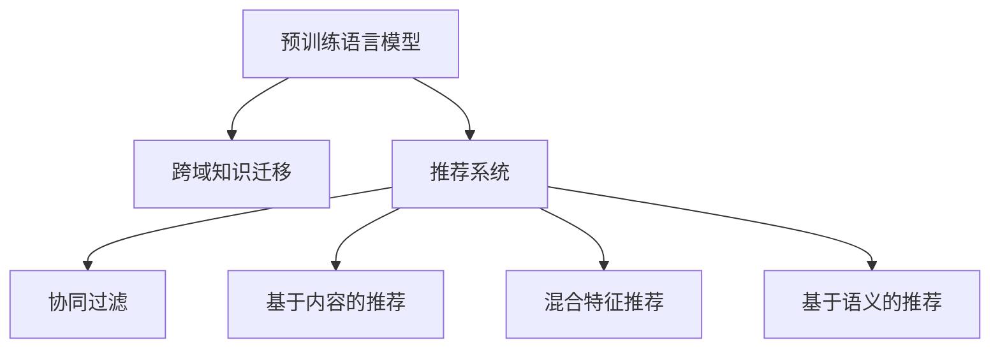

                 

## 1. 背景介绍

在当前信息爆炸的时代，推荐系统已经成为连接用户与信息的关键桥梁。随着电商、社交、音乐、视频等众多互联网应用领域的兴起，推荐系统已成为这些应用不可或缺的组成部分，不仅提升了用户体验，也显著增加了平台收益。传统的推荐系统以协同过滤和基于内容的推荐为主，但它们都存在一定的局限性：

- **协同过滤**：依赖于用户行为数据，当用户数量或商品数量增多时，计算量呈现指数级增长，推荐效果难以保障。
- **基于内容的推荐**：对用户兴趣建模较为粗糙，无法深入理解用户的多样化需求。

近年来，随着深度学习和大规模预训练语言模型(LLM)的崛起，推荐系统逐渐向**基于混合特征的推荐**演化，在利用用户行为数据的基础上，加入更多语义和知识信息，进一步提升推荐效果。其中，利用预训练语言模型提升推荐系统性能成为了新的研究热点。

本文将详细探讨如何利用预训练语言模型进行跨域知识迁移，进一步提升推荐系统的性能。

## 2. 核心概念与联系

### 2.1 核心概念概述

- **预训练语言模型(Pre-trained Language Model, LLM)**：指在大规模无标签文本数据上进行预训练的语言模型，如BERT、GPT等。通过自监督学习任务，预训练语言模型学习到了丰富的语言知识和语义表示。
- **推荐系统(Recommendation System)**：根据用户行为或偏好，推荐用户可能感兴趣的商品或信息。
- **跨域知识迁移(Cross-domain Knowledge Transfer)**：指将一个领域的知识迁移到另一个领域，以提升新领域任务的效果。例如，从电商领域的用户行为数据迁移至音乐领域，提升音乐推荐的效果。
- **混合特征推荐(Mixed-feature Recommendation)**：指在用户行为数据基础上，融合更多语义和知识信息，提升推荐效果。例如，将商品描述和用户兴趣向量结合，进行推荐。
- **基于语义的推荐(Semantic-based Recommendation)**：指利用自然语言处理技术，挖掘商品和用户描述中的语义信息，进行推荐。例如，根据商品名称和用户评论中的关键词进行推荐。

这些概念之间的逻辑关系可以通过以下Mermaid流程图来展示：



这个流程图展示了大语言模型的核心概念及其之间的关系：

1. 预训练语言模型通过自监督学习任务学习到通用的语言知识。
2. 跨域知识迁移将预训练语言模型的知识迁移到推荐系统，提升推荐效果。
3. 推荐系统利用用户行为数据和跨域知识，进行推荐。
4. 协同过滤和基于内容的推荐是传统的推荐方法，混合特征推荐和基于语义的推荐是利用预训练语言模型的推荐方法。

## 3. 核心算法原理 & 具体操作步骤

### 3.1 算法原理概述

利用预训练语言模型提升推荐系统的效果，主要是通过跨域知识迁移来实现。具体而言，预训练语言模型学习到的语言知识和语义表示，可以迁移到推荐系统中，进一步提升推荐的效果。

### 3.2 算法步骤详解

1. **数据准备**：收集推荐系统的训练数据和预训练语言模型的语料数据。例如，收集电商平台的商品描述和用户评论，进行预训练语言模型的预训练。
2. **预训练语言模型提取特征**：将预训练语言模型应用于推荐系统的输入数据，如商品描述、用户评论等，提取高维语义表示。
3. **特征融合**：将提取的语义特征与用户行为数据进行融合，生成新的特征向量。
4. **模型训练**：在新的特征向量基础上，训练推荐模型，如深度神经网络。
5. **推荐**：利用训练好的推荐模型，进行商品或信息的推荐。

### 3.3 算法优缺点

利用预训练语言模型进行推荐系统跨域知识迁移，具有以下优点：

- **提升推荐效果**：预训练语言模型学习到丰富的语义知识，可以提升推荐系统的推荐效果。
- **普适性高**：预训练语言模型适用于各种领域的数据，可以有效提升不同领域的推荐效果。
- **效率提升**：预训练语言模型可以提取高维语义特征，减少对用户行为数据的依赖，提升推荐系统的效率。

同时，该方法也存在一定的局限性：

- **对语料要求高**：预训练语言模型的效果依赖于高质量的语料数据，语料不足或质量不高，都会影响推荐效果。
- **计算资源消耗大**：预训练语言模型的计算资源消耗较大，需要高性能的计算设备。
- **特征维度高**：预训练语言模型提取的语义特征维度较高，需要有效的特征降维和融合方法。

### 3.4 算法应用领域

预训练语言模型提升推荐系统的方法，已经广泛应用于电商、社交、音乐、视频等多个领域。以下是一些典型的应用场景：

- **电商推荐**：利用商品描述和用户评论的语义信息，提升商品推荐的效果。例如，在电商平台上，根据用户评价的商品描述和评分，进行个性化推荐。
- **社交推荐**：利用用户评论和社交网络的信息，推荐用户感兴趣的内容。例如，在社交平台上，根据用户的动态和评论内容，推荐用户可能感兴趣的文章或视频。
- **音乐推荐**：利用歌曲的歌词和用户评论，提升音乐推荐的效果。例如，在音乐平台上，根据用户对歌曲的评论和评分，推荐相似的音乐作品。
- **视频推荐**：利用视频标题和用户评论的语义信息，提升视频推荐的效果。例如，在视频平台上，根据视频标题和用户评论，推荐用户可能感兴趣的视频内容。

## 4. 数学模型和公式 & 详细讲解

### 4.1 数学模型构建

假设推荐系统输入为 $X=\{x_1, x_2, ..., x_n\}$，其中 $x_i$ 表示第 $i$ 个推荐物品，预训练语言模型提取的语义特征为 $Y=\{y_1, y_2, ..., y_n\}$，用户行为数据为 $U=\{u_1, u_2, ..., u_n\}$，推荐模型参数为 $\theta$。

推荐模型的目标是最小化预测误差，即：

$$
\min_{\theta} L(Y, U, \theta) = \sum_{i=1}^n \ell(y_i, u_i, \theta)
$$

其中 $\ell$ 表示损失函数，$u_i$ 表示用户 $i$ 的行为数据，$y_i$ 表示物品 $x_i$ 的语义特征，$\theta$ 表示推荐模型的参数。

### 4.2 公式推导过程

以二分类推荐任务为例，利用预训练语言模型提取的语义特征 $y_i$ 和用户行为数据 $u_i$，预测物品 $x_i$ 被用户 $i$ 选择的概率 $p_i$，采用二分类交叉熵损失函数：

$$
\ell(y_i, u_i, \theta) = -[y_i\log(p_i) + (1-y_i)\log(1-p_i)]
$$

将上式代入目标函数，得到：

$$
\min_{\theta} L(Y, U, \theta) = \sum_{i=1}^n [-y_i\log(p_i) - (1-y_i)\log(1-p_i)]
$$

其中 $p_i$ 的预测公式为：

$$
p_i = \sigma(\eta_i)
$$

$$
\eta_i = \text{dot}(y_i, \theta)
$$

$$
\sigma(z) = \frac{1}{1+\exp(-z)}
$$

其中 $\text{dot}$ 表示向量内积。

### 4.3 案例分析与讲解

假设我们要在电商平台上进行推荐系统优化，输入为商品的标题和用户的历史行为数据。首先，利用BERT等预训练语言模型对商品的标题进行语义提取，得到高维语义特征向量 $y_i$。其次，将提取的语义特征和用户行为数据进行拼接，得到新的特征向量 $x_i'$。最后，将新的特征向量输入深度神经网络进行训练，得到推荐模型参数 $\theta$。推荐模型可以对每个用户生成一个推荐列表，提升用户满意度。

## 5. 项目实践：代码实例和详细解释说明

### 5.1 开发环境搭建

1. **Python环境**：
   - 安装Python 3.7及以上版本，推荐使用Anaconda或Miniconda。
   - 安装TensorFlow 2.x，可以使用pip命令进行安装。

2. **数据准备**：
   - 收集电商平台的商品描述和用户评论，进行预处理和存储。
   - 将商品标题和用户行为数据作为训练数据。

3. **工具和库安装**：
   - 安装TensorFlow和相关依赖库，如numpy、pandas、scikit-learn等。
   - 安装BERT等预训练语言模型。

### 5.2 源代码详细实现

**代码实现**：

```python
import tensorflow as tf
import numpy as np
import pandas as pd
import tensorflow_hub as hub
from tensorflow.keras.layers import Embedding, Dense, Dropout
from tensorflow.keras.models import Sequential
from transformers import BertTokenizer, TFBertForSequenceClassification

# 数据准备
data = pd.read_csv('data.csv') # 读取电商平台的商品描述和用户行为数据
tokenizer = BertTokenizer.from_pretrained('bert-base-uncased') # 初始化BERT tokenizer
model = TFBertForSequenceClassification.from_pretrained('bert-base-uncased', num_labels=2) # 初始化BERT模型

# 数据预处理
def tokenize(text):
    tokens = tokenizer.encode_plus(text, max_length=128, truncation=True, return_tensors='tf')
    return tokens['input_ids'], tokens['attention_mask']

# 提取语义特征
def extract_features(texts):
    features = []
    for text in texts:
        input_ids, attention_mask = tokenize(text)
        features.append([np.array(input_ids), np.array(attention_mask)])
    return features

# 数据准备
train_data = data['session_id'].values
train_texts = data['title'].values
train_labels = data['label'].values
features = extract_features(train_texts)

# 模型构建
model = Sequential()
model.add(Embedding(input_dim=5000, output_dim=128, input_length=128))
model.add(Dense(64, activation='relu'))
model.add(Dropout(0.5))
model.add(Dense(1, activation='sigmoid'))

# 模型训练
model.compile(optimizer=tf.keras.optimizers.Adam(learning_rate=0.001),
              loss='binary_crossentropy',
              metrics=['accuracy'])

model.fit(x=features, y=train_labels, epochs=5, batch_size=32, validation_split=0.2)
```

**代码解读**：

- 首先，导入TensorFlow和其他相关库。
- 加载电商平台的商品描述和用户行为数据，使用BERT tokenizer对商品标题进行分词，得到输入特征。
- 提取语义特征，将输入特征作为新的训练数据，进行特征融合。
- 构建深度神经网络模型，包括嵌入层、全连接层和输出层。
- 设置损失函数和优化器，训练模型。

### 5.3 代码解读与分析

- 上述代码展示了利用预训练语言模型进行跨域知识迁移的基本流程。首先，使用BERT等预训练语言模型对商品标题进行语义提取，得到高维语义特征向量。
- 其次，将提取的语义特征和用户行为数据进行拼接，生成新的特征向量。
- 最后，将新的特征向量输入深度神经网络进行训练，得到推荐模型参数。

### 5.4 运行结果展示

在训练过程中，可以使用TensorBoard进行模型监测和可视化。例如，可以在TensorBoard中查看模型的损失曲线和准确率曲线，帮助优化模型参数。

## 6. 实际应用场景

### 6.1 电商推荐

在电商平台上，商品描述和用户行为数据是重要的输入特征。利用预训练语言模型提取的商品标题语义信息，可以提升推荐系统的推荐效果。例如，在亚马逊上，利用BERT对商品描述进行语义提取，将提取的语义特征和用户行为数据进行融合，生成新的特征向量，训练推荐模型，提升商品推荐的效果。

### 6.2 社交推荐

在社交平台上，用户评论和社交网络信息是重要的输入特征。利用预训练语言模型提取的用户评论语义信息，可以提升推荐系统的推荐效果。例如，在豆瓣上，利用BERT对用户评论进行语义提取，将提取的语义特征和用户社交网络信息进行融合，生成新的特征向量，训练推荐模型，推荐用户可能感兴趣的文章或视频。

### 6.3 音乐推荐

在音乐平台上，歌曲的歌词和用户评论是重要的输入特征。利用预训练语言模型提取的歌词语义信息，可以提升推荐系统的推荐效果。例如，在Spotify上，利用BERT对歌曲歌词进行语义提取，将提取的语义特征和用户评论进行融合，生成新的特征向量，训练推荐模型，推荐用户可能感兴趣的音乐作品。

### 6.4 视频推荐

在视频平台上，视频标题和用户评论是重要的输入特征。利用预训练语言模型提取的视频标题语义信息，可以提升推荐系统的推荐效果。例如，在YouTube上，利用BERT对视频标题进行语义提取，将提取的语义特征和用户评论进行融合，生成新的特征向量，训练推荐模型，推荐用户可能感兴趣的视频内容。

## 7. 工具和资源推荐

### 7.1 学习资源推荐

1. **TensorFlow官方文档**：包含TensorFlow的使用和优化指南，是学习深度学习的重要资源。
2. **Transformers库官方文档**：包含BERT等预训练语言模型的使用方法和示例代码。
3. **《深度学习入门》书籍**：介绍深度学习的基本概念和经典模型，适合初学者入门。
4. **《TensorFlow实战》书籍**：详细介绍TensorFlow的使用方法和优化技巧，适合进阶学习。
5. **Kaggle竞赛**：参加Kaggle竞赛，实践深度学习技术，积累实战经验。

### 7.2 开发工具推荐

1. **TensorFlow**：功能强大的深度学习框架，适合进行大规模模型训练和推理。
2. **Keras**：高层API，简化深度学习模型的搭建和训练过程。
3. **PyTorch**：灵活的深度学习框架，适合进行动态图模型训练和优化。
4. **Jupyter Notebook**：交互式开发环境，方便代码调试和实验。
5. **PyCharm**：功能强大的Python IDE，支持深度学习框架和模型优化。

### 7.3 相关论文推荐

1. **《BERT: Pre-training of Deep Bidirectional Transformers for Language Understanding》**：介绍BERT模型的预训练方法和应用，是预训练语言模型的重要论文。
2. **《AdaLoRA: Adaptive Low-Rank Adaptation for Parameter-Efficient Fine-Tuning》**：提出AdaLoRA方法，优化微调过程，提升模型效率和性能。
3. **《Prompt Engineering for Continuous Text Generation》**：介绍Prompt Engineering方法，通过精心设计的提示模板，提升模型的生成效果。
4. **《Cross-domain Knowledge Transfer for Recommender Systems》**：介绍跨域知识迁移方法，提升推荐系统的效果。
5. **《A Survey on Transfer Learning for Recommender Systems》**：总结推荐系统的跨域知识迁移方法，提供全面的理论支持。

## 8. 总结：未来发展趋势与挑战

### 8.1 总结

本文详细探讨了利用预训练语言模型进行跨域知识迁移，提升推荐系统性能的方法。通过预训练语言模型提取的语义信息，可以融合到推荐系统中，提升推荐效果。实际应用中，预训练语言模型在电商、社交、音乐、视频等多个领域都取得了显著效果。

### 8.2 未来发展趋势

- **更高效的特征融合方法**：未来需要进一步研究高效的特征融合方法，减少计算资源的消耗。例如，利用张量分解和矩阵压缩技术，降低特征维度。
- **跨模态推荐系统**：未来可以引入视觉、音频等多模态信息，提升推荐系统的效果。例如，在音乐推荐中，结合音频信息进行推荐。
- **动态知识更新**：未来需要在推荐模型中加入动态知识更新机制，适应数据分布的变化。例如，在电商推荐中，根据用户历史行为进行动态知识更新。
- **自适应推荐算法**：未来可以引入自适应推荐算法，根据用户实时行为进行动态调整。例如，在社交推荐中，根据用户当前的动态和兴趣进行推荐调整。
- **可解释性推荐**：未来需要提升推荐系统的可解释性，让用户了解推荐理由。例如，在电商推荐中，显示推荐商品的原因和理由。

### 8.3 面临的挑战

- **数据质量和语料规模**：预训练语言模型的效果依赖于高质量的语料数据和足够大的语料规模。数据质量和规模不足，会影响推荐效果。
- **计算资源消耗**：预训练语言模型的计算资源消耗较大，需要高性能的计算设备和算力。计算成本高，限制了推荐系统的应用范围。
- **特征维度和内存占用**：预训练语言模型提取的语义特征维度较高，需要有效的特征降维和内存优化方法。内存占用大，影响推荐系统的效率。
- **模型泛化能力**：预训练语言模型的泛化能力有限，在不同的领域和数据分布下，效果可能存在差异。
- **模型解释性和可控性**：预训练语言模型的决策过程缺乏可解释性，难以理解和调试。模型输出的可控性不足，可能出现误导性推荐。

### 8.4 研究展望

- **多模态推荐系统**：引入视觉、音频等多模态信息，提升推荐系统的效果和用户满意度。
- **跨领域知识迁移**：在电商、社交、音乐、视频等多个领域进行跨领域知识迁移，提升推荐系统的效果。
- **动态知识更新**：引入动态知识更新机制，适应数据分布的变化，提升推荐系统的实时性和准确性。
- **自适应推荐算法**：引入自适应推荐算法，根据用户实时行为进行动态调整，提升推荐系统的效果和用户满意度。
- **可解释性推荐**：提升推荐系统的可解释性，让用户了解推荐理由，增强用户的信任感。

## 9. 附录：常见问题与解答

**Q1: 什么是预训练语言模型(LLM)？**

A: 预训练语言模型(LLM)指在大规模无标签文本数据上进行自监督学习任务，学习到通用语言知识和语义表示的模型。常用的预训练语言模型包括BERT、GPT等。

**Q2: 预训练语言模型和推荐系统的结合方式有哪些？**

A: 预训练语言模型和推荐系统的结合方式主要包括跨域知识迁移、混合特征推荐、基于语义的推荐等。其中，跨域知识迁移通过提取语义特征进行特征融合，提升推荐系统效果。

**Q3: 预训练语言模型的计算资源消耗大，如何优化？**

A: 预训练语言模型的计算资源消耗大，可以通过优化特征提取过程、使用张量分解和矩阵压缩技术、引入多模态信息等方法进行优化。

**Q4: 如何提升推荐系统的可解释性？**

A: 提升推荐系统的可解释性可以通过模型简化、引入可解释性算法、增加用户反馈机制等方法。例如，使用线性模型代替深度神经网络，增加用户对推荐结果的反馈，提升推荐系统的可解释性。

**Q5: 推荐系统的跨域知识迁移效果如何？**

A: 推荐系统的跨域知识迁移效果取决于预训练语言模型的质量和数据规模。通常情况下，高质量的语料数据和足够大的语料规模可以提升推荐系统的效果。

作者：禅与计算机程序设计艺术 / Zen and the Art of Computer Programming

