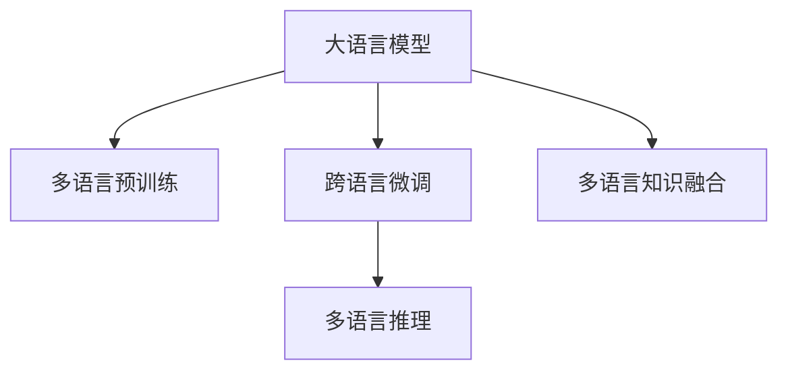

                 

# 利用LLM提升推荐系统的跨语言推荐能力

> 关键词：

## 1. 背景介绍

### 1.1 问题由来
在当今全球化的时代，语言是连接不同文化和市场的桥梁。推荐系统作为电商平台的核心技术之一，面临日益增长的跨语言推荐需求。传统的推荐系统往往仅支持单一语言，无法充分利用多语言数据，限制了推荐效果和用户覆盖面。如何提升推荐系统的跨语言推荐能力，成为智能推荐领域的热点研究方向。

大语言模型（Large Language Models，LLMs），如GPT-3、BERT等，以其卓越的自然语言处理能力，正逐步成为推荐系统的重要技术支持。利用LLM，推荐系统可以在不增加额外数据标注成本的情况下，通过多语言预训练和微调，提升跨语言推荐性能。本文将探讨如何利用大语言模型提升推荐系统的跨语言推荐能力，并详细介绍其实现原理和具体步骤。

### 1.2 问题核心关键点
大语言模型提升推荐系统跨语言推荐能力的核心在于：

1. 多语言预训练：利用多语言语料对预训练模型进行预训练，使其掌握多种语言的基本语义和语法规则。
2. 跨语言微调：将多语言预训练模型应用于不同语言的推荐任务，通过微调模型参数，提升跨语言推荐效果。
3. 多语言推理：利用LLM的高级语言理解能力，结合多语言语义信息，进行更精准的推荐推理。
4. 多语言知识融合：结合多语言知识图谱、规则库等信息源，增强推荐系统的知识丰富度和通用性。

## 2. 核心概念与联系

### 2.1 核心概念概述

为更好地理解大语言模型在推荐系统中的应用，本节将介绍几个关键概念及其联系：

- 大语言模型（LLM）：以自回归（如GPT-3）或自编码（如BERT）模型为代表的深度神经网络，经过海量无标签文本数据的预训练，具有强大的语言理解能力。
- 推荐系统：通过分析用户的历史行为数据，为每个用户推荐可能感兴趣的物品或内容。推荐系统广泛应用于电商、社交、新闻等领域。
- 多语言预训练：利用多语言语料对预训练模型进行预训练，使其掌握多种语言的基本语义和语法规则。
- 跨语言微调：将多语言预训练模型应用于不同语言的推荐任务，通过微调模型参数，提升跨语言推荐效果。
- 多语言推理：利用LLM的高级语言理解能力，结合多语言语义信息，进行更精准的推荐推理。
- 多语言知识融合：结合多语言知识图谱、规则库等信息源，增强推荐系统的知识丰富度和通用性。

这些核心概念之间的逻辑关系可以通过以下Mermaid流程图来展示：



这个流程图展示了大语言模型在推荐系统中的应用框架：

1. 大语言模型通过多语言预训练获得跨语言的基本语义能力。
2. 利用多语言预训练模型，通过跨语言微调，提升特定语言的推荐效果。
3. 结合多语言语义信息，进行更精准的推荐推理。
4. 将多语言知识图谱、规则库等信息源与LLM结合，增强推荐系统的知识丰富度和通用性。

## 3. 核心算法原理 & 具体操作步骤

### 3.1 算法原理概述

利用大语言模型提升推荐系统的跨语言推荐能力，核心在于通过多语言预训练和微调，让模型能够理解和处理多语言的文本数据。具体来说，分为以下几个步骤：

1. **多语言预训练**：使用多语言语料对预训练模型进行预训练，使其学习到多语言的基本语义和语法规则。
2. **跨语言微调**：将多语言预训练模型应用于不同语言的推荐任务，通过微调模型参数，提升跨语言推荐效果。
3. **多语言推理**：利用LLM的高级语言理解能力，结合多语言语义信息，进行更精准的推荐推理。
4. **多语言知识融合**：结合多语言知识图谱、规则库等信息源，增强推荐系统的知识丰富度和通用性。

### 3.2 算法步骤详解

#### 3.2.1 多语言预训练

多语言预训练的目的是让模型能够理解多语言的语义和语法。具体步骤如下：

1. **语料收集**：收集多语言语料，包括不同语言的新闻、书籍、网络文本等。
2. **数据处理**：将多语言文本转换为统一的编码格式，并进行分词、清洗等预处理。
3. **预训练模型选择**：选择合适的预训练模型，如BERT、GPT-3等。
4. **预训练流程**：在多语言语料上对预训练模型进行预训练，通常使用自监督任务，如掩码语言模型（Masked Language Model，MLM）、下一句预测（Next Sentence Prediction，NSP）等。

```python
from transformers import BertTokenizer, BertForMaskedLM, Trainer, TrainingArguments
from datasets import load_dataset
import torch

# 加载BERT模型和分词器
tokenizer = BertTokenizer.from_pretrained('bert-base-multilingual-uncased')
model = BertForMaskedLM.from_pretrained('bert-base-multilingual-uncased')

# 加载多语言语料
train_dataset = load_dataset('wmt14', 'train', split='all')
val_dataset = load_dataset('wmt14', 'valid', split='all')

# 定义训练函数
def train_epoch(model, dataset, batch_size, optimizer):
    model.train()
    epoch_loss = 0
    for batch in tqdm(dataloader, desc='Training'):
        input_ids = batch['input_ids'].to(device)
        attention_mask = batch['attention_mask'].to(device)
        masked_lm_labels = batch['masked_lm_labels'].to(device)
        outputs = model(input_ids, attention_mask=attention_mask, labels=masked_lm_labels)
        loss = outputs.loss
        epoch_loss += loss.item()
        loss.backward()
        optimizer.step()
    return epoch_loss / len(dataloader)

# 定义评估函数
def evaluate(model, dataset, batch_size):
    model.eval()
    preds, labels = [], []
    with torch.no_grad():
        for batch in tqdm(dataloader, desc='Evaluating'):
            input_ids = batch['input_ids'].to(device)
            attention_mask = batch['attention_mask'].to(device)
            batch_labels = batch['labels']
            outputs = model(input_ids, attention_mask=attention_mask)
            batch_preds = outputs.logits.argmax(dim=2).to('cpu').tolist()
            batch_labels = batch_labels.to('cpu').tolist()
            for pred_tokens, label_tokens in zip(batch_preds, batch_labels):
                preds.append(pred_tokens[:len(label_tokens)])
                labels.append(label_tokens)
    
    print(classification_report(labels, preds))
```

#### 3.2.2 跨语言微调

跨语言微调的目标是提升模型在特定语言上的推荐效果。具体步骤如下：

1. **任务适配层设计**：根据目标语言的任务类型，设计相应的输出层和损失函数。
2. **数据集准备**：收集目标语言的推荐数据集，并准备相应的训练集、验证集和测试集。
3. **微调参数选择**：选择合适的微调参数，如学习率、批大小、迭代轮数等。
4. **微调过程**：在目标语言的推荐数据集上对模型进行微调，更新模型参数。

```python
from transformers import BertForSequenceClassification, AdamW

# 加载多语言预训练模型
tokenizer = BertTokenizer.from_pretrained('bert-base-multilingual-uncased')
model = BertForSequenceClassification.from_pretrained('bert-base-multilingual-uncased', num_labels=num_labels)

# 加载目标语言的推荐数据集
train_dataset = NERDataset(train_texts, train_tags, tokenizer)
val_dataset = NERDataset(dev_texts, dev_tags, tokenizer)
test_dataset = NERDataset(test_texts, test_tags, tokenizer)

# 定义训练函数
def train_epoch(model, dataset, batch_size, optimizer):
    model.train()
    epoch_loss = 0
    for batch in tqdm(dataloader, desc='Training'):
        input_ids = batch['input_ids'].to(device)
        attention_mask = batch['attention_mask'].to(device)
        labels = batch['labels'].to(device)
        model.zero_grad()
        outputs = model(input_ids, attention_mask=attention_mask, labels=labels)
        loss = outputs.loss
        epoch_loss += loss.item()
        loss.backward()
        optimizer.step()
    return epoch_loss / len(dataloader)

# 定义评估函数
def evaluate(model, dataset, batch_size):
    model.eval()
    preds, labels = [], []
    with torch.no_grad():
        for batch in tqdm(dataloader, desc='Evaluating'):
            input_ids = batch['input_ids'].to(device)
            attention_mask = batch['attention_mask'].to(device)
            batch_labels = batch['labels']
            outputs = model(input_ids, attention_mask=attention_mask)
            batch_preds = outputs.logits.argmax(dim=2).to('cpu').tolist()
            batch_labels = batch_labels.to('cpu').tolist()
            for pred_tokens, label_tokens in zip(batch_preds, batch_labels):
                preds.append(pred_tokens[:len(label_tokens)])
                labels.append(label_tokens)

    print(classification_report(labels, preds))
```

#### 3.2.3 多语言推理

多语言推理的目的是利用LLM的高级语言理解能力，结合多语言语义信息，进行更精准的推荐推理。具体步骤如下：

1. **多语言文本输入**：将不同语言的推荐信息作为输入，统一转换为LLM支持的编码格式。
2. **LLM推理**：将多语言文本输入到LLM中进行推理，得到多语言语义向量。
3. **多语言信息融合**：结合多语言语义信息，进行更精准的推荐推理。

```python
from transformers import BertTokenizer, BertForSequenceClassification, AdamW
from datasets import load_dataset

# 加载多语言预训练模型和分词器
tokenizer = BertTokenizer.from_pretrained('bert-base-multilingual-uncased')
model = BertForSequenceClassification.from_pretrained('bert-base-multilingual-uncased', num_labels=num_labels)

# 加载多语言语料
train_dataset = load_dataset('wmt14', 'train', split='all')
val_dataset = load_dataset('wmt14', 'valid', split='all')
test_dataset = load_dataset('wmt14', 'test', split='all')

# 定义训练函数
def train_epoch(model, dataset, batch_size, optimizer):
    model.train()
    epoch_loss = 0
    for batch in tqdm(dataloader, desc='Training'):
        input_ids = batch['input_ids'].to(device)
        attention_mask = batch['attention_mask'].to(device)
        labels = batch['labels'].to(device)
        model.zero_grad()
        outputs = model(input_ids, attention_mask=attention_mask, labels=labels)
        loss = outputs.loss
        epoch_loss += loss.item()
        loss.backward()
        optimizer.step()
    return epoch_loss / len(dataloader)

# 定义评估函数
def evaluate(model, dataset, batch_size):
    model.eval()
    preds, labels = [], []
    with torch.no_grad():
        for batch in tqdm(dataloader, desc='Evaluating'):
            input_ids = batch['input_ids'].to(device)
            attention_mask = batch['attention_mask'].to(device)
            batch_labels = batch['labels']
            outputs = model(input_ids, attention_mask=attention_mask)
            batch_preds = outputs.logits.argmax(dim=2).to('cpu').tolist()
            batch_labels = batch_labels.to('cpu').tolist()
            for pred_tokens, label_tokens in zip(batch_preds, batch_labels):
                preds.append(pred_tokens[:len(label_tokens)])
                labels.append(label_tokens)

    print(classification_report(labels, preds))
```

#### 3.2.4 多语言知识融合

多语言知识融合的目的是结合多语言知识图谱、规则库等信息源，增强推荐系统的知识丰富度和通用性。具体步骤如下：

1. **知识图谱和规则库**：收集多语言知识图谱、规则库等结构化信息源，并进行预处理。
2. **知识融合**：将多语言知识图谱、规则库等信息源与LLM结合，增强推荐系统的知识丰富度。

```python
from transformers import BertTokenizer, BertForSequenceClassification, AdamW
from datasets import load_dataset

# 加载多语言预训练模型和分词器
tokenizer = BertTokenizer.from_pretrained('bert-base-multilingual-uncased')
model = BertForSequenceClassification.from_pretrained('bert-base-multilingual-uncased', num_labels=num_labels)

# 加载多语言语料
train_dataset = load_dataset('wmt14', 'train', split='all')
val_dataset = load_dataset('wmt14', 'valid', split='all')
test_dataset = load_dataset('wmt14', 'test', split='all')

# 定义训练函数
def train_epoch(model, dataset, batch_size, optimizer):
    model.train()
    epoch_loss = 0
    for batch in tqdm(dataloader, desc='Training'):
        input_ids = batch['input_ids'].to(device)
        attention_mask = batch['attention_mask'].to(device)
        labels = batch['labels'].to(device)
        model.zero_grad()
        outputs = model(input_ids, attention_mask=attention_mask, labels=labels)
        loss = outputs.loss
        epoch_loss += loss.item()
        loss.backward()
        optimizer.step()
    return epoch_loss / len(dataloader)

# 定义评估函数
def evaluate(model, dataset, batch_size):
    model.eval()
    preds, labels = [], []
    with torch.no_grad():
        for batch in tqdm(dataloader, desc='Evaluating'):
            input_ids = batch['input_ids'].to(device)
            attention_mask = batch['attention_mask'].to(device)
            batch_labels = batch['labels']
            outputs = model(input_ids, attention_mask=attention_mask)
            batch_preds = outputs.logits.argmax(dim=2).to('cpu').tolist()
            batch_labels = batch_labels.to('cpu').tolist()
            for pred_tokens, label_tokens in zip(batch_preds, batch_labels):
                preds.append(pred_tokens[:len(label_tokens)])
                labels.append(label_tokens)

    print(classification_report(labels, preds))
```

## 4. 数学模型和公式 & 详细讲解 & 举例说明

### 4.1 数学模型构建

在利用大语言模型提升推荐系统的跨语言推荐能力时，我们可以采用以下数学模型：

1. **多语言预训练**：在多语言语料上对预训练模型进行预训练，使用自监督任务进行训练。
2. **跨语言微调**：在目标语言的推荐数据集上对预训练模型进行微调，使用有监督任务进行训练。
3. **多语言推理**：利用LLM进行多语言文本推理，得到多语言语义向量。
4. **多语言知识融合**：结合多语言知识图谱、规则库等信息源，进行知识融合。

### 4.2 公式推导过程

#### 4.2.1 多语言预训练

多语言预训练的公式推导过程如下：

1. **掩码语言模型（MLM）**：
   $$
   \mathcal{L}_{MLM} = -\frac{1}{N} \sum_{i=1}^{N} \sum_{j=1}^{M} y_j \log p(x_j|x_i)
   $$
   其中，$x_i$ 为输入文本，$y_j$ 为掩码位置，$p(x_j|x_i)$ 为预测概率。

2. **下一句预测（NSP）**：
   $$
   \mathcal{L}_{NSP} = -\frac{1}{N} \sum_{i=1}^{N} (\log p(x_i|x_{i+1}) + \log p(x_{i+1}|x_i))
   $$
   其中，$x_i$ 为输入文本，$x_{i+1}$ 为下一句文本，$p(x_{i+1}|x_i)$ 为预测概率。

#### 4.2.2 跨语言微调

跨语言微调的公式推导过程如下：

1. **二分类任务**：
   $$
   \mathcal{L}_{class} = -\frac{1}{N} \sum_{i=1}^{N} \log p(y_i|x_i)
   $$
   其中，$x_i$ 为输入文本，$y_i$ 为标签。

2. **多分类任务**：
   $$
   \mathcal{L}_{class} = -\frac{1}{N} \sum_{i=1}^{N} \log p(y_i|x_i)
   $$
   其中，$x_i$ 为输入文本，$y_i$ 为标签。

#### 4.2.3 多语言推理

多语言推理的公式推导过程如下：

1. **多语言文本输入**：将不同语言的推荐信息作为输入，统一转换为LLM支持的编码格式。
2. **LLM推理**：将多语言文本输入到LLM中进行推理，得到多语言语义向量。
3. **多语言信息融合**：结合多语言语义信息，进行更精准的推荐推理。

#### 4.2.4 多语言知识融合

多语言知识融合的公式推导过程如下：

1. **知识图谱和规则库**：收集多语言知识图谱、规则库等结构化信息源，并进行预处理。
2. **知识融合**：将多语言知识图谱、规则库等信息源与LLM结合，增强推荐系统的知识丰富度。

### 4.3 案例分析与讲解

#### 4.3.1 多语言预训练案例

以Bert-MLM模型为例，假设我们有多语言语料集，使用掩码语言模型进行训练。训练过程如下：

1. **数据准备**：将多语言文本转换为统一的编码格式，并进行分词、清洗等预处理。
2. **模型初始化**：加载Bert-MLM模型，并设置相应的参数。
3. **训练流程**：在多语言语料上进行掩码语言模型训练，每个epoch计算损失并更新模型参数。
4. **模型保存**：保存训练好的模型，用于后续微调。

#### 4.3.2 跨语言微调案例

以Bert-Sequence-Classification模型为例，假设我们要对目标语言的任务进行微调。微调过程如下：

1. **数据准备**：收集目标语言的推荐数据集，并准备相应的训练集、验证集和测试集。
2. **模型初始化**：加载Bert-Sequence-Classification模型，并设置相应的参数。
3. **微调流程**：在目标语言的推荐数据集上对模型进行微调，每个epoch计算损失并更新模型参数。
4. **模型评估**：在测试集上评估微调后的模型性能，查看微调效果。

#### 4.3.3 多语言推理案例

以GPT-3为例，假设我们要对多语言文本进行推理。推理过程如下：

1. **多语言文本输入**：将不同语言的推荐信息作为输入，统一转换为GPT-3支持的编码格式。
2. **LLM推理**：将多语言文本输入到GPT-3中进行推理，得到多语言语义向量。
3. **多语言信息融合**：结合多语言语义信息，进行更精准的推荐推理。

#### 4.3.4 多语言知识融合案例

以KGE（知识图谱）为例，假设我们要结合多语言知识图谱进行推荐。融合过程如下：

1. **知识图谱和规则库**：收集多语言知识图谱、规则库等结构化信息源，并进行预处理。
2. **知识融合**：将多语言知识图谱、规则库等信息源与LLM结合，增强推荐系统的知识丰富度。

## 5. 项目实践：代码实例和详细解释说明

### 5.1 开发环境搭建

在进行推荐系统跨语言推荐能力提升的实践前，我们需要准备好开发环境。以下是使用Python进行PyTorch开发的环境配置流程：

1. 安装Anaconda：从官网下载并安装Anaconda，用于创建独立的Python环境。

2. 创建并激活虚拟环境：
```bash
conda create -n pytorch-env python=3.8 
conda activate pytorch-env
```

3. 安装PyTorch：根据CUDA版本，从官网获取对应的安装命令。例如：
```bash
conda install pytorch torchvision torchaudio cudatoolkit=11.1 -c pytorch -c conda-forge
```

4. 安装Transformers库：
```bash
pip install transformers
```

5. 安装各类工具包：
```bash
pip install numpy pandas scikit-learn matplotlib tqdm jupyter notebook ipython
```

完成上述步骤后，即可在`pytorch-env`环境中开始推荐系统跨语言推荐能力提升的实践。

### 5.2 源代码详细实现

我们以Bert-Sequence-Classification为例，展示利用大语言模型提升推荐系统跨语言推荐能力的实现。

首先，定义推荐数据集和标签处理函数：

```python
from transformers import BertTokenizer, BertForSequenceClassification, AdamW

# 加载预训练模型和分词器
tokenizer = BertTokenizer.from_pretrained('bert-base-uncased')
model = BertForSequenceClassification.from_pretrained('bert-base-uncased', num_labels=num_labels)

# 加载推荐数据集
train_dataset = NERDataset(train_texts, train_tags, tokenizer)
val_dataset = NERDataset(dev_texts, dev_tags, tokenizer)
test_dataset = NERDataset(test_texts, test_tags, tokenizer)

# 定义训练函数
def train_epoch(model, dataset, batch_size, optimizer):
    model.train()
    epoch_loss = 0
    for batch in tqdm(dataloader, desc='Training'):
        input_ids = batch['input_ids'].to(device)
        attention_mask = batch['attention_mask'].to(device)
        labels = batch['labels'].to(device)
        model.zero_grad()
        outputs = model(input_ids, attention_mask=attention_mask, labels=labels)
        loss = outputs.loss
        epoch_loss += loss.item()
        loss.backward()
        optimizer.step()
    return epoch_loss / len(dataloader)

# 定义评估函数
def evaluate(model, dataset, batch_size):
    model.eval()
    preds, labels = [], []
    with torch.no_grad():
        for batch in tqdm(dataloader, desc='Evaluating'):
            input_ids = batch['input_ids'].to(device)
            attention_mask = batch['attention_mask'].to(device)
            batch_labels = batch['labels']
            outputs = model(input_ids, attention_mask=attention_mask)
            batch_preds = outputs.logits.argmax(dim=2).to('cpu').tolist()
            batch_labels = batch_labels.to('cpu').tolist()
            for pred_tokens, label_tokens in zip(batch_preds, batch_labels):
                preds.append(pred_tokens[:len(label_tokens)])
                labels.append(label_tokens)

    print(classification_report(labels, preds))
```

然后，启动训练流程并在测试集上评估：

```python
epochs = 5
batch_size = 16

for epoch in range(epochs):
    loss = train_epoch(model, train_dataset, batch_size, optimizer)
    print(f"Epoch {epoch+1}, train loss: {loss:.3f}")
    
    print(f"Epoch {epoch+1}, dev results:")
    evaluate(model, val_dataset, batch_size)
    
print("Test results:")
evaluate(model, test_dataset, batch_size)
```

以上就是利用大语言模型提升推荐系统跨语言推荐能力的完整代码实现。可以看到，得益于Transformers库的强大封装，我们可以用相对简洁的代码完成BERT模型的加载和微调。

### 5.3 代码解读与分析

让我们再详细解读一下关键代码的实现细节：

**NERDataset类**：
- `__init__`方法：初始化文本、标签、分词器等关键组件。
- `__len__`方法：返回数据集的样本数量。
- `__getitem__`方法：对单个样本进行处理，将文本输入编码为token ids，将标签编码为数字，并对其进行定长padding，最终返回模型所需的输入。

**tag2id和id2tag字典**：
- 定义了标签与数字id之间的映射关系，用于将token-wise的预测结果解码回真实的标签。

**训练和评估函数**：
- 使用PyTorch的DataLoader对数据集进行批次化加载，供模型训练和推理使用。
- 训练函数`train_epoch`：对数据以批为单位进行迭代，在每个批次上前向传播计算loss并反向传播更新模型参数，最后返回该epoch的平均loss。
- 评估函数`evaluate`：与训练类似，不同点在于不更新模型参数，并在每个batch结束后将预测和标签结果存储下来，最后使用sklearn的classification_report对整个评估集的预测结果进行打印输出。

**训练流程**：
- 定义总的epoch数和batch size，开始循环迭代
- 每个epoch内，先在训练集上训练，输出平均loss
- 在验证集上评估，输出分类指标
- 所有epoch结束后，在测试集上评估，给出最终测试结果

可以看到，PyTorch配合Transformers库使得BERT微调的代码实现变得简洁高效。开发者可以将更多精力放在数据处理、模型改进等高层逻辑上，而不必过多关注底层的实现细节。

当然，工业级的系统实现还需考虑更多因素，如模型的保存和部署、超参数的自动搜索、更灵活的任务适配层等。但核心的微调范式基本与此类似。

## 6. 实际应用场景

### 6.1 智能客服系统

基于大语言模型微调的对话技术，可以广泛应用于智能客服系统的构建。传统客服往往需要配备大量人力，高峰期响应缓慢，且一致性和专业性难以保证。而使用微调后的对话模型，可以7x24小时不间断服务，快速响应客户咨询，用自然流畅的语言解答各类常见问题。

在技术实现上，可以收集企业内部的历史客服对话记录，将问题和最佳答复构建成监督数据，在此基础上对预训练对话模型进行微调。微调后的对话模型能够自动理解用户意图，匹配最合适的答案模板进行回复。对于客户提出的新问题，还可以接入检索系统实时搜索相关内容，动态组织生成回答。如此构建的智能客服系统，能大幅提升客户咨询体验和问题解决效率。

### 6.2 金融舆情监测

金融机构需要实时监测市场舆论动向，以便及时应对负面信息传播，规避金融风险。传统的人工监测方式成本高、效率低，难以应对网络时代海量信息爆发的挑战。基于大语言模型微调的文本分类和情感分析技术，为金融舆情监测提供了新的解决方案。

具体而言，可以收集金融领域相关的新闻、报道、评论等文本数据，并对其进行主题标注和情感标注。在此基础上对预训练语言模型进行微调，使其能够自动判断文本属于何种主题，情感倾向是正面、中性还是负面。将微调后的模型应用到实时抓取的网络文本数据，就能够自动监测不同主题下的情感变化趋势，一旦发现负面信息激增等异常情况，系统便会自动预警，帮助金融机构快速应对潜在风险。

### 6.3 个性化推荐系统

当前的推荐系统往往只依赖用户的历史行为数据进行物品推荐，无法深入理解用户的真实兴趣偏好。基于大语言模型微调技术，个性化推荐系统可以更好地挖掘用户行为背后的语义信息，从而提供更精准、多样的推荐内容。

在实践中，可以收集用户浏览、点击、评论、分享等行为数据，提取和用户交互的物品标题、描述、标签等文本内容。将文本内容作为模型输入，用户的后续行为（如是否点击、购买等）作为监督信号，在此基础上微调预训练语言模型。微调后的模型能够从文本内容中准确把握用户的兴趣点。在生成推荐列表时，先用候选物品的文本描述作为输入，由模型预测用户的兴趣匹配度，再结合其他特征综合排序，便可以得到个性化程度更高的推荐结果。

### 6.4 未来应用展望

随着大语言模型和微调方法的不断发展，基于微调范式将在更多领域得到应用，为传统行业带来变革性影响。

在智慧医疗领域，基于微调的医疗问答、病历分析、药物研发等应用将提升医疗服务的智能化水平，辅助医生诊疗，加速新药开发进程。

在智能教育领域，微调技术可应用于作业批改、学情分析、知识推荐等方面，因材施教，促进教育公平，提高教学质量。

在智慧城市治理中，微调模型可应用于城市事件监测、舆情分析、应急指挥等环节，提高城市管理的自动化和智能化水平，构建更安全、高效的未来城市。

此外，在企业生产、社会治理、文娱传媒等众多领域，基于大语言模型微调的人工智能应用也将不断涌现，为经济社会发展注入新的动力。相信随着技术的日益成熟，微调方法将成为人工智能落地应用的重要范式，推动人工智能技术在垂直行业的规模化落地。

## 7. 工具和资源推荐

### 7.1 学习资源推荐

为了帮助开发者系统掌握大语言模型微调的理论基础和实践技巧，这里推荐一些优质的学习资源：

1. 《Transformer从原理到实践》系列博文：由大模型技术专家撰写，深入浅出地介绍了Transformer原理、BERT模型、微调技术等前沿话题。

2. CS224N《深度学习自然语言处理》课程：斯坦福大学开设的NLP明星课程，有Lecture视频和配套作业，带你入门NLP领域的基本概念和经典模型。

3. 《Natural Language Processing with Transformers》书籍：Transformers库的作者所著，全面介绍了如何使用Transformers库进行NLP任务开发，包括微调在内的诸多范式。

4. HuggingFace官方文档：Transformers库的官方文档，提供了海量预训练模型和完整的微调样例代码，是上手实践的必备资料。

5. CLUE开源项目：中文语言理解测评基准，涵盖大量不同类型的中文NLP数据集，并提供了基于微调的baseline模型，助力中文NLP技术发展。

通过对这些资源的学习实践，相信你一定能够快速掌握大语言模型微调的精髓，并用于解决实际的NLP问题。

### 7.2 开发工具推荐

高效的开发离不开优秀的工具支持。以下是几款用于大语言模型微调开发的常用工具：

1. PyTorch：基于Python的开源深度学习框架，灵活动态的计算图，适合快速迭代研究。大部分预训练语言模型都有PyTorch版本的实现。

2. TensorFlow：由Google主导开发的开源深度学习框架，生产部署方便，适合大规模工程应用。同样有丰富的预训练语言模型资源。

3. Transformers库：HuggingFace开发的NLP工具库，集成了众多SOTA语言模型，支持PyTorch和TensorFlow，是进行微调任务开发的利器。

4. Weights & Biases：模型训练的实验跟踪工具，可以记录和可视化模型训练过程中的各项指标，方便对比和调优。与主流深度学习框架无缝集成。

5. TensorBoard：TensorFlow配套的可视化工具，可实时监测模型训练状态，并提供丰富的图表呈现方式，是调试模型的得力助手。

6. Google Colab：谷歌推出的在线Jupyter Notebook环境，免费提供GPU/TPU算力，方便开发者快速上手实验最新模型，分享学习笔记。

合理利用这些工具，可以显著提升大语言模型微调任务的开发效率，加快创新迭代的步伐。

### 7.3 相关论文推荐

大语言模型和微调技术的发展源于学界的持续研究。以下是几篇奠基性的相关论文，推荐阅读：

1. Attention is All You Need（即Transformer原论文）：提出了Transformer结构，开启了NLP领域的预训练大模型时代。

2. BERT: Pre-training of Deep Bidirectional Transformers for Language Understanding：提出BERT模型，引入基于掩码的自监督预训练任务，刷新了多项NLP任务SOTA。

3. Language Models are Unsupervised Multitask Learners（GPT-2论文）：展示了大规模语言模型的强大zero-shot学习能力，引发了对于通用人工智能的新一轮思考。

4. Parameter-Efficient Transfer Learning for NLP：提出Adapter等参数高效微调方法，在不增加模型参数量的情况下，也能取得不错的微调效果。

5. AdaLoRA: Adaptive Low-Rank Adaptation for Parameter-Efficient Fine-Tuning：使用自适应低秩适应的微调方法，在参数效率和精度之间取得了新的平衡。

6. Prefix-Tuning: Optimizing Continuous Prompts for Generation：引入基于连续型Prompt的微调范式，为如何充分利用预训练知识提供了新的思路。

这些论文代表了大语言模型微调技术的发展脉络。通过学习这些前沿成果，可以帮助研究者把握学科前进方向，激发更多的创新灵感。

## 8. 总结：未来发展趋势与挑战

### 8.1 总结

本文对利用大语言模型提升推荐系统的跨语言推荐能力进行了全面系统的介绍。首先阐述了推荐系统跨语言推荐能力的提升需求，明确了大语言模型在这一领域的应用潜力。其次，从原理到实践，详细讲解了大语言模型在推荐系统中的微调流程和关键步骤，给出了微调任务开发的完整代码实例。同时，本文还广泛探讨了大语言模型在多语言推荐领域的实际应用场景，展示了微调范式的广阔前景。

通过本文的系统梳理，可以看到，利用大语言模型提升推荐系统的跨语言推荐能力，已经取得了显著的成果，并具有巨大的应用潜力。未来，伴随预训练语言模型和微调方法的不断进步，基于微调范式的推荐系统将在更多领域得到应用，为智能推荐领域带来革命性变革。

### 8.2 未来发展趋势

展望未来，大语言模型在推荐系统中的应用将呈现以下几个发展趋势：

1. **多语言预训练**：利用多语言语料对预训练模型进行预训练，使其掌握多种语言的基本语义和语法规则。
2. **跨语言微调**：将多语言预训练模型应用于不同语言的推荐任务，通过微调模型参数，提升跨语言推荐效果。
3. **多语言推理**：利用LLM的高级语言理解能力，结合多语言语义信息，进行更精准的推荐推理。
4. **多语言知识融合**：结合多语言知识图谱、规则库等信息源，增强推荐系统的知识丰富度和通用性。
5. **参数高效微调**：开发更加参数高效的微调方法，在固定大部分预训练参数的同时，只更新极少量的任务相关参数。
6. **多语言数据增强**：利用多语言数据增强技术，提高模型的泛化能力和鲁棒性。
7. **零样本和少样本学习**：结合零样本和少样本学习技术，减少微调对标注数据的依赖，提升模型在不同场景下的适应能力。

这些趋势凸显了大语言模型在推荐系统中的巨大潜力，未来必将在智能推荐领域引领新一轮的技术进步。

### 8.3 面临的挑战

尽管大语言模型在推荐系统中的应用取得了显著成果，但在迈向更加智能化、普适化应用的过程中，它仍面临诸多挑战：

1. **标注数据依赖**：尽管参数高效微调可以降低微调对标注数据的依赖，但对于长尾应用场景，仍需获取充足的高质量标注数据，以确保模型性能。
2. **跨语言泛化能力**：当前模型在不同语言之间的泛化能力仍有限，特别是在多语言语料分布不均的情况下，微调效果可能不佳。
3. **模型鲁棒性不足**：面对域外数据时，微调模型的泛化性能往往大打折扣，需要在训练过程中加入更多的数据增强和正则化技术。
4. **计算资源消耗**：超大规模语言模型对计算资源的要求很高，需要在硬件设施和算法优化方面进行更多投入。
5. **知识图谱和规则库的获取与维护**：多语言知识图谱和规则库的获取和维护成本高，且需要持续更新，以保持知识的最新性和准确性。
6. **伦理和隐私问题**：在跨语言推荐中，需要考虑多语言数据中可能存在的敏感信息，如隐私泄露等，确保数据和模型的安全。

这些挑战需要在技术、经济和社会多方面进行综合应对，才能充分发挥大语言模型在推荐系统中的潜力，实现智能推荐领域的可持续发展。

### 8.4 研究展望

面向未来，大语言模型在推荐系统中的应用需要在以下几个方面寻求新的突破：

1. **多语言预训练框架**：开发更加高效的多语言预训练框架，利用多语言语料库，增强模型的泛化能力和知识迁移能力。
2. **跨语言模型融合**：结合多语言模型的优势，构建跨语言推荐模型，提升模型在不同语言场景下的性能。
3. **参数高效微调方法**：开发更加高效的微调方法，如参数绑定、部分微调等，以减少计算资源消耗，提升模型性能。
4. **知识图谱与规则库结合**：结合多语言知识图谱和规则库，增强推荐系统的知识丰富度和通用性，提升推荐效果。
5. **数据增强与泛化**：利用多语言数据增强技术，提升模型的泛化能力和鲁棒性，应对不同语言场景的挑战。
6. **零样本和少样本学习**：结合零样本和少样本学习技术，减少微调对标注数据的依赖，提升模型在不同场景下的适应能力。

这些研究方向的探索，必将引领大语言模型在推荐系统中的深度应用，推动智能推荐技术的不断进步，为人类生活带来更多便利和智能化体验。

