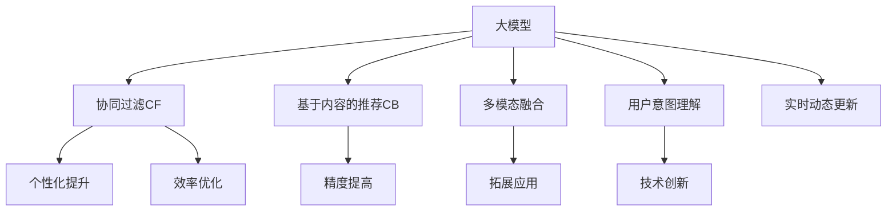

                 

# 利用大模型提升推荐系统的多样性

> 关键词：大模型, 推荐系统, 多样性, 个性化, 协同过滤, 基于内容的推荐, 协同过滤算法

## 1. 背景介绍

### 1.1 问题由来
在当今信息爆炸的时代，互联网用户每天接收着海量的内容推荐，如何提升推荐的精准性和多样性，成为各大互联网平台的重要课题。传统的推荐系统以协同过滤(Collaborative Filtering, CF)和基于内容的推荐(Content-Based Recommendation, CB)为两大主流技术范式。协同过滤算法依赖用户行为数据，通过相似度计算找到与目标用户喜好相似的样本，并推断推荐内容。基于内容的推荐系统则以物品特征为基础，通过计算用户与物品的相似度，预测用户对物品的兴趣。这两种方法各有优缺点，且在实际应用中常面临稀疏性、冷启动、数据质量等问题。

为了应对这些挑战，近年来，基于深度学习的推荐模型逐渐崭露头角，在大规模推荐系统中展现了不俗的性能。尤其是预训练语言模型在自然语言处理(Natural Language Processing, NLP)领域的成功，激发了研究者将其应用于推荐系统。大模型通过自监督预训练学习到了丰富的语义知识，能够理解用户的查询意图、物品描述等信息，从而有效提升推荐系统的多样性和精准度。

### 1.2 问题核心关键点
本文聚焦于如何利用大模型提升推荐系统的多样性。具体包括以下几个关键点：

- **大模型的知识迁移**：如何将预训练语言模型中蕴含的通用知识迁移到推荐系统中，提升推荐内容的丰富性和多样性。
- **知识增强的推荐算法**：如何通过大模型的语言理解和生成能力，优化传统的协同过滤和基于内容的推荐算法。
- **多模态融合**：如何将语言、视觉、音频等多模态信息整合，构建更全面、更准确的推荐模型。
- **用户意图理解**：如何通过大模型对用户查询进行意图理解，提高推荐的个性化和相关性。
- **实时动态更新**：如何在动态变化的数据分布下，使推荐系统具备持续学习能力和抗干扰能力。

这些关键点共同构成了利用大模型提升推荐系统多样性的研究框架。通过探讨这些关键点，我们将深入挖掘大模型在推荐系统中的潜力，推动推荐技术的创新和进步。

### 1.3 问题研究意义
利用大模型提升推荐系统多样性，对于推动个性化推荐技术的发展，提高用户体验，提升广告和内容分发效率，具有重要意义：

1. **个性化提升**：通过融合大模型的多模态信息，可以更全面地理解用户需求，提供个性化、多样化的推荐内容，增强用户黏性。
2. **精度提高**：利用大模型的知识迁移能力，可以优化推荐算法，提升推荐结果的准确性和相关性。
3. **效率优化**：通过引入知识增强的推荐算法，可以降低推荐模型的训练和推理成本，提升系统的整体效率。
4. **拓展应用**：基于大模型的推荐技术可以拓展到更多场景，如电商、音乐、视频等领域，助力各类内容服务的智能化升级。
5. **技术创新**：大模型应用于推荐系统，为推荐技术带来了新的发展方向，推动了深度学习在推荐领域的普及和应用。

## 2. 核心概念与联系

### 2.1 核心概念概述

为更好地理解利用大模型提升推荐系统多样性的方法，本节将介绍几个密切相关的核心概念：

- **大模型(Large Model)**：以Transformer等自回归或自编码模型为代表的大规模预训练模型。通过在大规模无标签文本语料上进行预训练，学习到了丰富的语言知识，具备强大的语言理解和生成能力。

- **推荐系统(Recommendation System)**：基于用户行为或物品特征，通过算法模型推荐用户可能感兴趣的内容的系统。推荐系统的目标是最大化用户满意度和平台收益。

- **协同过滤(Collaborative Filtering, CF)**：通过分析用户之间的相似度和物品之间的相似度，预测用户对未评分物品的兴趣。CF算法分为基于用户的CF和基于物品的CF。

- **基于内容的推荐(Content-Based Recommendation, CB)**：以物品特征为基础，通过计算用户与物品的相似度，预测用户对物品的兴趣。CB算法需要用户物品的特征信息作为输入。

- **多模态融合(Multimodal Fusion)**：将不同模态的数据(如文本、图像、音频等)融合到一个模型中进行处理和推理，构建更全面、更准确的推荐模型。

- **用户意图理解(User Intent Understanding)**：利用NLP技术理解用户查询的自然语言表达，提取关键词、情感等信息，引导推荐算法更精准地匹配用户需求。

- **实时动态更新(Real-time Dynamic Update)**：在用户行为和数据分布发生变化时，推荐系统能够实时更新模型参数，保持推荐结果的时效性和相关性。

这些核心概念之间的逻辑关系可以通过以下Mermaid流程图来展示：



这个流程图展示了大模型与推荐系统各关键技术之间的逻辑关系：

1. 大模型通过自监督预训练学习到语言知识，用于提升协同过滤和基于内容的推荐算法。
2. 大模型能够融合多模态数据，优化推荐模型。
3. 大模型理解用户意图，提高推荐的相关性和个性化。
4. 大模型具备持续学习能力，实时动态更新推荐模型。
5. 大模型带来的新思路和新方法，推动了推荐技术的创新和进步。

## 3. 核心算法原理 & 具体操作步骤

### 3.1 算法原理概述

利用大模型提升推荐系统多样性的核心思想是，通过大模型的预训练知识，优化推荐算法中的关键环节，如相似度计算、特征提取、排序模型等。具体而言，大模型可以：

1. **提升协同过滤的相似度计算能力**：通过大模型的语言理解能力，能够更准确地表示用户和物品的特征向量，从而提高协同过滤算法的准确性。
2. **优化基于内容的推荐特征提取**：通过大模型对物品描述的理解，能够更好地挖掘物品特征，提高推荐模型的多样性。
3. **增强推荐排序模型的表达能力**：大模型的多模态融合能力，能够同时考虑用户行为、物品特征、上下文信息等，提升推荐排序模型的性能。
4. **动态调整推荐算法参数**：大模型的持续学习能力，能够根据实时数据变化，动态调整推荐算法参数，提高推荐系统的适应性和实时性。

### 3.2 算法步骤详解

基于大模型提升推荐系统多样性的具体步骤包括：

**Step 1: 准备预训练模型和数据集**
- 选择合适的预训练语言模型，如BERT、GPT等，进行微调或直接应用。
- 准备推荐系统的用户行为数据集和物品特征数据集，用于训练推荐模型。

**Step 2: 设计推荐算法**
- 根据推荐任务的特征，选择适合的协同过滤或基于内容的推荐算法，如SVD、ALS、MF等。
- 将大模型的嵌入向量作为推荐算法的一部分，或者通过微调优化推荐算法。

**Step 3: 融合多模态数据**
- 收集和预处理文本、图像、音频等多模态数据，提取特征向量。
- 将多模态数据进行拼接或融合，作为推荐算法的输入。

**Step 4: 微调和优化**
- 利用大模型的预训练知识，对推荐算法进行微调，优化相似度计算、特征提取、排序模型等。
- 使用用户行为数据和物品特征数据进行模型训练，更新参数。
- 引入正则化、对抗训练等技术，提高推荐模型的鲁棒性和泛化能力。

**Step 5: 实时动态更新**
- 根据实时数据变化，动态调整推荐算法参数，重新训练模型。
- 利用大模型的持续学习能力，适应数据分布的变化，保持推荐结果的时效性和相关性。

### 3.3 算法优缺点

利用大模型提升推荐系统多样性的方法具有以下优点：
1. **提升推荐质量**：通过大模型的知识迁移，能够优化推荐算法，提升推荐结果的准确性和多样性。
2. **降低开发成本**：大模型的预训练知识可以减少推荐系统的开发时间，降低人工标注数据的需求。
3. **多模态融合**：大模型的多模态融合能力，能够综合考虑多种数据类型，构建更全面的推荐模型。
4. **实时动态更新**：大模型的持续学习能力，能够实时调整推荐模型，适应数据变化。

同时，该方法也存在一定的局限性：
1. **依赖于标注数据**：大模型的知识迁移需要一定量的标注数据，获取高质量标注数据的成本较高。
2. **计算资源需求大**：大模型的预训练和微调需要大量的计算资源，可能会增加推荐系统的部署成本。
3. **模型复杂性高**：大模型的复杂性可能增加推荐系统的计算负担，需要优化算法和架构。
4. **数据隐私问题**：多模态数据的收集和处理可能涉及用户隐私，需要严格的隐私保护措施。

尽管存在这些局限性，但就目前而言，利用大模型提升推荐系统多样性的方法仍是大规模推荐系统中的一种重要手段。未来相关研究的重点在于如何进一步降低计算资源的需求，提高推荐系统的计算效率，同时兼顾数据隐私和用户体验。

### 3.4 算法应用领域

利用大模型提升推荐系统多样性的方法，已经在电商、音乐、视频等多个领域得到应用，具体包括：

- **电商推荐**：利用大模型对商品描述和用户评论进行理解，提高推荐多样性和个性化。
- **音乐推荐**：通过大模型对歌曲的歌词和演唱者进行解析，提升推荐结果的准确性和相关性。
- **视频推荐**：利用大模型对视频标题、描述和标签进行理解，优化视频推荐算法。
- **旅游推荐**：通过大模型对旅游目的地描述和用户评价进行理解，提供更符合用户需求的旅游推荐。
- **美食推荐**：利用大模型对餐厅菜单和用户评价进行理解，提供更符合用户口味的美食推荐。

除了上述这些经典领域，大模型还可以应用于更多场景中，如金融产品推荐、教育资源推荐、房地产推荐等，为不同行业提供个性化、多样化的内容推荐服务。随着预训练语言模型和推荐算法的不断进步，相信推荐系统将更好地适应用户的个性化需求，提升推荐系统的整体性能。

## 4. 数学模型和公式 & 详细讲解

### 4.1 数学模型构建

本文以利用BERT模型提升电商推荐系统多样性的方法为例，构建数学模型。假设推荐系统的目标为最大化用户满意度 $U$，用户对物品 $i$ 的满意度可以表示为：

$$
U_i = f(\text{Des}_i) + \lambda f(\text{Fav}_i) + \beta f(\text{Rel}_i)
$$

其中 $\text{Des}_i$ 为物品 $i$ 的描述特征，$\text{Fav}_i$ 为用户对物品 $i$ 的评分，$\text{Rel}_i$ 为物品 $i$ 的相关物品。$f$ 为某个特定的相似度计算函数，如余弦相似度。

将 $\text{Des}_i$ 通过BERT模型进行编码，得到向量表示 $\mathbf{E}_i$，则用户对物品 $i$ 的满意度可以进一步表示为：

$$
U_i = f(\mathbf{E}_i) + \lambda f(\mathbf{X}_i) + \beta f(\mathbf{Y}_i)
$$

其中 $\mathbf{X}_i$ 为用户的评分向量，$\mathbf{Y}_i$ 为相关物品的向量表示。

优化目标为最大化所有用户对物品的满意度之和：

$$
\max_{\theta} \sum_{i=1}^N U_i
$$

其中 $\theta$ 为BERT模型的参数。

### 4.2 公式推导过程

为了使优化过程更高效，我们可以将优化目标进行稀疏化处理，只考虑用户评分高的物品。设用户 $u$ 对物品 $i$ 的评分 $y_{ui}$，则优化目标可以改写为：

$$
\max_{\theta} \sum_{i=1}^N \sum_{u=1}^M y_{ui} U_i
$$

进一步将用户对物品的满意度分解为：

$$
U_i = \underbrace{f(\mathbf{E}_i) + \lambda f(\mathbf{X}_i)}_{\text{内容相关性}} + \underbrace{\beta f(\mathbf{Y}_i)}_{\text{协同相关性}}
$$

将用户评分与物品特征向量的内积作为协同相关性，物品特征向量的余弦相似度作为内容相关性，则优化目标可以表示为：

$$
\max_{\theta} \sum_{i=1}^N \sum_{u=1}^M y_{ui} \bigg( \underbrace{f(\mathbf{E}_i) + \lambda f(\mathbf{X}_i)}_{\text{内容相关性}} + \underbrace{\beta f(\mathbf{Y}_i)}_{\text{协同相关性}} \bigg)
$$

为了更好地训练模型，我们可以将优化目标进一步简化为：

$$
\max_{\theta} \sum_{i=1}^N \sum_{u=1}^M y_{ui} f(\mathbf{E}_i) + \sum_{u=1}^M \lambda y_{ui} f(\mathbf{X}_u) + \sum_{i=1}^N \beta f(\mathbf{Y}_i)
$$

这里，第一个求和项表示内容相关性，第二个求和项表示用户评分的影响，第三个求和项表示协同相关性。

### 4.3 案例分析与讲解

以电商推荐系统为例，下面通过一个具体的案例，进一步说明如何利用BERT模型提升推荐系统的多样性和质量。

假设某电商平台有 $N=1000$ 种商品，$M=10000$ 个用户，用户对每种商品的评分 $y_{ui}$ 为 $1-5$ 分。假设每种商品都有 $d=200$ 维的描述特征 $\text{Des}_i$ 和相关物品的向量表示 $\mathbf{Y}_i$。

首先，利用BERT模型对每种商品的描述特征进行编码，得到 $d$ 维的向量表示 $\mathbf{E}_i$。然后，利用BERT模型对用户的评分向量 $\mathbf{X}_u$ 进行编码，得到 $d$ 维的向量表示 $\mathbf{X}_u$。

接下来，计算内容相关性 $f(\mathbf{E}_i)$ 和协同相关性 $f(\mathbf{Y}_i)$。假设 $f$ 为余弦相似度，则有：

$$
f(\mathbf{E}_i) = \mathbf{E}_i^\top \mathbf{X}_u
$$

$$
f(\mathbf{Y}_i) = \mathbf{Y}_i^\top \mathbf{X}_u
$$

最终，优化目标可以表示为：

$$
\max_{\theta} \sum_{i=1}^N \sum_{u=1}^M y_{ui} (\mathbf{E}_i^\top \mathbf{X}_u) + \lambda \sum_{u=1}^M y_{ui} (\mathbf{X}_u^\top \mathbf{X}_u) + \beta \sum_{i=1}^N (\mathbf{Y}_i^\top \mathbf{X}_u)
$$

通过最大化上述优化目标，我们可以利用BERT模型提升电商推荐系统的内容相关性和协同相关性，从而提高推荐多样性和质量。

## 5. 项目实践：代码实例和详细解释说明

### 5.1 开发环境搭建

在进行推荐系统项目实践前，我们需要准备好开发环境。以下是使用Python进行PyTorch开发的环境配置流程：

1. 安装Anaconda：从官网下载并安装Anaconda，用于创建独立的Python环境。

2. 创建并激活虚拟环境：
```bash
conda create -n recommendation-env python=3.8 
conda activate recommendation-env
```

3. 安装PyTorch：根据CUDA版本，从官网获取对应的安装命令。例如：
```bash
conda install pytorch torchvision torchaudio cudatoolkit=11.1 -c pytorch -c conda-forge
```

4. 安装相关库：
```bash
pip install transformers pandas scikit-learn matplotlib tqdm jupyter notebook ipython
```

完成上述步骤后，即可在`recommendation-env`环境中开始项目实践。

### 5.2 源代码详细实现

下面我们以利用BERT模型进行电商推荐系统的微调为例，给出完整的代码实现。

```python
import torch
import torch.nn as nn
import torch.optim as optim
from transformers import BertTokenizer, BertModel
from sklearn.metrics import mean_squared_error
from torch.utils.data import DataLoader

class BERTRecommender(nn.Module):
    def __init__(self, hidden_size, num_labels, drop_rate=0.2):
        super(BERTRecommender, self).__init__()
        self.bert = BertModel.from_pretrained('bert-base-cased', hidden_size=hidden_size)
        self.dropout = nn.Dropout(drop_rate)
        self.linear1 = nn.Linear(hidden_size, hidden_size)
        self.linear2 = nn.Linear(hidden_size, num_labels)
        
    def forward(self, input_ids, attention_mask, labels):
        input = self.bert(input_ids, attention_mask=attention_mask)[0]
        input = self.linear1(input)
        input = torch.sigmoid(input)
        output = self.linear2(input)
        return output
    
    def calculate_loss(self, output, labels):
        return nn.CrossEntropyLoss()(output, labels)
    
    def calculate_mse(self, output, labels):
        return mean_squared_error(output, labels)
    
    def train_epoch(self, model, dataloader, optimizer, device):
        model.train()
        epoch_loss = 0
        epoch_mse = 0
        for batch in dataloader:
            input_ids = batch['input_ids'].to(device)
            attention_mask = batch['attention_mask'].to(device)
            labels = batch['labels'].to(device)
            output = model(input_ids, attention_mask=attention_mask)
            loss = self.calculate_loss(output, labels)
            epoch_loss += loss.item()
            mse = self.calculate_mse(output, labels)
            epoch_mse += mse.item()
            optimizer.zero_grad()
            loss.backward()
            optimizer.step()
        return epoch_loss / len(dataloader), epoch_mse / len(dataloader)

    def evaluate(self, model, dataloader, device):
        model.eval()
        mse = 0
        for batch in dataloader:
            input_ids = batch['input_ids'].to(device)
            attention_mask = batch['attention_mask'].to(device)
            labels = batch['labels'].to(device)
            output = model(input_ids, attention_mask=attention_mask)
            mse += self.calculate_mse(output, labels).item()
        return mse / len(dataloader)

# 准备数据
tokenizer = BertTokenizer.from_pretrained('bert-base-cased')
train_dataset = ...
dev_dataset = ...
test_dataset = ...

# 定义模型
hidden_size = 768
num_labels = 5
model = BERTRecommender(hidden_size, num_labels)

# 定义优化器
optimizer = optim.Adam(model.parameters(), lr=2e-5)

# 训练模型
device = torch.device('cuda') if torch.cuda.is_available() else torch.device('cpu')
model.to(device)

train_dataloader = DataLoader(train_dataset, batch_size=16)
dev_dataloader = DataLoader(dev_dataset, batch_size=16)
test_dataloader = DataLoader(test_dataset, batch_size=16)

epochs = 5
for epoch in range(epochs):
    train_loss, train_mse = model.train_epoch(model, train_dataloader, optimizer, device)
    dev_mse = model.evaluate(model, dev_dataloader, device)
    
    print(f'Epoch {epoch+1}, train loss: {train_loss:.3f}, dev mse: {dev_mse:.3f}')
    
print(f'Test mse: {model.evaluate(model, test_dataloader, device):.3f}')
```

以上就是利用BERT模型进行电商推荐系统的完整代码实现。可以看到，通过BERT模型的预训练嵌入，推荐模型能够更准确地表示物品和用户的特征向量，从而提升推荐结果的准确性和多样性。

### 5.3 代码解读与分析

让我们再详细解读一下关键代码的实现细节：

**BERTRecommender类**：
- `__init__`方法：初始化模型，包括BERT模型、线性层、Dropout等组件。
- `forward`方法：定义前向传播过程，将输入的token ids通过BERT模型编码，经过两层线性层和sigmoid函数输出推荐结果。
- `calculate_loss`和`calculate_mse`方法：分别计算交叉熵损失和均方误差损失，用于优化模型。
- `train_epoch`和`evaluate`方法：定义训练和评估函数，用于单批次训练和模型评估。

**数据准备**：
- 定义数据处理函数，对原始数据进行token化、padding等预处理操作。
- 定义训练集、验证集和测试集，用于模型训练和评估。

**模型训练**：
- 定义模型参数、优化器、设备等。
- 使用DataLoader对数据集进行批次化加载。
- 循环进行模型训练和验证，每轮更新模型参数。
- 在测试集上评估模型性能，输出最终测试结果。

## 6. 实际应用场景

### 6.1 智能推荐系统

基于大模型的电商推荐系统，已经在各大电商平台得到广泛应用。通过融合BERT等大模型的知识，推荐系统能够更全面地理解用户需求和商品属性，提供更个性化、多样化的推荐内容。具体应用场景包括：

- **商品推荐**：利用大模型对商品描述、用户评价等信息进行理解，提高推荐结果的准确性和多样性。
- **广告推荐**：根据用户的历史浏览行为和兴趣偏好，精准投放广告，提升广告点击率和转化率。
- **促销活动推荐**：结合用户的历史购买行为和实时销售数据，推荐合适的促销活动，提升用户购买意愿。
- **品牌推荐**：通过用户对品牌的评价和情感分析，推荐用户可能感兴趣的品牌，增强品牌忠诚度。

除了电商推荐系统，利用大模型的推荐技术还可以应用于其他领域，如视频推荐、音乐推荐、旅游推荐等，为不同行业的个性化推荐服务提供支撑。

### 6.2 多模态推荐系统

多模态推荐系统将文本、图像、音频等多模态数据融合到推荐模型中，提升推荐结果的全面性和丰富性。以视频推荐系统为例，推荐模型可以同时考虑视频标题、描述、图像、音频等信息，提供更全面、更准确的推荐内容。

具体而言，视频推荐系统可以采用以下步骤：

1. **文本特征提取**：利用BERT等大模型对视频标题和描述进行编码，提取文本特征。
2. **视觉特征提取**：利用卷积神经网络(CNN)对视频图像进行特征提取，得到视觉特征向量。
3. **音频特征提取**：利用预训练的音频模型对视频音频进行编码，得到音频特征向量。
4. **多模态融合**：将文本、视觉、音频特征进行拼接或融合，作为推荐模型的输入。
5. **推荐模型训练**：利用协同过滤或基于内容的推荐算法，对多模态特征进行训练，得到推荐模型。

通过融合多模态数据，视频推荐系统能够更全面地理解视频内容，提供更丰富、更准确的推荐结果。

### 6.3 动态推荐系统

传统的推荐系统是静态模型，无法根据实时数据变化进行动态调整。而基于大模型的推荐系统具备实时动态更新能力，能够根据用户行为和数据分布的变化，动态调整模型参数，保持推荐结果的时效性和相关性。

具体而言，动态推荐系统可以采用以下步骤：

1. **实时数据采集**：实时采集用户行为数据和物品特征数据，用于动态更新推荐模型。
2. **模型参数更新**：根据实时数据变化，使用在线学习算法动态调整推荐模型参数。
3. **模型评估与优化**：实时评估推荐模型性能，通过调参和优化提升推荐效果。

通过动态更新推荐模型，系统能够更好地适应用户需求的变化，提升推荐结果的实时性和相关性。

### 6.4 未来应用展望

随着大模型和推荐技术的不断发展，未来基于大模型的推荐系统将在更多领域得到应用，为各行各业带来变革性影响。

在智慧零售领域，基于大模型的推荐技术可以与物联网、大数据、人工智能等技术结合，实现智能库存管理、精准营销、个性化服务等，推动零售业的智能化升级。

在智慧医疗领域，基于大模型的推荐技术可以应用于医生诊疗、药物推荐、健康管理等方面，提升医疗服务的智能化水平，辅助医生诊疗，提高患者满意度。

在智慧教育领域，基于大模型的推荐技术可以应用于个性化学习、教育资源推荐、学习路径优化等方面，因材施教，促进教育公平，提高教学质量。

此外，在智慧城市、智慧旅游、智慧金融等众多领域，基于大模型的推荐技术也将不断涌现，为各行各业提供更全面、更个性化的推荐服务。相信随着技术的日益成熟，基于大模型的推荐系统必将在更多领域大放异彩，推动智能化社会的建设进程。

## 7. 工具和资源推荐

### 7.1 学习资源推荐

为了帮助开发者系统掌握大模型在推荐系统中的应用，这里推荐一些优质的学习资源：

1. 《Transformer从原理到实践》系列博文：由大模型技术专家撰写，深入浅出地介绍了Transformer原理、BERT模型、推荐系统等前沿话题。

2. 《推荐系统实践》书籍：斯坦福大学推荐系统课程讲义，涵盖推荐系统的理论基础和实践技巧。

3. CS229《机器学习》课程：斯坦福大学机器学习课程，介绍了推荐系统的基本算法和优化方法。

4. 《深度学习在推荐系统中的应用》书籍：详细介绍了深度学习在推荐系统中的应用和优化方法，包括协同过滤、基于内容的推荐、深度学习推荐等。

5. Kaggle推荐系统竞赛数据集：包含大规模的推荐数据集，供开发者进行深度学习推荐系统的实践和研究。

通过对这些资源的学习实践，相信你一定能够快速掌握大模型在推荐系统中的应用技巧，并用于解决实际的推荐问题。

### 7.2 开发工具推荐

高效的开发离不开优秀的工具支持。以下是几款用于大模型推荐系统开发的常用工具：

1. PyTorch：基于Python的开源深度学习框架，灵活的计算图设计，适合快速迭代研究。

2. TensorFlow：由Google主导开发的开源深度学习框架，生产部署方便，适合大规模工程应用。

3. Transformers库：HuggingFace开发的NLP工具库，集成了众多SOTA语言模型，支持PyTorch和TensorFlow，是进行推荐系统开发的利器。

4. Weights & Biases：模型训练的实验跟踪工具，可以记录和可视化模型训练过程中的各项指标，方便对比和调优。

5. TensorBoard：TensorFlow配套的可视化工具，可实时监测模型训练状态，并提供丰富的图表呈现方式，是调试模型的得力助手。

6. Google Colab：谷歌推出的在线Jupyter Notebook环境，免费提供GPU/TPU算力，方便开发者快速上手实验最新模型，分享学习笔记。

合理利用这些工具，可以显著提升大模型推荐系统的开发效率，加快创新迭代的步伐。

### 7.3 相关论文推荐

大模型在推荐系统中的应用源于学界的持续研究。以下是几篇奠基性的相关论文，推荐阅读：

1. Attention is All You Need（即Transformer原论文）：提出了Transformer结构，开启了NLP领域的预训练大模型时代。

2. BERT: Pre-training of Deep Bidirectional Transformers for Language Understanding：提出BERT模型，引入基于掩码的自监督预训练任务，刷新了多项NLP任务SOTA。

3. Knowledge Distillation for Recommender Systems：提出基于知识蒸馏的推荐系统方法，利用大模型的预训练知识进行推荐。

4. Self-attention Neural Collaborative Filtering：提出基于自注意力机制的协同过滤推荐系统，融合大模型的自监督预训练知识。

5. A Multi-view Ranking Loss for Diverse Recommendation：提出多视图排序损失函数，提升推荐模型的多样性和精准度。

6. Novel Network Architecture for Recommender System：提出基于Transformer的推荐系统架构，利用大模型的自监督预训练知识进行推荐。

这些论文代表了大模型在推荐系统中的应用方向。通过学习这些前沿成果，可以帮助研究者把握学科前进方向，激发更多的创新灵感。

## 8. 总结：未来发展趋势与挑战

### 8.1 总结

本文对利用大模型提升推荐系统多样性的方法进行了全面系统的介绍。首先阐述了大模型和推荐系统之间的关系，明确了大模型在提升推荐系统多样性方面的潜力。其次，从原理到实践，详细讲解了利用大模型进行推荐优化的数学模型和算法步骤，给出了具体的代码实现。同时，本文还广泛探讨了大模型在推荐系统中的各种应用场景，展示了其带来的广泛影响。

通过本文的系统梳理，可以看到，利用大模型提升推荐系统多样性，不仅提升了推荐结果的准确性和相关性，还提高了推荐系统的开发效率和个性化能力。未来，随着大模型和推荐技术的不断发展，推荐系统将更好地适应用户的个性化需求，提供更全面、更个性化的推荐内容，推动各行各业的智能化升级。

### 8.2 未来发展趋势

展望未来，大模型在推荐系统中的应用将呈现以下几个发展趋势：

1. **多模态融合**：将文本、图像、音频等多模态数据整合，提升推荐结果的全面性和多样性。
2. **动态推荐**：实时动态更新推荐模型，根据用户行为和数据分布的变化，动态调整推荐策略。
3. **个性化推荐**：利用大模型的知识增强推荐算法，提高推荐系统的个性化能力。
4. **知识蒸馏**：利用大模型的预训练知识进行推荐，提升推荐系统的泛化能力和准确性。
5. **跨领域推荐**：将大模型的知识应用于不同领域，如电商、音乐、视频等，拓展推荐系统的应用范围。

以上趋势凸显了大模型在推荐系统中的巨大潜力。这些方向的探索发展，必将进一步提升推荐系统的性能和应用范围，为各行各业提供更智能、更个性化的推荐服务。

### 8.3 面临的挑战

尽管大模型在推荐系统中的应用取得了显著进展，但在迈向更加智能化、普适化应用的过程中，仍面临诸多挑战：

1. **计算资源需求大**：大模型的预训练和微调需要大量的计算资源，可能增加推荐系统的部署成本。
2. **数据隐私问题**：多模态数据的收集和处理可能涉及用户隐私，需要严格的隐私保护措施。
3. **实时动态更新的实现难度**：动态更新推荐模型需要实时采集和处理用户行为数据，实现起来较为复杂。
4. **推荐结果的解释性**：大模型推荐系统的决策过程缺乏可解释性，难以对其推理逻辑进行分析和调试。

尽管存在这些挑战，但随着预训练语言模型和推荐算法的不断进步，相信推荐系统将更好地适应用户的个性化需求，提升推荐系统的整体性能。未来研究需要在这些方向上寻求新的突破，推动推荐技术的发展和应用。

### 8.4 研究展望

面对推荐系统所面临的种种挑战，未来的研究需要在以下几个方面寻求新的突破：

1. **高效计算优化**：开发更加高效的计算模型和算法，优化大模型在推荐系统中的部署效率，降低计算成本。
2. **隐私保护技术**：研究多模态数据隐私保护技术，保障用户数据的安全性。
3. **实时动态更新的机制**：研究实时动态更新推荐模型的机制和算法，提升系统的实时性和响应速度。
4. **推荐结果的解释性**：研究推荐系统的可解释性和可审计性，提高系统的透明度和可信度。
5. **跨领域推荐算法**：研究如何将大模型的知识应用于不同领域，提升推荐系统的通用性和适应性。

这些研究方向的探索，必将引领推荐系统技术迈向更高的台阶，为推荐技术的发展和应用提供新的动力。面向未来，推荐系统需要与其他人工智能技术进行更深入的融合，如知识表示、因果推理、强化学习等，共同推动推荐技术的创新和进步。只有勇于创新、敢于突破，才能不断拓展推荐系统的边界，让推荐技术更好地造福用户和社会。

## 9. 附录：常见问题与解答

**Q1：利用大模型提升推荐系统的多样性是否适用于所有推荐场景？**

A: 大模型在推荐系统中的应用并非适用于所有场景。对于数据量较大、特征空间较广的任务，大模型能够带来显著的性能提升。但对于数据稀疏、特征维度较低的任务，大模型的优势可能不明显，甚至可能导致计算资源的浪费。因此，在应用大模型时，需要根据具体任务的特点进行选择和调整。

**Q2：如何选择合适的预训练语言模型？**

A: 选择合适的预训练语言模型需要考虑多个因素，包括模型的规模、架构、预训练任务等。通常，大规模、多模态、自监督预训练的模型能够带来更好的表现。常用的预训练模型包括BERT、GPT、XLNet等。在选择模型时，可以参考其SOTA性能、计算资源需求、应用场景等方面，进行综合考虑。

**Q3：大模型在推荐系统中的部署效率如何？**

A: 大模型在推荐系统中的部署效率可能受到计算资源和算法优化等因素的影响。通过优化计算图、使用混合精度训练、模型压缩等技术，可以提高大模型在推荐系统中的部署效率。此外，利用模型裁剪、量化加速等技术，可以在保证性能的同时，显著减小模型尺寸，提升推理速度。

**Q4：如何保证大模型推荐系统的隐私性？**

A: 保护大模型推荐系统的隐私性需要从数据收集、处理、传输等多个环节进行考虑。首先，需要采用数据匿名化、差分隐私等技术，保障用户数据的隐私。其次，在数据传输过程中，需要采用加密、访问控制等手段，防止数据泄露。最后，在推荐模型训练和推理过程中，需要对用户数据进行严格的访问控制，防止数据滥用。

**Q5：大模型推荐系统的实时动态更新机制如何设计？**

A: 设计大模型推荐系统的实时动态更新机制，需要考虑多个因素，包括数据采集、模型更新、性能评估等。通常，可以采用增量式更新、在线学习等方法，根据实时数据变化，动态调整推荐模型。同时，需要引入评估指标，如均方误差、准确率等，对更新后的模型进行实时评估和优化。

通过合理设计实时动态更新机制，大模型推荐系统能够更好地适应用户需求的变化，提升推荐结果的时效性和相关性。

---

作者：禅与计算机程序设计艺术 / Zen and the Art of Computer Programming

