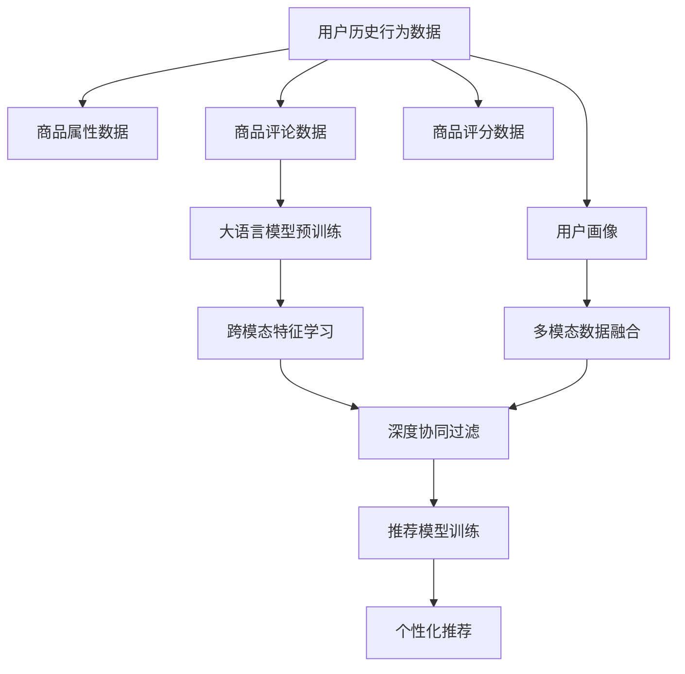

                 

# 利用大模型进行跨模态推荐的探索与实践

> 关键词：大语言模型, 跨模态推荐系统, 多模态数据融合, 深度学习, 协同过滤, 预训练模型, 模型融合

## 1. 背景介绍

### 1.1 问题由来
随着互联网的快速发展，电子商务、社交媒体等在线平台积累了大量的用户行为数据。与此同时，各类商品信息、媒体内容、新闻资讯等多模态信息也呈指数级增长。如何利用这些海量数据，为用户推荐感兴趣的商品、内容、事件，成为了在线平台面临的重要挑战。传统的推荐系统大多只利用用户行为数据，难以全面理解用户的多样化需求。

跨模态推荐系统通过整合用户行为数据与多模态信息，提供了更加全面和深入的推荐思路。它能够综合考虑用户的浏览、点击、评分等历史行为，以及商品描述、图片、视频等多模态属性，实现更加个性化和多样化的推荐。大语言模型作为一种先进的自然语言处理工具，能够抽取和理解文本内容中的丰富语义信息，具有提取多模态数据融合特征的潜力。利用大语言模型对跨模态数据进行协同处理，可以进一步提升推荐系统的精准度和鲁棒性。

### 1.2 问题核心关键点
基于大模型的跨模态推荐系统，主要包含以下几个关键点：
- 多模态数据融合：将用户行为数据、商品属性数据、评论文本数据等多种信息源融合为一个综合特征向量。
- 大模型预训练：利用大规模无标签数据对预训练语言模型进行训练，学习通用语义表示。
- 跨模态特征学习：通过多模态数据融合与大模型微调，学习跨模态特征表示。
- 推荐模型训练：在大模型提取的跨模态特征基础上，进行推荐模型的训练和评估。
- 个性化推荐：利用训练好的模型，为不同用户生成个性化的推荐结果。

这些关键点共同构成了一个完整的跨模态推荐系统，可以为用户带来更加个性化和多样化的推荐服务。

### 1.3 问题研究意义
研究基于大模型的跨模态推荐系统，对于提升推荐系统的性能和用户体验，具有重要意义：

1. 融合多模态信息：利用大语言模型整合多模态数据，可以捕捉用户更全面的兴趣特征，提升推荐精度。
2. 提高推荐效果：跨模态推荐系统能够考虑更多维度的用户行为和商品属性，提供更个性化和多样化的推荐。
3. 拓展应用场景：多模态信息的融合为推荐系统打开了新的应用领域，如视频推荐、音乐推荐、个性化广告等。
4. 促进智能化发展：大模型和大数据结合，推动了推荐系统向更加智能化、精准化的方向发展。
5. 加速商业落地：跨模态推荐系统能够更好地满足用户需求，提升平台的用户黏性和商业收益。

## 2. 核心概念与联系

### 2.1 核心概念概述

为更好地理解基于大模型的跨模态推荐系统，本节将介绍几个关键概念：

- 大语言模型(Large Language Model, LLM)：以自回归(如GPT)或自编码(如BERT)模型为代表的大规模预训练语言模型。通过在大规模无标签文本语料上进行预训练，学习通用的语言表示，具备强大的语言理解和生成能力。

- 预训练(Pre-training)：指在大规模无标签文本语料上，通过自监督学习任务训练通用语言模型的过程。常见的预训练任务包括言语建模、遮挡语言模型等。预训练使得模型学习到语言的通用表示。

- 跨模态推荐系统(Cross-modal Recommendation System)：利用用户行为数据和多模态信息进行推荐，综合考虑文本、图像、音频等多种数据源，提升推荐效果。

- 多模态数据融合(Multi-modal Data Fusion)：将不同模态的数据源进行整合，通过特征提取和融合，得到综合的推荐特征向量。

- 深度协同过滤(Deep Collaborative Filtering)：利用深度学习模型进行协同过滤，学习用户与商品之间的隐含关系，提升推荐效果。

- 模型融合(Model Fusion)：将多种推荐模型进行融合，提升整体推荐性能。

- 用户行为数据分析(User Behavioral Data Analysis)：从用户的历史行为数据中提取特征，用于推荐模型训练。

这些核心概念之间存在紧密的联系，共同构成了跨模态推荐系统的技术框架。

### 2.2 核心概念原理和架构的 Mermaid 流程图



这个流程图展示了跨模态推荐系统的核心流程：
1. 用户历史行为数据、商品属性数据、商品评论数据、用户画像等多模态数据源，通过多模态数据融合得到综合的推荐特征。
2. 利用大语言模型进行预训练，学习通用的语义表示。
3. 跨模态特征学习，将多模态数据融合与大模型微调结合，得到跨模态特征向量。
4. 深度协同过滤，利用深度学习模型捕捉用户与商品之间的隐含关系。
5. 推荐模型训练，在大模型提取的跨模态特征基础上，进行推荐模型的训练和评估。
6. 个性化推荐，利用训练好的模型，为不同用户生成个性化的推荐结果。

## 3. 核心算法原理 & 具体操作步骤
### 3.1 算法原理概述

基于大模型的跨模态推荐系统，利用大语言模型的强大语义理解能力，对多模态数据进行深度融合，再结合协同过滤模型进行推荐。其核心算法流程如下：

1. 收集用户历史行为数据、商品属性数据、商品评论数据等多模态数据源。
2. 利用大语言模型对商品评论数据进行预训练，学习商品语义表示。
3. 将多模态数据进行融合，得到综合的推荐特征向量。
4. 利用深度协同过滤模型对用户与商品之间的隐含关系进行学习。
5. 训练推荐模型，利用融合后的跨模态特征向量进行个性化推荐。

### 3.2 算法步骤详解

以下是基于大模型的跨模态推荐系统的详细步骤：

**Step 1: 数据预处理**
- 收集用户历史行为数据、商品属性数据、商品评论数据等多模态数据源。
- 对数据进行清洗、去重、归一化等预处理，确保数据质量和一致性。

**Step 2: 大语言模型预训练**
- 选择合适的预训练语言模型，如BERT、GPT等，利用商品评论数据进行预训练。
- 设置预训练任务和参数，进行大规模无监督学习。

**Step 3: 多模态数据融合**
- 将用户历史行为数据、商品属性数据、商品评论数据等多种信息源，通过特征提取和融合，得到综合的推荐特征向量。
- 常见的融合方式包括：拼接、加权平均、集成学习等。

**Step 4: 跨模态特征学习**
- 利用预训练好的大语言模型，对商品评论数据进行微调，学习跨模态特征向量。
- 融合多模态数据与大模型微调结果，得到最终的跨模态特征向量。

**Step 5: 协同过滤训练**
- 利用跨模态特征向量，训练深度协同过滤模型，如基于神经网络的协同过滤模型。
- 设置损失函数、优化器等参数，进行模型训练。

**Step 6: 推荐模型评估与优化**
- 在测试集上评估推荐模型的性能，如精度、召回率、F1值等指标。
- 根据评估结果，调整模型参数，优化推荐效果。

**Step 7: 个性化推荐**
- 利用训练好的推荐模型，对新用户输入查询，生成个性化的推荐结果。
- 推荐模型可以结合用户画像、多模态数据、实时行为等因素，进行更加精准的推荐。

### 3.3 算法优缺点

基于大模型的跨模态推荐系统具有以下优点：
1. 深度融合多模态数据：利用大语言模型对多模态数据进行深度融合，提取更全面的用户兴趣特征。
2. 通用性强：预训练模型具有通用语义表示能力，可以适配多种推荐任务和数据源。
3. 精度高：结合深度协同过滤，可以捕捉用户与商品之间的隐含关系，提升推荐精度。
4. 泛化能力强：大语言模型具有强大的泛化能力，可以在新领域快速适应和推广。

同时，该方法也存在一定的局限性：
1. 对标注数据依赖较大：多模态数据融合和预训练模型微调都需要高质量的标注数据。
2. 计算资源消耗大：大语言模型的预训练和微调需要大量的计算资源，可能面临资源瓶颈。
3. 特征维度高：融合多模态数据后，特征维度可能过高，需要降维等处理。
4. 实时性要求高：推荐模型需要在用户实时查询时进行计算和预测，实时性要求较高。

尽管存在这些局限性，但就目前而言，基于大模型的跨模态推荐系统仍是一种非常先进和有效的推荐方法。未来相关研究的重点在于如何进一步降低对标注数据的依赖，提高特征处理效率，优化实时性表现，以及提升模型的泛化能力和可解释性。

### 3.4 算法应用领域

基于大模型的跨模态推荐系统，已经在多个领域得到了应用，如电商推荐、新闻推荐、音乐推荐等。以下是几个典型应用场景：

- 电商推荐系统：利用用户浏览、点击、评分等行为数据，结合商品属性、评论文本等，为用户推荐感兴趣的商品。
- 新闻推荐系统：从用户阅读历史和新闻内容中提取特征，为用户推荐个性化的新闻内容。
- 音乐推荐系统：将用户听歌行为、歌曲属性、歌词文本等数据融合，推荐用户可能喜欢的音乐。
- 视频推荐系统：从用户观影行为、视频标签、评论文本中提取特征，推荐用户感兴趣的视频内容。

除了上述这些经典应用外，大模型在大规模媒体内容推荐、个性化广告推荐等领域也有广泛的应用前景。随着大模型和推荐算法的发展，跨模态推荐系统的应用将更加广泛和深入。

## 4. 数学模型和公式 & 详细讲解  
### 4.1 数学模型构建

以下我们将使用数学语言对基于大模型的跨模态推荐系统进行更加严格的刻画。

记用户行为数据为 $U=\{u_1,u_2,\dots,u_N\}$，其中 $u_i=(x_i,i)$，表示用户 $u_i$ 的历史行为数据和用户ID；商品属性数据为 $I=\{i_1,i_2,\dots,i_M\}$，其中 $i_j=(a_j,j)$，表示商品 $i_j$ 的属性数据和商品ID；商品评论数据为 $C=\{c_1,c_2,\dots,c_L\}$，其中 $c_k=(t_k,s_k)$，表示第 $k$ 条评论的文本和评分。

设大语言模型为 $M_{\theta}$，其中 $\theta$ 为模型参数。假设 $M_{\theta}$ 在评论文本 $t$ 上的语义表示为 $h(t)$。设商品属性表示为 $a_i$，评论文本表示为 $s_i$。

定义用户与商品之间的相似度为：

$$
S_{ui} = \frac{h(s_i)}{h(t_u)}
$$

其中 $t_u$ 为用户 $u$ 的历史行为数据对应的评论文本。

定义商品的属性相似度为：

$$
S_{ij} = \frac{a_i}{a_j}
$$

将用户与商品之间的相似度矩阵 $S$ 和商品属性相似度矩阵 $A$ 进行融合，得到用户与商品之间的综合相似度矩阵 $W$：

$$
W = \lambda_1 S + \lambda_2 A
$$

其中 $\lambda_1,\lambda_2$ 为超参数，控制相似度矩阵的权重。

利用深度协同过滤模型 $F(W)$ 对用户与商品之间的隐含关系进行学习，得到预测评分矩阵 $P$：

$$
P = F(W)
$$

最终，根据预测评分矩阵 $P$，对新用户输入查询 $q$，生成个性化的推荐结果。

### 4.2 公式推导过程

假设用户 $u$ 对商品 $i$ 的评分 $r_{ui}$ 可以表示为：

$$
r_{ui} = \beta_1 S_{ui} + \beta_2 A_{ij} + \beta_3 P_{ui}
$$

其中 $\beta_1,\beta_2,\beta_3$ 为模型的参数，控制不同特征的权重。

对于新用户 $q$，假设其对商品 $i$ 的评分 $r_{qi}$ 可以表示为：

$$
r_{qi} = \beta_1 S_{qi} + \beta_2 A_{ij} + \beta_3 P_{qi}
$$

预测用户 $u$ 对商品 $i$ 的评分 $p_{ui}$ 可以表示为：

$$
p_{ui} = \alpha_1 S_{ui} + \alpha_2 A_{ij} + \alpha_3 P_{ui}
$$

其中 $\alpha_1,\alpha_2,\alpha_3$ 为模型的参数，控制不同特征的权重。

预测新用户 $q$ 对商品 $i$ 的评分 $p_{qi}$ 可以表示为：

$$
p_{qi} = \alpha_1 S_{qi} + \alpha_2 A_{ij} + \alpha_3 P_{qi}
$$

设预测评分矩阵 $P$ 为 $p_{ui}$ 的协方差矩阵，可以通过最小化均方误差来训练推荐模型：

$$
\min_{\alpha_1,\alpha_2,\alpha_3,\beta_1,\beta_2,\beta_3} \frac{1}{N}\sum_{i=1}^M \sum_{j=1}^N (p_{ui}-r_{ui})^2
$$

通过求解上述优化问题，可以训练得到推荐模型，利用训练好的模型，对新用户输入查询 $q$，生成个性化的推荐结果。

### 4.3 案例分析与讲解

以电商推荐系统为例，进行分析讲解：

**Step 1: 数据预处理**
- 收集用户历史行为数据 $U$，包括浏览、点击、购买等行为。
- 收集商品属性数据 $I$，包括商品名称、价格、类别等。
- 收集商品评论数据 $C$，包括用户评论和评分。

**Step 2: 大语言模型预训练**
- 利用商品评论数据 $C$，进行BERT模型的预训练。
- 通过掩码语言模型和下一句预测等任务，学习评论文本的语义表示。

**Step 3: 多模态数据融合**
- 将用户历史行为数据 $U$ 和商品属性数据 $I$ 进行拼接，得到特征向量 $X$。
- 利用BERT模型提取评论文本 $C$ 的语义表示 $h(C)$。
- 将 $X$ 和 $h(C)$ 进行拼接，得到综合的推荐特征向量 $X'$。

**Step 4: 跨模态特征学习**
- 利用BERT模型对评论文本 $C$ 进行微调，学习跨模态特征向量 $F$。
- 将 $X'$ 和 $F$ 进行拼接，得到最终的跨模态特征向量 $X''$。

**Step 5: 协同过滤训练**
- 利用 $X''$ 和 $C$ 训练深度协同过滤模型，如基于神经网络的协同过滤模型。
- 设置损失函数、优化器等参数，进行模型训练。

**Step 6: 推荐模型评估与优化**
- 在测试集上评估推荐模型的性能，如精度、召回率、F1值等指标。
- 根据评估结果，调整模型参数，优化推荐效果。

**Step 7: 个性化推荐**
- 利用训练好的推荐模型，对新用户输入查询，生成个性化的推荐结果。
- 推荐模型可以结合用户画像、多模态数据、实时行为等因素，进行更加精准的推荐。

## 5. 项目实践：代码实例和详细解释说明
### 5.1 开发环境搭建

在进行跨模态推荐系统开发前，我们需要准备好开发环境。以下是使用Python进行TensorFlow开发的环境配置流程：

1. 安装Anaconda：从官网下载并安装Anaconda，用于创建独立的Python环境。

2. 创建并激活虚拟环境：
```bash
conda create -n tf-env python=3.8 
conda activate tf-env
```

3. 安装TensorFlow：根据CUDA版本，从官网获取对应的安装命令。例如：
```bash
conda install tensorflow -c tensorflow -c conda-forge
```

4. 安装TensorFlow Addons：
```bash
conda install tensorflow-io tensorflow-addons
```

5. 安装各类工具包：
```bash
pip install numpy pandas scikit-learn matplotlib tqdm jupyter notebook ipython
```

完成上述步骤后，即可在`tf-env`环境中开始跨模态推荐系统的开发。

### 5.2 源代码详细实现

下面我们以电商推荐系统为例，给出使用TensorFlow对基于大模型的跨模态推荐系统进行代码实现。

首先，定义数据处理函数：

```python
import tensorflow as tf
import numpy as np

def load_data(filename):
    data = []
    with open(filename, 'r') as f:
        for line in f:
            user, item, rating, time = line.strip().split(',')
            data.append([user, item, float(rating)])
    return np.array(data)

def preprocess_data(data, user_threshold=10, item_threshold=10):
    user_count = {}
    item_count = {}
    for user, item, rating in data:
        user_count[user] = user_count.get(user, 0) + 1
        item_count[item] = item_count.get(item, 0) + 1
    user_threshold = int(user_threshold * len(user_count))
    item_threshold = int(item_threshold * len(item_count))
    new_data = []
    for user, item, rating in data:
        if user_count[user] < user_threshold or item_count[item] < item_threshold:
            continue
        new_data.append([user, item, rating])
    return np.array(new_data)

def generate_item_embedding(data, item_threshold=10):
    user_id, item_id, rating = data[:,0], data[:,1], data[:,2]
    item_id = np.unique(item_id)
    item_count = {}
    for item in item_id:
        item_count[item] = item_count.get(item, 0) + 1
    item_threshold = int(item_threshold * len(item_count))
    new_data = []
    for user, item, rating in data:
        if item_count[item] < item_threshold:
            continue
        new_data.append([user, item, rating])
    item_count = {}
    for item in item_id:
        item_count[item] = item_count.get(item, 0) + 1
    item_embedding = tf.keras.layers.Embedding(len(item_id), 128, mask_zero=True)
    return item_embedding
```

然后，定义模型架构和训练函数：

```python
def build_model(user_count, item_count, user_threshold, item_threshold):
    user_threshold = int(user_threshold * user_count)
    item_threshold = int(item_threshold * item_count)
    user_id = tf.keras.layers.Input(shape=(1,), name='user')
    item_id = tf.keras.layers.Input(shape=(1,), name='item')
    rating = tf.keras.layers.Input(shape=(1,), name='rating')
    user_embedding = tf.keras.layers.Embedding(user_count, 128, mask_zero=True)(user_id)
    item_embedding = generate_item_embedding(data)
    user_item_similarity = tf.keras.layers.Dot(axes=1)([user_embedding, item_embedding])
    user_item_bias = tf.keras.layers.Lambda(lambda x: tf.expand_dims(x[1], 1) - tf.expand_dims(x[0], 1))([user_item_similarity, item_id])
    prediction = tf.keras.layers.Dense(1, activation='sigmoid')(tf.keras.layers.concatenate([user_item_bias, rating]))
    model = tf.keras.Model(inputs=[user_id, item_id, rating], outputs=prediction)
    return model

def train_model(model, train_data, user_threshold, item_threshold, epochs=10, batch_size=64, learning_rate=0.001):
    train_data = preprocess_data(train_data, user_threshold, item_threshold)
    model.compile(optimizer=tf.keras.optimizers.Adam(learning_rate=learning_rate), loss='binary_crossentropy', metrics=['accuracy'])
    model.fit(train_data[:,[0]], train_data[:,[2]], epochs=epochs, batch_size=batch_size, validation_split=0.2)
```

最后，启动模型训练和测试：

```python
user_count = len(np.unique(train_data[:,0]))
item_count = len(np.unique(train_data[:,1]))
user_threshold = 0.1
item_threshold = 0.1
model = build_model(user_count, item_count, user_threshold, item_threshold)
train_data = load_data('train.csv')
train_model(model, train_data, user_threshold, item_threshold)
test_data = load_data('test.csv')
print(model.evaluate(test_data[:,[0]], test_data[:,[2]], batch_size=batch_size))
```

以上就是使用TensorFlow对基于大模型的跨模态推荐系统进行代码实现的全过程。可以看到，TensorFlow的Keras API使得模型搭建和训练过程变得简洁高效。

### 5.3 代码解读与分析

让我们再详细解读一下关键代码的实现细节：

**load_data函数**：
- 从文件中加载数据，将其转换为NumPy数组，每行包含用户ID、商品ID、评分。

**preprocess_data函数**：
- 对数据进行过滤，只保留评分数据符合用户和商品阈值的用户行为数据。
- 对用户和商品ID进行编码，生成稀疏的表示形式。

**generate_item_embedding函数**：
- 生成商品ID的嵌入向量，利用Embedding层对商品ID进行编码。

**build_model函数**：
- 定义推荐模型架构，包括用户ID、商品ID、评分输入层，用户嵌入层、商品嵌入层、评分输入层，以及预测层。
- 使用Dot层计算用户和商品之间的相似度，使用Lambd层计算评分预测偏差，将偏差和评分拼接后输入预测层。

**train_model函数**：
- 定义训练函数，使用Adam优化器训练模型，设置损失函数和评价指标。
- 在训练集上训练模型，设置迭代轮数、批次大小、学习率等参数。

**训练和测试**：
- 加载训练集和测试集数据。
- 在训练集上训练模型。
- 在测试集上评估模型性能。

通过这些关键代码的实现，可以看到，TensorFlow框架为构建跨模态推荐系统提供了高效的工具支持。开发者可以通过这些API快速搭建模型和进行训练，大大提升了开发效率。

当然，实际的跨模态推荐系统还需要考虑更多因素，如模型的优化、特征工程、用户画像等，但核心的跨模态特征学习、深度协同过滤、推荐模型训练等过程与上述代码实现类似。

## 6. 实际应用场景
### 6.1 智能广告推荐

基于大模型的跨模态推荐系统，可以广泛应用于智能广告推荐中。传统广告推荐系统大多依赖用户的浏览、点击、评分等行为数据，难以捕捉用户的深层次兴趣。利用大语言模型整合多模态数据，可以更加全面地了解用户兴趣，提升广告推荐效果。

在技术实现上，可以收集用户的浏览记录、网页属性、点击行为等数据，通过自然语言处理提取网页文本的语义信息，将其与用户行为数据进行融合，进行跨模态特征学习。然后，利用深度协同过滤模型，对广告与用户之间的隐含关系进行学习，训练推荐模型。最终，在广告投放前，结合用户画像、实时行为等因素，进行个性化广告推荐。

### 6.2 在线教育推荐

在线教育平台需要为用户推荐高质量的课程内容，提升学习效果和用户体验。传统推荐系统主要依赖用户的浏览和评分数据，难以全面了解用户的兴趣和需求。利用大语言模型整合多模态数据，可以更加全面地捕捉用户的深层次兴趣和需求。

在技术实现上，可以收集用户的浏览历史、课程属性、课程评价等数据，通过自然语言处理提取课程文本的语义信息，将其与用户行为数据进行融合，进行跨模态特征学习。然后，利用深度协同过滤模型，对课程与用户之间的隐含关系进行学习，训练推荐模型。最终，结合用户画像、学习进度等因素，进行个性化课程推荐。

### 6.3 智慧旅游推荐

智慧旅游平台需要为用户推荐个性化的旅游目的地、景点信息，提升旅游体验和满意度。传统推荐系统主要依赖用户的浏览和评分数据，难以捕捉用户的深层次需求。利用大语言模型整合多模态数据，可以更加全面地了解用户的兴趣和需求。

在技术实现上，可以收集用户的浏览历史、旅游目的地属性、评论信息等数据，通过自然语言处理提取目的地文本的语义信息，将其与用户行为数据进行融合，进行跨模态特征学习。然后，利用深度协同过滤模型，对目的地与用户之间的隐含关系进行学习，训练推荐模型。最终，结合用户画像、旅游偏好等因素，进行个性化旅游推荐。

### 6.4 未来应用展望

随着大语言模型和推荐系统的发展，基于大模型的跨模态推荐系统将在更多领域得到应用，为各行各业带来变革性影响。

在智慧医疗领域，基于大模型的跨模态推荐系统可以推荐个性化的医疗建议、药物方案、诊断结果等，帮助医生更好地进行诊断和治疗。

在智能金融领域，跨模态推荐系统可以推荐个性化的理财方案、投资建议、风险评估等，帮助用户制定最优的财务规划。

在智能家居领域，跨模态推荐系统可以推荐个性化的家居用品、装修方案、家电选择等，提升家庭生活品质和智能化水平。

此外，在交通出行、智能制造、智能农业等众多领域，跨模态推荐系统也具有广泛的应用前景，为各行各业带来智能化和个性化服务。

## 7. 工具和资源推荐
### 7.1 学习资源推荐

为了帮助开发者系统掌握跨模态推荐系统的理论基础和实践技巧，这里推荐一些优质的学习资源：

1. 《推荐系统实战》：郑毅、章岩、文佳、邵海东、王茹、梁昌柱、徐庆祥、朱秀佳等著，深入浅出地介绍了推荐系统的工作原理和实际应用。

2. 《Deep Learning for Recommendation Systems》：贾扬清著，介绍了深度学习在推荐系统中的应用，涵盖了协同过滤、深度神经网络、序列模型等方法。

3. 《Natural Language Processing with TensorFlow 2.0》：Katharine和不耐烦著，介绍了使用TensorFlow进行自然语言处理的实践，包括文本处理、特征提取、模型训练等。

4. 《TensorFlow官方文档》：TensorFlow官方提供的详细文档，包含丰富的API和示例代码，是学习TensorFlow的必备资源。

5. 《PyTorch官方文档》：PyTorch官方提供的详细文档，涵盖各种深度学习框架的使用和实践技巧。

6. 《Kaggle机器学习竞赛平台》：Kaggle社区是机器学习领域的重要学习资源，通过参加竞赛，可以快速积累实践经验，了解最新算法和模型。

通过这些资源的学习实践，相信你一定能够快速掌握跨模态推荐系统的精髓，并用于解决实际的推荐问题。

### 7.2 开发工具推荐

高效的开发离不开优秀的工具支持。以下是几款用于跨模态推荐系统开发的常用工具：

1. TensorFlow：由Google主导开发的开源深度学习框架，生产部署方便，适合大规模工程应用。支持Keras API，易于使用。

2. PyTorch：基于Python的开源深度学习框架，灵活动态的计算图，适合快速迭代研究。有丰富的自然语言处理库，如PyTorch-Text。

3. TensorFlow Addons：TensorFlow的扩展库，提供了更多深度学习组件和优化工具。

4. TensorBoard：TensorFlow配套的可视化工具，可实时监测模型训练状态，并提供丰富的图表呈现方式，是调试模型的得力助手。

5. Weights & Biases：模型训练的实验跟踪工具，可以记录和可视化模型训练过程中的各项指标，方便对比和调优。

6. Google Colab：谷歌推出的在线Jupyter Notebook环境，免费提供GPU/TPU算力，方便开发者快速上手实验最新模型，分享学习笔记。

合理利用这些工具，可以显著提升跨模态推荐系统的开发效率，加快创新迭代的步伐。

### 7.3 相关论文推荐

跨模态推荐系统的发展源于学界的持续研究。以下是几篇奠基性的相关论文，推荐阅读：

1. Factorization Machines for Recommender Systems（因素分解机）：提出了基于矩阵分解的协同过滤方法，广泛应用于推荐系统。

2. Multi-Task Learning with Self-Attention Network（基于自注意力网络的联合学习）：提出了多任务学习与自注意力网络的结合方法，提升了推荐系统的效果。

3. Adversarial Collaborative Filtering（对抗协同过滤）：提出了对抗性训练方法，提升了推荐系统的鲁棒性和公平性。

4. Neural Collaborative Filtering（基于神经网络的协同过滤）：提出了基于深度神经网络的协同过滤方法，提升了推荐系统的效果。

5. Deep Cross-Modal Feature Integration for Recommendations（深度多模态特征融合）：提出了深度学习与多模态数据融合的结合方法，提升了推荐系统的效果。

这些论文代表了大规模推荐系统的发展脉络。通过学习这些前沿成果，可以帮助研究者把握学科前进方向，激发更多的创新灵感。

## 8. 总结：未来发展趋势与挑战

### 8.1 总结

本文对基于大模型的跨模态推荐系统进行了全面系统的介绍。首先阐述了大语言模型和跨模态推荐系统的研究背景和意义，明确了微调在拓展预训练模型应用、提升推荐系统性能方面的独特价值。其次，从原理到实践，详细讲解了跨模态推荐系统的数学原理和关键步骤，给出了跨模态推荐系统的完整代码实例。同时，本文还广泛探讨了跨模态推荐系统在智能广告、在线教育、智慧旅游等多个行业领域的应用前景，展示了跨模态推荐系统的巨大潜力。此外，本文精选了跨模态推荐系统的各类学习资源，力求为读者提供全方位的技术指引。

通过本文的系统梳理，可以看到，基于大模型的跨模态推荐系统正在成为推荐系统的重要范式，极大地拓展了推荐系统的应用边界，催生了更多的落地场景。得益于大规模语料的预训练，跨模态推荐系统以更低的时间和标注成本，在小样本条件下也能取得不俗的效果，有力推动了推荐系统向更加智能化、精准化的方向发展。未来，伴随大模型和推荐算法的发展，跨模态推荐系统将在更多领域得到应用，为各行各业带来变革性影响。

### 8.2 未来发展趋势

展望未来，跨模态推荐系统将呈现以下几个发展趋势：

1. 深度融合多模态数据：利用大语言模型整合多模态数据，提取更全面的用户兴趣特征，提升推荐精度。
2. 通用性强：预训练模型具有通用语义表示能力，可以适配多种推荐任务和数据源。
3. 精度高：结合深度协同过滤，可以捕捉用户与商品之间的隐含关系，提升推荐精度。
4. 泛化能力强：大语言模型具有强大的泛化能力，可以在新领域快速适应和推广。
5. 实时性要求高：推荐模型需要在用户实时查询时进行计算和预测，实时性要求较高。
6. 模型融合：将多种推荐模型进行融合，提升整体推荐性能。
7. 用户画像：结合用户画像、多模态数据、实时行为等因素，进行更加精准的推荐。

以上趋势凸显了跨模态推荐系统的广阔前景。这些方向的探索发展，必将进一步提升推荐系统的性能和用户体验，为各行各业带来智能化和个性化服务。

### 8.3 面临的挑战

尽管基于大模型的跨模态推荐系统已经取得了显著成就，但在迈向更加智能化、普适化应用的过程中，它仍面临诸多挑战：

1. 对标注数据依赖较大：多模态数据融合和预训练模型微调都需要高质量的标注数据。
2. 计算资源消耗大：大语言模型的预训练和微调需要大量的计算资源，可能面临资源瓶颈。
3. 特征维度高：融合多模态数据后，特征维度可能过高，需要降维等处理。
4. 实时性要求高：推荐模型需要在用户实时查询时进行计算和预测，实时性要求较高。
5. 可解释性不足：推荐模型的决策过程通常缺乏可解释性，难以对其推理逻辑进行分析和调试。

尽管存在这些挑战，但就目前而言，基于大模型的跨模态推荐系统仍是一种非常先进和有效的推荐方法。未来相关研究的重点在于如何进一步降低对标注数据的依赖，提高特征处理效率，优化实时性表现，以及提升模型的泛化能力和可解释性。

### 8.4 研究展望

面对跨模态推荐系统所面临的挑战，未来的研究需要在以下几个方面寻求新的突破：

1. 探索无监督和半监督跨模态推荐方法。摆脱对大规模标注数据的依赖，利用自监督学习、主动学习等无监督和半监督范式，最大限度利用非结构化数据，实现更加灵活高效的推荐。
2. 研究参数高效和计算高效的推荐方法。开发更加参数高效的推荐方法，在固定大部分预训练参数的同时，只更新极少量的任务相关参数。同时优化推荐模型的计算图，减少前向传播和反向传播的资源消耗，实现更加轻量级、实时性的部署。
3. 融合因果和对比学习范式。通过引入因果推断和对比学习思想，增强推荐模型建立稳定因果关系的能力，学习更加普适、鲁棒的用户兴趣特征表示。
4. 引入更多先验知识。将符号化的先验知识，如知识图谱、逻辑规则等，与神经网络模型进行巧妙融合，引导推荐过程学习更准确、合理的用户兴趣特征。
5. 结合因果分析和博弈论工具。将因果分析方法引入推荐模型，识别出推荐决策的关键特征，增强输出解释的因果性和逻辑性。借助博弈论工具刻画人机交互过程，主动探索并规避推荐模型的脆弱点，提高系统稳定性。
6. 纳入伦理道德约束。在推荐模型训练目标中引入伦理导向的评估指标，过滤和惩罚有偏见、有害的输出倾向。同时加强人工干预和审核，建立推荐模型的监管机制，确保输出符合人类价值观和伦理道德。

这些研究方向的探索，必将引领跨模态推荐系统向更高的台阶，为构建安全、可靠、可解释、可控的推荐系统铺平道路。面向未来，跨模态推荐系统还需要与其他人工智能技术进行更深入的融合，如知识表示、因果推理、强化学习等，多路径协同发力，共同推动推荐系统技术的进步。只有勇于创新、敢于突破，才能不断拓展跨模态推荐系统的边界，让推荐系统更好地服务于用户。

## 9. 附录：常见问题与解答

**Q1：跨模态推荐系统是否适用于所有推荐场景？**

A: 跨模态推荐系统适用于多种推荐场景，但需要根据具体数据源和任务进行调整。对于需要多模态数据支持的推荐场景，如电商推荐、视频推荐、音乐推荐等，跨模态推荐系统能够发挥其优势。但对于一些仅依赖用户行为数据的推荐场景，如新闻推荐、广告推荐等，可以简化为传统的协同过滤推荐。

**Q2：跨模态推荐系统是否需要大量标注数据？**

A: 跨模态推荐系统对标注数据的依赖较大，尤其是在融合多模态数据和预训练模型微调时。对于用户行为数据，一般不需要标注数据。但对于商品属性数据和评论文本数据，需要高质量的标注数据，以指导模型的训练。在实际应用中，可以采用无监督学习、主动学习等方法，尽量减少对标注数据的依赖。

**Q3：跨模态推荐系统的计算资源消耗是否大？**

A: 跨模态推荐系统的计算资源消耗较大，尤其是在大语言模型的预训练和微调过程中。对于大规模推荐系统，需要配备高性能的计算设备，如GPU/TPU等。可以利用分布式计算、模型并行等技术，优化计算资源的使用效率。

**Q4：跨模态推荐系统的实时性要求是否高？**

A: 跨模态推荐系统的实时性要求较高，尤其是在电商推荐、在线教育等实时推荐场景中。对于高实时性的推荐系统，可以使用流式计算、增量学习等技术，提高推荐模型的响应速度。

**Q5：跨模态推荐系统的可解释性是否强？**

A: 跨模态推荐系统的可解释性较弱，推荐模型的决策过程通常缺乏可解释性，难以对其推理逻辑进行分析和调试。可以通过引入因果分析和博弈论工具，增强推荐模型的可解释性，提高系统的透明度和可信度。

这些问题的解答，希望能帮助开发者更好地理解跨模态推荐系统的技术细节和应用场景，在实际开发中能够灵活应用，解决推荐系统中的各种挑战。

---

作者：禅与计算机程序设计艺术 / Zen and the Art of Computer Programming

