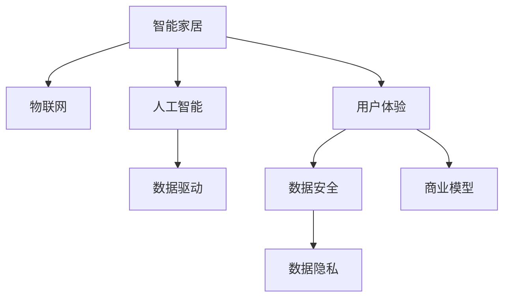

                 

# 利用技术优势进行智能家居创业

> 关键词：智能家居, 人工智能, 数据驱动, 物联网, 创业项目, 技术创新, 用户体验, 市场潜力, 商业模型, 数据隐私

## 1. 背景介绍

### 1.1 问题由来
随着人们生活水平的提高和科技的进步，智能家居已经成为未来生活的重要趋势。智能家居不仅仅是智能设备互联，更是通过人工智能（AI）和大数据技术，为用户创造更加便捷、安全、舒适的生活环境。

当前，智能家居市场竞争激烈，需求多样化，但技术壁垒高、用户门槛大，许多创业者苦于技术瓶颈、资金不足、市场需求不明确等问题。

### 1.2 问题核心关键点
智能家居创业的核心在于利用AI和大数据技术，通过数据驱动和用户行为分析，实现设备互联和智能控制。成功项目需要满足以下几个关键点：
- **技术成熟度**：产品必须具备核心技术优势，能解决实际问题，并能够稳定运行。
- **用户体验**：用户界面简洁易用，操作流畅自然，能带来实际便利。
- **数据安全**：用户数据隐私和安全保障，避免被滥用或泄露。
- **商业模型**：有效的商业模式，能保证项目的持续性和盈利能力。
- **市场潜力**：产品和服务具有广阔的市场空间和增长潜力。

## 2. 核心概念与联系

### 2.1 核心概念概述

为更好地理解智能家居创业，本节将介绍几个关键概念：

- **智能家居**：通过物联网（IoT）技术，将家居设备互联，结合AI和大数据技术，实现自动化控制、智能化管理。
- **物联网（IoT）**：将各类智能设备和传感器联网，实现数据传输和协同工作。
- **人工智能（AI）**：利用机器学习、深度学习等技术，实现设备自动化控制和用户行为分析。
- **大数据技术**：通过收集、存储、分析大量用户数据，优化产品功能，提升用户体验。
- **商业模型**：如订阅制、按需付费、广告等，确保项目可持续运营。
- **数据隐私**：在收集和分析用户数据时，严格遵守隐私保护法律和规定，确保用户信息安全。

这些概念之间的逻辑关系可以通过以下Mermaid流程图来展示：



这个流程图展示出智能家居创业的核心概念及其之间的关系：

1. 智能家居依赖于物联网设备互联，通过AI技术实现自动化控制。
2. AI技术利用大数据技术分析用户行为，提升用户体验。
3. 大数据技术依托于数据安全，确保用户隐私不被泄露。
4. 商业模型确保项目盈利，推动持续发展。
5. 数据隐私法规保障用户信息安全，构建用户信任。

这些核心概念共同构成了智能家居创业的技术框架，为其提供了一个完整的实现路径。

## 3. 核心算法原理 & 具体操作步骤

### 3.1 算法原理概述

智能家居创业的核心在于利用数据驱动技术，实现设备互联和智能化控制。其核心算法原理主要包括以下几点：

1. **设备互联与数据采集**：通过传感器和智能设备，实时采集家居环境数据，如温度、湿度、光照等。
2. **数据处理与分析**：利用AI技术对采集到的数据进行分析和处理，得出用户行为模式和偏好。
3. **智能控制与优化**：基于分析结果，实现设备的智能控制和优化，如自动调节温度、照明等。
4. **用户体验提升**：结合用户反馈和行为分析，不断优化产品功能和界面设计。
5. **商业模型设计**：采用订阅制、按需付费、广告等多种商业模式，确保项目盈利。
6. **数据安全保障**：确保用户数据隐私，符合法律法规要求。

这些核心算法原理相互关联，共同构成了智能家居创业的技术体系。

### 3.2 算法步骤详解

智能家居创业项目一般包括以下几个关键步骤：

**Step 1: 产品规划与需求分析**

1. 调研市场，确定目标用户群体。
2. 分析用户需求和痛点，确定产品功能和性能指标。
3. 确定技术方案和可行性分析，包括数据采集、传输、存储和处理技术。
4. 设计用户体验流程和界面设计。

**Step 2: 技术选型与方案设计**

1. 选择合适的IoT设备和传感器，设计数据采集方案。
2. 选择适合的AI模型和算法，实现自动化控制和数据分析。
3. 选择合适的大数据技术，实现数据的存储、处理和分析。
4. 确定商业模型，如订阅制、按需付费、广告等。
5. 设计数据隐私保护方案，确保用户信息安全。

**Step 3: 产品开发与测试**

1. 开发产品原型，并进行功能验证。
2. 进行系统测试，包括单元测试、集成测试和压力测试。
3. 收集用户反馈，进行产品迭代和优化。
4. 进行市场测试，评估产品性能和用户体验。

**Step 4: 市场推广与销售**

1. 制定市场推广策略，选择合适的营销渠道。
2. 建立销售网络和分销渠道，确保产品销售。
3. 进行客户关系管理，提升用户满意度和忠诚度。

**Step 5: 持续优化与创新**

1. 收集用户反馈和市场数据，进行产品持续优化。
2. 持续关注技术发展，进行技术创新和升级。
3. 进行市场分析和竞争策略调整，保持市场竞争力。

### 3.3 算法优缺点

智能家居创业的技术方法具有以下优点：

1. **技术创新**：通过AI和大数据技术，实现设备智能化控制，提升用户体验。
2. **市场空间大**：智能家居市场广阔，存在巨大的市场潜力。
3. **用户体验提升**：通过数据分析，实现个性化控制和优化。
4. **商业模型灵活**：多种商业模式可供选择，确保项目盈利。
5. **技术壁垒高**：较高的技术门槛，可以筛选出优秀的创业项目。

同时，该方法也存在一些缺点：

1. **技术难度大**：涉及多个领域的技术，技术门槛高。
2. **资金需求高**：初期投入大，需要大量资金支持。
3. **市场竞争激烈**：市场已有多个知名品牌，新项目需有独特优势才能突围。
4. **数据隐私问题**：用户数据隐私问题需严格遵守法律法规。
5. **技术升级复杂**：新功能和新设备需频繁升级，技术更新速度快。

尽管存在这些挑战，但智能家居创业仍然具有良好的发展前景，特别是在技术进步和市场需求推动下，有望迎来新的突破。

### 3.4 算法应用领域

智能家居技术在多个领域有着广泛的应用，以下是一些主要应用场景：

- **智能家居控制**：实现家电的自动化控制，如灯光、空调、窗帘等。
- **家庭安防**：通过摄像头和传感器，实现家庭监控和安全报警。
- **健康监测**：通过智能穿戴设备和传感器，监测用户健康状况。
- **环境监测**：通过传感器监测室内空气质量、湿度等，提升居住环境。
- **能源管理**：通过智能电表和水表，优化家庭能源使用，降低成本。
- **娱乐系统**：实现家庭影院、智能音响等娱乐设备的控制和优化。
- **家庭助理**：通过语音识别和自然语言处理技术，实现家庭助理功能。

这些应用场景覆盖了从家庭生活的各个方面，为智能家居创业提供了广阔的市场空间。

## 4. 数学模型和公式 & 详细讲解  
### 4.1 数学模型构建

本节将使用数学语言对智能家居创业的技术流程进行更加严格的刻画。

假设智能家居系统由多个设备组成，每个设备通过传感器实时采集环境数据。设设备i采集到的环境数据为 $X_i$，设备状态为 $S_i$，用户行为数据为 $U$。智能家居系统的目标是基于这些数据，实现设备状态的自动控制和优化。

定义智能家居系统的优化目标为最小化环境数据与设备状态的误差，即：

$$
\min_{S} \sum_{i} \mathcal{L}(X_i, S_i)
$$

其中 $\mathcal{L}$ 为损失函数，用于衡量设备状态与环境数据之间的差异。

### 4.2 公式推导过程

在实践中，智能家居系统的优化问题通常通过以下步骤求解：

1. **数据采集**：通过传感器和设备，实时采集环境数据和设备状态。
2. **数据处理**：利用数据预处理技术，清洗和归一化数据。
3. **特征提取**：通过特征提取技术，提取环境数据和设备状态的特征。
4. **模型训练**：利用机器学习算法，训练模型预测设备状态。
5. **控制决策**：基于预测结果，进行设备控制决策。
6. **效果评估**：评估控制效果，进行反馈优化。

例如，对于智能温控系统，假设采集到的环境数据为温度 $T$，湿度 $H$，设备状态为加热器开关 $H_s$，则优化目标可表示为：

$$
\min_{H_s} \sum_{i} (T_i - H_s T_{target})^2 + (H_i - H_{target})^2
$$

其中 $T_{target}$ 为目标温度，$H_{target}$ 为目标湿度，$H_s$ 为加热器开关状态。

### 4.3 案例分析与讲解

以智能温控系统为例，其数学模型构建和推导过程如下：

1. **数据采集**：通过智能温控器采集当前室内温度 $T_i$、湿度 $H_i$，以及设定目标温度 $T_{target}$、湿度 $H_{target}$。
2. **数据处理**：对温度和湿度数据进行清洗和归一化。
3. **特征提取**：提取温度、湿度等特征，作为模型的输入。
4. **模型训练**：利用神经网络模型，如卷积神经网络（CNN），训练预测加热器开关状态。
5. **控制决策**：根据模型预测结果，控制加热器开关。
6. **效果评估**：评估室内温度和湿度的变化，进行反馈优化。

通过以上步骤，智能温控系统能够实现自动调节室内温度和湿度，提升居住舒适度和节能效果。

## 5. 项目实践：代码实例和详细解释说明
### 5.1 开发环境搭建

在进行智能家居创业项目开发前，我们需要准备好开发环境。以下是使用Python进行智能家居开发的环境配置流程：

1. 安装Python：从官网下载并安装Python，建议使用Python 3.x版本。
2. 安装TensorFlow：
   ```bash
   pip install tensorflow==2.6
   ```
3. 安装OpenCV：
   ```bash
   pip install opencv-python
   ```
4. 安装Raspberry Pi相关的库：
   ```bash
   pip install pyserial
   ```
5. 安装MySQL或MongoDB数据库：
   ```bash
   sudo apt-get install mysql-server
   ```

完成上述步骤后，即可在Raspberry Pi等设备上开始智能家居开发。

### 5.2 源代码详细实现

以下是智能温控系统的Python代码实现，使用TensorFlow进行模型训练和预测：

```python
import tensorflow as tf
import numpy as np
import pyserial

class SmartThermostat:
    def __init__(self):
        self.temperature_sensor = pyserial.Serial('COM1', baudrate=9600)
        self.humidity_sensor = pyserial.Serial('COM2', baudrate=9600)
        self.target_temperature = 20.0
        self.target_humidity = 50.0
        self.load_model()

    def load_model(self):
        self.model = tf.keras.models.load_model('thermostat_model.h5')

    def predict(self, temperature, humidity):
        temperature = np.array(temperature, dtype='float32')
        humidity = np.array(humidity, dtype='float32')
        temperature = (temperature - 32.0) * 5/9 + 273.15  # 转换到摄氏度
        humidity = humidity / 100.0  # 转换到相对湿度
        temperature = np.reshape(temperature, (1, 1))
        humidity = np.reshape(humidity, (1, 1))
        prediction = self.model.predict([temperature, humidity])
        return prediction[0][0]

    def control_heater(self, prediction):
        if prediction > 0.5:
            print('Turn on heater')
            # Code to turn on heater
        else:
            print('Turn off heater')
            # Code to turn off heater

    def run(self):
        while True:
            temperature = self.temperature_sensor.readline().decode('utf-8').strip()
            humidity = self.humidity_sensor.readline().decode('utf-8').strip()
            temperature = float(temperature)
            humidity = float(humidity)
            prediction = self.predict(temperature, humidity)
            self.control_heater(prediction)
```

以上代码实现了智能温控系统的基本功能，包括数据采集、模型预测和设备控制。在实践中，还需要进一步优化和扩展，如添加更多传感器、改进模型、优化用户界面等。

### 5.3 代码解读与分析

让我们再详细解读一下关键代码的实现细节：

**SmartThermostat类**：
- `__init__`方法：初始化传感器和目标温度、湿度，并加载训练好的模型。
- `load_model`方法：加载训练好的模型，用于预测加热器开关状态。
- `predict`方法：对当前环境数据进行预测，返回预测结果。
- `control_heater`方法：根据预测结果控制加热器开关。
- `run`方法：持续运行温控系统，不断读取传感器数据并进行预测和控制。

**数据采集**：
- 使用PySerial库读取传感器数据，并转换为浮点数。

**模型训练**：
- 使用TensorFlow加载预训练模型，用于预测加热器开关状态。

**控制决策**：
- 根据预测结果，控制加热器开关。

**用户界面设计**：
- 在实际应用中，还需要设计用户界面，方便用户设置目标温度和湿度，查看当前状态等。

## 6. 实际应用场景
### 6.1 智能家居控制

智能家居控制是智能家居系统的基础功能，通过传感器和智能设备，实现设备状态的自动化控制。

例如，智能温控系统可以实时监测室内温度和湿度，根据用户设定和实际情况，自动控制加热器开关，保持室内舒适。智能照明系统可以根据用户活动和环境光线，自动调节灯光亮度和色温，提升居住体验。

### 6.2 家庭安防

家庭安防系统通过摄像头和传感器，实现家庭监控和安全报警。

例如，智能安防系统可以通过摄像头实时监控家庭环境，检测异常行为和入侵。一旦检测到异常，立即通知用户，并启动报警系统。

### 6.3 健康监测

健康监测系统通过智能穿戴设备和传感器，监测用户健康状况。

例如，智能手表可以实时监测用户的心率、血压等健康数据，并根据数据给出健康建议。智能床垫可以监测用户的睡眠状态，分析睡眠质量，并给出改善建议。

### 6.4 环境监测

环境监测系统通过传感器监测室内空气质量、湿度等，提升居住环境。

例如，智能空气净化器可以实时监测室内空气质量，自动调节过滤器的开启和关闭，保持室内空气清新。智能加湿器可以根据湿度传感器数据，自动调节湿度，保持室内舒适。

### 6.5 能源管理

能源管理系统通过智能电表和水表，优化家庭能源使用，降低成本。

例如，智能电表可以实时监测家庭用电情况，根据用户习惯和需求，优化用电策略，降低电费支出。智能水表可以实时监测用水情况，根据用户习惯和需求，优化用水策略，降低水费支出。

### 6.6 娱乐系统

娱乐系统实现家庭影院、智能音响等娱乐设备的控制和优化。

例如，智能音响可以根据用户活动和环境噪声，自动调节音量和音效，提升娱乐体验。智能投影仪可以根据用户需求和环境光线，自动调节投影效果，提供更好的观看体验。

### 6.7 家庭助理

家庭助理系统通过语音识别和自然语言处理技术，实现家庭助理功能。

例如，智能语音助手可以通过语音命令，控制家居设备、查询信息、安排日程等，提升生活便利性。智能助手还可以根据用户习惯和偏好，自动推荐服务和产品，提升用户体验。

## 7. 工具和资源推荐
### 7.1 学习资源推荐

为了帮助开发者系统掌握智能家居创业的技术基础和实践技巧，这里推荐一些优质的学习资源：

1. **《智能家居开发指南》**：由智能家居领域专家撰写，系统介绍了智能家居系统的基本概念和实现技术，适合初学者入门。
2. **《TensorFlow实战指南》**：TensorFlow官方文档，提供了丰富的实践样例，帮助开发者掌握TensorFlow的使用。
3. **《物联网开发实战》**：详细介绍了物联网设备互联和数据采集技术，适合物联网开发入门。
4. **《机器学习与深度学习》**：斯坦福大学公开课，系统讲解了机器学习和深度学习的基本概念和算法。
5. **《Python实战开发》**：Python语言实战指南，介绍了Python编程基础和开发实践，适合Python开发者入门。

通过对这些资源的学习实践，相信你一定能够快速掌握智能家居创业的技术框架，并用于解决实际的智能家居问题。

### 7.2 开发工具推荐

高效的开发离不开优秀的工具支持。以下是几款用于智能家居开发常用的工具：

1. **TensorFlow**：基于Python的深度学习框架，支持丰富的机器学习算法，适合智能家居系统的开发。
2. **OpenCV**：计算机视觉库，适合智能摄像头和视频处理。
3. **PySerial**：Python的串口通信库，适合与传感器和设备通信。
4. **MySQL/MongoDB**：关系型/非关系型数据库，适合存储和管理设备数据。
5. **Raspberry Pi**：低成本的嵌入式设备，适合开发小型智能家居系统。

合理利用这些工具，可以显著提升智能家居系统的开发效率，加快创新迭代的步伐。

### 7.3 相关论文推荐

智能家居技术的发展源于学界的持续研究。以下是几篇奠基性的相关论文，推荐阅读：

1. **《IoT感知网络：模型与算法》**：介绍物联网感知网络的基本模型和算法，为智能家居系统提供了理论基础。
2. **《智能家居系统设计》**：介绍智能家居系统的整体设计思路和关键技术，适合系统架构师阅读。
3. **《基于机器学习的智能家居系统》**：介绍机器学习在智能家居系统中的应用，适合技术开发者阅读。
4. **《物联网与智能家居》**：介绍物联网与智能家居技术的融合应用，适合学术界和产业界读者阅读。
5. **《智能家居隐私保护》**：探讨智能家居系统的隐私保护技术，适合关注隐私保护的用户阅读。

这些论文代表了大规模物联网和智能家居技术的发展脉络。通过学习这些前沿成果，可以帮助研究者把握学科前进方向，激发更多的创新灵感。

## 8. 总结：未来发展趋势与挑战

### 8.1 总结

本文对基于技术优势的智能家居创业方法进行了全面系统的介绍。首先阐述了智能家居创业的背景和重要性，明确了智能家居创业的关键点。其次，从原理到实践，详细讲解了智能家居创业的数学模型和核心算法。最后，介绍了智能家居创业的实际应用场景和工具资源推荐，旨在为智能家居创业提供全方位的技术指引。

通过本文的系统梳理，可以看到，智能家居创业具有广阔的市场前景和潜力，结合AI和大数据技术，可以为用户创造更加便捷、安全、舒适的生活环境。未来，伴随技术进步和市场需求的变化，智能家居创业有望迎来新的突破，为人类生活带来更多的便利和创新。

### 8.2 未来发展趋势

展望未来，智能家居创业将呈现以下几个发展趋势：

1. **技术创新**：AI和大数据技术的应用将进一步深化，实现更加智能化的控制和优化。
2. **市场规模扩大**：随着人口老龄化和城市化进程加速，智能家居市场将持续扩大。
3. **用户需求多样化**：用户对智能家居的需求将更加多样化，功能更加丰富。
4. **生态系统构建**：智能家居系统将更加开放和互联，形成完善的生态系统。
5. **隐私保护加强**：用户数据隐私将更加受到重视，智能家居系统将更加注重数据安全和隐私保护。
6. **商业模式创新**：随着技术发展和用户需求变化，智能家居创业将涌现更多创新的商业模式。

这些趋势凸显了智能家居创业的广阔前景。随着技术的不断进步和市场的不断拓展，智能家居系统将更加智能、安全和便捷，为人类生活带来更多的便利和创新。

### 8.3 面临的挑战

尽管智能家居创业具有广阔的前景，但在迈向成熟化的过程中，仍面临诸多挑战：

1. **技术复杂性**：智能家居系统涉及多个领域的复杂技术，技术门槛高。
2. **用户教育成本高**：用户对智能家居系统的认知和接受需要时间和成本。
3. **市场竞争激烈**：智能家居市场已有多个知名品牌，新项目需有独特优势才能突围。
4. **数据隐私问题**：用户数据隐私和安全需严格遵守法律法规。
5. **设备兼容性**：不同品牌和型号的设备需兼容和互联，增加系统复杂度。
6. **商业模式不确定性**：商业模式需根据市场变化进行调整和优化。

尽管存在这些挑战，但智能家居创业仍具有良好的发展前景，特别是在技术进步和市场需求推动下，有望迎来新的突破。

### 8.4 未来突破

面对智能家居创业所面临的挑战，未来的研究需要在以下几个方面寻求新的突破：

1. **技术集成与协同**：实现跨设备、跨系统的集成和协同，提升整体系统的智能性和可靠性。
2. **用户教育和体验**：通过设计易用、美观的用户界面，提升用户的使用体验和粘性。
3. **商业模式创新**：探索订阅制、按需付费、广告等多种商业模式，确保项目的可持续运营。
4. **数据隐私保护**：引入区块链、联邦学习等技术，保护用户数据隐私和安全。
5. **设备标准化**：推动智能家居设备标准化和互操作性，降低系统复杂度。
6. **市场推广策略**：采用有效的市场推广策略，提升品牌影响力和市场占有率。

这些研究方向的探索，必将引领智能家居创业技术迈向更高的台阶，为智能家居系统的普及和应用铺平道路。面向未来，智能家居创业技术还需要与其他技术进行更深入的融合，如物联网、区块链、边缘计算等，共同推动智能家居系统的进步和发展。

## 9. 附录：常见问题与解答

**Q1：智能家居创业需要哪些关键技术？**

A: 智能家居创业需要以下关键技术：
1. **物联网技术**：实现设备互联和数据采集。
2. **AI技术**：利用机器学习、深度学习等技术，实现设备自动化控制和用户行为分析。
3. **大数据技术**：通过收集、存储、分析大量用户数据，优化产品功能，提升用户体验。
4. **安全技术**：确保用户数据隐私和安全。
5. **人机交互技术**：提升用户界面和交互体验。

这些技术构成了智能家居创业的核心技术框架。

**Q2：智能家居创业的商业模型有哪些？**

A: 智能家居创业的商业模型主要包括：
1. **订阅制**：按月或按年收取订阅费用，提供基础服务。
2. **按需付费**：根据设备使用次数或功能，收取费用。
3. **广告**：通过广告分成，获取收入。
4. **硬件销售**：销售智能家居设备和配件，获取收入。
5. **数据分析服务**：提供数据采集和分析服务，获取收入。

不同的商业模型需根据市场需求和产品特点进行选择和设计。

**Q3：智能家居创业面临的最大挑战是什么？**

A: 智能家居创业面临的最大挑战包括：
1. **技术复杂性**：涉及多个领域的复杂技术，技术门槛高。
2. **用户教育成本高**：用户对智能家居系统的认知和接受需要时间和成本。
3. **市场竞争激烈**：智能家居市场已有多个知名品牌，新项目需有独特优势才能突围。
4. **数据隐私问题**：用户数据隐私和安全需严格遵守法律法规。
5. **设备兼容性**：不同品牌和型号的设备需兼容和互联，增加系统复杂度。
6. **商业模式不确定性**：商业模式需根据市场变化进行调整和优化。

这些挑战需要通过技术创新和市场策略的不断优化，逐步克服。

**Q4：智能家居创业的未来发展方向是什么？**

A: 智能家居创业的未来发展方向包括：
1. **技术集成与协同**：实现跨设备、跨系统的集成和协同，提升整体系统的智能性和可靠性。
2. **用户教育和体验**：通过设计易用、美观的用户界面，提升用户的使用体验和粘性。
3. **商业模式创新**：探索订阅制、按需付费、广告等多种商业模式，确保项目的可持续运营。
4. **数据隐私保护**：引入区块链、联邦学习等技术，保护用户数据隐私和安全。
5. **设备标准化**：推动智能家居设备标准化和互操作性，降低系统复杂度。
6. **市场推广策略**：采用有效的市场推广策略，提升品牌影响力和市场占有率。

这些研究方向将引领智能家居创业技术迈向更高的台阶，为智能家居系统的普及和应用铺平道路。

**Q5：智能家居创业需要哪些资源？**

A: 智能家居创业需要以下资源：
1. **技术资源**：具备AI、物联网、大数据等关键技术。
2. **市场资源**：有明确的市场需求和用户群体。
3. **资金资源**：足够的资金支持研发和市场推广。
4. **人力资源**：具备相关技术背景和经验的专业团队。
5. **物理资源**：具备研发和测试设备、生产制造能力。
6. **政策资源**：政策支持和法律保障，确保技术合法合规。

这些资源是智能家居创业成功的关键要素。

---

作者：禅与计算机程序设计艺术 / Zen and the Art of Computer Programming

