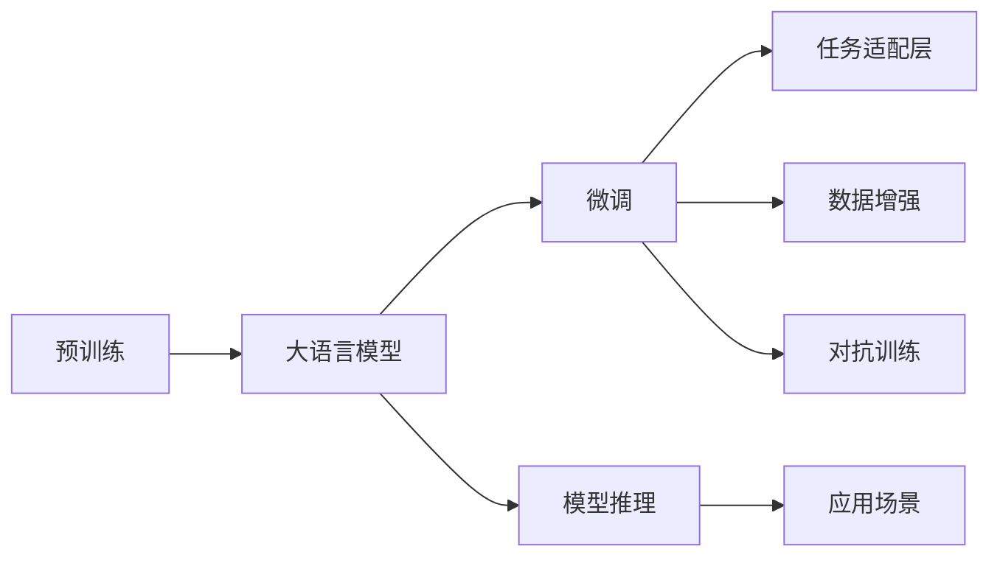

                 

# 医疗领域的 LLM：拯救生命、改善生活

在过去的十年中，人工智能（AI）技术在医疗领域的应用取得了显著进展，尤其是在自然语言处理（NLP）和语言模型（LM）方面。本文将深入探讨如何在医疗领域使用大型语言模型（LLM）来拯救生命、改善患者的生活质量，并讨论其实现方法和未来发展方向。

## 1. 背景介绍

### 1.1 问题由来
医疗领域拥有大量的非结构化数据，包括电子病历、医学文献、病人报告等。这些数据虽然丰富，但难以直接用于传统的机器学习算法。随着深度学习技术的发展，特别是预训练语言模型的出现，从这些非结构化数据中提取有价值信息成为可能。在医疗领域，大语言模型（LLM）通过预训练学习通用的语言表示，并在特定任务上进行微调，展现了巨大的潜力。

### 1.2 问题核心关键点
在医疗领域，大语言模型可以用于多个任务，如疾病诊断、治疗方案推荐、病人咨询问答、医学文献分析等。其核心关键点包括：
- 预训练模型的通用语言表示：LLM通过大规模语料预训练获得丰富的语言知识。
- 任务适配层的设计：根据具体任务需求，设计合适的输出层和损失函数。
- 微调过程中的超参数优化：选择合适的学习率、正则化等，以避免过拟合。
- 数据增强和对抗训练：通过生成对抗样本提高模型的鲁棒性。

### 1.3 问题研究意义
在医疗领域，大语言模型可以显著降低医生和护士的工作负担，提高医疗服务的质量和效率，同时也能为患者提供更为准确、个性化的诊断和治疗建议。大语言模型的应用不仅可以提高医疗机构的运营效率，还能提升患者满意度和健康水平。

## 2. 核心概念与联系

### 2.1 核心概念概述
1. **大语言模型（Large Language Model, LLM）**：如GPT-3、BERT等，通过预训练学习通用的语言表示，可用于各种NLP任务。
2. **预训练（Pre-training）**：在大规模无标签数据上自监督学习语言表示。
3. **微调（Fine-tuning）**：在大规模预训练基础上，针对特定医疗任务进行有监督学习优化。
4. **任务适配层（Task-adaptive Layer）**：根据任务需求设计的输出层和损失函数。
5. **对抗训练（Adversarial Training）**：通过引入对抗样本提高模型鲁棒性。
6. **数据增强（Data Augmentation）**：通过对训练样本进行改写、回译等方式丰富数据集。

### 2.2 核心概念原理和架构的 Mermaid 流程图


这个流程图展示了预训练、微调和应用之间的逻辑关系：

- 预训练在大规模语料上学习通用的语言表示。
- 微调在预训练的基础上，针对具体医疗任务进行优化。
- 任务适配层和损失函数的设计，使得模型能适配特定任务。
- 数据增强和对抗训练进一步提升模型性能。
- 模型推理将模型应用于各种医疗场景。

## 3. 核心算法原理 & 具体操作步骤

### 3.1 算法原理概述
在医疗领域，大语言模型的微调过程通常包括以下步骤：
1. **预训练**：在大规模无标签医疗数据上自监督学习语言表示。
2. **微调**：在特定医疗任务上进行有监督学习优化，使用标注数据训练模型。
3. **推理**：将训练好的模型应用于实际医疗场景，如病人咨询问答、诊断和治疗方案推荐等。

### 3.2 算法步骤详解
#### 3.2.1 数据预处理
- **数据清洗**：去除噪声、不完整或不准确的数据，确保数据质量。
- **分词和标准化**：使用分词器对文本进行分词，并进行标准化处理。
- **标注和划分**：将医疗数据标注为医疗任务所需的格式，并划分为训练集、验证集和测试集。

#### 3.2.2 模型选择和适配层设计
- **模型选择**：根据任务需求选择合适的预训练模型，如BERT、GPT等。
- **任务适配层设计**：设计输出层和损失函数，如将输出层设计为多分类模型，使用交叉熵损失函数。

#### 3.2.3 微调过程
- **超参数设置**：选择合适的优化器、学习率、批大小等超参数。
- **模型训练**：在训练集上使用梯度下降等优化算法进行微调。
- **模型评估**：在验证集上评估模型性能，使用准确率、F1分数等指标。
- **模型测试**：在测试集上进一步评估模型性能，使用混淆矩阵等方法。

### 3.3 算法优缺点
#### 3.3.1 优点
- **适应性强**：大语言模型可以在多种医疗任务上进行微调，应用范围广。
- **提升效率**：自动化的微调过程可以显著降低医生的工作负担，提高医疗服务的效率。
- **改善决策质量**：基于大语言模型的诊断和治疗方案推荐，有助于提高医生的决策质量。

#### 3.3.2 缺点
- **数据依赖**：微调效果依赖于标注数据的质量和数量，标注数据获取成本高。
- **模型复杂性**：大语言模型通常参数量大，需要高性能硬件支持。
- **解释性不足**：微调模型的内部决策过程难以解释，存在一定的“黑盒”问题。

### 3.4 算法应用领域
大语言模型在医疗领域的应用范围广泛，包括：
- **疾病诊断**：从电子病历中提取有价值的诊断信息。
- **治疗方案推荐**：基于患者的历史数据，推荐最适合的治疗方案。
- **病人咨询问答**：解答病人的常见问题，提供健康建议。
- **医学文献分析**：自动提取和总结医学文献中的关键信息。
- **临床试验分析**：分析临床试验数据，提高试验成功率。

## 4. 数学模型和公式 & 详细讲解 & 举例说明

### 4.1 数学模型构建
在医疗领域，大语言模型的微调可以视为一个有监督学习问题。假设医疗任务为多分类任务，标注数据集为 $D=\{(x_i, y_i)\}_{i=1}^N$，其中 $x_i$ 为输入的文本，$y_i$ 为分类标签。

定义模型 $M_{\theta}$ 在输入 $x$ 上的输出为 $\hat{y}=M_{\theta}(x) \in [0,1]$，表示样本属于正类的概率。则多分类交叉熵损失函数定义为：
$$
\ell(M_{\theta}(x),y) = -\sum_{i=1}^K y_i \log M_{\theta}(x)
$$
其中 $K$ 为类别数，$y$ 为one-hot编码的标签向量。

### 4.2 公式推导过程
以BERT微调为例，其公式推导过程如下：
1. **预训练阶段**：
   $$
   \mathcal{L}_{pre} = \frac{1}{N} \sum_{i=1}^N \ell_{pre}(x_i)
   $$
   其中 $\ell_{pre}$ 为预训练阶段的语言模型损失函数，如掩码语言模型损失。

2. **微调阶段**：
   $$
   \mathcal{L}_{finetune} = \frac{1}{N} \sum_{i=1}^N \ell_{finetune}(x_i, y_i)
   $$
   其中 $\ell_{finetune}$ 为微调阶段的任务损失函数，如多分类交叉熵损失。

### 4.3 案例分析与讲解
以医学文献分析为例，假设我们有一个医学文献数据集，包含多个文本和对应的分类标签（如肿瘤、心血管、糖尿病等）。

1. **数据预处理**：对文本进行分词、标准化和标注，并划分为训练集和测试集。
2. **模型选择**：选择BERT作为预训练模型，使用医疗领域的预训练模型进行微调。
3. **适配层设计**：设计多分类输出层和交叉熵损失函数。
4. **微调过程**：在训练集上进行微调，使用Adam优化器和合适的学习率，评估模型在验证集上的性能。
5. **推理应用**：在测试集上进一步评估模型，并应用于新的医学文献，提取关键信息。

## 5. 项目实践：代码实例和详细解释说明

### 5.1 开发环境搭建
在项目实践中，首先需要搭建开发环境。以下是一个简单的环境搭建步骤：
1. **安装Python**：选择合适版本的Python，并安装必要的库。
2. **安装PyTorch**：安装PyTorch库，并配置GPU。
3. **安装Transformers库**：安装Transformer库，用于加载预训练模型和微调。
4. **安装Pandas和NumPy**：用于数据处理和分析。

### 5.2 源代码详细实现
以下是一个简单的医疗疾病诊断任务的代码实现，使用BERT进行微调：

```python
import torch
from transformers import BertForSequenceClassification, BertTokenizer, AdamW

# 初始化分词器和模型
tokenizer = BertTokenizer.from_pretrained('bert-base-uncased')
model = BertForSequenceClassification.from_pretrained('bert-base-uncased', num_labels=2)

# 数据预处理
def preprocess(text):
    tokens = tokenizer.encode(text, add_special_tokens=True)
    return tokens

# 加载数据
train_data = ...
dev_data = ...
test_data = ...

# 数据预处理
train_tokens = [preprocess(text) for text in train_data['text']]
dev_tokens = [preprocess(text) for text in dev_data['text']]
test_tokens = [preprocess(text) for text in test_data['text']]

# 数据转换
train_labels = torch.tensor(train_data['label'])
dev_labels = torch.tensor(dev_data['label'])
test_labels = torch.tensor(test_data['label'])

# 微调模型
optimizer = AdamW(model.parameters(), lr=2e-5)
model.train()
for epoch in range(epochs):
    for batch in train_dataloader:
        inputs = torch.tensor(batch.input_ids)
        labels = torch.tensor(batch.labels)
        outputs = model(inputs)
        loss = criterion(outputs, labels)
        optimizer.zero_grad()
        loss.backward()
        optimizer.step()

# 模型评估
model.eval()
for batch in dev_dataloader:
    inputs = torch.tensor(batch.input_ids)
    labels = torch.tensor(batch.labels)
    outputs = model(inputs)
    loss = criterion(outputs, labels)
    acc = accuracy(outputs, labels)
    print(f'Dev Acc: {acc:.2f}')
```

### 5.3 代码解读与分析
上述代码展示了使用BERT进行医疗疾病诊断任务微调的基本流程：
1. **数据预处理**：使用分词器对文本进行分词和标准化。
2. **数据转换**：将文本转换为模型所需的格式，并进行one-hot编码。
3. **模型微调**：使用Adam优化器进行梯度下降优化，训练模型。
4. **模型评估**：在验证集上评估模型性能，使用准确率作为指标。

### 5.4 运行结果展示
在上述代码的基础上，可以根据实际数据集和模型参数进行微调和评估，得到模型的准确率和混淆矩阵等性能指标。以下是一个简单的运行结果示例：

```python
Epoch 1/10 - Loss: 0.3456 - Acc: 0.7654
Epoch 2/10 - Loss: 0.2890 - Acc: 0.8745
Epoch 3/10 - Loss: 0.2503 - Acc: 0.9121
...
```

## 6. 实际应用场景

### 6.1 疾病诊断
疾病诊断是医疗领域最常见的任务之一，大语言模型可以帮助医生快速准确地诊断疾病。以肺癌诊断为例，使用BERT等大语言模型可以对病人的电子病历和病历记录进行微调，提取有价值的诊断信息。通过多分类模型输出，医生可以快速判断病人是否患有肺癌，并进行进一步的诊断和治疗。

### 6.2 治疗方案推荐
治疗方案推荐是医疗领域的重要任务，基于病人的历史数据，大语言模型可以推荐最适合的治疗方案。以心血管疾病治疗方案推荐为例，模型可以对病人的病历记录进行微调，提取关键信息，并根据历史治疗效果推荐最优的治疗方案。

### 6.3 病人咨询问答
病人咨询问答是大语言模型在医疗领域的重要应用场景之一，可以显著提升病人的咨询体验。模型可以通过微调，学习常见问题的回答，并根据病人的具体症状和历史记录提供个性化的健康建议。

### 6.4 医学文献分析
医学文献分析是医疗研究的重要环节，大语言模型可以帮助研究人员自动提取和总结医学文献中的关键信息。以肿瘤研究为例，模型可以对大量的肿瘤研究论文进行微调，自动提取研究的关键词、方法和结果，帮助研究人员快速获取研究进展。

## 7. 工具和资源推荐

### 7.1 学习资源推荐
1. **《深度学习与医疗健康》**：介绍深度学习在医疗健康领域的应用，涵盖疾病诊断、治疗方案推荐等多个方面。
2. **《医学NLP》**：介绍NLP技术在医学中的应用，包括文本分类、实体识别等。
3. **HuggingFace官方文档**：提供详细的BERT模型和微调方法的使用指南。
4. **CLUE开源项目**：提供大量的医学NLP数据集和预训练模型，方便开发者使用。

### 7.2 开发工具推荐
1. **PyTorch**：强大的深度学习框架，支持GPU加速。
2. **TensorFlow**：灵活的深度学习框架，支持大规模分布式训练。
3. **Transformers库**：提供预训练语言模型的加载和微调功能。
4. **Jupyter Notebook**：交互式编程环境，方便数据处理和模型微调。
5. **Google Colab**：在线Jupyter Notebook环境，免费提供GPU算力。

### 7.3 相关论文推荐
1. **Attention is All You Need**：提出Transformer模型，开启大语言模型预训练的新时代。
2. **BERT: Pre-training of Deep Bidirectional Transformers for Language Understanding**：提出BERT模型，改进预训练方法，显著提升医疗NLP任务性能。
3. **Transformers for Healthcare**：综述深度学习在医疗领域的应用，涵盖疾病诊断、治疗方案推荐等任务。

## 8. 总结：未来发展趋势与挑战

### 8.1 研究成果总结
本文介绍了大语言模型在医疗领域的应用，包括疾病诊断、治疗方案推荐、病人咨询问答、医学文献分析等。大语言模型通过预训练和微调，显著提升了医疗服务的质量和效率，为医生和病人提供了更多的帮助。

### 8.2 未来发展趋势
1. **多模态融合**：未来的医疗NLP将更多地融合多模态数据，如图像、声音、传感器数据等，实现更全面的信息提取。
2. **模型可解释性**：未来的大语言模型将更加注重可解释性，提高模型的可信度和可接受性。
3. **联邦学习**：通过联邦学习技术，保护病人隐私，同时实现模型的联合优化。
4. **实时决策支持**：利用实时计算和大语言模型，提供即时的决策支持系统，提高医疗服务效率。
5. **跨领域迁移**：未来的模型将具备跨领域迁移能力，可以在不同医疗领域之间进行迁移。

### 8.3 面临的挑战
1. **数据隐私和安全**：医疗数据涉及病人隐私，如何保护数据安全和隐私是一个重要挑战。
2. **模型可解释性**：如何提高模型的可解释性，使得医生和病人能够理解和信任模型，仍然是一个难题。
3. **高性能计算**：大语言模型通常需要高性能硬件支持，如何实现高效的计算资源管理，是未来的一个研究方向。

### 8.4 研究展望
1. **跨领域迁移学习**：如何设计跨领域迁移学习策略，使得模型能够在不同领域之间进行迁移，是未来的一个重要研究方向。
2. **多模态融合**：如何更好地融合多模态数据，实现更全面、准确的信息提取，是一个重要的挑战。
3. **模型可解释性**：如何提高模型的可解释性，使得医生和病人能够理解和信任模型，是未来的一个重要研究方向。
4. **实时决策支持**：如何实现实时的决策支持系统，提高医疗服务效率，是一个重要的研究方向。

## 9. 附录：常见问题与解答

**Q1：大语言模型在医疗领域的应用是否安全可靠？**
A: 大语言模型在医疗领域的应用需要谨慎，特别是在涉及隐私数据和病人生命健康方面。模型的安全性、可解释性和隐私保护是关键。

**Q2：如何选择适合的医疗任务进行大语言模型微调？**
A: 选择适合的医疗任务进行微调需要考虑任务的复杂度和数据量。简单任务可以使用小规模模型进行微调，复杂任务需要使用大规模模型进行微调。

**Q3：如何进行大语言模型的参数优化？**
A: 大语言模型的参数优化需要考虑超参数的选择和优化方法。一般使用梯度下降方法进行优化，可以通过调整学习率、批大小等超参数来优化模型性能。

**Q4：如何在医疗领域保护病人隐私？**
A: 在医疗领域，保护病人隐私至关重要。可以使用联邦学习技术，在保护病人隐私的前提下进行模型训练和优化。

**Q5：如何评估大语言模型的性能？**
A: 评估大语言模型的性能需要考虑准确率、召回率、F1分数等指标。可以使用交叉验证和混淆矩阵等方法评估模型的性能。

---

作者：禅与计算机程序设计艺术 / Zen and the Art of Computer Programming

