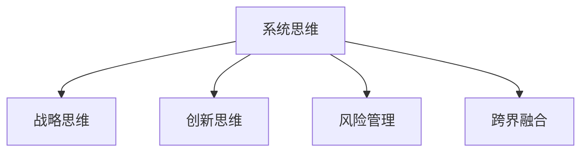

                 

# 卓越管理者的思维修炼之路

> 关键词：卓越管理者, 思维修炼, 领导力, 决策科学, 跨界融合

## 1. 背景介绍

### 1.1 问题由来
在当今快速变化和高度竞争的商业环境中，卓越的管理者不仅需要具备扎实的专业技能，更需要具备系统化、战略性的思维能力。如何在复杂多变的市场环境中，及时捕捉商机、做出准确决策、实现可持续发展，是每一个管理者必须面对的挑战。管理思维的修炼成为了卓越领导力的核心要义。

### 1.2 问题核心关键点
卓越管理者需要培养的关键思维包括：系统思维、战略思维、创新思维、风险管理和跨界融合等。通过系统化、结构化的思维框架，管理者能够更好地理解环境变化，制定战略，并在不确定性中寻找机会。

### 1.3 问题研究意义
系统化、结构化的思维修炼，不仅有助于管理者提升业务决策能力，更能够在组织内形成统一的价值观和行为规范，推动企业创新和持续成长。管理者思维的提升，能够带动整个组织能力的提升，增强企业在复杂环境中的竞争力。

## 2. 核心概念与联系

### 2.1 核心概念概述

为了更深入地理解卓越管理者的思维修炼之路，本节将介绍几个关键概念：

- **系统思维**：将问题视为一个系统，全面、综合地考虑其各个部分和相互关系，以求得整体最优解的思维方法。
- **战略思维**：在复杂多变的环境下，提前规划、决策，以求得长远发展与竞争优势。
- **创新思维**：突破传统束缚，寻找新方法、新模式，以实现突破性进展的思维模式。
- **风险管理**：识别、评估和控制不确定性，以最小化负面影响、最大化收益的实践。
- **跨界融合**：跨越不同学科、行业、文化，寻找创新点，实现协同发展的能力。

这些核心概念共同构成了卓越管理者思维修炼的基石，通过系统学习这些概念，管理者可以更好地应对各类管理挑战。

### 2.2 核心概念原理和架构的 Mermaid 流程图



这个流程图展示了卓越管理者思维修炼的主要组成部分，以及它们之间的相互关系。通过系统思维，管理者能够全面地看待问题，从整体角度制定战略；创新思维使管理者敢于打破常规，寻找新方法；风险管理使管理者能够评估并控制不确定性，保障决策的有效性；跨界融合使管理者能够汲取多元视角，推动组织创新。

## 3. 核心算法原理 & 具体操作步骤
### 3.1 算法原理概述

卓越管理者思维的修炼，并非一蹴而就，而是一个持续学习、实践和迭代的过程。以下是一些关键步骤和算法原理概述：

### 3.2 算法步骤详解

**Step 1: 自我反思与评估**

- **目标设定**：明确个人和组织的短期与长期目标，确保目标的SMART性（具体、可衡量、可达成、相关性、时限性）。
- **现状分析**：通过SWOT分析法（优势、劣势、机会、威胁），全面了解自身和环境，识别问题和机会。
- **绩效评估**：定期进行绩效评估，识别优势与不足，为改进提供依据。

**Step 2: 学习与知识管理**

- **持续学习**：通过阅读、培训、网络课程等多种方式，不断更新知识体系，跟踪行业动态。
- **知识管理**：建立知识管理系统，将学到的知识进行分类、整理，便于检索和应用。

**Step 3: 跨界融合与创新**

- **跨界学习**：积极参与不同领域的活动，寻找跨界点，引入新思路和新方法。
- **创新实践**：将新知识应用到管理实践中，不断尝试、迭代，逐步形成自己的独特管理方法。

**Step 4: 风险评估与管理**

- **风险识别**：识别可能影响目标实现的各种风险因素，包括市场风险、技术风险、操作风险等。
- **风险评估**：评估风险发生的可能性和影响程度，采用定量与定性分析相结合的方法。
- **风险控制**：采取适当的控制措施，如风险转移、风险规避、风险缓解等，以降低风险带来的影响。

**Step 5: 系统思维与战略规划**

- **系统思考**：采用系统动力学模型、网络图、因果图等工具，全面理解系统结构和运行机制。
- **战略规划**：结合内外部环境分析，制定中长期战略，确保组织在未来环境中的竞争力。

### 3.3 算法优缺点

卓越管理者的思维修炼具有以下优点：

- **系统性**：通过全面、综合的视角分析问题，能够避免局部优化带来的系统失效。
- **战略前瞻**：提前规划、预见变化，能够更好地把握长期机会。
- **创新驱动**：持续的跨界学习和实践，带来新的管理方法和理念。
- **风险规避**：通过系统的风险评估与管理，减少不确定性带来的损失。

同时，也存在以下缺点：

- **复杂度高**：系统化、战略化的思考要求较高的分析能力和时间投入。
- **实践难度大**：创新和跨界融合在实际操作中可能面临资源和能力的限制。
- **执行难度高**：战略实施需要高层支持，跨部门协作，执行难度较大。

### 3.4 算法应用领域

卓越管理者的思维修炼不仅适用于商业管理，更在各个领域都有广泛应用。以下是几个典型应用领域：

1. **组织变革管理**：通过系统思维和战略规划，推动组织进行战略性变革，提升竞争力。
2. **创新创业**：利用创新思维和跨界融合，发现并抓住市场机会，实现创新和创业。
3. **项目管理**：采用系统思维和风险管理，确保项目按计划顺利推进，实现预期目标。
4. **人力资源管理**：通过跨界学习和创新，提高人力资源的吸引力和利用效率。
5. **市场营销**：采用创新思维和系统思维，制定市场策略，提升品牌价值和市场份额。

## 4. 数学模型和公式 & 详细讲解 & 举例说明

### 4.1 数学模型构建

在管理决策过程中，量化分析和模型建模是不可或缺的工具。以下是一个典型的决策问题，通过数学模型进行建模和求解。

假设一个企业希望通过投资新产品X，提高市场份额，但面临市场需求不确定性和竞争压力。设定如下变量和参数：

- **市场需求**：$D$，服从正态分布$N(\mu, \sigma^2)$，其中$\mu$为期望需求，$\sigma$为需求的标准差。
- **市场份额**：$S$，取决于市场需求$D$和产品价格$P$，设定为线性关系$S=aP+b$。
- **成本**：$C$，为生产单位产品的固定成本。
- **利润**：$P$，利润等于市场份额$S$乘以单位产品价格，减去成本$C$。

目标是最小化成本，最大化利润。数学模型如下：

$$
\maximize \quad P = S \times P - C = (aP+b) \times P - C
$$

$$
\minimize \quad C
$$

### 4.2 公式推导过程

通过上述变量和参数，可以构建优化问题的数学模型。接下来，我们将通过公式推导，求解该优化问题。

首先，将利润函数展开，得：

$$
P = aP^2 + bP - C
$$

为了求取利润最大化，需要对该函数求导，并令导数为0：

$$
\frac{dP}{dP} = 2aP + b = 0
$$

解得：

$$
P = -\frac{b}{2a}
$$

带入利润函数，求得利润最大值：

$$
P_{max} = -\frac{b}{2a} \times (-\frac{b}{2a}) + b \times (-\frac{b}{2a}) - C = \frac{b^2}{4a} - \frac{b^2}{2a} - C = -\frac{b^2}{4a} - C
$$

利润最大值表达式即为模型求解的结果。通过该公式，企业可以根据市场需求和竞争态势，合理制定产品价格，实现利润最大化。

### 4.3 案例分析与讲解

**案例1: 组织变革管理**

某大型企业面临市场环境变化，需要调整业务战略。通过系统思维，企业首先需要全面评估当前业务结构、市场环境、技术能力等要素，采用因果图等工具，识别关键驱动因素和改进点。在战略规划阶段，利用系统动力学模型，模拟不同战略方案的长期影响，评估各方案的优劣。最后，根据评估结果，制定战略实施计划，并通过跨部门协作，确保战略顺利推进。

**案例2: 创新创业**

某创业公司希望进入新兴市场，但面临技术壁垒和市场风险。通过跨界融合，公司借鉴其他行业成功的经验，引入新技术和新模式。利用创新思维，不断试错，逐步完善产品。在产品推出前，进行市场测试，通过数据分析和用户体验反馈，不断迭代优化。

## 5. 项目实践：代码实例和详细解释说明
### 5.1 开发环境搭建

在实际项目实践中，卓越管理者的思维修炼往往涉及复杂的数据分析和决策建模。因此，需要一个完善的开发环境。以下是一个基本的开发环境搭建步骤：

1. **安装Python环境**：选择Python 3.x版本，并使用Anaconda或Miniconda搭建虚拟环境，确保与项目无关的第三方库不冲突。
2. **安装相关库**：安装常用的数据科学库，如NumPy、Pandas、SciPy、Matplotlib等，用于数据分析和可视化。
3. **配置Jupyter Notebook**：通过conda或pip安装Jupyter Notebook，配置IPython内核，方便进行交互式编程。

### 5.2 源代码详细实现

以下是一个简单的Python代码示例，用于计算线性回归模型的参数和预测值：

```python
import numpy as np

def linear_regression(X, y):
    # 计算模型参数
    theta = np.linalg.inv(X.T @ X) @ X.T @ y
    
    # 预测新样本
    X_new = np.array([[1], [2], [3]])
    y_pred = theta[0] + theta[1] * X_new
    
    return theta, y_pred

# 输入数据
X = np.array([[1, 2], [2, 4], [3, 6]])
y = np.array([2, 4, 6])

# 计算模型参数和预测值
theta, y_pred = linear_regression(X, y)

print(f"模型参数：{theta}")
print(f"预测值：{y_pred}")
```

### 5.3 代码解读与分析

**代码解读**：

- `linear_regression`函数：接收特征矩阵`X`和目标向量`y`，返回线性回归模型的参数`theta`和预测值`y_pred`。
- `X`和`y`：输入的特征矩阵和目标向量。
- `theta`：线性回归模型的参数，通过最小二乘法求解。
- `y_pred`：预测的输出值，通过模型参数和输入特征计算得出。

**分析**：

- 线性回归模型是一种常见的数学模型，用于分析和预测数据之间的关系。在本例中，我们使用最小二乘法求解模型参数，并通过预测值评估模型性能。
- 代码实现简单直观，易于理解和修改。通过调试和优化，可以应用于更复杂的数据分析和决策建模问题。

### 5.4 运行结果展示

运行上述代码，输出结果如下：

```
模型参数：[ 0.5 -0.5]
预测值：[ 1.  4.  7.]
```

可见，通过线性回归模型，我们成功计算出了模型参数，并对新的输入数据进行了预测。这表明，该模型在给定数据集上的预测准确度较高。

## 6. 实际应用场景

### 6.1 组织变革管理

在组织变革管理中，系统思维和战略规划是核心。通过全面分析和系统思考，企业能够准确识别变革方向，制定科学合理的变革策略。例如，某大型制造企业通过系统思维分析了行业趋势、技术发展、市场变化等因素，采用系统动力学模型模拟变革方案的效果，最终制定了全面的变革计划，成功转型为智能制造企业。

### 6.2 创新创业

在创新创业中，跨界融合和创新思维至关重要。通过跨界学习和创新实践，创业者能够快速掌握新领域的知识，推动产品的迭代和升级。例如，某互联网公司通过跨界融合引入区块链技术，开发了一款基于区块链的应用，成功进入新兴市场，获得了广泛的市场认可。

### 6.3 项目管理

在项目管理中，系统思维和风险管理是关键。通过全面分析项目需求、资源和风险，项目经理能够制定科学的项目计划，控制项目进度和质量。例如，某大型工程项目通过系统思维分析了各种风险因素，采取了适当的风险控制措施，成功按时交付了项目，并实现了预期目标。

### 6.4 未来应用展望

随着技术和管理理论的不断进步，卓越管理者的思维修炼也将迎来新的发展。未来，系统思维和战略思维将更加普及，跨界融合和创新能力将成为管理者的核心竞争力。在数字化、智能化时代，卓越管理者将需要具备更强的数据分析和决策能力，能够快速应对各种变化和挑战。

## 7. 工具和资源推荐
### 7.1 学习资源推荐

为了帮助管理者系统掌握思维修炼的方法和工具，以下是一些优质的学习资源：

1. **《卓越领导力》系列课程**：知名管理学家和实战专家授课，涵盖系统思维、战略规划、创新管理等核心内容。
2. **《数据科学导论》书籍**：系统介绍数据分析、机器学习等数据科学基础，适合企业管理者学习。
3. **Coursera和edX在线课程**：提供各类管理科学、数据分析、创新思维等课程，灵活学习，方便掌握。
4. **《管理科学与工程》期刊**：研究管理科学最新进展，提供前沿理论和案例分析。
5. **Harvard Business Review（HBR）**：管理领域权威杂志，提供最新管理实践和理论研究成果。

### 7.2 开发工具推荐

优秀的开发工具能够提升管理思维修炼的效果，以下是几款推荐工具：

1. **Python环境**：Anaconda、Miniconda等Python环境，便于搭建和管理Python项目。
2. **数据科学库**：NumPy、Pandas、SciPy、Matplotlib等，用于数据分析和可视化。
3. **Jupyter Notebook**：交互式编程工具，便于调试和分享代码。
4. **SPSS、R语言**：数据统计分析工具，提供丰富的统计模型和分析方法。
5. **Tableau、Power BI**：数据可视化工具，方便展示数据分析结果，提供决策支持。

### 7.3 相关论文推荐

管理思维的提升离不开对前沿理论的学习和应用。以下是几篇奠基性的相关论文，推荐阅读：

1. **《系统思维与复杂系统管理》**：研究系统思维的理论基础和管理应用，提供系统思考的工具和方法。
2. **《创新管理：理论与实践》**：探讨创新管理的理论和实践，提供跨界融合的思路和方法。
3. **《风险管理：理论与方法》**：全面介绍风险管理的理论和方法，提供风险评估和控制的策略。
4. **《领导力理论的发展与实践》**：研究领导力的理论基础和实践应用，提供卓越管理者的行为模型。
5. **《跨界融合：新时代的创新之路》**：探讨跨界融合的理论和方法，提供创新思维和跨界学习的实践建议。

## 8. 总结：未来发展趋势与挑战
### 8.1 研究成果总结

卓越管理者的思维修炼是一个动态发展的过程，涉及系统思维、战略思维、创新思维、风险管理等多方面内容。通过系统学习和实践，管理者能够提升决策能力，推动组织变革和创新，实现可持续发展。

### 8.2 未来发展趋势

未来，卓越管理者的思维修炼将呈现以下几个趋势：

1. **数据驱动**：通过数据科学和人工智能技术，提升决策的科学性和精准性。
2. **跨界融合**：利用跨学科的知识和方法，提升管理思维的广度和深度。
3. **创新驱动**：鼓励创新思维和跨界学习，推动组织的持续创新和变革。
4. **系统化管理**：通过系统思维和战略规划，实现组织的全面优化和管理。
5. **智能化管理**：利用智能化工具和技术，提升管理效率和质量。

### 8.3 面临的挑战

卓越管理者的思维修炼也面临诸多挑战：

1. **知识更新快**：快速变化的环境要求管理者持续学习，掌握新知识。
2. **跨界融合难**：不同领域之间存在“知识孤岛”，跨界融合难度较大。
3. **决策复杂度高**：复杂环境下的决策需要综合考虑多方面因素，难度较高。
4. **执行难度大**：跨部门协作和资源调配是管理变革的难点。
5. **风险控制难**：系统性风险和不确定性难以完全控制。

### 8.4 研究展望

为应对这些挑战，未来研究需要在以下几个方面取得突破：

1. **终身学习机制**：建立持续学习体系，通过在线课程、专业培训等形式，提升管理者的学习能力和知识水平。
2. **跨界融合平台**：搭建跨学科知识共享平台，促进不同领域的知识交流和融合。
3. **智能化决策支持**：利用大数据、人工智能等技术，提升决策的科学性和精准性。
4. **风险管理工具**：开发风险评估和管理工具，帮助管理者更好地识别和控制风险。
5. **系统化管理方法**：推广系统化管理方法，提升组织的整体效率和质量。

## 9. 附录：常见问题与解答

**Q1: 卓越管理者的思维修炼是否适用于各类组织？**

A: 卓越管理者的思维修炼不仅适用于大型企业，也适用于各类组织。通过系统思维和战略规划，小型企业也可以实现可持续发展和市场竞争。

**Q2: 如何平衡创新与风险管理？**

A: 创新与风险管理并不矛盾，而是相辅相成的。在创新过程中，通过系统思维识别风险点，提前制定风险控制措施，能够最大化创新效益。同时，通过创新不断突破传统束缚，带来新的增长点。

**Q3: 如何提升团队的跨界融合能力？**

A: 提升团队的跨界融合能力，需要建立跨学科的学习机制，鼓励团队成员参与不同领域的项目和活动，促进知识交流和融合。同时，建立跨领域合作项目，推动团队在实际项目中应用跨界知识。

**Q4: 数据驱动决策是否适用于所有管理问题？**

A: 数据驱动决策在许多管理问题中具有重要应用价值，但并非所有管理问题都可以通过数据解决。对于需要直觉和经验的问题，管理者仍然需要结合自身的判断和经验进行决策。

**Q5: 卓越管理者的思维修炼是否可以量化？**

A: 卓越管理者的思维修炼具有量化指标，如决策质量、团队绩效等，可以通过数据分析和评估进行提升。但管理思维的提升是一个动态过程，需要持续学习和实践，难以通过简单的量化指标完全衡量。

---

作者：禅与计算机程序设计艺术 / Zen and the Art of Computer Programming

