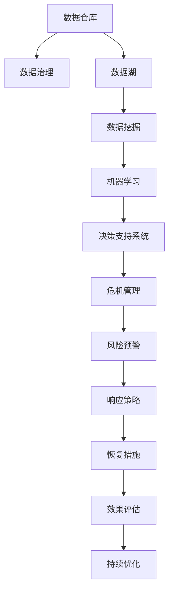

                 

## 1. 背景介绍

在当今快速变化的商业环境中，企业面临的挑战日益复杂多变，不确定性和风险如影随形。传统企业应对危机的能力不足，缺乏有效的决策支持。信息技术和大数据的应用，为危机管理提供了全新的方法和工具。本篇文章将介绍基于危机管理模型和数据驱动分析的实践框架，帮助企业在动荡中保持稳定。

## 2. 核心概念与联系

### 2.1 核心概念概述

**危机管理**：指企业为应对突发事件，采取的预警、评估、响应和恢复等全方位管理措施。危机管理旨在保护企业利益，维护企业声誉，恢复市场信心。

**数据驱动分析**：基于收集的数据，利用机器学习和数据挖掘技术，预测危机发生的可能性，评估危机影响，提出应对措施。数据驱动分析能够提高危机管理的效率和精确度。

**机器学习**：一种通过数据学习规律，并利用这些规律进行预测、分类、聚类等任务的算法。机器学习在危机管理中的应用包括预测风险、自动预警、策略优化等。

**数据仓库**：用于集中、管理和存储大量数据，支持高效查询和分析，为决策提供数据支持。数据仓库是数据驱动分析的基础设施。

**主数据管理**：关注数据的规范性和一致性，保障数据的质量和可用性。高质量的数据是决策的基础，主数据管理的重要性不言而喻。

**决策支持系统**：通过数据分析和可视化技术，支持决策者快速理解数据，做出明智决策。决策支持系统是数据驱动分析的最终应用。

以上概念通过数据仓库和主数据管理，将数据源集中并治理，供机器学习模型和决策支持系统使用。通过数据驱动分析，危机管理模型能够预测风险，评估影响，制定应对策略，并在实时环境中进行持续优化。

### 2.2 核心概念原理和架构的 Mermaid 流程图



该图展示了一个基于数据驱动的危机管理体系，包括数据治理、数据仓库、数据挖掘、机器学习、决策支持系统和危机管理等关键环节。

## 3. 核心算法原理 & 具体操作步骤

### 3.1 算法原理概述

危机管理模型基于数据驱动分析，通过机器学习算法，从历史数据中学习危机发生的规律和特征。模型首先对历史数据进行预处理和特征工程，然后通过训练数据集，学习危机的预测模型。

在实际应用中，模型实时接收数据源的输入，进行预测并输出风险评估结果。决策支持系统接收风险评估结果，结合领域专家的知识，制定应对策略。应对策略通过自动化系统执行，并实时反馈效果，供决策者持续优化。

### 3.2 算法步骤详解

**Step 1: 数据收集与预处理**
- 收集企业内部和外部的数据，包括日志、监控数据、新闻报道、社交媒体等。
- 对数据进行清洗、去重、归一化等预处理操作，确保数据质量。

**Step 2: 特征工程**
- 从历史数据中提取有意义的特征，如时间序列、关键指标变化、社会媒体情感等。
- 对特征进行编码，如使用One-Hot编码、TF-IDF编码等。

**Step 3: 模型训练**
- 选择适当的机器学习算法，如分类、回归、聚类等。
- 将预处理后的特征作为模型输入，训练预测模型。
- 使用交叉验证技术评估模型性能，选择合适的超参数。

**Step 4: 风险预警**
- 实时接收新数据，输入训练好的预测模型，输出风险评估结果。
- 根据风险评估结果，自动触发预警机制。

**Step 5: 响应策略制定**
- 根据预警结果，结合领域专家的知识和经验，制定应对策略。
- 自动执行应对策略，如启动应急预案、调整供应链、发布新闻稿等。

**Step 6: 效果评估**
- 实时监控应对策略的效果，收集反馈信息。
- 使用评估指标（如损失、效果等），定期评估策略效果。

**Step 7: 持续优化**
- 结合反馈信息，调整和优化应对策略。
- 持续监控风险情况，确保应对策略的有效性。

### 3.3 算法优缺点

**优点：**
1. **效率高**：机器学习算法可以快速处理大量数据，提供实时预警和响应。
2. **精确度高**：机器学习模型基于大量历史数据进行训练，预测结果准确性高。
3. **自动化程度高**：模型和策略自动执行，减少人工干预，提升响应速度。
4. **灵活性强**：模型可以根据数据和业务需求进行动态调整，灵活应对变化。

**缺点：**
1. **依赖数据质量**：模型性能受数据质量影响，需要高质量、准确的数据支持。
2. **模型复杂度高**：复杂模型容易过拟合，需要谨慎选择算法和超参数。
3. **解释性差**：机器学习模型往往是"黑箱"，难以解释其决策逻辑。
4. **需要专业知识**：领域专家参与，才能制定合理的应对策略。

### 3.4 算法应用领域

**企业运营管理**：监控供应链、生产、销售等关键环节，及时预警和响应风险。

**金融行业**：监控市场动向，实时评估风险，制定投资策略，规避风险。

**公共安全**：监控社交媒体和新闻，预警可能发生的恐怖袭击、自然灾害等事件。

**医疗健康**：监控疫情动态，及时预警和响应疫情变化，优化资源配置。

**政府治理**：监控社会舆情，及时响应公共危机，保障社会稳定。

## 4. 数学模型和公式 & 详细讲解

### 4.1 数学模型构建

危机管理模型基于多元统计模型和机器学习算法。以二分类模型为例，假设输入特征向量为 $X \in \mathbb{R}^n$，输出为 $Y \in \{0, 1\}$，其中 $Y=1$ 表示存在危机，否则为 $0$。模型的目标是学习一个函数 $f(X)$，使得：

$$
\hat{Y} = \begin{cases}
0, & \text{if } f(X) \leq 0 \\
1, & \text{if } f(X) > 0
\end{cases}
$$

使用逻辑回归模型，$f(X)$ 可以表示为：

$$
f(X) = X \cdot \theta
$$

其中 $\theta$ 为模型参数。模型的训练目标为最大化似然函数：

$$
\max_{\theta} \prod_{i=1}^N p(y_i = 1|X_i, \theta)
$$

其中 $p(y_i = 1|X_i, \theta)$ 为模型在样本 $X_i$ 上的条件概率。

### 4.2 公式推导过程

以逻辑回归为例，模型参数 $\theta$ 的更新公式为：

$$
\theta \leftarrow \theta + \eta \cdot \left( \frac{1}{N}\sum_{i=1}^N \frac{y_i - \hat{y}_i}{\hat{y}_i(1-\hat{y}_i)} \cdot X_i \right)
$$

其中 $\eta$ 为学习率。在实际应用中，可以进一步引入正则化技术，如L2正则，防止过拟合：

$$
\theta \leftarrow \theta + \eta \cdot \left( \frac{1}{N}\sum_{i=1}^N \frac{y_i - \hat{y}_i}{\hat{y}_i(1-\hat{y}_i)} \cdot X_i - \lambda \cdot \theta \right)
$$

其中 $\lambda$ 为正则化系数。

### 4.3 案例分析与讲解

**案例：金融行业风险预警**

**数据收集**：收集银行的贷款记录、市场指数、经济指标等数据。

**特征工程**：提取关键特征，如贷款金额、还款期限、市场波动率等。

**模型训练**：使用逻辑回归模型，训练风险预测模型。

**风险预警**：实时接收新数据，输入模型，输出风险评估结果。

**响应策略**：根据预警结果，调整贷款审批策略，限制高风险客户贷款。

**效果评估**：定期评估模型效果，调整和优化模型参数。

## 5. 项目实践：代码实例和详细解释说明

### 5.1 开发环境搭建

**Step 1: 环境准备**
- 安装Python 3.6+。
- 安装Pandas、NumPy、Scikit-learn等数据处理和机器学习库。
- 安装Jupyter Notebook，用于数据处理和模型训练。

**Step 2: 数据准备**
- 收集金融行业的历史数据，包括贷款记录、市场指数等。
- 对数据进行预处理和特征工程，提取关键特征。

**Step 3: 模型训练**
- 使用Scikit-learn库中的逻辑回归模型，训练风险预测模型。
- 使用交叉验证技术，评估模型性能，调整超参数。

**Step 4: 风险预警**
- 实时接收新数据，输入模型，输出风险评估结果。
- 自动触发预警机制，通知相关人员。

**Step 5: 响应策略**
- 根据预警结果，调整贷款审批策略。
- 使用自动化工具，执行响应策略。

**Step 6: 效果评估**
- 定期收集反馈信息，评估模型效果。
- 调整和优化模型，提升预测精度。

### 5.2 源代码详细实现

```python
import pandas as pd
from sklearn.linear_model import LogisticRegression
from sklearn.model_selection import train_test_split, cross_val_score
from sklearn.metrics import roc_auc_score
import numpy as np
import time

# 数据准备
data = pd.read_csv('bank_loan.csv')
X = data[['loan_amount', 'loan_term', 'market_volatility']]
y = data['default']

# 特征工程
X_train, X_test, y_train, y_test = train_test_split(X, y, test_size=0.2, random_state=42)

# 模型训练
model = LogisticRegression()
model.fit(X_train, y_train)

# 风险预警
def predict_risk(X_new):
    return model.predict_proba(X_new)[:, 1]

# 实时接收数据并预警
def monitor_data(data_stream):
    while True:
        new_data = data_stream.read(1)
        if new_data is None:
            break
        
        risk = predict_risk(new_data)
        if risk > 0.5:
            print('高风险预警！')
            # 执行响应策略
            execute_strategy(new_data)

# 响应策略
def execute_strategy(data):
    # 根据数据执行响应策略，如限制高风险客户贷款
    pass

# 效果评估
def evaluate_model(model, X_test, y_test):
    y_pred = model.predict_proba(X_test)[:, 1]
    auc = roc_auc_score(y_test, y_pred)
    return auc

# 评估模型并输出
auc = evaluate_model(model, X_test, y_test)
print('模型AUC:', auc)
```

### 5.3 代码解读与分析

**数据准备**：使用Pandas库读取数据，并进行预处理和特征工程。

**模型训练**：使用Scikit-learn库中的逻辑回归模型，训练风险预测模型。

**风险预警**：定义预测函数，实时接收数据并预警。

**响应策略**：根据预警结果，执行响应策略。

**效果评估**：使用ROC-AUC评估模型性能。

**总结**：以上代码实现了从数据准备到模型训练、预警、响应策略、效果评估的完整流程。

## 6. 实际应用场景

**企业运营管理**

企业可以通过实时监控关键环节，如供应链、生产、销售等，及时预警和响应风险。预警系统可以自动触发应急预案，调整生产计划，优化资源配置，减少损失。

**金融行业**

金融机构可以监控市场动向，实时评估风险，制定投资策略，规避风险。预警系统可以自动限制高风险客户贷款，保障资金安全。

**公共安全**

政府可以监控社交媒体和新闻，预警可能发生的恐怖袭击、自然灾害等事件。预警系统可以自动启动应急预案，保障公共安全。

**医疗健康**

医疗机构可以监控疫情动态，及时预警和响应疫情变化，优化资源配置。预警系统可以自动调整诊疗方案，保障患者健康。

**政府治理**

政府可以监控社会舆情，及时响应公共危机，保障社会稳定。预警系统可以自动启动应急预案，保障社会稳定。

## 7. 工具和资源推荐

### 7.1 学习资源推荐

1. **《机器学习》**：周志华著，全面介绍机器学习算法及其应用。
2. **Coursera《机器学习》课程**：斯坦福大学Andrew Ng教授主讲，系统学习机器学习算法。
3. **Kaggle**：数据科学竞赛平台，提供大量数据集和竞赛机会，提升数据处理和模型训练能力。
4. **Scikit-learn官方文档**：详细的机器学习库文档，提供大量样例代码和教程。

### 7.2 开发工具推荐

1. **Jupyter Notebook**：强大的交互式编程环境，支持Python数据分析和模型训练。
2. **TensorFlow**：Google开发的深度学习框架，支持分布式训练和优化。
3. **PyTorch**：Facebook开发的深度学习框架，灵活易用，支持GPU加速。
4. **Scikit-learn**：Python机器学习库，支持各种经典算法和模型。

### 7.3 相关论文推荐

1. **《数据驱动的决策支持系统》**：朱英杰、周志华著，介绍数据驱动决策系统的构建。
2. **《基于深度学习的金融风险管理》**：冯奇著，介绍深度学习在金融风险管理中的应用。
3. **《危机管理中的大数据应用》**：陈晓平著，介绍大数据在危机管理中的应用。
4. **《数据仓库与数据治理》**：王斌著，详细介绍数据仓库和数据治理的基本概念和技术。

## 8. 总结：未来发展趋势与挑战

### 8.1 研究成果总结

本文介绍了基于数据驱动的危机管理模型和机器学习算法，帮助企业应对突发事件，提升决策效率和效果。主要研究结果包括：
1. 数据驱动分析能够提升危机管理的效率和准确性。
2. 机器学习模型可以自动预警和响应风险。
3. 多模态数据融合可以提高模型的鲁棒性和预测精度。

### 8.2 未来发展趋势

未来危机管理模型将呈现以下几个发展趋势：
1. **自动化程度提升**：自动化程度提升，减少人工干预，提升响应速度。
2. **多模态融合**：结合文本、图像、视频等数据，提升模型的鲁棒性和预测精度。
3. **实时化**：实时预警和响应，满足动态变化的需求。
4. **智能化**：结合领域知识和智能算法，提升决策的智能化水平。

### 8.3 面临的挑战

危机管理模型面临的挑战主要包括：
1. **数据质量**：依赖高质量的数据，数据采集和治理需要投入大量人力物力。
2. **模型复杂度**：模型复杂度高，容易出现过拟合。
3. **解释性差**：模型往往是"黑箱"，难以解释其决策逻辑。
4. **跨领域应用**：不同行业的业务特点不同，模型需要针对性地进行调整。

### 8.4 研究展望

未来研究需要解决以下问题：
1. **提高数据质量**：建立统一的数据采集和治理标准，提升数据质量。
2. **简化模型复杂度**：开发更加高效和可解释的模型，提升模型的实用性和可靠性。
3. **引入多模态数据**：结合多模态数据，提升模型的泛化能力和鲁棒性。
4. **解决跨领域应用**：结合领域知识和智能算法，提升模型在不同行业的适用性。

## 9. 附录：常见问题与解答

**Q1: 危机管理模型有哪些优势？**

A: 危机管理模型具有以下优势：
1. 能够实时预警和响应风险，提升应对效率。
2. 预测精度高，能够减少损失。
3. 自动化程度高，减少人工干预。

**Q2: 数据驱动分析的主要步骤是什么？**

A: 数据驱动分析的主要步骤包括：
1. 数据收集和预处理。
2. 特征工程和模型训练。
3. 风险预警和响应策略。
4. 效果评估和持续优化。

**Q3: 危机管理模型的缺点是什么？**

A: 危机管理模型的缺点包括：
1. 依赖高质量的数据，数据采集和治理需要投入大量人力物力。
2. 模型复杂度高，容易出现过拟合。
3. 模型往往是"黑箱"，难以解释其决策逻辑。
4. 不同行业的业务特点不同，模型需要针对性地进行调整。

**Q4: 如何提高数据质量？**

A: 提高数据质量需要建立统一的数据采集和治理标准，包括：
1. 数据源标准化，确保数据的准确性和一致性。
2. 数据清洗和去重，去除噪声和冗余。
3. 数据归一化和标准化，确保数据格式一致。

**Q5: 如何简化模型复杂度？**

A: 简化模型复杂度需要开发更加高效和可解释的模型，包括：
1. 引入正则化技术，防止过拟合。
2. 采用简单模型，如线性回归、逻辑回归等。
3. 结合领域知识和智能算法，提升模型的实用性和可靠性。

**Q6: 如何引入多模态数据？**

A: 引入多模态数据可以提升模型的鲁棒性和预测精度，具体方法包括：
1. 结合文本、图像、视频等数据，提升模型的泛化能力和鲁棒性。
2. 使用多模态特征工程，提取和融合多模态特征。
3. 引入多模态学习算法，提升模型在多模态数据上的性能。

**Q7: 如何解决跨领域应用问题？**

A: 解决跨领域应用问题需要结合领域知识和智能算法，具体方法包括：
1. 引入领域专家参与，优化模型参数。
2. 结合领域知识和智能算法，提升模型在不同行业的适用性。
3. 建立跨领域数据集，提高模型的泛化能力。

---

作者：禅与计算机程序设计艺术 / Zen and the Art of Computer Programming

