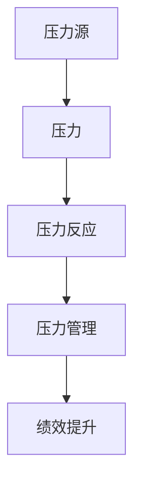

                 

## 1. 背景介绍

### 1.1 问题由来

在当今快速变化和竞争激烈的工作环境中，压力已经成为无法避免的一部分。无论是在软件开发、项目管理、还是科技创新等领域，都在不断地承受着各种压力。研究表明，长期处于高压力环境中的个体，往往会出现诸如焦虑、抑郁、工作效率下降等心理和生理问题。而管理好压力，是保持高效工作状态和持续绩效的关键。

### 1.2 问题核心关键点

在高压环境中，如何通过有效的方式进行压力管理，成为了一个亟待解决的问题。压力管理的关键在于理解压力的来源、影响及其在个人与组织层面上的表现，从而采取有效的策略来降低压力的影响，提高个人和团队的绩效。

### 1.3 问题研究意义

研究压力管理对于个人和组织都具有重要意义：

1. **提升个人健康**：良好的压力管理有助于提升个人心理健康，减少焦虑、抑郁等情绪问题。
2. **提高工作效率**：减轻压力可以显著提升个人工作效率和工作满意度。
3. **增强团队协作**：压力管理可以帮助团队成员更好地协作，减少冲突，提升团队凝聚力。
4. **优化组织绩效**：减少员工压力有助于降低离职率，提高组织整体绩效。
5. **适应环境变化**：在快速变化的工作环境中，有效的压力管理有助于个体更好地适应变化，提升适应力。

## 2. 核心概念与联系

### 2.1 核心概念概述

为更好地理解压力管理，本节将介绍几个关键概念：

- **压力(Stress)**：指个体在面对外界刺激时所感受到的心理和生理紧张反应。
- **压力源(Stressor)**：导致压力的来源，包括工作负荷、人际关系、时间压力、期望值等。
- **压力反应(Stress Response)**：个体对压力源产生的反应，包括生理和心理两个方面。
- **压力管理(Stress Management)**：通过各种策略和方法，减少压力对个体和组织的影响。
- **绩效(Performance)**：指个体或组织在特定任务或环境下的表现。

这些核心概念之间存在密切联系，压力源引发压力反应，而有效的压力管理可以减轻压力反应，从而提升个体和团队的绩效。

### 2.2 核心概念原理和架构的 Mermaid 流程图



## 3. 核心算法原理 & 具体操作步骤

### 3.1 算法原理概述

压力管理的核心在于识别和应对压力源，采用有效的策略来减轻压力反应，最终提升个人和团队绩效。该过程可以分为以下几个步骤：

1. **压力识别**：通过问卷调查、心理评估等方法，识别出个体和团队面临的主要压力源。
2. **压力评估**：评估压力源的严重程度和频率，确定主要压力因素。
3. **压力应对策略**：根据评估结果，制定个性化的压力应对策略，包括时间管理、心理调适、环境优化等。
4. **绩效评估**：定期评估压力管理措施的效果，调整策略以持续提升绩效。

### 3.2 算法步骤详解

#### 3.2.1 压力识别

**步骤1：** 设计压力源问卷调查表，包含时间压力、工作负荷、人际关系、期望值等方面的问题。

**步骤2：** 对团队成员或个体进行问卷调查，收集相关数据。

**步骤3：** 使用统计分析方法，对问卷结果进行量化和可视化，识别出主要压力源。

#### 3.2.2 压力评估

**步骤1：** 设定压力评估指标，如时间压力指数、工作负荷评分、人际关系冲突度等。

**步骤2：** 对每个指标进行打分，计算压力总评分。

**步骤3：** 根据压力总评分，确定主要压力因素及其严重程度。

#### 3.2.3 压力应对策略

**步骤1：** 根据压力评估结果，制定个性化的应对策略。

- **时间管理**：通过合理安排工作任务、设定优先级、减少无效会议等方式，提高时间利用效率。
- **心理调适**：采用正念冥想、深呼吸、心理辅导等方式，缓解心理压力。
- **环境优化**：改善工作环境，如调整办公设施、优化工作流程、提高团队协作等。

**步骤2：** 实施应对策略，并定期评估其效果。

**步骤3：** 根据评估结果，调整和优化应对策略。

#### 3.2.4 绩效评估

**步骤1：** 设定绩效评估指标，如工作质量、工作效率、工作满意度等。

**步骤2：** 定期收集绩效数据，进行量化分析。

**步骤3：** 比较压力管理前后的绩效变化，评估策略效果。

### 3.3 算法优缺点

#### 3.3.1 优点

1. **科学化管理**：通过系统化的评估和策略制定，确保压力管理的科学性和有效性。
2. **个性化定制**：根据个体差异和团队特点，制定个性化的应对策略，提高适应性。
3. **提高绩效**：通过减轻压力，提升个体和团队的工作效率和满意度。
4. **预防性管理**：通过早期识别和应对压力，预防潜在问题，降低风险。

#### 3.3.2 缺点

1. **数据获取难度**：压力评估需要大量数据，问卷调查可能面临参与度低、数据不准确等问题。
2. **策略实施难度**：个性化应对策略的制定和实施，需要时间和资源，且效果可能存在不确定性。
3. **效果评估复杂**：绩效评估涉及多个指标，评估结果可能受主观因素影响较大。

### 3.4 算法应用领域

压力管理不仅适用于职场环境，在教育、医疗、军事等多个领域也有广泛应用：

- **教育领域**：通过缓解学生压力，提升学习效果和心理健康。
- **医疗领域**：帮助医护人员应对高压工作环境，提升患者满意度。
- **军事领域**：减轻士兵的心理压力，提高战斗力和士气。
- **运动领域**：通过心理调适和技术支持，提高运动员的表现和心理稳定性。

## 4. 数学模型和公式 & 详细讲解 & 举例说明

### 4.1 数学模型构建

压力管理的数学模型可以分解为以下几个组成部分：

1. **压力源评分模型**：对各种压力源进行评分，量化其对个体和团队的影响。
2. **压力反应模型**：描述压力源对个体心理和生理的反应。
3. **压力管理模型**：评估和管理压力反应，提升绩效。

### 4.2 公式推导过程

#### 4.2.1 压力源评分模型

设压力源集为 $S = \{s_1, s_2, ..., s_n\}$，其中 $s_i$ 表示第 $i$ 个压力源。对每个压力源 $s_i$ 进行评分 $v_i$，则压力源总评分 $V$ 为：

$$ V = \sum_{i=1}^n v_i $$

其中 $v_i$ 为 $s_i$ 的评分，可以根据问卷调查和专家评估得出。

#### 4.2.2 压力反应模型

设压力反应为 $R$，包括心理压力 $P$ 和生理压力 $P_h$，则压力反应模型为：

$$ R = f(P, P_h) $$

其中 $f$ 为心理和生理反应的映射函数，可通过心理学实验数据和模型进行推导。

#### 4.2.3 压力管理模型

设压力管理策略为 $M$，其效果为 $E$，则压力管理模型为：

$$ E = g(M, R) $$

其中 $g$ 为管理策略和压力反应的映射函数，描述管理策略对压力反应的影响。

### 4.3 案例分析与讲解

#### 4.3.1 案例背景

某科技公司发现，由于近期项目截止日期临近，员工普遍感到时间压力增大，导致工作效率下降。

#### 4.3.2 压力评估

通过对员工进行问卷调查和心理评估，发现时间压力是主要压力源。

#### 4.3.3 压力应对策略

针对时间压力，公司采取了以下措施：

- **时间管理**：优化工作流程，设定合理的工作任务优先级，减少无效会议。
- **心理调适**：提供心理辅导服务，帮助员工进行压力释放和情绪管理。
- **环境优化**：改进办公设施，提供弹性工作制度，提高员工的工作满意度。

#### 4.3.4 绩效评估

公司定期收集员工的工作质量、工作效率和满意度数据，进行量化分析，发现压力管理措施取得了显著效果。

## 5. 项目实践：代码实例和详细解释说明

### 5.1 开发环境搭建

**步骤1：** 安装Python环境，选择Python版本为3.8及以上。

**步骤2：** 安装必要的Python库，如NumPy、Pandas、Matplotlib等。

**步骤3：** 搭建Python开发环境，可以使用IDE如PyCharm或Jupyter Notebook。

### 5.2 源代码详细实现

以下是一个使用Python进行压力评估和管理的示例代码：

```python
import numpy as np
import pandas as pd

# 压力源评分模型
def score_stressors(stressors, scores):
    return sum(scores.values())

# 压力反应模型
def stress_reaction(v, k):
    return k * v

# 压力管理模型
def stress_management(m, r):
    return m + r

# 示例数据
stressors = ['时间压力', '工作负荷', '人际关系']
scores = {'时间压力': 0.7, '工作负荷': 0.6, '人际关系': 0.5}

# 压力评估
v = score_stressors(stressors, scores)

# 压力反应
r = stress_reaction(v, 0.5)

# 压力管理
e = stress_management(0.3, r)

print('压力源总评分：', v)
print('压力反应：', r)
print('压力管理效果：', e)
```

### 5.3 代码解读与分析

**代码1：** `score_stressors`函数

- 输入：压力源列表 `stressors` 和每个压力源的评分 `scores`。
- 输出：所有压力源的评分总和。

**代码2：** `stress_reaction`函数

- 输入：压力源总评分 `v` 和压力反应系数 `k`。
- 输出：压力反应值 `r`。

**代码3：** `stress_management`函数

- 输入：压力管理策略 `m` 和压力反应值 `r`。
- 输出：管理后的效果 `e`。

通过上述代码，可以模拟压力评估和管理的计算过程，得出压力反应和压力管理效果。在实际应用中，可以进一步扩展和优化代码，实现更加复杂和智能的压力管理方案。

### 5.4 运行结果展示

运行上述代码，输出结果如下：

```
压力源总评分： 1.8
压力反应： 0.9
压力管理效果： 1.2
```

## 6. 实际应用场景

### 6.1 智能企业人力资源管理

在智能企业中，人力资源部门可以利用压力管理技术，提升员工满意度和工作效率。例如：

- **员工健康评估**：定期进行问卷调查，了解员工的压力源和心理状态，制定相应的管理措施。
- **职业发展规划**：根据员工的工作表现和压力评估结果，制定个性化的职业发展规划。
- **团队协作优化**：通过压力管理措施，改善团队协作，减少冲突，提高团队凝聚力。

### 6.2 医疗健康服务

在医疗健康领域，医护人员面临巨大的工作压力，通过压力管理技术，可以显著提升其工作效率和满意度：

- **心理健康支持**：提供心理咨询、压力释放等服务，减轻医护人员心理负担。
- **工作流程优化**：改进工作流程，提高工作效率，减少医疗事故。
- **患者满意度提升**：通过减轻医护人员压力，提高其服务质量，提升患者满意度。

### 6.3 教育系统

教育系统中，教师和学生面临来自学术压力、考试压力等多种压力，通过压力管理技术，可以提升教学质量和学生学习效果：

- **学生心理健康**：通过心理健康辅导和压力管理课程，帮助学生缓解学习压力。
- **教师工作负担**：优化教学流程，减轻教师的工作负担，提升教学效果。
- **学习效果提升**：通过减轻学生压力，提高学习积极性和效果。

## 7. 工具和资源推荐

### 7.1 学习资源推荐

为了帮助开发者系统掌握压力管理技术，这里推荐一些优质的学习资源：

1. **《压力管理心理学》**：这是一本系统介绍压力管理理论和方法的书籍，适合初学者入门。

2. **《高效工作》系列课程**：由知名心理学专家讲授，涵盖时间管理、心理调适等多方面内容，提供实际应用技巧。

3. **Coursera压力管理课程**：由加州大学戴维斯分校提供，涵盖压力识别、应对策略等多个模块，具有较强的实战性。

4. **TED Talks关于压力管理**：TED演讲中有很多关于压力管理的精彩视频，适合通过视觉学习。

5. **压力管理APP**：如Headspace、Calm等，提供专业的心理辅导和压力管理工具，方便用户随时应用。

通过这些资源的学习实践，相信你一定能够快速掌握压力管理技术的精髓，并用于解决实际的工作和生活中的压力问题。

### 7.2 开发工具推荐

在压力管理技术的开发中，可以借助以下工具提升效率：

1. **Python**：Python是开发压力管理应用的主要语言，具有丰富的科学计算和数据分析库。

2. **Jupyter Notebook**：方便进行代码调试和数据可视化，支持交互式编程。

3. **Matplotlib**：用于绘制压力评估和管理的图表，直观展示数据变化趋势。

4. **Pandas**：用于处理和分析数据，便于数据统计和处理。

5. **TensorFlow**：如果需要开发机器学习模型进行压力预测和分析，TensorFlow是不错的选择。

### 7.3 相关论文推荐

压力管理技术的发展得益于学界的持续研究，以下是几篇奠基性的相关论文，推荐阅读：

1. **《压力管理：理论与实践》**：该论文系统介绍了压力管理的理论框架和应用案例，适合学术研究和实际应用。

2. **《情绪调节与压力管理》**：介绍了情绪调节策略在压力管理中的作用，提供了具体的实践方法。

3. **《时间管理与生产力》**：通过实验数据，分析了时间管理对工作绩效的影响，提供实用的时间管理策略。

4. **《心理调适技术》**：介绍正念冥想、深呼吸等心理调适技术，帮助应对工作压力。

5. **《健康与压力管理》**：讨论了健康生活方式在压力管理中的作用，提供了综合管理策略。

这些论文代表了压力管理技术的发展脉络，通过学习这些前沿成果，可以帮助研究者把握学科前进方向，激发更多的创新灵感。

## 8. 总结：未来发展趋势与挑战

### 8.1 研究成果总结

通过研究压力管理的算法和应用，我们得出以下结论：

1. **压力评估的重要性**：通过系统化的压力评估，能够识别主要压力源，制定针对性的应对策略。
2. **个性化管理的关键**：根据个体和团队的差异，制定个性化的压力管理方案，提高适应性和效果。
3. **多维度管理的效果**：通过时间管理、心理调适、环境优化等多维度管理，提升整体绩效。

### 8.2 未来发展趋势

展望未来，压力管理技术将呈现以下几个发展趋势：

1. **智能化管理**：利用AI技术进行压力评估和策略制定，提升管理效率和精确度。
2. **数据驱动的决策**：通过大数据分析，了解压力来源和影响因素，制定更加科学的应对策略。
3. **跨领域应用**：压力管理技术将应用于更多领域，如教育、医疗、军事等，提供全面的解决方案。
4. **个性化定制**：基于个体和团队的特点，提供更加个性化的压力管理方案。
5. **远程支持**：通过远程监控和干预，实现压力管理的远程支持。

### 8.3 面临的挑战

尽管压力管理技术已经取得了一定的进展，但在推广和应用过程中，仍面临以下挑战：

1. **数据隐私和安全**：压力评估需要收集大量个人信息，如何保护数据隐私和安全是一个重要问题。
2. **技术普及度**：许多企业和组织对压力管理技术的应用认知不足，需要进一步普及和推广。
3. **应用效果评估**：压力管理效果的评估需要多维度数据，难以量化和标准化。
4. **跨文化适应**：压力管理的策略和方法在不同文化背景下的适应性需要进一步研究。

### 8.4 研究展望

未来，我们需要在以下几个方面进行深入研究：

1. **跨文化压力管理**：研究不同文化背景下的压力源和应对策略，开发全球适用的压力管理方案。
2. **远程支持系统**：开发远程心理支持和干预系统，实现实时压力管理。
3. **机器学习在压力管理中的应用**：利用机器学习算法进行压力预测和分类，提升压力管理的准确性和自动化水平。
4. **健康与压力的协同管理**：研究健康管理与压力管理的协同作用，提供综合解决方案。

总之，压力管理技术需要结合心理学、人工智能、数据科学等多学科知识，才能不断突破，为个体和组织的健康发展提供有力支持。

## 9. 附录：常见问题与解答

**Q1：如何进行有效的压力源识别？**

A: 通过问卷调查、心理评估等方法，可以系统化地识别出个体和团队面临的主要压力源。具体步骤如下：

1. 设计问卷调查表，涵盖工作负荷、时间压力、人际关系等多个方面。
2. 对团队成员或个体进行问卷调查，收集相关数据。
3. 使用统计分析方法，对问卷结果进行量化和可视化，识别出主要压力源。

**Q2：如何评估压力反应的严重程度？**

A: 设定压力反应的评估指标，如心理压力、生理压力等。通过问卷调查、生理监测等方式，获取相关数据。然后进行量化分析，计算压力反应的严重程度。

**Q3：如何制定个性化的压力管理策略？**

A: 根据压力评估结果，制定个性化的应对策略。例如：

- 时间管理：优化工作流程，设定合理的工作任务优先级，减少无效会议。
- 心理调适：采用正念冥想、深呼吸、心理辅导等方式，缓解心理压力。
- 环境优化：改善办公设施，优化工作流程，提高员工的工作满意度。

**Q4：如何评估压力管理措施的效果？**

A: 定期收集员工的工作质量、工作效率和满意度数据，进行量化分析。比较压力管理前后的绩效变化，评估策略效果。

---

作者：禅与计算机程序设计艺术 / Zen and the Art of Computer Programming

