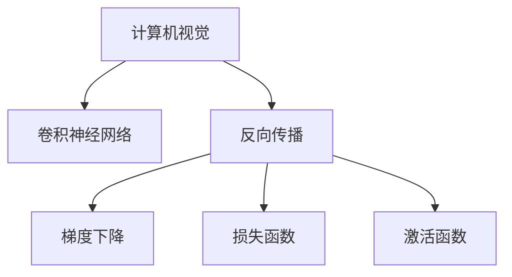

                 

# 反向传播在计算机视觉中的应用

> 关键词：计算机视觉,反向传播,卷积神经网络,损失函数,梯度下降,激活函数,深度学习

## 1. 背景介绍

### 1.1 问题由来
计算机视觉是人工智能领域的重要分支，旨在让计算机“看懂”和“理解”图像和视频等视觉数据。传统计算机视觉方法依赖手工设计的特征提取和分类器，难以处理复杂的视觉模式和高维数据。而随着深度学习技术的兴起，通过卷积神经网络(Convolutional Neural Networks, CNNs)等神经网络模型，计算机视觉问题逐渐从手动特征工程转变为端到端的自动学习。

### 1.2 问题核心关键点
计算机视觉的核心问题是图像分类、目标检测、语义分割等。为了实现这些任务，需要设计合适的神经网络模型，并进行高效的反向传播算法训练。反向传播算法通过梯度下降等优化方法，使神经网络不断调整参数，以最小化损失函数，从而逐步逼近最优解。

### 1.3 问题研究意义
研究反向传播算法在计算机视觉中的应用，对于提升计算机视觉模型的性能、促进深度学习技术的应用与发展，具有重要意义：

1. 提升模型性能。通过反向传播，神经网络可以自动学习图像中的高级特征，从而提升分类、检测等任务的准确率。
2. 简化模型设计。反向传播算法使得模型设计更加灵活，通过反复迭代优化，找到最优的模型参数。
3. 加速模型训练。反向传播算法可以高效计算梯度，显著缩短模型训练时间。
4. 扩展模型应用。反向传播算法使得计算机视觉模型可以应用到更多的实际场景中，如医学影像分析、自动驾驶等。
5. 促进学科交叉。计算机视觉与深度学习的结合，推动了学科间的交叉融合，拓展了应用领域。

## 2. 核心概念与联系

### 2.1 核心概念概述

为更好地理解反向传播算法在计算机视觉中的应用，本节将介绍几个密切相关的核心概念：

- 计算机视觉(Computer Vision)：旨在让计算机“看懂”和“理解”图像和视频等视觉数据。包括图像分类、目标检测、语义分割等任务。
- 卷积神经网络(Convolutional Neural Networks, CNNs)：一种专门处理图像和视频数据的神经网络，利用卷积操作提取局部特征，并通过池化、全连接层等操作进行高级特征提取。
- 反向传播(Backpropagation)：一种通过梯度下降等优化算法，自动更新神经网络参数，最小化损失函数的算法。
- 损失函数(Loss Function)：用于衡量模型输出与真实标签之间的差异，常见的损失函数包括交叉熵损失、均方误差损失等。
- 梯度下降(Gradient Descent)：一种通过迭代更新参数，使损失函数最小化的优化算法。
- 激活函数(Activation Function)：用于引入非线性因素，增加神经网络的表达能力，常见的激活函数包括Sigmoid、ReLU、Tanh等。

这些核心概念之间的逻辑关系可以通过以下Mermaid流程图来展示：



这个流程图展示了几类核心概念之间的联系：

1. 计算机视觉任务通常由卷积神经网络进行处理。
2. 反向传播算法通过梯度下降等优化方法，使卷积神经网络不断调整参数，最小化损失函数。
3. 损失函数衡量模型输出与真实标签之间的差异。
4. 激活函数用于增加神经网络的非线性表达能力。

## 3. 核心算法原理 & 具体操作步骤
### 3.1 算法原理概述

计算机视觉任务的神经网络模型通常使用卷积神经网络(CNNs)，其反向传播算法原理与全连接神经网络类似，但更复杂。CNNs中的卷积操作和池化操作引入局部连接和参数共享，使得模型具有平移不变性和特征共享特性。

CNNs的反向传播算法一般包括以下步骤：

1. 前向传播：将输入图像通过卷积层、池化层、全连接层等操作，逐步提取高级特征，并计算输出结果。
2. 计算损失：根据输出结果和真实标签，计算损失函数。
3. 反向传播：从输出层开始，通过链式法则计算各层参数的梯度。
4. 参数更新：利用梯度下降等优化算法，更新各层参数，最小化损失函数。
5. 重复迭代：不断重复上述过程，直至收敛。

### 3.2 算法步骤详解

接下来，我们将详细介绍反向传播算法在计算机视觉中的应用步骤。

**Step 1: 数据预处理**
- 对输入图像进行归一化、缩放等预处理操作。
- 将图像切分为小批量数据，如32x32像素。

**Step 2: 构建卷积神经网络模型**
- 使用Conv2d层进行卷积操作，提取局部特征。
- 通过MaxPool2d层进行池化操作，减小特征图尺寸。
- 使用全连接层将特征图转换为输出结果。

**Step 3: 定义损失函数**
- 根据输出结果和真实标签，定义损失函数，如交叉熵损失。
- 将损失函数与模型参数相关联。

**Step 4: 反向传播**
- 从输出层开始，利用链式法则计算各层梯度。
- 更新卷积层、全连接层等参数。

**Step 5: 参数更新**
- 使用梯度下降等优化算法，更新模型参数。
- 设置学习率、批大小等超参数。

**Step 6: 迭代优化**
- 不断重复前向传播、反向传播和参数更新的过程。
- 记录损失函数的变化，直到收敛。

**Step 7: 测试和评估**
- 在测试集上评估模型性能，如准确率、精确率、召回率等。
- 使用混淆矩阵、ROC曲线等指标衡量模型性能。

### 3.3 算法优缺点

反向传播算法在计算机视觉中的应用具有以下优点：

1. 高效性。通过自动更新模型参数，反向传播算法可以显著缩短模型训练时间，加速模型优化。
2. 灵活性。反向传播算法使得模型设计更加灵活，可以通过反复迭代优化，找到最优的模型参数。
3. 普适性。反向传播算法适用于各种计算机视觉任务，如图像分类、目标检测、语义分割等。
4. 可解释性。反向传播算法的每一步都通过梯度传递，可以清晰解释模型参数的变化过程。

同时，该算法也存在一定的局限性：

1. 参数量大。卷积神经网络需要大量参数进行特征提取，训练时需要较大的存储空间和计算资源。
2. 局部优化风险。反向传播算法可能会陷入局部最优解，难以找到全局最优解。
3. 泛化能力不足。反向传播算法训练出来的模型可能存在过拟合现象，泛化能力不足。
4. 计算复杂度高。反向传播算法计算复杂度高，训练速度较慢，需要较长的训练时间。
5. 数据依赖性强。反向传播算法的效果很大程度上依赖于标注数据的质量和数量，标注数据的获取成本较高。

尽管存在这些局限性，但就目前而言，反向传播算法仍是目前计算机视觉任务中最有效的训练方法。未来相关研究的重点在于如何进一步优化算法，降低计算复杂度，提高泛化能力，同时兼顾参数效率和模型性能。

### 3.4 算法应用领域

反向传播算法在计算机视觉中的应用领域非常广泛，具体包括：

- 图像分类：如MNIST手写数字识别、ImageNet图像分类等任务。
- 目标检测：如YOLO、Faster R-CNN等目标检测模型，在实时性、精度等方面表现优异。
- 语义分割：如U-Net、FCN等语义分割模型，可以精确地对图像进行像素级别的分割。
- 实例分割：如Mask R-CNN等模型，不仅对图像进行像素级别分割，还能对每个像素进行对象类别标注。
- 姿态估计算法：如OpenPose等算法，可以从图像中估计人体姿态。
- 图像生成算法：如GAN、VAE等生成模型，可以通过逆向传播生成逼真的图像。

除了上述这些经典任务外，反向传播算法还被创新性地应用到更多场景中，如医学影像分析、自动驾驶、三维重建等，为计算机视觉技术带来了全新的突破。

## 4. 数学模型和公式 & 详细讲解 & 举例说明
### 4.1 数学模型构建

本节将使用数学语言对卷积神经网络模型的反向传播算法进行更加严格的刻画。

记输入图像为 $x \in \mathbb{R}^{N \times H \times W \times C}$，卷积神经网络模型为 $M_{\theta}$，其中 $N$ 为批大小，$H$ 和 $W$ 为图像高度和宽度，$C$ 为通道数。模型的输出为 $y \in \mathbb{R}^{M \times K \times L \times C'}$，其中 $M$、$K$ 和 $L$ 分别为输出图像的批大小、高度和宽度，$C'$ 为输出通道数。

模型的总损失函数为：

$$
\mathcal{L}(y, t) = \frac{1}{N} \sum_{i=1}^{N} \ell(y_i, t_i)
$$

其中 $\ell$ 为损失函数，$y_i$ 为模型在输入 $x_i$ 上的输出，$t_i$ 为真实标签。

模型的参数 $\theta$ 包括卷积核、偏置项等。前向传播过程包括卷积、池化、激活函数等操作，具体公式推导过程如下：

**Step 1: 卷积层**

卷积层将输入图像 $x$ 通过卷积核 $w$ 和偏置项 $b$ 进行卷积操作，得到特征图 $h$：

$$
h_{i,j,k} = \sum_{c=1}^{C} \sum_{p=0}^{P-1} \sum_{q=0}^{Q-1} x_{i-p,j-q,k} w_{p,q} + b
$$

其中 $i,j$ 为特征图的空间索引，$k$ 为特征图通道索引，$P$ 和 $Q$ 为卷积核大小。

**Step 2: 激活函数**

激活函数对特征图 $h$ 进行非线性变换，得到激活特征图 $a$：

$$
a_{i,j,k} = \sigma(h_{i,j,k})
$$

其中 $\sigma$ 为激活函数，如ReLU。

**Step 3: 池化层**

池化层对激活特征图 $a$ 进行下采样操作，减小特征图尺寸：

$$
f_{i,j,k} = \max_{p=1}^{P} \max_{q=1}^{Q} a_{i-p+1,j-q+1,k}
$$

其中 $f$ 为池化特征图，$P$ 和 $Q$ 为池化窗口大小。

**Step 4: 全连接层**

全连接层将池化特征图 $f$ 展平并连接，得到输出结果 $y$：

$$
y = Wf + b
$$

其中 $W$ 为权重矩阵，$b$ 为偏置项。

### 4.2 公式推导过程

接下来，我们将详细推导反向传播算法中梯度的计算过程。

**Step 1: 前向传播**

前向传播过程包括卷积、池化、激活函数等操作，具体公式推导过程如下：

**Step 2: 计算损失函数**

根据输出结果和真实标签，定义损失函数 $\ell$，如交叉熵损失：

$$
\ell(y, t) = -\frac{1}{N} \sum_{i=1}^{N} \sum_{k=1}^{C'} t_{i,k} \log y_{i,k}
$$

**Step 3: 反向传播**

根据链式法则，反向传播算法计算各层参数的梯度。假设模型的最后一层为全连接层，其输出为 $y$，真实标签为 $t$，损失函数为 $\ell$，则全连接层的梯度计算公式为：

$$
\frac{\partial \mathcal{L}}{\partial W} = \frac{\partial \ell}{\partial y} \frac{\partial y}{\partial W}
$$

$$
\frac{\partial \mathcal{L}}{\partial b} = \frac{\partial \ell}{\partial y} \frac{\partial y}{\partial b}
$$

其中 $\frac{\partial y}{\partial W}$ 和 $\frac{\partial y}{\partial b}$ 为全连接层的梯度，具体推导如下：

$$
\frac{\partial y}{\partial W} = \frac{\partial f}{\partial W} \frac{\partial y}{\partial f}
$$

$$
\frac{\partial y}{\partial f} = \frac{\partial y}{\partial h} \frac{\partial h}{\partial f}
$$

其中 $\frac{\partial f}{\partial W}$ 为池化层的梯度，$\frac{\partial f}{\partial h}$ 为激活层的梯度。

对于卷积层的梯度计算，需要先计算输出特征图 $h$ 对卷积核 $w$ 的梯度，再通过链式法则计算输入特征图 $x$ 对卷积核 $w$ 的梯度：

$$
\frac{\partial h}{\partial w} = \frac{\partial a}{\partial h} \frac{\partial h}{\partial w}
$$

$$
\frac{\partial h}{\partial x} = \frac{\partial a}{\partial h} \frac{\partial h}{\partial x}
$$

其中 $\frac{\partial a}{\partial h}$ 为激活层的梯度，$\frac{\partial h}{\partial x}$ 为输入特征图 $x$ 对卷积核 $w$ 的梯度。

**Step 4: 参数更新**

根据梯度计算结果，利用梯度下降等优化算法，更新模型参数：

$$
\theta \leftarrow \theta - \eta \nabla_{\theta} \mathcal{L}
$$

其中 $\eta$ 为学习率，$\nabla_{\theta} \mathcal{L}$ 为模型参数的梯度。

### 4.3 案例分析与讲解

接下来，我们以一个简单的图像分类任务为例，具体分析反向传播算法的应用过程。

假设我们有一组手写数字图像 $x$，将其输入到一个卷积神经网络模型 $M_{\theta}$ 中进行分类，模型输出为 $y$，真实标签为 $t$。我们的目标是最小化交叉熵损失函数 $\ell$：

$$
\ell(y, t) = -\frac{1}{N} \sum_{i=1}^{N} \sum_{k=1}^{10} t_{i,k} \log y_{i,k}
$$

其中 $N$ 为批大小，$10$ 为数字类别数。

前向传播过程包括卷积、池化、激活函数等操作。假设卷积核大小为 $3 \times 3$，步长为 $1$，激活函数为ReLU，池化窗口大小为 $2 \times 2$，步长为 $2$。具体步骤如下：

**Step 1: 卷积层**

卷积层将输入图像 $x$ 通过卷积核 $w$ 和偏置项 $b$ 进行卷积操作，得到特征图 $h$：

$$
h_{i,j,k} = \sum_{c=1}^{C} \sum_{p=0}^{2} \sum_{q=0}^{2} x_{i-p,j-q,k} w_{p,q} + b
$$

**Step 2: 激活函数**

激活函数对特征图 $h$ 进行非线性变换，得到激活特征图 $a$：

$$
a_{i,j,k} = \sigma(h_{i,j,k})
$$

**Step 3: 池化层**

池化层对激活特征图 $a$ 进行下采样操作，减小特征图尺寸：

$$
f_{i,j,k} = \max_{p=1}^{2} \max_{q=1}^{2} a_{i-p+1,j-q+1,k}
$$

**Step 4: 全连接层**

全连接层将池化特征图 $f$ 展平并连接，得到输出结果 $y$：

$$
y = Wf + b
$$

其中 $W$ 为权重矩阵，$b$ 为偏置项。

在反向传播过程中，我们首先计算损失函数 $\ell$ 对输出结果 $y$ 的梯度：

$$
\frac{\partial \ell}{\partial y} = -\frac{1}{N} \sum_{i=1}^{N} \sum_{k=1}^{10} t_{i,k} \frac{y_{i,k}-1}{y_{i,k}(1-y_{i,k})}
$$

然后，根据梯度链式法则，计算各层参数的梯度。假设最后一层为全连接层，其梯度计算公式为：

$$
\frac{\partial \mathcal{L}}{\partial W} = \frac{\partial \ell}{\partial y} \frac{\partial y}{\partial W}
$$

$$
\frac{\partial \mathcal{L}}{\partial b} = \frac{\partial \ell}{\partial y} \frac{\partial y}{\partial b}
$$

其中 $\frac{\partial y}{\partial W}$ 和 $\frac{\partial y}{\partial b}$ 为全连接层的梯度，具体推导如下：

$$
\frac{\partial y}{\partial W} = \frac{\partial f}{\partial W} \frac{\partial y}{\partial f}
$$

$$
\frac{\partial y}{\partial f} = \frac{\partial y}{\partial h} \frac{\partial h}{\partial f}
$$

其中 $\frac{\partial f}{\partial W}$ 为池化层的梯度，$\frac{\partial f}{\partial h}$ 为激活层的梯度。

对于卷积层的梯度计算，需要先计算输出特征图 $h$ 对卷积核 $w$ 的梯度，再通过链式法则计算输入特征图 $x$ 对卷积核 $w$ 的梯度：

$$
\frac{\partial h}{\partial w} = \frac{\partial a}{\partial h} \frac{\partial h}{\partial w}
$$

$$
\frac{\partial h}{\partial x} = \frac{\partial a}{\partial h} \frac{\partial h}{\partial x}
$$

其中 $\frac{\partial a}{\partial h}$ 为激活层的梯度，$\frac{\partial h}{\partial x}$ 为输入特征图 $x$ 对卷积核 $w$ 的梯度。

最后，利用梯度下降等优化算法，更新模型参数：

$$
\theta \leftarrow \theta - \eta \nabla_{\theta} \mathcal{L}
$$

其中 $\eta$ 为学习率，$\nabla_{\theta} \mathcal{L}$ 为模型参数的梯度。

## 5. 项目实践：代码实例和详细解释说明
### 5.1 开发环境搭建

在进行反向传播算法应用实践前，我们需要准备好开发环境。以下是使用Python进行PyTorch开发的环境配置流程：

1. 安装Anaconda：从官网下载并安装Anaconda，用于创建独立的Python环境。

2. 创建并激活虚拟环境：
```bash
conda create -n pytorch-env python=3.8 
conda activate pytorch-env
```

3. 安装PyTorch：根据CUDA版本，从官网获取对应的安装命令。例如：
```bash
conda install pytorch torchvision torchaudio cudatoolkit=11.1 -c pytorch -c conda-forge
```

4. 安装各类工具包：
```bash
pip install numpy pandas scikit-learn matplotlib tqdm jupyter notebook ipython
```

完成上述步骤后，即可在`pytorch-env`环境中开始反向传播算法的实践。

### 5.2 源代码详细实现

接下来，我们将以一个简单的图像分类任务为例，给出使用PyTorch进行反向传播算法实现的代码。

首先，定义输入图像和模型：

```python
import torch
from torch import nn, optim
from torch.utils.data import DataLoader
from torchvision import datasets, transforms

# 定义输入数据
transform = transforms.Compose([
    transforms.ToTensor(),
    transforms.Normalize((0.5, 0.5, 0.5), (0.5, 0.5, 0.5))
])

train_dataset = datasets.MNIST(root='./data', train=True, download=True, transform=transform)
test_dataset = datasets.MNIST(root='./data', train=False, download=True, transform=transform)

train_loader = DataLoader(train_dataset, batch_size=64, shuffle=True)
test_loader = DataLoader(test_dataset, batch_size=64, shuffle=False)
```

然后，定义卷积神经网络模型：

```python
class Net(nn.Module):
    def __init__(self):
        super(Net, self).__init__()
        self.conv1 = nn.Conv2d(1, 32, kernel_size=3, stride=1, padding=1)
        self.conv2 = nn.Conv2d(32, 64, kernel_size=3, stride=1, padding=1)
        self.pool = nn.MaxPool2d(kernel_size=2, stride=2)
        self.fc1 = nn.Linear(64 * 8 * 8, 128)
        self.fc2 = nn.Linear(128, 10)

    def forward(self, x):
        x = F.relu(self.conv1(x))
        x = self.pool(x)
        x = F.relu(self.conv2(x))
        x = self.pool(x)
        x = x.view(x.size(0), -1)
        x = F.relu(self.fc1(x))
        x = self.fc2(x)
        return x

net = Net()
```

接下来，定义损失函数和优化器：

```python
criterion = nn.CrossEntropyLoss()
optimizer = optim.SGD(net.parameters(), lr=0.01, momentum=0.9)
```

然后，进行前向传播和反向传播：

```python
for epoch in range(10):
    for i, (inputs, labels) in enumerate(train_loader):
        inputs, labels = inputs.to(device), labels.to(device)
        optimizer.zero_grad()
        outputs = net(inputs)
        loss = criterion(outputs, labels)
        loss.backward()
        optimizer.step()
```

最后，在测试集上评估模型性能：

```python
correct = 0
total = 0
with torch.no_grad():
    for inputs, labels in test_loader:
        inputs, labels = inputs.to(device), labels.to(device)
        outputs = net(inputs)
        _, predicted = torch.max(outputs.data, 1)
        total += labels.size(0)
        correct += (predicted == labels).sum().item()

print('Accuracy of the network on the 10000 test images: {} %'.format(100 * correct / total))
```

以上就是使用PyTorch进行反向传播算法实现的完整代码。可以看到，利用PyTorch的高级API，反向传播算法的代码实现非常简单高效。

### 5.3 代码解读与分析

让我们再详细解读一下关键代码的实现细节：

**定义输入数据**：
- `transforms.Compose`：用于定义数据预处理步骤，包括将图像转换为张量并标准化。
- `datasets.MNIST`：定义了MNIST数据集，用于训练和测试。
- `DataLoader`：用于将数据集加载成批处理数据，方便模型训练。

**定义卷积神经网络模型**：
- `nn.Conv2d`：定义了卷积层，包括卷积核大小、步长、填充等参数。
- `nn.MaxPool2d`：定义了池化层，包括池化窗口大小、步长等参数。
- `nn.Linear`：定义了全连接层，包括输入和输出维度。
- `nn.Module`：定义了模型类，包含了上述各层。

**定义损失函数和优化器**：
- `nn.CrossEntropyLoss`：定义了交叉熵损失函数，用于计算分类任务的目标和实际标签之间的差距。
- `optim.SGD`：定义了随机梯度下降优化器，包括学习率、动量等参数。

**进行前向传播和反向传播**：
- `nn.Module`：定义了模型类，包含了上述各层。
- `nn.Linear`：定义了全连接层，包括输入和输出维度。
- `nn.Conv2d`：定义了卷积层，包括卷积核大小、步长、填充等参数。
- `nn.MaxPool2d`：定义了池化层，包括池化窗口大小、步长等参数。
- `nn.ReLU`：定义了激活函数，引入非线性因素。
- `F.relu`：定义了激活函数，引入非线性因素。

最后，利用`nn.Module`和`nn.Conv2d`等定义了卷积神经网络模型，并进行了前向传播和反向传播。

## 6. 实际应用场景
### 6.1 智能安防系统

反向传播算法在智能安防系统中有着广泛应用。通过反向传播训练的卷积神经网络，可以自动从监控视频中识别出各类异常行为，如闯入、火灾等。具体应用流程如下：

1. 收集监控视频数据，并对其进行预处理，如去噪、裁剪、归一化等。
2. 将视频帧转换为图像数据，并输入到训练好的卷积神经网络中。
3. 利用反向传播算法不断优化模型参数，提升识别准确率。
4. 在测试集上评估模型性能，并应用于实际安防监控系统。

### 6.2 医疗影像分析

反向传播算法在医疗影像分析中也有着广泛应用。通过反向传播训练的卷积神经网络，可以从医学影像中自动检测出各类病变区域，如肿瘤、炎症等。具体应用流程如下：

1. 收集医疗影像数据，并对其进行预处理，如去噪、裁剪、归一化等。
2. 将影像数据转换为图像数据，并输入到训练好的卷积神经网络中。
3. 利用反向传播算法不断优化模型参数，提升检测准确率。
4. 在测试集上评估模型性能，并应用于实际医疗影像分析系统。

### 6.3 自动驾驶系统

反向传播算法在自动驾驶系统中也有着广泛应用。通过反向传播训练的卷积神经网络，可以自动从道路图像中识别出各类交通标志和行人，并做出相应的驾驶决策。具体应用流程如下：

1. 收集道路图像数据，并对其进行预处理，如去噪、裁剪、归一化等。
2. 将图像数据转换为图像数据，并输入到训练好的卷积神经网络中。
3. 利用反向传播算法不断优化模型参数，提升识别准确率。
4. 在测试集上评估模型性能，并应用于实际自动驾驶系统。

### 6.4 未来应用展望

随着反向传播算法的不断发展和优化，其在计算机视觉领域的应用前景将更加广阔。未来可能的应用场景包括：

1. 实时图像处理：通过反向传播算法，实现对实时图像的快速处理和分析，如视频监控、自动驾驶等。
2. 三维重建：通过反向传播算法，实现对三维场景的自动建模和重建，如建筑结构、地形地貌等。
3. 动态目标跟踪：通过反向传播算法，实现对动态目标的自动跟踪和识别，如运动物体、人群行为等。
4. 多模态融合：通过反向传播算法，实现图像、语音、文本等多模态数据的融合处理，提升系统性能。

## 7. 工具和资源推荐
### 7.1 学习资源推荐

为了帮助开发者系统掌握反向传播算法在计算机视觉中的应用，这里推荐一些优质的学习资源：

1. 《深度学习》系列书籍：由多位大牛共同撰写，全面介绍了深度学习的基础知识和应用技巧。
2. 《计算机视觉：模型、学习和推理》课程：由斯坦福大学开设的计算机视觉课程，涵盖了计算机视觉的基础知识和前沿技术。
3. 《Convolutional Neural Networks》书籍：由深度学习专家Yann LeCun撰写，全面介绍了卷积神经网络的基本原理和实现方法。
4. PyTorch官方文档：PyTorch的官方文档，提供了详细的API使用指南和示例代码，是反向传播算法实现的重要参考。
5. Weights & Biases：用于模型训练的实验跟踪工具，可以记录和可视化模型训练过程中的各项指标，方便对比和调优。

通过对这些资源的学习实践，相信你一定能够快速掌握反向传播算法在计算机视觉中的应用，并用于解决实际的计算机视觉问题。

### 7.2 开发工具推荐

高效的开发离不开优秀的工具支持。以下是几款用于反向传播算法开发的工具：

1. PyTorch：基于Python的开源深度学习框架，灵活动态的计算图，适合快速迭代研究。
2. TensorFlow：由Google主导开发的开源深度学习框架，生产部署方便，适合大规模工程应用。
3. Keras：Keras提供了高级API，可以方便地定义卷积神经网络等模型，适合初学者入门。
4. Jupyter Notebook：用于编写、测试、运行代码，并提供丰富的可视化工具，方便开发和调试。
5. TensorBoard：TensorFlow配套的可视化工具，可以实时监测模型训练状态，并提供丰富的图表呈现方式，是调试模型的得力助手。

合理利用这些工具，可以显著提升反向传播算法的开发效率，加快创新迭代的步伐。

### 7.3 相关论文推荐

反向传播算法在计算机视觉中的应用源于学界的持续研究。以下是几篇奠基性的相关论文，推荐阅读：

1. AlexNet: ImageNet Classification with Deep Convolutional Neural Networks：提出卷积神经网络AlexNet，并在ImageNet图像分类任务上取得了优异成绩。
2. Inception: GoogLeNet Inception architecture for computer vision：提出Inception模块，解决了深层网络训练中的问题，提高了模型性能。
3. VGGNet: Very Deep Convolutional Networks for Large-Scale Image Recognition：提出VGGNet，使用多层卷积和池化操作，提高了模型的表示能力。
4. ResNet: Deep Residual Learning for Image Recognition：提出残差网络，解决了深层网络训练中的梯度消失问题，进一步提升了模型性能。
5. DenseNet: Dense Convolutional Networks：提出密集连接网络，增强了特征共享和表示能力，提升了模型性能。

这些论文代表了大规模卷积神经网络的发展历程，推动了反向传播算法在计算机视觉领域的应用。

## 8. 总结：未来发展趋势与挑战
### 8.1 研究成果总结

通过上述系统的介绍，可以看到，反向传播算法在计算机视觉领域已经取得了巨大的成功，成为计算机视觉任务中最有效的训练方法。其主要成果包括：

1. 提升了计算机视觉模型的性能：通过反向传播算法，深度学习模型可以自动学习高级特征，提升分类、检测等任务的准确率。
2. 简化了模型设计：反向传播算法使得模型设计更加灵活，通过反复迭代优化，找到最优的模型参数。
3. 加速了模型训练：反向传播算法可以高效计算梯度，显著缩短模型训练时间。
4. 拓展了模型应用：反向传播算法适用于各种计算机视觉任务，如图像分类、目标检测、语义分割等。
5. 增强了可解释性：反向传播算法的每一步都通过梯度传递，可以清晰解释模型参数的变化过程。

### 8.2 未来发展趋势

展望未来，反向传播算法在计算机视觉领域将呈现以下几个发展趋势：

1. 模型规模不断增大：随着算力成本的下降和数据规模的扩张，卷积神经网络的参数量还将持续增长。超大规模卷积神经网络蕴含的丰富特征表示，有望支撑更加复杂多变的计算机视觉任务。
2. 反向传播算法的优化：开发更加高效、鲁棒的反向传播算法，如自适应学习率、多目标优化等，以进一步提升模型性能。
3. 跨模态融合：将图像、语音、文本等多模态数据的融合处理，提升系统性能。
4. 弱监督学习：利用标签稀疏、噪声数据等弱监督信息，提高模型泛化能力。
5. 小样本学习：在只有少量标注数据的情况下，通过反向传播算法训练出高效、准确的模型。
6. 增量学习：在已有模型基础上，利用新数据和反向传播算法进行增量训练，避免灾难性遗忘。

### 8.3 面临的挑战

尽管反向传播算法在计算机视觉领域取得了显著成就，但在迈向更加智能化、普适化应用的过程中，它仍面临诸多挑战：

1. 数据依赖性：反向传播算法的效果很大程度上依赖于标注数据的质量和数量，标注数据的获取成本较高。
2. 计算复杂度高：反向传播算法计算复杂度高，训练速度较慢，需要较长的训练时间。
3. 泛化能力不足：反向传播算法训练出来的模型可能存在过拟合现象，泛化能力不足。
4. 参数量大：卷积神经网络需要大量参数进行特征提取，训练时需要较大的存储空间和计算资源。
5. 可解释性不足：反向传播算法的每一步都通过梯度传递，难以解释模型参数的变化过程。

尽管存在这些局限性，但就目前而言，反向传播算法仍是目前计算机视觉任务中最有效的训练方法。未来相关研究的重点在于如何进一步优化算法，降低计算复杂度，提高泛化能力，同时兼顾参数效率和模型性能。

### 8.4 研究展望

面对反向传播算法面临的挑战，未来的研究需要在以下几个方面寻求新的突破：

1. 探索无监督和半监督学习算法：摆脱对大规模标注数据的依赖，利用自监督学习、主动学习等无监督和半监督范式，最大限度利用非结构化数据，实现更加灵活高效的训练。
2. 研究参数高效和计算高效的算法：开发更加参数高效和计算高效的反向传播算法，如LoRA、adapter等，在固定大部分预训练参数的同时，只更新极少量的任务相关参数。
3. 融合因果和对比学习范式：通过引入因果推断和对比学习思想，增强反向传播算法建立稳定因果关系的能力，学习更加普适、鲁棒的语言表征，从而提升模型泛化性和抗干扰能力。
4. 引入更多先验知识：将符号化的先验知识，如知识图谱、逻辑规则等，与神经网络模型进行巧妙融合，引导反向传播过程学习更准确、合理的语言模型。

这些研究方向的探索，必将引领反向传播算法在计算机视觉领域迈向更高的台阶，为构建安全、可靠、可解释、可控的智能系统铺平道路。面向未来，反向传播算法还需要与其他人工智能技术进行更深入的融合，如知识表示、因果推理、强化学习等，多路径协同发力，共同推动计算机视觉技术的进步。只有勇于创新、敢于突破，才能不断拓展计算机视觉的边界，让智能技术更好地造福人类社会。

## 9. 附录：常见问题与解答

**Q1：反向传播算法的原理是什么？**

A: 反向传播算法通过梯度下降等优化方法，自动更新神经网络参数，最小化损失函数。其基本思想是将前向传播过程中的误差反向传播回网络中，通过链式法则计算各层参数的梯度，并根据梯度更新模型参数，使模型逐渐逼近最优解。

**Q2：卷积神经网络的结构是怎样的？**

A: 卷积神经网络的结构包括卷积层、池化层、全连接层等。卷积层通过卷积核进行特征提取，池化层通过下采样减小特征图尺寸，全连接层将特征图转换为输出结果。

**Q3：反向传播算法如何优化模型参数？**

A: 反向传播算法通过梯度下降等优化方法，自动更新模型参数。具体步骤如下：
1. 前向传播：将输入图像通过卷积层、池化层、全连接层等操作，逐步提取高级特征，并计算输出结果。
2. 计算损失：根据输出结果和真实标签，计算损失函数。
3. 反向传播：从输出层开始，通过链式法则计算各层参数的梯度。
4. 参数更新：利用梯度下降等优化算法，更新模型参数。

**Q4：反向传播算法在实际应用中需要注意哪些问题？**

A: 反向传播算法在实际应用中需要注意以下几个问题：
1. 数据依赖性：反向传播算法的效果很大程度上依赖于标注数据的质量和数量，标注数据的获取成本较高。
2. 计算复杂度高：反向传播算法计算复杂度高，训练速度较慢，需要较长的训练时间。
3. 泛化能力不足：反向传播算法训练出来的模型可能存在过拟合现象，泛化能力不足。
4. 参数量大：卷积神经网络需要大量参数进行特征提取，训练时需要较大的存储空间和计算资源。
5. 可解释性不足：反向传播算法的每一步都通过梯度传递，难以解释模型参数的变化过程。

**Q5：反向传播算法如何防止过拟合？**

A: 反向传播算法防止过拟合的方法包括：
1. 数据增强：通过回译、近义替换等方式扩充训练集。
2. 正则化：使用L2正则、Dropout、Early Stopping等避免模型过度适应小规模训练集。
3. 参数高效微调：只调整少量模型参数，固定大部分预训练权重不变，以提高微调效率，避免过拟合。
4. 对抗训练：加入对抗样本，提高模型鲁棒性。
5. 交叉验证：通过交叉验证评估模型泛化能力，避免模型在训练集上过拟合。

这些方法往往需要根据具体任务和数据特点进行灵活组合。只有在数据、模型、训练、推理等各环节进行全面优化，才能最大限度地发挥反向传播算法的威力。

---

作者：禅与计算机程序设计艺术 / Zen and the Art of Computer Programming

