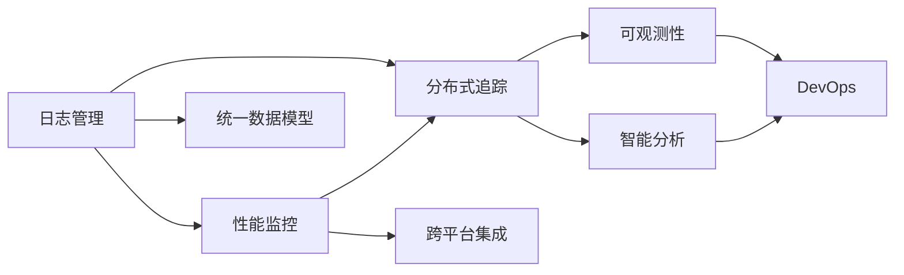

                 

# 可观测性工具链：日志、指标与追踪

> 关键词：可观测性, 日志管理, 性能监控, 分布式追踪, 微服务, DevOps

## 1. 背景介绍

### 1.1 问题由来
在现代分布式系统中，日志、指标和分布式追踪(Distributed Tracing)作为可观测性工具链的三个核心组成部分，对于监控系统状态、分析故障原因、优化性能、提升运维效率至关重要。尤其在微服务架构下，由于系统复杂度的提升和跨部门协作的增加，可观测性工具的精细化管理和全面覆盖显得更加重要。

面对大规模微服务系统的运维挑战，传统的日志管理和性能监控工具往往难以满足需求。日志和指标数据繁杂、缺乏统一标准，不易追踪问题源、定位瓶颈。分布式追踪虽然能在一定程度上提供服务调用链路信息，但仅基于请求时间戳进行链路关联，无法准确记录数据流向，对分布式系统的分析和调试仍有局限性。

为了解决这些问题，近年来出现了一些开源工具，如Zipkin、OpenTelemetry等，它们基于开放标准，提供了统一的数据模型和API接口，方便跨平台集成和数据采集。这些工具的融合使用，为构建更高效、全面、智能的可观测性工具链提供了可能。

### 1.2 问题核心关键点
现代分布式系统可观测性工具链的核心关键点在于：
- **统一数据模型**：提供标准化的数据模型，支持日志、指标和分布式追踪数据的统一存储和管理。
- **跨平台集成**：支持多语言、多平台的应用和监控工具集成，实现数据互操作性。
- **智能分析能力**：通过机器学习、异常检测等技术，提供自动化和智能化的故障诊断、性能优化建议。
- **可视化展示**：提供直观易懂的可视化界面，帮助运维人员快速定位问题、理解系统状态。

这些关键点共同构成了可观测性工具链的基本框架，使得大型分布式系统能够高效、全面地进行监测和运维。

## 2. 核心概念与联系

### 2.1 核心概念概述

为了更好地理解现代分布式系统可观测性工具链，本节将介绍几个关键的概念：

- **日志管理(Log Management)**：记录系统运行过程中的各项操作、错误信息、性能指标等信息，以供事后分析和故障诊断使用。
- **性能监控(Performance Monitoring)**：实时监测系统资源使用情况、业务性能指标等，识别性能瓶颈，及时调整资源配置。
- **分布式追踪(Distributed Tracing)**：通过记录服务调用链路，追踪请求从发起到完成的全流程，帮助定位服务依赖关系和性能问题。
- **可观测性(Observability)**：指系统能够对外提供日志、指标和分布式追踪数据，供外部监控工具使用，以实现系统的透明化和可视化。
- **DevOps**：结合软件开发与运维管理的实践，强调团队协作、自动化和持续交付的价值，以提升系统开发和运维效率。

这些概念之间的逻辑关系可以通过以下Mermaid流程图来展示：



这个流程图展示了日志管理、性能监控、分布式追踪、可观测性及DevOps之间的关系：

1. 日志管理、性能监控和分布式追踪是构成可观测性的三个关键部分。
2. 统一数据模型和跨平台集成使三者能够统一存储和共享数据。
3. 智能分析提供了自动化和智能化的故障诊断和性能优化。
4. DevOps实践推动了日志、指标和分布式追踪数据的全面覆盖和高效应用。

## 3. 核心算法原理 & 具体操作步骤
### 3.1 算法原理概述

现代分布式系统可观测性工具链的构建基于以下核心算法原理：

- **日志聚合和存储**：通过日志聚合工具，将分布式系统各组件的日志数据集中存储，便于统一分析和检索。
- **指标采集和聚合**：定期采集系统资源使用、业务性能指标，通过聚合统计，生成可供分析的汇总数据。
- **分布式追踪数据采集和处理**：通过分布式追踪工具，记录请求在服务间的流转过程，生成服务调用链路图，供故障分析和性能优化使用。
- **统一数据模型**：采用标准化的数据模型，如Zipkin的Span模型，统一表示日志、指标和分布式追踪数据。
- **跨平台集成**：通过开放API接口，支持多语言、多平台的应用和监控工具集成。
- **智能分析**：结合机器学习、异常检测等技术，提供自动化和智能化的故障诊断和性能优化建议。

### 3.2 算法步骤详解

现代分布式系统可观测性工具链的构建过程主要包括以下几个关键步骤：

**Step 1: 设计统一数据模型**

选择合适的统一数据模型，如Zipkin的Span模型，用于统一表示日志、指标和分布式追踪数据。该模型包括请求ID、服务ID、操作名称、时间戳、服务类型等信息。

**Step 2: 采集和存储数据**

1. **日志数据采集**：使用日志管理工具如ELK Stack，采集系统各组件的日志数据，并存储在统一的日志仓库中。
2. **指标数据采集**：通过指标采集工具如Prometheus，定期采集系统资源使用、业务性能指标等，并存储在统一的指标仓库中。
3. **分布式追踪数据采集**：使用分布式追踪工具如Zipkin，记录请求在服务间的流转过程，生成调用链路图，并存储在分布式追踪仓库中。

**Step 3: 数据集成和可视化**

1. **数据集成**：使用数据集成工具如Kibana，将日志、指标和分布式追踪数据统一集成在可视化仪表板上。
2. **数据可视化**：通过可视化工具如Grafana，将数据以图表形式展示，提供直观易懂的分析界面。

**Step 4: 智能分析**

1. **异常检测**：使用机器学习算法对日志、指标和分布式追踪数据进行异常检测，识别潜在故障和性能问题。
2. **性能优化建议**：结合实时监控数据和历史性能数据，提供性能优化建议，如资源调整、服务重启等。

**Step 5: 自动化运维**

1. **自动化故障诊断**：使用自动化运维工具如Jenkins，结合故障检测和优化建议，自动化执行故障处理和修复。
2. **持续交付和部署**：通过持续交付平台如Jenkins Pipeline，实现自动化持续集成和持续部署，加速系统迭代和交付。

### 3.3 算法优缺点

现代分布式系统可观测性工具链具有以下优点：

- **全面覆盖**：统一数据模型和跨平台集成，实现了日志、指标和分布式追踪数据的全面覆盖和统一管理。
- **实时监控**：通过实时采集和分析数据，能够快速发现系统故障和性能问题。
- **自动化运维**：自动化故障诊断和处理，减少了人工干预，提高了运维效率。
- **智能分析**：结合机器学习和异常检测，提供更准确和智能化的故障诊断和性能优化建议。

同时，该工具链也存在以下局限性：

- **数据一致性**：不同数据源的数据采集和存储可能存在时间偏差，影响数据的实时性和一致性。
- **复杂度管理**：大型系统的日志、指标和分布式追踪数据量巨大，数据管理和维护复杂。
- **隐私和安全**：日志和指标数据的敏感性可能带来隐私和安全风险，需要采取相应的防护措施。

尽管存在这些局限性，但就目前而言，基于日志、指标和分布式追踪的现代分布式系统可观测性工具链仍是系统监控和运维的重要范式。未来相关研究的重点在于如何进一步提高数据一致性、简化数据管理、增强隐私保护，同时兼顾实时性和智能性。

### 3.4 算法应用领域

现代分布式系统可观测性工具链在多个领域得到了广泛的应用，例如：

- **金融领域**：金融系统的复杂性和高可用性要求对日志、指标和分布式追踪数据的全面监控，以保障交易的稳定性和安全性。
- **电商领域**：电商平台的庞大用户量和高频交易要求对系统性能和业务指标的实时监控，以提升用户体验和满意度。
- **社交媒体**：社交媒体平台的实时数据生成和用户互动要求对日志和指标数据的详细分析，以优化用户体验和服务质量。
- **医疗领域**：医疗系统的数据量大、业务复杂性高，对日志和指标数据的深入分析，有助于提升服务可靠性和患者满意度。
- **政府服务**：政府服务的公共性和服务质量要求对系统日志和业务指标的详细监控，以保障服务效率和公正性。

这些领域的应用展示了现代分布式系统可观测性工具链的广泛价值，为不同行业提供了高效的监控和运维解决方案。

## 4. 数学模型和公式 & 详细讲解 & 举例说明

### 4.1 数学模型构建

本节将使用数学语言对现代分布式系统可观测性工具链进行更严格的刻画。

假设分布式系统由N个服务组成，每个服务有一个唯一的ID。日志、指标和分布式追踪数据分别存储在日志仓库、指标仓库和分布式追踪仓库中。定义统一数据模型，采用Zipkin的Span模型，每个Span包含请求ID、服务ID、操作名称、时间戳、服务类型等信息。

日志数据模型为：

$$
\text{Log} = (timestamp, severity, message, source, serviceID)
$$

指标数据模型为：

$$
\text{Metric} = (timestamp, serviceID, metricType, metricValue)
$$

分布式追踪数据模型为：

$$
\text{Span} = (spanID, parentID, serviceID, startTime, duration, status, exception)
$$

其中，spanID和parentID用于表示Span之间的父子关系。

### 4.2 公式推导过程

以下我们以日志数据和分布式追踪数据的融合为例，推导数据融合后的时间戳对齐算法。

假设日志数据的时间戳为$t_{log}$，分布式追踪数据的时间戳为$t_{span}$。为了保证数据对齐，需要找到最小的时间戳对齐点。

设两个时间戳的最小公倍数为T，则时间戳对齐点为：

$$
\text{alignTime} = \frac{T}{\gcd(t_{log}, t_{span})}
$$

将日志数据和分布式追踪数据按照对齐时间戳进行合并，生成统一的日志和Span数据。

### 4.3 案例分析与讲解

以下以金融交易系统的日志和指标数据融合为例，展示数据对齐和融合的过程：

假设金融交易系统由多个服务组成，分别为核心系统、风控系统、支付系统等。各服务会产生详细的日志数据和性能指标数据。日志数据存储在Elasticsearch中，指标数据存储在Prometheus中。

**步骤1: 日志数据采集**

使用Fluentd和Elasticsearch，采集核心系统、风控系统和支付系统的日志数据，存储在Elasticsearch集群中。

**步骤2: 指标数据采集**

使用Prometheus，定期采集核心系统、风控系统和支付系统的业务性能指标，存储在Prometheus数据库中。

**步骤3: 数据对齐**

通过时间戳对齐算法，将日志数据和指标数据按照最小公倍数进行对齐。

**步骤4: 数据融合**

使用Kibana，将对齐后的日志和指标数据融合在一起，生成统一的日志和指标数据，供分析和监控使用。

## 5. 项目实践：代码实例和详细解释说明
### 5.1 开发环境搭建

在进行可观测性工具链的实践前，我们需要准备好开发环境。以下是使用Python进行日志、指标和分布式追踪数据采集与融合的开发环境配置流程：

1. 安装Anaconda：从官网下载并安装Anaconda，用于创建独立的Python环境。

2. 创建并激活虚拟环境：
```bash
conda create -n observability-env python=3.8 
conda activate observability-env
```

3. 安装PyTorch、TensorFlow和Flask等常用工具包：
```bash
conda install pytorch torchvision torchaudio cudatoolkit=11.1 -c pytorch -c conda-forge
conda install tensorflow -c conda-forge
pip install flask
```

4. 安装日志管理工具ELK Stack和性能监控工具Prometheus、Grafana等：
```bash
conda install elasticsearch kibana 
pip install prometheus_client
```

完成上述步骤后，即可在`observability-env`环境中开始可观测性工具链的实践。

### 5.2 源代码详细实现

下面我以日志和指标数据的融合为例，给出使用Python实现日志数据采集、时间戳对齐和融合的代码实现。

首先，定义日志数据和指标数据的统一模型：

```python
from datetime import datetime

class Log:
    def __init__(self, timestamp, severity, message, source, serviceID):
        self.timestamp = timestamp
        self.severity = severity
        self.message = message
        self.source = source
        self.serviceID = serviceID

class Metric:
    def __init__(self, timestamp, serviceID, metricType, metricValue):
        self.timestamp = timestamp
        self.serviceID = serviceID
        self.metricType = metricType
        self.metricValue = metricValue

def get_align_time(log_time, span_time):
    gcd = lambda a, b: gcd(b, a % b) if b else a
    T = abs(log_time - span_time)
    return gcd(log_time, span_time)
```

然后，定义日志数据和指标数据的采集和存储：

```python
# 日志数据采集
log_data = []
log_file = open('log.txt', 'r')
for line in log_file:
    timestamp = datetime.strptime(line.split()[0], '%Y-%m-%d %H:%M:%S')
    severity = line.split()[1]
    message = ' '.join(line.split()[2:])
    source = line.split()[3]
    serviceID = line.split()[4]
    log_data.append(Log(timestamp, severity, message, source, serviceID))

# 指标数据采集
metric_data = []
metric_file = open('metric.txt', 'r')
for line in metric_file:
    timestamp = datetime.strptime(line.split()[0], '%Y-%m-%d %H:%M:%S')
    serviceID = line.split()[1]
    metricType = line.split()[2]
    metricValue = float(line.split()[3])
    metric_data.append(Metric(timestamp, serviceID, metricType, metricValue))
```

接下来，定义时间戳对齐和数据融合的函数：

```python
# 时间戳对齐
def align_timestamps(log_data, metric_data):
    align_time = 0
    for log in log_data:
        for metric in metric_data:
            align_time = get_align_time(log.timestamp, metric.timestamp)
            if align_time:
                log.timestamp = log.timestamp - log.timestamp % align_time
                metric.timestamp = metric.timestamp - metric.timestamp % align_time
    return log_data, metric_data

# 数据融合
def fuse_logs_and_metrics(log_data, metric_data):
    fused_data = []
    for log in log_data:
        for metric in metric_data:
            if log.timestamp == metric.timestamp:
                fused_data.append(Log(log.timestamp, log.severity, log.message, log.source, log.serviceID, metric.metricType, metric.metricValue))
    return fused_data
```

最后，启动数据融合流程并展示结果：

```python
log_data, metric_data = align_timestamps(log_data, metric_data)
fused_data = fuse_logs_and_metrics(log_data, metric_data)

# 打印融合后的日志数据
for log in fused_data:
    print(f'{log.timestamp} {log.severity} {log.message} from {log.source} in service {log.serviceID}')
```

以上就是使用Python实现日志数据采集、时间戳对齐和融合的完整代码实现。可以看到，利用Python的强大数据处理能力，我们可以方便地进行日志和指标数据的采集、对齐和融合。

### 5.3 代码解读与分析

让我们再详细解读一下关键代码的实现细节：

**Log和Metric类**：
- `Log`和`Metric`类分别用于表示日志数据和指标数据，包括时间戳、 severity、message、source、serviceID、metricType、metricValue等信息。
- `get_align_time`函数：用于计算两个时间戳的最小公倍数，用于时间戳对齐。

**数据采集**：
- 通过读取文件的方式，分别采集日志数据和指标数据，将其存储在`log_data`和`metric_data`列表中。

**时间戳对齐**：
- `align_timestamps`函数：遍历日志和指标数据，计算它们的时间戳对齐点，并将所有数据的时间戳对齐到该点。

**数据融合**：
- `fuse_logs_and_metrics`函数：遍历对齐后的日志和指标数据，将时间戳相同的数据进行融合，生成包含日志和指标信息的综合数据。

这些代码实现了日志和指标数据的采集、对齐和融合，展示了可观测性工具链的实现过程。

## 6. 实际应用场景

### 6.1 智能客服系统

在智能客服系统中，日志、指标和分布式追踪数据是保障系统稳定性和用户体验的关键。通过可观测性工具链，可以实现对系统状态、用户交互和业务流程的全面监控，及时发现和解决问题。

在实践中，可以构建统一的数据模型，采用Elasticsearch存储日志数据，Prometheus采集指标数据，Zipkin记录分布式追踪数据。借助Kibana和Grafana，将数据整合在统一的仪表板上，提供直观易懂的分析界面。对于用户投诉和系统故障，可以快速定位问题源，制定解决方案。

### 6.2 金融舆情监测

金融系统的高可用性和数据敏感性要求对日志和指标数据的精细化管理。通过可观测性工具链，可以实现对系统运行状态、业务性能指标的全面监控，及时发现潜在的故障和风险。

在金融舆情监测中，可以采用Kibana存储日志数据，Prometheus采集指标数据，Zipkin记录分布式追踪数据。借助智能分析工具，对系统异常行为进行实时检测，提前预警可能的风险事件。同时，可以定期生成系统健康报告，供管理层和运维人员参考。

### 6.3 个性化推荐系统

个性化推荐系统的核心在于对用户行为和系统性能的深入分析。通过可观测性工具链，可以实现对用户行为、推荐算法和系统性能的全面监控，提供实时优化建议。

在推荐系统中，可以采用Elasticsearch存储用户行为数据，Prometheus采集指标数据，Zipkin记录分布式追踪数据。借助Kibana和Grafana，将数据整合在统一的仪表板上，提供可视化的分析界面。对于系统性能瓶颈和推荐算法问题，可以快速定位并优化。

### 6.4 未来应用展望

随着分布式系统规模的扩大和复杂度的增加，可观测性工具链的应用将更加广泛和深入。未来，可观测性工具链将呈现以下几个发展趋势：

1. **数据实时性提升**：通过实时数据采集和分析，实现对系统状态的即时监控，快速发现和解决问题。
2. **跨平台集成优化**：支持更多语言和平台的集成，提供更广泛的数据采集和分析能力。
3. **智能分析增强**：结合机器学习和异常检测，提供更准确和智能化的故障诊断和性能优化建议。
4. **可视化界面升级**：提供更直观、易用的可视化界面，帮助运维人员快速定位问题、理解系统状态。
5. **分布式追踪深化**：采用更细粒度的Span模型，记录更详细的服务调用链路，提供更深入的故障分析和性能优化。

这些趋势将推动现代分布式系统可观测性工具链的不断进步，提升系统运维效率和业务性能。

## 7. 工具和资源推荐

### 7.1 学习资源推荐

为了帮助开发者系统掌握可观测性工具链的理论基础和实践技巧，这里推荐一些优质的学习资源：

1. **《分布式系统可观测性指南》**：讲解日志、指标和分布式追踪的原理、工具和应用，提供了全面的可观测性管理解决方案。

2. **《ELK Stack实战》**：详细介绍了Elasticsearch、Logstash和Kibana的配置和使用方法，帮助你快速搭建日志管理平台。

3. **《Prometheus实战》**：介绍了Prometheus的配置和集成方法，讲解了指标数据的采集、存储和分析。

4. **《Zipkin入门与实践》**：讲解了Zipkin的基本概念和用法，帮助你构建和部署分布式追踪系统。

5. **《Grafana入门与实践》**：介绍了Grafana的配置和集成方法，讲解了指标数据的可视化展示。

6. **《可观测性工具链：日志、指标与追踪》系列博文**：由可观测性工具链专家撰写，深入浅出地介绍了日志、指标和分布式追踪的原理和实践。

通过对这些资源的学习实践，相信你一定能够快速掌握可观测性工具链的精髓，并用于解决实际的系统监控和运维问题。

### 7.2 开发工具推荐

高效的开发离不开优秀的工具支持。以下是几款用于日志、指标和分布式追踪数据采集与融合的常用工具：

1. **Elasticsearch**：分布式文档存储和搜索引擎，适合大规模日志数据的存储和搜索。

2. **Logstash**：日志数据处理和转发工具，支持从多个数据源采集日志，并对其进行格式化、过滤和存储。

3. **Kibana**：Elasticsearch的可视化界面，提供直观的日志数据分析和仪表板展示。

4. **Prometheus**：分布式监控和报警系统，支持多语言、多平台的指标数据采集和存储。

5. **Grafana**：Prometheus的可视化界面，提供灵活的仪表板配置和指标展示。

6. **Zipkin**：分布式追踪系统，通过记录服务调用链路，追踪请求全流程。

7. **ELK Stack**：Elasticsearch、Logstash和Kibana的组合，提供日志数据采集、处理和分析的完整解决方案。

合理利用这些工具，可以显著提升可观测性工具链的开发效率，加快创新迭代的步伐。

### 7.3 相关论文推荐

可观测性工具链的发展源于学界的持续研究。以下是几篇奠基性的相关论文，推荐阅读：

1. **《分布式系统日志管理：从ELK到Apache Kafka》**：详细介绍了日志管理的演变过程，并讨论了Apache Kafka等新工具的优势。

2. **《基于Prometheus的分布式系统监控》**：介绍了Prometheus的架构和实现原理，讲解了分布式系统监控的最佳实践。

3. **《Zipkin的设计与实现》**：详细介绍了Zipkin的设计思路和实现细节，讲解了分布式追踪系统的关键技术和性能优化方法。

4. **《基于Grafana的分布式系统监控可视化》**：介绍了Grafana的架构和用法，讲解了指标数据的可视化展示方法。

5. **《分布式系统可观测性技术综述》**：综述了当前分布式系统可观测性的关键技术和应用实践，展望了未来的发展方向。

这些论文代表了大规模分布式系统可观测性工具链的研究进展，通过学习这些前沿成果，可以帮助研究者把握学科前进方向，激发更多的创新灵感。

## 8. 总结：未来发展趋势与挑战

### 8.1 总结

本文对现代分布式系统可观测性工具链进行了全面系统的介绍。首先阐述了日志、指标和分布式追踪作为可观测性工具链的三个核心组成部分，明确了其在系统监控和运维中的重要作用。其次，从原理到实践，详细讲解了可观测性工具链的数学模型和算法原理，提供了完整的代码实现和数据融合示例。同时，本文还广泛探讨了可观测性工具链在智能客服、金融舆情、个性化推荐等多个行业领域的应用前景，展示了其广阔的实践价值。此外，本文精选了可观测性工具链的学习资源、开发工具和相关论文，力求为读者提供全方位的技术指引。

通过本文的系统梳理，可以看到，现代分布式系统可观测性工具链正在成为系统监控和运维的重要范式，极大地提升了系统的透明度和可视化程度。日志、指标和分布式追踪数据的全面覆盖和智能分析，为系统故障诊断、性能优化提供了有力的工具支持。未来，随着技术的不断演进，可观测性工具链必将在构建安全、可靠、可解释、可控的智能系统中扮演越来越重要的角色。

### 8.2 未来发展趋势

展望未来，现代分布式系统可观测性工具链将呈现以下几个发展趋势：

1. **智能化和自动化**：通过机器学习和异常检测，提供自动化和智能化的故障诊断和性能优化。
2. **数据实时性提升**：通过实时数据采集和分析，实现对系统状态的即时监控，快速发现和解决问题。
3. **跨平台集成优化**：支持更多语言和平台的集成，提供更广泛的数据采集和分析能力。
4. **可视化界面升级**：提供更直观、易用的可视化界面，帮助运维人员快速定位问题、理解系统状态。
5. **分布式追踪深化**：采用更细粒度的Span模型，记录更详细的服务调用链路，提供更深入的故障分析和性能优化。
6. **数据隐私和安全**：引入数据隐私和安全机制，保护敏感数据，防止数据泄露和滥用。

这些趋势将推动现代分布式系统可观测性工具链的不断进步，提升系统运维效率和业务性能。

### 8.3 面临的挑战

尽管现代分布式系统可观测性工具链已经取得了显著进展，但在迈向更加智能化、普适化应用的过程中，它仍面临诸多挑战：

1. **数据一致性**：不同数据源的数据采集和存储可能存在时间偏差，影响数据的实时性和一致性。
2. **复杂度管理**：大型系统的日志、指标和分布式追踪数据量巨大，数据管理和维护复杂。
3. **隐私和安全**：日志和指标数据的敏感性可能带来隐私和安全风险，需要采取相应的防护措施。
4. **实时性和性能**：大规模数据流的高频处理和分析，对系统实时性和性能提出了高要求。
5. **跨平台集成**：支持多语言、多平台的应用和监控工具集成，实现数据互操作性。

尽管存在这些挑战，但通过技术创新和应用实践，相信现代分布式系统可观测性工具链能够不断克服这些难题，实现更高效、全面的系统监控和运维。

### 8.4 研究展望

面向未来，现代分布式系统可观测性工具链需要在以下几个方面寻求新的突破：

1. **数据一致性优化**：采用更高效的实时数据同步和对齐算法，确保数据的实时性和一致性。
2. **复杂度管理优化**：开发更智能的数据聚合和可视化工具，简化数据管理和维护。
3. **隐私和安全保护**：引入数据隐私和安全机制，保护敏感数据，防止数据泄露和滥用。
4. **实时性和性能优化**：采用分布式计算和模型压缩等技术，提升系统的实时性和性能。
5. **跨平台集成优化**：支持更多语言和平台的集成，提供更广泛的数据采集和分析能力。
6. **分布式追踪深化**：采用更细粒度的Span模型，记录更详细的服务调用链路，提供更深入的故障分析和性能优化。

这些研究方向的探索，将引领现代分布式系统可观测性工具链向更高的台阶迈进，为构建安全、可靠、可解释、可控的智能系统铺平道路。

## 9. 附录：常见问题与解答

**Q1：日志管理、性能监控和分布式追踪之间的关系是什么？**

A: 日志管理、性能监控和分布式追踪是构成现代分布式系统可观测性工具链的三个核心组成部分。日志管理记录系统运行过程中的各项操作和错误信息，提供事后分析和故障诊断的数据支撑；性能监控实时监测系统资源使用和业务性能指标，识别性能瓶颈，及时调整资源配置；分布式追踪记录服务调用链路，追踪请求从发起到完成的全流程，帮助定位服务依赖关系和性能问题。这三者相互补充，共同构成了可观测性工具链的完整图景。

**Q2：如何选择合适的日志管理工具？**

A: 选择合适的日志管理工具需要考虑以下几个关键点：
1. **扩展性**：支持大规模日志数据的存储和查询，具有良好的水平扩展能力。
2. **灵活性**：支持多种数据源和格式，能够高效处理各种类型的日志数据。
3. **安全性**：具有完善的数据加密和安全防护机制，防止数据泄露和滥用。
4. **易用性**：提供直观易用的管理界面和丰富的查询语言，方便数据分析和故障诊断。
5. **性能**：支持高效的日志索引和搜索，保证系统的高可用性和低延迟。

常用的日志管理工具包括ELK Stack、Apache Kafka、Splunk等，根据具体需求选择合适的工具。

**Q3：如何优化指标数据的实时性和准确性？**

A: 优化指标数据的实时性和准确性需要从以下几个方面入手：
1. **数据采样**：采用时间戳对齐和插值技术，提高指标数据的实时性。
2. **数据过滤**：根据业务需求，过滤掉无关的指标数据，减少数据量和计算开销。
3. **数据聚合**：采用粗粒度聚合技术，将高频数据转化为低频汇总数据，提高指标数据的可分析性。
4. **数据同步**：确保各数据源的指标数据一致性，防止数据偏差和缺失。
5. **数据可视化**：通过Grafana等工具，将指标数据展示在直观易用的仪表板上，方便实时监控和分析。

合理利用这些技术手段，可以显著提升指标数据的实时性和准确性，为系统性能优化提供有力支撑。

**Q4：分布式追踪中的Span模型如何定义？**

A: 分布式追踪中的Span模型由以下信息组成：
1. **spanID**：当前Span的唯一标识符。
2. **parentID**：当前Span的父Span的标识符。
3. **serviceID**：当前Span所对应的服务ID。
4. **startTime**：当前Span的开始时间。
5. **duration**：当前Span的执行时间。
6. **status**：当前Span的执行状态，如成功、失败、超时等。
7. **exception**：当前Span执行过程中出现的异常信息。

通过记录这些信息，分布式追踪系统可以完整地记录请求从发起到完成的全流程，提供服务调用链路图和详细的服务依赖关系。

**Q5：如何实现跨平台的日志、指标和分布式追踪数据集成？**

A: 实现跨平台的日志、指标和分布式追踪数据集成需要遵循以下几个步骤：
1. **统一数据模型**：采用标准化的数据模型，如Zipkin的Span模型，统一表示日志、指标和分布式追踪数据。
2. **选择合适的采集工具**：根据不同平台的特点，选择合适的日志、指标和分布式追踪数据采集工具，如ELK Stack、Prometheus、Zipkin等。
3. **数据集成平台**：使用数据集成工具如Kibana、Grafana等，将不同平台的数据统一集成在可视化仪表板上。
4. **数据同步机制**：采用数据同步机制，确保不同平台的数据一致性，防止数据偏差和缺失。
5. **数据可视化**：通过可视化工具如Kibana、Grafana等，将不同平台的数据展示在统一的仪表板上，方便实时监控和分析。

通过这些步骤，可以实现跨平台的日志、指标和分布式追踪数据集成，提供统一的可观测性解决方案。

---

作者：禅与计算机程序设计艺术 / Zen and the Art of Computer Programming

