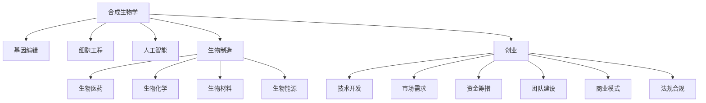

                 

# 合成生物学创业：设计生命的商业潜力

> 关键词：合成生物学,生物信息学,基因编辑,CRISPR,细胞工程,人工智能,生物制造,创业,基因工程,生物医药,生物化学

## 1. 背景介绍

### 1.1 问题由来

随着科学技术的发展，合成生物学（Synthetic Biology）作为一种新兴的交叉学科，正在逐渐显现出其巨大的潜力和广泛的应用前景。合成生物学利用工程学的思想和方法，设计和改造生物系统，使其能够执行特定的功能，如生物生产、环境修复、疾病治疗等。

在过去的几年中，合成生物学的研究取得了诸多突破，包括在基因编辑技术（如CRISPR-Cas9）、合成基因组、细胞工程、人工设计的新生物系统等方面的进展。然而，如何将这些前沿技术转化为商业应用，仍然是一个值得深入探讨的问题。

### 1.2 问题核心关键点

合成生物学创业的核心关键点在于：如何从实验室中的研究转化为可行的商业模型，实现技术向产业化的有效过渡。这需要综合考虑以下几个方面：

- **技术成熟度**：了解技术的研发进展和应用前景，评估其商业化潜力和可行性。
- **市场需求**：明确市场需求，理解目标客户和应用场景，制定有针对性的商业策略。
- **资金筹措**：筹措足够的资金支持技术开发和商业化进程。
- **团队建设**：构建一个跨学科的团队，涵盖生物、工程、计算机科学等多个领域的专家。
- **商业模式**：选择适合的商业模式，如许可、合作研发、直接销售等，实现商业闭环。
- **法规合规**：遵循相关法规和伦理规范，确保技术应用的合法性和安全性。

## 2. 核心概念与联系

### 2.1 核心概念概述

为了更好地理解合成生物学的创业过程，本节将介绍几个关键概念：

- **合成生物学**：通过设计和合成新的生物系统，实现特定功能。包括基因编辑、合成生物材料、人工细胞等方向。
- **基因编辑**：利用CRISPR、ZFN、TALEN等技术，精确修改生物体的基因组。
- **细胞工程**：利用基因编辑、细胞融合、细胞重编程等技术，改造细胞功能和性质。
- **人工智能**：与合成生物学结合，通过机器学习和大数据分析，优化设计过程和预测结果。
- **生物制造**：利用合成生物学技术，设计和制造新的生物材料和药物，提高生产效率和质量。
- **创业**：将科技成果转化为商业化产品或服务的活动。

这些概念之间的逻辑关系可以通过以下Mermaid流程图来展示：



这个流程图展示合成生物学的核心概念及其之间的关系：

1. 合成生物学通过设计和改造生物系统，实现特定功能。
2. 基因编辑、细胞工程等技术为实现这些功能提供工具和方法。
3. 人工智能和大数据分析，优化设计过程和结果预测。
4. 生物制造将研究成果转化为具体的生物材料和产品。
5. 创业过程将研究成果转化为可行的商业模型。

## 3. 核心算法原理 & 具体操作步骤

### 3.1 算法原理概述

合成生物学创业的技术开发和商业化过程，涉及多个交叉学科的方法和工具。其核心算法原理可以概括为以下几个步骤：

1. **需求分析**：明确市场需求和目标客户，制定商业策略。
2. **技术评估**：评估技术的成熟度和可行性，选择合适的技术路线。
3. **市场调研**：进行市场调研，了解竞争情况和市场需求。
4. **产品设计**：基于需求和技术评估，设计符合市场需求的产品。
5. **原型开发**：开发产品原型，进行测试和优化。
6. **商业化评估**：评估产品商业化潜力，制定商业化策略。
7. **投资筹措**：筹措足够的资金支持产品开发和市场推广。
8. **团队建设**：组建跨学科团队，确保技术开发和商业化顺利进行。
9. **市场推广**：通过营销、销售等手段，将产品推向市场。
10. **法规合规**：确保产品符合相关法规和伦理规范。

### 3.2 算法步骤详解

以下我们将详细介绍合成生物学创业的各个步骤：

#### 3.2.1 需求分析

需求分析是合成生物学创业的第一步，其目的是明确市场需求和目标客户，为后续的技术评估和产品设计提供指导。需求分析通常包括以下几个方面：

- **市场调研**：通过问卷调查、访谈、市场分析等方法，了解目标市场的需求和客户痛点。
- **竞争分析**：分析竞争对手的产品、技术、市场策略，找出自身优势和差距。
- **技术评估**：评估技术在市场上的应用前景和可行性，确定是否值得投资。

#### 3.2.2 技术评估

技术评估是合成生物学创业的关键环节，其目的是评估技术的成熟度和可行性，选择合适的技术路线。技术评估通常包括以下几个方面：

- **技术成熟度**：评估技术的研发进展和应用前景，确定其商业化潜力。
- **技术优势**：分析技术相较于竞争对手的优势，评估其竞争力。
- **技术风险**：评估技术的实现难度和风险，确定技术的开发周期和成本。

#### 3.2.3 市场调研

市场调研是合成生物学创业的重要环节，其目的是了解市场需求和竞争情况，为产品设计和商业化策略提供指导。市场调研通常包括以下几个方面：

- **市场需求**：了解目标客户的需求和痛点，确定产品的功能和特性。
- **市场趋势**：分析市场趋势和技术发展方向，确定产品的未来前景。
- **客户反馈**：收集客户反馈和意见，不断优化产品设计和商业模式。

#### 3.2.4 产品设计

产品设计是合成生物学创业的关键步骤，其目的是根据市场需求和技术评估，设计符合市场需求的产品。产品设计通常包括以下几个方面：

- **功能设计**：确定产品的功能特性和应用场景，满足市场需求。
- **技术路线**：选择合适的技术路线，确保技术可行性和成本效益。
- **用户体验**：设计用户界面和交互方式，提升用户体验和满意度。

#### 3.2.5 原型开发

原型开发是合成生物学创业的重要环节，其目的是开发产品原型，进行测试和优化。原型开发通常包括以下几个方面：

- **原型制作**：制作产品原型，进行初步测试和验证。
- **性能优化**：根据测试结果，优化产品性能和功能，确保产品可靠性。
- **用户反馈**：收集用户反馈和意见，不断改进产品设计和功能。

#### 3.2.6 商业化评估

商业化评估是合成生物学创业的关键步骤，其目的是评估产品的商业化潜力，制定商业化策略。商业化评估通常包括以下几个方面：

- **市场潜力**：评估产品的市场潜力，确定市场规模和增长空间。
- **定价策略**：制定合理的定价策略，确保产品具有市场竞争力。
- **推广策略**：制定推广策略，提升产品的市场占有率。

#### 3.2.7 投资筹措

投资筹措是合成生物学创业的重要环节，其目的是筹措足够的资金支持产品开发和市场推广。投资筹措通常包括以下几个方面：

- **融资渠道**：选择适合的融资渠道，如天使投资、风险投资、政府资助等。
- **资金需求**：确定资金需求，制定资金使用计划。
- **投资者关系**：建立与投资者的良好关系，确保资金支持。

#### 3.2.8 团队建设

团队建设是合成生物学创业的重要环节，其目的是组建跨学科团队，确保技术开发和商业化顺利进行。团队建设通常包括以下几个方面：

- **人员招募**：招募具备相关技术和专业背景的员工。
- **团队协作**：建立良好的团队协作机制，确保项目顺利进行。
- **激励机制**：制定合理的激励机制，提升员工工作积极性和创新能力。

#### 3.2.9 市场推广

市场推广是合成生物学创业的重要环节，其目的是通过营销、销售等手段，将产品推向市场。市场推广通常包括以下几个方面：

- **品牌建设**：建立品牌形象，提升品牌知名度。
- **营销策略**：制定营销策略，吸引目标客户。
- **销售渠道**：建立销售渠道，确保产品销售。

#### 3.2.10 法规合规

法规合规是合成生物学创业的重要环节，其目的是确保产品符合相关法规和伦理规范。法规合规通常包括以下几个方面：

- **法规遵守**：确保产品符合相关法规和标准，如GMP、FDA认证等。
- **伦理规范**：遵循伦理规范，确保技术应用的合法性和安全性。
- **社会责任**：承担社会责任，推动可持续发展。

## 4. 数学模型和公式 & 详细讲解 & 举例说明

### 4.1 数学模型构建

在合成生物学创业中，数学模型和公式常常用于优化产品设计和评估产品性能。以下是一个典型的数学模型构建过程：

- **需求函数**：
  $$
  D = f(P, C, T)
  $$
  其中，$D$ 表示市场需求，$P$ 表示产品价格，$C$ 表示客户体验，$T$ 表示技术成熟度。

- **成本函数**：
  $$
  C = g(L, V, S)
  $$
  其中，$C$ 表示成本，$L$ 表示研发投入，$V$ 表示生产成本，$S$ 表示销售费用。

- **收益函数**：
  $$
  R = h(D, P, C)
  $$
  其中，$R$ 表示收益，$D$ 表示市场需求，$P$ 表示产品价格，$C$ 表示客户体验。

- **利润函数**：
  $$
  \pi = R - C
  $$
  其中，$\pi$ 表示利润，$R$ 表示收益，$C$ 表示成本。

### 4.2 公式推导过程

以下我们将详细介绍需求函数、成本函数和收益函数的推导过程：

#### 4.2.1 需求函数

需求函数描述市场需求与产品价格、客户体验和技术成熟度之间的关系。其推导过程如下：

- **市场调研**：通过问卷调查、访谈等方法，获取市场数据。
- **数据处理**：对市场数据进行统计分析，确定需求与价格、体验和技术的关系。
- **模型拟合**：利用回归分析等方法，建立需求函数模型。

#### 4.2.2 成本函数

成本函数描述成本与研发投入、生产成本和销售费用的关系。其推导过程如下：

- **数据收集**：收集研发投入、生产成本和销售费用等数据。
- **成本分析**：分析各项成本的组成和变化趋势，确定成本与投入、生产和销售的关系。
- **模型拟合**：利用最小二乘法等方法，建立成本函数模型。

#### 4.2.3 收益函数

收益函数描述收益与市场需求、产品价格和客户体验的关系。其推导过程如下：

- **市场调研**：通过问卷调查、访谈等方法，获取市场数据。
- **数据处理**：对市场数据进行统计分析，确定收益与价格、体验的关系。
- **模型拟合**：利用回归分析等方法，建立收益函数模型。

### 4.3 案例分析与讲解

以下我们以基因编辑技术在生物医药中的应用为例，分析需求函数、成本函数和收益函数的构建和推导过程：

- **需求函数**：假设市场需求与产品价格、客户体验和技术成熟度成正比。
  $$
  D = P + C + T
  $$

- **成本函数**：假设成本与研发投入、生产成本和销售费用成正比。
  $$
  C = L + V + S
  $$

- **收益函数**：假设收益与市场需求、产品价格和客户体验成正比。
  $$
  R = D \times P \times C
  $$

- **利润函数**：将需求函数和成本函数代入收益函数，得到利润函数。
  $$
  \pi = (P + C + T) \times P \times (L + V + S)
  $$

通过这些数学模型，我们可以对基因编辑技术在生物医药中的应用进行全面分析和优化，确保技术开发和商业化顺利进行。

## 5. 项目实践：代码实例和详细解释说明

### 5.1 开发环境搭建

在进行合成生物学创业的项目实践前，我们需要准备好开发环境。以下是使用Python进行Sympy库开发的环境配置流程：

1. 安装Anaconda：从官网下载并安装Anaconda，用于创建独立的Python环境。

2. 创建并激活虚拟环境：
```bash
conda create -n synthetic-env python=3.8 
conda activate synthetic-env
```

3. 安装Sympy：
```bash
conda install sympy
```

4. 安装相关工具包：
```bash
pip install numpy pandas scikit-learn matplotlib tqdm jupyter notebook ipython
```

完成上述步骤后，即可在`synthetic-env`环境中开始项目实践。

### 5.2 源代码详细实现

以下是一个使用Sympy库构建需求函数、成本函数和收益函数的示例代码：

```python
import sympy as sp

# 定义符号
D, P, C, T, L, V, S = sp.symbols('D P C T L V S')

# 定义需求函数
demand_function = P + C + T

# 定义成本函数
cost_function = L + V + S

# 定义收益函数
revenue_function = D * P * C

# 定义利润函数
profit_function = revenue_function - cost_function

# 输出模型
demand_function, cost_function, revenue_function, profit_function
```

### 5.3 代码解读与分析

让我们再详细解读一下关键代码的实现细节：

- **定义符号**：使用Sympy库定义符号，方便后续表达式的操作。
- **需求函数**：通过简单的代数表达式，构建需求函数。
- **成本函数**：通过简单的代数表达式，构建成本函数。
- **收益函数**：通过简单的代数表达式，构建收益函数。
- **利润函数**：将需求函数和成本函数代入收益函数，得到利润函数。

通过这些代码，我们可以清晰地看到数学模型的构建和推导过程，进一步理解需求函数、成本函数和收益函数的数学本质。

## 6. 实际应用场景

### 6.1 智能药物研发

智能药物研发是合成生物学创业的重要应用场景之一。利用基因编辑技术，可以定向修改药物分子，实现新的药物设计。例如，通过CRISPR-Cas9技术，可以在细菌或哺乳动物细胞中，定向编辑基因序列，生成新的药物分子。这种定向设计的方法，可以大幅缩短药物研发周期，降低研发成本，提高药物安全性。

### 6.2 生物质能源

生物质能源是合成生物学创业的另一个重要应用场景。利用合成生物学技术，可以将废弃物转化为能源，实现循环利用。例如，利用基因编辑技术，将微生物的代谢途径改造为产甲烷途径，从而实现生物质甲烷的生产。这种技术可以替代化石燃料，降低能源消耗和碳排放，具有重要的环境和社会价值。

### 6.3 生物制造

生物制造是合成生物学创业的重要方向之一。利用基因编辑技术，可以设计和生产新的生物材料和产品。例如，利用基因编辑技术，改造大肠杆菌或酵母菌，实现生物塑料、生物染料、生物药品等生物材料的高效生产。这种技术可以替代传统化学方法，降低生产成本，提高生产效率，具有重要的经济效益。

### 6.4 未来应用展望

随着合成生物学技术的不断进步，未来在智能药物研发、生物质能源、生物制造等领域，将有更多的应用场景涌现。这些应用场景将不仅局限于传统工业和医疗领域，还将拓展到农业、环保、教育等多个领域，为经济社会发展带来深远影响。

## 7. 工具和资源推荐

### 7.1 学习资源推荐

为了帮助开发者系统掌握合成生物学的创业过程，这里推荐一些优质的学习资源：

1. 《合成生物学原理与应用》书籍：全面介绍合成生物学的原理、技术和应用，适合初学者入门。
2. Coursera《合成生物学》课程：斯坦福大学开设的线上课程，涵盖合成生物学的基础知识和前沿进展。
3. ScienceDirect《合成生物学》期刊：权威的学术期刊，提供大量合成生物学领域的最新研究成果。
4. NIH合成生物学计划：提供丰富的学习资源和项目支持，推动合成生物学技术的发展。
5. Biocongress大会：汇聚合成生物学领域的顶级专家，分享最新的研究成果和技术进展。

通过对这些资源的学习实践，相信你一定能够快速掌握合成生物学的创业过程，并用于解决实际的商业问题。

### 7.2 开发工具推荐

高效的开发离不开优秀的工具支持。以下是几款用于合成生物学创业开发的常用工具：

1. Biopython：开源的生物信息学工具库，提供丰富的生物数据处理和分析功能。
2. MATLAB：强大的数值计算和可视化工具，适合生物数据分析和模拟。
3. Jupyter Notebook：灵活的交互式编程环境，适合数据处理和模型验证。
4. R Studio：强大的数据科学和统计分析工具，适合数据分析和可视化。
5. BioLinux：集成了多种生物信息学工具的Linux发行版，方便开发者快速搭建环境。

合理利用这些工具，可以显著提升合成生物学创业的开发效率，加快创新迭代的步伐。

### 7.3 相关论文推荐

合成生物学创业的研究源于学界的持续研究。以下是几篇奠基性的相关论文，推荐阅读：

1. Synthetic Biology: A Brief Introduction（Nature Reviews）：介绍合成生物学的基本概念和应用前景。
2. Genome Engineering with CRISPR-Cas Systems（Annual Review of Biochemistry）：介绍CRISPR-Cas9技术的原理和应用。
3. Synthetic biology: beyond the genetic code（Nature）：讨论合成生物学的发展方向和未来应用。
4. Engineering Biochemical Computation（Science）：介绍合成生物学在计算生物学中的应用。
5. Biocentric Robotics: From Biological Prototypes to Biohybrid Systems（Nature Reviews Neuroscience）：介绍生物机器人的研究进展。

这些论文代表合成生物学创业技术的发展脉络。通过学习这些前沿成果，可以帮助研究者把握学科前进方向，激发更多的创新灵感。

## 8. 总结：未来发展趋势与挑战

### 8.1 总结

本文对合成生物学创业的整个过程进行了全面系统的介绍。首先阐述了合成生物学的背景和意义，明确了创业的关键步骤和技术评估。其次，从需求分析到市场推广，详细讲解了合成生物学创业的各个环节，提供了完整的代码实例和数学模型。同时，本文还广泛探讨了合成生物学创业在智能药物研发、生物质能源、生物制造等领域的应用前景，展示了合成生物学的广阔潜力。此外，本文精选了学习资源和工具推荐，力求为读者提供全方位的技术指引。

通过本文的系统梳理，可以看到，合成生物学创业技术正在成为生物技术产业的重要推动力，极大地拓展了生物技术的应用边界，催生了更多的商业应用。未来，伴随合成生物学技术的持续演进，相信合成生物技术将在更广泛的领域得到应用，为经济社会发展带来新的机遇。

### 8.2 未来发展趋势

展望未来，合成生物学创业技术将呈现以下几个发展趋势：

1. **技术创新**：随着基因编辑技术的不断发展，新的合成生物学技术将不断涌现，推动行业进步。
2. **市场拓展**：合成生物学技术将进一步拓展到更多领域，如农业、环保、教育等，带来新的商业机会。
3. **法规规范**：随着技术的不断成熟，相关法规和伦理规范将逐步完善，推动合成生物学技术的应用。
4. **合作共赢**：企业和科研机构将加强合作，共同推动合成生物学技术的发展和应用。
5. **国际化**：合成生物学技术将逐步走向国际市场，推动全球范围内的生物技术产业升级。

这些趋势凸显了合成生物学创业技术的广阔前景。这些方向的探索发展，必将进一步提升合成生物学技术的应用价值，为经济社会发展带来新的动力。

### 8.3 面临的挑战

尽管合成生物学创业技术已经取得了诸多进展，但在迈向更加智能化、普适化应用的过程中，仍面临着诸多挑战：

1. **技术复杂性**：合成生物学技术涉及复杂的生物系统设计和实验操作，难度较大。
2. **资金需求**：合成生物学创业需要大量的资金支持，资金筹措难度较大。
3. **市场竞争**：合成生物学市场竞争激烈，如何突围具有挑战性。
4. **法规合规**：合成生物学技术涉及生物安全、伦理规范等，法规合规要求较高。
5. **伦理问题**：基因编辑等技术可能引发伦理问题，需要慎重考虑。
6. **技术瓶颈**：技术瓶颈可能限制合成生物学创业的规模化应用。

面对这些挑战，研究者需要不断创新技术，优化商业模式，加强团队建设，推动合成生物学创业的持续发展。

### 8.4 研究展望

面对合成生物学创业所面临的挑战，未来的研究需要在以下几个方面寻求新的突破：

1. **技术突破**：不断推进基因编辑、细胞工程等技术的发展，推动合成生物学创业的进步。
2. **商业模型**：探索更多元化的商业模型，如合作研发、许可等，推动合成生物学技术的产业化。
3. **政策支持**：推动政府和行业制定相关政策，支持合成生物学创业的发展。
4. **社会责任**：承担社会责任，推动合成生物学技术的可持续发展。

这些研究方向的探索，必将引领合成生物学创业技术迈向更高的台阶，为合成生物学产业带来新的突破。面向未来，合成生物学创业技术还需要与其他前沿技术进行更深入的融合，如人工智能、大数据等，多路径协同发力，共同推动合成生物学技术的发展。只有勇于创新、敢于突破，才能不断拓展合成生物学技术的应用范围，为经济社会发展注入新的动力。

## 9. 附录：常见问题与解答

**Q1：合成生物学创业如何确保技术的安全性和合规性？**

A: 确保技术的安全性和合规性是合成生物学创业的重要任务。主要通过以下几个方面：

- **法规遵守**：严格遵守相关法规和标准，如GMP、FDA认证等，确保技术应用的合法性。
- **伦理规范**：遵循伦理规范，确保技术应用的道德性。
- **社会责任**：承担社会责任，推动可持续发展。

通过严格的法规遵守和伦理规范，可以确保合成生物学创业技术的合法性和安全性。

**Q2：合成生物学创业如何获取足够的资金支持？**

A: 获取足够的资金支持是合成生物学创业的关键任务。主要通过以下几个方面：

- **天使投资**：寻找天使投资者，提供初期的资金支持。
- **风险投资**：寻找风险投资机构，提供中期的资金支持。
- **政府资助**：申请政府项目和基金，提供持续的资金支持。
- **众筹**：通过众筹平台，获取小额资金支持。
- **合作研发**：与大公司或研究机构合作，提供技术研发支持。

通过多渠道融资，可以确保合成生物学创业的持续发展。

**Q3：合成生物学创业如何提高市场竞争力？**

A: 提高市场竞争力是合成生物学创业的重要任务。主要通过以下几个方面：

- **技术创新**：不断推进技术创新，提高技术壁垒。
- **品牌建设**：建立品牌形象，提升品牌知名度。
- **营销策略**：制定营销策略，吸引目标客户。
- **合作共赢**：与合作伙伴建立良好的合作关系，共同推动市场发展。
- **产品优化**：不断优化产品性能和功能，提升市场占有率。

通过技术创新和品牌建设，可以提升合成生物学创业的市场竞争力。

**Q4：合成生物学创业如何评估技术的市场潜力？**

A: 评估技术的市场潜力是合成生物学创业的关键任务。主要通过以下几个方面：

- **市场需求调研**：进行市场调研，了解市场需求和客户痛点。
- **竞争分析**：分析竞争对手的产品和技术，找出自身优势和差距。
- **成本分析**：分析技术研发和生产成本，确定市场潜力。
- **收益预测**：通过数学模型，预测技术应用的市场收益。

通过市场需求调研和成本分析，可以评估技术的市场潜力。

**Q5：合成生物学创业如何优化产品设计？**

A: 优化产品设计是合成生物学创业的关键任务。主要通过以下几个方面：

- **功能设计**：根据市场需求，设计符合市场需求的产品功能。
- **技术路线选择**：选择合适的技术路线，确保技术可行性和成本效益。
- **用户体验设计**：设计用户界面和交互方式，提升用户体验和满意度。
- **原型测试**：制作产品原型，进行测试和优化。
- **用户反馈**：收集用户反馈和意见，不断改进产品设计和功能。

通过优化产品设计和测试优化，可以确保合成生物学创业的产品质量。

---

作者：禅与计算机程序设计艺术 / Zen and the Art of Computer Programming

