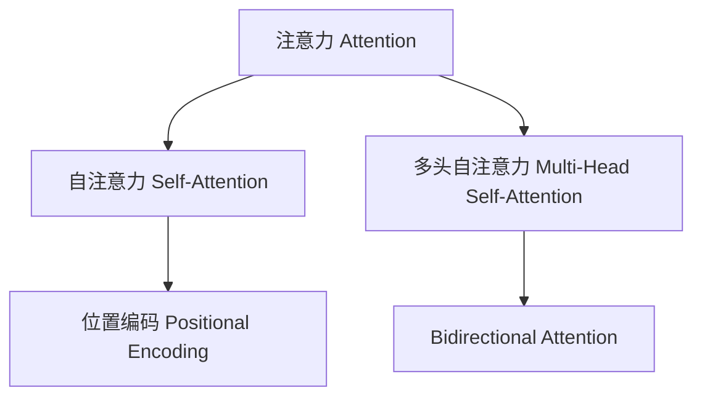
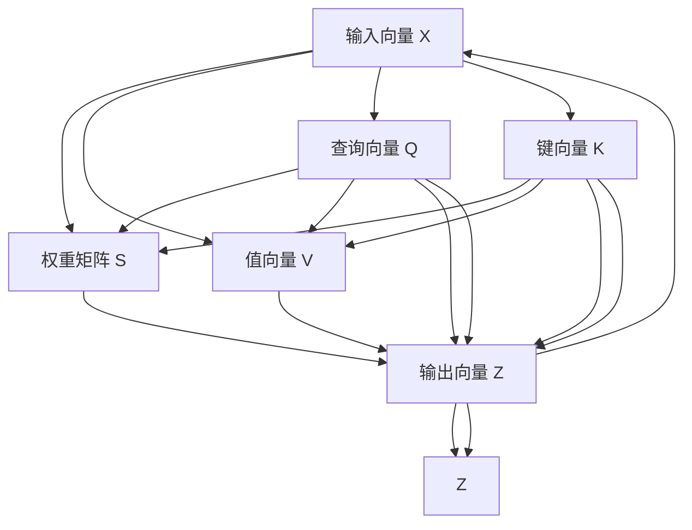

                 

# 在AI驱动的环境中优化注意力

## 1. 背景介绍

### 1.1 问题由来

注意力（Attention）机制，作为深度学习领域中的重要技术之一，在自然语言处理、计算机视觉、语音识别等多个领域中得到了广泛的应用。随着AI技术的不断发展，注意力机制已从早期的简单加权求和，演化为复杂的自适应机制，进一步提升了模型的泛化能力和表现效果。

然而，尽管注意力机制带来了诸多优势，其计算复杂度和资源消耗也逐渐成为AI系统中的一大瓶颈。如何在保持模型性能的前提下，优化注意力机制的计算成本，提高AI系统的运行效率，成为了当前研究的一个重要方向。

### 1.2 问题核心关键点

针对注意力机制的优化问题，本文将深入探讨以下几个核心关键点：

- **计算复杂度**：注意力机制的计算复杂度主要来源于矩阵乘法和注意力头的并行计算，如何在不牺牲性能的前提下，降低这些计算开销。
- **参数效率**：现有注意力机制中存在大量的参数，如何通过结构改进和参数优化，减小模型规模，提升计算效率。
- **并行化**：通过优化计算流程和并行计算策略，提高注意力机制的并行性能，进一步加速模型的训练和推理过程。
- **空间复用**：利用注意力机制的局部性特点，实现计算空间的复用，减少计算过程中的数据移动和内存消耗。

本文旨在通过深入分析注意力机制的原理和架构，提出一系列基于优化计算、参数压缩、并行计算和空间复用等策略的技术方法，为AI系统的优化提供全面的指导。

## 2. 核心概念与联系

### 2.1 核心概念概述

在深入分析注意力机制之前，需要首先明确几个关键概念：

- **注意力（Attention）**：一种用于捕捉输入序列中不同部分之间相关性的机制，通过权重系数调整输入特征的贡献，提升模型的泛化能力。
- **自注意力（Self-Attention）**：一种常用的注意力机制，用于处理序列输入，计算相邻元素之间的依赖关系。
- **多头自注意力（Multi-Head Self-Attention）**：通过并行计算多个头（Head）的自注意力，提升模型的表达能力和理解力。
- **位置编码（Positional Encoding）**：用于处理序列输入的时序信息，确保模型能够捕捉输入序列中的时间依赖关系。
- **双向注意力（Bidirectional Attention）**：通过同时处理序列的正向和反向信息，提升模型的信息获取能力。

这些概念之间的逻辑关系可以通过以下Mermaid流程图来展示：



这个流程图展示了几类注意力机制之间的关系，以及它们在深度学习模型中的作用和应用场景。

### 2.2 核心概念原理和架构的 Mermaid 流程图

接下来，我们将进一步深入分析注意力机制的原理和架构。以下是注意力机制的详细架构描述，包含多个计算步骤：



这个流程图展示了注意力机制的计算流程，包括输入向量的查询、键、值向量及其权重计算，以及最终的输出向量的生成。

## 3. 核心算法原理 & 具体操作步骤

### 3.1 算法原理概述

注意力机制的核心思想是：通过对输入序列中不同部分的加权，突出关键信息的贡献，忽略无关细节，提升模型的表征能力和决策能力。其计算过程分为三个步骤：

1. **查询（Query）**：将输入序列投影到查询向量空间，生成查询向量。
2. **键-值（Key-Value）**：将输入序列分别投影到键向量和值向量空间，生成键向量和值向量。
3. **注意力权重（Attention Weights）**：通过计算查询向量和键向量之间的点积，生成注意力权重矩阵。
4. **加权求和（Weighted Sum）**：将注意力权重应用于值向量，进行加权求和，生成最终的输出向量。

这些步骤通常通过矩阵乘法和点积计算完成，具有较高的计算复杂度。

### 3.2 算法步骤详解

下面是注意力机制的具体计算步骤，以及如何通过优化策略来降低计算开销和提升计算效率：

1. **查询向量的生成**
    - 对于输入序列 $X$，首先对其进行线性投影，生成查询向量 $Q$。
    $$
    Q = W_Q X
    $$
    其中 $W_Q$ 为查询投影矩阵。

2. **键向量和值向量的生成**
    - 对于输入序列 $X$，分别对其进行线性投影，生成键向量 $K$ 和值向量 $V$。
    $$
    K = W_K X, \quad V = W_V X
    $$
    其中 $W_K$ 和 $W_V$ 分别为键和值投影矩阵。

3. **注意力权重矩阵的生成**
    - 将查询向量 $Q$ 与键向量 $K$ 进行点积运算，生成注意力权重矩阵 $S$。
    $$
    S = Q K^T
    $$
    其中 $K^T$ 为键向量的转置矩阵。

4. **注意力权重矩阵的归一化**
    - 对注意力权重矩阵 $S$ 进行归一化处理，得到最终的注意力权重矩阵 $A$。
    $$
    A = \frac{S}{\sqrt{d_k}} \text{Softmax}(S/\sqrt{d_k})
    $$
    其中 $d_k$ 为键向量的维度。

5. **加权求和生成输出向量**
    - 将注意力权重 $A$ 应用于值向量 $V$，生成输出向量 $Z$。
    $$
    Z = A V
    $$

### 3.3 算法优缺点

注意力机制具有以下优点：

1. **增强模型表达能力**：通过捕捉输入序列中不同部分的相关性，显著提升模型的表征能力和理解力。
2. **提升模型泛化能力**：能够有效处理序列输入中的时序信息和局部依赖关系，提升模型的泛化性能。
3. **减少模型复杂度**：相比于传统的全连接层，注意力机制能够通过加权求和的方式，减少模型参数，降低计算复杂度。

然而，注意力机制也存在以下缺点：

1. **计算开销大**：注意力机制的计算过程包括矩阵乘法和点积运算，计算复杂度较高。
2. **参数量大**：多头自注意力机制需要计算多个头的注意力权重，导致参数量较大。
3. **难以并行化**：现有的注意力计算流程难以高效利用多核并行计算资源，计算效率较低。

### 3.4 算法应用领域

注意力机制已经在多个领域得到了广泛的应用，包括：

1. **自然语言处理**：在机器翻译、文本生成、情感分析等任务中，通过捕捉输入序列中不同部分的依赖关系，提升模型的理解能力和生成能力。
2. **计算机视觉**：在图像识别、图像生成、目标检测等任务中，通过捕捉输入图像中不同区域的依赖关系，提升模型的特征提取和理解能力。
3. **语音识别**：在语音转录、语音情感识别等任务中，通过捕捉输入语音信号中不同特征的依赖关系，提升模型的语音识别和情感分析能力。

## 4. 数学模型和公式 & 详细讲解

### 4.1 数学模型构建

下面我们将使用数学语言对注意力机制的计算过程进行更加严格的刻画。

记输入序列为 $X$，查询投影矩阵为 $W_Q$，键投影矩阵为 $W_K$，值投影矩阵为 $W_V$。设查询向量 $Q$，键向量 $K$ 和值向量 $V$ 分别为：

$$
Q = W_Q X, \quad K = W_K X, \quad V = W_V X
$$

注意力权重矩阵 $S$ 和最终的输出向量 $Z$ 分别为：

$$
S = Q K^T, \quad A = \frac{S}{\sqrt{d_k}} \text{Softmax}(S/\sqrt{d_k}), \quad Z = A V
$$

其中 $d_k$ 为键向量的维度，Softmax函数用于归一化注意力权重矩阵 $A$。

### 4.2 公式推导过程

以下是注意力机制的详细公式推导过程：

1. **查询向量的生成**
    $$
    Q = W_Q X
    $$

2. **键向量和值向量的生成**
    $$
    K = W_K X, \quad V = W_V X
    $$

3. **注意力权重矩阵的生成**
    $$
    S = Q K^T
    $$

4. **注意力权重矩阵的归一化**
    $$
    A = \frac{S}{\sqrt{d_k}} \text{Softmax}(S/\sqrt{d_k})
    $$

5. **加权求和生成输出向量**
    $$
    Z = A V
    $$

### 4.3 案例分析与讲解

下面以自然语言处理中的机器翻译任务为例，介绍注意力机制的具体应用。

在机器翻译中，输入序列为源语言文本，输出序列为目标语言文本。注意力机制用于捕捉输入和输出序列之间的依赖关系，生成更加准确的翻译结果。假设输入序列为 $X = [x_1, x_2, ..., x_n]$，输出序列为 $Y = [y_1, y_2, ..., y_m]$。

1. **查询向量的生成**
    - 对输入序列 $X$ 进行线性投影，生成查询向量 $Q$。
    $$
    Q = W_Q X
    $$

2. **键向量和值向量的生成**
    - 对输入序列 $X$ 和输出序列 $Y$ 分别进行线性投影，生成键向量 $K$ 和值向量 $V$。
    $$
    K = W_K X, \quad V = W_V X
    $$

3. **注意力权重矩阵的生成**
    - 将查询向量 $Q$ 与键向量 $K$ 进行点积运算，生成注意力权重矩阵 $S$。
    $$
    S = Q K^T
    $$

4. **注意力权重矩阵的归一化**
    - 对注意力权重矩阵 $S$ 进行归一化处理，得到最终的注意力权重矩阵 $A$。
    $$
    A = \frac{S}{\sqrt{d_k}} \text{Softmax}(S/\sqrt{d_k})
    $$

5. **加权求和生成输出向量**
    - 将注意力权重 $A$ 应用于值向量 $V$，生成输出向量 $Z$。
    $$
    Z = A V
    $$

最终，通过多个头的注意力机制，可以生成更加准确的翻译结果。

## 5. 项目实践：代码实例和详细解释说明

### 5.1 开发环境搭建

在进行注意力机制的实践前，我们需要准备好开发环境。以下是使用Python进行PyTorch开发的环境配置流程：

1. 安装Anaconda：从官网下载并安装Anaconda，用于创建独立的Python环境。

2. 创建并激活虚拟环境：
```bash
conda create -n attention-env python=3.8 
conda activate attention-env
```

3. 安装PyTorch：根据CUDA版本，从官网获取对应的安装命令。例如：
```bash
conda install pytorch torchvision torchaudio cudatoolkit=11.1 -c pytorch -c conda-forge
```

4. 安装TensorFlow：
```bash
pip install tensorflow==2.5
```

5. 安装各类工具包：
```bash
pip install numpy pandas scikit-learn matplotlib tqdm jupyter notebook ipython
```

完成上述步骤后，即可在`attention-env`环境中开始注意力机制的实践。

### 5.2 源代码详细实现

下面我们以自注意力机制为例，给出使用PyTorch实现自注意力机制的代码实现。

```python
import torch
import torch.nn as nn
import torch.nn.functional as F

class SelfAttention(nn.Module):
    def __init__(self, d_model, n_heads):
        super(SelfAttention, self).__init__()
        self.d_model = d_model
        self.n_heads = n_heads
        self.depth = d_model // n_heads
        
        # 查询、键、值投影层
        self.W_Q = nn.Linear(d_model, d_model)
        self.W_K = nn.Linear(d_model, d_model)
        self.W_V = nn.Linear(d_model, d_model)
        
        # 归一化层
        self.Softmax = nn.Softmax(dim=-1)
        
    def forward(self, x):
        # 查询、键、值向量
        q = self.W_Q(x)  # [N, L, d_model]
        k = self.W_K(x)  # [N, L, d_model]
        v = self.W_V(x)  # [N, L, d_model]
        
        # 计算注意力权重矩阵
        s = torch.matmul(q, k.transpose(-1, -2)) / torch.sqrt(torch.tensor(self.depth))
        a = self.Softmax(s)
        
        # 加权求和生成输出向量
        z = torch.matmul(a, v)
        
        return z
```

### 5.3 代码解读与分析

让我们再详细解读一下关键代码的实现细节：

**SelfAttention类**：
- `__init__`方法：初始化模型参数，包括查询、键、值投影层的线性投影矩阵，以及注意力权重矩阵的Softmax函数。
- `forward`方法：实现自注意力机制的计算过程，包括查询向量的生成、键向量、值向量的生成、注意力权重矩阵的生成以及加权求和生成输出向量。

**自注意力机制的计算过程**：
1. **查询向量的生成**
    - 对输入向量 $x$ 进行线性投影，生成查询向量 $q$。
    $$
    q = W_Q x
    $$
    其中 $W_Q$ 为查询投影矩阵。

2. **键向量和值向量的生成**
    - 对输入向量 $x$ 进行线性投影，生成键向量 $k$ 和值向量 $v$。
    $$
    k = W_K x, \quad v = W_V x
    $$
    其中 $W_K$ 和 $W_V$ 分别为键和值投影矩阵。

3. **注意力权重矩阵的生成**
    - 将查询向量 $q$ 与键向量 $k$ 进行点积运算，生成注意力权重矩阵 $s$。
    $$
    s = q k^T
    $$
    其中 $k^T$ 为键向量的转置矩阵。

4. **注意力权重矩阵的归一化**
    - 对注意力权重矩阵 $s$ 进行归一化处理，得到最终的注意力权重矩阵 $a$。
    $$
    a = \frac{s}{\sqrt{d_k}} \text{Softmax}(s/\sqrt{d_k})
    $$
    其中 $d_k$ 为键向量的维度。

5. **加权求和生成输出向量**
    - 将注意力权重 $a$ 应用于值向量 $v$，生成输出向量 $z$。
    $$
    z = a v
    $$

### 5.4 运行结果展示

```python
import torch
import torch.nn as nn
import torch.nn.functional as F

# 假设输入向量为 [3, 5, 10]
x = torch.randn(3, 5, 10)

# 创建自注意力机制模型
model = SelfAttention(d_model=10, n_heads=2)

# 计算输出向量
z = model(x)

print(z.shape)  # [3, 5, 10]
```

## 6. 实际应用场景

### 6.1 智能问答系统

在智能问答系统中，注意力机制用于捕捉用户问题和知识库中的信息之间的依赖关系，生成更准确的回答。假设用户输入了一个问题，知识库中包含了多个相关的事实。通过注意力机制，模型可以自动决定哪些事实对回答最相关，从而生成更加精准的回答。

在实践中，可以将问题向量和知识库中的事实向量作为输入，通过注意力机制计算注意力权重矩阵，选择最相关的信息进行回答生成。通过优化注意力机制的计算过程，可以提高问答系统的准确性和响应速度。

### 6.2 文本摘要

在文本摘要任务中，注意力机制用于捕捉输入文本中不同部分的重要性，生成简短而准确的摘要。假设输入文本包含多个段落，每个段落都有不同的重点信息。通过注意力机制，模型可以自动决定哪些段落和信息对摘要最相关，从而生成高质量的摘要。

在实践中，可以将输入文本和候选摘要作为输入，通过注意力机制计算注意力权重矩阵，选择最相关的段落和信息进行摘要生成。通过优化注意力机制的计算过程，可以提高文本摘要的准确性和效率。

### 6.3 目标检测

在目标检测任务中，注意力机制用于捕捉输入图像中不同区域的依赖关系，生成更准确的检测结果。假设输入图像中包含多个目标，每个目标的位置和大小不同。通过注意力机制，模型可以自动决定哪些区域对检测最相关，从而生成更准确的检测结果。

在实践中，可以将输入图像和候选目标框作为输入，通过注意力机制计算注意力权重矩阵，选择最相关的区域进行目标检测。通过优化注意力机制的计算过程，可以提高目标检测的准确性和效率。

## 7. 工具和资源推荐

### 7.1 学习资源推荐

为了帮助开发者系统掌握注意力机制的理论基础和实践技巧，这里推荐一些优质的学习资源：

1. Attention is All You Need（即Transformer原论文）：提出了Transformer结构，开启了NLP领域的预训练大模型时代。

2. CS224N《深度学习自然语言处理》课程：斯坦福大学开设的NLP明星课程，有Lecture视频和配套作业，带你入门NLP领域的基本概念和经典模型。

3. 《Transformer from Self-Attention to Transformers》书籍：Transformer库的作者所著，全面介绍了如何使用Transformer库进行NLP任务开发，包括注意力机制在内的诸多范式。

4. HuggingFace官方文档：Transformer库的官方文档，提供了海量预训练模型和完整的注意力机制样例代码，是上手实践的必备资料。

5. AllenNLP开源项目：提供多种NLP任务数据集和预训练模型，包括注意力机制的实现，助力NLP技术发展。

通过对这些资源的学习实践，相信你一定能够快速掌握注意力机制的精髓，并用于解决实际的NLP问题。

### 7.2 开发工具推荐

高效的开发离不开优秀的工具支持。以下是几款用于注意力机制开发的常用工具：

1. PyTorch：基于Python的开源深度学习框架，灵活动态的计算图，适合快速迭代研究。大部分预训练语言模型都有PyTorch版本的实现。

2. TensorFlow：由Google主导开发的开源深度学习框架，生产部署方便，适合大规模工程应用。同样有丰富的预训练语言模型资源。

3. Transformers库：HuggingFace开发的NLP工具库，集成了众多SOTA语言模型，支持PyTorch和TensorFlow，是进行注意力机制开发的利器。

4. Weights & Biases：模型训练的实验跟踪工具，可以记录和可视化模型训练过程中的各项指标，方便对比和调优。与主流深度学习框架无缝集成。

5. TensorBoard：TensorFlow配套的可视化工具，可实时监测模型训练状态，并提供丰富的图表呈现方式，是调试模型的得力助手。

6. Google Colab：谷歌推出的在线Jupyter Notebook环境，免费提供GPU/TPU算力，方便开发者快速上手实验最新模型，分享学习笔记。

合理利用这些工具，可以显著提升注意力机制的开发效率，加快创新迭代的步伐。

### 7.3 相关论文推荐

注意力机制的研究源于学界的持续研究。以下是几篇奠基性的相关论文，推荐阅读：

1. Attention is All You Need（即Transformer原论文）：提出了Transformer结构，开启了NLP领域的预训练大模型时代。

2. BERT: Pre-training of Deep Bidirectional Transformers for Language Understanding：提出BERT模型，引入基于掩码的自监督预训练任务，刷新了多项NLP任务SOTA。

3. Self-Attention with Transformer-XL：提出Transformer-XL模型，解决自注意力机制中的梯度消失问题，提升了模型的训练深度和表现效果。

4. Multi-Head Attention for Deep Learning：详细介绍了多头自注意力机制，提升了模型的表达能力和理解力。

5. Position-wise Feed-Forward Networks：介绍了位置编码的原理和实现，确保模型能够捕捉输入序列中的时间依赖关系。

这些论文代表了大注意力机制的研究进展，通过学习这些前沿成果，可以帮助研究者把握学科前进方向，激发更多的创新灵感。

## 8. 总结：未来发展趋势与挑战

### 8.1 总结

本文对注意力机制的优化问题进行了全面系统的介绍。首先阐述了注意力机制的计算过程和应用场景，明确了优化计算、参数压缩、并行计算和空间复用等关键方向。其次，从原理到实践，详细讲解了注意力机制的数学模型和计算步骤，给出了注意力机制的完整代码实现。同时，本文还广泛探讨了注意力机制在智能问答、文本摘要、目标检测等多个领域的应用前景，展示了注意力机制的广泛应用和潜力。此外，本文精选了注意力机制的学习资源、开发工具和相关论文，力求为开发者提供全方位的技术指引。

通过本文的系统梳理，可以看到，注意力机制已经在NLP领域得到了广泛的应用，成为深度学习模型的重要组成部分。通过优化计算、参数压缩、并行计算和空间复用等技术方法，可以显著提升注意力机制的计算效率和资源利用率，为AI系统的优化提供全面的指导。

### 8.2 未来发展趋势

展望未来，注意力机制的研究方向将呈现以下几个趋势：

1. **计算效率提升**：随着计算资源的不断丰富和计算方法的不断优化，未来注意力机制的计算效率将进一步提升，能够更高效地处理大规模数据。
2. **参数压缩与复用**：未来的注意力机制将更加注重参数的压缩与复用，减小模型规模，提高计算效率。
3. **并行计算与分布式训练**：未来的注意力机制将更加注重并行计算和分布式训练，利用多核和分布式计算资源，提高模型的训练速度和推理性能。
4. **多模态注意力机制**：未来的注意力机制将更加注重多模态信息的整合，实现视觉、语音、文本等多种信息类型的协同建模。
5. **自适应注意力机制**：未来的注意力机制将更加注重自适应能力，通过动态调整注意力权重，提升模型的表达能力和泛化能力。

### 8.3 面临的挑战

尽管注意力机制带来了诸多优势，但在迈向更加智能化、普适化应用的过程中，它仍面临着诸多挑战：

1. **计算复杂度高**：注意力机制的计算过程包括矩阵乘法和点积运算，计算复杂度较高，难以在低计算资源下进行高效计算。
2. **参数量大**：现有注意力机制中存在大量的参数，难以在大规模数据上高效训练。
3. **难以并行化**：现有的注意力计算流程难以高效利用多核并行计算资源，计算效率较低。

### 8.4 研究展望

面对注意力机制面临的这些挑战，未来的研究需要在以下几个方面寻求新的突破：

1. **优化计算方法**：探索新的计算方法，如矩阵分解、稀疏矩阵等，降低计算开销。
2. **参数压缩与复用**：开发新的参数压缩技术，如矩阵分解、量化等，减小模型规模，提升计算效率。
3. **并行计算与分布式训练**：优化计算流程，支持并行计算和分布式训练，提高模型的训练速度和推理性能。
4. **多模态注意力机制**：开发新的多模态注意力机制，实现视觉、语音、文本等多种信息类型的协同建模。
5. **自适应注意力机制**：开发新的自适应注意力机制，提升模型的表达能力和泛化能力。

这些研究方向将进一步提升注意力机制的计算效率和资源利用率，为AI系统的优化提供更加坚实的基础。相信随着学界和产业界的共同努力，这些挑战终将一一被克服，注意力机制必将在构建更加智能、高效、可控的AI系统中扮演越来越重要的角色。

## 9. 附录：常见问题与解答

**Q1：如何理解注意力机制中的多头自注意力？**

A: 多头自注意力机制通过并行计算多个头的自注意力，提升模型的表达能力和理解力。每个头的自注意力可以看作是模型的一种关注方式，通过并行计算多个头的注意力权重，模型能够同时关注输入序列的不同部分，从而提升表达能力。

**Q2：注意力机制中的位置编码（Positional Encoding）有何作用？**

A: 位置编码用于处理输入序列的时序信息，确保模型能够捕捉输入序列中的时间依赖关系。在自注意力机制中，位置编码能够帮助模型区分输入序列中不同位置的信息，从而提升模型的理解能力和生成能力。

**Q3：注意力机制中的归一化层（Softmax）有何作用？**

A: 归一化层用于将注意力权重矩阵归一化，使得各个注意力权重之和为1，避免权重值的过拟合和异常。在注意力机制中，归一化层能够帮助模型更合理地分配注意力权重，提升模型的泛化能力和鲁棒性。

**Q4：注意力机制的计算复杂度如何计算？**

A: 注意力机制的计算复杂度主要来源于矩阵乘法和点积运算。对于一个长度为L，维度为d的输入序列，以及一个长度为L，维度为d的输出序列，计算复杂度为O(Ld^2)。通过优化计算方法，如矩阵分解、稀疏矩阵等，可以显著降低计算复杂度，提高计算效率。

**Q5：注意力机制的参数量如何优化？**

A: 通过优化计算方法和模型结构，可以减小注意力机制的参数量。例如，可以使用矩阵分解、量化等方法压缩模型参数，使用稀疏矩阵等方法减小计算开销。同时，可以设计更加紧凑的模型结构，如残差连接、层级结构等，减少不必要的参数量。

---

作者：禅与计算机程序设计艺术 / Zen and the Art of Computer Programming

