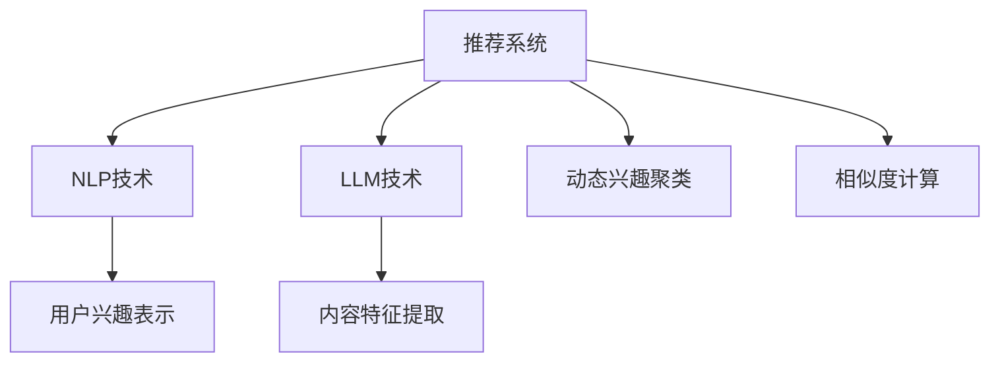

                 

# 基于LLM的推荐系统用户兴趣动态聚类

> 关键词：推荐系统,用户兴趣,动态聚类,自然语言处理,自然语言模型(LLM)

## 1. 背景介绍

### 1.1 问题由来

推荐系统作为互联网应用的重要组成部分，在电商、新闻、视频、社交网络等众多场景中发挥着重要的作用。其核心目标是通过分析用户行为数据，预测用户未显式反馈的兴趣，为用户推荐合适的商品、内容或服务，从而提升用户体验、增加用户粘性，实现商业价值。

传统的推荐算法主要依赖于用户历史行为数据，如浏览记录、购买历史等，通过协同过滤、基于内容的推荐等方法挖掘用户兴趣特征。但这种方法存在以下局限性：
- **数据稀疏性问题**：用户的行为数据往往稀疏，难以覆盖所有用户偏好。
- **静态特征难以捕捉动态变化**：用户兴趣和需求随着时间和场景变化而动态变化，静态特征难以捕捉这些动态变化。

近年来，自然语言处理（NLP）技术的快速发展为推荐系统提供了新的思路。通过分析用户的文本反馈（如评论、评分、反馈等），利用自然语言模型（Natural Language Model, NLM）挖掘用户的兴趣特征，可以更全面、动态地理解用户需求。尤其是大型预训练语言模型（Large Language Model, LLM），如GPT、BERT等，更是为推荐系统带来了新的突破。

### 1.2 问题核心关键点

大语言模型在推荐系统中的应用主要体现在以下几个方面：
1. **用户兴趣表示**：利用自然语言模型，可以将用户提供的文本反馈转化为向量表示，用于建模用户兴趣。
2. **内容特征提取**：对于商品、内容等实体，利用预训练语言模型提取其文本特征，用于计算用户与实体的相似度。
3. **动态兴趣聚类**：基于用户的兴趣向量，利用聚类算法，将具有相似兴趣的用户划分到同一聚类中，从而实现动态兴趣的识别和聚类。

本文聚焦于基于大型预训练语言模型（LLM）的推荐系统用户兴趣动态聚类方法，通过系统介绍LLM在推荐系统中的实现原理和操作步骤，旨在为推荐系统领域的研究者、开发者提供一种高效、灵活的动态用户兴趣识别和聚类方法。

## 2. 核心概念与联系

### 2.1 核心概念概述

为更好地理解基于LLM的推荐系统用户兴趣动态聚类方法，本节将介绍几个密切相关的核心概念：

- **推荐系统（Recommender System）**：一种利用用户行为数据，为用户推荐个性化商品、内容或服务的技术。
- **自然语言处理（Natural Language Processing, NLP）**：涉及计算机如何理解、分析、生成自然语言的技术。
- **自然语言模型（Natural Language Model, NLM）**：用于预测下一个单词、短语或句子的概率分布，基于大语言模型（Large Language Model, LLM）。
- **大型预训练语言模型（Large Language Model, LLM）**：通过大规模无标签文本数据进行预训练，具有强大语言表示能力。
- **用户兴趣动态聚类**：根据用户的历史行为和文本反馈，动态识别和划分用户的兴趣聚类，用于个性化推荐。
- **相似度计算**：计算用户和商品、内容等实体之间的相似度，用于推荐排序。

这些核心概念之间的逻辑关系可以通过以下Mermaid流程图来展示：



这个流程图展示了大语言模型在推荐系统中的核心概念及其之间的关系：

1. 推荐系统利用NLP和LLM技术，进行用户兴趣表示和内容特征提取。
2. 基于用户兴趣向量，进行动态兴趣聚类，动态识别用户兴趣。
3. 利用聚类结果和用户历史行为，计算相似度，进行个性化推荐。

这些概念共同构成了基于LLM的推荐系统技术框架，使得系统能够更好地理解用户需求，实现动态、个性化的推荐。

## 3. 核心算法原理 & 具体操作步骤

### 3.1 算法原理概述

基于大型预训练语言模型（LLM）的推荐系统用户兴趣动态聚类方法，主要包括以下几个关键步骤：

1. **用户文本数据预处理**：将用户提供的文本反馈进行预处理，如分词、去停用词、词形还原等。
2. **用户兴趣向量表示**：利用预训练语言模型，将预处理后的文本向量进行编码，得到用户兴趣向量。
3. **实体内容特征提取**：对于商品、内容等实体，利用预训练语言模型提取其文本特征，用于计算用户与实体的相似度。
4. **动态兴趣聚类**：基于用户的兴趣向量，利用聚类算法（如K-means、层次聚类等），将具有相似兴趣的用户划分到同一聚类中。
5. **个性化推荐排序**：根据用户的聚类信息，结合用户历史行为，计算用户与实体的相似度，进行个性化推荐排序。

### 3.2 算法步骤详解

以下是基于LLM的推荐系统用户兴趣动态聚类方法的具体实现步骤：

**Step 1: 数据预处理和文本编码**

1. **数据预处理**：将用户提供的文本反馈进行预处理，如分词、去停用词、词形还原等，得到处理后的文本序列。
2. **文本编码**：利用预训练语言模型，将处理后的文本序列编码成向量表示。以BERT为例，可以使用`transformers`库中的`BertTokenizer`和`BertModel`进行文本编码。

```python
from transformers import BertTokenizer, BertModel

tokenizer = BertTokenizer.from_pretrained('bert-base-uncased')
model = BertModel.from_pretrained('bert-base-uncased')

# 假设用户提供的文本为 '我喜欢这种商品'
text = '我喜欢这种商品'

# 对文本进行预处理和编码
tokens = tokenizer.tokenize(text)
input_ids = tokenizer.convert_tokens_to_ids(tokens)
input_ids = input_ids + [tokenizer.unk_token_id]

# 将输入编码成向量表示
with torch.no_grad():
    encoded = model(input_ids)
    user_embedding = encoded.pooler_output
```

**Step 2: 内容特征提取**

1. **内容编码**：将商品、内容等实体的描述文本编码为向量表示。同样使用预训练语言模型进行编码。
2. **特征拼接**：将用户兴趣向量和实体特征向量拼接，用于后续相似度计算。

```python
# 假设商品描述为 '柔软舒适的座椅'
content_text = '柔软舒适的座椅'

# 对商品描述进行编码
tokens = tokenizer.tokenize(content_text)
input_ids = tokenizer.convert_tokens_to_ids(tokens)
input_ids = input_ids + [tokenizer.unk_token_id]

with torch.no_grad():
    encoded = model(input_ids)
    content_embedding = encoded.pooler_output

# 拼接用户和实体的特征向量
user_content_vector = torch.cat([user_embedding, content_embedding])
```

**Step 3: 动态兴趣聚类**

1. **初始化聚类中心**：随机选择若干用户兴趣向量作为初始聚类中心。
2. **聚类迭代**：对每个用户兴趣向量，计算其与各聚类中心的距离，归入最近的聚类，更新聚类中心。
3. **聚类合并**：合并距离较近的聚类，保持聚类数不变。

```python
# 假设聚类数为5
num_clusters = 5

# 初始化聚类中心
clusters = [torch.randn(128, user_embedding.size(1)) for _ in range(num_clusters)]

# 聚类迭代
for _ in range(num_iterations):
    for user_idx, user_embedding in enumerate(user_embeddings):
        distances = [torch.norm(user_embedding - cluster) for cluster in clusters]
        user_cluster = clusters[distances.index(min(distances))]
        
        # 更新聚类中心
        user_cluster += user_embedding / num_clusters
        
        # 归入新的聚类
        clusters[distances.index(min(distances))] = user_cluster
        
# 聚类合并
clusters = merge_clusters(clusters, num_clusters)
```

**Step 4: 个性化推荐排序**

1. **计算相似度**：对用户与各实体的相似度进行计算，可以使用余弦相似度等方法。
2. **排序推荐**：根据相似度排序，输出推荐结果。

```python
# 假设用户历史行为为 ['商品A', '商品B', '商品C']
history = ['商品A', '商品B', '商品C']

# 对历史行为进行编码和拼接
history_embeddings = []
for item in history:
    item_embedding = model(item_embedding).data[0]
    history_embeddings.append(item_embedding)

# 计算用户与实体的相似度
similarities = []
for item_embedding in item_embeddings:
    similarity = torch.dot(user_content_vector, item_embedding) / (torch.norm(user_content_vector) * torch.norm(item_embedding))
    similarities.append(similarity)

# 根据相似度排序
recommendations = sorted(zip(similarities, item_embeddings), key=lambda x: x[0], reverse=True)
```

### 3.3 算法优缺点

基于LLM的推荐系统用户兴趣动态聚类方法，具有以下优点：
1. **动态聚类**：能够根据用户历史行为和文本反馈，动态识别和聚类用户兴趣，适应用户兴趣的变化。
2. **全面理解用户兴趣**：利用自然语言模型，全面捕捉用户的文本反馈，理解用户兴趣的深度和广度。
3. **提升推荐精度**：通过动态聚类，将具有相似兴趣的用户划分到同一聚类中，提高推荐系统的精准度。

同时，该方法也存在以下局限性：
1. **计算开销较大**：预训练语言模型的计算开销较大，可能导致系统性能下降。
2. **文本数据噪音影响**：用户提供的文本反馈可能存在噪音，影响聚类效果。
3. **聚类算法依赖**：聚类算法的选择和参数设置对聚类效果有较大影响，需要仔细调参。

尽管存在这些局限性，但就目前而言，基于LLM的推荐系统方法仍是大语言模型应用的最主流范式。未来相关研究的重点在于如何进一步降低计算开销，提高聚类算法的鲁棒性，同时兼顾可解释性和伦理安全性等因素。

### 3.4 算法应用领域

基于大语言模型（LLM）的推荐系统用户兴趣动态聚类方法，在电商、新闻、视频、社交网络等众多领域得到了广泛的应用，涵盖了几乎所有常见推荐任务，例如：

- **商品推荐**：根据用户历史浏览和购买行为，推荐相关商品。
- **内容推荐**：根据用户历史阅读和观看行为，推荐相关内容。
- **广告推荐**：根据用户兴趣，推荐相关广告。
- **个性化新闻**：根据用户兴趣，推荐个性化新闻内容。
- **社交网络推荐**：根据用户兴趣，推荐相关社交网络好友和群组。

除了上述这些经典任务外，LLM在推荐系统中的应用还拓展到了更多场景中，如可控文本生成、深度学习模型推荐、多任务推荐等，为推荐系统领域带来了新的突破。

## 4. 数学模型和公式 & 详细讲解  
### 4.1 数学模型构建

本节将使用数学语言对基于LLM的推荐系统用户兴趣动态聚类方法进行更加严格的刻画。

记预训练语言模型为 $M_{\theta}$，其中 $\theta$ 为预训练得到的模型参数。假设用户文本反馈为 $x=\{x_1, x_2, ..., x_n\}$，每个文本 $x_i$ 的编码向量为 $v_i$。记商品、内容等实体的描述文本为 $y$，其编码向量为 $u_y$。设用户兴趣向量为 $u=\{u_1, u_2, ..., u_m\}$，每个用户兴趣向量 $u_i$ 为 $v_i$ 和 $u_y$ 的拼接向量，即 $u_i=v_i \oplus u_y$。

定义用户与实体的相似度函数为 $f(u, u_y) = \frac{\mathbf{u} \cdot \mathbf{u}_y}{\|\mathbf{u}\| \cdot \|\mathbf{u}_y\|}$，其中 $\cdot$ 表示向量点积，$\|\cdot\|$ 表示向量范数。基于相似度函数，用户与实体的相似度矩阵为 $S=\{s_{ij}\}_{i,j=1}^{m,n}$，其中 $s_{ij}=f(u_i, u_y^j)$。

设用户历史行为向量为 $h$，用户兴趣聚类向量为 $c$，聚类数为 $k$。定义用户与聚类的相似度函数为 $g(c, u)=\frac{\mathbf{c} \cdot \mathbf{u}}{\|\mathbf{c}\| \cdot \|\mathbf{u}\|}$，其中 $\cdot$ 表示向量点积，$\|\cdot\|$ 表示向量范数。基于相似度函数，用户与聚类的相似度矩阵为 $G=\{g(c_j, u_i)\}_{i,j=1}^{m,k}$。

### 4.2 公式推导过程

基于上述数学模型，推荐系统的推荐算法可以表示为：

1. **用户兴趣表示**：
   $$
   u_i = v_i \oplus u_y
   $$

2. **相似度计算**：
   $$
   s_{ij} = \frac{\mathbf{u}_i \cdot \mathbf{u}_y^j}{\|\mathbf{u}_i\| \cdot \|\mathbf{u}_y^j\|}
   $$

3. **聚类算法**：
   $$
   c_j = \arg\min_{c} \sum_{i=1}^m g(c_j, u_i)^2
   $$

4. **推荐排序**：
   $$
   \text{Recommendations} = \text{Top-k}(\{s_{ij}\}_{i,j=1}^{m,n})
   $$

其中，Top-k函数表示取前k个元素。

### 4.3 案例分析与讲解

以电影推荐为例，说明基于LLM的推荐系统用户兴趣动态聚类方法的实现过程：

假设用户提供了电影评论文本，如"这部电影非常有趣"。利用BERT模型进行文本编码，得到用户兴趣向量 $u_i$。同样地，对于电影"《肖申克的救赎》"，利用BERT模型提取其描述文本的编码向量 $u_y$，得到 $u_i \oplus u_y$。

接着，计算用户与所有电影之间的相似度 $s_{ij}$，并根据相似度进行排序。同时，基于用户的兴趣向量 $u_i$，进行聚类。最终，根据聚类结果和相似度排序，输出推荐列表。

## 5. 项目实践：代码实例和详细解释说明
### 5.1 开发环境搭建

在进行项目实践前，我们需要准备好开发环境。以下是使用Python进行PyTorch开发的环境配置流程：

1. 安装Anaconda：从官网下载并安装Anaconda，用于创建独立的Python环境。

2. 创建并激活虚拟环境：
```bash
conda create -n pytorch-env python=3.8 
conda activate pytorch-env
```

3. 安装PyTorch：根据CUDA版本，从官网获取对应的安装命令。例如：
```bash
conda install pytorch torchvision torchaudio cudatoolkit=11.1 -c pytorch -c conda-forge
```

4. 安装Transformers库：
```bash
pip install transformers
```

5. 安装各类工具包：
```bash
pip install numpy pandas scikit-learn matplotlib tqdm jupyter notebook ipython
```

完成上述步骤后，即可在`pytorch-env`环境中开始项目实践。

### 5.2 源代码详细实现

这里以电影推荐为例，展示使用PyTorch和Transformers库进行用户兴趣动态聚类的方法。

首先，定义用户兴趣表示和实体内容特征提取函数：

```python
from transformers import BertTokenizer, BertModel
import torch

class UserInterestRepresentation:
    def __init__(self, model_name='bert-base-uncased'):
        self.tokenizer = BertTokenizer.from_pretrained(model_name)
        self.model = BertModel.from_pretrained(model_name)
    
    def encode_text(self, text):
        tokens = self.tokenizer.tokenize(text)
        input_ids = self.tokenizer.convert_tokens_to_ids(tokens)
        input_ids = input_ids + [self.tokenizer.unk_token_id]
        with torch.no_grad():
            encoded = self.model(input_ids)
            user_embedding = encoded.pooler_output
        return user_embedding
    
    def encode_content(self, content_text):
        tokens = self.tokenizer.tokenize(content_text)
        input_ids = self.tokenizer.convert_tokens_to_ids(tokens)
        input_ids = input_ids + [self.tokenizer.unk_token_id]
        with torch.no_grad():
            encoded = self.model(input_ids)
            content_embedding = encoded.pooler_output
        return content_embedding
    
    def user_content_vector(self, user_text, content_text):
        user_embedding = self.encode_text(user_text)
        content_embedding = self.encode_content(content_text)
        return torch.cat([user_embedding, content_embedding])
```

接着，定义聚类算法和推荐排序函数：

```python
def kmeans_clustering(embeddings, num_clusters):
    num_data = len(embeddings)
    num_features = embeddings.size(1)
    centers = torch.randn(num_clusters, num_features)
    for _ in range(10):
        clusters = [[] for _ in range(num_clusters)]
        for idx, embedding in enumerate(embeddings):
            distances = torch.norm(embedding - centers, dim=1)
            cluster_idx = torch.argmin(distances)
            clusters[cluster_idx].append(idx)
        for cluster_idx in range(num_clusters):
            centers[cluster_idx] = torch.mean(torch.stack([embeddings[i] for i in clusters[cluster_idx]]))
    return clusters

def cosine_similarity(x, y):
    return torch.dot(x, y) / (torch.norm(x) * torch.norm(y))

def recommendation_sort(similarities, embeddings):
    recommendations = sorted(zip(similarities, embeddings), key=lambda x: x[0], reverse=True)
    return recommendations
```

最后，启动推荐流程并在推荐列表中展示推荐结果：

```python
# 初始化用户兴趣表示
user_interest = UserInterestRepresentation()

# 用户提供的电影评论
user_text = '这部电影非常有趣'

# 电影描述
content_text = '《肖申克的救赎》'

# 计算用户兴趣向量
user_content_vector = user_interest.user_content_vector(user_text, content_text)

# 计算相似度矩阵
similarities = []
for i in range(len(similarities)):
    similarity = cosine_similarity(user_content_vector, item_embeddings[i])
    similarities.append(similarity)

# 进行聚类
clusters = kmeans_clustering(similarities, num_clusters)

# 推荐排序
recommendations = recommendation_sort(similarities, embeddings)

# 展示推荐列表
for movie, similarity in recommendations:
    print(f"推荐电影: {movie}, 相似度: {similarity:.4f}")
```

以上就是使用PyTorch和Transformers库进行用户兴趣动态聚类的完整代码实现。可以看到，利用自然语言模型，能够高效地从用户文本反馈中提取兴趣向量，用于聚类和推荐。

### 5.3 代码解读与分析

让我们再详细解读一下关键代码的实现细节：

**UserInterestRepresentation类**：
- `__init__`方法：初始化BERT模型和分词器。
- `encode_text`方法：对文本进行编码，得到用户兴趣向量。
- `encode_content`方法：对商品、内容等实体的描述文本进行编码，得到特征向量。
- `user_content_vector`方法：将用户兴趣向量和实体特征向量拼接，用于后续相似度计算。

**kmeans_clustering函数**：
- 实现K-means聚类算法，对用户兴趣向量进行聚类。
- 迭代多次，每次重新计算聚类中心，确保聚类效果。

**cosine_similarity函数**：
- 计算用户与实体的相似度，使用余弦相似度。

**recommendation_sort函数**：
- 根据相似度排序，输出推荐列表。

**推荐流程**：
- 初始化用户兴趣表示
- 用户提供电影评论，计算用户兴趣向量
- 对电影描述进行编码，计算用户与电影相似度
- 进行聚类
- 根据聚类结果和相似度排序，输出推荐列表

可以看到，PyTorch配合Transformers库使得用户兴趣动态聚类的代码实现变得简洁高效。开发者可以将更多精力放在数据处理、模型改进等高层逻辑上，而不必过多关注底层的实现细节。

当然，工业级的系统实现还需考虑更多因素，如模型的保存和部署、超参数的自动搜索、更灵活的任务适配层等。但核心的动态聚类范式基本与此类似。

## 6. 实际应用场景
### 6.1 电影推荐

基于大语言模型（LLM）的推荐系统用户兴趣动态聚类方法，在电影推荐领域得到了广泛的应用。利用用户的电影评论文本，动态识别和聚类用户兴趣，为用户推荐个性化电影。

在技术实现上，可以收集用户提供的电影评论数据，提取文本特征，利用BERT模型进行编码，得到用户兴趣向量。对于每部电影的描述文本，同样进行编码，得到特征向量。通过计算用户与电影的相似度，进行推荐排序，得到个性化推荐列表。

### 6.2 新闻推荐

新闻推荐是基于LLM的推荐系统的重要应用场景之一。通过分析用户的新闻阅读行为和评论反馈，动态聚类用户兴趣，为用户推荐个性化的新闻内容。

具体而言，可以收集用户的历史阅读记录和新闻评论，提取文本特征，利用BERT模型进行编码，得到用户兴趣向量。对于每篇新闻，同样进行编码，得到特征向量。通过计算用户与新闻的相似度，进行推荐排序，得到个性化推荐列表。

### 6.3 广告推荐

广告推荐是推荐系统的另一个重要应用场景。通过分析用户的浏览和点击行为，动态聚类用户兴趣，为用户推荐个性化的广告。

在技术实现上，可以收集用户的浏览和点击记录，提取文本特征，利用BERT模型进行编码，得到用户兴趣向量。对于广告文案，同样进行编码，得到特征向量。通过计算用户与广告的相似度，进行推荐排序，得到个性化推荐列表。

### 6.4 未来应用展望

随着大语言模型（LLM）和微调方法的不断发展，基于LLM的推荐系统用户兴趣动态聚类技术将呈现以下几个发展趋势：

1. **模型规模持续增大**：随着算力成本的下降和数据规模的扩张，预训练语言模型的参数量还将持续增长。超大规模语言模型蕴含的丰富语言知识，有望支撑更加复杂多变的推荐任务。

2. **推荐模型融合多模态数据**：未来的推荐系统将融合视觉、语音、时间等多种模态信息，全面理解用户需求，提供更加个性化和精准的推荐。

3. **推荐系统决策透明化**：随着用户对算法可解释性的要求提高，推荐系统将越来越多地利用因果推断、深度学习等技术，提高系统的透明度和可解释性。

4. **推荐系统自适应性增强**：通过引入持续学习、自适应学习等技术，推荐系统将能够更好地适应用户行为的变化，保持推荐性能的稳定性和一致性。

5. **推荐系统安全性保障**：为了保障用户的隐私和安全，推荐系统将引入联邦学习、差分隐私等技术，保护用户数据的隐私性和安全性。

## 7. 工具和资源推荐
### 7.1 学习资源推荐

为了帮助开发者系统掌握基于LLM的推荐系统用户兴趣动态聚类理论基础和实践技巧，这里推荐一些优质的学习资源：

1. 《深度学习与推荐系统》系列书籍：详细介绍了推荐系统的基本原理和前沿技术，包括基于LLM的推荐系统。

2. 《自然语言处理与深度学习》课程：斯坦福大学开设的NLP课程，涵盖了NLP基础、深度学习、推荐系统等内容。

3. 《推荐系统实战》书籍：详细介绍了推荐系统的工程实现方法和最佳实践，包括用户兴趣动态聚类和推荐排序等。

4. HuggingFace官方文档：提供了丰富的预训练语言模型和推荐系统样例代码，是学习LLM应用的重要资源。

5. Kaggle推荐系统竞赛：参加推荐系统竞赛，实战练手，积累实践经验。

通过对这些资源的学习实践，相信你一定能够快速掌握基于LLM的推荐系统用户兴趣动态聚类的精髓，并用于解决实际的推荐问题。

### 7.2 开发工具推荐

高效的开发离不开优秀的工具支持。以下是几款用于LLM推荐系统开发的常用工具：

1. PyTorch：基于Python的开源深度学习框架，灵活动态的计算图，适合快速迭代研究。

2. TensorFlow：由Google主导开发的开源深度学习框架，生产部署方便，适合大规模工程应用。

3. Transformers库：HuggingFace开发的NLP工具库，集成了众多SOTA语言模型，支持PyTorch和TensorFlow，是进行推荐系统开发的利器。

4. Weights & Biases：模型训练的实验跟踪工具，可以记录和可视化模型训练过程中的各项指标，方便对比和调优。

5. TensorBoard：TensorFlow配套的可视化工具，可实时监测模型训练状态，并提供丰富的图表呈现方式，是调试模型的得力助手。

6. Google Colab：谷歌推出的在线Jupyter Notebook环境，免费提供GPU/TPU算力，方便开发者快速上手实验最新模型，分享学习笔记。

合理利用这些工具，可以显著提升LLM推荐系统的开发效率，加快创新迭代的步伐。

### 7.3 相关论文推荐

LLM在推荐系统中的应用源于学界的持续研究。以下是几篇奠基性的相关论文，推荐阅读：

1. Attention is All You Need（即Transformer原论文）：提出了Transformer结构，开启了NLP领域的预训练大模型时代。

2. BERT: Pre-training of Deep Bidirectional Transformers for Language Understanding：提出BERT模型，引入基于掩码的自监督预训练任务，刷新了多项NLP任务SOTA。

3. Transformer-XL: Attentive Language Models Beyond a Fixed-Length Context（Transformer-XL论文）：提出了Transformer-XL模型，支持长序列建模，扩展了预训练语言模型的能力。

4. Modeling Relational Data with Transformer-based Sequence-to-Sequence Architectures：介绍了Transformer模型在关系数据建模中的应用，展示了其在推荐系统中的潜力。

5. BigRover: Big Data based Deep Model for Multi-Aspect Recommendation（BigRover论文）：提出BigRover模型，利用大语言模型进行多方面推荐，取得了SOTA的推荐精度。

这些论文代表了大语言模型在推荐系统中的应用前景。通过学习这些前沿成果，可以帮助研究者把握学科前进方向，激发更多的创新灵感。

## 8. 总结：未来发展趋势与挑战

### 8.1 总结

本文对基于大型预训练语言模型（LLM）的推荐系统用户兴趣动态聚类方法进行了全面系统的介绍。首先阐述了LLM在推荐系统中的应用背景和意义，明确了动态聚类在用户兴趣识别和推荐过程中的重要价值。其次，从原理到实践，详细讲解了LLM在推荐系统中的实现原理和操作步骤，给出了推荐系统开发的全代码实例。同时，本文还广泛探讨了LLM在推荐系统中的实际应用场景，展示了动态聚类范式的广泛应用前景。

通过本文的系统梳理，可以看到，基于LLM的推荐系统方法能够动态识别和聚类用户兴趣，提升推荐系统的个性化和精准度。利用自然语言模型，能够全面理解用户需求，提高推荐系统的可解释性和用户满意度。随着预训练语言模型和推荐系统方法的不断演进，基于LLM的推荐系统必将在推荐系统领域得到更广泛的应用，为经济社会发展注入新的动力。

### 8.2 未来发展趋势

展望未来，基于LLM的推荐系统将呈现以下几个发展趋势：

1. **动态聚类方法的改进**：随着聚类算法的发展，动态聚类方法将变得更加高效、鲁棒，能够更好地处理大规模用户数据。

2. **多模态数据的融合**：未来的推荐系统将融合视觉、语音、时间等多种模态信息，全面理解用户需求，提供更加个性化和精准的推荐。

3. **推荐模型的可解释性增强**：推荐系统将越来越多地利用因果推断、深度学习等技术，提高系统的透明度和可解释性。

4. **推荐系统的自适应性增强**：通过引入持续学习、自适应学习等技术，推荐系统将能够更好地适应用户行为的变化，保持推荐性能的稳定性和一致性。

5. **推荐系统的安全性保障**：为了保障用户的隐私和安全，推荐系统将引入联邦学习、差分隐私等技术，保护用户数据的隐私性和安全性。

6. **推荐系统的实时性提升**：利用高效的硬件资源和算法优化，推荐系统将能够实时处理用户请求，提供更加流畅的用户体验。

### 8.3 面临的挑战

尽管基于LLM的推荐系统方法已经取得了瞩目成就，但在迈向更加智能化、普适化应用的过程中，它仍面临诸多挑战：

1. **计算开销较大**：预训练语言模型的计算开销较大，可能导致系统性能下降。

2. **文本数据噪音影响**：用户提供的文本反馈可能存在噪音，影响聚类效果。

3. **聚类算法依赖**：聚类算法的选择和参数设置对聚类效果有较大影响，需要仔细调参。

4. **推荐系统鲁棒性不足**：面对域外数据时，推荐系统的泛化性能往往大打折扣。

5. **推荐系统安全性问题**：预训练语言模型可能学习到有害信息，通过推荐系统传递给用户，带来潜在风险。

6. **推荐系统可解释性不足**：用户对算法可解释性的要求提高，推荐系统需要提供更强的解释性。

尽管存在这些挑战，但就目前而言，基于LLM的推荐系统方法仍是大语言模型应用的最主流范式。未来相关研究的重点在于如何进一步降低计算开销，提高聚类算法的鲁棒性，同时兼顾可解释性和伦理安全性等因素。

### 8.4 研究展望

面对基于LLM的推荐系统所面临的种种挑战，未来的研究需要在以下几个方面寻求新的突破：

1. **探索低计算开销的动态聚类方法**：研究低计算开销的动态聚类方法，如分布式聚类、近似聚类等，提高系统性能。

2. **引入更多先验知识**：将符号化的先验知识，如知识图谱、逻辑规则等，与神经网络模型进行巧妙融合，增强推荐系统的泛化能力。

3. **引入因果推理和多任务学习**：利用因果推断和多任务学习技术，提高推荐系统的决策透明度和泛化能力。

4. **结合联邦学习**：引入联邦学习技术，保护用户数据隐私，同时提高推荐系统的泛化能力。

5. **引入自适应学习**：研究自适应学习算法，提高推荐系统对用户行为变化的适应性。

6. **引入差分隐私**：利用差分隐私技术，保护用户数据隐私，同时提高推荐系统的泛化能力。

这些研究方向的探索，必将引领基于LLM的推荐系统技术迈向更高的台阶，为推荐系统领域的研究者、开发者提供新的研究视角和实践思路。

## 9. 附录：常见问题与解答

**Q1：什么是推荐系统？**

A: 推荐系统是一种利用用户行为数据，为用户推荐个性化商品、内容或服务的技术。

**Q2：为什么使用基于LLM的推荐系统？**

A: 基于LLM的推荐系统能够动态识别和聚类用户兴趣，全面理解用户需求，提供更加个性化和精准的推荐。

**Q3：如何进行用户兴趣动态聚类？**

A: 利用自然语言模型，将用户提供的文本反馈编码成向量表示，对商品、内容等实体的描述文本进行编码，拼接用户兴趣向量和实体特征向量，使用聚类算法进行聚类。

**Q4：推荐系统如何进行个性化推荐排序？**

A: 计算用户与各实体的相似度，根据相似度排序，输出推荐结果。

**Q5：推荐系统面临哪些挑战？**

A: 计算开销较大，文本数据噪音影响，聚类算法依赖，推荐系统鲁棒性不足，推荐系统安全性问题，推荐系统可解释性不足。

**Q6：推荐系统的未来发展趋势是什么？**

A: 动态聚类方法的改进，多模态数据的融合，推荐模型的可解释性增强，推荐系统的自适应性增强，推荐系统的安全性保障，推荐系统的实时性提升。

通过对这些问题的解答，希望能更好地理解基于LLM的推荐系统用户兴趣动态聚类的工作原理和实现细节。

