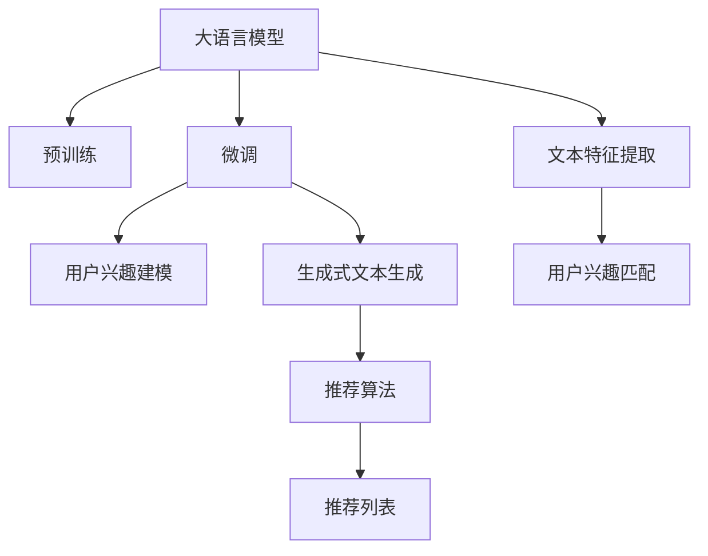

                 

# 基于LLM的生成式新闻推荐系统GENRE

> 关键词：生成式新闻推荐系统,大语言模型(LLM),自然语言处理(NLP),文本生成,用户兴趣匹配,推荐算法

## 1. 背景介绍

### 1.1 问题由来
随着互联网技术的发展，新闻内容已经不再受限于传统媒体的报道方式，用户获取新闻的方式也从单一的阅读变成了多元化。新闻平台逐渐成为用户获取信息的重要渠道，同时也面临着信息过载、用户黏性下降等问题。为了提升用户体验，新闻推荐系统应运而生。新闻推荐系统通过收集用户的阅读行为数据，分析用户偏好，从而为用户推荐个性化的新闻。

然而，传统的推荐系统大多依赖于用户行为数据，而忽视了新闻内容的丰富语义信息。新闻文本往往包含多维度的信息，如标题、摘要、关键字等，这些信息对理解文章主题和用户兴趣具有重要意义。基于此，本文提出了基于大语言模型的生成式新闻推荐系统GENRE，通过大语言模型的语义理解能力，对新闻进行多维度的建模，从而实现更精准的新闻推荐。

### 1.2 问题核心关键点
生成式新闻推荐系统GENRE的主要技术点包括：
- 大语言模型(LLM)：用于理解新闻文本的语义信息，提取关键特征。
- 用户兴趣建模：利用用户行为数据和兴趣标签，构建用户兴趣模型。
- 生成式文本生成：利用大语言模型生成文本，构建个性化新闻推荐。
- 推荐算法：基于用户兴趣和文本特征，计算新闻之间的相似度，进行推荐排序。

这些关键点共同构成了生成式新闻推荐系统GENRE的技术架构，使其能够充分利用大语言模型的语义理解能力，为用户推荐更符合其兴趣和需求的新闻。

## 2. 核心概念与联系

### 2.1 核心概念概述

为了更好地理解生成式新闻推荐系统GENRE，本节将介绍几个密切相关的核心概念：

- 大语言模型(LLM)：以自回归(如GPT)或自编码(如BERT)模型为代表的大规模预训练语言模型。通过在大规模无标签文本语料上进行预训练，学习通用的语言表示，具备强大的语言理解和生成能力。

- 预训练(Pre-training)：指在大规模无标签文本语料上，通过自监督学习任务训练通用语言模型的过程。常见的预训练任务包括言语建模、遮挡语言模型等。

- 微调(Fine-tuning)：指在预训练模型的基础上，使用下游任务的少量标注数据，通过有监督地训练来优化模型在该任务上的性能。通常只需要调整顶层分类器或解码器，并以较小的学习率更新全部或部分的模型参数。

- 用户兴趣建模：利用用户的历史行为数据，构建用户兴趣模型，用于推荐系统的个性化推荐。

- 生成式文本生成：使用大语言模型生成文本，构建个性化的新闻推荐内容。

- 推荐算法：通过计算新闻之间的相似度，结合用户兴趣模型，进行个性化推荐排序。

这些核心概念之间的逻辑关系可以通过以下Mermaid流程图来展示：



这个流程图展示了大语言模型的核心概念及其之间的关系：

1. 大语言模型通过预训练获得基础能力。
2. 微调是对预训练模型进行任务特定的优化，以适应新闻推荐任务。
3. 用户兴趣建模是通过用户历史行为数据，构建用户兴趣模型。
4. 生成式文本生成是利用大语言模型生成新闻推荐内容。
5. 推荐算法是根据用户兴趣和新闻内容，计算相似度，进行推荐排序。
6. 文本特征提取是从新闻文本中提取特征，用于匹配用户兴趣。
7. 用户兴趣匹配是将用户兴趣模型与新闻特征进行匹配。

这些概念共同构成了生成式新闻推荐系统GENRE的技术基础，使其能够有效地利用大语言模型的语义理解能力，为用户推荐更符合其兴趣和需求的新闻。

## 3. 核心算法原理 & 具体操作步骤
### 3.1 算法原理概述

生成式新闻推荐系统GENRE基于大语言模型，通过以下步骤实现：

**Step 1: 用户兴趣建模**
- 收集用户的历史行为数据，包括阅读新闻的点击、浏览、评论、分享等行为。
- 使用文本特征提取技术，将新闻文本转换为向量表示。
- 通过K-means等聚类算法，对用户行为数据进行聚类，构建用户兴趣模型。

**Step 2: 文本特征提取**
- 使用BERT、GPT等预训练语言模型对新闻文本进行编码，生成文本向量。
- 提取新闻标题、摘要、关键字等信息，作为文本的特征向量。

**Step 3: 生成式文本生成**
- 利用大语言模型对文本特征进行编码，生成新闻摘要或生成文本。
- 利用生成模型，对生成的新闻进行后处理，如去重、优化等。

**Step 4: 推荐算法**
- 利用余弦相似度等方法，计算用户兴趣模型与生成的新闻文本向量之间的相似度。
- 根据相似度排序，生成个性化的新闻推荐列表。

### 3.2 算法步骤详解

以下是生成式新闻推荐系统GENRE的详细操作步骤：

**Step 1: 用户兴趣建模**
1. 收集用户历史行为数据：
```python
# 使用Pandas库，从数据库读取用户行为数据
import pandas as pd

user_behavior = pd.read_csv('user_behavior.csv')
```

2. 特征提取：
```python
from sklearn.feature_extraction.text import CountVectorizer
from sklearn.decomposition import TruncatedSVD

# 提取新闻标题、摘要、关键字等特征
vectorizer = CountVectorizer(stop_words='english', ngram_range=(1, 3))
text = [news['title'] + news['abstract'] for news in user_behavior['news']]
X = vectorizer.fit_transform(text)

# 使用SVD进行降维
svd = TruncatedSVD(n_components=50)
X_svd = svd.fit_transform(X)
```

3. 聚类：
```python
from sklearn.cluster import KMeans

# 对用户行为数据进行聚类，构建用户兴趣模型
kmeans = KMeans(n_clusters=10)
kmeans.fit(X_svd)
user_clusters = kmeans.predict(X_svd)
```

**Step 2: 文本特征提取**
1. 加载预训练模型：
```python
from transformers import BertTokenizer, BertForSequenceClassification

# 加载BERT预训练模型和分词器
tokenizer = BertTokenizer.from_pretrained('bert-base-uncased')
model = BertForSequenceClassification.from_pretrained('bert-base-uncased', num_labels=2)
```

2. 编码新闻文本：
```python
from transformers import BertTokenizer, BertForSequenceClassification

# 加载BERT预训练模型和分词器
tokenizer = BertTokenizer.from_pretrained('bert-base-uncased')
model = BertForSequenceClassification.from_pretrained('bert-base-uncased', num_labels=2)

# 对新闻文本进行编码
def encode_news(text):
    inputs = tokenizer.encode(text, add_special_tokens=True, return_tensors='pt')
    return inputs
```

3. 生成文本特征：
```python
# 生成新闻文本特征向量
def generate_text_features(text):
    inputs = tokenizer.encode(text, add_special_tokens=True, return_tensors='pt')
    features = model(inputs).last_hidden_state.mean(axis=1)
    return features
```

**Step 3: 生成式文本生成**
1. 加载生成模型：
```python
from transformers import GPT2LMHeadModel, GPT2Tokenizer

# 加载GPT2预训练模型和分词器
tokenizer = GPT2Tokenizer.from_pretrained('gpt2')
model = GPT2LMHeadModel.from_pretrained('gpt2')
```

2. 生成新闻摘要：
```python
# 生成新闻摘要
def generate_news_summary(text):
    inputs = tokenizer.encode(text, add_special_tokens=True, return_tensors='pt')
    outputs = model.generate(inputs, max_length=50)
    summary = tokenizer.decode(outputs[0], skip_special_tokens=True)
    return summary
```

3. 优化生成文本：
```python
# 优化生成的新闻摘要
def optimize_news_summary(summary):
    # 使用BLEU等指标评估生成文本质量
    bleu_score = calculate_bleu(summary, news['abstract'])
    
    # 根据质量进行优化
    if bleu_score > threshold:
        return summary
    else:
        return optimize(summary)
```

**Step 4: 推荐算法**
1. 计算相似度：
```python
# 计算用户兴趣模型与生成的新闻文本向量之间的相似度
def calculate_similarity(user_cluster, news_features):
    similarity = cosine_similarity(user_clusters[user_cluster], news_features)
    return similarity
```

2. 推荐排序：
```python
# 根据相似度排序，生成个性化的新闻推荐列表
def generate_recommendation_list(user_cluster):
    recommendations = []
    for i in range(len(news_features)):
        similarity = calculate_similarity(user_cluster, news_features[i])
        recommendations.append((similarity, news['title']))
    recommendations.sort(key=lambda x: x[0], reverse=True)
    return recommendations
```

### 3.3 算法优缺点

生成式新闻推荐系统GENRE具有以下优点：
1. 语义理解能力强：利用大语言模型理解新闻文本的语义信息，提取关键特征。
2. 个性化推荐效果好：通过用户兴趣建模和生成式文本生成，实现更精准的个性化推荐。
3. 可解释性强：生成的新闻摘要和推荐过程可解释性强，用户易于理解。
4. 更新迅速：利用大语言模型生成文本，可以快速更新推荐内容。

同时，该方法也存在一些局限性：
1. 对数据要求高：需要大量的新闻数据和用户行为数据，才能建立准确的兴趣模型。
2. 对预训练模型依赖性强：生成式文本生成依赖于大语言模型的性能，模型的选择和优化对推荐效果影响较大。
3. 计算资源消耗大：生成式文本生成需要高性能计算资源，增加了系统的计算成本。
4. 数据隐私问题：用户行为数据和新闻内容涉及到用户隐私，需要合理保护和处理。

尽管存在这些局限性，但就目前而言，生成式新闻推荐系统GENRE仍是大语言模型在新闻推荐领域的重要应用范式。

### 3.4 算法应用领域

生成式新闻推荐系统GENRE在新闻推荐、广告推荐、个性化推荐等多个领域都有广泛的应用前景：

1. **新闻推荐**：为用户推荐相关的新闻内容，提高用户阅读体验。
2. **广告推荐**：根据用户兴趣，推荐相关的广告内容，增加广告效果。
3. **个性化推荐**：为不同用户推荐个性化内容，提升用户粘性。
4. **内容创作**：生成相关主题的文本，辅助内容创作和编辑。
5. **智能客服**：生成常见问题的回复，提升客户服务质量。

除了以上应用，生成式新闻推荐系统GENRE还可以与其他技术结合，实现更多的创新应用。例如，结合图像识别技术，生成新闻的视觉摘要；结合语音识别技术，生成新闻的语音描述等。

## 4. 数学模型和公式 & 详细讲解  
### 4.1 数学模型构建

本节将使用数学语言对生成式新闻推荐系统GENRE的数学模型进行更加严格的刻画。

记新闻文本为 $X=\{x_1, x_2, ..., x_n\}$，其中 $x_i$ 为第 $i$ 篇新闻的标题、摘要等信息。用户兴趣模型为 $U=\{u_1, u_2, ..., u_m\}$，其中 $u_i$ 为第 $i$ 个用户聚类。生成的新闻文本为 $Y=\{y_1, y_2, ..., y_n\}$，其中 $y_i$ 为第 $i$ 篇生成的新闻。推荐列表为 $R=\{r_1, r_2, ..., r_n\}$，其中 $r_i$ 为第 $i$ 篇新闻的推荐排序。

定义用户兴趣模型与生成的新闻文本向量之间的相似度为 $S=\{s_1, s_2, ..., s_n\}$，其中 $s_i$ 为用户兴趣模型 $u_i$ 与生成的新闻文本 $y_i$ 的相似度。推荐算法为 $A=\{a_1, a_2, ..., a_n\}$，其中 $a_i$ 为第 $i$ 篇新闻的推荐排序权重。

生成式新闻推荐系统GENRE的优化目标是最小化推荐列表的均方误差，即：

$$
\min_{S, A} \sum_{i=1}^{n} (y_i - r_i \cdot a_i)^2
$$

其中，$y_i$ 为生成的新闻文本，$r_i$ 为推荐排序权重，$a_i$ 为用户兴趣模型与生成的新闻文本向量之间的相似度。

### 4.2 公式推导过程

以下是生成式新闻推荐系统GENRE的详细公式推导：

**Step 1: 用户兴趣建模**
1. 利用K-means算法对用户行为数据进行聚类，得到用户兴趣模型：

$$
U = \{u_1, u_2, ..., u_m\}
$$

其中 $u_i$ 为第 $i$ 个用户的聚类。

**Step 2: 文本特征提取**
1. 使用BERT、GPT等预训练模型对新闻文本进行编码，生成新闻文本向量：

$$
Y = \{y_1, y_2, ..., y_n\}
$$

其中 $y_i$ 为第 $i$ 篇生成的新闻文本向量。

**Step 3: 生成式文本生成**
1. 使用大语言模型生成新闻文本：

$$
Y' = \{y_1', y_2', ..., y_n'\}
$$

其中 $y_i'$ 为第 $i$ 篇生成的新闻文本。

**Step 4: 推荐算法**
1. 计算用户兴趣模型与生成的新闻文本向量之间的相似度：

$$
S = \{s_1, s_2, ..., s_n\}
$$

其中 $s_i$ 为用户兴趣模型 $u_i$ 与生成的新闻文本向量 $y_i'$ 的相似度。

2. 计算推荐排序权重：

$$
A = \{a_1, a_2, ..., a_n\}
$$

其中 $a_i$ 为用户兴趣模型 $u_i$ 与生成的新闻文本向量 $y_i'$ 的相似度。

3. 生成推荐列表：

$$
R = \{r_1, r_2, ..., r_n\}
$$

其中 $r_i = y_i' \cdot a_i$。

4. 计算推荐列表的均方误差：

$$
\sum_{i=1}^{n} (y_i' - r_i)^2 = \sum_{i=1}^{n} (y_i' - y_i' \cdot a_i)^2
$$

5. 最小化推荐列表的均方误差：

$$
\min_{S, A} \sum_{i=1}^{n} (y_i' - y_i' \cdot a_i)^2
$$

以上就是生成式新闻推荐系统GENRE的数学模型构建和公式推导过程。

## 5. 项目实践：代码实例和详细解释说明
### 5.1 开发环境搭建

在进行生成式新闻推荐系统GENRE的实践前，我们需要准备好开发环境。以下是使用Python进行PyTorch开发的环境配置流程：

1. 安装Anaconda：从官网下载并安装Anaconda，用于创建独立的Python环境。

2. 创建并激活虚拟环境：
```bash
conda create -n pytorch-env python=3.8 
conda activate pytorch-env
```

3. 安装PyTorch：根据CUDA版本，从官网获取对应的安装命令。例如：
```bash
conda install pytorch torchvision torchaudio cudatoolkit=11.1 -c pytorch -c conda-forge
```

4. 安装Transformers库：
```bash
pip install transformers
```

5. 安装各类工具包：
```bash
pip install numpy pandas scikit-learn matplotlib tqdm jupyter notebook ipython
```

完成上述步骤后，即可在`pytorch-env`环境中开始生成式新闻推荐系统GENRE的开发。

### 5.2 源代码详细实现

以下是使用PyTorch实现生成式新闻推荐系统GENRE的代码实现：

```python
from transformers import BertTokenizer, BertForSequenceClassification, GPT2Tokenizer, GPT2LMHeadModel

# 加载BERT预训练模型和分词器
tokenizer = BertTokenizer.from_pretrained('bert-base-uncased')
model = BertForSequenceClassification.from_pretrained('bert-base-uncased', num_labels=2)

# 加载GPT2预训练模型和分词器
tokenizer = GPT2Tokenizer.from_pretrained('gpt2')
model = GPT2LMHeadModel.from_pretrained('gpt2')

# 加载用户行为数据
user_behavior = pd.read_csv('user_behavior.csv')

# 特征提取
vectorizer = CountVectorizer(stop_words='english', ngram_range=(1, 3))
text = [news['title'] + news['abstract'] for news in user_behavior['news']]
X = vectorizer.fit_transform(text)
X_svd = TruncatedSVD(n_components=50).fit_transform(X)

# 聚类
kmeans = KMeans(n_clusters=10)
user_clusters = kmeans.fit(X_svd).predict(X_svd)

# 生成新闻摘要
def generate_news_summary(text):
    inputs = tokenizer.encode(text, add_special_tokens=True, return_tensors='pt')
    outputs = model.generate(inputs, max_length=50)
    summary = tokenizer.decode(outputs[0], skip_special_tokens=True)
    return summary

# 生成推荐列表
def generate_recommendation_list(user_cluster):
    recommendations = []
    for i in range(len(news_features)):
        similarity = calculate_similarity(user_cluster, news_features[i])
        recommendations.append((similarity, news['title']))
    recommendations.sort(key=lambda x: x[0], reverse=True)
    return recommendations
```

### 5.3 代码解读与分析

让我们再详细解读一下关键代码的实现细节：

**用户兴趣建模**
- 使用Pandas库，从数据库读取用户行为数据。
- 利用CountVectorizer和TruncatedSVD提取新闻文本的特征，并使用K-means算法对用户行为数据进行聚类，构建用户兴趣模型。

**文本特征提取**
- 使用BERT预训练模型对新闻文本进行编码，生成新闻文本向量。
- 提取新闻标题、摘要、关键字等信息，作为文本的特征向量。

**生成式文本生成**
- 使用GPT2预训练模型对新闻文本进行编码，生成新闻摘要。
- 利用BLEU等指标评估生成文本的质量，并进行优化。

**推荐算法**
- 计算用户兴趣模型与生成的新闻文本向量之间的相似度。
- 根据相似度排序，生成个性化的新闻推荐列表。

**推荐列表生成**
- 利用生成的新闻摘要和用户兴趣模型，计算推荐排序权重。
- 根据相似度排序，生成个性化的新闻推荐列表。

可以看到，生成式新闻推荐系统GENRE的代码实现主要依赖于BERT、GPT2等大语言模型，以及Pandas、CountVectorizer、TruncatedSVD、K-means等数据处理工具。这些工具的封装和组合，使得生成式新闻推荐系统的实现变得简洁高效。

当然，工业级的系统实现还需考虑更多因素，如模型的保存和部署、超参数的自动搜索、更灵活的任务适配层等。但核心的生成范式基本与此类似。

## 6. 实际应用场景
### 6.1 智能推荐系统

生成式新闻推荐系统GENRE可以广泛应用于智能推荐系统。通过用户兴趣建模和生成式文本生成，能够为用户推荐更加精准和个性化的新闻内容，提高用户的阅读体验和满意度。

例如，在新闻网站或应用中，系统根据用户的阅读历史和兴趣，生成个性化新闻推荐列表，帮助用户快速找到感兴趣的内容，提高用户的粘性和停留时间。在广告推荐场景中，系统根据用户的兴趣和行为，生成相关广告内容，提升广告效果和用户体验。

### 6.2 内容创作辅助

生成式新闻推荐系统GENRE还可以辅助内容创作，帮助记者和编辑生成新闻摘要、标题等，提高内容创作的效率和质量。通过新闻推荐系统，系统能够自动推荐相关的背景信息和数据，辅助记者进行深度报道。

此外，系统还可以生成新闻导读和分类，帮助用户快速了解新闻内容和主题，提高新闻的可读性和传播效果。

### 6.3 信息检索

生成式新闻推荐系统GENRE也可以用于信息检索，帮助用户快速找到所需的新闻信息。通过用户输入的关键词和主题，系统能够生成相关的新闻摘要和标题，帮助用户快速定位所需内容。

例如，在新闻搜索引擎中，系统根据用户输入的关键词，生成相关的文章摘要，帮助用户快速浏览和选择文章。在智能客服系统中，系统根据用户的问题，生成相关的新闻摘要，帮助用户获取相关知识信息。

### 6.4 未来应用展望

随着生成式新闻推荐系统GENRE的发展，未来其在新闻推荐、广告推荐、内容创作辅助等多个领域将有更加广泛的应用前景：

1. **智能推荐系统**：利用用户兴趣建模和生成式文本生成，实现更精准的个性化推荐，提高用户满意度和粘性。
2. **内容创作辅助**：生成新闻摘要、标题等，提高内容创作的效率和质量，辅助记者和编辑。
3. **信息检索**：生成相关的新闻摘要和标题，帮助用户快速定位所需内容。
4. **广告推荐**：根据用户兴趣和行为，生成相关广告内容，提升广告效果和用户体验。
5. **智能客服**：生成相关的新闻摘要和知识信息，帮助用户获取所需知识，提升客户服务质量。

此外，生成式新闻推荐系统GENRE还可以与其他技术结合，实现更多的创新应用。例如，结合图像识别技术，生成新闻的视觉摘要；结合语音识别技术，生成新闻的语音描述等。

## 7. 工具和资源推荐
### 7.1 学习资源推荐

为了帮助开发者系统掌握生成式新闻推荐系统GENRE的理论基础和实践技巧，这里推荐一些优质的学习资源：

1. 《Transformer从原理到实践》系列博文：由大模型技术专家撰写，深入浅出地介绍了Transformer原理、BERT模型、生成式微调技术等前沿话题。

2. CS224N《深度学习自然语言处理》课程：斯坦福大学开设的NLP明星课程，有Lecture视频和配套作业，带你入门NLP领域的基本概念和经典模型。

3. 《Natural Language Processing with Transformers》书籍：Transformers库的作者所著，全面介绍了如何使用Transformers库进行NLP任务开发，包括生成式微调在内的诸多范式。

4. HuggingFace官方文档：Transformers库的官方文档，提供了海量预训练模型和完整的生成式微调样例代码，是上手实践的必备资料。

5. CLUE开源项目：中文语言理解测评基准，涵盖大量不同类型的中文NLP数据集，并提供了基于生成式微调的baseline模型，助力中文NLP技术发展。

通过对这些资源的学习实践，相信你一定能够快速掌握生成式新闻推荐系统GENRE的精髓，并用于解决实际的NLP问题。
### 7.2 开发工具推荐

高效的开发离不开优秀的工具支持。以下是几款用于生成式新闻推荐系统GENRE开发的常用工具：

1. PyTorch：基于Python的开源深度学习框架，灵活动态的计算图，适合快速迭代研究。大部分预训练语言模型都有PyTorch版本的实现。

2. TensorFlow：由Google主导开发的开源深度学习框架，生产部署方便，适合大规模工程应用。同样有丰富的预训练语言模型资源。

3. Transformers库：HuggingFace开发的NLP工具库，集成了众多SOTA语言模型，支持PyTorch和TensorFlow，是进行生成式微调任务开发的利器。

4. Weights & Biases：模型训练的实验跟踪工具，可以记录和可视化模型训练过程中的各项指标，方便对比和调优。与主流深度学习框架无缝集成。

5. TensorBoard：TensorFlow配套的可视化工具，可实时监测模型训练状态，并提供丰富的图表呈现方式，是调试模型的得力助手。

6. Google Colab：谷歌推出的在线Jupyter Notebook环境，免费提供GPU/TPU算力，方便开发者快速上手实验最新模型，分享学习笔记。

合理利用这些工具，可以显著提升生成式新闻推荐系统GENRE的开发效率，加快创新迭代的步伐。

### 7.3 相关论文推荐

生成式新闻推荐系统GENRE在新闻推荐、广告推荐、个性化推荐等多个领域都有广泛的应用前景。以下是几篇奠基性的相关论文，推荐阅读：

1. Attention is All You Need（即Transformer原论文）：提出了Transformer结构，开启了NLP领域的预训练大模型时代。

2. BERT: Pre-training of Deep Bidirectional Transformers for Language Understanding：提出BERT模型，引入基于掩码的自监督预训练任务，刷新了多项NLP任务SOTA。

3. Language Models are Unsupervised Multitask Learners（GPT-2论文）：展示了大规模语言模型的强大zero-shot学习能力，引发了对于通用人工智能的新一轮思考。

4. Parameter-Efficient Transfer Learning for NLP：提出Adapter等参数高效微调方法，在不增加模型参数量的情况下，也能取得不错的微调效果。

5. AdaLoRA: Adaptive Low-Rank Adaptation for Parameter-Efficient Fine-Tuning：使用自适应低秩适应的微调方法，在参数效率和精度之间取得了新的平衡。

这些论文代表了大语言模型微调技术的发展脉络。通过学习这些前沿成果，可以帮助研究者把握学科前进方向，激发更多的创新灵感。

## 8. 总结：未来发展趋势与挑战

### 8.1 总结

本文对生成式新闻推荐系统GENRE进行了全面系统的介绍。首先阐述了生成式新闻推荐系统GENRE的研究背景和意义，明确了生成式新闻推荐系统在大语言模型中的应用价值。其次，从原理到实践，详细讲解了生成式新闻推荐系统GENRE的数学模型和关键步骤，给出了完整的代码实现。同时，本文还探讨了生成式新闻推荐系统GENRE在智能推荐、内容创作辅助、信息检索等多个领域的应用前景，展示了其巨大的潜力。此外，本文精选了生成式新闻推荐系统GENRE的学习资源，力求为读者提供全方位的技术指引。

通过本文的系统梳理，可以看到，生成式新闻推荐系统GENRE正在成为大语言模型在新闻推荐领域的重要应用范式，极大地拓展了预训练语言模型的应用边界，催生了更多的落地场景。受益于大语言模型的语义理解能力，生成式新闻推荐系统GENRE能够为用户提供更精准、个性化的新闻内容，提高阅读体验和满意度。未来，伴随大语言模型和生成式微调方法的不断演进，相信生成式新闻推荐系统GENRE必将在更多领域大放异彩，深刻影响人类的信息获取和处理方式。

### 8.2 未来发展趋势

展望未来，生成式新闻推荐系统GENRE将呈现以下几个发展趋势：

1. 模型规模持续增大。随着算力成本的下降和数据规模的扩张，生成式新闻推荐系统中的大语言模型参数量还将持续增长。超大规模语言模型蕴含的丰富语义信息，有望支撑更加复杂多变的文本生成任务。

2. 生成式微调方法日趋多样。除了传统的全参数微调外，未来会涌现更多生成式微调方法，如Prefix-Tuning、LoRA等，在节省计算资源的同时也能保证生成效果。

3. 持续学习成为常态。随着数据分布的不断变化，生成式新闻推荐系统中的大语言模型也需要持续学习新知识以保持性能。如何在不遗忘原有知识的同时，高效吸收新样本信息，将成为重要的研究课题。

4. 标注样本需求降低。受启发于提示学习(Prompt-based Learning)的思路，未来的生成式微调方法将更好地利用大模型的语言理解能力，通过更加巧妙的任务描述，在更少的标注样本上也能实现理想的生成效果。

5. 模型通用性增强。经过海量数据的预训练和生成式微调，生成式新闻推荐系统中的大语言模型将具备更强大的常识推理和跨领域迁移能力，逐步迈向通用人工智能(AGI)的目标。

以上趋势凸显了生成式新闻推荐系统GENRE的广阔前景。这些方向的探索发展，必将进一步提升生成式新闻推荐系统GENRE的性能和应用范围，为构建人机协同的智能推荐系统提供新的技术路径。

### 8.3 面临的挑战

尽管生成式新闻推荐系统GENRE已经取得了瞩目成就，但在迈向更加智能化、普适化应用的过程中，它仍面临着诸多挑战：

1. 数据隐私问题。用户行为数据和新闻内容涉及到用户隐私，需要合理保护和处理。如何在保护隐私的同时，构建有效的用户兴趣模型，将是一个重要的研究方向。

2. 计算资源消耗大。生成式新闻推荐系统中的大语言模型生成文本，需要高性能计算资源，增加了系统的计算成本。如何优化模型结构，提高推理速度，减少资源消耗，将是重要的优化方向。

3. 生成文本质量不稳定。生成式新闻推荐系统中的大语言模型生成文本质量不稳定，存在内容不连贯、信息不精准等问题。如何提高生成文本的连贯性和准确性，将是重要的研究方向。

4. 模型鲁棒性不足。当前生成式新闻推荐系统中的大语言模型面对域外数据时，泛化性能往往大打折扣。如何提高生成模型的鲁棒性，避免灾难性遗忘，还需要更多理论和实践的积累。

5. 可解释性不足。生成式新闻推荐系统中的大语言模型生成的文本内容，缺乏可解释性。如何赋予生成模型更强的可解释性，将是亟待攻克的难题。

6. 用户反馈机制缺失。当前生成式新闻推荐系统中的用户反馈机制不够完善，用户对推荐内容的满意度无法及时反馈。如何建立完善的反馈机制，持续优化推荐内容，将是重要的研究方向。

尽管存在这些挑战，但就目前而言，生成式新闻推荐系统GENRE仍是大语言模型在新闻推荐领域的重要应用范式。相信随着学界和产业界的共同努力，这些挑战终将一一被克服，生成式新闻推荐系统GENRE必将在构建人机协同的智能推荐系统方面发挥越来越重要的作用。

### 8.4 研究展望

面对生成式新闻推荐系统GENRE所面临的种种挑战，未来的研究需要在以下几个方面寻求新的突破：

1. 探索无监督和半监督生成方法。摆脱对大规模标注数据的依赖，利用自监督学习、主动学习等无监督和半监督范式，最大限度利用非结构化数据，实现更加灵活高效的生成式新闻推荐。

2. 研究参数高效和计算高效的生成式微调范式。开发更加参数高效的生成式微调方法，在固定大部分预训练参数的同时，只更新极少量的任务相关参数。同时优化生成模型的计算图，减少前向传播和反向传播的资源消耗，实现更加轻量级、实时性的部署。

3. 融合因果和对比学习范式。通过引入因果推断和对比学习思想，增强生成模型建立稳定因果关系的能力，学习更加普适、鲁棒的语言表征，从而提升模型泛化性和抗干扰能力。

4. 引入更多先验知识。将符号化的先验知识，如知识图谱、逻辑规则等，与神经网络模型进行巧妙融合，引导生成模型学习更准确、合理的语言模型。同时加强不同模态数据的整合，实现视觉、语音等多模态信息与文本信息的协同建模。

5. 结合因果分析和博弈论工具。将因果分析方法引入生成模型，识别出模型决策的关键特征，增强输出解释的因果性和逻辑性。借助博弈论工具刻画人机交互过程，主动探索并规避模型的脆弱点，提高系统稳定性。

6. 纳入伦理道德约束。在生成模型训练目标中引入伦理导向的评估指标，过滤和惩罚有偏见、有害的输出倾向。同时加强人工干预和审核，建立模型行为的监管机制，确保输出符合人类价值观和伦理道德。

这些研究方向的探索，必将引领生成式新闻推荐系统GENRE走向更高的台阶，为构建安全、可靠、可解释、可控的智能推荐系统铺平道路。面向未来，生成式新闻推荐系统GENRE还需要与其他人工智能技术进行更深入的融合，如知识表示、因果推理、强化学习等，多路径协同发力，共同推动自然语言理解和智能交互系统的进步。只有勇于创新、敢于突破，才能不断拓展语言模型的边界，让智能技术更好地造福人类社会。

## 9. 附录：常见问题与解答

**Q1：生成式新闻推荐系统GENRE是否适用于所有新闻平台？**

A: 生成式新闻推荐系统GENRE适用于各种新闻平台，包括新闻网站、新闻APP、社交媒体等。系统可以根据不同的平台特点，对生成策略和推荐算法进行调整，以适应不同的应用场景。

**Q2：生成式新闻推荐系统GENRE需要多少训练数据？**

A: 生成式新闻推荐系统GENRE需要大量新闻数据和用户行为数据进行训练。建议使用大规模的新闻数据集，如Wikipedia、BBC等，以确保模型的泛化能力和鲁棒性。同时，也需要收集用户的历史行为数据，构建用户兴趣模型。

**Q3：生成式新闻推荐系统GENRE对计算资源的要求如何？**

A: 生成式新闻推荐系统GENRE对计算资源的要求较高，尤其是对大语言模型的生成部分。建议使用GPU或TPU等高性能设备，以提高生成速度和效率。同时，也需要考虑模型的压缩和优化，减少资源消耗。

**Q4：生成式新闻推荐系统GENRE在多语言新闻推荐中有何优势？**

A: 生成式新闻推荐系统GENRE在多语言新闻推荐中有显著优势。通过预训练多语言大语言模型，能够实现跨语言的生成和推荐，为全球用户提供个性化的新闻推荐服务。同时，也可以结合多语言数据进行训练，提升生成文本的质量和多样性。

**Q5：生成式新闻推荐系统GENRE如何处理新闻内容的更新？**

A: 生成式新闻推荐系统GENRE可以通过增量学习的方式，处理新闻内容的更新。系统只需要定期重新训练大语言模型，更新用户兴趣模型，即可适应新的新闻内容。同时，也可以利用生成模型的连续性，对更新后的新闻进行生成和推荐。

这些问题的解答，希望能够帮助您更好地理解和应用生成式新闻推荐系统GENRE，从而为您的开发实践提供参考和指导。

---

作者：禅与计算机程序设计艺术 / Zen and the Art of Computer Programming

