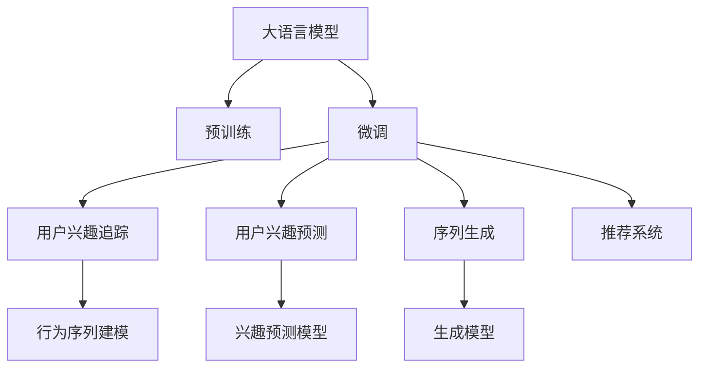

                 

# 基于LLM的用户兴趣动态追踪与预测

> 关键词：大语言模型(LLM)、用户兴趣追踪、预测模型、序列生成、自然语言处理(NLP)、个性化推荐、数据挖掘

## 1. 背景介绍

### 1.1 问题由来

随着互联网的迅猛发展，大数据时代带来的海量用户行为数据，使得用户兴趣的动态追踪与预测成为可能。用户的兴趣通常通过其浏览、点击、购买等行为显现，因此，分析这些行为特征，预测其未来行为，对电商、社交媒体、在线视频等领域的推荐系统有着重要意义。

然而，传统的推荐系统依赖于静态用户画像和静态数据，难以捕捉用户兴趣的动态变化，也无法解决用户的多样性和不确定性。现代推荐系统亟需引入智能化的手段，以提升推荐效果和用户体验。

基于大语言模型(LLM)的推荐系统应运而生。LLM在自然语言处理(NLP)、语义理解和生成等方面具有卓越表现，能够利用用户的文本数据(如评论、文章、视频标题等)进行动态兴趣追踪，并通过序列生成技术对未来行为进行预测。

### 1.2 问题核心关键点

LLM应用于用户兴趣追踪与预测的核心关键点在于：

1. **大语言模型的预训练与微调**：利用大规模无标签数据进行预训练，通过少量有标签数据进行微调，使模型能够从文本数据中捕捉用户的兴趣变化。
2. **用户行为序列建模**：将用户行为序列作为输入，通过自回归模型或自编码模型进行建模，捕捉行为序列的动态变化。
3. **兴趣预测与生成**：将模型应用于预测用户未来行为或生成新的推荐内容，提升个性化推荐效果。
4. **模型评估与优化**：通过验证集或测试集评估模型性能，并通过调参和模型优化，提升预测精度和鲁棒性。

## 2. 核心概念与联系

### 2.1 核心概念概述

为更好地理解LLM在用户兴趣追踪与预测中的应用，本节将介绍几个关键概念：

- 大语言模型(LLM)：以自回归(如GPT)或自编码(如BERT)模型为代表的大规模预训练语言模型。通过在大规模无标签文本语料上进行预训练，学习通用的语言表示，具备强大的语言理解和生成能力。

- 预训练(Pre-training)：指在大规模无标签文本语料上，通过自监督学习任务训练通用语言模型的过程。常见的预训练任务包括言语建模、遮挡语言模型等。

- 微调(Fine-tuning)：指在预训练模型的基础上，使用下游任务的少量标注数据，通过有监督地训练来优化模型在特定任务上的性能。通常只需要调整顶层分类器或解码器，并以较小的学习率更新全部或部分的模型参数。

- 用户兴趣追踪：通过分析用户的历史行为数据，构建用户兴趣模型，并利用动态信息捕捉用户兴趣的变化。

- 用户兴趣预测：利用构建的兴趣模型，预测用户未来的行为。

- 序列生成：利用序列生成模型，生成符合用户兴趣的新内容。

- 推荐系统：利用用户兴趣预测与生成技术，为每个用户提供个性化的推荐内容。

这些概念之间的逻辑关系可以通过以下Mermaid流程图来展示：



这个流程图展示了LLM的核心概念及其之间的联系：

1. LLM通过预训练获得基础能力。
2. 微调是对预训练模型进行任务特定的优化，使其能够捕捉用户兴趣变化。
3. 用户兴趣追踪与预测是微调模型的具体应用，主要用于个性化推荐。
4. 序列生成模型用于生成新的推荐内容。
5. 推荐系统将用户兴趣预测与生成技术集成，提供个性化推荐服务。

## 3. 核心算法原理 & 具体操作步骤

### 3.1 算法原理概述

基于LLM的用户兴趣追踪与预测，本质上是一种有监督的序列生成与分类问题。其核心思想是：利用预训练的LLM，通过微调将其适应特定用户的行为序列，然后利用微调后的模型对用户未来的行为进行预测。

形式化地，假设用户行为序列为 $X=\{x_1, x_2, \cdots, x_n\}$，其中 $x_t$ 表示第 $t$ 次用户行为，可以是浏览、点击、购买等。目标是从这些序列中捕捉用户兴趣的变化，并预测下一个行为 $y_{n+1}$，即：

$$
y_{n+1} = \mathop{\arg\max}_{y} P(y|X)
$$

其中 $P(y|X)$ 为条件概率分布，表示在行为序列 $X$ 下预测行为 $y$ 的概率。

### 3.2 算法步骤详解

基于LLM的用户兴趣追踪与预测一般包括以下几个关键步骤：

**Step 1: 准备数据集**
- 收集用户的历史行为数据，可以是浏览记录、点击数据、购买记录等。
- 划分训练集、验证集和测试集。

**Step 2: 构建用户行为序列**
- 对收集到的行为数据进行编码，转化为模型可以处理的向量表示。
- 对行为序列进行填充或截断，使其长度一致。

**Step 3: 模型选择与微调**
- 选择合适的预训练语言模型（如BERT、GPT等），进行微调。
- 设计合适的损失函数，如交叉熵损失、均方误差损失等。
- 设置微调超参数，如学习率、批大小、迭代轮数等。

**Step 4: 用户兴趣建模**
- 将用户行为序列作为模型输入，进行前向传播。
- 通过损失函数计算模型输出与真实标签之间的差异。
- 反向传播更新模型参数，最小化损失函数。

**Step 5: 兴趣预测与生成**
- 利用微调后的模型对新的行为序列进行预测。
- 对于分类任务，通过softmax函数计算每个行为的概率分布，选择概率最大的行为作为预测结果。
- 对于生成任务，利用模型生成新的行为序列，作为推荐内容。

**Step 6: 模型评估与优化**
- 在验证集或测试集上评估模型性能，计算预测准确率、召回率等指标。
- 根据评估结果调整模型参数，优化模型性能。

以上是基于LLM的用户兴趣追踪与预测的一般流程。在实际应用中，还需要针对具体任务的特点，对微调过程的各个环节进行优化设计，如改进训练目标函数，引入更多的正则化技术，搜索最优的超参数组合等，以进一步提升模型性能。

### 3.3 算法优缺点

基于LLM的用户兴趣追踪与预测方法具有以下优点：

1. 数据来源广泛：用户的历史行为数据通常较为丰富，容易获取。
2. 模型效果好：利用LLM的强大语义理解能力，能够更准确地捕捉用户兴趣的变化。
3. 实时性高：通过在线微调，可以实时更新模型，提升预测精度。
4. 泛化能力强：LLM在处理大规模无标签数据上的泛化能力，使得其在特定任务上也能取得不错效果。

同时，该方法也存在一定的局限性：

1. 数据噪声影响：行为序列中可能包含噪声数据，影响模型性能。
2. 隐私风险：用户行为数据涉及隐私问题，需要谨慎处理。
3. 计算资源需求高：LLM参数量巨大，需要高性能的计算资源。
4. 可解释性不足：模型决策过程较为复杂，难以解释。
5. 动态变化捕捉难度大：用户兴趣变化难以捕捉，模型需要持续优化。

尽管存在这些局限性，但就目前而言，基于LLM的方法仍然是用户兴趣追踪与预测的主流范式。未来相关研究的重点在于如何进一步降低计算资源需求，提高模型的泛化能力和鲁棒性，同时兼顾可解释性和隐私保护等因素。

### 3.4 算法应用领域

基于LLM的用户兴趣追踪与预测方法，已经在电商推荐、社交媒体内容推荐、在线视频推荐等多个领域得到了广泛应用，为个性化推荐系统提供了新的解决方案。

- **电商推荐系统**：通过分析用户浏览、点击、购买记录，预测用户未来的购买行为，为其推荐商品。
- **社交媒体推荐系统**：利用用户发布的内容和互动行为，预测其可能感兴趣的内容，进行内容推荐。
- **在线视频推荐系统**：分析用户观看历史和点击行为，预测其可能喜欢的视频内容，提供个性化视频推荐。
- **个性化阅读推荐系统**：根据用户的历史阅读行为和评分数据，预测其可能感兴趣的书籍或文章，提供个性化推荐。

此外，LLM在新闻、音乐、旅游等领域的应用也在不断涌现，推动了个性化推荐技术的持续发展。

## 4. 数学模型和公式 & 详细讲解  
### 4.1 数学模型构建

本节将使用数学语言对基于LLM的用户兴趣追踪与预测过程进行更加严格的刻画。

记用户行为序列为 $X=\{x_1, x_2, \cdots, x_n\}$，其中 $x_t$ 表示第 $t$ 次用户行为，可以是浏览、点击、购买等。目标是从这些序列中捕捉用户兴趣的变化，并预测下一个行为 $y_{n+1}$，即：

$$
y_{n+1} = \mathop{\arg\max}_{y} P(y|X)
$$

其中 $P(y|X)$ 为条件概率分布，表示在行为序列 $X$ 下预测行为 $y$ 的概率。

假设预训练语言模型为 $M_{\theta}:\mathcal{X} \rightarrow \mathcal{Y}$，其中 $\mathcal{X}$ 为用户行为序列，$\mathcal{Y}$ 为用户行为空间，$\theta \in \mathbb{R}^d$ 为模型参数。在用户行为序列 $X$ 上应用微调后的模型，其输出为 $\hat{y_{n+1}}=M_{\theta}(X)$。模型的损失函数为：

$$
\mathcal{L}(\theta) = -\log P(y_{n+1}|\hat{y_{n+1}})
$$

其中 $P(y_{n+1}|\hat{y_{n+1}})$ 为模型预测行为 $y_{n+1}$ 的概率分布。

### 4.2 公式推导过程

以下我们以分类任务为例，推导基于LLM的用户兴趣追踪与预测过程。

假设模型 $M_{\theta}$ 在输入 $X$ 上的输出为 $\hat{y_{n+1}}=M_{\theta}(X) \in [0,1]$，表示用户行为 $y_{n+1}$ 属于每个行为类别的概率。目标是最小化损失函数 $\mathcal{L}(\theta)$，得到最优参数 $\theta^*$。

将损失函数展开，得到：

$$
\mathcal{L}(\theta) = -\log \sum_{y \in \mathcal{Y}} \exp(\hat{y} \log P(y|\hat{y})) = -\sum_{y \in \mathcal{Y}} \hat{y} \log P(y|\hat{y})
$$

其中 $\hat{y} = M_{\theta}(X) \in [0,1]$ 表示模型预测行为 $y_{n+1}$ 的概率分布。

根据链式法则，损失函数对参数 $\theta_k$ 的梯度为：

$$
\frac{\partial \mathcal{L}(\theta)}{\partial \theta_k} = -\sum_{y \in \mathcal{Y}} \frac{\partial \hat{y}}{\partial \theta_k} \log P(y|\hat{y})
$$

其中 $\frac{\partial \hat{y}}{\partial \theta_k}$ 为模型对输入 $X$ 的梯度，可以通过自动微分技术高效计算。

在得到损失函数的梯度后，即可带入参数更新公式，完成模型的迭代优化。重复上述过程直至收敛，最终得到适应用户兴趣追踪与预测的最优模型参数 $\theta^*$。

## 5. 项目实践：代码实例和详细解释说明
### 5.1 开发环境搭建

在进行LLM应用于用户兴趣追踪与预测的实践前，我们需要准备好开发环境。以下是使用Python进行PyTorch开发的环境配置流程：

1. 安装Anaconda：从官网下载并安装Anaconda，用于创建独立的Python环境。

2. 创建并激活虚拟环境：
```bash
conda create -n pytorch-env python=3.8 
conda activate pytorch-env
```

3. 安装PyTorch：根据CUDA版本，从官网获取对应的安装命令。例如：
```bash
conda install pytorch torchvision torchaudio cudatoolkit=11.1 -c pytorch -c conda-forge
```

4. 安装Transformers库：
```bash
pip install transformers
```

5. 安装各类工具包：
```bash
pip install numpy pandas scikit-learn matplotlib tqdm jupyter notebook ipython
```

完成上述步骤后，即可在`pytorch-env`环境中开始实践。

### 5.2 源代码详细实现

这里我们以BERT模型为例，给出使用Transformers库进行用户兴趣追踪与预测的PyTorch代码实现。

首先，定义用户行为序列的处理函数：

```python
from transformers import BertTokenizer
from torch.utils.data import Dataset
import torch

class BehaviorSequenceDataset(Dataset):
    def __init__(self, sequences, labels, tokenizer, max_len=128):
        self.sequences = sequences
        self.labels = labels
        self.tokenizer = tokenizer
        self.max_len = max_len
        
    def __len__(self):
        return len(self.sequences)
    
    def __getitem__(self, item):
        sequence = self.sequences[item]
        label = self.labels[item]
        
        encoding = self.tokenizer(sequence, return_tensors='pt', max_length=self.max_len, padding='max_length', truncation=True)
        input_ids = encoding['input_ids'][0]
        attention_mask = encoding['attention_mask'][0]
        
        # 对label进行编码
        label = label2id[label]
        
        return {'input_ids': input_ids, 
                'attention_mask': attention_mask,
                'labels': label}

# 标签与id的映射
label2id = {'B': 0, 'I': 1, 'O': 2}
id2label = {v: k for k, v in label2id.items()}

# 创建dataset
tokenizer = BertTokenizer.from_pretrained('bert-base-cased')

train_dataset = BehaviorSequenceDataset(train_sequences, train_labels, tokenizer)
dev_dataset = BehaviorSequenceDataset(dev_sequences, dev_labels, tokenizer)
test_dataset = BehaviorSequenceDataset(test_sequences, test_labels, tokenizer)
```

然后，定义模型和优化器：

```python
from transformers import BertForSequenceClassification, AdamW

model = BertForSequenceClassification.from_pretrained('bert-base-cased', num_labels=len(label2id))

optimizer = AdamW(model.parameters(), lr=2e-5)
```

接着，定义训练和评估函数：

```python
from torch.utils.data import DataLoader
from tqdm import tqdm
from sklearn.metrics import classification_report

device = torch.device('cuda') if torch.cuda.is_available() else torch.device('cpu')
model.to(device)

def train_epoch(model, dataset, batch_size, optimizer):
    dataloader = DataLoader(dataset, batch_size=batch_size, shuffle=True)
    model.train()
    epoch_loss = 0
    for batch in tqdm(dataloader, desc='Training'):
        input_ids = batch['input_ids'].to(device)
        attention_mask = batch['attention_mask'].to(device)
        labels = batch['labels'].to(device)
        model.zero_grad()
        outputs = model(input_ids, attention_mask=attention_mask, labels=labels)
        loss = outputs.loss
        epoch_loss += loss.item()
        loss.backward()
        optimizer.step()
    return epoch_loss / len(dataloader)

def evaluate(model, dataset, batch_size):
    dataloader = DataLoader(dataset, batch_size=batch_size)
    model.eval()
    preds, labels = [], []
    with torch.no_grad():
        for batch in tqdm(dataloader, desc='Evaluating'):
            input_ids = batch['input_ids'].to(device)
            attention_mask = batch['attention_mask'].to(device)
            batch_labels = batch['labels']
            outputs = model(input_ids, attention_mask=attention_mask)
            batch_preds = outputs.logits.argmax(dim=2).to('cpu').tolist()
            batch_labels = batch_labels.to('cpu').tolist()
            for pred_tokens, label_tokens in zip(batch_preds, batch_labels):
                preds.append(pred_tokens)
                labels.append(label_tokens)
                
    print(classification_report(labels, preds))
```

最后，启动训练流程并在测试集上评估：

```python
epochs = 5
batch_size = 16

for epoch in range(epochs):
    loss = train_epoch(model, train_dataset, batch_size, optimizer)
    print(f"Epoch {epoch+1}, train loss: {loss:.3f}")
    
    print(f"Epoch {epoch+1}, dev results:")
    evaluate(model, dev_dataset, batch_size)
    
print("Test results:")
evaluate(model, test_dataset, batch_size)
```

以上就是使用PyTorch对BERT进行用户兴趣追踪与预测的完整代码实现。可以看到，得益于Transformers库的强大封装，我们可以用相对简洁的代码完成BERT模型的加载和微调。

### 5.3 代码解读与分析

让我们再详细解读一下关键代码的实现细节：

**BehaviorSequenceDataset类**：
- `__init__`方法：初始化序列、标签、分词器等关键组件。
- `__len__`方法：返回数据集的样本数量。
- `__getitem__`方法：对单个样本进行处理，将行为序列输入编码为token ids，将标签编码为数字，并对其进行定长padding，最终返回模型所需的输入。

**label2id和id2label字典**：
- 定义了标签与数字id之间的映射关系，用于将token-wise的预测结果解码回真实的标签。

**训练和评估函数**：
- 使用PyTorch的DataLoader对数据集进行批次化加载，供模型训练和推理使用。
- 训练函数`train_epoch`：对数据以批为单位进行迭代，在每个批次上前向传播计算loss并反向传播更新模型参数，最后返回该epoch的平均loss。
- 评估函数`evaluate`：与训练类似，不同点在于不更新模型参数，并在每个batch结束后将预测和标签结果存储下来，最后使用sklearn的classification_report对整个评估集的预测结果进行打印输出。

**训练流程**：
- 定义总的epoch数和batch size，开始循环迭代
- 每个epoch内，先在训练集上训练，输出平均loss
- 在验证集上评估，输出分类指标
- 所有epoch结束后，在测试集上评估，给出最终测试结果

可以看到，PyTorch配合Transformers库使得BERT微调的代码实现变得简洁高效。开发者可以将更多精力放在数据处理、模型改进等高层逻辑上，而不必过多关注底层的实现细节。

当然，工业级的系统实现还需考虑更多因素，如模型的保存和部署、超参数的自动搜索、更灵活的任务适配层等。但核心的微调范式基本与此类似。

## 6. 实际应用场景
### 6.1 电商推荐系统

利用基于LLM的用户兴趣追踪与预测方法，电商推荐系统可以实现个性化的商品推荐。传统的推荐系统往往依赖于用户的历史行为数据，难以捕捉用户兴趣的动态变化。通过使用预训练的LLM，电商推荐系统可以在用户行为序列中捕捉用户兴趣的变化，并预测用户可能感兴趣的商品，从而提升推荐效果。

在技术实现上，电商推荐系统可以收集用户的历史浏览、点击、购买记录，构建用户行为序列，并将其作为LLM的输入。通过微调后的LLM，系统可以预测用户未来可能购买的商品，从而进行个性化推荐。

### 6.2 社交媒体内容推荐

社交媒体平台利用基于LLM的用户兴趣追踪与预测方法，可以实现内容推荐。传统的推荐系统难以处理用户的多样性和不确定性，而基于LLM的方法可以通过分析用户发布的内容和互动行为，预测其可能感兴趣的内容，并进行推荐。

在技术实现上，社交媒体平台可以收集用户的历史发布内容、点赞、评论等互动数据，构建用户行为序列。通过微调后的LLM，系统可以预测用户可能感兴趣的内容，并推荐给用户。

### 6.3 在线视频推荐系统

在线视频平台利用基于LLM的用户兴趣追踪与预测方法，可以实现视频内容推荐。传统的推荐系统难以处理视频内容的复杂性和多样性，而基于LLM的方法可以通过分析用户观看历史和点击行为，预测其可能感兴趣的视频内容，并进行推荐。

在技术实现上，在线视频平台可以收集用户的历史观看记录和点击行为数据，构建用户行为序列。通过微调后的LLM，系统可以预测用户可能感兴趣的视频内容，并推荐给用户。

### 6.4 未来应用展望

随着LLM和微调方法的不断发展，基于LLM的用户兴趣追踪与预测方法将呈现以下几个发展趋势：

1. **模型规模持续增大**：随着算力成本的下降和数据规模的扩张，预训练语言模型的参数量还将持续增长。超大规模语言模型蕴含的丰富语言知识，有望支撑更加复杂多变的用户兴趣追踪与预测任务。

2. **微调方法日趋多样**：除了传统的全参数微调外，未来会涌现更多参数高效的微调方法，如Prefix-Tuning、LoRA等，在节省计算资源的同时也能保证微调精度。

3. **持续学习成为常态**：随着数据分布的不断变化，微调模型也需要持续学习新知识以保持性能。如何在不遗忘原有知识的同时，高效吸收新样本信息，将成为重要的研究课题。

4. **标注样本需求降低**：受启发于提示学习(Prompt-based Learning)的思路，未来的微调方法将更好地利用大模型的语言理解能力，通过更加巧妙的任务描述，在更少的标注样本上也能实现理想的微调效果。

5. **多模态微调崛起**：当前的微调主要聚焦于纯文本数据，未来会进一步拓展到图像、视频、语音等多模态数据微调。多模态信息的融合，将显著提升语言模型对现实世界的理解和建模能力。

6. **知识整合能力增强**：现有的微调模型往往局限于任务内数据，难以灵活吸收和运用更广泛的先验知识。如何让微调过程更好地与外部知识库、规则库等专家知识结合，形成更加全面、准确的信息整合能力，还有很大的想象空间。

以上趋势凸显了基于LLM的用户兴趣追踪与预测技术的广阔前景。这些方向的探索发展，必将进一步提升推荐系统的性能和应用范围，为电商、社交媒体、视频平台等带来新的技术突破。

## 7. 工具和资源推荐
### 7.1 学习资源推荐

为了帮助开发者系统掌握基于LLM的用户兴趣追踪与预测的理论基础和实践技巧，这里推荐一些优质的学习资源：

1. 《Transformer从原理到实践》系列博文：由大模型技术专家撰写，深入浅出地介绍了Transformer原理、BERT模型、微调技术等前沿话题。

2. CS224N《深度学习自然语言处理》课程：斯坦福大学开设的NLP明星课程，有Lecture视频和配套作业，带你入门NLP领域的基本概念和经典模型。

3. 《Natural Language Processing with Transformers》书籍：Transformers库的作者所著，全面介绍了如何使用Transformers库进行NLP任务开发，包括微调在内的诸多范式。

4. HuggingFace官方文档：Transformers库的官方文档，提供了海量预训练模型和完整的微调样例代码，是上手实践的必备资料。

5. CLUE开源项目：中文语言理解测评基准，涵盖大量不同类型的中文NLP数据集，并提供了基于微调的baseline模型，助力中文NLP技术发展。

通过对这些资源的学习实践，相信你一定能够快速掌握基于LLM的用户兴趣追踪与预测的精髓，并用于解决实际的NLP问题。
###  7.2 开发工具推荐

高效的开发离不开优秀的工具支持。以下是几款用于LLM应用于用户兴趣追踪与预测开发的常用工具：

1. PyTorch：基于Python的开源深度学习框架，灵活动态的计算图，适合快速迭代研究。大部分预训练语言模型都有PyTorch版本的实现。

2. TensorFlow：由Google主导开发的开源深度学习框架，生产部署方便，适合大规模工程应用。同样有丰富的预训练语言模型资源。

3. Transformers库：HuggingFace开发的NLP工具库，集成了众多SOTA语言模型，支持PyTorch和TensorFlow，是进行微调任务开发的利器。

4. Weights & Biases：模型训练的实验跟踪工具，可以记录和可视化模型训练过程中的各项指标，方便对比和调优。与主流深度学习框架无缝集成。

5. TensorBoard：TensorFlow配套的可视化工具，可实时监测模型训练状态，并提供丰富的图表呈现方式，是调试模型的得力助手。

6. Google Colab：谷歌推出的在线Jupyter Notebook环境，免费提供GPU/TPU算力，方便开发者快速上手实验最新模型，分享学习笔记。

合理利用这些工具，可以显著提升LLM应用于用户兴趣追踪与预测的开发效率，加快创新迭代的步伐。

### 7.3 相关论文推荐

LLM应用于用户兴趣追踪与预测的方法源于学界的持续研究。以下是几篇奠基性的相关论文，推荐阅读：

1. Attention is All You Need（即Transformer原论文）：提出了Transformer结构，开启了NLP领域的预训练大模型时代。

2. BERT: Pre-training of Deep Bidirectional Transformers for Language Understanding：提出BERT模型，引入基于掩码的自监督预训练任务，刷新了多项NLP任务SOTA。

3. Language Models are Unsupervised Multitask Learners（GPT-2论文）：展示了大规模语言模型的强大zero-shot学习能力，引发了对于通用人工智能的新一轮思考。

4. Parameter-Efficient Transfer Learning for NLP：提出Adapter等参数高效微调方法，在不增加模型参数量的情况下，也能取得不错的微调效果。

5. Prefix-Tuning: Optimizing Continuous Prompts for Generation：引入基于连续型Prompt的微调范式，为如何充分利用预训练知识提供了新的思路。

6. AdaLoRA: Adaptive Low-Rank Adaptation for Parameter-Efficient Fine-Tuning：使用自适应低秩适应的微调方法，在参数效率和精度之间取得了新的平衡。

这些论文代表了大语言模型微调技术的发展脉络。通过学习这些前沿成果，可以帮助研究者把握学科前进方向，激发更多的创新灵感。

## 8. 总结：未来发展趋势与挑战

### 8.1 总结

本文对基于LLM的用户兴趣追踪与预测方法进行了全面系统的介绍。首先阐述了LLM和微调技术的研究背景和意义，明确了用户兴趣追踪与预测在个性化推荐系统中的重要价值。其次，从原理到实践，详细讲解了LLM应用于用户兴趣追踪与预测的数学原理和关键步骤，给出了完整的代码实例。同时，本文还广泛探讨了LLM在电商推荐、社交媒体内容推荐、在线视频推荐等多个领域的应用前景，展示了LLM技术的巨大潜力。

通过本文的系统梳理，可以看到，基于LLM的方法正在成为用户兴趣追踪与预测的主流范式，极大地拓展了预训练语言模型的应用边界，催生了更多的落地场景。受益于大规模语料的预训练，LLM在处理用户行为序列上表现优异，可以更好地捕捉用户兴趣的动态变化，提升个性化推荐效果。未来，伴随LLM和微调方法的持续演进，基于LLM的推荐系统必将在更多领域得到应用，为电商、社交媒体、视频平台等带来新的技术突破。

### 8.2 未来发展趋势

展望未来，基于LLM的用户兴趣追踪与预测技术将呈现以下几个发展趋势：

1. **模型规模持续增大**：随着算力成本的下降和数据规模的扩张，预训练语言模型的参数量还将持续增长。超大规模语言模型蕴含的丰富语言知识，有望支撑更加复杂多变的用户兴趣追踪与预测任务。

2. **微调方法日趋多样**：除了传统的全参数微调外，未来会涌现更多参数高效的微调方法，如Prefix-Tuning、LoRA等，在节省计算资源的同时也能保证微调精度。

3. **持续学习成为常态**：随着数据分布的不断变化，微调模型也需要持续学习新知识以保持性能。如何在不遗忘原有知识的同时，高效吸收新样本信息，将成为重要的研究课题。

4. **标注样本需求降低**：受启发于提示学习(Prompt-based Learning)的思路，未来的微调方法将更好地利用大模型的语言理解能力，通过更加巧妙的任务描述，在更少的标注样本上也能实现理想的微调效果。

5. **多模态微调崛起**：当前的微调主要聚焦于纯文本数据，未来会进一步拓展到图像、视频、语音等多模态数据微调。多模态信息的融合，将显著提升语言模型对现实世界的理解和建模能力。

6. **知识整合能力增强**：现有的微调模型往往局限于任务内数据，难以灵活吸收和运用更广泛的先验知识。如何让微调过程更好地与外部知识库、规则库等专家知识结合，形成更加全面、准确的信息整合能力，还有很大的想象空间。

以上趋势凸显了基于LLM的用户兴趣追踪与预测技术的广阔前景。这些方向的探索发展，必将进一步提升推荐系统的性能和应用范围，为电商、社交媒体、视频平台等带来新的技术突破。

### 8.3 面临的挑战

尽管基于LLM的方法在用户兴趣追踪与预测上取得了显著成效，但在迈向更加智能化、普适化应用的过程中，它仍面临诸多挑战：

1. **数据噪声影响**：行为序列中可能包含噪声数据，影响模型性能。
2. **隐私风险**：用户行为数据涉及隐私问题，需要谨慎处理。
3. **计算资源需求高**：LLM参数量巨大，需要高性能的计算资源。
4. **可解释性不足**：模型决策过程较为复杂，难以解释。
5. **动态变化捕捉难度大**：用户兴趣变化难以捕捉，模型需要持续优化。

尽管存在这些局限性，但就目前而言，基于LLM的方法仍然是用户兴趣追踪与预测的主流范式。未来相关研究的重点在于如何进一步降低计算资源需求，提高模型的泛化能力和鲁棒性，同时兼顾可解释性和隐私保护等因素。

### 8.4 研究展望

面对基于LLM的用户兴趣追踪与预测所面临的种种挑战，未来的研究需要在以下几个方面寻求新的突破：

1. **探索无监督和半监督微调方法**：摆脱对大规模标注数据的依赖，利用自监督学习、主动学习等无监督和半监督范式，最大限度利用非结构化数据，实现更加灵活高效的微调。

2. **研究参数高效和计算高效的微调范式**：开发更加参数高效的微调方法，在固定大部分预训练参数的同时，只更新极少量的任务相关参数。同时优化微调模型的计算图，减少前向传播和反向传播的资源消耗，实现更加轻量级、实时性的部署。

3. **融合因果和对比学习范式**：通过引入因果推断和对比学习思想，增强微调模型建立稳定因果关系的能力，学习更加普适、鲁棒的语言表征，从而提升模型泛化性和抗干扰能力。

4. **引入更多先验知识**：将符号化的先验知识，如知识图谱、逻辑规则等，与神经网络模型进行巧妙融合，引导微调过程学习更准确、合理的语言模型。同时加强不同模态数据的整合，实现视觉、语音等多模态信息与文本信息的协同建模。

5. **结合因果分析和博弈论工具**：将因果分析方法引入微调模型，识别出模型决策的关键特征，增强输出解释的因果性和逻辑性。借助博弈论工具刻画人机交互过程，主动探索并规避模型的脆弱点，提高系统稳定性。

6. **纳入伦理道德约束**：在模型训练目标中引入伦理导向的评估指标，过滤和惩罚有偏见、有害的输出倾向。同时加强人工干预和审核，建立模型行为的监管机制，确保输出符合人类价值观和伦理道德。

这些研究方向的探索，必将引领基于LLM的用户兴趣追踪与预测技术迈向更高的台阶，为构建安全、可靠、可解释、可控的智能系统铺平道路。面向未来，基于LLM的方法需要在数据、算法、工程、业务等多个维度协同发力，共同推动个性化推荐技术的持续发展。只有勇于创新、敢于突破，才能不断拓展语言模型的边界，让智能技术更好地造福人类社会。

## 9. 附录：常见问题与解答

**Q1：LLM在用户兴趣追踪与预测中如何使用？**

A: 在用户兴趣追踪与预测中，LLM主要用于对用户行为序列进行建模，并预测其未来行为。具体步骤如下：
1. 收集用户的历史行为数据，如浏览记录、点击数据、购买记录等。
2. 将数据划分为训练集、验证集和测试集。
3. 对用户行为序列进行编码，转化为模型可以处理的向量表示。
4. 使用微调后的LLM对行为序列进行预测，得到用户未来行为的预测结果。

**Q2：如何选择合适的预训练语言模型？**

A: 在选择预训练语言模型时，应考虑以下几个因素：
1. 任务类型：如分类、回归、生成等。
2. 数据规模：如果数据量较大，可以选择GPT系列等大型模型。
3. 资源限制：如果计算资源有限，可以选择BERT、T5等中等规模模型。
4. 预训练任务：应选择与任务相关的预训练任务，如BERT的掩码语言模型、GPT的生成任务等。
5. 预训练效果：应选择预训练效果较好的模型，如BERT、GPT等。

**Q3：微调过程中如何防止过拟合？**

A: 防止过拟合是微调过程中的重要问题。以下是一些常见的防止过拟合的方法：
1. 数据增强：通过数据扩充、回译等方式扩充训练集。
2. 正则化：使用L2正则、Dropout等技术防止模型过度拟合。
3. 早停策略：在验证集上监控模型性能，一旦性能不再提升，立即停止训练。
4. 学习率调整：逐步减小学习率，防止模型学习过快。
5. 模型集成：使用多个微调模型进行集成预测，减少过拟合风险。

**Q4：LLM应用于用户兴趣追踪与预测的优点是什么？**

A: 基于LLM的用户兴趣追踪与预测方法具有以下优点：
1. 数据来源广泛：用户的行为数据容易获取。
2. 模型效果好：利用LLM的强大语义理解能力，能够更准确地捕捉用户兴趣的变化。
3. 实时性高：通过在线微调，可以实时更新模型，提升预测精度。
4. 泛化能力强：LLM在处理大规模无标签数据上的泛化能力，使得其在特定任务上也能取得不错效果。

**Q5：LLM在用户兴趣追踪与预测中面临的主要挑战是什么？**

A: 基于LLM的用户兴趣追踪与预测方法面临的主要挑战包括：
1. 数据噪声影响：行为序列中可能包含噪声数据，影响模型性能。
2. 隐私风险：用户行为数据涉及隐私问题，需要谨慎处理。
3. 计算资源需求高：LLM参数量巨大，需要高性能的计算资源。
4. 可解释性不足：模型决策过程较为复杂，难以解释。
5. 动态变化捕捉难度大：用户兴趣变化难以捕捉，模型需要持续优化。

---

作者：禅与计算机程序设计艺术 / Zen and the Art of Computer Programming

