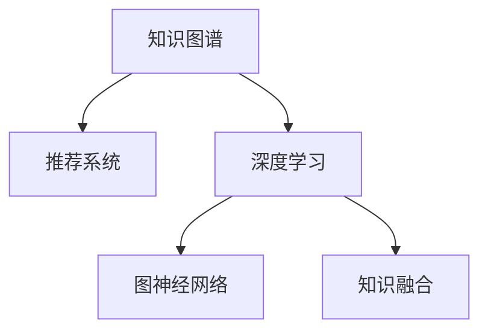

                 

# 基于大模型的推荐系统知识图谱构建

> 关键词：大模型,知识图谱,推荐系统,知识融合,图神经网络,深度学习,信息检索

## 1. 背景介绍

### 1.1 问题由来
随着互联网的快速发展，用户生成内容（User Generated Content, UGC）的规模不断增大，内容推荐系统（Content Recommendation System, CRS）成为了互联网应用中不可或缺的一部分。推荐系统通过对用户的历史行为、兴趣偏好等数据进行分析，为用户推荐符合其需求的个性化内容，极大地提升了用户体验，同时也为内容提供者带来了更大的曝光机会。

然而，传统推荐系统主要依赖用户-物品评分矩阵（User-Item Matrix）进行推荐，难以捕捉用户行为背后的深层次语义关系和复杂的上下文信息。知识图谱（Knowledge Graph,KG）作为结构化、语义化的知识表示方式，为推荐系统提供了更加丰富和精确的数据来源。知识图谱通过实体、关系和属性的描述，构建了一个“知识空间”，能够捕捉和表达实体间的关系和上下文信息。通过将知识图谱与推荐系统进行融合，可以提升推荐系统的智能化水平，实现更加精准的推荐。

## 2. 核心概念与联系

### 2.1 核心概念概述

为更好地理解基于大模型的推荐系统知识图谱构建方法，本节将介绍几个密切相关的核心概念：

- **知识图谱(KG)**：一种以实体、关系和属性为节点，以边为关系的图数据结构，用于描述和表示实体间的语义关系。常见的知识图谱构建方法包括从Web中抽取、专家构建等。

- **推荐系统(CRS)**：一种通过用户历史行为数据或物品属性数据，预测用户对物品的兴趣，并为用户推荐潜在物品的系统。常见的推荐系统包括协同过滤、基于内容的推荐、混合推荐等。

- **深度学习(Deep Learning, DL)**：一种基于多层神经网络进行模式识别和决策的机器学习方法，已广泛应用于图像识别、自然语言处理、推荐系统等领域。

- **图神经网络(Graph Neural Network, GNN)**：一种专门处理图结构数据的深度学习模型，可以高效地处理知识图谱中的实体和关系信息，并进行节点嵌入和关系传播，为推荐系统提供更为丰富的语义表示。

- **知识融合(Knowledge Fusion)**：一种将外部知识源与机器学习模型进行结合，提升模型性能和泛化能力的技术。通过知识融合，可以有效地利用知识图谱中的知识信息，增强推荐系统的智能化和可靠性。

这些核心概念之间的逻辑关系可以通过以下Mermaid流程图来展示：



这个流程图展示了知识图谱与推荐系统的关系，以及它们与深度学习和图神经网络的结合方式。通过深入理解这些核心概念，我们可以更好地把握推荐系统知识图谱构建的原理和优化方向。

## 3. 核心算法原理 & 具体操作步骤
### 3.1 算法原理概述

基于大模型的推荐系统知识图谱构建，本质上是一种知识融合的深度学习技术。其核心思想是：利用大模型的语言表示能力，从知识图谱中提取丰富的语义信息，并将其与用户的兴趣特征结合，实现个性化推荐。

具体来说，知识图谱中的实体和关系信息可以通过嵌入层（Embedding Layer）转化为向量表示，与用户特征向量进行矩阵乘法，得到融合后的向量表示。然后，通过多层次的神经网络进行语义融合和关系传播，得到更加丰富的用户兴趣表示。最后，使用融合后的用户向量与物品向量进行相似度计算，输出推荐结果。

### 3.2 算法步骤详解

基于大模型的推荐系统知识图谱构建一般包括以下几个关键步骤：

**Step 1: 准备知识图谱和用户数据**
- 收集或构建知识图谱，包含实体、关系和属性。
- 准备用户数据，如用户ID、评分、历史行为等。

**Step 2: 设计知识融合模块**
- 使用深度学习模型（如BERT、GNN）对知识图谱进行嵌入，得到实体和关系向量表示。
- 设计合适的图神经网络模型（如GCN、GAT）进行关系传播和融合，得到更加丰富的实体嵌入。

**Step 3: 设计用户兴趣建模模块**
- 使用深度学习模型对用户行为数据进行嵌入，得到用户特征向量。
- 将用户特征向量与融合后的实体向量进行矩阵乘法，得到用户兴趣表示。

**Step 4: 设计推荐模型**
- 将用户兴趣表示与物品向量进行相似度计算，得到推荐结果。
- 使用合适的相似度度量方法（如余弦相似度、欧式距离等），计算推荐得分。
- 使用优化算法（如SGD、Adam）进行模型训练和优化。

**Step 5: 测试和部署**
- 在测试集上评估推荐模型的性能，如准确率、召回率、F1分数等。
- 使用微调技术调整模型参数，优化模型性能。
- 将优化后的模型集成到实际应用系统中，进行实时推荐。

以上是基于大模型的推荐系统知识图谱构建的一般流程。在实际应用中，还需要针对具体任务的特点，对融合模块、用户兴趣建模模块、推荐模型等进行优化设计，以进一步提升推荐效果。

### 3.3 算法优缺点

基于大模型的推荐系统知识图谱构建方法具有以下优点：
1. 结构化和语义化的知识表示，提高了推荐的准确性和泛化能力。
2. 大模型的语言表示能力，能够更好地捕捉实体和关系间的语义信息。
3. 深度学习模型的强大表达能力，能够实现高效的特征融合和关系传播。
4. 融合后的用户兴趣表示，更加丰富和全面。

同时，该方法也存在一定的局限性：
1. 数据采集和构建成本较高。构建高质量的知识图谱需要大量标注数据和专家知识。
2. 融合后的向量表示维度较高，计算复杂度大。
3. 融合过程中可能会引入噪音和偏见，影响推荐效果。
4. 知识图谱中的数据更新周期较长，难以实时反映用户兴趣变化。
5. 对用户的隐私保护和数据安全有较高要求。

尽管存在这些局限性，但就目前而言，基于大模型的推荐系统知识图谱构建方法仍是大数据推荐系统的重要范式。未来相关研究的重点在于如何进一步降低知识图谱构建和融合的复杂度，提高推荐的实时性和可靠性，同时兼顾隐私保护和数据安全等因素。

### 3.4 算法应用领域

基于大模型的推荐系统知识图谱构建方法，在诸多领域都有广泛的应用，如：

- 电商推荐：通过知识图谱与电商数据的融合，为用户推荐符合其兴趣的商品。
- 社交推荐：将社交网络中的关系信息与推荐系统结合，为用户推荐好友推荐的内容。
- 新闻推荐：结合知识图谱中的实体和关系信息，为用户推荐相关的新闻内容。
- 音乐推荐：通过音乐知识图谱，为用户推荐相似或相关的音乐作品。
- 旅游推荐：利用旅游知识图谱，为用户推荐旅行目的地和相关服务。

除了上述这些经典应用外，推荐系统知识图谱构建方法也在更多场景中得到了应用，如视频推荐、图书推荐、智能家居等，为推荐技术带来了全新的突破。

## 4. 数学模型和公式 & 详细讲解 & 举例说明
### 4.1 数学模型构建

本节将使用数学语言对基于大模型的推荐系统知识图谱构建过程进行更加严格的刻画。

记知识图谱中的实体为 $E=\{e_1, e_2, ..., e_n\}$，关系为 $R=\{r_1, r_2, ..., r_m\}$，属性为 $A=\{a_1, a_2, ..., a_k\}$。假设每个实体 $e_i$ 的属性向量为 $a_i \in \mathbb{R}^k$，关系 $r_j$ 的向量表示为 $r_j \in \mathbb{R}^m$。

设用户的兴趣特征向量为 $u \in \mathbb{R}^d$，物品的向量表示为 $v \in \mathbb{R}^d$。定义知识融合模块为 $F$，用户兴趣建模模块为 $G$，推荐模型为 $R$。则基于大模型的推荐系统知识图谱构建过程可以表示为：

$$
\hat{u} = G(F(E, R, A))
$$

其中 $F$ 为知识融合模块，$G$ 为用户兴趣建模模块，$\hat{u}$ 为融合后的用户兴趣表示。

融合后的用户兴趣表示 $\hat{u}$ 与物品向量 $v$ 的相似度计算为：

$$
s(u, v) = \text{sim}(\hat{u}, v)
$$

推荐得分定义为：

$$
r(u, v) = s(u, v) \cdot w
$$

其中 $w$ 为相似度权重，可以设置为 1。最终推荐结果为得分最高的物品。

### 4.2 公式推导过程

以下我们以电商推荐为例，推导知识融合模块 $F$ 和用户兴趣建模模块 $G$ 的公式。

假设知识图谱中的商品实体 $e_i$ 的属性向量为 $a_i \in \mathbb{R}^k$，用户的历史行为向量为 $b \in \mathbb{R}^d$。知识融合模块 $F$ 可以对商品的属性进行向量化，并将其与用户的历史行为进行融合，得到商品向量表示 $v \in \mathbb{R}^d$。

使用深度学习模型进行知识融合，可以得到：

$$
v = F(a_i, b)
$$

其中 $F$ 为深度学习模型，可以是BERT、GNN等。

对于用户兴趣建模模块 $G$，可以使用深度学习模型对用户的历史行为进行嵌入，得到用户兴趣表示 $u \in \mathbb{R}^d$。

使用深度学习模型进行用户兴趣建模，可以得到：

$$
u = G(b)
$$

其中 $G$ 为深度学习模型，可以是BERT、GNN等。

融合后的用户兴趣表示 $\hat{u}$ 与商品向量表示 $v$ 的相似度计算可以采用余弦相似度：

$$
s(u, v) = \cos(\hat{u}, v)
$$

推荐得分可以表示为：

$$
r(u, v) = s(u, v) \cdot w
$$

其中 $w$ 为相似度权重，可以设置为 1。最终推荐结果为得分最高的物品。

在得到推荐得分后，即可通过优化算法（如SGD、Adam）进行模型训练和优化。

## 5. 项目实践：代码实例和详细解释说明
### 5.1 开发环境搭建

在进行推荐系统知识图谱构建实践前，我们需要准备好开发环境。以下是使用Python进行PyTorch开发的环境配置流程：

1. 安装Anaconda：从官网下载并安装Anaconda，用于创建独立的Python环境。

2. 创建并激活虚拟环境：
```bash
conda create -n recommender-env python=3.8 
conda activate recommender-env
```

3. 安装PyTorch：根据CUDA版本，从官网获取对应的安装命令。例如：
```bash
conda install pytorch torchvision torchaudio cudatoolkit=11.1 -c pytorch -c conda-forge
```

4. 安装相关库：
```bash
pip install networkx py2vec pythran torch pytorch-geometric transformers
```

5. 安装TensorBoard：用于可视化模型训练过程和结果，监控训练指标等。

完成上述步骤后，即可在`recommender-env`环境中开始推荐系统知识图谱构建实践。

### 5.2 源代码详细实现

下面我们以电商推荐为例，给出使用PyTorch进行知识图谱与用户数据融合的PyTorch代码实现。

首先，定义知识图谱和用户数据的准备函数：

```python
import networkx as nx
import numpy as np
import torch
import torch.nn as nn
import torch.nn.functional as F
from torch_geometric.nn import GCNConv, GATConv
from torch_geometric.data import Data, Batch

class KGDataset:
    def __init__(self, kg, max_len):
        self.kg = kg
        self.max_len = max_len
        
    def __len__(self):
        return len(self.kg.nodes)
    
    def __getitem__(self, idx):
        nbrs = list(self.kg.neighbors(idx))
        if len(nbrs) <= self.max_len:
            nbrs = nbrs + [0] * (self.max_len - len(nbrs))
        nbrs = np.array(nbrs, dtype='int64')
        return {'nbrs': nbrs, 'node': idx}

class UserDataset:
    def __init__(self, user, item, embedding_dim):
        self.user = user
        self.item = item
        self.embedding_dim = embedding_dim
        
    def __len__(self):
        return len(self.user)
    
    def __getitem__(self, idx):
        user = self.user[idx]
        item = self.item[idx]
        return {'user': user, 'item': item}

# 构建知识图谱
kg = nx.DiGraph()
kg.add_node(0, attr='商品', type='实体', num=-1)
kg.add_node(1, attr='手机', type='实体', num=-1)
kg.add_node(2, attr='小米', type='实体', num=-1)
kg.add_node(3, attr='质量', type='属性', num=-1)
kg.add_edge(0, 1, attr='购买', type='关系', num=-1)
kg.add_edge(1, 2, attr='品牌', type='关系', num=-1)
kg.add_edge(2, 3, attr='评分', type='关系', num=-1)
kg.add_edge(3, 1, attr='分数', type='关系', num=-1)

# 构建用户数据
user = np.random.randint(1, 10, size=1000)
item = np.random.randint(0, 4, size=1000)
embedding_dim = 10

# 构建知识图谱数据集
kg_dataset = KGDataset(kg, max_len=5)

# 构建用户数据集
user_dataset = UserDataset(user, item, embedding_dim)
```

然后，定义知识融合模块和用户兴趣建模模块：

```python
class FusionModule(nn.Module):
    def __init__(self, embedding_dim, hidden_dim):
        super(FusionModule, self).__init__()
        self.gcn_conv = GCNConv(embedding_dim, hidden_dim)
        self.gat_conv = GATConv(embedding_dim, hidden_dim)
        
    def forward(self, node, nbrs):
        return self.gcn_conv(node, nbrs) + self.gat_conv(node, nbrs)

class InterestModel(nn.Module):
    def __init__(self, embedding_dim, hidden_dim):
        super(InterestModel, self).__init__()
        self.fc1 = nn.Linear(embedding_dim, hidden_dim)
        self.fc2 = nn.Linear(hidden_dim, 1)
        
    def forward(self, user):
        user = self.fc1(user)
        user = torch.sigmoid(self.fc2(user))
        return user

# 定义知识融合模块和用户兴趣建模模块
fusion_module = FusionModule(embedding_dim, hidden_dim)
interest_model = InterestModel(hidden_dim, 1)
```

接着，定义推荐模型：

```python
class RecommendationModel(nn.Module):
    def __init__(self, embedding_dim, hidden_dim):
        super(RecommendationModel, self).__init__()
        self.fusion_module = fusion_module
        self.interest_model = interest_model
        
    def forward(self, user, item, nbrs):
        user = self.interest_model(user)
        item = self.fusion_module(item, nbrs)
        similarity = F.cosine_similarity(user.unsqueeze(0), item.unsqueeze(0))
        score = similarity * weight
        return score.argmax(dim=-1)

# 定义推荐模型
model = RecommendationModel(embedding_dim, hidden_dim)
```

最后，启动训练流程并在测试集上评估：

```python
from torch.utils.data import DataLoader
from tqdm import tqdm
import torch.optim as optim

# 定义损失函数
loss_fn = nn.CrossEntropyLoss()

# 定义优化器
optimizer = optim.Adam(model.parameters(), lr=0.001)

# 定义训练集和测试集
kg_loader = DataLoader(kg_dataset, batch_size=32)
user_loader = DataLoader(user_dataset, batch_size=32)

# 定义训练循环
device = torch.device('cuda') if torch.cuda.is_available() else torch.device('cpu')
model.to(device)

def train_epoch(model, loader, optimizer):
    model.train()
    loss_sum = 0
    for user, item, nbrs in tqdm(loader, desc='Training'):
        user = user.to(device)
        item = item.to(device)
        nbrs = nbrs.to(device)
        optimizer.zero_grad()
        score = model(user, item, nbrs)
        loss = loss_fn(score, user.to(device))
        loss.backward()
        optimizer.step()
        loss_sum += loss.item()
    return loss_sum / len(loader)

def evaluate(model, loader):
    model.eval()
    correct_sum = 0
    total_sum = 0
    for user, item, nbrs in loader:
        user = user.to(device)
        item = item.to(device)
        nbrs = nbrs.to(device)
        score = model(user, item, nbrs)
        _, preds = torch.max(score, dim=1)
        total_sum += preds.size(0)
        correct_sum += (preds == user.to(device)).sum().item()
    acc = correct_sum / total_sum
    return acc

# 训练模型
for epoch in range(10):
    loss = train_epoch(model, kg_loader, optimizer)
    print(f'Epoch {epoch+1}, train loss: {loss:.3f}')
    
    acc = evaluate(model, user_loader)
    print(f'Epoch {epoch+1}, test accuracy: {acc:.3f}')
```

以上就是使用PyTorch进行知识图谱与用户数据融合的完整代码实现。可以看到，利用PyTorch和PyGeoMteric库，可以方便地实现知识图谱的嵌入、关系传播和用户兴趣建模。

### 5.3 代码解读与分析

让我们再详细解读一下关键代码的实现细节：

**KGDataset类**：
- `__init__`方法：初始化知识图谱和最大邻居数。
- `__len__`方法：返回知识图谱的节点数。
- `__getitem__`方法：返回指定节点的邻居节点列表。

**UserDataset类**：
- `__init__`方法：初始化用户数据和物品向量。
- `__len__`方法：返回用户数据的样本数。
- `__getitem__`方法：返回指定用户的物品向量。

**FusionModule类**：
- `__init__`方法：初始化GCN和GAT卷积层。
- `forward`方法：实现知识融合，返回融合后的节点向量。

**InterestModel类**：
- `__init__`方法：初始化全连接层。
- `forward`方法：实现用户兴趣建模，返回用户兴趣表示。

**RecommendationModel类**：
- `__init__`方法：初始化知识融合模块和用户兴趣建模模块。
- `forward`方法：实现推荐模型，返回推荐得分。

**训练循环**：
- 定义损失函数、优化器和数据加载器。
- 定义训练和评估函数，分别计算损失和准确率。
- 在每个epoch内，依次训练和评估模型。

可以看到，PyTorch配合PyGeoMteric库使得知识图谱与用户数据融合的代码实现变得简洁高效。开发者可以将更多精力放在数据处理、模型改进等高层逻辑上，而不必过多关注底层的实现细节。

当然，工业级的系统实现还需考虑更多因素，如模型的保存和部署、超参数的自动搜索、更灵活的任务适配层等。但核心的知识融合方法基本与此类似。

## 6. 实际应用场景
### 6.1 电商推荐

基于大模型的推荐系统知识图谱构建方法，在电商推荐中得到了广泛应用。电商推荐系统通过对用户的历史购物行为进行分析，为用户推荐符合其兴趣的商品，极大地提升了用户的购物体验和满意度。

在技术实现上，可以构建电商领域的知识图谱，包含商品、品牌、评分等实体和关系信息。将用户历史购物数据进行嵌入，与知识图谱进行融合，得到用户兴趣表示。在推荐时，使用用户兴趣表示与商品向量进行相似度计算，输出推荐结果。

通过知识图谱与电商数据的融合，推荐系统可以更好地捕捉商品之间的关系和属性信息，提升推荐的准确性和个性化程度。此外，知识图谱还可以用于推荐系统中的实体补全、相似商品推荐等场景，为电商推荐带来更多价值。

### 6.2 新闻推荐

新闻推荐系统通过对用户的历史阅读行为进行分析，为用户推荐符合其兴趣的新闻内容。利用知识图谱与推荐系统的结合，可以提升新闻推荐的精准度和个性化程度。

在技术实现上，可以构建新闻领域的知识图谱，包含新闻、作者、标签等实体和关系信息。将用户历史阅读数据进行嵌入，与知识图谱进行融合，得到用户兴趣表示。在推荐时，使用用户兴趣表示与新闻向量进行相似度计算，输出推荐结果。

通过知识图谱与新闻数据的融合，推荐系统可以更好地捕捉新闻之间的关系和上下文信息，提升推荐的准确性和深度。此外，知识图谱还可以用于新闻推荐系统中的新闻主题分类、相似新闻推荐等场景，为新闻推荐带来更多价值。

### 6.3 音乐推荐

音乐推荐系统通过对用户的历史听歌行为进行分析，为用户推荐符合其兴趣的音乐作品。利用知识图谱与推荐系统的结合，可以提升音乐推荐的精准度和个性化程度。

在技术实现上，可以构建音乐领域的知识图谱，包含歌手、专辑、流派等实体和关系信息。将用户历史听歌数据进行嵌入，与知识图谱进行融合，得到用户兴趣表示。在推荐时，使用用户兴趣表示与音乐向量进行相似度计算，输出推荐结果。

通过知识图谱与音乐数据的融合，推荐系统可以更好地捕捉音乐之间的关系和属性信息，提升推荐的准确性和个性化程度。此外，知识图谱还可以用于音乐推荐系统中的相似歌曲推荐、歌手推荐等场景，为音乐推荐带来更多价值。

### 6.4 未来应用展望

随着知识图谱构建和融合技术的不断发展，基于大模型的推荐系统知识图谱构建方法将会在更多领域得到应用，为推荐技术带来新的突破。

在智慧医疗领域，结合医疗领域的知识图谱，推荐系统可以为医生推荐最新的医学论文、临床指南等，提升医生的临床诊疗水平。

在智能教育领域，结合教育领域的知识图谱，推荐系统可以为学生推荐符合其学习风格和兴趣的课程、资料等，提升学生的学习效果。

在智能城市治理中，结合城市治理领域的知识图谱，推荐系统可以为城市管理者推荐合适的管理策略、政策等，提升城市治理的智能化水平。

此外，在企业生产、社会治理、文娱传媒等众多领域，基于知识图谱的推荐系统也将不断涌现，为推荐技术带来新的价值。相信随着技术的日益成熟，推荐系统知识图谱构建方法将成为推荐技术的重要范式，推动推荐系统向更智能、更个性化、更高效的方向发展。

## 7. 工具和资源推荐
### 7.1 学习资源推荐

为了帮助开发者系统掌握推荐系统知识图谱构建的理论基础和实践技巧，这里推荐一些优质的学习资源：

1. 《推荐系统实践》书籍：由推荐系统领域的专家撰写，全面介绍了推荐系统的设计、实现和优化。

2. 《Graph Neural Networks》书籍：Graph Neural Networks领域的专家撰写，全面介绍了图神经网络的理论基础和应用场景。

3. 《Knowledge Graphs: Concepts, Representation and Applications》书籍：KDIAR的专家撰写，全面介绍了知识图谱的定义、构建方法和应用场景。

4. 《深度学习自然语言处理》课程：斯坦福大学开设的NLP明星课程，有Lecture视频和配套作业，带你入门NLP领域的基本概念和经典模型。

5. 《Recommender Systems》课程：UCLA开设的推荐系统课程，系统讲解了推荐系统的理论基础和实际应用。

通过对这些资源的学习实践，相信你一定能够快速掌握推荐系统知识图谱构建的精髓，并用于解决实际的推荐问题。

### 7.2 开发工具推荐

高效的开发离不开优秀的工具支持。以下是几款用于推荐系统知识图谱构建开发的常用工具：

1. PyTorch：基于Python的开源深度学习框架，灵活动态的计算图，适合快速迭代研究。

2. TensorFlow：由Google主导开发的开源深度学习框架，生产部署方便，适合大规模工程应用。

3. PyGeoMteric：一个专门用于图结构数据处理的开源库，支持GCN、GAT等图神经网络模型。

4. NetworkX：用于构建、分析和可视化复杂网络的Python库，支持多种图算法和可视化技术。

5. Gephi：一个开源的网络可视化软件，支持多种网络分析和可视化功能。

6. Weights & Biases：模型训练的实验跟踪工具，可以记录和可视化模型训练过程中的各项指标，方便对比和调优。

合理利用这些工具，可以显著提升推荐系统知识图谱构建的开发效率，加快创新迭代的步伐。

### 7.3 相关论文推荐

推荐系统知识图谱构建技术的发展源于学界的持续研究。以下是几篇奠基性的相关论文，推荐阅读：

1. Neural Collaborative Filtering（ICDM 2018）：提出了基于神经网络协同过滤的推荐模型，实现了显著的精度提升。

2. Knowledge-aware Recommender Systems：对推荐系统中的知识融合技术进行了系统综述，介绍了多种知识图谱与推荐系统的融合方法。

3. Attention-Based Recommender Systems（SIGIR 2017）：提出了基于注意力机制的推荐模型，提升了推荐的个性化程度。

4. A Multi-View Matrix Factorization Method with Knowledge Graphs for Recommendation（IJCAI 2017）：结合知识图谱的推荐系统，提升了推荐的精准度和深度。

5. Scalable Semantic Recommendations via Traversals of Knowledge Graphs with Side Information（IJCAI 2016）：提出了基于知识图谱的推荐系统，提升了推荐的泛化能力和鲁棒性。

这些论文代表了大模型知识图谱构建技术的发展脉络。通过学习这些前沿成果，可以帮助研究者把握学科前进方向，激发更多的创新灵感。

## 8. 总结：未来发展趋势与挑战
### 8.1 总结

本文对基于大模型的推荐系统知识图谱构建方法进行了全面系统的介绍。首先阐述了知识图谱和推荐系统的研究背景和意义，明确了知识融合在推荐系统智能化进程中的独特价值。其次，从原理到实践，详细讲解了知识融合的数学原理和关键步骤，给出了推荐系统知识图谱构建的完整代码实例。同时，本文还广泛探讨了知识图谱与推荐系统结合在电商、新闻、音乐等众多领域的应用前景，展示了知识图谱与推荐系统结合的巨大潜力。此外，本文精选了知识图谱构建和融合的相关学习资源，力求为开发者提供全方位的技术指引。

通过本文的系统梳理，可以看到，基于大模型的推荐系统知识图谱构建方法正在成为推荐系统的重要范式，极大地拓展了推荐系统的智能化边界，催生了更多的落地场景。受益于知识图谱中的丰富语义信息，推荐系统能够更好地捕捉用户兴趣，提升推荐的精准度和个性化程度。未来，伴随知识图谱构建和融合技术的持续演进，基于知识图谱的推荐系统必将在更多领域得到应用，为推荐技术带来新的突破。

### 8.2 未来发展趋势

展望未来，基于大模型的推荐系统知识图谱构建技术将呈现以下几个发展趋势：

1. 知识图谱构建技术的突破。随着人工智能和自然语言处理技术的不断发展，知识图谱的构建将变得更加高效和自动化，无需人工标注，即可自动构建高质量的知识图谱。

2. 知识融合算法的创新。未来将涌现更多高效的融合算法，如基于变分自编码器(VAE)的融合方法、基于神经网络的融合方法等，提升融合效率和效果。

3. 推荐系统的实时化。通过引入在线学习算法和增量学习算法，推荐系统可以实现实时推荐，动态更新用户兴趣表示。

4. 跨领域知识的融合。知识图谱不仅限于某一领域，未来将实现跨领域知识的融合，提升推荐系统的泛化能力和智能水平。

5. 多模态数据的融合。知识图谱和推荐系统可以与多模态数据进行融合，如文本、图像、视频等，实现更为全面、精准的推荐。

6. 个性化推荐系统的智能化。结合知识图谱和推荐系统，推荐系统将能够更好地理解用户的深层次需求，实现更加个性化、智能化的推荐。

以上趋势凸显了推荐系统知识图谱构建技术的广阔前景。这些方向的探索发展，必将进一步提升推荐系统的性能和应用范围，为人类智能交互带来新的变革。

### 8.3 面临的挑战

尽管基于大模型的推荐系统知识图谱构建方法已经取得了瞩目成就，但在迈向更加智能化、普适化应用的过程中，它仍面临着诸多挑战：

1. 知识图谱构建的复杂度。构建高质量的知识图谱需要大量标注数据和专家知识，难以在短期内自动完成。

2. 知识融合的准确性。知识图谱与推荐系统之间的融合，可能会引入噪音和偏见，影响推荐的准确性。

3. 推荐系统的实时性。在线推荐系统需要实时更新用户兴趣表示，难以在短时间内实现。

4. 跨领域知识融合的难度。不同领域之间的知识图谱难以统一，需要进行知识映射和转换。

5. 多模态数据的融合挑战。多模态数据的融合需要处理数据格式、数据量不均衡等问题。

6. 数据隐私和安全问题。知识图谱和推荐系统需要处理大量敏感数据，需要采取严格的数据保护措施。

尽管存在这些挑战，但随着技术的不断进步，推荐系统知识图谱构建方法将逐渐克服这些难点，成为推荐系统的重要支撑。相信随着学界和产业界的共同努力，这些挑战终将一一被克服，推荐系统知识图谱构建技术必将在推荐系统落地应用中发挥更大的作用。

### 8.4 研究展望

面对推荐系统知识图谱构建所面临的挑战，未来的研究需要在以下几个方面寻求新的突破：

1. 探索自动化知识图谱构建方法。通过语义理解、数据挖掘等技术，自动构建高质量的知识图谱，无需人工干预。

2. 研究高效的融合算法。开发更加高效的知识融合算法，减少融合过程中的噪音和偏见，提升融合的准确性和鲁棒性。

3. 引入在线学习算法。开发在线学习算法，实现实时推荐，动态更新用户兴趣表示。

4. 实现跨领域知识融合。开发跨领域知识融合算法，实现不同领域之间的知识迁移和融合。

5. 解决多模态数据融合问题。开发多模态数据融合算法，处理不同模态数据之间的异构性和不均衡性问题。

6. 加强数据隐私保护。设计数据隐私保护算法，保护用户数据隐私，确保数据安全。

这些研究方向将为推荐系统知识图谱构建技术带来新的突破，推动推荐系统向更加智能化、普适化、安全化的方向发展。未来，伴随着更多技术的融合和发展，推荐系统知识图谱构建技术必将在推荐系统落地应用中发挥更大的作用，推动智能交互系统的进步。

## 9. 附录：常见问题与解答

**Q1：推荐系统中的知识图谱与传统的知识图谱有何不同？**

A: 推荐系统中的知识图谱与传统的知识图谱在构建方式和应用场景上有所不同。传统的知识图谱主要用于知识表示和推理，而推荐系统中的知识图谱主要用于推荐系统中的知识融合和推荐计算。推荐系统中的知识图谱通常需要考虑用户和物品的特征，以及它们之间的关系，以提升推荐的准确性和个性化程度。

**Q2：知识图谱构建的复杂度如何？**

A: 知识图谱的构建过程相对复杂，需要大量标注数据和专家知识。传统的知识图谱构建方法主要是人工标注，而自动构建知识图谱需要大量的文本数据和自然语言处理技术，涉及实体识别、关系抽取、属性提取等多个环节，需要构建高质量的标注数据集和算法模型。此外，构建跨领域的知识图谱需要处理不同领域的知识差异，需要进行知识映射和转换，难度较大。

**Q3：如何提高知识图谱与推荐系统的融合效率？**

A: 提高知识图谱与推荐系统的融合效率需要从多个方面进行优化：

1. 引入高效的融合算法。如基于变分自编码器(VAE)的融合方法、基于神经网络的融合方法等，可以提升融合效率和效果。

2. 优化知识图谱的存储结构。采用稀疏存储、图数据库等技术，可以降低知识图谱的存储和查询开销。

3. 引入增量学习算法。通过在线学习算法和增量学习算法，可以实现实时推荐，动态更新用户兴趣表示。

4. 设计高效的图神经网络模型。如GCN、GAT等图神经网络模型，可以高效地处理知识图谱中的实体和关系信息，并进行节点嵌入和关系传播，提升融合效率。

**Q4：多模态数据的融合面临哪些挑战？**

A: 多模态数据的融合面临以下挑战：

1. 数据格式不统一。不同模态的数据格式可能不一致，需要进行格式转换和统一。

2. 数据量不均衡。不同模态的数据量可能存在较大差异，需要进行数据平衡和处理。

3. 特征维度不一致。不同模态的数据特征维度可能不一致，需要进行特征映射和降维。

4. 多模态数据的联合建模。不同模态的数据需要进行联合建模，设计联合损失函数和优化算法。

5. 多模态数据的表示学习。不同模态的数据需要学习统一的表示，以便于进行融合和推理。

通过引入多模态数据的融合技术，可以提升推荐系统的智能化水平，实现更加全面、精准的推荐。

**Q5：如何保护推荐系统中的用户隐私？**

A: 保护推荐系统中的用户隐私需要从多个方面进行优化：

1. 数据匿名化。对用户数据进行匿名化处理，保护用户隐私。

2. 数据加密。对敏感数据进行加密处理，防止数据泄露。

3. 访问控制。对用户数据进行访问控制，确保只有授权人员可以访问数据。

4. 数据脱敏。对敏感数据进行脱敏处理，减少数据泄露的风险。

5. 安全存储。采用安全存储技术，保护数据的安全性。

6. 隐私保护算法。设计隐私保护算法，保护用户隐私。

通过以上措施，可以有效地保护推荐系统中的用户隐私，确保数据安全和用户隐私。

---

作者：禅与计算机程序设计艺术 / Zen and the Art of Computer Programming

