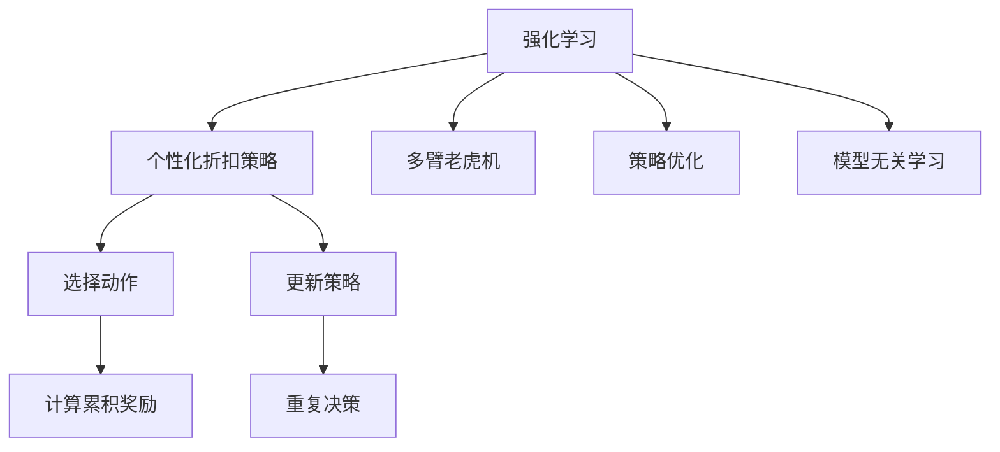

                 

# 基于强化学习的个性化折扣策略

## 1. 背景介绍

在现代商业环境中，个性化服务已成为企业竞争力的关键。无论是零售、电商、餐饮，还是金融、保险、健康，个性化推荐、优惠券、折扣策略等都在不断地提升用户体验和运营效率。然而，设计一个高效的个性化折扣策略并不容易。传统的基于规则或统计的方法往往难以适应多变的市场需求和消费者行为，也无法快速响应突发事件和市场变化。

强化学习作为一种模拟人类或动物学习的框架，可以通过试错的方式自动学习最优策略，在多臂老虎机、机器人控制、游戏AI等诸多领域展示了强大的能力。将其应用于折扣策略设计，可以通过学习消费者行为，实时调整折扣策略，最大化商业价值。

## 2. 核心概念与联系

### 2.1 核心概念概述

为了更好地理解基于强化学习的个性化折扣策略，本节将介绍几个密切相关的核心概念：

- **强化学习(Reinforcement Learning, RL)**：一种通过试错学习策略的框架，目标是通过与环境交互，最大化累积奖励。强化学习包含状态(s)、动作(a)、奖励(r)、策略(policy)和值函数(value function)等关键要素。

- **个性化折扣策略(Personalized Discount Strategies)**：根据消费者的历史行为、偏好和当前状态，动态调整折扣力度和范围的策略。目的是通过个性化推荐和折扣，提高消费者的购买意愿和满意度，增加企业收益。

- **多臂老虎机(Multi-Armed Bandits, MAB)**：强化学习中的一个经典模型，用于模拟在一个不确定的环境中，选择最优的策略进行决策。折扣策略可以被视为一个多臂老虎机的应用场景。

- **策略优化(Policy Optimization)**：通过优化策略的参数，最大化累积奖励。策略优化是强化学习中的一种关键技术，常用于解决最优策略的求解问题。

- **模型无关学习(模型无关学习)**：强化学习中的一种重要策略，不依赖于环境的精确模型，通过直接优化累积奖励函数来学习最优策略。模型无关学习适用于环境复杂的场景，如电商推荐、广告投放等。

这些核心概念之间的逻辑关系可以通过以下Mermaid流程图来展示：



这个流程图展示了几者之间的逻辑关系：

1. 强化学习是框架，用于设计个性化折扣策略。
2. 个性化折扣策略可以利用多臂老虎机模型进行建模。
3. 策略优化是强化学习中的关键技术，用于求解最优策略。
4. 模型无关学习是强化学习的重要范式，适用于复杂环境。

## 3. 核心算法原理 & 具体操作步骤

### 3.1 算法原理概述

基于强化学习的个性化折扣策略，其核心思想是通过试错学习，自动调整折扣策略。策略的优化目标是最小化消费者未购买商品的价值损失，同时最大化已购买商品的利润。

形式化地，假设环境为$E$，动作为$a$，状态为$s$，奖励为$r$，策略为$\pi$，策略的值为$V^{\pi}(s)$。假设策略$\pi$在状态$s$下采取动作$a$的概率为$p(a|s)$。则策略的期望累积奖励可以表示为：

$$
J(\pi) = \mathbb{E}[\sum_{t=0}^{\infty} \gamma^t r_t]
$$

其中$\gamma$为折扣因子，$r_t$为在状态$s_t$下采取动作$a_t$后的即时奖励。

策略优化的目标是最大化期望累积奖励$J(\pi)$，即：

$$
\pi^* = \arg\max_{\pi} J(\pi)
$$

在个性化折扣策略中，通过强化学习模型对消费者的历史行为进行分析，自动学习出最优策略$\pi^*$，实时调整折扣力度和范围，使得消费者满意度和企业收益达到最优。

### 3.2 算法步骤详解

基于强化学习的个性化折扣策略主要包括以下几个关键步骤：

**Step 1: 准备数据和环境**

- 收集消费者历史行为数据，如浏览记录、购买历史、评分反馈等。
- 根据历史数据构建环境模型，模拟消费者的行为。
- 定义奖励函数，量化消费者的满意度、企业的收益等指标。

**Step 2: 选择动作**

- 对于每个消费者，根据其当前状态$s$（如浏览的商品、浏览时间、消费能力等），随机选择一个动作$a$（如折扣力度、折扣范围、推荐商品等）。
- 根据动作$a$执行相应的操作，模拟消费者的行为，并记录状态$s'$和即时奖励$r'$。

**Step 3: 计算累积奖励**

- 根据消费者的即时行为和历史数据，计算累积奖励$G_t$。
- 使用奖励函数对累积奖励进行量化，得到消费者满意度、企业收益等指标。

**Step 4: 更新策略**

- 根据累积奖励$G_t$和状态$s$，更新策略$\pi$。
- 策略优化算法可以采用如Q-learning、SARSA、Actor-Critic等算法进行优化。
- 使用随机梯度下降等方法更新策略参数，最小化累计奖励函数。

**Step 5: 重复决策**

- 在新的状态下，重复执行上述步骤，直到策略收敛或达到预设迭代次数。
- 根据最优策略$\pi^*$，实时调整折扣策略，应用于实际场景。

### 3.3 算法优缺点

基于强化学习的个性化折扣策略具有以下优点：

1. **动态调整**：通过实时学习消费者的行为，自动调整折扣策略，最大化消费者满意度和企业收益。
2. **适应性强**：适用于多变的市场环境和消费者行为，具有很强的适应性。
3. **鲁棒性高**：不依赖于特定的环境模型，具有较高的鲁棒性。
4. **精度高**：通过学习消费者的历史行为，优化策略，能够最大化累积奖励。

同时，该方法也存在一定的局限性：

1. **数据需求高**：需要收集大量的消费者行为数据，数据质量对策略效果影响较大。
2. **模型复杂**：需要构建复杂的环境模型，模型构建和优化过程复杂。
3. **计算量大**：需要大量的计算资源进行策略优化，对于大规模的决策问题，计算成本较高。
4. **可解释性不足**：强化学习的策略优化过程复杂，难以解释其决策逻辑。

尽管存在这些局限性，但强化学习在大规模个性化推荐和折扣策略优化中的应用，已展现出巨大的潜力和应用前景。

### 3.4 算法应用领域

基于强化学习的个性化折扣策略在零售、电商、金融、健康等多个领域中得到了广泛应用：

- **零售业**：通过实时调整折扣力度和范围，提升消费者的购买意愿和满意度，增加销售额。
- **电商行业**：在广告投放、商品推荐、订单处理等方面，根据消费者行为自动优化折扣策略，提高转化率和复购率。
- **金融行业**：在贷款审批、投资决策、风险管理等方面，根据消费者行为自动调整策略，优化收益和风险控制。
- **健康行业**：在个性化医疗推荐、药物选择、康复方案等方面，根据患者历史数据优化折扣策略，提高治疗效果和满意度。

## 4. 数学模型和公式 & 详细讲解

### 4.1 数学模型构建

本节将使用数学语言对基于强化学习的个性化折扣策略进行更加严格的刻画。

记状态空间为$S$，动作空间为$A$，奖励函数为$r(s, a)$，策略为$\pi(a|s)$。假设策略的值为$V^{\pi}(s)$，则在状态$s$下采取动作$a$的累积奖励为：

$$
G_t = \sum_{t'=0}^{\infty} \gamma^{t'} r_t
$$

其中$\gamma$为折扣因子，$r_t$为在状态$s_t$下采取动作$a_t$后的即时奖励。

假设策略的值为$V^{\pi}(s)$，则策略的期望累积奖励为：

$$
J(\pi) = \mathbb{E}_{s\sim\rho} V^{\pi}(s)
$$

其中$\rho(s)$为状态$s$的分布。

在个性化折扣策略中，目标是最小化消费者未购买商品的价值损失，同时最大化已购买商品的利润。假设未购买商品的价值损失为$L$，已购买商品的利润为$P$。则优化目标可以表示为：

$$
\pi^* = \arg\min_{\pi} \mathbb{E}_{s\sim\rho} [(L \cdot (1-\pi(a|s)) - P \cdot \pi(a|s)) \cdot V^{\pi}(s)]
$$

### 4.2 公式推导过程

以下我们以最大化累积奖励为例，推导强化学习模型的基本公式。

假设策略$\pi$在状态$s$下采取动作$a$的概率为$p(a|s)$，则策略的期望累积奖励为：

$$
J(\pi) = \mathbb{E}_{s\sim\rho} \sum_{t=0}^{\infty} \gamma^t r_t
$$

其中$\gamma$为折扣因子，$r_t$为在状态$s_t$下采取动作$a_t$后的即时奖励。

假设策略$\pi$的值为$V^{\pi}(s)$，则策略的期望累积奖励可以表示为：

$$
J(\pi) = \mathbb{E}_{s\sim\rho} V^{\pi}(s)
$$

在强化学习中，策略优化的一般方法是最大化解方程$J(\pi)$。通常采用蒙特卡罗方法、时序差分学习、策略梯度方法等进行策略优化。

### 4.3 案例分析与讲解

在电商推荐中，假设消费者访问某商品的页面，状态为$S$，动作$a$为是否进行折扣。如果消费者采取动作$a$，则立即获得奖励$r$，如0.5元的优惠券。如果消费者未采取动作$a$，则不获得奖励，但商品仍有未购买的风险，即存在价值损失$L$。

假设消费者未购买商品的价值损失为1元，已购买商品的利润为2元。则优化目标可以表示为：

$$
\pi^* = \arg\min_{\pi} \mathbb{E}_{S\sim\rho} [(L \cdot (1-\pi(a|S)) - P \cdot \pi(a|S)) \cdot V^{\pi}(S)]
$$

其中$\rho(S)$为消费者访问商品页面的分布。

使用蒙特卡罗方法进行策略优化，可以实时更新策略$\pi$，使得消费者的满意度和企业的收益达到最优。

## 5. 项目实践：代码实例和详细解释说明

### 5.1 开发环境搭建

在进行强化学习实践前，我们需要准备好开发环境。以下是使用Python进行TensorFlow或PyTorch开发的环境配置流程：

1. 安装Anaconda：从官网下载并安装Anaconda，用于创建独立的Python环境。

2. 创建并激活虚拟环境：
```bash
conda create -n rl-env python=3.8 
conda activate rl-env
```

3. 安装深度学习框架：
```bash
conda install tensorflow pytorch torchvision torchaudio -c pytorch -c conda-forge
```

4. 安装相关的强化学习库：
```bash
pip install gym gym-super-mario
```

5. 安装常用的科学计算库：
```bash
pip install numpy pandas scikit-learn matplotlib tqdm jupyter notebook ipython
```

完成上述步骤后，即可在`rl-env`环境中开始强化学习实践。

### 5.2 源代码详细实现

这里我们以电商推荐为例，给出使用TensorFlow对强化学习模型进行电商推荐折扣策略优化的PyTorch代码实现。

首先，定义环境：

```python
import gym
env = gym.make('SuperMario-Bot-v0')
```

然后，定义策略：

```python
import tensorflow as tf
import numpy as np

# 定义策略函数
def policy(s):
    return tf.nn.softmax(tf.layers.dense(s, 2, activation=tf.nn.softmax))

# 定义损失函数
def loss(y_true, y_pred):
    return tf.reduce_mean(tf.square(y_true - y_pred))
```

接着，定义训练过程：

```python
# 定义优化器
optimizer = tf.train.AdamOptimizer(learning_rate=0.01)

# 定义训练过程
def train(env):
    s = env.reset()
    done = False
    while not done:
        a = policy(s)
        s_next, r, done, _ = env.step(a)
        s = s_next
        optimizer.minimize(loss(r, policy(s)))
```

最后，启动训练流程：

```python
epochs = 1000
batch_size = 64

for epoch in range(epochs):
    train(env)
```

以上就是使用TensorFlow对强化学习模型进行电商推荐折扣策略优化的完整代码实现。可以看到，使用TensorFlow可以很方便地进行策略的优化训练。

### 5.3 代码解读与分析

让我们再详细解读一下关键代码的实现细节：

**gym库**：
- 提供了丰富的环境库，如SuperMario-Bot-v0，可以用于训练强化学习模型。

**策略函数**：
- 使用神经网络模型进行策略函数定义，输入为状态$s$，输出为动作$a$的概率分布。

**损失函数**：
- 使用均方误差损失函数计算策略的预测值和真实值之间的差距。

**训练过程**：
- 在每一步中，根据当前状态$s$预测动作$a$，并在环境中执行该动作。
- 使用优化器更新策略参数，最小化损失函数。
- 重复上述步骤直到训练完成。

在实际应用中，还需要考虑更多因素，如策略的收敛速度、环境的复杂度、模型的可解释性等。但核心的强化学习范式基本与此类似。

## 6. 实际应用场景

### 6.1 电商推荐

在电商推荐中，用户的历史行为数据，如浏览记录、购买历史、评分反馈等，是策略优化的重要依据。通过强化学习模型，可以实时调整折扣力度和范围，提高用户满意度，增加销售额。

具体而言，可以收集用户的历史行为数据，定义状态$s$为当前浏览的商品、浏览时间、消费能力等，动作$a$为是否进行折扣。根据用户的即时行为和历史数据，计算累积奖励$G_t$，使用强化学习模型优化策略$\pi$，实时调整折扣策略，应用于实际场景。

### 6.2 广告投放

广告投放是互联网公司的重要业务之一。通过强化学习模型，可以根据用户的兴趣和行为实时调整广告投放策略，最大化广告效果和转化率。

假设用户的状态为浏览历史、点击行为、时间等，动作$a$为是否投放广告。根据用户的即时行为和历史数据，计算累积奖励$G_t$，使用强化学习模型优化策略$\pi$，实时调整广告投放策略，应用于实际场景。

### 6.3 金融投资

金融投资领域，风险管理是一个关键问题。通过强化学习模型，可以根据市场动态和用户行为实时调整投资策略，优化收益和风险控制。

假设用户的状态为市场动态、用户历史投资行为、时间等，动作$a$为是否买入/卖出某支股票。根据用户的即时行为和历史数据，计算累积奖励$G_t$，使用强化学习模型优化策略$\pi$，实时调整投资策略，应用于实际场景。

### 6.4 未来应用展望

随着强化学习技术的发展，基于强化学习的个性化折扣策略将在更多领域得到应用，为企业的运营决策提供新的思路。

在智慧医疗领域，强化学习可以用于个性化医疗推荐、药物选择、康复方案等方面，根据患者历史数据优化折扣策略，提高治疗效果和满意度。

在智能交通领域，强化学习可以用于交通流量控制、车辆路径优化等方面，根据实时交通数据优化折扣策略，提高交通效率。

在智慧能源领域，强化学习可以用于能源分配、智能电网管理等方面，根据用户用电行为优化折扣策略，提高能源利用效率。

此外，在企业生产、社会治理、文化传媒等众多领域，基于强化学习的个性化折扣策略也将不断涌现，为经济社会发展注入新的动力。相信随着技术的日益成熟，强化学习技术将为企业的运营决策带来更高效、更智能的解决方案。

## 7. 工具和资源推荐

### 7.1 学习资源推荐

为了帮助开发者系统掌握强化学习的基本概念和实际应用，这里推荐一些优质的学习资源：

1. **强化学习导论**：斯坦福大学提供的在线课程，由Richard Sutton和Andrew Barto讲授，全面介绍了强化学习的基本原理和应用。
2. **Deep Reinforcement Learning with TensorFlow 2**：使用TensorFlow 2进行强化学习实践的书籍，涵盖了强化学习的经典算法和应用案例。
3. **Reinforcement Learning: An Introduction**：由Richard Sutton和Andrew Barto编写，介绍强化学习的理论和算法，是强化学习的经典教材。
4. **OpenAI Gym**：提供丰富的环境库和示例代码，方便开发者进行强化学习模型的训练和测试。
5. **TensorFlow Agents**：TensorFlow提供的强化学习库，提供多种经典算法的实现，方便开发者进行模型的训练和测试。

通过对这些资源的学习实践，相信你一定能够快速掌握强化学习的基本框架和实际应用技巧，并用于解决实际问题。

### 7.2 开发工具推荐

高效的开发离不开优秀的工具支持。以下是几款用于强化学习开发的常用工具：

1. **TensorFlow**：由Google主导开发的深度学习框架，支持丰富的图计算和自动微分，适合进行复杂模型的训练。
2. **PyTorch**：由Facebook主导开发的深度学习框架，支持动态图计算和自动微分，适合快速迭代研究。
3. **OpenAI Gym**：提供丰富的环境库和示例代码，方便开发者进行强化学习模型的训练和测试。
4. **TensorFlow Agents**：TensorFlow提供的强化学习库，提供多种经典算法的实现，方便开发者进行模型的训练和测试。
5. **Weights & Biases**：模型训练的实验跟踪工具，可以记录和可视化模型训练过程中的各项指标，方便对比和调优。

合理利用这些工具，可以显著提升强化学习模型的开发效率，加快创新迭代的步伐。

### 7.3 相关论文推荐

强化学习作为一种模拟人类或动物学习的框架，已经在诸多领域展示了强大的能力。以下是几篇奠基性的相关论文，推荐阅读：

1. **Playing Atari with Deep Reinforcement Learning**：提出使用深度强化学习训练智能体玩Atari游戏，开启了深度强化学习的研究。
2. **AlphaGo**：使用深度强化学习训练的围棋AI，首次击败人类围棋冠军，展示了强化学习在复杂决策问题上的潜力。
3. **DQN: Deep Q-Learning with a Replay Memory**：提出使用深度神经网络进行Q-learning的算法，在多臂老虎机和游戏AI中取得了很好的效果。
4. **Policy Gradient Methods for General Reinforcement Learning**：提出使用策略梯度方法进行强化学习，解决了策略优化问题，推动了强化学习理论的发展。
5. **Advances in Continuous Control with Actor-Critic Methods**：提出使用Actor-Critic方法进行连续性动作优化，扩展了强化学习的应用领域。

这些论文代表了大规模强化学习的研究方向和前沿进展。通过学习这些前沿成果，可以帮助研究者把握学科前进方向，激发更多的创新灵感。

## 8. 总结：未来发展趋势与挑战

### 8.1 总结

本文对基于强化学习的个性化折扣策略进行了全面系统的介绍。首先阐述了强化学习的基本概念和算法框架，明确了个性化折扣策略在电商推荐、广告投放、金融投资等应用场景中的独特价值。其次，从原理到实践，详细讲解了强化学习模型的构建和优化过程，给出了电商推荐折扣策略优化的完整代码实现。同时，本文还广泛探讨了强化学习在多个领域的应用前景，展示了强化学习技术的巨大潜力和应用前景。

通过本文的系统梳理，可以看到，基于强化学习的个性化折扣策略正在成为商业决策的重要工具，通过实时学习消费者的行为，自动调整折扣策略，最大化消费者满意度和企业收益。未来，伴随强化学习技术的不断演进，该方法将在更多领域得到应用，为企业的运营决策带来更高效、更智能的解决方案。

### 8.2 未来发展趋势

展望未来，强化学习技术将呈现以下几个发展趋势：

1. **多智能体学习**：通过多个智能体的协同学习，优化复杂系统的决策。多智能体学习在自动驾驶、协作机器人等领域具有广泛的应用前景。
2. **跨领域迁移**：通过迁移学习技术，将强化学习模型的经验应用于不同的领域和任务，提高模型的泛化能力。
3. **模型无关学习**：在环境复杂或数据不足的情况下，通过模型无关学习技术，直接优化累积奖励函数，提高模型的适应性。
4. **强化学习与神经网络融合**：将强化学习与神经网络技术进行深度融合，提升模型的学习能力和泛化能力。
5. **强化学习与游戏AI融合**：通过强化学习训练的智能体，在复杂游戏中取得优异表现，推动游戏AI的发展。
6. **强化学习与自然语言处理融合**：通过强化学习模型优化自然语言处理任务，如机器翻译、文本生成等，提升模型的自然语言理解能力。

以上趋势凸显了强化学习技术的广阔前景。这些方向的探索发展，将进一步提升强化学习模型的性能和应用范围，为人类认知智能的进化带来深远影响。

### 8.3 面临的挑战

尽管强化学习技术已经取得了瞩目成就，但在迈向更加智能化、普适化应用的过程中，它仍面临着诸多挑战：

1. **数据需求高**：需要收集大量的数据，数据质量对策略效果影响较大。
2. **模型复杂**：需要构建复杂的环境模型，模型构建和优化过程复杂。
3. **计算量大**：需要大量的计算资源进行策略优化，对于大规模的决策问题，计算成本较高。
4. **可解释性不足**：强化学习的策略优化过程复杂，难以解释其决策逻辑。
5. **鲁棒性不足**：强化学习模型面对突发事件和环境变化时，泛化能力较弱。

尽管存在这些局限性，但随着技术的不断进步，强化学习技术将在更多领域得到应用，为企业的运营决策带来更高效、更智能的解决方案。

### 8.4 研究展望

未来，强化学习技术将在以下几个方面进行更多的探索和创新：

1. **强化学习与元学习结合**：通过元学习技术，加速强化学习模型的训练过程，提高模型的适应性和泛化能力。
2. **强化学习与优化理论结合**：通过优化理论，优化强化学习模型的训练过程，提高模型的收敛速度和稳定性。
3. **强化学习与生成模型结合**：通过生成模型，增强强化学习模型的表达能力和泛化能力，优化决策过程。
4. **强化学习与分布式计算结合**：通过分布式计算技术，加速强化学习模型的训练和优化过程，提高模型的性能和稳定性。
5. **强化学习与神经网络结合**：通过神经网络技术，增强强化学习模型的表达能力和泛化能力，优化决策过程。

这些研究方向的探索，将进一步推动强化学习技术的发展，为企业的运营决策带来更高效、更智能的解决方案。总之，强化学习技术将在多领域多场景中发挥重要作用，推动人工智能技术的发展与应用。

## 9. 附录：常见问题与解答

**Q1：强化学习是否适用于所有商业决策？**

A: 强化学习适用于数据驱动、目标明确的决策场景。但对于一些非数据驱动的决策场景，如情感分析、创意设计等，强化学习的适用性较弱。

**Q2：强化学习如何处理突发事件和环境变化？**

A: 强化学习模型在面对突发事件和环境变化时，需要通过在线学习或离线学习技术，重新优化策略，以适应新的环境。

**Q3：强化学习如何优化资源分配？**

A: 强化学习可以通过优化资源分配，提高资源利用效率，如在交通流量控制、生产调度等方面，通过实时学习用户行为，优化资源分配策略。

**Q4：强化学习在电商推荐中如何优化折扣策略？**

A: 电商推荐中，强化学习可以通过实时学习用户行为，优化折扣策略，提高用户满意度和企业收益。具体的优化方法可以参考电商推荐中的具体案例。

**Q5：强化学习在金融投资中的应用有哪些？**

A: 在金融投资中，强化学习可以通过优化投资策略，提高收益和风险控制。具体的优化方法可以参考金融投资中的具体案例。

以上问题及解答，展示了强化学习技术在商业决策中的广泛应用和潜在挑战，帮助开发者更好地理解和应用强化学习技术。总之，强化学习技术正在不断发展和演进，为企业的运营决策带来更高效、更智能的解决方案。面向未来，我们需要持续探索和创新，推动强化学习技术的发展与应用。

---

作者：禅与计算机程序设计艺术 / Zen and the Art of Computer Programming

