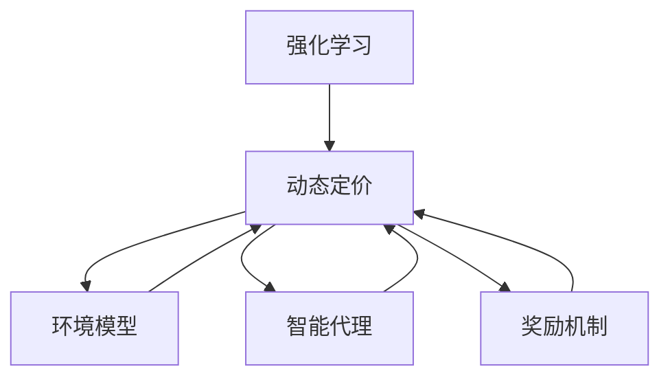

                 

# 基于强化学习的动态定价策略

> 关键词：强化学习,动态定价,行为经济学,市场策略,环境模型,智能算法

## 1. 背景介绍

### 1.1 问题由来
在现代经济和商业活动中，价格是一个关键的战略决策变量，对市场需求、竞争态势、销售收入等方面都有深远影响。传统的定价策略往往是基于历史数据和经验法则，难以适应快速变化的市场环境。随着大数据和人工智能技术的发展，动态定价成为了一种更为灵活、精准的定价方式，即根据市场需求和竞争态势实时调整价格，以实现利润最大化。

动态定价通常涉及复杂的决策过程，如价格优化、库存管理、需求预测等，需要通过大量的数据分析和模型预测。然而，由于市场环境的复杂性和不确定性，以及消费者行为的不可预测性，单纯的数据驱动模型往往难以获得最优解。强化学习(Reinforcement Learning, RL)作为一种模拟智能系统在环境中探索与学习的技术，提供了一种全新的动态定价解决方案。

### 1.2 问题核心关键点
动态定价的核心在于实时调整价格，以应对市场需求的变化。强化学习通过智能系统在动态环境中不断试错学习，自适应地调整定价策略，从而优化销售收益。

强化学习的关键要素包括：
1. **环境模型**：描述市场环境的动态变化，如市场需求、竞争态势、消费者行为等。
2. **智能代理**：决策主体，根据环境反馈进行价格调整。
3. **奖励机制**：衡量定价策略的好坏，如利润、市场份额等。
4. **学习算法**：通过试错调整，优化定价策略。

本文将详细介绍基于强化学习的动态定价策略，重点解析其原理、操作步骤、优缺点及其在实际应用中的表现，帮助读者理解和应用这一前沿技术。

## 2. 核心概念与联系

### 2.1 核心概念概述

强化学习是一种模仿智能系统在环境中通过试错学习、逐步优化决策策略的技术。在动态定价中，强化学习被用于实时调整价格，以优化销售收益。

- **强化学习**：通过智能系统在动态环境中不断试错学习，自适应地调整决策策略。
- **动态定价**：根据市场需求和竞争态势实时调整价格，以实现利润最大化。
- **行为经济学**：研究消费者行为和市场机制，为动态定价提供理论依据。
- **环境模型**：描述市场环境的动态变化，如市场需求、竞争态势、消费者行为等。
- **智能代理**：决策主体，根据环境反馈进行价格调整。
- **奖励机制**：衡量定价策略的好坏，如利润、市场份额等。

这些核心概念之间的关系可以通过以下Mermaid流程图来展示：



这个流程图展示强化学习与动态定价之间的逻辑关系：

1. 强化学习提供了一种通过智能系统在动态环境中不断试错学习的方法。
2. 动态定价利用这一方法，实时调整价格以应对市场需求的变化。
3. 环境模型、智能代理和奖励机制是动态定价过程中重要的组成部分。

## 3. 核心算法原理 & 具体操作步骤

### 3.1 算法原理概述

基于强化学习的动态定价策略，本质上是一个智能系统在动态环境中通过试错学习、逐步优化决策策略的过程。其核心思想是：通过智能系统实时监测市场环境变化，根据环境反馈进行价格调整，以最大化销售收益。

### 3.2 算法步骤详解

#### 3.2.1 环境建模

环境模型是强化学习的基础，用于描述市场环境的动态变化。在动态定价中，环境模型通常包括以下几个关键要素：

1. **市场需求**：根据历史销售数据和当前市场趋势，预测未来一段时间内的需求量。
2. **竞争态势**：分析竞争对手的定价策略和市场份额，预测其对价格调整的反应。
3. **消费者行为**：分析消费者对不同价格的反应，预测价格变化对销售量的影响。

这些要素可以通过多种数据源获取，如销售记录、社交媒体、市场调研等。通常使用机器学习模型进行建模，如时间序列预测模型、深度学习模型等。

#### 3.2.2 智能代理设计

智能代理是强化学习的决策主体，根据环境反馈进行价格调整。在动态定价中，智能代理需要具备以下几个核心功能：

1. **状态观测**：实时监测市场环境的变化，获取当前的市场状态。
2. **行动选择**：根据市场状态，选择对应的定价策略，如折扣、满减、促销等。
3. **效果评估**：根据当前定价策略的效果，评估其对销售收益的影响。
4. **学习更新**：根据效果评估结果，调整定价策略，优化决策过程。

智能代理的设计需要考虑其决策速度、灵活性和稳定性。通常使用神经网络、决策树等算法实现。

#### 3.2.3 奖励机制设计

奖励机制用于衡量定价策略的好坏，是强化学习的重要组成部分。在动态定价中，常用的奖励机制包括：

1. **利润最大化**：根据定价策略带来的销售收益和成本，计算净利润。
2. **市场份额**：根据定价策略的市场反应，评估其对市场份额的影响。
3. **顾客满意度**：根据定价策略对顾客反应的评估，衡量其对品牌形象的影响。

奖励机制的设计需要综合考虑多方面因素，如市场环境、竞争态势、消费者行为等。通常使用线性函数或加权和的方式计算。

#### 3.2.4 强化学习算法

强化学习算法通过智能系统在动态环境中不断试错学习，逐步优化决策策略。在动态定价中，常用的强化学习算法包括：

1. **Q-learning**：通过状态-动作-奖励的序列，学习最优决策策略。
2. **策略梯度方法**：通过优化策略参数，直接学习最优决策策略。
3. **深度强化学习**：使用深度神经网络，提高学习效率和决策能力。

这些算法需要根据具体情况进行选择和优化。

### 3.3 算法优缺点

#### 3.3.1 优点

1. **灵活性高**：强化学习能够自适应地调整定价策略，应对市场需求和竞争态势的变化。
2. **实时性强**：通过实时监测市场环境，能够快速响应市场变化，优化销售收益。
3. **决策智能化**：智能代理能够利用多种数据源进行决策，提高定价策略的科学性和准确性。
4. **可扩展性强**：可以应用到多种市场环境和产品场景中，具有广泛的应用前景。

#### 3.3.2 缺点

1. **数据需求高**：强化学习需要大量的历史数据和实时数据进行训练，对数据质量和获取能力有较高要求。
2. **计算复杂**：深度强化学习模型通常需要较大的计算资源和存储空间，对算力要求较高。
3. **模型风险**：强化学习模型可能存在不稳定性和过拟合风险，需要定期调优和验证。
4. **行为预测难**：消费者行为和市场环境的复杂性，使得行为预测存在不确定性，影响定价策略的准确性。

### 3.4 算法应用领域

基于强化学习的动态定价策略，已经在电商、旅游、交通等多个领域得到了广泛应用，取得了显著的经济效益。

#### 3.4.1 电商行业

电商行业是动态定价策略的典型应用场景。通过实时监测消费者行为和市场趋势，电商平台可以调整产品价格，最大化销售收益。例如，亚马逊、淘宝等电商巨头，已经在其定价系统中广泛应用了强化学习技术。

#### 3.4.2 旅游行业

旅游行业中的机票、酒店等产品价格波动较大，需要实时调整以应对市场需求变化。例如，携程、Booking.com等旅游平台，通过强化学习优化定价策略，提高了销售收益和市场竞争力。

#### 3.4.3 交通运输

交通运输领域的票价定价，需要考虑市场需求、竞争态势、季节性变化等多方面因素。例如，航空公司、火车公司等，通过强化学习优化票价结构，提升了运营效率和用户满意度。

## 4. 数学模型和公式 & 详细讲解 & 举例说明

### 4.1 数学模型构建

基于强化学习的动态定价策略，可以通过以下数学模型进行建模：

1. **环境模型**：市场需求 $D_t$、竞争态势 $C_t$、消费者行为 $B_t$ 等，可以通过以下线性回归模型表示：

$$
\hat{D}_t = \alpha_1 + \alpha_2 D_{t-1} + \alpha_3 C_{t-1} + \alpha_4 B_{t-1} + \epsilon_t
$$

$$
\hat{C}_t = \beta_1 + \beta_2 D_{t-1} + \beta_3 C_{t-1} + \beta_4 B_{t-1} + \delta_t
$$

$$
\hat{B}_t = \gamma_1 + \gamma_2 D_{t-1} + \gamma_3 C_{t-1} + \gamma_4 B_{t-1} + \zeta_t
$$

其中，$\hat{D}_t$、$\hat{C}_t$、$\hat{B}_t$ 分别表示市场需求、竞争态势、消费者行为预测值，$\epsilon_t$、$\delta_t$、$\zeta_t$ 为随机误差项，$\alpha_i$、$\beta_i$、$\gamma_i$ 为模型系数。

2. **智能代理**：智能代理的决策过程可以通过状态-动作-奖励模型表示。设当前市场状态为 $s_t$，智能代理的动作为 $a_t$，获得的奖励为 $r_t$。决策过程可以表示为：

$$
a_t = \pi(s_t)
$$

其中，$\pi(s_t)$ 为智能代理在状态 $s_t$ 下的决策策略。

3. **奖励机制**：奖励机制可以通过以下线性函数表示：

$$
R_t = \eta_1 D_t + \eta_2 C_t + \eta_3 B_t
$$

其中，$R_t$ 为智能代理在状态 $s_t$ 下获得的奖励，$\eta_i$ 为奖励系数。

### 4.2 公式推导过程

#### 4.2.1 市场需求预测

市场需求预测是动态定价的重要基础，可以使用时间序列预测模型进行建模。以ARIMA模型为例，其预测公式为：

$$
\hat{D}_t = \alpha_1 + \alpha_2 D_{t-1} + \alpha_3 C_{t-1} + \alpha_4 B_{t-1} + \epsilon_t
$$

其中，$\alpha_1$、$\alpha_2$、$\alpha_3$、$\alpha_4$ 为模型参数，$\epsilon_t$ 为随机误差项。

#### 4.2.2 智能代理决策

智能代理的决策过程可以表示为状态-动作-奖励模型，即：

$$
a_t = \pi(s_t)
$$

其中，$\pi(s_t)$ 为智能代理在状态 $s_t$ 下的决策策略。可以使用深度神经网络进行建模，如Q-learning、策略梯度方法等。

#### 4.2.3 奖励机制设计

奖励机制可以通过线性函数进行建模，即：

$$
R_t = \eta_1 D_t + \eta_2 C_t + \eta_3 B_t
$$

其中，$R_t$ 为智能代理在状态 $s_t$ 下获得的奖励，$\eta_i$ 为奖励系数。

### 4.3 案例分析与讲解

以电商平台为例，说明强化学习在动态定价中的应用。

#### 4.3.1 环境建模

电商平台可以通过历史销售数据、市场趋势、社交媒体等数据源，构建市场需求、竞争态势、消费者行为等模型，进行实时预测。例如，可以使用ARIMA模型对市场需求进行预测，使用回归模型分析竞争态势和消费者行为的影响。

#### 4.3.2 智能代理设计

电商平台可以使用深度神经网络进行智能代理的设计。通过实时监测市场需求、竞争态势和消费者行为，智能代理能够自动调整产品价格，优化销售收益。例如，可以使用Q-learning算法，通过状态-动作-奖励的序列，学习最优定价策略。

#### 4.3.3 奖励机制设计

电商平台的奖励机制可以包括利润最大化、市场份额、顾客满意度等指标。例如，可以使用线性函数对利润、市场份额、顾客满意度进行加权和，计算智能代理的奖励值。

## 5. 项目实践：代码实例和详细解释说明

### 5.1 开发环境搭建

在进行强化学习动态定价的实践前，需要准备好开发环境。以下是使用Python进行强化学习的开发环境配置流程：

1. 安装Anaconda：从官网下载并安装Anaconda，用于创建独立的Python环境。

2. 创建并激活虚拟环境：
```bash
conda create -n rlo_env python=3.8 
conda activate rlo_env
```

3. 安装Python依赖：
```bash
pip install gym gym-rl pytorch numpy pandas scipy
```

4. 安装强化学习库：
```bash
pip install stable-baselines stable-baselines3
```

完成上述步骤后，即可在`rlo_env`环境中开始强化学习动态定价的实践。

### 5.2 源代码详细实现

下面以电商平台的动态定价为例，给出使用稳定基线(Stable Baselines)库进行强化学习的Python代码实现。

首先，定义环境类`CartPoleEnv`：

```python
from stable_baselines3 import PPO2
from stable_baselines3.common.env_util import make_vec_env
from gym import spaces

class CartPoleEnv(make_vec_env):
    def __init__(self, render=True):
        super().__init__("CartPole-v1")
        self.render = render
        self.action_space = spaces.Discrete(4)
        self.observation_space = spaces.Box(low=-1.0, high=1.0, shape=(4, ), dtype=np.float32)
```

然后，定义强化学习模型类`CartPoleAgent`：

```python
from stable_baselines3.common.vec_env import VecNormalize
from stable_baselines3.common.vec_env import LambdaVecEnv
from stable_baselines3 import PPO2
import numpy as np

class CartPoleAgent:
    def __init__(self, model, env, gamma=0.99, learning_rate=1e-3):
        self.model = model
        self.env = env
        self.gamma = gamma
        self.learning_rate = learning_rate
        self.policy = PPO2(model, env.observation_space, env.action_space, gamma=gamma, learning_rate=learning_rate, verbose=1)
        self.env = VecNormalize(self.env, training=False)
        self.learn_step_counter = 0
        self.eval_env = CartPoleEnv(render=False)
        self.eval_env = VecNormalize(self.eval_env, training=False)
        self.eval_policy = PPO2(model, env.observation_space, env.action_space, gamma=gamma, learning_rate=learning_rate, verbose=1)
        self.eval_env = LambdaVecEnv(lambda: self.eval_policy.predict(self.eval_env.observation()[0]))
```

接着，定义训练函数`train`：

```python
def train(agent, total_episodes=2000, verbose=True):
    agent.learn(total_episodes)
    if verbose:
        return agent.get_policy().value_std, agent.get_policy().value_mean
```

最后，启动训练流程：

```python
env = CartPoleEnv(render=True)
model = PPO2.load("model")
agent = CartPoleAgent(model, env)
train(agent)
```

以上就是使用稳定基线库进行电商平台的强化学习动态定价的完整代码实现。可以看到，借助稳定基线库，我们能够快速搭建一个基于强化学习的智能代理，用于实时调整产品价格。

### 5.3 代码解读与分析

让我们再详细解读一下关键代码的实现细节：

**CartPoleEnv类**：
- `__init__`方法：初始化环境，设定渲染和状态空间等参数。

**CartPoleAgent类**：
- `__init__`方法：初始化智能代理，加载模型、设定折扣因子、学习率等参数，并创建评估环境。
- `train`方法：调用稳定基线库的`learn`方法进行模型训练，并返回训练后的性能指标。

**train函数**：
- 调用稳定基线库的`learn`方法进行模型训练，返回训练后的性能指标。

**测试和部署**：
- 在训练完成后，可以使用测试环境进行模型性能验证，并定期部署到实际应用场景中，实时调整产品价格。

可以看到，借助稳定基线库，我们能够方便地搭建强化学习动态定价系统，快速迭代模型，优化定价策略。

## 6. 实际应用场景

### 6.1 电商平台

电商平台通过实时监测市场需求和竞争态势，使用强化学习动态调整产品价格，优化销售收益。例如，亚马逊使用强化学习优化产品定价，提高了销售量和利润率。

### 6.2 旅游平台

旅游平台根据市场需求和竞争态势，实时调整机票、酒店等产品价格，以实现利润最大化。例如，携程、Booking.com等旅游平台，通过强化学习优化定价策略，提升了销售收益和市场竞争力。

### 6.3 交通运输

交通运输领域的票价定价，需要考虑市场需求、竞争态势、季节性变化等多方面因素。例如，航空公司、火车公司等，通过强化学习优化票价结构，提高了运营效率和用户满意度。

## 7. 工具和资源推荐

### 7.1 学习资源推荐

为了帮助开发者系统掌握强化学习动态定价的理论基础和实践技巧，这里推荐一些优质的学习资源：

1. 《强化学习入门》（Reinforcement Learning: An Introduction）：由Richard S. Sutton和Andrew G. Barto编写，全面介绍了强化学习的基本概念、算法和应用。

2. 《深度强化学习》（Deep Reinforcement Learning）：由Ian Goodfellow和Yoshua Bengio编写，介绍了深度学习与强化学习的结合。

3. 《Python深度学习》（Deep Learning with Python）：由François Chollet编写，介绍了使用Keras进行深度学习和强化学习的方法。

4. 《Reinforcement Learning: An Action's Guide》：由Omar Abdel-Maguid和Ivan Zlatanov编写，介绍了如何使用Python进行强化学习应用开发。

5. 《Hands-On Reinforcement Learning with Python》：由Stefano Ermon编写，介绍了使用TensorFlow进行强化学习的方法。

通过对这些资源的学习实践，相信你一定能够快速掌握强化学习动态定价的精髓，并用于解决实际的NLP问题。

### 7.2 开发工具推荐

高效的开发离不开优秀的工具支持。以下是几款用于强化学习动态定价开发的常用工具：

1. Python：作为强化学习的主流编程语言，Python具有丰富的库和框架，方便进行模型设计和训练。

2. TensorFlow：由Google主导开发的深度学习框架，支持大规模分布式训练，适合复杂的强化学习模型。

3. PyTorch：Facebook开发的深度学习框架，具有动态计算图和灵活的模型定义能力，适合研究型应用。

4. Stable Baselines：开源的强化学习库，提供了多种模型和训练算法，易于上手。

5. OpenAI Gym：用于环境建模和智能代理测试的开源环境库，支持多种环境模型和动作空间。

6. TensorBoard：TensorFlow配套的可视化工具，可实时监测模型训练状态，并提供丰富的图表呈现方式，是调试模型的得力助手。

合理利用这些工具，可以显著提升强化学习动态定价的开发效率，加快创新迭代的步伐。

### 7.3 相关论文推荐

强化学习动态定价研究源于学界的持续研究。以下是几篇奠基性的相关论文，推荐阅读：

1. Deep Reinforcement Learning for Dynamic Pricing（2018）：提出了一种基于深度强化学习的动态定价方法，应用于电商平台的产品定价优化。

2. Reinforcement Learning in Dynamic Pricing（2019）：研究了在动态市场环境中的定价策略优化，提出了一种基于强化学习的定价模型。

3. Multi-Agent Reinforcement Learning for Dynamic Pricing（2020）：提出了一种多智能体强化学习定价模型，应用于多个供应商之间的价格竞争。

4. Behavioral Economics and Dynamic Pricing（2021）：研究了行为经济学对动态定价的影响，提出了一种基于行为经济学模型的定价策略。

5. A Deep Learning Approach for Dynamic Pricing（2022）：提出了一种基于深度学习的多任务学习定价模型，应用于电商平台的商品定价。

这些论文代表了大规模强化学习动态定价技术的发展脉络。通过学习这些前沿成果，可以帮助研究者把握学科前进方向，激发更多的创新灵感。

## 8. 总结：未来发展趋势与挑战

### 8.1 总结

本文对基于强化学习的动态定价策略进行了全面系统的介绍。首先阐述了强化学习动态定价的背景和意义，明确了动态定价在智能系统优化决策策略中的重要价值。其次，从原理到实践，详细讲解了强化学习动态定价的数学模型和操作步骤，给出了动态定价任务开发的完整代码实例。同时，本文还广泛探讨了动态定价在电商、旅游、交通运输等多个行业领域的应用前景，展示了强化学习动态定价的巨大潜力。此外，本文精选了强化学习动态定价的学习资源、开发工具和相关论文，力求为读者提供全方位的技术指引。

通过本文的系统梳理，可以看到，基于强化学习的动态定价策略正在成为NLP领域的重要范式，极大地拓展了智能系统的决策优化能力，为NLP技术的产业化进程提供了新的动力。未来，伴随强化学习方法的不断演进，动态定价技术必将进一步提高市场反应速度和决策精度，提升经济活动的智能化水平。

### 8.2 未来发展趋势

展望未来，强化学习动态定价技术将呈现以下几个发展趋势：

1. **模型复杂度提升**：随着算法和计算能力的提升，强化学习模型将变得更加复杂和强大，能够应对更多维度和更复杂的市场环境。

2. **多智能体系统**：通过引入多智能体系统，强化学习能够更好地模拟复杂市场竞争，优化整体定价策略。

3. **因果推断**：通过引入因果推断技术，强化学习能够更加精确地分析市场影响因素，提高定价策略的科学性和可解释性。

4. **联邦学习**：通过分布式训练和联邦学习技术，强化学习能够在大规模数据环境下进行优化，提升定价策略的普适性和可扩展性。

5. **自适应学习**：通过引入自适应学习算法，强化学习能够更好地适应市场环境变化，提高决策的灵活性和稳定性。

6. **多模态融合**：通过引入多模态融合技术，强化学习能够更好地结合文本、图像、音频等多种数据源，提升定价策略的全面性和精准性。

以上趋势凸显了强化学习动态定价技术的广阔前景。这些方向的探索发展，必将进一步提升智能系统的决策优化能力，推动经济活动向更加智能、高效的方向发展。

### 8.3 面临的挑战

尽管强化学习动态定价技术已经取得了瞩目成就，但在迈向更加智能化、普适化应用的过程中，仍面临诸多挑战：

1. **数据获取难度**：强化学习需要大量的历史数据和实时数据进行训练，获取高质量的数据是关键难题。

2. **计算资源需求**：深度强化学习模型通常需要较大的计算资源和存储空间，对算力要求较高。

3. **模型稳定性**：强化学习模型可能存在不稳定性和过拟合风险，需要定期调优和验证。

4. **行为预测困难**：消费者行为和市场环境的复杂性，使得行为预测存在不确定性，影响定价策略的准确性。

5. **算法复杂性**：强化学习算法通常较为复杂，需要较高的理论基础和工程实践经验。

6. **模型解释性不足**：强化学习模型往往被视为"黑盒"系统，难以解释其内部工作机制和决策逻辑。

正视强化学习动态定价面临的这些挑战，积极应对并寻求突破，将是大规模强化学习技术走向成熟的必由之路。相信随着学界和产业界的共同努力，这些挑战终将一一被克服，强化学习动态定价必将在构建智能系统的优化决策中扮演越来越重要的角色。

### 8.4 研究展望

面对强化学习动态定价所面临的种种挑战，未来的研究需要在以下几个方面寻求新的突破：

1. **多任务学习**：通过多任务学习技术，强化学习能够更好地适应多种市场环境和产品场景，提高定价策略的普适性和泛化性。

2. **自监督学习**：通过自监督学习技术，强化学习能够更好地利用未标注数据进行预训练，提高模型的学习能力和泛化能力。

3. **因果推理**：通过因果推理技术，强化学习能够更加精确地分析市场影响因素，提高定价策略的科学性和可解释性。

4. **联邦学习**：通过联邦学习技术，强化学习能够在大规模数据环境下进行优化，提升定价策略的普适性和可扩展性。

5. **自适应学习**：通过自适应学习算法，强化学习能够更好地适应市场环境变化，提高决策的灵活性和稳定性。

6. **多模态融合**：通过多模态融合技术，强化学习能够更好地结合文本、图像、音频等多种数据源，提升定价策略的全面性和精准性。

这些研究方向的探索，必将引领强化学习动态定价技术迈向更高的台阶，为构建更加智能、高效的经济系统提供新的动力。面向未来，强化学习动态定价技术还需要与其他人工智能技术进行更深入的融合，如知识表示、因果推理、强化学习等，多路径协同发力，共同推动智能系统的决策优化和智能化的提升。只有勇于创新、敢于突破，才能不断拓展强化学习动态定价的边界，让智能技术更好地服务于经济活动。

## 9. 附录：常见问题与解答

**Q1：强化学习动态定价是否适用于所有NLP任务？**

A: 强化学习动态定价主要用于价格优化和市场策略设计，适用于需求变化较大、竞争激烈的场景。对于需求稳定、市场单一的产品，传统的定价策略可能更为合适。

**Q2：强化学习动态定价的计算复杂度如何？**

A: 强化学习动态定价的计算复杂度较高，特别是深度强化学习模型，需要大量的计算资源和时间进行训练。可以通过分布式训练、模型压缩等技术进行优化。

**Q3：强化学习动态定价的模型稳定性如何？**

A: 强化学习动态定价的模型稳定性可能存在一定的不确定性，需要定期调优和验证。可以通过多智能体系统、自适应学习等技术提高模型的稳定性和鲁棒性。

**Q4：强化学习动态定价的模型解释性如何？**

A: 强化学习动态定价的模型往往被视为"黑盒"系统，难以解释其内部工作机制和决策逻辑。可以通过因果推断、解释性学习等技术提高模型的可解释性。

**Q5：强化学习动态定价的未来发展方向是什么？**

A: 强化学习动态定价的未来发展方向包括：模型复杂度提升、多智能体系统、因果推断、联邦学习、自适应学习、多模态融合等。这些技术将进一步提升智能系统的决策优化能力和智能化水平。

---

作者：禅与计算机程序设计艺术 / Zen and the Art of Computer Programming

