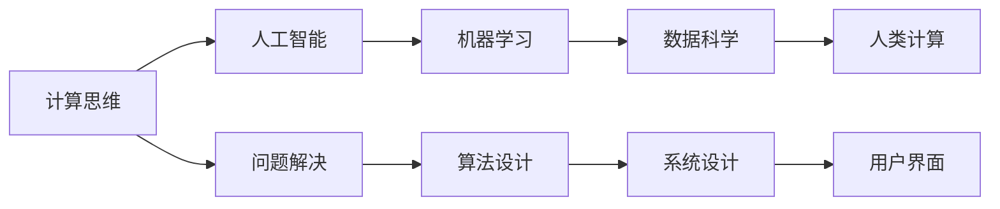

                 

# 塑造未来世界：人类计算如何改变我们的生活

> 关键词：计算思维, 人工智能, 机器学习, 数据科学, 人类计算

## 1. 背景介绍

### 1.1 问题由来
在现代社会中，计算和数据无处不在，人类生活和工作的方方面面都与计算技术紧密相关。从日常生活中的智能手机应用，到科学研究中的大数据分析，再到工业生产中的智能制造，计算技术已经成为推动社会进步的核心驱动力。然而，计算技术的演变并非一帆风顺，其中既有成功，也有挑战。

### 1.2 问题核心关键点
计算技术的发展可以分为以下几个关键阶段：

- **机械计算时代**：早期的计算设备如机械计算器，功能简单，仅能进行基本的加减乘除运算。
- **电子计算机时代**：电子管、晶体管等技术的引入使得计算机可以实现复杂的逻辑运算和存储大量数据。
- **互联网时代**：互联网的普及使得数据共享和计算资源得以有效整合，促进了云计算和大数据技术的发展。
- **人工智能时代**：深度学习、机器学习等技术的发展，使得计算机具备了初步的自我学习能力和智能决策能力。

计算技术的发展不仅改变了人类的生活方式，也深刻影响了各个行业的运作模式。例如，电商平台通过推荐算法个性化推荐商品，金融行业利用量化模型进行风险控制，医疗行业采用医疗影像分析技术辅助诊断等。但计算技术的发展也带来了新的挑战，如数据隐私保护、计算资源分配不均、算法偏见等问题。

### 1.3 问题研究意义
了解计算技术的发展历程和未来趋势，对于把握技术变革、应对挑战具有重要意义：

1. **推动技术创新**：掌握计算技术的演变路径，可以帮助我们预见未来可能出现的技术突破，从而提前布局，抢占先机。
2. **指导行业应用**：了解计算技术在不同领域的应用，可以为相关行业的从业者提供方向指引，促进技术在实际生产中的落地应用。
3. **提升素养教育**：计算思维和技能是未来人才必备的能力之一，通过了解计算技术的发展历程，可以提升公众的计算素养和科技意识。
4. **应对社会挑战**：计算技术在带来便利的同时，也带来了新的挑战，如数据隐私、算法偏见等，掌握计算技术的原理和应用，有助于我们更好地应对这些挑战。

## 2. 核心概念与联系

### 2.1 核心概念概述

在探讨计算技术如何改变我们的生活之前，首先需要明确几个核心概念：

- **计算思维**：指以问题为导向，通过分析和解决问题，设计出高效、可行的计算方案的能力。计算思维强调逻辑推理、算法设计和问题建模。
- **人工智能(AI)**：利用机器学习、深度学习等技术，使计算机具备类似人类的智能决策和问题解决能力。
- **机器学习(ML)**：指利用数据训练模型，使模型能够从数据中学习规律，并进行预测或分类。
- **数据科学(Data Science)**：融合统计学、机器学习和计算机科学，通过数据驱动的方式解决实际问题。
- **人类计算(Human-Computer Interaction, HCI)**：研究如何通过计算技术改善人类与计算机的交互方式，提升用户体验。

这些概念之间有着密切的联系，共同构成了计算技术的基石。通过理解这些核心概念，可以更好地把握计算技术如何影响我们的生活和工作。

### 2.2 核心概念原理和架构的 Mermaid 流程图



这个流程图展示了计算技术核心概念之间的联系和演变路径。从问题解决开始，经过算法设计和系统设计，最终通过用户界面实现计算功能的可视化，提升了人类与计算设备的交互体验。

## 3. 核心算法原理 & 具体操作步骤

### 3.1 算法原理概述

人类计算的核心在于将复杂问题分解为可计算的任务，并通过算法和数据模型进行求解。以下将详细介绍几种典型的计算算法原理：

- **排序算法**：如快速排序、归并排序等，用于对数据进行有序排列，以便于查找和处理。
- **搜索算法**：如深度优先搜索、广度优先搜索等，用于在图或树结构中查找目标节点。
- **图算法**：如最短路径算法、最小生成树算法等，用于求解网络中节点之间的最短距离和连接路径。
- **优化算法**：如线性规划、整数规划等，用于在满足约束条件下，最大化或最小化目标函数。
- **机器学习算法**：如回归分析、分类算法等，用于从数据中学习规律，并进行预测或分类。

### 3.2 算法步骤详解

以机器学习中的线性回归算法为例，介绍其实现步骤：

1. **数据准备**：收集与预测目标变量相关的特征数据，并进行预处理，如缺失值填补、特征归一化等。
2. **模型训练**：使用训练集数据，通过最小二乘法等方法计算线性回归模型的参数。
3. **模型评估**：使用测试集数据对模型进行评估，计算误差指标，如均方误差、均方根误差等。
4. **模型优化**：根据评估结果，调整模型参数，进一步提升模型性能。
5. **模型应用**：将优化后的模型应用于实际问题，进行预测或分类。

### 3.3 算法优缺点

机器学习算法的优点包括：

- **高效性**：能够自动从数据中学习规律，快速进行预测和分类。
- **泛化能力**：在处理新数据时，具有较强的泛化能力，能够适应多种数据分布。
- **可扩展性**：通过增加数据和优化算法，可以不断提升模型性能。

然而，机器学习算法也存在一些缺点：

- **数据依赖**：模型的性能高度依赖于数据质量，数据偏差可能导致模型性能下降。
- **过拟合风险**：在训练数据过少的情况下，模型容易发生过拟合，泛化能力变差。
- **解释性不足**：黑箱模型难以解释其内部工作机制，缺乏透明度。

### 3.4 算法应用领域

机器学习算法广泛应用于各个领域，如：

- **金融领域**：利用机器学习模型进行风险评估、信用评分、欺诈检测等。
- **医疗领域**：通过机器学习模型进行疾病诊断、治疗方案推荐等。
- **零售领域**：使用推荐算法个性化推荐商品，提升用户购物体验。
- **制造业**：采用机器学习模型进行质量控制、设备预测性维护等。
- **自然语言处理(NLP)**：利用机器学习模型进行文本分类、情感分析、机器翻译等。

## 4. 数学模型和公式 & 详细讲解 & 举例说明

### 4.1 数学模型构建

以线性回归为例，数学模型构建如下：

设数据集为 $\{(x_i, y_i)\}_{i=1}^n$，其中 $x_i \in \mathbb{R}^p$ 为输入特征向量，$y_i \in \mathbb{R}$ 为输出变量，线性回归模型可表示为：

$$
y_i = \theta_0 + \theta_1x_{i1} + \theta_2x_{i2} + \cdots + \theta_px_{ip} + \epsilon_i
$$

其中 $\theta = [\theta_0, \theta_1, \ldots, \theta_p]^T$ 为模型参数，$\epsilon_i$ 为误差项。

### 4.2 公式推导过程

在线性回归中，模型的参数估计通常通过最小二乘法求解。给定训练集数据 $\{(x_i, y_i)\}_{i=1}^n$，最小二乘法的目标函数为：

$$
J(\theta) = \frac{1}{2}\sum_{i=1}^n(y_i - \theta_0 - \theta_1x_{i1} - \cdots - \theta_px_{ip})^2
$$

求解目标函数的最小值，得到最优参数 $\hat{\theta} = [\hat{\theta}_0, \hat{\theta}_1, \ldots, \hat{\theta}_p]^T$，使得：

$$
\hat{\theta} = (\mathbf{X}^T\mathbf{X})^{-1}\mathbf{X}^Ty
$$

其中 $\mathbf{X} = [1, x_{i1}, \ldots, x_{ip}]^T$ 为设计矩阵。

### 4.3 案例分析与讲解

假设我们有一组数据，用于预测房价，如：

| 房屋面积（m²） | 房间数量 | 房价（万元） |
| --- | --- | --- |
| 90 | 3 | 800 |
| 120 | 4 | 1000 |
| 150 | 2 | 900 |
| 80 | 2 | 600 |

我们使用线性回归模型进行房价预测。首先，构建设计矩阵 $\mathbf{X} = \begin{bmatrix} 1 & 90 & 3 \\ 1 & 120 & 4 \\ 1 & 150 & 2 \\ 1 & 80 & 2 \end{bmatrix}$，目标变量向量 $\mathbf{y} = \begin{bmatrix} 800 \\ 1000 \\ 900 \\ 600 \end{bmatrix}$。

通过求解目标函数，得到最优参数 $\hat{\theta} = \begin{bmatrix} 456.25 \\ -7.0833 \\ 78.3333 \end{bmatrix}$，模型表达式为：

$$
y = 456.25 + (-7.0833)x_1 + 78.3333x_2
$$

通过该模型，我们可以预测新的房屋面积和房间数量下的房价，如100m²，3个房间的房屋房价为：

$$
y = 456.25 - 7.0833 \times 100 + 78.3333 \times 3 = 736.25
$$

## 5. 项目实践：代码实例和详细解释说明

### 5.1 开发环境搭建

在进行机器学习项目开发前，需要准备开发环境。以下是使用Python进行Scikit-learn开发的環境配置流程：

1. 安装Anaconda：从官网下载并安装Anaconda，用于创建独立的Python环境。

2. 创建并激活虚拟环境：
```bash
conda create -n ml-env python=3.8 
conda activate ml-env
```

3. 安装必要的库：
```bash
pip install numpy pandas scikit-learn matplotlib seaborn jupyter notebook ipython
```

4. 安装必要的依赖：
```bash
conda install -c conda-forge python-graphviz
```

5. 使用Jupyter Notebook进行交互式开发：
```bash
jupyter notebook
```

### 5.2 源代码详细实现

下面以线性回归为例，展示Scikit-learn库的使用：

```python
from sklearn.linear_model import LinearRegression
from sklearn.datasets import load_boston
from sklearn.model_selection import train_test_split

# 加载波士顿房价数据集
data = load_boston()
X = data.data
y = data.target

# 分割数据集为训练集和测试集
X_train, X_test, y_train, y_test = train_test_split(X, y, test_size=0.3, random_state=42)

# 创建线性回归模型并训练
model = LinearRegression()
model.fit(X_train, y_train)

# 使用测试集评估模型性能
score = model.score(X_test, y_test)
print(f"R² score: {score:.2f}")
```

### 5.3 代码解读与分析

上述代码实现了线性回归模型在Scikit-learn库中的应用。具体步骤如下：

- **数据加载**：使用`load_boston`函数加载波士顿房价数据集，获取特征矩阵和目标变量。
- **数据分割**：使用`train_test_split`函数将数据集分割为训练集和测试集，便于模型训练和评估。
- **模型创建与训练**：创建`LinearRegression`模型对象，使用训练集数据进行模型训练。
- **模型评估**：使用测试集数据评估模型性能，输出R²分数。

## 6. 实际应用场景

### 6.1 智能推荐系统

智能推荐系统是机器学习在零售领域的重要应用之一。通过分析用户的历史行为数据，推荐算法能够为用户推荐可能感兴趣的商品或服务。例如，电子商务平台可以使用协同过滤、内容推荐、混合推荐等算法，提升用户购物体验。

### 6.2 金融风控

金融行业面临的风险管理挑战包括信用评分、欺诈检测、风险预测等。机器学习模型可以帮助金融机构在分析大量数据后，更准确地进行风险评估和决策。例如，使用随机森林、梯度提升树等模型，可以对客户的信用评分进行预测，提前识别潜在风险。

### 6.3 医疗影像分析

在医疗影像分析中，机器学习模型可以用于自动检测和分类影像中的病变区域。例如，使用卷积神经网络(CNN)模型，可以对CT、MRI等影像数据进行分析，检测出肿瘤、病变等异常情况，辅助医生进行诊断和治疗决策。

### 6.4 未来应用展望

未来，机器学习的应用将更加广泛，涵盖更多领域和行业。随着计算能力的提升和数据量的增加，机器学习将能够解决更复杂的问题，提升决策的准确性和效率。例如，在自动驾驶、智能制造、智能家居等领域，机器学习算法将发挥越来越重要的作用。

## 7. 工具和资源推荐

### 7.1 学习资源推荐

- **《Python机器学习》书籍**：由Sebastian Raschka撰写，详细介绍了机器学习的基本概念和算法，适合初学者和进阶者阅读。
- **Coursera《机器学习》课程**：由Andrew Ng主讲的经典课程，覆盖了机器学习的基本原理和算法，适合入门和进阶学习。
- **Kaggle竞赛平台**：提供大量的机器学习竞赛数据集和案例，适合实践和比赛锻炼。
- **GitHub开源项目**：如TensorFlow、Scikit-learn等，提供了大量的机器学习算法实现和代码示例，适合学习和研究。

### 7.2 开发工具推荐

- **PyTorch**：基于Python的开源深度学习框架，支持动态图和静态图，适合研究和应用。
- **TensorFlow**：由Google主导的开源框架，支持分布式计算和GPU加速，适合大规模工程应用。
- **Scikit-learn**：基于Python的机器学习库，提供了丰富的算法和工具，适合研究和应用。
- **Jupyter Notebook**：交互式开发环境，支持Python、R等多种语言，适合数据处理和算法实现。

### 7.3 相关论文推荐

- **《机器学习导论》书籍**：周志华所著，详细介绍了机器学习的基本概念和算法，适合学习者阅读。
- **《深度学习》书籍**：Ian Goodfellow等作者，介绍了深度学习的原理和应用，适合进阶学习。
- **《模式识别与机器学习》书籍**：Christopher Bishop所著，详细介绍了机器学习的基本理论和方法，适合学术研究。

## 8. 总结：未来发展趋势与挑战

### 8.1 总结

本文从计算思维的角度，探讨了计算技术如何改变我们的生活和工作。首先，介绍了计算技术的发展历程和未来趋势，强调了计算思维的重要性。其次，从核心算法原理到实际操作步骤，详细讲解了机器学习的应用实现。最后，通过实际应用场景，展示了机器学习在各行各业中的广泛应用。

通过本文的系统梳理，可以看到，计算技术已经成为推动社会进步的核心驱动力，其未来发展趋势值得关注。但计算技术在发展过程中也面临着诸多挑战，如何应对这些挑战，是未来研究的重要方向。

### 8.2 未来发展趋势

未来，计算技术将继续深化应用，改变人类的生活方式：

1. **计算普惠化**：计算设备将更加普及，智能终端、可穿戴设备等将成为日常生活的一部分，提升生活便捷性。
2. **数据共享与协作**：数据共享与协作平台将进一步发展，提升数据利用效率和研究深度。
3. **边缘计算**：边缘计算技术将逐步普及，提升数据处理效率和网络传输速度。
4. **量子计算**：量子计算技术的发展，将带来计算能力的飞跃提升，解决更复杂的问题。
5. **人工智能伦理**：人工智能伦理问题将逐步受到关注，引导技术发展的健康方向。

### 8.3 面临的挑战

尽管计算技术带来了诸多便利，但也面临着以下挑战：

1. **数据隐私与安全**：数据隐私和安全问题将逐步受到重视，如何保护用户数据隐私，避免数据泄露和滥用，将是未来研究的重要方向。
2. **算法偏见与公平性**：机器学习算法可能存在偏见，导致不公平的结果，如何消除偏见，提升算法公平性，仍需深入研究。
3. **计算资源分配**：计算资源的不均衡分配问题，可能导致资源浪费和不公平。如何优化资源分配，提升计算资源的利用效率，将是未来研究的重点。
4. **技术可解释性**：计算技术的"黑箱"特性，使得其决策过程难以解释，缺乏透明度。如何提升计算技术的可解释性，增强用户信任，将是未来研究的重要方向。

### 8.4 研究展望

面向未来，计算技术的研发需从以下几个方面进行探索：

1. **普适化计算**：发展更加普适化的计算技术，使其能够应用于更多场景和领域，提升计算技术的普及性和适用性。
2. **自动化计算**：发展自动化计算技术，通过算法和工具，简化计算过程，提升计算效率和精度。
3. **智能化计算**：发展智能化计算技术，通过学习算法，提升计算结果的智能性和可解释性。
4. **协作化计算**：发展协作化计算技术，通过分布式计算和协同计算，提升计算资源的利用效率。
5. **伦理化计算**：发展伦理化计算技术，关注计算技术的社会影响，引导其健康发展。

## 9. 附录：常见问题与解答

**Q1：什么是计算思维？**

A: 计算思维指以问题为导向，通过分析和解决问题，设计出高效、可行的计算方案的能力。计算思维强调逻辑推理、算法设计和问题建模。

**Q2：如何避免机器学习中的过拟合问题？**

A: 避免过拟合问题的方法包括：数据增强、正则化、早停策略、模型集成等。其中，数据增强和正则化是常用的方法。数据增强通过增加数据的多样性，防止模型对训练数据的过度拟合。正则化通过限制模型复杂度，避免模型过度拟合。

**Q3：机器学习在实际应用中面临哪些挑战？**

A: 机器学习在实际应用中面临的挑战包括数据隐私和安全问题、算法偏见和公平性问题、计算资源分配问题、技术可解释性问题等。这些问题需要在技术开发、应用实践和社会伦理等多方面进行综合考虑和解决。

**Q4：未来计算技术的发展趋势是什么？**

A: 未来计算技术的发展趋势包括计算普惠化、数据共享与协作、边缘计算、量子计算、人工智能伦理等。这些趋势将进一步改变人类的生活方式和工作方式，提升社会的智能化和信息化水平。

**Q5：如何提升计算技术的可解释性？**

A: 提升计算技术的可解释性可以通过以下方法：模型可视化、可解释性算法、后处理解释技术等。模型可视化通过可视化计算过程，帮助用户理解模型决策逻辑。可解释性算法通过设计解释模型，提升模型的透明性。后处理解释技术通过在模型输出后进行处理，提供对模型的进一步解释。

---

作者：禅与计算机程序设计艺术 / Zen and the Art of Computer Programming

