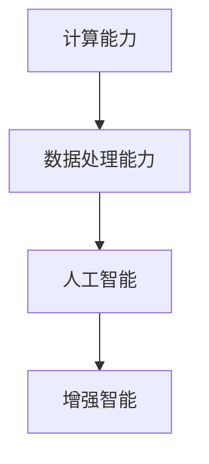

                 

# 增强智能：人类计算如何推动创新

> 关键词：人类计算，增强智能，AI与计算，计算创新，未来技术趋势

## 1. 背景介绍

在当今数字化时代，计算技术的快速发展深刻地改变了人类的工作、学习和娱乐方式。从个人设备到云端服务，计算能力已经渗透到我们生活的方方面面，推动了人类文明的进步和创新。

### 1.1 计算技术的历史回顾

计算技术的发展可以追溯到1940年代末的电子管计算机时代。随着集成电路和微处理器的出现，计算能力以指数级速度增长。到21世纪初，个人电脑、互联网和企业级服务器等计算设备已经普及，计算能力进入了“大爆炸”时代。

近年来，人工智能(AI)技术的兴起，特别是深度学习和大数据技术的发展，极大地加速了计算技术的创新和应用。AI技术通过大量数据和复杂算法，使得计算设备能够模拟人类智能行为，应用于图像识别、自然语言处理、推荐系统等众多领域。

### 1.2 增强智能的概念

增强智能是指通过计算技术增强人类智慧，使人类能够更高效、更智能地完成复杂任务。这不仅包括通过AI技术辅助决策和自动化处理，还涵盖在多个领域内，如医疗、教育、交通、金融等，通过计算技术提供精准的决策支持和全面的数据分析。

## 2. 核心概念与联系

### 2.1 核心概念概述

为了更好地理解增强智能的原理和应用，我们首先需要理解以下几个核心概念：

- **计算能力**：指计算机设备执行特定任务所需的时间资源。计算能力越强，任务执行速度越快。
- **数据处理能力**：指计算机设备对大量数据进行存储、处理和分析的能力。数据处理能力越强，数据挖掘和分析的深度和广度越大。
- **人工智能**：通过算法和模型模拟人类智能，实现自主决策和任务执行的能力。AI的核心在于通过数据和计算模型，让机器学习人类行为和知识。
- **增强智能**：通过计算能力增强人类智慧，使人类能够更高效、更智能地完成任务。增强智能的实现依赖于AI技术和数据处理能力。

这些概念之间的联系可以通过以下Mermaid流程图来展示：



这个流程图展示了计算能力、数据处理能力和人工智能如何共同作用，推动增强智能的发展。

## 3. 核心算法原理 & 具体操作步骤
### 3.1 算法原理概述

增强智能的核心算法原理基于以下几个关键步骤：

1. **数据采集与处理**：从各种来源收集数据，并经过清洗、标注和预处理，确保数据的质量和可用性。
2. **模型训练**：使用大量标注数据训练AI模型，使其能够学习到特定任务的知识和规律。
3. **模型部署**：将训练好的AI模型部署到特定的计算环境中，使其能够执行实际任务。
4. **效果评估与优化**：通过评估模型的实际表现，发现问题并优化模型，以提高其性能和准确性。

### 3.2 算法步骤详解

#### 3.2.1 数据采集与处理

数据采集与处理是增强智能系统的第一步。数据可以从多个渠道收集，如传感器、社交媒体、电子文档等。数据处理包括数据清洗、去重、归一化、特征提取等步骤，确保数据的质量和可用性。

数据清洗：去除数据中的噪声、错误和不一致，确保数据准确性。

数据归一化：将不同来源的数据格式统一，使其适用于后续处理。

特征提取：从原始数据中提取出有用的信息，用于模型的训练和预测。

#### 3.2.2 模型训练

模型训练是增强智能系统的核心。常用的AI模型包括决策树、随机森林、神经网络等。这些模型通过大量标注数据训练，学习到特定任务的知识和规律。

模型训练通常分为以下几个步骤：

1. **数据分割**：将数据集分为训练集、验证集和测试集，用于模型训练、调参和评估。
2. **模型选择**：根据任务特点选择合适的模型，并进行超参数调优。
3. **模型训练**：使用训练集对模型进行训练，优化模型参数。
4. **模型评估**：在验证集上评估模型性能，防止过拟合。
5. **模型优化**：根据评估结果，调整模型参数和训练策略，提高模型性能。

#### 3.2.3 模型部署

模型部署是将训练好的模型应用到实际环境中的过程。这一步需要考虑模型的性能、计算资源和应用场景等因素。

模型部署通常包括以下几个步骤：

1. **模型优化**：针对实际应用场景，对模型进行优化，提高其性能和效率。
2. **模型打包**：将模型和相关代码打包，便于部署和使用。
3. **环境适配**：将模型部署到特定的计算环境中，如云计算平台、嵌入式设备等。
4. **性能评估**：在实际应用场景中评估模型的性能，确保其满足实际需求。

#### 3.2.4 效果评估与优化

效果评估与优化是增强智能系统的最后一步。通过对模型的实际表现进行评估，发现问题并优化模型，以提高其性能和准确性。

效果评估通常包括以下几个步骤：

1. **数据集准备**：准备用于评估的数据集，包括标注数据和测试数据。
2. **模型评估**：在测试集上评估模型的性能，使用各种评估指标如准确率、召回率、F1分数等。
3. **问题发现**：根据评估结果，发现模型存在的问题，如欠拟合、过拟合等。
4. **模型优化**：调整模型参数和训练策略，优化模型性能。
5. **结果验证**：再次在测试集上验证模型性能，确保优化效果。

### 3.3 算法优缺点

增强智能的核心算法具有以下优点：

1. **高效性**：通过计算技术，能够高效地处理大量数据和复杂任务，提高人类工作和生活效率。
2. **准确性**：通过AI模型训练，能够实现高精度的数据分析和预测，减少人为误差。
3. **可扩展性**：增强智能系统可以随着计算资源和数据量的增加，不断扩展其能力和应用范围。
4. **灵活性**：通过模型训练和优化，可以适应不同的应用场景和需求，实现个性化定制。

同时，增强智能算法也存在以下缺点：

1. **高成本**：增强智能系统的开发和维护需要大量计算资源和专业知识，成本较高。
2. **数据依赖**：模型的训练和优化依赖于大量标注数据，数据质量对模型性能有重要影响。
3. **隐私风险**：增强智能系统需要收集和处理大量数据，可能涉及用户隐私和数据安全问题。
4. **模型复杂性**：增强智能模型的训练和优化过程复杂，需要专业知识和技术支持。

### 3.4 算法应用领域

增强智能技术在多个领域得到了广泛应用，包括但不限于：

1. **医疗健康**：通过AI模型分析医疗数据，辅助医生进行诊断和治疗，提高医疗效率和准确性。
2. **金融服务**：利用AI模型进行风险评估、欺诈检测和投资策略分析，提升金融服务质量。
3. **智能交通**：通过计算技术优化交通流量，提高交通效率和安全性。
4. **教育培训**：通过AI模型进行个性化学习推荐和智能辅导，提高学习效果和效率。
5. **制造业**：利用AI模型进行质量检测和生产优化，提高生产效率和产品质量。
6. **能源管理**：通过AI模型进行能源需求预测和优化调度，提高能源利用效率。

## 4. 数学模型和公式 & 详细讲解 & 举例说明

### 4.1 数学模型构建

增强智能的核心算法涉及多个数学模型，包括线性回归、逻辑回归、神经网络等。这里以线性回归模型为例，介绍增强智能的数学模型构建。

线性回归模型的目标是最小化预测值和实际值之间的差异，通常使用均方误差(MSE)作为损失函数。

设训练集为 $(x_i, y_i)$，其中 $x_i$ 为输入特征，$y_i$ 为实际值。线性回归模型的目标函数为：

$$
L(w, b) = \frac{1}{2m} \sum_{i=1}^m (y_i - w \cdot x_i - b)^2
$$

其中 $w$ 为权重向量，$b$ 为偏置项，$m$ 为训练样本数量。

### 4.2 公式推导过程

线性回归模型的训练过程分为以下几个步骤：

1. **初始化**：随机初始化权重向量 $w$ 和偏置项 $b$。
2. **前向传播**：将训练集输入模型，计算预测值 $\hat{y_i} = w \cdot x_i + b$。
3. **计算损失**：计算预测值和实际值之间的差异，即损失函数 $L(w, b)$。
4. **反向传播**：计算损失函数对权重和偏置的梯度，更新模型参数。
5. **重复迭代**：重复执行前向传播和反向传播，直到收敛。

使用梯度下降算法进行参数更新，更新公式为：

$$
w_{t+1} = w_t - \alpha \frac{\partial L(w, b)}{\partial w}
$$

$$
b_{t+1} = b_t - \alpha \frac{\partial L(w, b)}{\partial b}
$$

其中 $\alpha$ 为学习率，控制更新步长。

### 4.3 案例分析与讲解

#### 案例一：基于线性回归的房价预测

假设有一个房屋租赁市场，目标是预测房屋的租金价格。收集了多个房屋的特征数据，如房屋面积、地理位置、房间数量等，以及对应的租金价格。

使用线性回归模型进行训练，构建房价预测系统。模型输入为房屋特征 $x_i$，输出为租金价格 $\hat{y_i}$。通过训练集 $(x_i, y_i)$，最小化均方误差，得到最优的权重向量 $w$ 和偏置项 $b$。在测试集上验证模型性能，使用均方误差作为评估指标。

#### 案例二：基于神经网络的情感分析

情感分析是自然语言处理(NLP)中的一项重要任务，目标是从文本中识别情感倾向。使用神经网络模型进行训练，构建情感分析系统。模型输入为文本特征 $x_i$，输出为情感类别 $y_i$。通过训练集 $(x_i, y_i)$，最小化交叉熵损失，得到最优的模型参数。在测试集上验证模型性能，使用准确率和召回率作为评估指标。

## 5. 项目实践：代码实例和详细解释说明

### 5.1 开发环境搭建

增强智能系统的开发需要搭建合适的计算环境。以下是使用Python进行TensorFlow开发的开发环境配置流程：

1. 安装Anaconda：从官网下载并安装Anaconda，用于创建独立的Python环境。

2. 创建并激活虚拟环境：
```bash
conda create -n tf-env python=3.8 
conda activate tf-env
```

3. 安装TensorFlow：根据CUDA版本，从官网获取对应的安装命令。例如：
```bash
conda install tensorflow -c tensorflow
```

4. 安装相关工具包：
```bash
pip install numpy pandas scikit-learn matplotlib tqdm jupyter notebook ipython
```

完成上述步骤后，即可在`tf-env`环境中开始增强智能系统的开发。

### 5.2 源代码详细实现

下面以线性回归模型为例，给出使用TensorFlow进行房价预测的Python代码实现。

```python
import tensorflow as tf
import numpy as np

# 创建TensorFlow会话
with tf.Session() as sess:

    # 准备数据
    x_train = np.array([[1.0], [2.0], [3.0], [4.0]])
    y_train = np.array([[2.0], [3.0], [4.0], [5.0]])

    # 定义模型
    x = tf.placeholder(tf.float32, shape=(None, 1))
    y = tf.placeholder(tf.float32, shape=(None, 1))
    w = tf.Variable(tf.random_normal([1]))
    b = tf.Variable(tf.random_normal([1]))
    y_pred = w * x + b

    # 定义损失函数
    loss = tf.reduce_mean(tf.square(y_pred - y))

    # 定义优化器
    optimizer = tf.train.GradientDescentOptimizer(learning_rate=0.01).minimize(loss)

    # 初始化变量
    sess.run(tf.global_variables_initializer())

    # 训练模型
    for i in range(1000):
        sess.run(optimizer, feed_dict={x: x_train, y: y_train})

    # 输出模型参数
    w_value = sess.run(w)
    b_value = sess.run(b)

    # 预测房价
    x_test = np.array([[5.0], [6.0], [7.0], [8.0]])
    y_test = sess.run(y_pred, feed_dict={x: x_test})
    print(y_test)
```

### 5.3 代码解读与分析

让我们再详细解读一下关键代码的实现细节：

**TensorFlow会话**：
- 使用`with tf.Session() as sess`创建TensorFlow会话，在会话中定义和训练模型。

**数据准备**：
- `x_train`和`y_train`为训练数据集，分别表示房屋特征和租金价格。

**模型定义**：
- `x`和`y`为占位符，分别表示模型输入和输出。
- `w`和`b`为权重和偏置项，使用`tf.Variable`创建。
- `y_pred`为预测值，根据输入特征计算得到。

**损失函数定义**：
- `loss`为均方误差损失，使用`tf.reduce_mean`计算所有样本的平均损失。

**优化器定义**：
- `optimizer`为梯度下降优化器，使用`tf.train.GradientDescentOptimizer`创建。

**变量初始化**：
- `sess.run(tf.global_variables_initializer())`初始化所有变量。

**模型训练**：
- 在循环中，使用`sess.run(optimizer, feed_dict={x: x_train, y: y_train})`更新模型参数，训练模型。

**模型参数输出**：
- `sess.run(w)`和`sess.run(b)`分别输出权重和偏置项的值。

**房价预测**：
- `x_test`为测试数据集，`y_test`为预测结果。

可以看出，TensorFlow提供了一系列的API和工具，使得模型训练和部署变得简单易用。开发者可以根据具体任务，选择适当的模型和算法，进行快速迭代和优化。

## 6. 实际应用场景

### 6.1 智能推荐系统

智能推荐系统是增强智能技术的重要应用场景之一。通过计算技术，可以分析用户行为数据，预测用户兴趣，生成个性化的推荐内容。

在电商领域，智能推荐系统可以根据用户浏览历史、购买记录和搜索行为，推荐相关商品。通过计算用户行为特征和商品属性，构建推荐模型，实时更新推荐结果，提高用户满意度和转化率。

### 6.2 智慧医疗

智慧医疗是增强智能技术的另一个重要应用场景。通过计算技术，可以辅助医生进行疾病诊断和治疗，提高医疗效率和质量。

在医疗领域，智能推荐系统可以根据病人的历史病例和当前症状，推荐可能的诊断和治疗方法。通过分析病人数据，构建预测模型，实时监控病人健康状况，提供个性化的医疗建议。

### 6.3 智能交通

智能交通是增强智能技术的典型应用场景之一。通过计算技术，可以优化交通流量，提高交通效率和安全性。

在交通领域，智能推荐系统可以根据实时交通数据和路况信息，推荐最优的行车路线和交通管理策略。通过计算交通流量和车辆速度，构建预测模型，实时调整交通信号灯和路况信息，缓解交通拥堵。

## 7. 工具和资源推荐

### 7.1 学习资源推荐

为了帮助开发者系统掌握增强智能的理论基础和实践技巧，这里推荐一些优质的学习资源：

1. 《深度学习》系列书籍：由机器学习领域的权威学者撰写，全面介绍了深度学习的理论基础和应用技术。
2. 《TensorFlow官方文档》：TensorFlow的官方文档，提供了详细的API和示例代码，是TensorFlow学习的必备资源。
3. 《Kaggle数据科学竞赛》：Kaggle是世界上最大的数据科学竞赛平台，提供了丰富的数据集和竞赛题目，可以锻炼数据分析和建模能力。
4. 《自然语言处理入门》课程：斯坦福大学开设的NLP入门课程，有Lecture视频和配套作业，适合初学者入门。
5. 《计算智能》系列博客：深度学习领域的知名博客，提供最新的研究成果和技术文章，帮助开发者保持技术前沿。

通过对这些资源的学习实践，相信你一定能够快速掌握增强智能的精髓，并用于解决实际的计算问题。

### 7.2 开发工具推荐

高效的开发离不开优秀的工具支持。以下是几款用于增强智能开发的常用工具：

1. TensorFlow：由Google主导开发的开源深度学习框架，生产部署方便，适合大规模工程应用。
2. PyTorch：基于Python的开源深度学习框架，灵活易用，适合快速迭代研究。
3. Keras：高层次的深度学习框架，易于上手，适合初学者快速入门。
4. Weights & Biases：模型训练的实验跟踪工具，可以记录和可视化模型训练过程中的各项指标，方便对比和调优。
5. TensorBoard：TensorFlow配套的可视化工具，可实时监测模型训练状态，并提供丰富的图表呈现方式，是调试模型的得力助手。
6. Jupyter Notebook：交互式开发环境，支持Python代码的实时执行和输出，适合开发和研究。

合理利用这些工具，可以显著提升增强智能系统的开发效率，加快创新迭代的步伐。

### 7.3 相关论文推荐

增强智能技术的发展源于学界的持续研究。以下是几篇奠基性的相关论文，推荐阅读：

1. "Deep Learning"（深度学习）：Yoshua Bengio、Ian Goodfellow和Aaron Courville合著的经典书籍，全面介绍了深度学习的理论基础和应用技术。
2. "TensorFlow: A System for Large-Scale Machine Learning"：Google的研究论文，介绍了TensorFlow的设计和实现，是TensorFlow学习的必备资源。
3. "Deep Architectures for Large-Scale Classification of Natural Scenes"：由Alex Krizhevsky等人发表的论文，介绍了AlexNet模型，是深度学习领域的经典成果。
4. "Improving Generalization with Noisy Labels"：由John Platt等人发表的论文，介绍了通过噪声标签提高模型泛化能力的思路，是增强智能研究的经典论文之一。
5. "Semi-Supervised Learning with Deep Generative Models"：由Ian Goodfellow等人发表的论文，介绍了通过生成模型提高半监督学习效果的思路，是增强智能研究的重要论文。

这些论文代表了大语言模型微调技术的发展脉络。通过学习这些前沿成果，可以帮助研究者把握学科前进方向，激发更多的创新灵感。

## 8. 总结：未来发展趋势与挑战

### 8.1 总结

本文对增强智能技术进行了全面系统的介绍。首先阐述了增强智能的概念和计算技术的历史发展，明确了计算能力、数据处理能力和人工智能如何共同作用，推动增强智能的发展。其次，从原理到实践，详细讲解了增强智能的算法原理和操作步骤，给出了增强智能任务开发的完整代码实例。同时，本文还广泛探讨了增强智能技术在多个领域的应用前景，展示了增强智能技术的巨大潜力。

通过本文的系统梳理，可以看到，增强智能技术正在成为计算技术的重要范式，极大地拓展了计算设备的应用边界，催生了更多的落地场景。受益于大规模数据的预处理和深度学习的强大能力，增强智能系统能够高效处理各种复杂任务，提高人类工作和生活效率。未来，伴随计算资源和数据量的不断增长，增强智能技术必将在更多领域得到应用，为人类生产生活方式带来深远影响。

### 8.2 未来发展趋势

展望未来，增强智能技术将呈现以下几个发展趋势：

1. **计算能力持续增长**：随着计算资源和计算技术的不断进步，计算设备的能力将持续增长，处理更加复杂、高维的数据将变得更加容易。
2. **数据质量提升**：随着数据采集和处理技术的不断进步，数据质量将得到提升，增强智能系统的决策将更加精准。
3. **模型优化加速**：随着模型训练和优化技术的不断进步，增强智能系统的性能将不断提高，处理速度将显著加快。
4. **跨领域融合**：随着不同领域的计算技术不断融合，增强智能系统将具备更加强大的综合能力，能够处理多领域任务。
5. **边缘计算普及**：随着边缘计算技术的普及，增强智能系统将能够实时处理数据，提供更加高效的服务。

以上趋势凸显了增强智能技术的广阔前景。这些方向的探索发展，必将进一步提升增强智能系统的性能和应用范围，为人类生产生活方式带来深远影响。

### 8.3 面临的挑战

尽管增强智能技术已经取得了瞩目成就，但在迈向更加智能化、普适化应用的过程中，它仍面临着诸多挑战：

1. **数据隐私问题**：增强智能系统需要收集和处理大量数据，可能涉及用户隐私和数据安全问题。如何在保护数据隐私的同时，提高系统性能，是一个重要的挑战。
2. **计算资源瓶颈**：尽管计算能力持续增长，但处理大规模、高维数据仍然需要大量的计算资源。如何在资源有限的情况下，提高系统性能，是一个重要的研究方向。
3. **模型鲁棒性问题**：增强智能模型在不同数据和场景下的鲁棒性仍然不足，如何提高模型的泛化能力，避免过拟合，是一个重要的研究方向。
4. **技术落地问题**：增强智能技术在实际应用中还需要考虑技术落地问题，如何保证系统的稳定性和可靠性，是一个重要的挑战。

### 8.4 研究展望

面对增强智能面临的种种挑战，未来的研究需要在以下几个方面寻求新的突破：

1. **数据隐私保护**：通过联邦学习、差分隐私等技术，保护用户隐私，提高数据安全。
2. **计算资源优化**：通过模型压缩、量化等技术，减少计算资源消耗，提高系统性能。
3. **模型鲁棒性提升**：通过鲁棒学习、对抗训练等技术，提高模型的泛化能力和鲁棒性。
4. **技术落地优化**：通过模型部署优化、边缘计算等技术，提高系统的稳定性和可靠性。

这些研究方向将推动增强智能技术不断进步，为人类生产生活方式带来更多创新和变革。

## 9. 附录：常见问题与解答

**Q1：增强智能的计算能力如何评估？**

A: 增强智能的计算能力可以通过以下指标来评估：
1. **执行时间**：计算任务所需的时间。
2. **吞吐量**：单位时间内处理的数据量。
3. **计算资源**：所需的计算资源，如CPU、GPU、内存等。

**Q2：增强智能的数据处理能力如何评估？**

A: 增强智能的数据处理能力可以通过以下指标来评估：
1. **数据量**：处理的数据量大小。
2. **数据质量**：数据的质量，如准确性、完整性、一致性等。
3. **数据处理速度**：数据处理的速度。

**Q3：增强智能的模型训练时间如何优化？**

A: 增强智能的模型训练时间可以通过以下方法来优化：
1. **模型压缩**：减少模型参数，提高训练速度。
2. **量化技术**：将浮点模型转为定点模型，压缩存储空间，提高计算效率。
3. **分布式训练**：将训练任务分配到多个设备上，提高训练速度。

**Q4：增强智能的系统部署和维护有哪些建议？**

A: 增强智能的系统部署和维护建议如下：
1. **模型裁剪**：去除不必要的层和参数，减小模型尺寸，提高推理速度。
2. **量化加速**：将浮点模型转为定点模型，压缩存储空间，提高计算效率。
3. **系统优化**：针对实际应用场景，优化系统性能，提高用户体验。
4. **监控告警**：实时监测系统指标，设置异常告警阈值，确保系统稳定。

这些建议可以帮助开发者提高系统性能和用户体验，确保系统稳定可靠。

**Q5：增强智能的未来的发展方向有哪些？**

A: 增强智能的未来发展方向如下：
1. **计算能力增强**：随着计算资源和计算技术的不断进步，计算能力将持续增长，处理更加复杂、高维的数据将变得更加容易。
2. **数据质量提升**：随着数据采集和处理技术的不断进步，数据质量将得到提升，增强智能系统的决策将更加精准。
3. **模型优化加速**：随着模型训练和优化技术的不断进步，增强智能系统的性能将不断提高，处理速度将显著加快。
4. **跨领域融合**：随着不同领域的计算技术不断融合，增强智能系统将具备更加强大的综合能力，能够处理多领域任务。
5. **边缘计算普及**：随着边缘计算技术的普及，增强智能系统将能够实时处理数据，提供更加高效的服务。

这些方向凸显了增强智能技术的广阔前景。这些方向的探索发展，必将进一步提升增强智能系统的性能和应用范围，为人类生产生活方式带来深远影响。

---

作者：禅与计算机程序设计艺术 / Zen and the Art of Computer Programming

