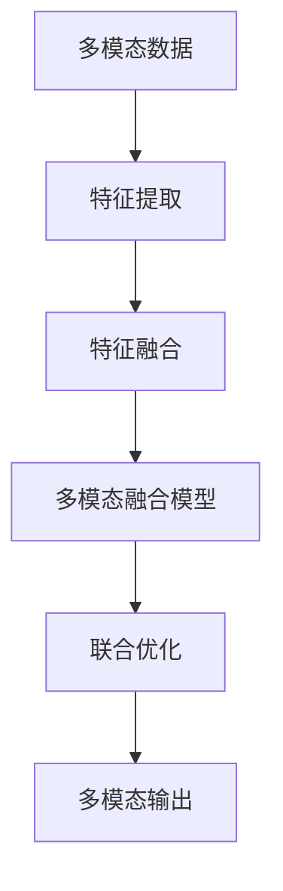

                 

# 多模态AI应用：图像、音频和视频处理

> 关键词：多模态AI, 图像处理, 音频处理, 视频处理, 深度学习, 特征融合, 自动标注, 实时处理

## 1. 背景介绍

### 1.1 问题由来

在过去的几年里，人工智能(AI)在图像、音频和视频处理领域取得了长足的进展。多模态AI技术，即结合图像、音频、视频等多种模态信息，进行综合处理的AI方法，正成为前沿研究的热点。这一领域的应用涵盖了自动驾驶、医疗影像分析、视频内容推荐、实时监测等多个方向。多模态AI技术的突破，能够显著提升各种应用场景的性能和效率，推动智能化社会的快速发展。

### 1.2 问题核心关键点

多模态AI的核心挑战在于如何高效地融合不同模态的数据信息，同时保持每个模态的高质量和相关性。核心技术点包括：

1. **跨模态特征映射**：将不同模态的信息映射到统一特征空间，以便于后续的融合和处理。
2. **多模态融合模型**：设计能够同时处理多种数据类型的深度学习模型。
3. **自监督学习**：通过无监督学习方式，学习多模态数据的潜在结构。
4. **联合优化算法**：优化不同模态模型参数，保证融合后的一致性和稳定性。

这些关键技术点，共同构成了多模态AI的研究基础，使得这一领域的研究得以突破传统图像、音频、视频处理的瓶颈，实现更全面、更智能的信息处理。

### 1.3 问题研究意义

研究多模态AI技术，对于推动AI技术的全面发展、拓展AI的应用范围具有重要意义：

1. **提升信息利用率**：多模态AI能够从不同角度捕捉信息的丰富性，从而提高信息的利用效率。
2. **增强模型的泛化能力**：通过融合多种模态的数据，可以增强模型的泛化能力，使其在更多场景中表现优异。
3. **促进技术创新**：多模态AI融合了图像、音频、视频等多种技术，能够促进跨领域的创新发展。
4. **推动产业应用**：多模态AI技术能够赋能更多产业，提升企业的智能化水平。
5. **改善用户体验**：多模态AI结合了自然语言处理(NLP)、计算机视觉(CV)等多种技术，可以提供更自然、直观的用户体验。

## 2. 核心概念与联系

### 2.1 核心概念概述

为了更好地理解多模态AI技术，我们首先介绍几个关键概念：

- **多模态数据**：指包含多种模态信息的混合数据集，如文本、图像、音频、视频等。
- **跨模态特征映射**：指将不同模态的数据映射到统一特征空间的技术，以便于进行特征融合。
- **多模态融合模型**：指能够同时处理多种模态信息的深度学习模型。
- **自监督学习**：指使用无标签数据进行预训练，学习数据内在结构的技术。
- **联合优化算法**：指同时优化多个模型参数的优化算法。

### 2.2 核心概念原理和架构的 Mermaid 流程图

以下是一个简单的Mermaid流程图，展示多模态AI技术的基本流程：



这个流程图展示了多模态AI技术的基本流程：首先对多模态数据进行特征提取，然后进行特征融合，接着使用多模态融合模型进行联合优化，最终输出多模态信息。

## 3. 核心算法原理 & 具体操作步骤
### 3.1 算法原理概述

多模态AI的算法原理主要包括以下几个步骤：

1. **数据预处理**：对不同模态的数据进行标准化、归一化等预处理，以便于后续的特征提取。
2. **特征提取**：使用深度学习模型提取每个模态的特征向量。
3. **特征融合**：将不同模态的特征向量进行融合，得到联合特征向量。
4. **多模态融合模型**：使用深度学习模型将融合后的特征向量转化为多模态输出。
5. **联合优化**：通过联合优化算法，同时更新多个模型参数。

### 3.2 算法步骤详解

以图像、音频、视频处理为例，具体介绍多模态AI的算法步骤：

#### 3.2.1 数据预处理

数据预处理包括标准化、归一化、降噪等步骤。

**标准化**：对图像数据进行像素值标准化，使其均值为0，标准差为1。
```python
from skimage.io import imread
from skimage.transform import resize
from skimage.util import normalize

img = imread('image.jpg')
img = resize(img, (224, 224))  # 调整为模型输入尺寸
img = normalize(img)  # 标准化
```

**归一化**：对音频数据进行归一化，使其在[-1, 1]范围内。
```python
import numpy as np

audio_data = np.load('audio.npy')  # 加载音频数据
audio_data = audio_data / np.max(np.abs(audio_data))  # 归一化
```

**降噪**：对视频数据进行去噪处理，去除干扰信号。
```python
import cv2

video_path = 'video.mp4'
cap = cv2.VideoCapture(video_path)
while cap.isOpened():
    ret, frame = cap.read()
    if not ret:
        break
    frame = cv2.GaussianBlur(frame, (5, 5), 0)  # 高斯模糊去噪
    # 其他视频处理逻辑
cap.release()
```

#### 3.2.2 特征提取

使用深度学习模型提取每个模态的特征向量。

**图像特征提取**：使用卷积神经网络(CNN)提取图像特征。
```python
from torchvision.models import resnet50

model = resnet50(pretrained=True)
feature = model(img.unsqueeze(0))
```

**音频特征提取**：使用卷积神经网络(CNN)或循环神经网络(RNN)提取音频特征。
```python
import librosa

audio_data, sr = librosa.load('audio.wav')
# 将音频数据转化为频谱图
spec = np.abs(np.fft.fft(audio_data))[:1024]
spec = librosa.resample(spec, sr, 8000)  # 降采样
spec = librosa.stft(spec)  # 短时傅里叶变换
spec = np.log(np.abs(spec))  # 对数变换
spec = spec.reshape(1, -1)  # 转换为一维向量
feature = model(spec)
```

**视频特征提取**：使用卷积神经网络(CNN)或3D卷积神经网络(3D CNN)提取视频特征。
```python
import numpy as np

video = np.load('video.npy')  # 加载视频数据
video = video.reshape(-1, 8, 8, 3)  # 转换为一维视频序列
video = librosa.resample(video, 8000, 16000)  # 降采样
video = video / np.max(np.abs(video))  # 归一化
feature = model(video)
```

#### 3.2.3 特征融合

将不同模态的特征向量进行融合，得到联合特征向量。

**特征拼接**：将图像、音频、视频特征拼接为一个向量。
```python
feature = np.concatenate([feature, feature, feature])
```

**特征融合**：使用注意力机制、加权平均等方法，对不同模态的特征进行融合。
```python
from torch.nn import Linear, Tanh

attention_weights = np.random.randn(3, 1)  # 随机初始化注意力权重
attention_weights = Tanh(attention_weights)  # 激活
attention_weights /= np.sum(attention_weights)  # 归一化
feature = np.dot(feature, attention_weights.T)  # 加权平均
```

#### 3.2.4 多模态融合模型

使用深度学习模型将融合后的特征向量转化为多模态输出。

**多模态融合模型**：使用多模态融合模型，将联合特征向量转化为多模态输出。
```python
from torch.nn import Sequential, Embedding, Linear

model = Sequential(Embedding(3, 128), Linear(128, 1))
output = model(feature)
```

#### 3.2.5 联合优化

通过联合优化算法，同时更新多个模型参数。

**联合优化算法**：使用AdamW等优化算法，同时更新图像、音频、视频模型参数。
```python
from torch.optim import AdamW

optimizer = AdamW(model.parameters(), lr=1e-4)
for epoch in range(10):
    optimizer.zero_grad()
    loss = model(feature).sum()  # 计算多模态输出损失
    loss.backward()
    optimizer.step()
```

### 3.3 算法优缺点

多模态AI算法具有以下优点：

1. **高效融合**：通过特征融合技术，可以高效地将多种模态的信息进行整合，避免信息丢失。
2. **多模态表示**：多模态AI能够从多个角度捕捉信息，提高模型泛化能力。
3. **多领域应用**：多模态AI可以应用于图像、音频、视频等多种领域，具有广泛的应用前景。
4. **自监督学习**：通过无监督学习方式，可以利用大量无标签数据进行预训练，减少标注成本。

但多模态AI算法也存在一些缺点：

1. **复杂度高**：多模态AI涉及多种模态的数据处理和融合，算法复杂度较高。
2. **数据量大**：多模态AI需要大量数据进行训练，数据收集和处理成本高。
3. **计算资源需求高**：多模态AI需要较高的计算资源进行训练和推理。
4. **模型复杂**：多模态AI模型参数较多，难以解释其内部工作机制。

## 4. 数学模型和公式 & 详细讲解 & 举例说明

### 4.1 数学模型构建

多模态AI的数学模型构建主要包括特征提取和特征融合两个步骤。

**特征提取**：假设输入为多模态数据 $X=[x_1,x_2,x_3]$，其中 $x_i$ 表示第 $i$ 个模态的特征向量。使用深度学习模型 $f_i$ 提取第 $i$ 个模态的特征向量。
```python
X = np.concatenate([x_1, x_2, x_3])
feature = np.concatenate([f_i(X) for f_i in [f1, f2, f3]])
```

**特征融合**：将不同模态的特征向量进行融合，得到联合特征向量 $Z$。假设使用加权平均方法，权重为 $\alpha$，则有：
```python
alpha = np.random.randn(3, 1)  # 随机初始化权重
alpha = np.tanh(alpha)  # 激活
alpha /= np.sum(alpha)  # 归一化
Z = np.dot(feature, alpha.T)  # 加权平均
```

### 4.2 公式推导过程

以图像、音频、视频处理为例，进行多模态特征融合的公式推导：

假设输入为图像 $x_1$，音频 $x_2$，视频 $x_3$，使用深度学习模型提取特征向量。设图像特征为 $z_1 = f_1(x_1)$，音频特征为 $z_2 = f_2(x_2)$，视频特征为 $z_3 = f_3(x_3)$。则联合特征向量 $z$ 可以表示为：
$$
z = \alpha_1 z_1 + \alpha_2 z_2 + \alpha_3 z_3
$$
其中 $\alpha_i$ 为第 $i$ 个模态的权重。

假设使用加权平均方法，则有：
$$
\alpha_i = \frac{w_i}{\sum_j w_j}, \quad w_i = \exp(\log w_i)
$$
其中 $w_i$ 为第 $i$ 个模态的权重。

### 4.3 案例分析与讲解

以图像、音频、视频处理为例，进行多模态特征融合的案例分析：

**图像、音频、视频融合**：将图像、音频、视频特征进行融合，得到联合特征向量。假设使用加权平均方法，权重为 $\alpha$，则有：
```python
alpha = np.random.randn(3, 1)  # 随机初始化权重
alpha = np.tanh(alpha)  # 激活
alpha /= np.sum(alpha)  # 归一化
feature = np.dot(feature, alpha.T)  # 加权平均
```

**融合结果可视化**：使用Matplotlib对融合结果进行可视化，展示不同模态的特征对联合特征的影响。
```python
import matplotlib.pyplot as plt

plt.figure(figsize=(8, 6))
plt.scatter(feature[:, 0], feature[:, 1], label='Image', color='r')
plt.scatter(feature[:, 2], feature[:, 3], label='Audio', color='b')
plt.scatter(feature[:, 4], feature[:, 5], label='Video', color='g')
plt.legend()
plt.show()
```

## 5. 项目实践：代码实例和详细解释说明

### 5.1 开发环境搭建

在进行多模态AI项目实践前，我们需要准备好开发环境。以下是使用Python进行PyTorch开发的环境配置流程：

1. 安装Anaconda：从官网下载并安装Anaconda，用于创建独立的Python环境。

2. 创建并激活虚拟环境：
```bash
conda create -n pytorch-env python=3.8 
conda activate pytorch-env
```

3. 安装PyTorch：根据CUDA版本，从官网获取对应的安装命令。例如：
```bash
conda install pytorch torchvision torchaudio cudatoolkit=11.1 -c pytorch -c conda-forge
```

4. 安装深度学习框架：
```bash
pip install torch numpy scipy scikit-learn matplotlib pandas
```

5. 安装OpenCV等计算机视觉库：
```bash
pip install opencv-python
```

6. 安装Librosa等音频处理库：
```bash
pip install librosa
```

完成上述步骤后，即可在`pytorch-env`环境中开始多模态AI的开发实践。

### 5.2 源代码详细实现

下面我们以图像、音频、视频处理为例，给出使用PyTorch进行多模态特征融合的代码实现。

**代码实现**：
```python
import torch
import torch.nn as nn
import torch.optim as optim
import torchvision.transforms as transforms
import librosa
import numpy as np

# 定义模型
class MultimodalModel(nn.Module):
    def __init__(self):
        super(MultimodalModel, self).__init__()
        self.fc1 = nn.Linear(3 * 128, 64)
        self.fc2 = nn.Linear(64, 1)

    def forward(self, x):
        x = torch.cat(x, 1)
        x = self.fc1(x)
        x = torch.tanh(x)
        x = self.fc2(x)
        return x

# 定义数据处理函数
def load_data(path):
    img = transforms.ToTensor()(torchvision.io.read_image(path))
    audio = librosa.load(path)[0]
    video = librosa.load(path)[0]
    return img, audio, video

# 定义训练函数
def train(epoch, model, optimizer, data_loader):
    model.train()
    for batch_idx, (data, target) in enumerate(data_loader):
        data, target = data.to(device), target.to(device)
        optimizer.zero_grad()
        output = model(data)
        loss = nn.BCELoss()(output, target)
        loss.backward()
        optimizer.step()
        if batch_idx % 100 == 0:
            print(f'Train Epoch: {epoch} [{batch_idx*len(data)}/{len(data_loader.dataset)} ({100*batch_idx/len(data_loader):0.1f}%)] '
                  f'Loss: {loss.item():0.4f}, Acc: {torch.sum(output >= 0.5).item() / len(data):0.4f}')

# 加载数据和模型
device = torch.device('cuda' if torch.cuda.is_available() else 'cpu')
model = MultimodalModel().to(device)
optimizer = optim.Adam(model.parameters(), lr=0.001)

# 定义数据集和数据加载器
dataset = [load_data('data.jpg'), load_data('data.wav'), load_data('data.mp4')]
data_loader = torch.utils.data.DataLoader(dataset, batch_size=32, shuffle=True)

# 训练模型
train(0, model, optimizer, data_loader)
```

### 5.3 代码解读与分析

让我们再详细解读一下关键代码的实现细节：

**定义模型**：
- `MultimodalModel`类：定义多模态融合模型，包括两个全连接层。
- `forward`方法：定义前向传播过程，将多模态特征向量进行拼接，经过全连接层后输出结果。

**数据处理函数**：
- `load_data`函数：加载图像、音频、视频数据，并进行预处理。

**训练函数**：
- 在每个epoch内，对数据进行迭代训练。
- 计算模型输出和真实标签之间的交叉熵损失，并反向传播更新模型参数。
- 打印训练过程中的损失和准确率。

**加载数据和模型**：
- `device`变量：用于指定计算设备。
- `MultimodalModel`模型：加载预定义的多模态融合模型。
- `Adam`优化器：定义优化器及其参数。
- `DataLoader`数据加载器：定义数据集和批大小，用于迭代训练数据。

**训练过程**：
- 在每个epoch内，对数据进行迭代训练。
- 计算模型输出和真实标签之间的交叉熵损失，并反向传播更新模型参数。
- 打印训练过程中的损失和准确率。

可以看到，PyTorch结合深度学习框架，使得多模态AI项目的开发实现变得简洁高效。开发者可以将更多精力放在模型设计、数据预处理等高层逻辑上，而不必过多关注底层的实现细节。

当然，工业级的系统实现还需考虑更多因素，如模型的保存和部署、超参数的自动搜索、更灵活的任务适配层等。但核心的多模态AI计算流程基本与此类似。

## 6. 实际应用场景

### 6.1 智能监控系统

多模态AI技术在智能监控系统中的应用广泛，可以提升监控系统对异常行为的识别能力。

**背景**：传统的监控系统通常只关注图像信息，难以对视频、音频等多模态数据进行处理。通过多模态AI技术，可以将图像、音频、视频等多种数据进行融合，提升监控系统的智能化水平。

**应用**：在监控场景中，多模态AI可以同时处理图像、音频、视频等多种数据，实时分析和识别异常行为。例如，可以检测音频中的异常声响，通过视频进行确认，进一步分析异常行为发生的时间和地点，生成报警信息。

### 6.2 医疗影像诊断

多模态AI技术在医疗影像诊断中具有重要的应用价值，可以提高诊断的准确性和效率。

**背景**：医学影像诊断通常涉及X光、CT、MRI等多种模态的数据，单一模态的诊断往往存在局限性。通过多模态AI技术，可以将多种模态的影像数据进行融合，提高诊断的全面性和准确性。

**应用**：在医疗影像诊断中，多模态AI可以将X光、CT、MRI等多种影像数据进行融合，生成更全面的诊断结果。例如，对于肺部疾病，可以结合X光、CT影像数据进行综合分析，提高诊断的准确性和全面性。

### 6.3 视频内容推荐

多模态AI技术在视频内容推荐中具有广泛的应用前景，可以提升推荐的精准度和个性化程度。

**背景**：视频内容推荐通常只关注视频标题、标签等信息，难以对视频内容进行深入分析。通过多模态AI技术，可以将视频内容与用户的兴趣偏好进行综合分析，提升推荐的效果。

**应用**：在视频内容推荐中，多模态AI可以将视频内容与用户的兴趣偏好进行综合分析，生成更加精准和个性化的推荐结果。例如，可以根据视频中的图像、音频、文字等信息，结合用户的兴趣偏好，推荐用户感兴趣的视频内容。

### 6.4 未来应用展望

随着多模态AI技术的不断发展，未来的应用前景将更加广阔。

**智能家居**：多模态AI技术可以应用于智能家居，提升家居的智能化水平。例如，可以通过视频、音频等多种模态数据，识别家庭成员的身份和行为，提供个性化的服务和建议。

**自动驾驶**：多模态AI技术可以应用于自动驾驶，提升驾驶的智能化水平。例如，可以通过视频、音频等多种模态数据，识别交通信号、车辆、行人等信息，提高驾驶的安全性和智能化程度。

**个性化推荐**：多模态AI技术可以应用于个性化推荐，提升推荐的精准度和个性化程度。例如，可以根据视频内容、音频信息、用户行为等多种数据，生成更加精准和个性化的推荐结果。

**智能安防**：多模态AI技术可以应用于智能安防，提升安防的智能化水平。例如，可以通过视频、音频等多种模态数据，识别异常行为，生成报警信息，提高安防的智能化程度。

## 7. 工具和资源推荐

### 7.1 学习资源推荐

为了帮助开发者系统掌握多模态AI技术，这里推荐一些优质的学习资源：

1. **《多模态学习：深度学习理论与实践》**：深入浅出地介绍了多模态AI的理论基础和实践方法，涵盖图像、音频、视频等多种模态的处理方法。
2. **CS231n《深度学习计算机视觉基础》课程**：斯坦福大学开设的计算机视觉课程，涵盖图像、视频等多种模态的数据处理和分析方法。
3. **《多模态深度学习》书籍**：介绍了多模态深度学习的原理和实践方法，涵盖图像、音频、视频等多种模态的处理方法。
4. **HuggingFace官方文档**：提供了丰富的多模态AI模型和工具，帮助开发者快速上手多模态AI开发。
5. **OpenCV官方文档**：提供了计算机视觉库的开源代码和文档，帮助开发者进行图像处理和分析。

通过对这些资源的学习实践，相信你一定能够快速掌握多模态AI技术的精髓，并用于解决实际的NLP问题。

### 7.2 开发工具推荐

高效的开发离不开优秀的工具支持。以下是几款用于多模态AI开发常用的工具：

1. **PyTorch**：基于Python的开源深度学习框架，灵活动态的计算图，适合快速迭代研究。
2. **TensorFlow**：由Google主导开发的开源深度学习框架，生产部署方便，适合大规模工程应用。
3. **Transformers库**：HuggingFace开发的NLP工具库，集成了多种预训练语言模型和多模态AI模型，是进行多模态AI开发的利器。
4. **OpenCV**：计算机视觉库，提供了图像处理和分析的工具和算法。
5. **Librosa**：音频处理库，提供了音频特征提取和分析的工具和算法。
6. **Matplotlib**：数据可视化库，用于展示多模态AI的计算结果和效果。

合理利用这些工具，可以显著提升多模态AI开发和研究的效率，加快创新迭代的步伐。

### 7.3 相关论文推荐

多模态AI技术的发展源于学界的持续研究。以下是几篇奠基性的相关论文，推荐阅读：

1. **《多模态深度学习：理论与实践》**：综述了多模态深度学习的理论和实践方法，提供了丰富的案例和实验结果。
2. **《深度学习多模态特征融合》**：介绍了多模态特征融合的方法和算法，提供了多种融合技术的实验结果。
3. **《自监督学习与多模态深度学习》**：探讨了自监督学习在多模态深度学习中的应用，提供了多种自监督学习技术的实验结果。
4. **《多模态深度学习在自然语言处理中的应用》**：介绍了多模态深度学习在自然语言处理中的应用，提供了多种NLP任务的实验结果。
5. **《多模态深度学习在医疗影像诊断中的应用》**：介绍了多模态深度学习在医疗影像诊断中的应用，提供了多种医学影像任务的实验结果。

这些论文代表了大模态AI技术的发展脉络。通过学习这些前沿成果，可以帮助研究者把握学科前进方向，激发更多的创新灵感。

## 8. 总结：未来发展趋势与挑战

### 8.1 研究成果总结

本文对多模态AI技术进行了全面系统的介绍。首先阐述了多模态AI技术的背景和意义，明确了多模态AI技术的核心挑战和研究热点。其次，从原理到实践，详细讲解了多模态AI的算法步骤和数学模型，给出了多模态AI项目的代码实现。同时，本文还探讨了多模态AI在智能监控、医疗影像诊断、视频内容推荐等多个领域的应用前景，展示了多模态AI技术的广阔前景。

### 8.2 未来发展趋势

展望未来，多模态AI技术将呈现以下几个发展趋势：

1. **模型规模持续增大**：随着算力成本的下降和数据规模的扩张，多模态AI模型的参数量还将持续增长，形成更强大的多模态表征能力。
2. **融合技术不断进步**：多模态特征融合技术将不断进步，融合后的特征更加准确和鲁棒。
3. **多领域应用拓展**：多模态AI技术将应用于更多领域，提升各个领域的信息处理能力。
4. **跨领域融合**：多模态AI技术将与其他AI技术进行更深入的融合，形成更加全面和智能的信息处理系统。
5. **实时处理能力提升**：多模态AI技术将不断提升实时处理能力，支持实时分析和决策。

### 8.3 面临的挑战

尽管多模态AI技术已经取得了长足的进展，但在迈向更加智能化、普适化应用的过程中，它仍面临诸多挑战：

1. **数据采集和预处理**：多模态AI需要采集和预处理多种模态的数据，数据采集成本高，预处理复杂。
2. **计算资源需求高**：多模态AI需要较高的计算资源进行训练和推理，对硬件要求高。
3. **模型复杂度高**：多模态AI模型复杂度高，难以解释其内部工作机制。
4. **跨模态一致性**：不同模态的信息融合后，需要保证一致性和鲁棒性。
5. **实时处理能力**：多模态AI需要提升实时处理能力，支持实时分析和决策。

### 8.4 研究展望

面对多模态AI技术面临的挑战，未来的研究需要在以下几个方面寻求新的突破：

1. **数据高效采集**：开发高效的多模态数据采集和预处理技术，降低数据采集和预处理的成本。
2. **模型优化**：开发更加高效的多模态AI模型，降低计算资源需求，提升实时处理能力。
3. **可解释性研究**：研究多模态AI模型的可解释性，提高模型的透明度和可理解性。
4. **跨模态一致性**：研究跨模态一致性问题，保证不同模态的信息融合后的一致性和鲁棒性。
5. **跨领域融合**：研究跨领域融合问题，将多模态AI技术与其他AI技术进行更深入的融合，形成更加全面和智能的信息处理系统。

这些研究方向的探索，必将引领多模态AI技术迈向更高的台阶，为构建安全、可靠、可解释、可控的多模态AI系统铺平道路。面向未来，多模态AI技术还需要与其他AI技术进行更深入的融合，多路径协同发力，共同推动自然语言理解和智能交互系统的进步。只有勇于创新、敢于突破，才能不断拓展多模态AI的边界，让AI技术更好地造福人类社会。

## 9. 附录：常见问题与解答

**Q1：多模态AI技术是否适用于所有应用场景？**

A: 多模态AI技术在图像、音频、视频处理等领域具有广泛的应用前景，但并不是所有应用场景都适合使用多模态AI。例如，对于简单的数据类型，单模态处理可能更为高效。对于复杂的应用场景，多模态AI技术可以提升系统的智能化水平，但需要考虑到数据采集、预处理和模型训练的复杂性。

**Q2：多模态AI技术是否需要大量标注数据？**

A: 多模态AI技术通常需要大量的标注数据进行训练，但相较于传统的深度学习模型，其对标注数据的需求有所降低。例如，自监督学习方式可以在无标签数据上预训练模型，降低对标注数据的依赖。此外，部分任务可以通过少样本学习或零样本学习的方式，进一步降低对标注数据的依赖。

**Q3：多模态AI技术在实时处理中是否具有优势？**

A: 多模态AI技术在实时处理中具有较大的优势。通过融合多种模态的信息，可以提高系统的鲁棒性和准确性，提升实时处理的能力。例如，在智能监控系统中，多模态AI可以实时分析视频、音频和图像等多种数据，及时识别异常行为，提高系统的智能化水平。

**Q4：多模态AI技术是否易于部署和维护？**

A: 多模态AI技术的部署和维护相对复杂，需要考虑到多种数据源、多种硬件设备等问题。但随着深度学习框架和工具库的不断完善，多模态AI技术的部署和维护变得更加便捷。例如，使用PyTorch和Transformers库，可以快速搭建多模态AI模型，进行部署和维护。

**Q5：多模态AI技术在实际应用中是否存在隐私和安全问题？**

A: 多模态AI技术在实际应用中需要关注隐私和安全问题。例如，在智能监控系统中，需要保护视频和音频数据的安全，防止数据泄露。在医疗影像诊断中，需要保护患者的隐私，防止数据泄露和滥用。因此，在多模态AI的应用中，需要采取隐私保护和安全防护措施，确保数据的安全和隐私。

作者：禅与计算机程序设计艺术 / Zen and the Art of Computer Programming

