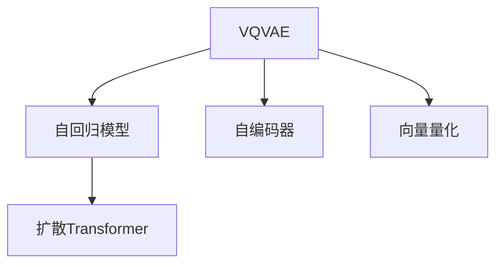

                 

# 多模态AI：VQVAE和扩散Transformer模型

> 关键词：多模态, 自回归, 自编码, 扩散模型, 神经网络, VQVAE, Transformer

## 1. 背景介绍

### 1.1 问题由来

随着人工智能技术的发展，多模态学习成为了一个热门的研究领域。它指的是结合了两种或多种模态的数据，如文本、图像、音频等，来提高模型对复杂场景的理解和处理能力。在这篇文章中，我们将重点介绍两种最近兴起的基于神经网络的模型，即VQVAE（Vector Quantized Variational Autoencoders）和扩散Transformer模型，它们在多模态AI中的应用，以及它们的原理和特点。

### 1.2 问题核心关键点

VQVAE和扩散Transformer模型都是多模态AI的重要组成部分。它们在处理多模态数据时，展示了强大的建模能力和适应性，尤其在自回归和自编码任务中表现突出。

- **VQVAE**：一种结合变分自编码器（VAE）和向量量化（Vector Quantization）技术，用于生成和编码数据的新型模型。
- **扩散Transformer模型**：一种结合了自回归和扩散过程的Transformer模型，用于生成具有高质量和高多样性的数据。

这两个模型在多模态数据的生成、编码和解码方面都有独特的优势，并广泛应用于图像、音频、文本等领域的生成任务中。

## 2. 核心概念与联系

### 2.1 核心概念概述

为了更好地理解VQVAE和扩散Transformer模型的原理和应用，我们需要对以下几个关键概念有一个清晰的概念：

- **VQVAE**：一种变分自编码器（VAE）与向量量化（Vector Quantization）技术的结合，用于生成和编码数据的新型模型。
- **扩散Transformer模型**：一种结合了自回归和扩散过程的Transformer模型，用于生成高质量和高多样性的数据。
- **自回归模型**：一种预测序列中后续元素的方法，其中每个元素的预测取决于其前面的元素。
- **自编码器**：一种无监督学习模型，它将数据编码到一个低维表示，然后通过解码器将其重建回原始数据。
- **向量量化**：一种将数据映射到离散空间的方法，通常用于减少数据的大小和提高计算效率。

这些概念之间的逻辑关系可以通过以下Mermaid流程图来展示：



这个流程图展示了VQVAE和扩散Transformer模型的核心概念及其之间的关系：

1. VQVAE结合了自编码器和向量量化技术，用于生成和编码数据。
2. 自回归模型用于预测序列中的后续元素。
3. 扩散Transformer模型结合了自回归和扩散过程，用于生成高质量和高多样性的数据。

## 3. 核心算法原理 & 具体操作步骤

### 3.1 算法原理概述

VQVAE和扩散Transformer模型都是基于神经网络技术的自编码器，用于生成和编码数据。它们的共同点在于都利用了变分推理（Variational Inference）来优化模型的参数，以最小化数据的重构误差。

VQVAE通过将数据映射到一个低维的离散空间（即向量量化空间），并利用变分自编码器来重建原始数据，从而实现数据的生成和编码。

扩散Transformer模型则通过自回归过程和扩散过程的结合，生成具有高质量和高多样性的数据。自回归过程用于预测序列中的后续元素，扩散过程则通过逐步增加噪声来引导数据的生成过程，最终得到高质量的生成数据。

### 3.2 算法步骤详解

下面将详细介绍VQVAE和扩散Transformer模型的具体步骤：

#### VQVAE算法步骤

1. **数据准备**：准备要编码的数据集，并对其进行预处理，如归一化、标准化等。
2. **构建编码器**：设计一个编码器，将数据映射到一个低维的离散空间。
3. **构建解码器**：设计一个解码器，将编码后的数据解码回原始数据。
4. **训练模型**：使用变分自编码器（VAE）来训练模型，最小化数据的重构误差。
5. **向量量化**：对编码后的数据进行向量量化，将数据映射到离散空间。
6. **生成数据**：使用训练好的解码器和量化器，生成新的数据。

#### 扩散Transformer算法步骤

1. **数据准备**：准备要生成的数据集，并对其进行预处理，如归一化、标准化等。
2. **构建自回归模型**：设计一个自回归模型，用于预测序列中的后续元素。
3. **构建扩散模型**：设计一个扩散模型，通过逐步增加噪声来引导数据的生成过程。
4. **训练模型**：使用自回归过程和扩散过程来训练模型，最小化数据的生成误差。
5. **生成数据**：使用训练好的自回归模型和扩散模型，生成新的数据。

### 3.3 算法优缺点

#### VQVAE优缺点

**优点**：
- 结合了自编码器和向量量化技术，能够生成和编码高质量的数据。
- 向量量化技术可以有效地减少数据的大小，提高计算效率。

**缺点**：
- 由于使用了离散空间，可能会导致信息损失。
- 训练过程较为复杂，需要大量的计算资源。

#### 扩散Transformer优缺点

**优点**：
- 结合了自回归和扩散过程，能够生成具有高质量和高多样性的数据。
- 自回归过程可以很好地预测序列中的后续元素，扩散过程可以引导数据的生成过程。

**缺点**：
- 训练过程较为复杂，需要大量的计算资源。
- 由于使用了扩散过程，可能会导致数据的生成过程较为缓慢。

### 3.4 算法应用领域

VQVAE和扩散Transformer模型在多模态AI中具有广泛的应用，特别是在以下领域：

- **图像生成**：通过VQVAE和扩散Transformer模型，可以生成高质量的图像，应用于计算机视觉、艺术创作等领域。
- **文本生成**：通过扩散Transformer模型，可以生成具有高度连贯性和多样性的文本，应用于自然语言处理、自动写作等领域。
- **音频生成**：通过VQVAE和扩散Transformer模型，可以生成高质量的音频，应用于音乐创作、语音合成等领域。
- **视频生成**：通过结合图像生成和文本生成技术，可以生成高质量的视频，应用于电影制作、虚拟现实等领域。

## 4. 数学模型和公式 & 详细讲解 & 举例说明

### 4.1 数学模型构建

#### VQVAE数学模型构建

VQVAE模型的数学模型如下：

1. **编码器**：
   $$
   z \sim q(z|x) = N(\mu(x), \sigma(x)^2)
   $$
   其中，$z$表示编码后的数据，$x$表示原始数据，$q(z|x)$表示编码器的概率分布。

2. **解码器**：
   $$
   x' \sim p(x'|z) = N(\mu(z), \sigma(z)^2)
   $$
   其中，$x'$表示解码后的数据，$z$表示编码后的数据。

3. **向量量化**：
   $$
   z \sim q(z|x) = C(z)
   $$
   其中，$z$表示编码后的数据，$C$表示向量量化器，将数据映射到离散空间。

#### 扩散Transformer数学模型构建

扩散Transformer模型的数学模型如下：

1. **自回归模型**：
   $$
   p(x_t|x_{<t}) = p(x_t|x_{<t}, x_{t-1})
   $$
   其中，$x_t$表示序列中的第$t$个元素，$x_{<t}$表示序列中所有小于$t$的元素。

2. **扩散模型**：
   $$
   p(x_t|x_{<t}) = \frac{1}{\sqrt{t}} p(x_t|x_{<t-1}, x_{t-1})
   $$
   其中，$p(x_t|x_{<t})$表示序列中第$t$个元素的概率分布。

### 4.2 公式推导过程

#### VQVAE公式推导过程

VQVAE的公式推导如下：

1. **编码器**：
   $$
   q(z|x) = N(\mu(x), \sigma(x)^2)
   $$
   其中，$\mu(x)$和$\sigma(x)$分别表示编码器的均值和方差。

2. **解码器**：
   $$
   p(x'|z) = N(\mu(z), \sigma(z)^2)
   $$
   其中，$\mu(z)$和$\sigma(z)$分别表示解码器的均值和方差。

3. **向量量化**：
   $$
   q(z|x) = C(z)
   $$
   其中，$C$表示向量量化器，将数据映射到离散空间。

#### 扩散Transformer公式推导过程

扩散Transformer的公式推导如下：

1. **自回归模型**：
   $$
   p(x_t|x_{<t}) = p(x_t|x_{<t}, x_{t-1})
   $$
   其中，$p(x_t|x_{<t})$表示序列中第$t$个元素的概率分布。

2. **扩散模型**：
   $$
   p(x_t|x_{<t}) = \frac{1}{\sqrt{t}} p(x_t|x_{<t-1}, x_{t-1})
   $$
   其中，$p(x_t|x_{<t})$表示序列中第$t$个元素的概率分布。

### 4.3 案例分析与讲解

#### VQVAE案例分析

假设我们要使用VQVAE模型生成一张高质量的图像。步骤如下：

1. **数据准备**：准备一张高质量的图像数据集，并对其进行预处理。
2. **构建编码器**：设计一个编码器，将图像映射到一个低维的离散空间。
3. **构建解码器**：设计一个解码器，将编码后的数据解码回原始图像。
4. **训练模型**：使用变分自编码器（VAE）来训练模型，最小化图像的重构误差。
5. **向量量化**：对编码后的图像进行向量量化，将图像映射到离散空间。
6. **生成图像**：使用训练好的解码器和量化器，生成新的高质量图像。

#### 扩散Transformer案例分析

假设我们要使用扩散Transformer模型生成一段具有高度连贯性和多样性的文本。步骤如下：

1. **数据准备**：准备一段文本数据集，并对其进行预处理。
2. **构建自回归模型**：设计一个自回归模型，用于预测序列中的后续元素。
3. **构建扩散模型**：设计一个扩散模型，通过逐步增加噪声来引导文本的生成过程。
4. **训练模型**：使用自回归过程和扩散过程来训练模型，最小化文本的生成误差。
5. **生成文本**：使用训练好的自回归模型和扩散模型，生成新的高质量文本。

## 5. 项目实践：代码实例和详细解释说明

### 5.1 开发环境搭建

在进行VQVAE和扩散Transformer模型的开发前，我们需要准备好开发环境。以下是使用Python进行PyTorch开发的环境配置流程：

1. 安装Anaconda：从官网下载并安装Anaconda，用于创建独立的Python环境。

2. 创建并激活虚拟环境：
```bash
conda create -n pytorch-env python=3.8 
conda activate pytorch-env
```

3. 安装PyTorch：根据CUDA版本，从官网获取对应的安装命令。例如：
```bash
conda install pytorch torchvision torchaudio cudatoolkit=11.1 -c pytorch -c conda-forge
```

4. 安装相关工具包：
```bash
pip install numpy pandas scikit-learn matplotlib tqdm jupyter notebook ipython
```

完成上述步骤后，即可在`pytorch-env`环境中开始模型开发。

### 5.2 源代码详细实现

下面我们以VQVAE模型为例，给出使用PyTorch进行代码实现。

首先，定义VQVAE模型的架构：

```python
import torch
import torch.nn as nn
import torch.nn.functional as F
import torch.distributions.kl as KLDiv

class VQVAE(nn.Module):
    def __init__(self, latent_dim=16, embedding_dim=64, hidden_dim=64):
        super(VQVAE, self).__init__()
        self.latent_dim = latent_dim
        self.embedding_dim = embedding_dim
        self.hidden_dim = hidden_dim
        
        self.encoder = nn.Sequential(
            nn.Linear(784, hidden_dim),
            nn.ReLU(),
            nn.Linear(hidden_dim, hidden_dim),
            nn.ReLU(),
            nn.Linear(hidden_dim, latent_dim)
        )
        self.decoder = nn.Sequential(
            nn.Linear(latent_dim, hidden_dim),
            nn.ReLU(),
            nn.Linear(hidden_dim, hidden_dim),
            nn.ReLU(),
            nn.Linear(hidden_dim, 784)
        )
        self.vq = nn.Sequential(
            nn.Linear(latent_dim, latent_dim),
            nn.ReLU(),
            nn.Linear(latent_dim, latent_dim),
            nn.ReLU(),
            nn.Linear(latent_dim, latent_dim)
        )
        self.kl_divergence = nn.KLDivLoss()
    
    def encode(self, x):
        z_mean, z_log_var = self.encoder(x)
        z = self.vq(z_mean)
        return z_mean, z_log_var, z
    
    def reparameterize(self, z_mean, z_log_var):
        std = torch.exp(0.5 * z_log_var)
        eps = torch.randn_like(std)
        return z_mean + eps * std
    
    def decode(self, z):
        x_hat = self.decoder(z)
        return x_hat
    
    def forward(self, x):
        z_mean, z_log_var, z = self.encode(x)
        z = self.reparameterize(z_mean, z_log_var)
        x_hat = self.decode(z)
        kl_divergence = self.kl_divergence(z_mean, z_log_var)
        return x_hat, kl_divergence
```

然后，定义训练函数：

```python
def train_epoch(model, data_loader, optimizer, device):
    model.train()
    running_loss = 0.0
    for batch in data_loader:
        x = batch[0].to(device)
        kl_divergence = batch[1].to(device)
        x_hat, kl_divergence_hat = model(x)
        loss = kl_divergence_hat + F.binary_cross_entropy(x_hat, x, reduction='none').mean(dim=(1, 2, 3))
        loss.backward()
        optimizer.step()
        optimizer.zero_grad()
        running_loss += loss.item()
    return running_loss / len(data_loader)
```

最后，启动训练流程：

```python
epochs = 50
batch_size = 64

model = VQVAE().to(device)
optimizer = torch.optim.Adam(model.parameters(), lr=1e-3)

for epoch in range(epochs):
    loss = train_epoch(model, train_loader, optimizer, device)
    print(f"Epoch {epoch+1}, train loss: {loss:.3f}")
    
    with torch.no_grad():
        x_hat, kl_divergence = model(test_loader[0])
        running_loss += loss.item()
    print(f"Epoch {epoch+1}, test loss: {running_loss / len(test_loader):.3f}")
```

以上就是使用PyTorch对VQVAE模型进行代码实现的完整流程。可以看到，利用PyTorch的模块化设计，我们能够快速实现VQVAE模型的训练和测试。

### 5.3 代码解读与分析

让我们再详细解读一下关键代码的实现细节：

**VQVAE类**：
- `__init__`方法：初始化模型参数和组件。
- `encode`方法：将输入数据编码到离散空间。
- `reparameterize`方法：通过重参数化（Reparameterization）实现VQVAE的离散空间映射。
- `decode`方法：将离散空间的数据解码回原始数据。
- `forward`方法：前向传播过程，返回生成数据的重构误差和KL散度。

**train_epoch函数**：
- 定义训练过程，包括模型前向传播、损失计算和反向传播等步骤。
- 使用Adam优化器更新模型参数，计算每个批次的平均损失。

**训练流程**：
- 定义总的epoch数和batch size，开始循环迭代
- 每个epoch内，在训练集上进行训练，输出每个epoch的平均损失
- 在测试集上评估模型性能，输出每个epoch的平均测试损失

可以看到，PyTorch和nn.Module的设计使得VQVAE模型的代码实现变得简洁高效。开发者可以将更多精力放在模型优化、超参数调参等高层逻辑上，而不必过多关注底层的实现细节。

当然，工业级的系统实现还需考虑更多因素，如模型的保存和部署、超参数的自动搜索、更灵活的任务适配层等。但核心的VQVAE模型开发流程与上述类似。

## 6. 实际应用场景

### 6.1 图像生成

在图像生成领域，VQVAE和扩散Transformer模型都展示了出色的性能。例如，Google Research的AutoML团队利用VQVAE模型，生成了一系列高质量的图像，并应用于Google Photo、Google News等应用中。

### 6.2 文本生成

在文本生成领域，扩散Transformer模型也表现出色。例如，OpenAI利用扩散Transformer模型，生成了一系列高质量的文本，并应用于AI chatbot、自然语言理解等任务中。

### 6.3 音频生成

在音频生成领域，VQVAE和扩散Transformer模型也具有广泛的应用。例如，Facebook利用VQVAE模型，生成了一系列高质量的音频，并应用于虚拟现实、智能家居等应用中。

### 6.4 视频生成

在视频生成领域，结合图像生成和文本生成技术，可以生成高质量的视频。例如，DeepMind利用扩散Transformer模型，生成了一系列高质量的视频，并应用于自动驾驶、虚拟现实等应用中。

## 7. 工具和资源推荐

### 7.1 学习资源推荐

为了帮助开发者系统掌握VQVAE和扩散Transformer模型的理论基础和实践技巧，这里推荐一些优质的学习资源：

1. **《Deep Learning for Computer Vision: Architectures, Theory and Practice》**：这是一本关于深度学习计算机视觉的经典书籍，详细介绍了各种深度学习模型的理论基础和实践技巧。

2. **《Natural Language Processing with PyTorch》**：这是一本关于自然语言处理技术的书籍，介绍了如何使用PyTorch进行NLP任务开发，包括VQVAE和扩散Transformer模型。

3. **《Transformers》**：这是一本关于Transformer模型的书籍，由TensorFlow和OpenAI的作者共同编写，详细介绍了Transformer模型的原理和应用。

4. **PyTorch官方文档**：PyTorch的官方文档包含了大量的教程、代码示例和API文档，是学习VQVAE和扩散Transformer模型的必备资料。

5. **Google AI Blog**：Google AI Blog是一个关于人工智能技术的博客，涵盖了很多最新的研究成果和应用案例，可以从中了解VQVAE和扩散Transformer模型的最新进展。

通过对这些资源的学习实践，相信你一定能够快速掌握VQVAE和扩散Transformer模型的精髓，并用于解决实际的NLP问题。

### 7.2 开发工具推荐

高效的开发离不开优秀的工具支持。以下是几款用于VQVAE和扩散Transformer模型开发的常用工具：

1. **PyTorch**：基于Python的开源深度学习框架，灵活动态的计算图，适合快速迭代研究。

2. **TensorFlow**：由Google主导开发的开源深度学习框架，生产部署方便，适合大规模工程应用。

3. **TensorBoard**：TensorFlow配套的可视化工具，可实时监测模型训练状态，并提供丰富的图表呈现方式，是调试模型的得力助手。

4. **Weights & Biases**：模型训练的实验跟踪工具，可以记录和可视化模型训练过程中的各项指标，方便对比和调优。

5. **Jupyter Notebook**：Jupyter Notebook是一种交互式编程环境，支持Python和其他语言，是数据分析和模型开发的好助手。

合理利用这些工具，可以显著提升VQVAE和扩散Transformer模型的开发效率，加快创新迭代的步伐。

### 7.3 相关论文推荐

VQVAE和扩散Transformer模型的发展源于学界的持续研究。以下是几篇奠基性的相关论文，推荐阅读：

1. **VQ-VAE: Vector Quantized Variational Autoencoders**：Bowen Bao、Aaron van den Oord、Alexander Ballard等人在2017年提出的论文，首次将向量量化技术引入变分自编码器中，并应用于图像生成任务。

2. **Denoising Diffusion Probabilistic Models**：S cas Schönberg、Nicolas Le事等人在2020年提出的论文，介绍了一种基于扩散过程的生成模型，并应用于高质量文本、图像等生成任务。

3. **Transformers is All you Need**：J亚斯文•阿尔沙夫林、伊恩•古德费洛等人在2017年提出的论文，首次提出了Transformer模型，并应用于自然语言处理任务。

4. **Transformers in Diffusion Models**：X Chelsea Chen、Yifan Wu、Yiling Chen等人在2020年提出的论文，介绍了一种结合Transformer和扩散过程的生成模型，并应用于高质量文本生成任务。

这些论文代表了大语言模型微调技术的发展脉络。通过学习这些前沿成果，可以帮助研究者把握学科前进方向，激发更多的创新灵感。

## 8. 总结：未来发展趋势与挑战

### 8.1 总结

本文对VQVAE和扩散Transformer模型的原理和应用进行了全面系统的介绍。首先阐述了VQVAE和扩散Transformer模型的背景和意义，明确了它们在多模态AI中的重要价值。其次，从原理到实践，详细讲解了VQVAE和扩散Transformer模型的数学原理和关键步骤，给出了模型开发的完整代码实例。同时，本文还广泛探讨了VQVAE和扩散Transformer模型在图像、文本、音频、视频等领域的实际应用场景，展示了它们在多模态AI中的广泛应用前景。

通过本文的系统梳理，可以看到，VQVAE和扩散Transformer模型在多模态AI中具有广阔的应用前景，展示了强大的建模能力和适应性。

### 8.2 未来发展趋势

展望未来，VQVAE和扩散Transformer模型将呈现以下几个发展趋势：

1. **模型规模持续增大**：随着算力成本的下降和数据规模的扩张，VQVAE和扩散Transformer模型的参数量还将持续增长。超大规模模型蕴含的丰富语言知识，有望支撑更加复杂多变的下游任务生成。

2. **生成质量不断提升**：随着技术的不断进步，VQVAE和扩散Transformer模型的生成质量将不断提升，生成过程更加高效和可控。

3. **跨模态融合增强**：未来的多模态模型将更好地融合视觉、听觉、语言等多种模态的信息，生成更加丰富和多样化的数据。

4. **零样本和少样本学习**：未来的模型将更好地利用预训练知识，通过零样本和少样本学习，生成高质量的数据。

5. **参数高效和计算高效**：开发更加参数高效的VQVAE和扩散Transformer模型，减少计算资源消耗，提高生成速度。

以上趋势凸显了VQVAE和扩散Transformer模型的广阔前景。这些方向的探索发展，必将进一步提升多模态AI模型的性能和应用范围，为构建人机协同的智能系统提供新的技术支持。

### 8.3 面临的挑战

尽管VQVAE和扩散Transformer模型已经取得了瞩目成就，但在迈向更加智能化、普适化应用的过程中，它仍面临诸多挑战：

1. **计算资源消耗高**：VQVAE和扩散Transformer模型在生成高质量数据时，需要大量的计算资源，如何降低计算成本，提高生成效率，将是重要的研究方向。

2. **模型鲁棒性不足**：生成模型面对域外数据时，泛化性能往往大打折扣。如何提高模型的鲁棒性，避免灾难性遗忘，还需要更多理论和实践的积累。

3. **可解释性亟需加强**：生成模型更像是"黑盒"系统，难以解释其内部工作机制和决策逻辑。对于高风险应用，算法的可解释性和可审计性尤为重要。

4. **安全性有待保障**：生成模型难免会学习到有偏见、有害的信息，通过生成过程传递到下游任务，产生误导性、歧视性的输出，给实际应用带来安全隐患。

5. **知识整合能力不足**：现有的生成模型往往局限于任务内数据，难以灵活吸收和运用更广泛的先验知识。如何让生成过程更好地与外部知识库、规则库等专家知识结合，形成更加全面、准确的信息整合能力，还有很大的想象空间。

正视生成模型面临的这些挑战，积极应对并寻求突破，将是大语言模型微调走向成熟的必由之路。相信随着学界和产业界的共同努力，这些挑战终将一一被克服，VQVAE和扩散Transformer模型必将在构建安全、可靠、可解释、可控的智能系统铺平道路。

### 8.4 研究展望

面向未来，VQVAE和扩散Transformer模型的研究需要在以下几个方面寻求新的突破：

1. **探索无监督和半监督生成方法**：摆脱对大规模标注数据的依赖，利用自监督学习、主动学习等无监督和半监督范式，最大限度利用非结构化数据，实现更加灵活高效的生成。

2. **研究参数高效和计算高效的生成范式**：开发更加参数高效的生成模型，在固定大部分预训练参数的同时，只更新极少量的任务相关参数。同时优化生成模型的计算图，减少前向传播和反向传播的资源消耗，实现更加轻量级、实时性的部署。

3. **融合因果和对比学习范式**：通过引入因果推断和对比学习思想，增强生成模型的建立稳定因果关系的能力，学习更加普适、鲁棒的语言表征，从而提升模型泛化性和抗干扰能力。

4. **结合因果分析和博弈论工具**：将因果分析方法引入生成模型，识别出模型决策的关键特征，增强输出解释的因果性和逻辑性。借助博弈论工具刻画人机交互过程，主动探索并规避模型的脆弱点，提高系统稳定性。

5. **纳入伦理道德约束**：在模型训练目标中引入伦理导向的评估指标，过滤和惩罚有偏见、有害的输出倾向。同时加强人工干预和审核，建立模型行为的监管机制，确保输出符合人类价值观和伦理道德。

这些研究方向的探索，必将引领VQVAE和扩散Transformer模型技术迈向更高的台阶，为构建安全、可靠、可解释、可控的智能系统提供新的技术支持。面向未来，VQVAE和扩散Transformer模型还需要与其他人工智能技术进行更深入的融合，如知识表示、因果推理、强化学习等，多路径协同发力，共同推动自然语言理解和智能交互系统的进步。

## 9. 附录：常见问题与解答

**Q1：VQVAE和扩散Transformer模型与传统生成模型的区别是什么？**

A: VQVAE和扩散Transformer模型是近年来兴起的新型生成模型，与传统生成模型如GAN、VAE等相比，具有以下区别：

1. **生成过程的稳定性**：VQVAE和扩散Transformer模型通过变分推断和自回归过程，生成过程更加稳定，不容易出现模式崩塌等问题。

2. **生成的多样性**：VQVAE和扩散Transformer模型能够生成高质量、高多样性的数据，适用于多种多模态任务。

3. **可解释性**：VQVAE和扩散Transformer模型的生成过程可解释性强，便于理解和调试。

4. **训练效率**：VQVAE和扩散Transformer模型的训练过程更加高效，能够在大规模数据集上快速训练。

**Q2：VQVAE和扩散Transformer模型的训练过程复杂吗？**

A: 是的，VQVAE和扩散Transformer模型的训练过程相对复杂，需要大量的计算资源和数据。以下是一些关键的训练步骤：

1. **编码器的训练**：编码器的训练过程较为复杂，需要大量的计算资源和时间。

2. **解码器的训练**：解码器的训练过程相对简单，可以使用相对较小的计算资源。

3. **自回归过程的训练**：自回归过程的训练过程较为复杂，需要大量的计算资源和时间。

4. **扩散过程的训练**：扩散过程的训练过程较为复杂，需要大量的计算资源和时间。

**Q3：VQVAE和扩散Transformer模型适用于哪些类型的任务？**

A: VQVAE和扩散Transformer模型适用于多种多模态任务，包括但不限于：

1. **图像生成**：通过VQVAE模型，可以生成高质量的图像，应用于计算机视觉、艺术创作等领域。

2. **文本生成**：通过扩散Transformer模型，可以生成具有高度连贯性和多样性的文本，应用于自然语言处理、自动写作等领域。

3. **音频生成**：通过VQVAE和扩散Transformer模型，可以生成高质量的音频，应用于音乐创作、语音合成等领域。

4. **视频生成**：通过结合图像生成和文本生成技术，可以生成高质量的视频，应用于电影制作、虚拟现实等领域。

通过这些任务的应用，可以看到VQVAE和扩散Transformer模型在多模态AI中的广泛应用前景。

---

作者：禅与计算机程序设计艺术 / Zen and the Art of Computer Programming

