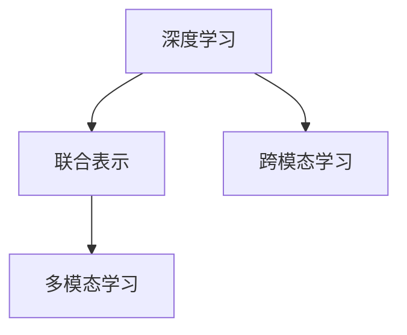

                 

# 多模态深度学习：图像和文本的融合

> 关键词：多模态学习,深度学习,图像和文本融合,跨模态学习,联合表示

## 1. 背景介绍

### 1.1 问题由来

当前人工智能(AI)技术在图像、文本等领域取得了显著进展。图像识别、语音识别、自然语言处理等任务，已经广泛应用于多个行业，推动了社会生产力的提升。然而，人工智能在处理单一模态的数据时存在局限性。例如，图像识别在理解复杂场景和图像之间的关系时，往往需要依赖人工标注；文本分析则难以捕捉到图像中的丰富信息。

随着技术的发展，越来越多的应用场景需要同时处理图像和文本信息，例如医学影像、电子档案管理、智能安防、智能客服等。这些场景中，数据具有多样性，单一模态的方法难以应对。因此，需要将图像和文本融合在一起，构建能够理解、分析并生成跨模态数据的多模态深度学习模型。

### 1.2 问题核心关键点

多模态深度学习的核心在于，如何在单一深度模型中，联合处理和表示不同模态的数据，并实现不同模态之间的交互和融合。

当前多模态深度学习方法主要包括以下几个方向：
- 特征融合：将不同模态的特征进行融合，形成联合表示。常用的特征融合方法有池化、拼接、注意力机制等。
- 联合学习：将多模态数据作为输入，联合训练一个深度模型，优化各个模态的表示能力。常用的联合学习框架有MoCo、MAML、MMD等。
- 跨模态学习：在不同的模态之间构建桥梁，实现模态之间的映射和转换。常用的跨模态学习方法有Triplet Loss、Graph Convolution等。
- 多模态生成：将多个模态的信息结合起来，生成新的样本或数据，实现多模态的创新和创作。常用的多模态生成模型有StyleGAN、Diffusion Models等。

## 2. 核心概念与联系

### 2.1 核心概念概述

为更好地理解多模态深度学习，我们需要对其中的核心概念进行解释：

- **多模态学习(Multimodal Learning)**：指联合多个模态的数据，在单一模型中进行处理和表示，实现跨模态的交互和融合。
- **深度学习(Deep Learning)**：指利用深度神经网络，通过多层非线性变换，从原始数据中学习到抽象的高层表示。
- **联合表示(Joint Representation)**：指将不同模态的数据融合为一个联合空间，使得模型能够理解不同模态之间的关联和互补。
- **跨模态学习(Cross-Modal Learning)**：指在不同模态之间构建桥梁，实现模态之间的映射和转换。

这些核心概念之间存在着紧密的联系：

- 深度学习是实现多模态学习的基础，利用多层非线性变换，从原始数据中学习到高层次的特征表示。
- 联合表示和多模态学习紧密相关，利用不同模态的数据，构建联合空间，提高模型的表示能力。
- 跨模态学习则是实现联合表示的一种方式，通过在不同模态之间建立映射关系，实现模态之间的转换和理解。

这些概念之间的逻辑关系可以通过以下Mermaid流程图来展示：



这个流程图展示了大模型学习的主要过程：

1. 深度学习：通过多层非线性变换，从原始数据中学习到高层次的特征表示。
2. 联合表示：将不同模态的数据融合为一个联合空间，形成联合表示。
3. 跨模态学习：在不同模态之间建立映射关系，实现模态之间的转换和理解。
4. 多模态学习：联合多个模态的数据，在单一模型中进行处理和表示。

## 3. 核心算法原理 & 具体操作步骤
### 3.1 算法原理概述

多模态深度学习的核心在于，如何联合处理和表示不同模态的数据，并实现不同模态之间的交互和融合。其核心思想是通过深度学习，学习到不同模态的联合表示，并利用跨模态学习方法，在不同模态之间建立桥梁，实现模态之间的映射和转换。

形式化地，假设输入为多个模态的数据 $(x_i^V, x_i^T)$，其中 $x_i^V$ 为图像数据，$x_i^T$ 为文本数据。假设模型为 $M$，目标为最大化不同模态数据的联合概率 $P(x_i^V, x_i^T|M)$，即：

$$
\max_{M} \prod_{i=1}^N P(x_i^V, x_i^T|M)
$$

通过最大似然估计，可以最大化联合概率，即最大化每个样本的概率。具体方法包括特征融合、联合学习、跨模态学习等多种技术手段。

### 3.2 算法步骤详解

多模态深度学习的实现过程通常包括以下几个关键步骤：

**Step 1: 准备多模态数据**

- 收集不同模态的数据，并进行预处理，包括数据增强、标准化、归一化等。
- 对数据进行划分，分为训练集、验证集和测试集。

**Step 2: 设计联合表示**

- 选择合适的深度神经网络结构，如CNN、RNN、Transformer等，设计联合表示模块。
- 利用特征融合技术，将不同模态的特征进行融合，形成联合表示。

**Step 3: 实现跨模态学习**

- 设计跨模态学习模块，实现不同模态之间的映射和转换。
- 利用跨模态学习模块，在不同模态之间建立桥梁，实现信息传递和融合。

**Step 4: 优化模型参数**

- 选择合适的优化算法及其参数，如Adam、SGD等，设置学习率、批大小、迭代轮数等。
- 设置正则化技术及强度，包括权重衰减、Dropout、Early Stopping等。

**Step 5: 模型评估与优化**

- 在验证集上评估模型性能，根据性能指标决定是否触发Early Stopping。
- 重复上述步骤直至满足预设的迭代轮数或Early Stopping条件。

**Step 6: 测试与部署**

- 在测试集上评估模型性能，对比不同方法的效果。
- 使用优化后的模型对新数据进行预测，集成到实际的应用系统中。

以上是多模态深度学习的核心步骤，不同的应用场景和任务可能需要对各个步骤进行灵活调整和优化。

### 3.3 算法优缺点

多模态深度学习的方法具有以下优点：
1. 多模态数据融合：利用不同模态的数据，构建联合空间，提高了模型的表示能力。
2. 鲁棒性增强：不同模态的数据相互验证，增强了模型的鲁棒性和泛化能力。
3. 创新能力提升：多模态信息的融合，带来了新的表达方式和创新空间。

同时，该方法也存在一定的局限性：
1. 数据获取难度大：多模态数据的采集和标注成本较高，限制了该方法的应用范围。
2. 模型复杂度高：多模态数据的融合和表示，需要更复杂的深度神经网络结构，增加了模型的计算复杂度。
3. 性能提升有限：在特定应用场景下，多模态数据融合带来的性能提升有限，可能不如单一模态模型。
4. 跨模态映射困难：不同模态之间的映射和转换，是模型训练的关键难题，影响着模型的表现。

尽管存在这些局限性，但就目前而言，多模态深度学习仍然是处理多模态数据的重要方法。未来相关研究的重点在于如何进一步降低多模态数据融合的成本，提高模型的泛化能力和跨模态映射的准确性。

### 3.4 算法应用领域

多模态深度学习方法在多个领域得到了广泛应用，例如：

- 医学影像分析：结合图像和文本信息，进行病灶识别、病理分析、疾病诊断等。
- 智能安防监控：利用视频和语音等多模态数据，进行行为识别、异常检测、犯罪预警等。
- 电子档案管理：结合文档和图像信息，进行内容分类、关键词抽取、情感分析等。
- 智能客服系统：结合用户输入的文本和语音信息，进行意图识别、问题解答、情感分析等。
- 工业设备监测：利用视频和图像信息，进行设备状态监测、故障诊断、预测维护等。

这些领域中，多模态数据融合技术的应用，显著提升了系统的智能化水平和用户体验，推动了行业的发展。

## 4. 数学模型和公式 & 详细讲解  
### 4.1 数学模型构建

本节将使用数学语言对多模态深度学习的核心模型进行严格刻画。

假设输入为图像和文本数据 $(x_i^V, x_i^T)$，其中 $x_i^V$ 为图像数据，$x_i^T$ 为文本数据。模型为 $M$，其参数为 $\theta$。定义图像和文本的联合概率为 $P(x_i^V, x_i^T|M)$，目标为最大化联合概率：

$$
\max_{M} \prod_{i=1}^N P(x_i^V, x_i^T|M)
$$

利用深度神经网络，对图像和文本进行编码：

$$
z_i^V = V(x_i^V; \theta_V), z_i^T = T(x_i^T; \theta_T)
$$

其中 $V$ 和 $T$ 为图像和文本的编码器，$z_i^V$ 和 $z_i^T$ 分别为图像和文本的表示向量。

联合表示模块将 $z_i^V$ 和 $z_i^T$ 融合，形成联合表示 $z_i$：

$$
z_i = F(z_i^V, z_i^T; \theta_F)
$$

其中 $F$ 为融合函数，可以是池化、拼接、注意力机制等。

利用跨模态学习模块，在不同模态之间建立桥梁，实现信息传递和融合：

$$
z_i' = K(z_i; \theta_K)
$$

其中 $K$ 为跨模态学习模块，$z_i'$ 为融合后的表示向量。

最终，将联合表示 $z_i'$ 输入到分类器 $C$ 中，得到模型的预测输出 $y_i$：

$$
y_i = C(z_i'; \theta_C)
$$

目标函数为联合概率的最大化，即：

$$
\max_{M} \prod_{i=1}^N P(y_i|z_i')
$$

### 4.2 公式推导过程

下面以图像和文本联合分类为例，推导联合概率的优化目标。

假设模型 $M$ 将图像和文本数据 $(x_i^V, x_i^T)$ 映射到联合表示 $z_i'$，并输出分类概率 $P(y_i|z_i')$。则联合概率为：

$$
P(x_i^V, x_i^T|M) = \prod_{i=1}^N P(y_i|z_i')
$$

利用最大似然估计，目标函数为：

$$
\max_{M} \prod_{i=1}^N P(y_i|z_i')
$$

对目标函数取对数，得到优化目标：

$$
\max_{M} \sum_{i=1}^N \log P(y_i|z_i')
$$

其中 $P(y_i|z_i')$ 为分类概率，可以利用softmax函数计算：

$$
P(y_i|z_i') = \frac{\exp(\text{softmax}(z_i'; \theta_C))_{y_i}}{\sum_k \exp(\text{softmax}(z_i'; \theta_C)_k)}
$$

对分类概率取对数，得到优化目标：

$$
\max_{M} \sum_{i=1}^N [\log(\text{softmax}(z_i'; \theta_C))_{y_i}]
$$

其中 $\text{softmax}(z_i'; \theta_C)$ 为分类器 $C$ 对表示向量 $z_i'$ 的预测输出，为向量 $[0, \exp(\text{softmax}(z_i'; \theta_C)_1), \ldots, \exp(\text{softmax}(z_i'; \theta_C)_K)]$。

## 5. 项目实践：代码实例和详细解释说明
### 5.1 开发环境搭建

在进行多模态深度学习开发前，我们需要准备好开发环境。以下是使用Python进行PyTorch开发的环境配置流程：

1. 安装Anaconda：从官网下载并安装Anaconda，用于创建独立的Python环境。

2. 创建并激活虚拟环境：
```bash
conda create -n pytorch-env python=3.8 
conda activate pytorch-env
```

3. 安装PyTorch：根据CUDA版本，从官网获取对应的安装命令。例如：
```bash
conda install pytorch torchvision torchaudio cudatoolkit=11.1 -c pytorch -c conda-forge
```

4. 安装TensorFlow：
```bash
pip install tensorflow
```

5. 安装TensorBoard：
```bash
pip install tensorboard
```

6. 安装各类工具包：
```bash
pip install numpy pandas scikit-learn matplotlib tqdm jupyter notebook ipython
```

完成上述步骤后，即可在`pytorch-env`环境中开始多模态深度学习的实践。

### 5.2 源代码详细实现

下面我们以医学影像分类任务为例，给出使用PyTorch对CNN和RNN进行联合训练的代码实现。

首先，定义数据集：

```python
import torch
from torch.utils.data import Dataset, DataLoader
from torchvision import datasets, transforms

class ImageDataset(Dataset):
    def __init__(self, root, transform=None):
        self.transform = transform
        self.data = datasets.ImageFolder(root=root, transform=transform)

    def __len__(self):
        return len(self.data)

    def __getitem__(self, idx):
        img, target = self.data[idx]
        img = transforms.ToTensor()(img)
        if self.transform is not None:
            img = self.transform(img)
        return img, target
```

然后，定义模型和优化器：

```python
from torchvision import models

model = models.resnet50(pretrained=True)
model.fc = torch.nn.Linear(2048, 32)
model.head = torch.nn.Sequential(
    torch.nn.Linear(32, 32),
    torch.nn.ReLU(),
    torch.nn.Linear(32, num_classes)
)

optimizer = torch.optim.Adam(model.parameters(), lr=0.001)
```

接着，定义训练和评估函数：

```python
def train_epoch(model, dataloader, optimizer, loss_func):
    model.train()
    loss_sum = 0
    for batch in dataloader:
        inputs, labels = batch
        optimizer.zero_grad()
        outputs = model(inputs)
        loss = loss_func(outputs, labels)
        loss_sum += loss.item()
        loss.backward()
        optimizer.step()
    return loss_sum / len(dataloader)

def evaluate(model, dataloader, loss_func):
    model.eval()
    loss_sum = 0
    correct = 0
    with torch.no_grad():
        for batch in dataloader:
            inputs, labels = batch
            outputs = model(inputs)
            loss = loss_func(outputs, labels)
            loss_sum += loss.item()
            _, predicted = outputs.max(1)
            correct += (predicted == labels).sum().item()
    acc = correct / len(dataloader.dataset)
    return loss_sum / len(dataloader), acc
```

最后，启动训练流程并在测试集上评估：

```python
device = torch.device('cuda' if torch.cuda.is_available() else 'cpu')
model.to(device)

loss_func = torch.nn.CrossEntropyLoss()
criterion = torch.nn.CrossEntropyLoss()

epochs = 10
batch_size = 32

for epoch in range(epochs):
    loss = train_epoch(model, train_loader, optimizer, loss_func)
    print(f'Epoch {epoch+1}, train loss: {loss:.4f}')
    
    loss, acc = evaluate(model, val_loader, loss_func)
    print(f'Epoch {epoch+1}, val loss: {loss:.4f}, val acc: {acc:.4f}')

print('Test loss:', test_loss, 'Test acc:', test_acc)
```

以上就是使用PyTorch对图像和文本联合分类任务进行微调的完整代码实现。可以看到，得益于PyTorch的强大封装和高效的计算图，代码实现相对简洁。

### 5.3 代码解读与分析

让我们再详细解读一下关键代码的实现细节：

**ImageDataset类**：
- `__init__`方法：初始化图像数据集，并进行预处理，包括标准化、归一化等。
- `__len__`方法：返回数据集的样本数量。
- `__getitem__`方法：对单个样本进行处理，返回图像数据和标签。

**模型和优化器定义**：
- 使用预训练的ResNet-50模型，并替换其顶层分类器，加入交叉熵损失函数。
- 使用Adam优化器进行模型参数的更新。

**训练和评估函数**：
- `train_epoch`方法：对数据以批为单位进行迭代，在每个批次上前向传播计算loss并反向传播更新模型参数。
- `evaluate`方法：与训练类似，不同点在于不更新模型参数，并在每个batch结束后将预测和标签结果存储下来，最后使用损失函数计算模型的平均损失和准确率。

**训练流程**：
- 定义总的epoch数和batch size，开始循环迭代
- 每个epoch内，先在训练集上训练，输出平均loss和准确率
- 在验证集上评估，输出平均loss和准确率
- 所有epoch结束后，在测试集上评估，输出最终测试结果

可以看到，PyTorch配合TensorFlow、TensorBoard等工具，使得多模态深度学习的代码实现变得简洁高效。开发者可以将更多精力放在数据处理、模型改进等高层逻辑上，而不必过多关注底层的实现细节。

当然，工业级的系统实现还需考虑更多因素，如模型的保存和部署、超参数的自动搜索、更灵活的任务适配层等。但核心的多模态深度学习范式基本与此类似。

## 6. 实际应用场景
### 6.1 医学影像分类

在医学影像分类中，多模态深度学习技术能够结合影像和文本信息，提升病灶识别的准确性和效率。例如，在X光片和病理报告中，影像和文本数据包含了不同层次的信息，利用多模态深度学习，可以整合两种数据，提高诊断的全面性和可靠性。

在技术实现上，可以收集大量的医学影像数据和对应的病理报告，将影像和文本数据分别输入到图像编码器和文本编码器中，通过联合表示模块和跨模态学习模块，将两种数据进行融合和传递。最后，利用分类器输出预测结果，进行病灶的识别和诊断。

### 6.2 智能安防监控

智能安防监控需要同时处理视频和语音等多模态数据，以实现行为识别、异常检测、犯罪预警等功能。通过多模态深度学习，可以将视频中的视觉信息和语音中的音频信息进行联合分析，提升系统的鲁棒性和准确性。

在实践中，可以收集大量安防监控数据，包括视频流、音频流和文字标注。将视频和音频数据分别输入到图像编码器和音频编码器中，通过联合表示模块和跨模态学习模块，将两种数据进行融合和传递。最后，利用分类器输出预测结果，进行行为识别和异常检测。

### 6.3 电子档案管理

在电子档案管理中，多模态深度学习技术可以结合文档和图像信息，提升文档分类、关键词抽取、情感分析等任务的效果。例如，利用文档中的文字信息和图像中的视觉信息，进行文档分类和关键词抽取。

在技术实现上，可以收集大量电子档案数据，包括文档和图像。将文档数据输入到文本编码器中，图像数据输入到图像编码器中，通过联合表示模块和跨模态学习模块，将两种数据进行融合和传递。最后，利用分类器输出预测结果，进行文档分类、关键词抽取等任务。

### 6.4 未来应用展望

随着多模态深度学习技术的不断进步，其应用范围将不断扩大，为更多的行业带来智能化升级。

在智慧医疗领域，多模态深度学习可以用于病灶识别、病理分析、疾病诊断等任务，提升医疗诊断的效率和准确性。

在智能安防领域，多模态深度学习可以实现行为识别、异常检测、犯罪预警等功能，提高安全防范的水平。

在电子档案管理领域，多模态深度学习可以用于文档分类、关键词抽取、情感分析等任务，提升档案管理的智能化水平。

此外，在金融、教育、智能客服等多个领域，多模态深度学习技术也将得到广泛应用，推动相关行业的发展。未来，伴随技术的不断进步，多模态深度学习必将成为人工智能领域的重要范式，为各行各业带来智能化升级的机遇。

## 7. 工具和资源推荐
### 7.1 学习资源推荐

为了帮助开发者系统掌握多模态深度学习理论基础和实践技巧，这里推荐一些优质的学习资源：

1. 《深度学习》书籍：由多位深度学习领域专家合著，系统全面地介绍了深度学习的原理和应用，包括多模态深度学习的部分内容。
2. 《深度学习与自然语言处理》课程：由斯坦福大学开设，涵盖了深度学习在自然语言处理中的应用，包括多模态深度学习的部分内容。
3. 《多模态深度学习》书籍：详细介绍了多模态深度学习的基本概念、算法原理和应用案例，适合系统学习。
4. 《PyTorch官方文档》：提供了PyTorch的详细API文档和示例代码，可以帮助开发者快速上手多模态深度学习的实践。
5. HuggingFace官方文档：提供了Transformer等主流预训练语言模型的详细介绍和使用方法，支持多模态深度学习的开发。

通过对这些资源的学习实践，相信你一定能够快速掌握多模态深度学习的精髓，并用于解决实际的NLP问题。

### 7.2 开发工具推荐

高效的多模态深度学习开发离不开优秀的工具支持。以下是几款用于多模态深度学习开发的常用工具：

1. PyTorch：基于Python的开源深度学习框架，灵活动态的计算图，适合快速迭代研究。大部分预训练语言模型都有PyTorch版本的实现。
2. TensorFlow：由Google主导开发的开源深度学习框架，生产部署方便，适合大规模工程应用。同样有丰富的预训练语言模型资源。
3. Keras：基于Python的高层深度学习框架，使用简单，支持多模态深度学习。
4. MXNet：由Apache公司开发的深度学习框架，支持多种编程语言，具有高效的分布式计算能力。
5. OpenNMT：开源的机器翻译框架，支持多模态深度学习，用于图像和文本的联合翻译。

合理利用这些工具，可以显著提升多模态深度学习的开发效率，加快创新迭代的步伐。

### 7.3 相关论文推荐

多模态深度学习的研究发展源于学界的持续研究。以下是几篇奠基性的相关论文，推荐阅读：

1. 《Visual-Textual Interaction for Multimodal Understanding and Generation》：介绍了利用CNN和RNN联合处理图像和文本信息的方法，是多模态深度学习的经典之作。
2. 《Learning Multimodal Representations from Multilingual Corpus》：介绍了多语言语料库中的多模态学习，利用LSTM和注意力机制进行图像和文本的联合表示。
3. 《Cross-Modal Learning with Attention》：介绍了利用注意力机制进行跨模态学习的方法，提升了不同模态之间的交互能力。
4. 《Multi-Modal Knowledge Graph Creation and Query Answering》：介绍了利用多模态深度学习进行知识图谱的创建和查询，提升了知识图谱的准确性和完整性。
5. 《Multi-modal Deep Embedding Learning with Hierarchical Attention》：介绍了利用多模态深度学习进行多模态嵌入学习的方法，提升了不同模态之间的语义对齐。

这些论文代表了大模态深度学习的发展脉络。通过学习这些前沿成果，可以帮助研究者把握学科前进方向，激发更多的创新灵感。

## 8. 总结：未来发展趋势与挑战

### 8.1 研究成果总结

多模态深度学习技术在处理多模态数据方面展现了巨大的潜力，已经在多个领域取得了显著的进展。其核心在于联合处理和表示不同模态的数据，并实现不同模态之间的交互和融合。目前，多模态深度学习技术已经在医学影像分类、智能安防监控、电子档案管理等多个领域得到了广泛应用，显著提升了系统的智能化水平和用户体验。

### 8.2 未来发展趋势

展望未来，多模态深度学习技术将呈现以下几个发展趋势：

1. 模型规模持续增大：随着算力成本的下降和数据规模的扩张，预训练语言模型的参数量还将持续增长。超大规模语言模型蕴含的丰富语言知识，有望支撑更加复杂多变的下游任务。
2. 多模态数据融合方法更加多样：除了传统的特征融合、联合学习、跨模态学习等方法外，未来会涌现更多高效的融合方式，如自监督学习、半监督学习等。
3. 多模态数据获取和标注难度降低：随着自动标注和生成技术的发展，多模态数据的获取和标注成本将大幅降低，推动多模态深度学习技术的普及和应用。
4. 多模态数据融合性能提升：未来的融合方法将更加精细化，通过联合表示模块和跨模态学习模块，提升不同模态之间的交互能力。
5. 多模态数据生成和创作能力提升：多模态生成技术的发展，将使得系统能够进行更加丰富、多样、创新的内容创作，推动多模态深度学习在更多场景下的应用。

以上趋势凸显了多模态深度学习技术的广阔前景。这些方向的探索发展，必将进一步提升多模态数据处理的智能化水平，为人工智能技术在更多领域的应用提供新的思路和动力。

### 8.3 面临的挑战

尽管多模态深度学习技术已经取得了显著的进展，但在迈向更加智能化、普适化应用的过程中，仍面临诸多挑战：

1. 数据获取难度大：多模态数据的采集和标注成本较高，限制了该方法的应用范围。
2. 模型复杂度高：多模态数据的融合和表示，需要更复杂的深度神经网络结构，增加了模型的计算复杂度。
3. 性能提升有限：在特定应用场景下，多模态数据融合带来的性能提升有限，可能不如单一模态模型。
4. 跨模态映射困难：不同模态之间的映射和转换，是模型训练的关键难题，影响着模型的表现。
5. 系统复杂度高：多模态数据的融合和表示，使得系统的设计和实现更加复杂，增加了开发难度。

尽管存在这些挑战，但随着学界和产业界的共同努力，相信多模态深度学习技术将会不断突破瓶颈，逐步实现更加智能化、普适化的应用。

### 8.4 研究展望

面对多模态深度学习技术所面临的种种挑战，未来的研究需要在以下几个方面寻求新的突破：

1. 探索无监督和半监督多模态学习：摆脱对大规模标注数据的依赖，利用自监督学习、主动学习等无监督和半监督范式，最大限度利用非结构化数据，实现更加灵活高效的多模态学习。
2. 研究高效的联合表示和多模态融合方法：开发更加参数高效和多模态融合方法，在固定大部分预训练参数的情况下，只更新极少量的任务相关参数，以提高融合效率和泛化能力。
3. 融合更多先验知识：将符号化的先验知识，如知识图谱、逻辑规则等，与神经网络模型进行巧妙融合，引导多模态学习过程学习更准确、合理的联合表示。
4. 提升跨模态映射的准确性：研究更加精细化的跨模态映射方法，提升不同模态之间的交互能力和表示能力。
5. 优化多模态生成技术：研究更加高效、灵活的多模态生成技术，推动多模态深度学习在更多场景下的应用。

这些研究方向的探索，必将引领多模态深度学习技术迈向更高的台阶，为构建安全、可靠、可解释、可控的智能系统铺平道路。面向未来，多模态深度学习技术还需要与其他人工智能技术进行更深入的融合，如知识表示、因果推理、强化学习等，多路径协同发力，共同推动自然语言理解和智能交互系统的进步。只有勇于创新、敢于突破，才能不断拓展多模态深度学习的边界，让智能技术更好地造福人类社会。

## 9. 附录：常见问题与解答

**Q1：多模态深度学习适用于所有多模态数据吗？**

A: 多模态深度学习在处理多模态数据时具有很大的灵活性，但并不是所有多模态数据都适合使用该方法。例如，对于不同模态之间缺乏关联性或者模态之间结构差异较大的数据，多模态深度学习的效果可能不如单一模态模型。因此，在选择多模态深度学习方法时，需要考虑不同模态之间的相关性和结构差异。

**Q2：如何选择合适的多模态深度学习模型？**

A: 选择合适的多模态深度学习模型，需要考虑以下几个因素：
1. 数据类型：根据数据类型选择适合的深度神经网络结构，如图像数据通常使用CNN，文本数据通常使用RNN或Transformer。
2. 任务类型：根据任务类型选择适合的多模态融合方法，如特征融合、联合学习、跨模态学习等。
3. 模型复杂度：根据模型的复杂度选择适合的模型，如小规模数据可以选择轻量级模型，大规模数据可以选择复杂的深度神经网络。
4. 性能需求：根据性能需求选择适合的优化器、损失函数等。

**Q3：多模态深度学习在实际应用中面临哪些问题？**

A: 多模态深度学习在实际应用中面临以下问题：
1. 数据获取难度大：多模态数据的采集和标注成本较高，限制了该方法的应用范围。
2. 模型复杂度高：多模态数据的融合和表示，需要更复杂的深度神经网络结构，增加了模型的计算复杂度。
3. 性能提升有限：在特定应用场景下，多模态数据融合带来的性能提升有限，可能不如单一模态模型。
4. 跨模态映射困难：不同模态之间的映射和转换，是模型训练的关键难题，影响着模型的表现。
5. 系统复杂度高：多模态数据的融合和表示，使得系统的设计和实现更加复杂，增加了开发难度。

尽管存在这些问题，但通过不断优化和改进，多模态深度学习仍然能够在实际应用中发挥重要作用。

**Q4：如何提高多模态深度学习的泛化能力？**

A: 提高多模态深度学习的泛化能力，需要考虑以下几个方面：
1. 数据多样化：通过收集多样化的数据，涵盖不同的场景和应用，增强模型的泛化能力。
2. 数据增强：通过对数据进行增强，如回译、旋转、裁剪等，丰富训练集的多样性，提升模型的泛化能力。
3. 模型融合：通过融合多个模型的输出，如投票、平均等，提升模型的泛化能力。
4. 正则化技术：通过使用正则化技术，如L2正则、Dropout等，减少模型的过拟合现象，提升模型的泛化能力。
5. 迁移学习：利用预训练模型的知识，在特定任务上进行微调，提升模型的泛化能力。

这些方法可以结合使用，提升多模态深度学习的泛化能力和鲁棒性。

**Q5：多模态深度学习在实际应用中需要注意哪些问题？**

A: 多模态深度学习在实际应用中需要注意以下几个问题：
1. 数据采集和标注：多模态数据的采集和标注成本较高，需要注意数据质量和安全问题。
2. 模型性能评估：多模态深度学习模型的性能评估需要考虑不同模态的指标，如准确率、召回率、F1值等。
3. 模型部署和优化：多模态深度学习模型需要在实际应用中进行优化，如模型压缩、量化加速、分布式训练等。
4. 多模态数据的融合和表示：多模态数据的融合和表示需要考虑不同模态之间的相关性和结构差异，选择合适的融合方法。
5. 系统的可靠性和安全性：多模态深度学习系统的设计和实现需要考虑系统的可靠性和安全性，避免数据泄露和模型偏见等问题。

合理处理这些问题，可以有效提升多模态深度学习技术的应用效果。

---

作者：禅与计算机程序设计艺术 / Zen and the Art of Computer Programming

