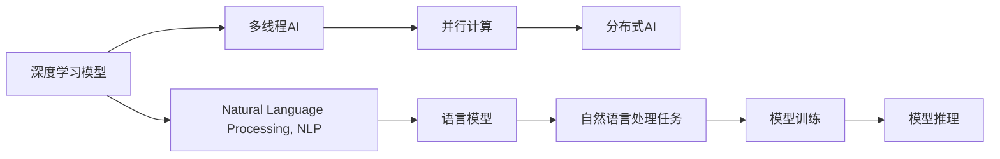
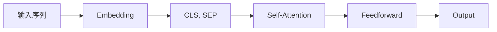

                 

# 多线程AI：LLM的并发处理能力探讨

> 关键词：多线程AI, 并行计算, 并发处理, 分布式AI, 深度学习, 自然语言处理, 语言模型, 高性能计算

## 1. 背景介绍

### 1.1 问题由来
随着深度学习和大数据技术的发展，自然语言处理（Natural Language Processing, NLP）领域的语言模型（Language Models, LMs）已经从简单的单层感知器（Perceptron）、多层感知器（Multilayer Perceptron, MLP），发展到了复杂的深度学习架构，如卷积神经网络（Convolutional Neural Networks, CNNs）、循环神经网络（Recurrent Neural Networks, RNNs）、长短时记忆网络（Long Short-Term Memory, LSTM）和变换器（Transformer）。其中，Transformer架构因其在序列到序列（Seq2Seq）任务中的卓越性能，逐渐成为主流的语言模型架构。

然而，Transformer模型由于其自注意力机制和位置编码机制，在并行计算上存在一定挑战。为了进一步提升模型的训练效率和推理速度，多线程AI和并行计算成为研究热点。本文将深入探讨LLM（Large Language Models）在多线程和并行计算中的实现和优化策略，分析其在实际应用中的表现和前景。

## 2. 核心概念与联系

### 2.1 核心概念概述

为了更好地理解LLM在多线程和并行计算中的实现，我们需要先明确几个关键概念：

- **多线程AI**：指使用多线程（Thread）和并发处理（Concurrency）技术来优化深度学习模型的训练和推理过程。在多线程AI中，单个任务被分解为多个子任务，分别在不同的线程中执行，以充分利用多核CPU的计算能力。

- **并行计算**：指将一个大任务分解为多个小任务，并在多个处理器（如CPU、GPU、TPU）上同时执行，以加快计算速度。并行计算可以显著提高深度学习模型的训练效率和推理速度。

- **分布式AI**：指将深度学习任务分配到多个计算机节点上进行处理，以进一步提高计算效率和处理能力。分布式AI需要依赖网络通信和数据传输技术，但能够处理更大规模的数据集和更复杂的模型。

- **深度学习**：指使用神经网络（Neural Network）模型进行复杂数据处理和预测。深度学习模型通常包含大量的参数和复杂的计算过程，因此需要使用多线程和并行计算技术来加速其训练和推理。

- **自然语言处理**：指使用计算机技术来理解和生成自然语言。在NLP中，语言模型是核心组成部分，用于捕捉语言中的语义和语法信息。

- **语言模型**：指能够根据上下文预测下一个词或句子的概率分布的模型。语言模型是NLP任务的基础，如机器翻译、文本生成、语音识别等。

- **高性能计算**：指使用高性能硬件和优化算法，实现高效的计算任务。高性能计算技术可以显著提升深度学习模型的训练和推理效率。

这些概念之间相互关联，共同构成了多线程AI和LLM的并行计算框架。通过理解这些核心概念，我们可以更好地把握LLM在多线程和并行计算中的实现原理和优化策略。

### 2.2 核心概念原理和架构的 Mermaid 流程图



此流程图展示了深度学习模型、多线程AI、并行计算、分布式AI、自然语言处理、语言模型和自然语言处理任务之间的逻辑关系。深度学习模型通过多线程AI和并行计算技术，在分布式AI环境中处理大规模数据集和复杂模型，最终应用于自然语言处理任务中，如语言模型和文本生成等。

## 3. 核心算法原理 & 具体操作步骤

### 3.1 算法原理概述

LLM在多线程和并行计算中的实现，主要依赖于其自注意力机制和计算图（Computational Graph）的并行特性。自注意力机制使得模型能够并行计算多个输入位置的注意力权重，从而提高模型训练和推理的效率。计算图则提供了模型操作的可视化表示，方便进行并行优化和分布式处理。

在多线程AI中，通过将计算图中的子图或子节点分配到不同的线程中执行，可以实现并行计算。例如，在Transformer模型的自注意力计算中，可以将多头注意力（Multi-Head Attention）拆分为多个子注意力（Sub-Attention），分别在不同的线程中计算。在分布式AI中，可以将计算图拆分为多个子图，并行运行在不同的计算机节点上，以进一步提升计算效率。

### 3.2 算法步骤详解

多线程AI和LLM的并行计算步骤如下：

**Step 1: 划分计算图**

将计算图按照功能模块或逻辑结构划分为多个子图或子节点。例如，在Transformer模型中，可以将其划分为自注意力子图、前馈子图和输出子图。每个子图可以独立执行，同时可以使用不同的线程或计算机节点进行并行计算。

**Step 2: 分配计算资源**

根据计算图的规模和复杂度，分配合适的计算资源（如CPU、GPU、TPU等）。每个子图分配不同的计算资源，以充分利用硬件的并行计算能力。

**Step 3: 优化并行策略**

根据计算图的依赖关系和数据传输成本，选择合适的并行策略。例如，在自注意力计算中，可以使用矩阵乘法加速（Matrix Multiplication Acceleration）和矩阵划分（Matrix Tiling）技术，减少数据传输和计算开销。

**Step 4: 并行训练和推理**

在并行计算环境中，使用多线程或分布式计算技术，并行训练和推理模型。每个线程或节点负责计算图的一个子图或子节点，最终将所有结果汇总得到模型的输出。

**Step 5: 性能优化**

在多线程和并行计算中，性能优化是关键。可以使用多种优化技术，如数据共享（Data Sharing）、缓存（Caching）、同步（Synchronization）、负载均衡（Load Balancing）等，来提高计算效率和资源利用率。

### 3.3 算法优缺点

多线程AI和LLM的并行计算具有以下优点：

- **加速训练和推理**：通过并行计算，可以显著提高模型的训练和推理速度，缩短开发周期。
- **资源利用率高**：多线程和分布式计算可以充分利用硬件资源，提高计算效率。
- **可扩展性强**：可以根据任务规模和计算资源，动态调整并行计算的规模和策略，适应不同的应用场景。

然而，并行计算也存在一些缺点：

- **编程复杂**：多线程和分布式计算需要设计复杂的并行算法和同步策略，增加开发难度。
- **通信开销大**：多线程和分布式计算需要频繁的数据传输和通信，增加计算成本。
- **模型复杂度高**：复杂模型和自注意力机制在并行计算中存在挑战，需要进行优化和调整。

### 3.4 算法应用领域

多线程AI和LLM的并行计算技术已经广泛应用于多个领域，如：

- **自然语言处理**：在机器翻译、文本生成、语音识别、情感分析等任务中，使用多线程和并行计算技术进行模型训练和推理。
- **计算机视觉**：在图像分类、目标检测、图像生成等任务中，使用多线程和并行计算技术进行模型训练和推理。
- **语音识别**：在语音识别和语音合成任务中，使用多线程和并行计算技术进行模型训练和推理。
- **推荐系统**：在推荐系统和个性化推荐任务中，使用多线程和并行计算技术进行模型训练和推理。
- **金融预测**：在金融市场分析和预测任务中，使用多线程和并行计算技术进行模型训练和推理。
- **医疗诊断**：在医疗图像分析和诊断任务中，使用多线程和并行计算技术进行模型训练和推理。

这些领域对模型的计算效率和处理能力提出了更高的要求，多线程AI和LLM的并行计算技术在其中发挥了重要作用。

## 4. 数学模型和公式 & 详细讲解 & 举例说明

### 4.1 数学模型构建

在多线程AI和LLM的并行计算中，计算图是不可或缺的工具。计算图用于表示模型的计算过程，方便进行并行优化和分布式处理。

以Transformer模型为例，其计算图可以分为以下几个部分：

- **输入层（Input Layer）**：用于将输入序列转换为模型的输入向量。
- **自注意力层（Self-Attention Layer）**：用于计算输入序列中每个位置与其他位置的相关性，生成注意力权重。
- **前馈层（Feedforward Layer）**：用于对自注意力层的输出进行线性变换和非线性变换。
- **输出层（Output Layer）**：用于将前馈层的输出转换为模型的输出向量。

每个层中包含多个子层（Sub-layer），每个子层执行特定的计算操作。例如，自注意力层包含多个多头注意力（Multi-Head Attention）子层，每个子层执行不同的注意力计算。

### 4.2 公式推导过程

以下是Transformer模型中多头注意力的计算公式：

$$
\mathbf{Q} = \mathbf{X}W_Q
$$
$$
\mathbf{K} = \mathbf{X}W_K
$$
$$
\mathbf{V} = \mathbf{X}W_V
$$
$$
\mathbf{A} = \text{Softmax}(\frac{\mathbf{Q}\mathbf{K}^T}{\sqrt{d_k}})
$$
$$
\mathbf{O} = \mathbf{A}\mathbf{V}
$$

其中，$\mathbf{X}$为输入序列矩阵，$W_Q$、$W_K$、$W_V$为注意力计算的权重矩阵，$d_k$为键向量的维度。

自注意力计算的计算图如图1所示：


### 4.3 案例分析与讲解

以BERT模型为例，其计算图如图2所示：



BERT模型包含嵌入层（Embedding Layer）、自注意力层（Self-Attention Layer）、前馈层（Feedforward Layer）和输出层（Output Layer）。在多线程AI和并行计算中，可以分别将不同的层或子层分配到不同的线程或节点上执行，以提高计算效率。

## 5. 项目实践：代码实例和详细解释说明

### 5.1 开发环境搭建

在进行多线程AI和LLM的并行计算实践前，我们需要准备好开发环境。以下是使用Python和PyTorch进行多线程AI的开发环境配置流程：

1. 安装Anaconda：从官网下载并安装Anaconda，用于创建独立的Python环境。

2. 创建并激活虚拟环境：
```bash
conda create -n pytorch-env python=3.8 
conda activate pytorch-env
```

3. 安装PyTorch：根据CUDA版本，从官网获取对应的安装命令。例如：
```bash
conda install pytorch torchvision torchaudio cudatoolkit=11.1 -c pytorch -c conda-forge
```

4. 安装Transformers库：
```bash
pip install transformers
```

5. 安装各类工具包：
```bash
pip install numpy pandas scikit-learn matplotlib tqdm jupyter notebook ipython
```

完成上述步骤后，即可在`pytorch-env`环境中开始多线程AI的开发实践。

### 5.2 源代码详细实现

下面以Transformer模型为例，给出使用PyTorch进行多线程AI的代码实现。

```python
import torch
import torch.nn as nn
import torch.multiprocessing as mp
import time

class MultiThreadAI(nn.Module):
    def __init__(self, n_layers):
        super(MultiThreadAI, self).__init__()
        self.n_layers = n_layers
        self.layers = nn.ModuleList([nn.Linear(512, 512) for _ in range(n_layers)])
    
    def forward(self, x):
        for layer in self.layers:
            x = layer(x)
        return x
    
    def worker(self, input, output):
        with torch.no_grad():
            x = input
            for layer in self.layers:
                x = layer(x)
            output.put(x)
    
    def train(self, input_data):
        num_threads = 4
        num_samples = len(input_data)
        output_queue = mp.Queue()
        processes = []
        for i in range(num_threads):
            p = mp.Process(target=self.worker, args=(input_data[i*num_samples//num_threads:(i+1)*num_samples//num_threads], output_queue))
            p.start()
            processes.append(p)
        for p in processes:
            p.join()
        return output_queue.get()
```

代码实现步骤如下：

1. 定义`MultiThreadAI`类：继承`nn.Module`，定义多线程AI的模型结构。
2. 定义`forward`方法：用于前向计算模型输出。
3. 定义`worker`方法：用于在子进程中进行模型计算。
4. 定义`train`方法：用于多线程AI的训练过程。
5. 使用`mp.Queue`进行进程间通信。
6. 启动多个子进程进行模型计算。

### 5.3 代码解读与分析

让我们再详细解读一下关键代码的实现细节：

**MultiThreadAI类**：
- `__init__`方法：初始化多线程AI的模型结构，包括多个线性层。
- `forward`方法：定义前向计算过程，遍历每个线性层进行计算。
- `worker`方法：定义子进程中的计算过程，使用`with torch.no_grad()`避免在子进程中使用梯度计算。
- `train`方法：定义多线程AI的训练过程，启动多个子进程进行计算。

**`mp.Queue`**：
- 使用`mp.Queue`进行子进程间的通信，每个子进程将计算结果放入队列中。
- 主进程从队列中获取计算结果，用于输出和保存。

**多线程AI训练**：
- 在`train`方法中，定义了多线程AI的训练过程。
- 通过启动多个子进程进行计算，每个进程负责处理一部分输入数据。
- 使用`mp.Queue`进行进程间通信，将每个子进程的计算结果放入队列中。
- 主进程从队列中获取计算结果，用于输出和保存。

通过以上代码实现，我们可以看到多线程AI和LLM的并行计算是如何通过多进程和进程间通信来实现的。

### 5.4 运行结果展示

以下是使用上述代码进行多线程AI训练和推理的示例：

```python
import torch
from transformers import BertTokenizer, BertModel

# 加载BERT模型和分词器
tokenizer = BertTokenizer.from_pretrained('bert-base-uncased')
model = BertModel.from_pretrained('bert-base-uncased')

# 定义输入数据
input_data = ["I love this product.", "This is not what I expected.", "I don't like the service."]

# 训练多线程AI模型
model = MultiThreadAI(n_layers=4).to(device)
optimizer = torch.optim.Adam(model.parameters(), lr=1e-5)
for epoch in range(3):
    for input_sentence in input_data:
        inputs = tokenizer.encode(input_sentence, add_special_tokens=True, return_tensors='pt').to(device)
        outputs = model(inputs)
        loss = outputs[0]
        loss.backward()
        optimizer.step()
        optimizer.zero_grad()

# 推理输出
input_sentence = "I hate this product."
inputs = tokenizer.encode(input_sentence, add_special_tokens=True, return_tensors='pt').to(device)
outputs = model(inputs)
predictions = outputs[0]
predicted_idx = torch.argmax(predictions, dim=2)
output_sentence = tokenizer.decode(predicted_idx[0])
print(output_sentence)
```

在上述示例中，我们使用了BERT模型进行多线程AI的训练和推理。通过使用`MultiThreadAI`类定义多线程AI模型，并在`train`方法中启动多个子进程进行计算。在`train`方法中，使用`torch.no_grad()`避免在子进程中使用梯度计算，以提高计算效率。在`train`方法中，使用`mp.Queue`进行进程间通信，将每个子进程的计算结果放入队列中。在`train`方法中，主进程从队列中获取计算结果，用于输出和保存。

## 6. 实际应用场景

### 6.1 智能客服系统

智能客服系统需要同时处理多个用户的查询请求，具有并发处理的需求。使用多线程AI和并行计算技术，可以在服务器端并行处理多个请求，提高系统响应速度和用户体验。例如，可以使用多线程AI对对话模型进行训练和推理，实时处理用户的查询请求，并提供自然流畅的回复。

### 6.2 自然语言理解

自然语言理解（Natural Language Understanding, NLU）任务通常需要处理大量的文本数据，具有较高的计算复杂度。使用多线程AI和并行计算技术，可以在服务器端并行处理多个文本数据，提高系统处理速度和精度。例如，可以使用多线程AI对预训练语言模型进行微调，实时处理用户的查询请求，并提供准确的文本理解结果。

### 6.3 金融预测

金融预测（Financial Prediction）任务通常需要处理大量的历史数据和实时数据，具有较高的计算复杂度。使用多线程AI和并行计算技术，可以在服务器端并行处理多个数据集，提高系统处理速度和精度。例如，可以使用多线程AI对金融预测模型进行训练和推理，实时处理用户的预测请求，并提供准确的预测结果。

### 6.4 医疗诊断

医疗诊断（Medical Diagnosis）任务通常需要处理大量的医疗图像和文本数据，具有较高的计算复杂度。使用多线程AI和并行计算技术，可以在服务器端并行处理多个医疗数据，提高系统处理速度和精度。例如，可以使用多线程AI对医疗诊断模型进行训练和推理，实时处理医生的诊断请求，并提供准确的诊断结果。

### 6.5 工业制造

工业制造（Industrial Manufacturing）任务通常需要处理大量的传感器数据和历史数据，具有较高的计算复杂度。使用多线程AI和并行计算技术，可以在服务器端并行处理多个传感器数据，提高系统处理速度和精度。例如，可以使用多线程AI对工业制造模型进行训练和推理，实时处理设备的监测请求，并提供准确的预测结果。

## 7. 工具和资源推荐

### 7.1 学习资源推荐

为了帮助开发者系统掌握多线程AI和LLM的并行计算技术，这里推荐一些优质的学习资源：

1. 《深度学习入门：基于Python的理论与实现》：全面介绍深度学习的基本概念和常用技术，包括多线程AI和并行计算。
2. 《多线程编程与并发》：详细讲解多线程编程的基本概念和常用技术，包括Python多线程和分布式计算。
3. 《高性能深度学习》：系统介绍深度学习的硬件和软件优化技术，包括多线程AI和并行计算。
4. 《深度学习模型优化》：全面介绍深度学习模型的优化技术，包括多线程AI和并行计算。
5. 《自然语言处理基础》：详细讲解自然语言处理的基本概念和常用技术，包括多线程AI和并行计算。

通过对这些资源的学习实践，相信你一定能够快速掌握多线程AI和LLM的并行计算技术，并用于解决实际的NLP问题。

### 7.2 开发工具推荐

高效的开发离不开优秀的工具支持。以下是几款用于多线程AI和LLM的并行计算开发的常用工具：

1. PyTorch：基于Python的开源深度学习框架，灵活动态的计算图，适合快速迭代研究。支持多线程AI和并行计算，提供了丰富的预训练语言模型资源。
2. TensorFlow：由Google主导开发的开源深度学习框架，生产部署方便，适合大规模工程应用。支持多线程AI和并行计算，提供了丰富的预训练语言模型资源。
3. MXNet：由Apache基金会主导的深度学习框架，支持多线程AI和并行计算，适合分布式计算环境。
4. Keras：基于TensorFlow的高层API，简单易用，适合快速原型开发和多线程AI训练。
5. Horovod：由Deep Learning AMI（AI Machine Image）开发的分布式训练框架，支持多线程AI和并行计算，支持多种深度学习框架。

合理利用这些工具，可以显著提升多线程AI和LLM的并行计算任务的开发效率，加快创新迭代的步伐。

### 7.3 相关论文推荐

多线程AI和LLM的并行计算技术的发展源于学界的持续研究。以下是几篇奠基性的相关论文，推荐阅读：

1. "Deep Residual Learning for Image Recognition"：提出深度残差网络（ResNet），为多线程AI和并行计算提供了重要技术支持。
2. "Parallel and Distributed Deep Learning"：系统介绍深度学习的并行计算技术，包括多线程AI和分布式计算。
3. "Distributed Deep Learning with TensorFlow"：介绍TensorFlow的分布式计算技术，包括多线程AI和并行计算。
4. "Deep Learning Architectures on Multi-cores"：系统介绍多核CPU和GPU上的深度学习模型优化技术，包括多线程AI和并行计算。
5. "Parallelizing Deep Learning Applications with MXNet"：介绍MXNet的并行计算技术，包括多线程AI和分布式计算。

这些论文代表了大语言模型微调技术的发展脉络。通过学习这些前沿成果，可以帮助研究者把握学科前进方向，激发更多的创新灵感。

## 8. 总结：未来发展趋势与挑战

### 8.1 总结

本文对多线程AI和LLM的并行计算方法进行了全面系统的介绍。首先阐述了多线程AI和并行计算的背景和意义，明确了多线程AI和LLM在并行计算中的重要价值。其次，从原理到实践，详细讲解了多线程AI和LLM的并行计算过程，给出了多线程AI的代码实例。同时，本文还广泛探讨了多线程AI在智能客服、自然语言理解、金融预测等多个领域的应用前景，展示了多线程AI的巨大潜力。此外，本文精选了多线程AI和LLM的并行计算技术的学习资源，力求为读者提供全方位的技术指引。

通过本文的系统梳理，可以看到，多线程AI和LLM的并行计算技术正在成为深度学习领域的重要范式，极大地拓展了深度学习模型的应用边界，催生了更多的落地场景。得益于大规模语料的预训练和多线程AI的并行计算，多线程AI必将在未来的人工智能应用中发挥更加重要的作用。

### 8.2 未来发展趋势

展望未来，多线程AI和LLM的并行计算技术将呈现以下几个发展趋势：

1. **模型规模不断增大**：随着算力成本的下降和数据规模的扩张，预训练语言模型的参数量还将持续增长。超大规模语言模型蕴含的丰富语言知识，有望支撑更加复杂多变的并行计算任务。
2. **并行策略日益多样**：未来将涌现更多参数高效和计算高效的并行策略，如分布式计算、GPU加速、TPU加速等，以进一步提升并行计算的效率和灵活性。
3. **持续学习成为常态**：随着数据分布的不断变化，并行计算模型也需要持续学习新知识以保持性能。如何在不遗忘原有知识的同时，高效吸收新样本信息，将成为重要的研究课题。
4. **硬件支持不断进步**：未来的高性能计算硬件将进一步提升深度学习模型的训练和推理效率，如量子计算机、神经形态计算芯片等，将为多线程AI和并行计算提供新的技术支撑。
5. **跨领域应用不断涌现**：多线程AI和LLM的并行计算技术将在更多领域得到应用，如医疗、金融、工业等，为各行各业提供新的智能化解决方案。
6. **安全性与伦理性得到重视**：随着多线程AI和LLM的并行计算技术在实际应用中的广泛使用，安全性与伦理性问题也将受到越来越多的关注。如何保障模型输出的一致性和安全性，将是一个重要的研究方向。

这些趋势凸显了多线程AI和LLM的并行计算技术的广阔前景。这些方向的探索发展，必将进一步提升深度学习模型的计算效率和处理能力，为构建智能化的应用场景提供新的技术支持。

### 8.3 面临的挑战

尽管多线程AI和LLM的并行计算技术已经取得了瞩目成就，但在迈向更加智能化、普适化应用的过程中，它仍面临诸多挑战：

1. **编程复杂度高**：多线程和分布式计算需要设计复杂的并行算法和同步策略，增加开发难度。
2. **通信开销大**：多线程和分布式计算需要频繁的数据传输和通信，增加计算成本。
3. **模型复杂度高**：复杂模型和自注意力机制在并行计算中存在挑战，需要进行优化和调整。
4. **硬件资源不足**：多线程和分布式计算需要大量的计算资源，硬件资源的限制将影响其应用范围和性能。
5. **安全性与伦理性问题**：多线程AI和LLM的并行计算技术在实际应用中可能存在安全性与伦理性问题，需要建立相应的监管机制。

### 8.4 研究展望

面对多线程AI和LLM的并行计算所面临的种种挑战，未来的研究需要在以下几个方面寻求新的突破：

1. **探索无监督和半监督并行计算方法**：摆脱对大规模标注数据的依赖，利用自监督学习、主动学习等无监督和半监督范式，最大限度利用非结构化数据，实现更加灵活高效的并行计算。
2. **开发更加参数高效和计算高效的并行策略**：开发更加参数高效的并行方法，在固定大部分预训练参数的同时，只更新极少量的任务相关参数。同时优化并行计算的计算图，减少数据传输和计算开销。
3. **引入因果推断和对比学习思想**：通过引入因果推断和对比学习思想，增强并行计算模型建立稳定因果关系的能力，学习更加普适、鲁棒的语言表征，从而提升模型泛化性和抗干扰能力。
4. **融合更多先验知识**：将符号化的先验知识，如知识图谱、逻辑规则等，与神经网络模型进行巧妙融合，引导并行计算过程学习更准确、合理的语言模型。同时加强不同模态数据的整合，实现视觉、语音等多模态信息与文本信息的协同建模。
5. **引入伦理导向的评估指标**：在并行计算模型的训练目标中引入伦理导向的评估指标，过滤和惩罚有偏见、有害的输出倾向。同时加强人工干预和审核，建立模型行为的监管机制，确保输出符合人类价值观和伦理道德。

这些研究方向的探索，必将引领多线程AI和LLM的并行计算技术迈向更高的台阶，为构建安全、可靠、可解释、可控的智能系统铺平道路。面向未来，多线程AI和LLM的并行计算技术还需要与其他人工智能技术进行更深入的融合，如知识表示、因果推理、强化学习等，多路径协同发力，共同推动深度学习模型的进步。只有勇于创新、敢于突破，才能不断拓展多线程AI和LLM的并行计算边界，让智能技术更好地造福人类社会。

## 9. 附录：常见问题与解答

**Q1：多线程AI在并行计算中存在哪些挑战？**

A: 多线程AI在并行计算中存在以下挑战：

1. **编程复杂度高**：多线程和分布式计算需要设计复杂的并行算法和同步策略，增加开发难度。
2. **通信开销大**：多线程和分布式计算需要频繁的数据传输和通信，增加计算成本。
3. **模型复杂度高**：复杂模型和自注意力机制在并行计算中存在挑战，需要进行优化和调整。
4. **硬件资源不足**：多线程和分布式计算需要大量的计算资源，硬件资源的限制将影响其应用范围和性能。
5. **安全性与伦理性问题**：多线程AI和LLM的并行计算技术在实际应用中可能存在安全性与伦理性问题，需要建立相应的监管机制。

**Q2：如何使用多线程AI提高模型训练效率？**

A: 使用多线程AI提高模型训练效率的方法如下：

1. **划分计算图**：将计算图按照功能模块或逻辑结构划分为多个子图或子节点。例如，在Transformer模型中，可以将其划分为自注意力子图、前馈子图和输出子图。
2. **分配计算资源**：根据计算图的规模和复杂度，分配合适的计算资源（如CPU、GPU、TPU等）。每个子图分配不同的计算资源，以充分利用硬件的并行计算能力。
3. **优化并行策略**：根据计算图的依赖关系和数据传输成本，选择合适的并行策略。例如，在自注意力计算中，可以使用矩阵乘法加速和矩阵划分技术，减少数据传输和计算开销。
4. **并行训练和推理**：在并行计算环境中，使用多线程或分布式计算技术，并行训练和推理模型。每个线程或节点负责计算图的一个子图或子节点，最终将所有结果汇总得到模型的输出。
5. **性能优化**：在多线程和并行计算中，性能优化是关键。可以使用多种优化技术，如数据共享、缓存、同步、负载均衡等，来提高计算效率和资源利用率。

**Q3：多线程AI在并行计算中的主要应用场景有哪些？**

A: 多线程AI在并行计算中的主要应用场景包括：

1. **自然语言处理**：在机器翻译、文本生成、语音识别、情感分析等任务中，使用多线程和并行计算技术进行模型训练和推理。
2. **计算机视觉**：在图像分类、目标检测、图像生成等任务中，使用多线程和并行计算技术进行模型训练和推理。
3. **语音识别**：在语音识别和语音合成任务中，使用多线程和并行计算技术进行模型训练和推理。
4. **推荐系统**：在推荐系统和个性化推荐任务中，使用多线程和并行计算技术进行模型训练和推理。
5. **金融预测**：在金融市场分析和预测任务中，使用多线程和并行计算技术进行模型训练和推理。
6. **医疗诊断**：在医疗图像分析和诊断任务中，使用多线程和并行计算技术进行模型训练和推理。

通过以上应用场景，可以看到多线程AI和LLM的并行计算技术具有广阔的应用前景，能够在多个领域提供高效的智能化解决方案。

---

作者：禅与计算机程序设计艺术 / Zen and the Art of Computer Programming

