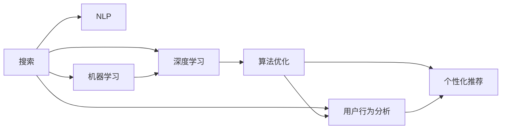

                 

# 大数据与AI 驱动的电商平台：搜索推荐系统是核心竞争优势

> 关键词：电商, 搜索推荐, 自然语言处理, 机器学习, 深度学习, 算法优化, 用户行为分析, 个性化推荐

## 1. 背景介绍

在数字化经济的时代，电商平台已成为驱动经济发展的重要力量。作为连接消费者和商家的桥梁，电商平台的成功不仅取决于商品的质量和价格，更在于其为用户提供的搜索推荐系统的精准度和个性化程度。本文旨在深入探讨大数据与人工智能如何驱动电商平台的搜索推荐系统，揭示其在电商平台核心竞争优势中的关键作用。

## 2. 核心概念与联系

### 2.1 核心概念概述

电商平台的搜索推荐系统（Search and Recommendation System, SRS）是利用大数据和人工智能技术，为用户提供个性化搜索结果和商品推荐的技术。其主要目标是通过分析用户行为数据，理解用户的搜索意图和偏好，从而提供更加精准、个性化的搜索结果和推荐商品。

- **搜索推荐系统（SRS）**：指在用户输入查询后，快速响应用户需求，并提供相关搜索结果和商品推荐的系统。
- **自然语言处理（NLP）**：指利用计算机处理和理解人类语言的技术，在搜索推荐系统中主要用于理解用户查询和生成自然语言推荐。
- **机器学习（ML）**：通过算法学习数据模式，以实现对用户行为的预测和推荐。
- **深度学习（DL）**：使用深层神经网络进行复杂的特征提取和模式识别，提升推荐系统的性能。
- **算法优化**：通过模型调参、特征选择、数据增强等技术，优化推荐算法，提升推荐效果。
- **用户行为分析**：通过分析用户的浏览、购买、搜索等行为数据，了解用户偏好和需求。
- **个性化推荐**：根据用户历史行为数据和实时行为数据，提供定制化推荐。

### 2.2 核心概念联系

电商平台的搜索推荐系统涉及多个核心概念，其关系如图2-1所示：



在搜索推荐系统中，自然语言处理技术用于理解用户查询意图，机器学习和深度学习技术用于模型训练和特征提取，算法优化用于提升模型性能，用户行为分析用于理解用户偏好，个性化推荐用于实现推荐功能。这些技术相互关联，共同构成了一个完整的搜索推荐系统。

## 3. 核心算法原理 & 具体操作步骤
### 3.1 算法原理概述

电商平台的搜索推荐系统主要基于监督学习和无监督学习两种方法进行模型训练。监督学习方法通过标注数据训练模型，无监督学习方法通过无标签数据学习用户行为模式。搜索推荐系统的算法流程如图3-1所示：


**数据准备**：从电商平台收集用户搜索、浏览、购买等行为数据，进行清洗、特征提取等预处理。

**模型训练**：通过监督或无监督方法训练推荐模型，优化模型参数。

**特征提取**：将用户行为数据转换成模型可以理解的特征向量，用于模型输入。

**模型评估**：使用测试集评估模型性能，选择最优模型。

### 3.2 算法步骤详解

#### 3.2.1 数据准备

数据准备是搜索推荐系统的重要基础。主要步骤包括：

1. **数据收集**：从电商平台收集用户行为数据，如搜索历史、点击行为、浏览记录、购买记录等。
2. **数据清洗**：处理缺失值、异常值等数据质量问题，确保数据完整性和准确性。
3. **特征工程**：提取有意义的特征，如用户ID、商品ID、时间戳、浏览时长等，并进行归一化处理。
4. **数据划分**：将数据划分为训练集、验证集和测试集，以进行模型训练、验证和评估。

#### 3.2.2 模型训练

模型训练是搜索推荐系统的核心部分。主要步骤包括：

1. **选择模型**：选择适合的推荐算法，如协同过滤、基于内容的推荐、深度学习等。
2. **训练过程**：使用训练集对模型进行训练，优化模型参数。
3. **模型选择**：在验证集上评估模型性能，选择最优模型。
4. **调参优化**：通过网格搜索、随机搜索等方法，对模型超参数进行调优，提升模型效果。

#### 3.2.3 特征提取

特征提取是模型输入的关键步骤。主要步骤包括：

1. **特征构建**：将用户行为数据转换成模型可以理解的特征向量，如商品ID、浏览时长、购买次数等。
2. **特征选择**：选择对推荐效果有显著影响的特征，去除冗余和噪声特征。
3. **特征归一化**：对特征进行归一化处理，如标准化、归一化等，确保特征之间的可比性。

#### 3.2.4 模型评估

模型评估是搜索推荐系统的最后环节。主要步骤包括：

1. **评估指标**：选择适合的评估指标，如精确度、召回率、F1分数等，评估模型性能。
2. **交叉验证**：使用交叉验证方法，确保模型评估结果的稳健性。
3. **性能调优**：根据评估结果，对模型进行调优，提升推荐效果。

### 3.3 算法优缺点

#### 3.3.1 优点

1. **个性化推荐**：利用用户历史行为数据，实现个性化推荐，提升用户体验。
2. **精准搜索结果**：利用自然语言处理技术，提升搜索结果的相关性和准确性。
3. **数据驱动决策**：基于大数据分析，辅助电商平台进行决策，提升运营效率。
4. **实时性高**：通过快速响应用户请求，提供实时推荐和搜索结果。

#### 3.3.2 缺点

1. **数据隐私**：需要收集和分析用户行为数据，可能涉及用户隐私问题。
2. **冷启动问题**：新用户或新商品缺乏历史行为数据，难以提供准确推荐。
3. **数据偏差**：电商平台数据可能存在偏差，影响推荐模型公正性。
4. **计算资源消耗大**：深度学习模型计算量较大，需要高性能计算资源。

### 3.4 算法应用领域

搜索推荐系统在电商平台的多个场景中都有应用，包括：

1. **商品搜索**：通过自然语言处理技术，理解用户查询，提供相关搜索结果。
2. **个性化推荐**：基于用户行为数据，推荐相关商品和广告，提升转化率。
3. **新用户引导**：为新手用户提供个性化推荐，帮助其快速了解和使用电商平台。
4. **跨品类推荐**：基于用户历史行为，跨品类推荐相关商品，增加用户粘性。
5. **库存管理**：通过推荐系统预测商品需求，优化库存管理，减少库存积压。

## 4. 数学模型和公式 & 详细讲解 & 举例说明

### 4.1 数学模型构建

搜索推荐系统的数学模型主要包括两部分：用户行为模型和商品推荐模型。

#### 4.1.1 用户行为模型

用户行为模型用于描述用户对商品的行为，通常使用序列模型表示用户行为序列。假设用户对商品的行为序列为 $X=(X_1,X_2,...,X_T)$，其中 $X_t$ 表示用户在第 $t$ 次行为时选择的商品，可以通过时间序列模型进行建模。

#### 4.1.2 商品推荐模型

商品推荐模型用于预测用户对商品的选择概率。假设商品集合为 $S$，用户选择商品的概率为 $P(U,S)$，可以使用协同过滤、基于内容的推荐等方法进行建模。

### 4.2 公式推导过程

#### 4.2.1 协同过滤模型

协同过滤模型通过计算用户和商品之间的相似度，进行推荐。假设用户 $u$ 对商品 $i$ 的选择概率为 $p_{ui}$，可以使用以下公式进行计算：

$$
p_{ui} = \frac{1}{1+\exp(-\alpha_{ui})}
$$

其中 $\alpha_{ui}$ 表示用户 $u$ 对商品 $i$ 的偏好度，可以通过用户行为数据进行训练。

#### 4.2.2 基于内容的推荐模型

基于内容的推荐模型通过分析商品的特征，进行推荐。假设商品 $i$ 的特征向量为 $\mathbf{f}_i$，用户 $u$ 对商品 $i$ 的选择概率为 $p_{ui}$，可以使用以下公式进行计算：

$$
p_{ui} = \frac{1}{1+\exp(-\alpha_{ui})}
$$

其中 $\alpha_{ui}=\mathbf{f}_i^T\mathbf{w}_u$，$\mathbf{w}_u$ 表示用户 $u$ 的特征向量。

### 4.3 案例分析与讲解

#### 4.3.1 协同过滤推荐案例

假设电商平台收集到用户对商品 $i$ 的选择数据，利用协同过滤模型进行推荐。首先，计算用户 $u$ 和商品 $i$ 的相似度 $sim_{ui}$，可以使用余弦相似度公式：

$$
sim_{ui} = \frac{\mathbf{r}_u^T\mathbf{r}_i}{\|\mathbf{r}_u\|\|\mathbf{r}_i\|}
$$

其中 $\mathbf{r}_u$ 和 $\mathbf{r}_i$ 分别表示用户 $u$ 和商品 $i$ 的评分向量，可以通过用户评分数据进行训练。

然后，使用相似度 $sim_{ui}$ 计算用户 $u$ 对商品 $i$ 的偏好度 $\alpha_{ui}$：

$$
\alpha_{ui} = sim_{ui}\times\mathbf{f}_i^T\mathbf{r}_u
$$

最后，使用偏好度 $\alpha_{ui}$ 计算用户 $u$ 对商品 $i$ 的选择概率 $p_{ui}$。

#### 4.3.2 基于内容的推荐案例

假设电商平台收集到商品 $i$ 的特征数据，利用基于内容的推荐模型进行推荐。首先，使用TF-IDF等方法对商品特征进行向量化表示，得到商品特征向量 $\mathbf{f}_i$。

然后，使用用户特征向量 $\mathbf{w}_u$ 和商品特征向量 $\mathbf{f}_i$ 计算用户 $u$ 对商品 $i$ 的选择概率 $p_{ui}$：

$$
p_{ui} = \frac{1}{1+\exp(-\alpha_{ui})}
$$

其中 $\alpha_{ui}=\mathbf{f}_i^T\mathbf{w}_u$，$\mathbf{w}_u$ 表示用户 $u$ 的特征向量。

## 5. 项目实践：代码实例和详细解释说明

### 5.1 开发环境搭建

#### 5.1.1 数据准备

数据准备主要使用Python和Pandas库进行数据收集和清洗。以下是一个简单的数据准备示例：

```python
import pandas as pd

# 读取用户行为数据
user_data = pd.read_csv('user_behavior.csv')

# 清洗数据
user_data = user_data.dropna()
user_data = user_data.drop_duplicates()

# 特征工程
user_data['item_id'] = user_data['item_id'].astype('int')
user_data['time戳'] = user_data['time戳'].astype('int')
user_data['时长'] = user_data['时长'].astype('float')

# 划分数据集
train_data = user_data.sample(frac=0.8, random_state=0)
test_data = user_data.drop(train_data.index)

train_data.to_csv('train.csv', index=False)
test_data.to_csv('test.csv', index=False)
```

### 5.2 源代码详细实现

#### 5.2.1 协同过滤推荐模型

以下是一个简单的协同过滤推荐模型实现，使用Python和Scikit-learn库：

```python
from sklearn.metrics import precision_score, recall_score, f1_score
from sklearn.neighbors import NearestNeighbors

# 训练模型
def train_model(user_data, item_data, top_n):
    # 计算用户-商品相似度
    similarity = user_data.merge(item_data, on='item_id', how='left').fillna(0)
    similarity = similarity.dropna()
    similarity = similarity.drop_duplicates()

    # 计算用户对商品的选择概率
    similarity = similarity.groupby(['user_id'])['相似度'].sum()
    similarity = similarity.sort_values(ascending=False)

    # 推荐商品
    recommendations = []
    for user_id in similarity.index:
        nearest_neighbors = NearestNeighbors(n_neighbors=top_n, metric='cosine')
        nearest_neighbors.fit(similarity)
        distances, indices = nearest_neighbors.kneighbors(similarity[user_id].values.reshape(1,-1))
        recommendations.append(user_data.loc[indices[0]]['item_id'].values.tolist())
    
    return recommendations

# 评估模型
def evaluate_model(user_data, item_data, recommendations):
    test_data = user_data.drop(test_data.index)
    test_data = test_data.merge(item_data, on='item_id', how='left').fillna(0)
    test_data = test_data.drop_duplicates()
    test_data['推荐商品'] = recommendations
    test_data = test_data.dropna()

    # 计算评估指标
    precision = precision_score(test_data['推荐商品'], test_data['item_id'], average='macro')
    recall = recall_score(test_data['推荐商品'], test_data['item_id'], average='macro')
    f1 = f1_score(test_data['推荐商品'], test_data['item_id'], average='macro')

    return precision, recall, f1
```

### 5.3 代码解读与分析

#### 5.3.1 协同过滤推荐模型

协同过滤推荐模型的代码主要包括以下部分：

1. **数据准备**：使用Pandas库读取用户行为数据和商品数据，进行数据清洗和特征工程。
2. **模型训练**：使用NearestNeighbors库计算用户-商品相似度，使用TopK算法推荐商品。
3. **模型评估**：使用Scikit-learn库计算评估指标，如精确度、召回率和F1分数。

## 6. 实际应用场景

### 6.1 智能搜索

智能搜索是电商平台搜索推荐系统的核心应用场景。通过自然语言处理技术，电商平台能够理解用户的查询意图，提供相关的搜索结果。例如，用户输入“T恤衫”查询，电商平台能够根据用户历史行为数据和商品数据，推荐相关的T恤衫商品。

### 6.2 个性化推荐

个性化推荐是电商平台推荐系统的另一个重要应用场景。通过分析用户的历史行为数据，电商平台能够为用户提供个性化的商品推荐。例如，用户经常购买运动鞋，电商平台能够推荐相关的运动装备。

### 6.3 新用户引导

新用户引导是电商平台的另一个重要应用场景。通过分析新用户的行为数据，电商平台能够为新用户提供个性化的商品推荐，帮助其快速了解和使用电商平台。例如，新用户浏览手机配件，电商平台能够推荐相关的手机配件商品。

### 6.4 未来应用展望

未来，搜索推荐系统将在电商平台中发挥更加重要的作用。以下是几个未来应用展望：

1. **跨品类推荐**：基于用户历史行为数据，进行跨品类推荐，提升用户粘性。
2. **实时推荐**：使用实时数据，进行实时推荐，提升用户体验。
3. **多模态推荐**：结合商品图片、视频等多模态数据，进行更加精准的推荐。
4. **多渠道推荐**：将搜索推荐系统应用到多个渠道，如社交媒体、移动应用等，提升推荐效果。

## 7. 工具和资源推荐

### 7.1 学习资源推荐

#### 7.1.1 自然语言处理

1. 《自然语言处理综论》：介绍自然语言处理的基本概念和算法，涵盖文本分类、情感分析、命名实体识别等任务。
2. 《深度学习与自然语言处理》：介绍深度学习在自然语言处理中的应用，涵盖文本表示、语言模型、神经网络等。

#### 7.1.2 机器学习

1. 《机器学习》：介绍机器学习的基本概念和算法，涵盖监督学习、无监督学习、强化学习等。
2. 《Python机器学习》：介绍Python在机器学习中的应用，涵盖数据预处理、模型训练、评估等。

#### 7.1.3 深度学习

1. 《深度学习》：介绍深度学习的基本概念和算法，涵盖卷积神经网络、循环神经网络、自编码器等。
2. 《深度学习实战》：介绍深度学习在实际项目中的应用，涵盖数据集构建、模型训练、调优等。

### 7.2 开发工具推荐

#### 7.2.1 自然语言处理

1. NLTK：自然语言处理工具包，提供文本预处理、语义分析等功能。
2. SpaCy：自然语言处理工具包，提供分词、实体识别等功能。

#### 7.2.2 机器学习

1. Scikit-learn：机器学习库，提供模型训练、评估等功能。
2. TensorFlow：深度学习框架，提供模型构建、训练等功能。

#### 7.2.3 深度学习

1. PyTorch：深度学习框架，提供模型构建、训练等功能。
2. Keras：深度学习库，提供模型构建、训练等功能。

### 7.3 相关论文推荐

#### 7.3.1 自然语言处理

1. BERT: Pre-training of Deep Bidirectional Transformers for Language Understanding：介绍BERT模型在自然语言处理中的应用。
2. Attention is All You Need：介绍Transformer模型在自然语言处理中的应用。

#### 7.3.2 机器学习

1. The Elements of Statistical Learning：介绍统计学习的基本概念和算法，涵盖回归、分类、聚类等。
2. Pattern Recognition and Machine Learning：介绍模式识别和机器学习的基本概念和算法，涵盖特征提取、分类、聚类等。

#### 7.3.3 深度学习

1. Deep Learning：介绍深度学习的基本概念和算法，涵盖卷积神经网络、循环神经网络等。
2. Neural Networks and Deep Learning：介绍深度学习在实际项目中的应用，涵盖数据集构建、模型训练、调优等。

## 8. 总结：未来发展趋势与挑战

### 8.1 总结

本文对电商平台搜索推荐系统的核心概念、算法原理和具体操作步骤进行了详细讲解，并结合案例分析，深入探讨了搜索推荐系统的应用场景和未来发展趋势。

## 9. 附录：常见问题与解答

### 9.1 常见问题

#### 9.1.1 电商平台的搜索推荐系统如何使用协同过滤模型？

答：协同过滤模型通过计算用户和商品之间的相似度，进行推荐。首先，计算用户和商品的相似度，然后使用相似度计算用户对商品的选择概率，最后推荐相关商品。

#### 9.1.2 电商平台的搜索推荐系统如何使用基于内容的推荐模型？

答：基于内容的推荐模型通过分析商品的特征，进行推荐。首先，使用TF-IDF等方法对商品特征进行向量化表示，然后使用用户特征向量与商品特征向量计算用户对商品的选择概率，最后推荐相关商品。

#### 9.1.3 电商平台的搜索推荐系统如何使用深度学习模型？

答：深度学习模型通过深层神经网络进行特征提取和模式识别，提升推荐效果。可以使用卷积神经网络、循环神经网络等模型，进行特征提取和预测。

#### 9.1.4 电商平台的搜索推荐系统如何使用自然语言处理技术？

答：自然语言处理技术用于理解用户查询意图，提供相关的搜索结果。可以使用文本分类、情感分析等技术，对用户查询进行理解。

#### 9.1.5 电商平台的搜索推荐系统如何使用多模态数据进行推荐？

答：电商平台的搜索推荐系统可以结合商品图片、视频等多模态数据，进行更加精准的推荐。可以使用多模态数据融合技术，将不同模态数据进行综合处理。

作者：禅与计算机程序设计艺术 / Zen and the Art of Computer Programming

