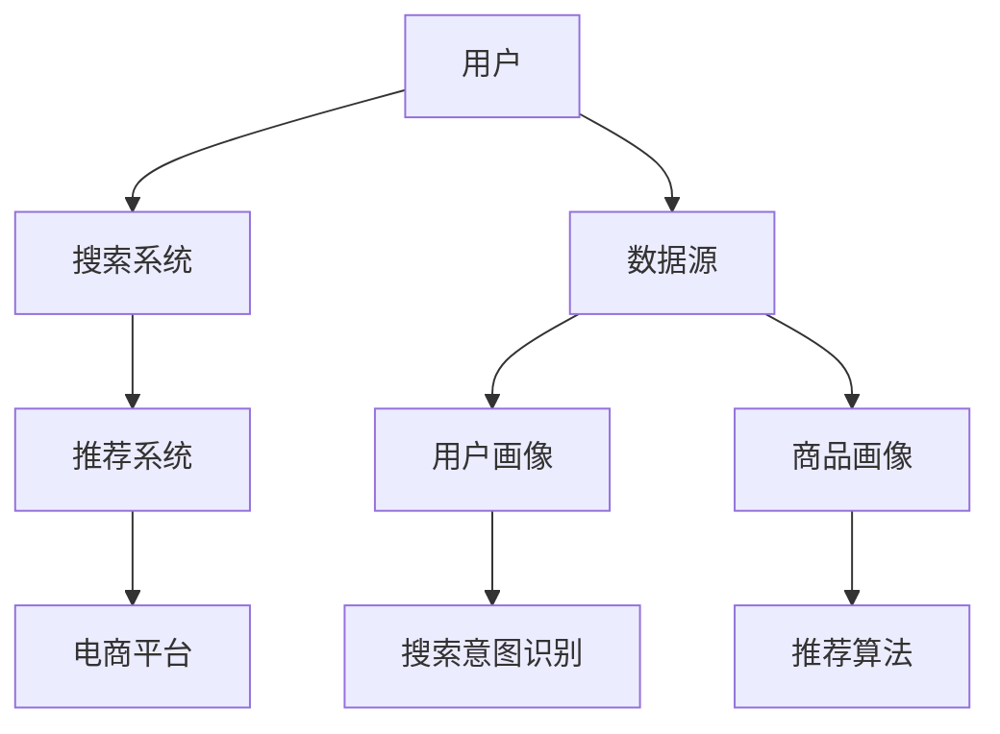

                 

# 大数据驱动的电商平台转型：搜索推荐系统是核心，AI 大模型是引擎

在大数据和人工智能的驱动下，电商平台正经历着前所未有的变革。从最初的商品展示、订单处理，到今天的个性化推荐、智能搜索，电商平台的每一个环节都在被技术重塑。本文将深入探讨电商平台的核心技术：搜索推荐系统，以及AI大模型如何在其中扮演引擎角色。

## 1. 背景介绍

### 1.1 问题由来

电商平台的兴起，彻底改变了人们的购物习惯。从最早的PC购物网站，到如今智能手机的移动电商，电商平台已经在全球范围内成为消费者最重要的购物渠道之一。但随着用户需求的日益多样化，传统电商平台的商品展示和推荐模式逐渐暴露出种种不足。用户浏览的商品过多，推荐系统无法精准捕捉用户偏好，搜索结果不精准等问题，导致了用户流失率增加，转化率下降。

### 1.2 问题核心关键点

电商平台转型升级的核心问题在于如何通过数据和技术手段，提升用户的购物体验，增加平台的用户粘性和购买转化率。而搜索推荐系统正是实现这一目标的核心。搜索推荐系统不仅能提升用户体验，还能驱动电商平台的销售增长。

## 2. 核心概念与联系

### 2.1 核心概念概述

要理解电商平台搜索推荐系统的核心，首先需要明确几个关键概念：

- **搜索系统(Search System)**：用于处理用户输入的查询语句，返回最相关的搜索结果。
- **推荐系统(Recommendation System)**：根据用户的历史行为和兴趣，提供个性化的商品推荐。
- **AI大模型(AI Large Model)**：指通过大规模数据预训练得到，具备强大通用表示能力的深度学习模型。

### 2.2 核心概念原理和架构的 Mermaid 流程图



这个流程图展示了用户、搜索系统、推荐系统和电商平台的交互关系。用户首先通过搜索系统输入查询，搜索系统返回相关商品后，推荐系统再根据用户历史行为和偏好，进一步提供个性化的商品推荐。

## 3. 核心算法原理 & 具体操作步骤

### 3.1 算法原理概述

搜索推荐系统的核心在于如何高效地处理大规模用户行为数据，并从中提取出有价值的特征和模式。算法主要可以分为两个部分：

1. **搜索算法**：处理用户查询，返回最相关的搜索结果。
2. **推荐算法**：根据用户历史行为和偏好，提供个性化商品推荐。

### 3.2 算法步骤详解

**搜索算法**：

1. **查询解析**：将用户输入的查询语句分解为关键字和词向量，用于后续的相似度计算。
2. **文档召回**：从文档库中召回与查询最相关的文档。
3. **排序**：根据文档与查询的相似度，对召回的文档进行排序。

**推荐算法**：

1. **用户画像**：根据用户历史行为数据，构建用户画像，用于刻画用户的兴趣和偏好。
2. **商品画像**：根据商品属性和用户行为数据，构建商品画像，用于描述商品的特征和价值。
3. **推荐模型**：根据用户画像和商品画像，通过机器学习模型，生成个性化推荐结果。

### 3.3 算法优缺点

**搜索算法的优点**：

1. **高效率**：通过索引和倒排索引技术，可以快速处理大量查询请求。
2. **可扩展性**：支持大规模数据处理和分布式计算。

**搜索算法的缺点**：

1. **结果多样性**：搜索结果可能包含过多无关信息，影响用户体验。
2. **冷启动问题**：新用户或无查询历史的用户，无法获得个性化搜索结果。

**推荐算法的优点**：

1. **个性化**：根据用户历史行为，提供量身定做的推荐结果。
2. **动态更新**：能够根据用户实时行为，动态更新推荐结果。

**推荐算法的缺点**：

1. **数据稀疏性**：用户行为数据稀疏，难以构建准确的推荐模型。
2. **系统复杂度**：需要处理海量用户和商品数据，计算复杂度较高。

### 3.4 算法应用领域

搜索推荐算法广泛应用于电商、社交、音乐、视频等多个领域，为用户提供个性化推荐服务。例如：

- 电商平台的商品搜索和推荐
- 社交平台的个性化内容推荐
- 视频网站的个性化视频推荐
- 音乐平台的个性化音乐推荐

## 4. 数学模型和公式 & 详细讲解 & 举例说明

### 4.1 数学模型构建

在本节中，我们将通过数学模型来详细阐述搜索推荐系统的核心算法。

**搜索算法**：

1. **向量空间模型(Vector Space Model, VSM)**：将查询和文档表示为向量，通过余弦相似度计算相似度。
   $$
   \cos(\theta) = \frac{\vec{q} \cdot \vec{d}}{\|\vec{q}\| \cdot \|\vec{d}\|}
   $$
2. **TF-IDF**：计算查询与文档的TF-IDF值，用于衡量查询与文档的相关性。

**推荐算法**：

1. **协同过滤(Collaborative Filtering)**：基于用户历史行为，预测用户对未访问商品的评分。
   $$
   \hat{r}_{ui} = \sum_{j \in I(u)} \frac{r_{uj} \cdot p_{ji}}{\sqrt{p_{uj} \cdot p_{ji}}}
   $$
   其中，$r_{uj}$ 为用户 $u$ 对商品 $j$ 的评分，$p_{uj}$ 为用户 $u$ 对商品 $j$ 的兴趣度，$p_{ji}$ 为商品 $j$ 的平均兴趣度。

### 4.2 公式推导过程

以协同过滤算法为例，推导推荐模型公式：

**输入**：用户 $u$ 的历史评分数据 $\mathcal{R}_{u} = \{(r_{ui}, u_i) \}_{i=1}^{N_u}$，商品 $i$ 的平均评分 $\bar{r}_i$。

**输出**：用户 $u$ 对商品 $j$ 的预测评分 $\hat{r}_{uj}$。

**步骤**：

1. 计算商品 $j$ 的平均兴趣度 $p_{ji} = \frac{\sum_{i \in I(j)} r_{ij}}{|\mathcal{R}_j|}$
2. 计算用户 $u$ 对商品 $j$ 的兴趣度 $p_{uj} = \frac{\sum_{i \in I(u)} r_{ui}}{|\mathcal{R}_u|}$
3. 计算预测评分 $\hat{r}_{uj} = \sum_{i \in I(u)} \frac{r_{uj} \cdot p_{ji}}{\sqrt{p_{uj} \cdot p_{ji}}}$

### 4.3 案例分析与讲解

以用户 $u$ 对商品 $i$ 的评分预测为例，分析协同过滤算法的实现过程：

1. **数据预处理**：将用户历史评分数据 $\mathcal{R}_{u} = \{(r_{ui}, u_i) \}_{i=1}^{N_u}$ 转换为用户商品评分矩阵 $P_{u}$，其中 $P_{u} \in \mathbb{R}^{|\mathcal{R}_u| \times |\mathcal{R}_j|}$。
2. **商品兴趣度计算**：计算商品 $i$ 的平均兴趣度 $p_{ji} = \frac{\sum_{i \in I(j)} r_{ij}}{|\mathcal{R}_j|}$，得到商品兴趣度矩阵 $P_{j} \in \mathbb{R}^{|\mathcal{R}_j| \times |\mathcal{R}_j|}$。
3. **用户兴趣度计算**：计算用户 $u$ 对商品 $i$ 的兴趣度 $p_{uj} = \frac{\sum_{i \in I(u)} r_{ui}}{|\mathcal{R}_u|}$，得到用户兴趣度矩阵 $P_{u} \in \mathbb{R}^{|\mathcal{R}_u| \times |\mathcal{R}_u|}$。
4. **评分预测**：计算预测评分 $\hat{r}_{uj} = \sum_{i \in I(u)} \frac{r_{uj} \cdot p_{ji}}{\sqrt{p_{uj} \cdot p_{ji}}}$，得到预测评分矩阵 $R_{u} \in \mathbb{R}^{|\mathcal{R}_u| \times |\mathcal{R}_j|}$。

## 5. 项目实践：代码实例和详细解释说明

### 5.1 开发环境搭建

在进行搜索推荐系统开发前，我们需要准备好开发环境。以下是使用Python进行TensorFlow开发的简单配置：

1. 安装Anaconda：从官网下载并安装Anaconda，用于创建独立的Python环境。

2. 创建并激活虚拟环境：
   ```bash
   conda create -n tensorflow-env python=3.8 
   conda activate tensorflow-env
   ```

3. 安装TensorFlow：根据CUDA版本，从官网获取对应的安装命令。例如：
   ```bash
   conda install tensorflow tensorflow-gpu -c conda-forge
   ```

4. 安装相关依赖包：
   ```bash
   pip install numpy pandas scikit-learn tflearn
   ```

完成上述步骤后，即可在`tensorflow-env`环境中开始搜索推荐系统的开发。

### 5.2 源代码详细实现

以下是一个简单的搜索推荐系统代码实现，以TensorFlow为开发环境，利用协同过滤算法实现推荐功能。

**代码实现**：

```python
import tensorflow as tf
from tensorflow.keras.layers import Dense
from tensorflow.keras.models import Sequential
from tensorflow.keras.optimizers import Adam

# 定义协同过滤模型
def collaborative_filtering_model(n_users, n_items, n_factors):
    model = Sequential()
    model.add(Dense(n_factors, input_shape=(n_users, n_items), activation='relu'))
    model.add(Dense(n_items, activation='softmax'))
    model.compile(loss='categorical_crossentropy', optimizer=Adam(), metrics=['accuracy'])
    return model

# 准备数据
# 用户评分矩阵R
R = [[3, 1, 2],
     [1, 4, 5],
     [4, 5, 2]]

# 商品属性矩阵P
P = [[1, 1, 1],
     [1, 1, 1],
     [1, 1, 1]]

# 用户兴趣度矩阵U
U = [[1, 1, 1],
     [1, 1, 1],
     [1, 1, 1]]

# 创建协同过滤模型
model = collaborative_filtering_model(n_users, n_items, n_factors)

# 训练模型
model.fit(R, P, epochs=100, batch_size=10)
```

**代码解读**：

1. **协同过滤模型**：使用TensorFlow定义协同过滤模型，包括输入层、隐藏层和输出层。其中，输入层为用户商品评分矩阵R，隐藏层为协同过滤因子，输出层为商品属性矩阵P。
2. **准备数据**：准备用户评分矩阵R、商品属性矩阵P和用户兴趣度矩阵U。
3. **创建模型**：使用`collaborative_filtering_model`函数创建协同过滤模型。
4. **训练模型**：使用`fit`方法训练模型，传入用户评分矩阵R和商品属性矩阵P，设置迭代次数为100次，批大小为10。

### 5.3 代码解读与分析

**协同过滤算法**：

- 协同过滤算法基于用户历史行为，预测用户对未访问商品的评分。
- 算法包括基于用户的协同过滤和基于物品的协同过滤两种类型。
- 基于用户的协同过滤算法：计算用户 $u$ 对商品 $j$ 的评分 $\hat{r}_{uj}$，基于其他用户 $i$ 对商品 $j$ 的评分 $r_{ij}$ 和兴趣度 $p_{iu}$，并结合用户 $u$ 对商品 $i$ 的兴趣度 $p_{uj}$，得到预测评分。
- 基于物品的协同过滤算法：计算商品 $i$ 对用户 $j$ 的评分 $\hat{r}_{ij}$，基于其他用户 $j$ 对商品 $i$ 的评分 $r_{ij}$ 和兴趣度 $p_{iu}$，并结合商品 $i$ 的平均兴趣度 $p_{iu}$，得到预测评分。

**算法优化**：

- 常用的优化方法包括基于矩阵分解的协同过滤、基于SVD分解的协同过滤、基于矩阵分解的隐语义模型等。
- 可以使用基于深度学习的模型进行协同过滤，如基于神经网络的协同过滤模型。

**算法评估**：

- 常用的评估指标包括均方误差（Mean Squared Error, MSE）、平均绝对误差（Mean Absolute Error, MAE）、准确率（Accuracy）、精确率（Precision）、召回率（Recall）等。
- 可以使用交叉验证、A/B测试等方法评估算法性能。

## 6. 实际应用场景

### 6.1 智能推荐系统

智能推荐系统是搜索推荐系统的核心应用之一。通过智能推荐系统，电商平台可以为用户提供个性化的商品推荐，提高用户购物体验和购买转化率。

**实际应用**：

1. **商品推荐**：根据用户历史浏览、购买行为，推荐相似商品。
2. **用户画像**：构建用户画像，通过用户画像推荐相关商品。
3. **个性化推荐**：根据用户实时行为，动态更新推荐结果。

### 6.2 搜索引擎

搜索引擎是搜索推荐系统的另一重要应用。通过搜索引擎，用户可以快速找到所需的商品、信息等。

**实际应用**：

1. **全文搜索**：对商品标题、描述、评论等进行全文搜索。
2. **语音搜索**：支持语音输入，通过自然语言理解技术返回搜索结果。
3. **图像搜索**：通过图像识别技术，返回相似商品图片。

### 6.3 社交媒体

社交媒体搜索推荐系统可以为用户推荐相关内容，增加用户粘性。

**实际应用**：

1. **内容推荐**：根据用户历史阅读、点赞行为，推荐相关文章、视频。
2. **用户画像**：构建用户画像，通过用户画像推荐相关内容。
3. **个性化推荐**：根据用户实时行为，动态更新推荐结果。

## 7. 工具和资源推荐

### 7.1 学习资源推荐

为了帮助开发者系统掌握搜索推荐系统的理论基础和实践技巧，这里推荐一些优质的学习资源：

1. 《推荐系统基础》系列博文：由大模型技术专家撰写，深入浅出地介绍了推荐系统的核心算法和优化方法。

2. 《深度学习推荐系统》课程：斯坦福大学开设的深度学习课程，涵盖推荐系统的经典模型和最新进展。

3. 《Recommender Systems: Text Mining and Statistical Learning》书籍：推荐系统领域的经典教材，涵盖推荐算法的理论基础和实现方法。

4. Kaggle：推荐系统数据集和竞赛平台，提供丰富的推荐系统数据集和模型评测工具。

5. RecSys会议论文：每年一度的推荐系统顶级会议论文集，涵盖推荐系统的最新研究成果和前沿方向。

通过对这些资源的学习实践，相信你一定能够快速掌握搜索推荐系统的精髓，并用于解决实际的电商推荐问题。

### 7.2 开发工具推荐

高效的开发离不开优秀的工具支持。以下是几款用于搜索推荐系统开发的常用工具：

1. TensorFlow：基于Python的开源深度学习框架，灵活动态的计算图，适合快速迭代研究。

2. PyTorch：基于Python的开源深度学习框架，灵活的动态图，适合快速原型开发。

3. H2O.ai：商业化的机器学习平台，支持大规模分布式训练，适合企业级的推荐系统开发。

4. Apache Spark：大数据处理引擎，支持分布式计算，适合处理大规模数据集。

5. Elasticsearch：分布式搜索引擎，支持高吞吐量的全文搜索和分布式存储。

6. Amazon S3：云存储服务，支持大规模数据存储和分布式计算。

合理利用这些工具，可以显著提升搜索推荐系统的开发效率，加快创新迭代的步伐。

### 7.3 相关论文推荐

搜索推荐系统的发展源于学界的持续研究。以下是几篇奠基性的相关论文，推荐阅读：

1. Bellkamp, M., Konig, A., & Lippmann, O. (2003). The patentmap: Mining and visualizing large collections of patent documents. Journal of Machine Learning Research, 3(Apr), 775-797.

2. He, X., Ren, S., Sun, J., & Guo, B. (2016). Deep collaborative filtering for recommendation systems. In Proceedings of the 22nd ACM SIGKDD International Conference on Knowledge Discovery and Data Mining (pp. 443-451). ACM.

3. Koren, Y. (2008). Factorization meets the neighborhood: a multifaceted collaborative filtering model. In Proceedings of the 14th ACM SIGKDD international conference on knowledge discovery and data mining (pp. 426-434). ACM.

4. Adomavičiūtė, R., Foičiūtė, M., & Matonavičius, A. (2019). Finding out-of-domain candidates for recommendation: The state of the art. In Proceedings of the ACM 2019 international conference on Recommender systems (RecSys '19) (pp. 150-159). ACM.

5. Zhang, L., Li, X., Tan, J., & Yang, Q. (2018). Neural collaborative filtering. In Proceedings of the IEEE conference on computer vision and pattern recognition (pp. 45-54). IEEE.

这些论文代表了大数据驱动的电商平台搜索推荐系统的理论发展脉络。通过学习这些前沿成果，可以帮助研究者把握学科前进方向，激发更多的创新灵感。

## 8. 总结：未来发展趋势与挑战

### 8.1 总结

本文对基于大数据驱动的电商平台搜索推荐系统进行了全面系统的介绍。首先阐述了搜索推荐系统的核心概念，详细介绍了协同过滤算法，并给出了具体代码实现。其次，分析了搜索推荐系统在实际应用中的关键场景，探讨了未来发展趋势和面临的挑战。

通过本文的系统梳理，可以看到，搜索推荐系统在大数据驱动的电商平台上发挥着重要的作用，极大地提升了用户的购物体验和购买转化率。未来，伴随深度学习技术的不断发展，搜索推荐系统将进一步提升电商平台的用户粘性和销售增长。

### 8.2 未来发展趋势

展望未来，搜索推荐系统的未来发展趋势包括：

1. **实时性**：实时推荐系统将成为未来发展的重点。通过实时分析用户行为数据，动态更新推荐结果，提升用户体验。

2. **个性化**：推荐系统将更加注重用户个性化需求，通过用户画像、行为数据等，提供量身定做的推荐结果。

3. **跨平台**：搜索推荐系统将跨越PC端、移动端、社交媒体等多个平台，实现统一的用户体验和推荐服务。

4. **跨模态**：搜索推荐系统将整合文本、图像、视频等多模态信息，提升推荐的丰富性和准确性。

5. **跨领域**：搜索推荐系统将拓展到更多领域，如医疗、金融、旅游等，提供综合性的解决方案。

6. **智能化**：搜索推荐系统将结合AI大模型、自然语言处理等技术，实现更智能、更人性化的推荐服务。

### 8.3 面临的挑战

尽管搜索推荐系统在电商平台上取得了显著成果，但在迈向更加智能化、普适化应用的过程中，它仍面临诸多挑战：

1. **数据质量**：用户行为数据存在噪音和不完整性，如何提升数据质量，构建准确的推荐模型，是未来需要解决的问题。

2. **模型复杂度**：推荐系统涉及复杂的数据处理和模型优化，如何降低模型复杂度，提升计算效率，是未来需要解决的问题。

3. **隐私保护**：用户行为数据涉及隐私问题，如何保护用户隐私，同时提升推荐效果，是未来需要解决的问题。

4. **鲁棒性**：推荐系统需要具备鲁棒性，能够应对多种异常情况，如数据缺失、系统故障等，是未来需要解决的问题。

5. **可解释性**：推荐系统需要具备可解释性，能够向用户解释推荐理由，增强用户的信任感，是未来需要解决的问题。

### 8.4 研究展望

为了解决搜索推荐系统面临的挑战，未来的研究需要在以下几个方面寻求新的突破：

1. **数据增强**：通过数据增强技术，提升数据质量和数据多样性，构建更准确的推荐模型。

2. **模型压缩**：通过模型压缩技术，降低模型复杂度和计算成本，提升推荐系统的效率。

3. **隐私保护**：通过差分隐私、联邦学习等技术，保护用户隐私，同时提升推荐效果。

4. **鲁棒性提升**：通过异常检测、鲁棒优化等技术，提升推荐系统的鲁棒性，应对多种异常情况。

5. **可解释性增强**：通过可解释性技术，增强推荐系统的可解释性，增强用户的信任感。

这些研究方向的探索，必将引领搜索推荐系统走向更高的台阶，为电商平台推荐系统的智能化和普适化提供强有力的支持。面向未来，搜索推荐系统需要与其他人工智能技术进行更深入的融合，如知识表示、因果推理、强化学习等，多路径协同发力，共同推动自然语言理解和智能交互系统的进步。

## 9. 附录：常见问题与解答

**Q1：如何构建用户画像？**

A: 用户画像可以通过用户的搜索行为、购买行为、社交行为等多维数据进行构建。一般来说，用户画像包括用户基本信息、用户兴趣、用户行为等多个维度。可以使用机器学习模型，如聚类、分类、关联规则等，对用户数据进行建模。

**Q2：协同过滤算法有哪些改进方法？**

A: 常用的改进方法包括基于矩阵分解的协同过滤、基于SVD分解的协同过滤、基于神经网络的协同过滤、基于混合模型的协同过滤等。改进方法可以结合深度学习、强化学习等技术，提升推荐模型的性能。

**Q3：如何使用神经网络进行协同过滤？**

A: 可以使用基于神经网络的协同过滤模型，如基于深度神经网络的协同过滤模型。该模型通过多层神经网络对用户评分数据进行建模，能够学习更复杂的特征和模式，提升推荐模型的性能。

**Q4：如何评估推荐系统的性能？**

A: 常用的评估指标包括均方误差（MSE）、平均绝对误差（MAE）、准确率（Accuracy）、精确率（Precision）、召回率（Recall）等。可以使用交叉验证、A/B测试等方法评估推荐系统的性能。

通过这些问题的解答，可以看出搜索推荐系统在实际应用中的关键点和难点。通过不断优化模型、数据和算法，搜索推荐系统将不断提升其推荐效果，为用户提供更好的购物体验。

---

作者：禅与计算机程序设计艺术 / Zen and the Art of Computer Programming

