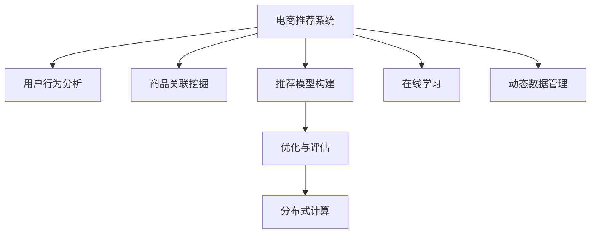

                 

# 大数据驱动的电商推荐系统：AI 模型融合是核心策略

## 1. 背景介绍

### 1.1 电商推荐系统的兴起

随着电子商务的迅猛发展，推荐系统成为了电商企业吸引用户、提升销售额的重要工具。推荐系统通过分析用户的历史行为数据，预测用户的潜在兴趣，从而推荐最适合的产品，提升用户体验和满意度。然而，传统基于规则或特征工程的推荐方法，难以捕捉用户复杂且动态的偏好变化，无法真正理解用户的多样性和丰富性。

为了应对这一挑战，人工智能技术逐步渗透到电商推荐系统中，以深度学习为核心的大数据驱动推荐系统应运而生。AI推荐系统通过学习海量用户数据，构建复杂的隐含关联模型，实现了精准、个性化的产品推荐，极大地提升了电商企业的运营效率和用户体验。

### 1.2 AI 推荐系统的关键技术

AI推荐系统的核心技术包括用户行为分析、商品关联挖掘、推荐模型构建与优化等。以下详细介绍这些关键技术：

1. **用户行为分析**：通过用户浏览、点击、购买等行为数据，识别用户的偏好、兴趣点、行为习惯等关键信息。
2. **商品关联挖掘**：利用协同过滤、深度学习等技术，发现商品间的隐含关联关系，构建商品图谱，辅助推荐。
3. **推荐模型构建**：结合用户数据和商品关联关系，构建个性化的推荐模型，实现动态精准推荐。
4. **优化与评估**：通过在线A/B测试等方法，优化推荐模型的参数和结构，评估推荐效果，持续改进。

### 1.3 电商推荐系统的挑战

尽管AI推荐系统在电商领域取得了显著的成效，但也面临诸多挑战：

1. **数据稀疏性**：用户行为数据存在明显的稀疏性，难以有效利用。
2. **多样性和变化性**：用户兴趣和商品关联关系复杂多变，模型难以捕捉全面的特征。
3. **计算资源需求高**：模型复杂度高，训练和推理所需计算资源较大，难以在大规模电商平台上高效部署。
4. **实时性和个性化**：电商推荐系统需要实时响应，同时根据不同用户提供个性化推荐，这对系统架构和算法性能提出了更高要求。

为应对这些挑战，AI推荐系统需要进行模型融合，整合多种技术手段和计算资源，构建更为健壮、高效的推荐系统。

## 2. 核心概念与联系

### 2.1 核心概念概述

为理解AI模型融合在电商推荐系统中的应用，本节将介绍几个核心概念：

1. **电商推荐系统**：基于用户行为数据，构建模型预测用户对商品感兴趣程度，并推荐相应商品的系统。
2. **AI推荐算法**：使用人工智能技术，如深度学习、协同过滤等，构建推荐模型的算法。
3. **模型融合**：将多个独立的推荐模型或算法进行集成，发挥各自优势，提高整体推荐效果的技术。
4. **分布式计算**：通过分布式架构和计算，在多台计算机上并行处理数据，提升计算效率和系统稳定性。
5. **在线学习**：在推荐系统运行过程中，实时更新模型参数，适应新数据和新用户的变化。
6. **动态数据管理**：高效管理和更新用户行为数据，确保数据的时效性和完备性。

这些核心概念之间的逻辑关系可以通过以下Mermaid流程图来展示：



这个流程图展示了大数据驱动的AI电商推荐系统的核心概念及其之间的关系：

1. 电商推荐系统通过用户行为分析和商品关联挖掘获得关键数据，构建推荐模型。
2. 推荐模型经过优化与评估，结合在线学习，不断提升推荐效果。
3. 分布式计算和多模型融合提高系统性能，确保实时性和个性化推荐。
4. 动态数据管理保障数据的时效性和完备性，支撑持续优化。

## 3. 核心算法原理 & 具体操作步骤

### 3.1 算法原理概述

AI电商推荐系统通过数据驱动的AI模型融合技术，实现个性化推荐。其核心思想是：构建多个推荐模型，通过集成学习、模型融合等手段，将各自的优势结合，提升整体推荐效果。

具体而言，电商推荐系统通常包括以下几个关键步骤：

1. **用户行为数据收集**：从用户的浏览、点击、购买等行为中提取特征，构建用户画像。
2. **商品关联关系挖掘**：利用协同过滤、深度学习等技术，发现商品间的隐含关联关系，构建商品图谱。
3. **推荐模型构建**：构建多个独立的推荐模型，如基于内容的推荐、协同过滤、深度学习等。
4. **模型融合与优化**：通过集成学习或模型融合技术，将多个推荐模型集成起来，提升整体推荐效果。
5. **在线学习与动态优化**：利用在线学习技术，在推荐过程中实时更新模型参数，适应新数据和新用户的变化。

### 3.2 算法步骤详解

以下是电商推荐系统模型融合的详细步骤：

**Step 1: 用户行为数据收集**

从用户的浏览、点击、购买等行为中，提取有用的特征，构建用户画像。常见特征包括用户ID、商品ID、浏览时长、点击次数等。

**Step 2: 商品关联关系挖掘**

利用协同过滤、深度学习等技术，发现商品间的隐含关联关系，构建商品图谱。常见方法包括基于用户的协同过滤、基于商品的协同过滤、深度学习中的隐含关联模型等。

**Step 3: 推荐模型构建**

构建多个独立的推荐模型，如基于内容的推荐、协同过滤、深度学习等。这些模型可以并行训练，互不干扰。

**Step 4: 模型融合与优化**

通过集成学习或模型融合技术，将多个推荐模型集成起来。常见方法包括：

- 权重融合：为每个推荐模型的输出设置权重，按权重加权求和。
- 特征融合：利用集成学习的Bagging、Boosting等方法，提升模型的泛化能力。
- 模型融合：将多个模型并行运行，取输出结果的平均值或最大概率预测。

**Step 5: 在线学习与动态优化**

利用在线学习技术，在推荐过程中实时更新模型参数，适应新数据和新用户的变化。常见方法包括在线梯度下降、AdaGrad、Adam等优化算法。

### 3.3 算法优缺点

AI电商推荐系统的模型融合技术具有以下优点：

1. **提升推荐效果**：通过集成多个模型，发挥各自优势，提升整体推荐效果。
2. **增强鲁棒性**：多个模型可以互相校验，提高系统的鲁棒性和稳定性。
3. **促进多样化**：多种推荐模型可以涵盖不同维度的推荐特征，促进推荐结果的多样性。
4. **提高可解释性**：多个模型共同决策，使得推荐过程更透明，易于解释和调试。

但同时，模型融合也存在一些局限性：

1. **计算成本高**：构建多个模型需要更多的计算资源和时间，增加了系统的开发和维护成本。
2. **模型复杂度增加**：模型融合技术增加了系统的复杂度，可能导致模型难以解释和调试。
3. **实时性挑战**：多个模型的并行运行和参数更新，增加了系统的实时响应时间，可能影响用户体验。

### 3.4 算法应用领域

AI电商推荐系统已经在电商、在线视频、社交媒体等多个领域得到广泛应用，取得了显著的效果。

- **电商推荐系统**：通过预测用户对商品感兴趣程度，推荐相关商品，提升销售额和用户满意度。
- **在线视频推荐**：根据用户观看历史和行为数据，推荐视频内容，提高用户观看时长和粘性。
- **社交媒体推荐**：通过分析用户互动数据，推荐相关内容和用户，扩大社交网络的影响力。

此外，AI推荐系统还在医疗、金融、旅游等多个行业得到应用，成为推动各行各业数字化转型升级的重要工具。

## 4. 数学模型和公式 & 详细讲解 & 举例说明

### 4.1 数学模型构建

假设电商推荐系统有用户 $u$ 和商品 $i$，行为数据集为 $\mathcal{D}=\{(x_i, y_i)\}_{i=1}^N$，其中 $x_i$ 为用户行为数据，$y_i$ 为推荐结果。构建推荐模型的目标是最小化损失函数 $\mathcal{L}$，使得推荐结果与真实标签之间的差异最小化。

定义推荐模型的输出为 $f(x_i)$，则推荐模型的损失函数为：

$$
\mathcal{L}=\frac{1}{N}\sum_{i=1}^N\mathcal{L}(f(x_i),y_i)
$$

其中 $\mathcal{L}$ 为具体的损失函数，如均方误差、交叉熵等。

### 4.2 公式推导过程

以基于内容的推荐模型为例，推导推荐模型的损失函数。

假设用户行为数据 $x_i$ 可以表示为用户对商品的兴趣度向量 $u_i \in \mathbb{R}^d$ 和商品特征向量 $v_i \in \mathbb{R}^d$ 的矩阵乘积：

$$
x_i=u_i \cdot v_i
$$

推荐模型输出为 $f(x_i)$，即商品 $i$ 的推荐评分。

基于内容的推荐模型假设 $u_i$ 和 $v_i$ 满足高斯分布，模型输出为：

$$
f(x_i) = \sigma(\langle u_i, v_i \rangle)
$$

其中 $\sigma$ 为激活函数，如sigmoid。

定义损失函数为均方误差，即：

$$
\mathcal{L}=\frac{1}{N}\sum_{i=1}^N(y_i-f(x_i))^2
$$

在实际应用中，模型训练时通常采用随机梯度下降（SGD）等优化算法，更新模型参数。

### 4.3 案例分析与讲解

考虑一个简单的电商推荐系统，用户 $u$ 对商品 $i$ 的兴趣度为 $u_i$，商品 $i$ 的特征向量为 $v_i$。用户 $u$ 对商品 $i$ 的评分 $r_{ui}$ 为：

$$
r_{ui} = \langle u_i, v_i \rangle
$$

用户 $u$ 对商品 $i$ 的实际评分 $y_i$ 为：

$$
y_i = \begin{cases} 
1 & \text{if } r_{ui} > 0.5 \\
0 & \text{otherwise}
\end{cases}
$$

假设模型输出为 $f_{ui}=\sigma(\langle u_i, v_i \rangle)$，则损失函数为：

$$
\mathcal{L}=\frac{1}{N}\sum_{i=1}^N(y_i-f_{ui})^2
$$

通过优化模型参数，使损失函数最小化，即可得到最优的推荐评分 $f_{ui}$。

## 5. 项目实践：代码实例和详细解释说明

### 5.1 开发环境搭建

在进行推荐系统项目实践前，我们需要准备好开发环境。以下是使用Python进行TensorFlow开发的环境配置流程：

1. 安装Anaconda：从官网下载并安装Anaconda，用于创建独立的Python环境。

2. 创建并激活虚拟环境：
```bash
conda create -n tf-env python=3.8 
conda activate tf-env
```

3. 安装TensorFlow：从官网获取对应的安装命令。例如：
```bash
conda install tensorflow -c tf -c conda-forge
```

4. 安装各类工具包：
```bash
pip install numpy pandas scikit-learn matplotlib tqdm jupyter notebook ipython
```

完成上述步骤后，即可在`tf-env`环境中开始推荐系统项目实践。

### 5.2 源代码详细实现

下面以电商推荐系统为例，给出使用TensorFlow进行基于内容的推荐模型微调的Python代码实现。

首先，定义数据处理函数：

```python
import tensorflow as tf
from tensorflow.keras import layers, models

class RecommendationModel(tf.keras.Model):
    def __init__(self, num_users, num_items, hidden_dim=32):
        super(RecommendationModel, self).__init__()
        self.user_embeddings = layers.Embedding(num_users, hidden_dim)
        self.item_embeddings = layers.Embedding(num_items, hidden_dim)
        self.interaction = layers.Dot(axes=1)

    def call(self, user, item):
        user = self.user_embeddings(user)
        item = self.item_embeddings(item)
        return self.interaction([user, item])

# 数据加载与预处理
train_dataset = tf.data.Dataset.from_tensor_slices((user_ids, item_ids))
train_dataset = train_dataset.shuffle(buffer_size=1024).batch(batch_size)
```

然后，定义推荐模型的构建与训练函数：

```python
# 构建推荐模型
num_users = 1000
num_items = 1000
model = RecommendationModel(num_users, num_items)

# 定义损失函数和优化器
loss_fn = tf.keras.losses.MeanSquaredError()
optimizer = tf.keras.optimizers.Adam(learning_rate=0.001)

# 定义训练函数
@tf.function
def train_step(user, item):
    with tf.GradientTape() as tape:
        prediction = model(user, item)
        loss = loss_fn(y_true, prediction)
    gradients = tape.gradient(loss, model.trainable_variables)
    optimizer.apply_gradients(zip(gradients, model.trainable_variables))

# 训练推荐模型
for epoch in range(num_epochs):
    for user, item in train_dataset:
        train_step(user, item)
```

最后，评估推荐模型并输出结果：

```python
# 模型评估
test_dataset = tf.data.Dataset.from_tensor_slices((test_user_ids, test_item_ids))
test_dataset = test_dataset.shuffle(buffer_size=1024).batch(batch_size)

model.compile(optimizer=optimizer, loss=loss_fn, metrics=['accuracy'])
model.evaluate(test_dataset)
```

以上就是使用TensorFlow进行基于内容的推荐模型微调的完整代码实现。可以看到，通过TensorFlow的Keras API，构建和训练推荐模型变得相对简洁高效。

### 5.3 代码解读与分析

让我们再详细解读一下关键代码的实现细节：

**RecommendationModel类**：
- `__init__`方法：初始化用户和商品的嵌入层，以及点积交互层。
- `call`方法：定义模型的前向传播过程，通过点积得到预测评分。

**数据加载与预处理**：
- 将用户ID和商品ID转化为TensorFlow的数据集。
- 进行数据随机打乱和分批处理，便于模型训练。

**训练函数**：
- 使用tf.GradientTape记录梯度，通过Adam优化器更新模型参数。
- 在每个训练批次中，计算预测评分与真实标签的损失，并反向传播更新模型。

**模型评估**：
- 将测试集数据加载和处理，并使用模型的evaluate方法进行评估。
- 输出评估指标，如准确率。

可以看到，TensorFlow的Keras API使得推荐模型的构建和训练变得更加简便。同时，TensorFlow提供丰富的工具和库，便于进行分布式计算和在线学习等高级功能开发。

当然，工业级的系统实现还需考虑更多因素，如推荐系统的架构设计、模型调优、评估指标设置等。但核心的模型融合范式基本与此类似。

## 6. 实际应用场景

### 6.1 智能电商推荐

智能电商推荐系统通过分析用户的浏览、点击、购买等行为，构建用户画像和商品关联关系，生成个性化的商品推荐。这些推荐能够提升用户的购物体验，减少用户的搜索成本，从而增加销售额和用户粘性。

在技术实现上，可以通过多个推荐模型并行运行，将基于内容的推荐、协同过滤、深度学习等方法结合起来，构建更加健壮、高效的推荐系统。智能电商推荐系统已经成为各大电商企业的重要工具，极大地提高了运营效率和用户体验。

### 6.2 在线视频推荐

在线视频推荐系统通过分析用户观看历史和行为数据，生成个性化的视频推荐，提升用户的观看时长和满意度。在线视频推荐系统通过多种推荐模型融合，结合用户画像和视频元数据，生成精准推荐。

在技术实现上，可以采用基于内容的推荐、协同过滤、深度学习等方法，构建多个推荐模型。这些模型可以并行运行，通过集成学习等技术进行融合，提升推荐效果。在线视频推荐系统已经在各大视频平台广泛应用，极大地提高了平台的用户粘性和广告收益。

### 6.3 社交媒体推荐

社交媒体推荐系统通过分析用户的互动数据，生成个性化的内容和用户推荐。这些推荐能够扩大用户的社交网络，提升用户的互动活跃度。

在技术实现上，可以采用基于内容的推荐、协同过滤、深度学习等方法，构建多个推荐模型。这些模型可以并行运行，通过集成学习等技术进行融合，提升推荐效果。社交媒体推荐系统已经成为各大社交平台的重要工具，极大地提高了用户活跃度和平台粘性。

### 6.4 未来应用展望

随着推荐技术的不断进步，未来电商推荐系统将呈现以下几个发展趋势：

1. **多模态融合**：将文本、图像、视频等多模态数据融合到推荐模型中，提升推荐效果和用户体验。
2. **实时推荐**：通过在线学习等技术，实时更新推荐模型，适应新数据和新用户的变化，提升推荐精度和时效性。
3. **个性化推荐**：结合用户画像和行为数据，实现高度个性化的推荐，提升用户满意度。
4. **跨平台推荐**：将推荐模型应用于多个平台，实现跨平台的数据共享和推荐，提升整体用户体验。
5. **隐私保护**：加强用户隐私保护，确保数据安全，提升用户信任度。

这些趋势将进一步推动AI推荐系统的发展，为电商、在线视频、社交媒体等多个领域带来更多创新和突破。

## 7. 工具和资源推荐

### 7.1 学习资源推荐

为了帮助开发者系统掌握AI电商推荐系统的技术，这里推荐一些优质的学习资源：

1. **TensorFlow官方文档**：TensorFlow的官方文档，提供了丰富的API参考和案例，适合快速上手TensorFlow。
2. **Keras官方文档**：Keras的官方文档，提供了简洁易懂的API和使用指南，适合快速构建推荐模型。
3. **推荐系统经典书籍**：《推荐系统实践》、《深度学习与推荐系统》等书籍，深入浅出地讲解了推荐系统理论和技术，适合系统学习和实践。
4. **推荐系统课程**：Coursera的《推荐系统》课程，由斯坦福大学教授讲授，涵盖推荐系统的理论基础和前沿技术。
5. **推荐系统论文集**：推荐系统领域的经典论文集，如KDD、ICDM等会议的论文，适合深度学习和实践。

通过对这些资源的学习实践，相信你一定能够快速掌握AI电商推荐系统的精髓，并用于解决实际的推荐问题。

### 7.2 开发工具推荐

高效的开发离不开优秀的工具支持。以下是几款用于AI推荐系统开发的常用工具：

1. TensorFlow：基于Google的深度学习框架，提供了丰富的API和库，适合构建复杂的推荐模型。
2. Keras：基于TensorFlow的高级API，简单易用，适合快速构建和优化推荐模型。
3. PyTorch：基于Python的深度学习框架，提供了灵活的动态计算图，适合研究型项目开发。
4. Hadoop/Spark：大数据处理框架，适合处理大规模推荐系统所需的数据和计算。
5. ELK Stack：开源的日志和监控系统，适合实时监控推荐系统性能和问题。
6. Kibana：基于ELK Stack的数据可视化工具，适合实时展示推荐系统的关键指标。

合理利用这些工具，可以显著提升AI推荐系统项目的开发效率，加快创新迭代的步伐。

### 7.3 相关论文推荐

AI推荐系统的研究源于学界的持续探索。以下是几篇奠基性的相关论文，推荐阅读：

1. "The Bellkhop-Karmarkar Algorithm for Minimizing Finite Sums"：引入了随机梯度下降等优化算法，为推荐系统提供了理论支持。
2. "Neural Collaborative Filtering"：首次提出基于神经网络的推荐系统，引入了深度学习技术。
3. "Item2Vec: Scalable recommender systems using matrix factorization techniques"：提出了基于矩阵分解的推荐系统，适合处理大规模数据。
4. "SVD++: A Scalable Feature-based Collaborative Filtering Approach"：提出了SVD++算法，进一步提升了矩阵分解的效果。
5. "DeepFM: A Factorization-Machine Based Neural Network for CTR Prediction"：首次提出基于深度神经网络的推荐系统，提升了推荐效果。

这些论文代表了大数据驱动的AI电商推荐系统的发展脉络。通过学习这些前沿成果，可以帮助研究者把握学科前进方向，激发更多的创新灵感。

## 8. 总结：未来发展趋势与挑战

### 8.1 总结

本文对基于内容的推荐模型在大数据驱动的电商推荐系统中的应用进行了全面系统的介绍。首先阐述了电商推荐系统的兴起背景和关键技术，明确了AI模型融合在提升推荐效果、增强系统鲁棒性等方面的独特价值。其次，从原理到实践，详细讲解了推荐模型的构建、优化和评估过程，给出了基于内容的推荐模型的完整代码实现。同时，本文还广泛探讨了推荐系统在电商、在线视频、社交媒体等多个领域的应用前景，展示了AI推荐系统的广阔应用场景。

通过本文的系统梳理，可以看到，基于内容的推荐模型在大数据驱动的AI电商推荐系统中，通过模型融合技术，实现了精准、个性化的产品推荐，极大地提升了电商企业的运营效率和用户体验。未来，伴随推荐技术的不断进步，基于内容的推荐模型必将在更多领域得到应用，为各行各业带来新的变革。

### 8.2 未来发展趋势

展望未来，AI电商推荐系统将呈现以下几个发展趋势：

1. **多模态推荐**：将文本、图像、视频等多模态数据融合到推荐模型中，提升推荐效果和用户体验。
2. **实时推荐**：通过在线学习等技术，实时更新推荐模型，适应新数据和新用户的变化，提升推荐精度和时效性。
3. **个性化推荐**：结合用户画像和行为数据，实现高度个性化的推荐，提升用户满意度。
4. **跨平台推荐**：将推荐模型应用于多个平台，实现跨平台的数据共享和推荐，提升整体用户体验。
5. **隐私保护**：加强用户隐私保护，确保数据安全，提升用户信任度。

这些趋势将进一步推动AI电商推荐系统的发展，为电商、在线视频、社交媒体等多个领域带来更多创新和突破。

### 8.3 面临的挑战

尽管AI电商推荐系统已经取得了显著的成效，但在迈向更加智能化、普适化应用的过程中，它仍面临着诸多挑战：

1. **数据稀疏性**：用户行为数据存在明显的稀疏性，难以有效利用。
2. **多样性和变化性**：用户兴趣和商品关联关系复杂多变，模型难以捕捉全面的特征。
3. **计算资源需求高**：模型复杂度高，训练和推理所需计算资源较大，难以在大规模电商平台上高效部署。
4. **实时性和个性化**：电商推荐系统需要实时响应，同时根据不同用户提供个性化推荐，这对系统架构和算法性能提出了更高要求。

为应对这些挑战，未来的研究需要在以下几个方面寻求新的突破：

1. **数据增强**：通过数据生成技术，如回译、噪声注入等，增强用户行为数据的完备性。
2. **模型可解释性**：研究可解释性推荐模型，提高模型的透明度和可信度。
3. **跨模态融合**：通过将不同模态的数据融合到推荐模型中，提升推荐效果。
4. **实时系统优化**：优化系统架构和算法，提升实时推荐系统的性能和稳定性。
5. **分布式计算**：利用分布式计算技术，在大规模电商平台上高效部署推荐系统。

这些研究方向的探索，将为AI电商推荐系统带来新的突破，推动其走向更加智能和普适化的应用。

### 8.4 研究展望

面向未来，大语言模型在电商推荐系统中的应用将继续深化，主要方向包括：

1. **多模态融合**：将文本、图像、视频等多模态数据融合到推荐模型中，提升推荐效果和用户体验。
2. **实时推荐**：通过在线学习等技术，实时更新推荐模型，适应新数据和新用户的变化，提升推荐精度和时效性。
3. **个性化推荐**：结合用户画像和行为数据，实现高度个性化的推荐，提升用户满意度。
4. **跨平台推荐**：将推荐模型应用于多个平台，实现跨平台的数据共享和推荐，提升整体用户体验。
5. **隐私保护**：加强用户隐私保护，确保数据安全，提升用户信任度。

这些方向的研究将为电商推荐系统带来新的突破，推动其走向更加智能和普适化的应用。未来，大语言模型在电商推荐系统中的应用将继续深化，为各行各业带来新的变革和突破。

## 9. 附录：常见问题与解答

**Q1: 如何优化电商推荐系统的性能？**

A: 电商推荐系统的性能优化可以从以下几个方面进行：

1. **数据增强**：通过数据生成技术，如回译、噪声注入等，增强用户行为数据的完备性。
2. **模型可解释性**：研究可解释性推荐模型，提高模型的透明度和可信度。
3. **跨模态融合**：通过将不同模态的数据融合到推荐模型中，提升推荐效果。
4. **实时系统优化**：优化系统架构和算法，提升实时推荐系统的性能和稳定性。
5. **分布式计算**：利用分布式计算技术，在大规模电商平台上高效部署推荐系统。

**Q2: 如何在电商推荐系统中实现个性化推荐？**

A: 实现个性化推荐可以通过以下方法：

1. **用户画像构建**：通过分析用户的历史行为数据，构建用户画像，了解用户的兴趣和偏好。
2. **商品关联关系挖掘**：利用协同过滤、深度学习等技术，发现商品间的隐含关联关系，构建商品图谱。
3. **推荐模型构建**：构建多个独立的推荐模型，如基于内容的推荐、协同过滤、深度学习等，覆盖不同维度的推荐特征。
4. **模型融合与优化**：通过集成学习或模型融合技术，将多个推荐模型集成起来，提升整体推荐效果。

**Q3: 如何提升推荐模型的可解释性？**

A: 提升推荐模型的可解释性可以从以下几个方面进行：

1. **模型简化**：减少模型的复杂度，降低模型的黑箱效应。
2. **特征选择**：选择关键特征进行模型训练，提高模型的透明度。
3. **可视化工具**：利用可视化工具，展示模型的内部工作机制和决策路径。
4. **可解释性模型**：研究可解释性模型，如LIME、SHAP等，解释推荐模型的决策过程。

通过这些方法，可以提高推荐模型的可解释性，增强用户对系统的信任和满意度。

---

作者：禅与计算机程序设计艺术 / Zen and the Art of Computer Programming

