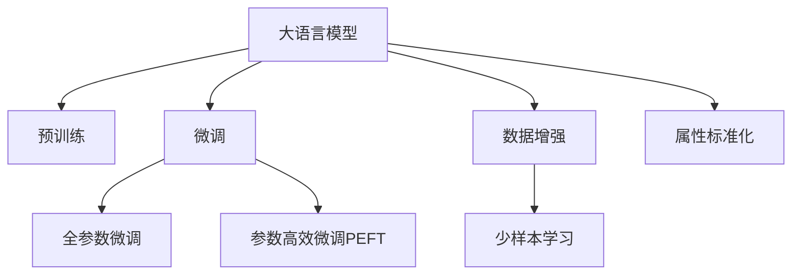

                 

# 大模型在商品属性抽取与标准化中的应用

> 关键词：大语言模型, 商品属性抽取, 属性标准化, 预训练模型, 微调, 数据增强, 参数高效微调

## 1. 背景介绍

### 1.1 问题由来

随着电子商务的蓬勃发展，商品属性的标注和标准化已经成为电商平台的重要基础工作。商品属性的正确抽取与标准化，不仅有助于提升搜索引擎优化(搜索引擎优化, SEO)效果，增强客户购物体验，也是构建精准推荐系统的关键。然而，传统的手工标注方法不仅耗时耗力，且标注结果受标注者主观影响较大，无法满足大规模自动化场景的需求。

面对这一挑战，大语言模型（Large Language Models, LLMs）提供了一种全新的解决方案。利用大语言模型的语言理解能力和上下文推理能力，通过预训练和微调的方式，可以快速高效地从文本中抽取商品属性，并实现属性的标准化。这一方法不仅能够大幅度提升属性抽取的自动化程度，还能够在一定程度上保证属性标注的客观性和一致性。

### 1.2 问题核心关键点

大语言模型在商品属性抽取与标准化中的应用，关键在于如何从文本中高效地提取出商品的关键属性，并对其进行标准化处理。这一过程可以分为两个阶段：

- **属性抽取**：从商品描述、参数等文本数据中提取出商品的属性信息。
- **属性标准化**：对抽取到的属性信息进行统一处理，去除歧义，确保不同来源的属性标注具有一致性。

### 1.3 问题研究意义

利用大语言模型进行商品属性抽取与标准化，具有以下几方面的重要意义：

1. **提升自动化标注效率**：自动化属性抽取与标准化可以大幅度降低标注成本，提高标注效率，使得商品属性标注可以覆盖更广泛的商品种类。
2. **提升属性标注一致性**：利用大语言模型的一致性，可以在一定程度上降低标注结果的差异，提高标注数据的质量。
3. **增强搜索引擎优化效果**：准确抽取与标准化的属性信息，可以更好地匹配用户查询，提升商品在搜索结果中的排名，提升客户体验。
4. **构建精准推荐系统**：标准化后的属性信息，可以用于构建精准的商品推荐系统，提升用户购物转化率。

## 2. 核心概念与联系

### 2.1 核心概念概述

为了更好地理解大语言模型在商品属性抽取与标准化中的应用，本节将介绍几个密切相关的核心概念：

- **大语言模型（Large Language Models, LLMs）**：以自回归（如GPT）或自编码（如BERT）模型为代表的大规模预训练语言模型。通过在大规模无标签文本数据上进行预训练，学习到丰富的语言知识和常识，具备强大的语言理解和生成能力。
- **预训练（Pre-training）**：指在大规模无标签文本数据上，通过自监督学习任务训练通用语言模型的过程。常见的预训练任务包括言语建模、掩码语言模型等。
- **微调（Fine-tuning）**：指在预训练模型的基础上，使用下游任务的少量标注数据，通过有监督地训练优化模型在特定任务上的性能。通常只需调整顶层分类器或解码器，并以较小的学习率更新全部或部分的模型参数。
- **数据增强（Data Augmentation）**：通过对训练样本进行改写、回译等方式，增加数据的多样性，以提高模型的泛化能力。
- **参数高效微调（Parameter-Efficient Fine-tuning, PEFT）**：指在微调过程中，只更新少量的模型参数，而固定大部分预训练权重不变，以提高微调效率，避免过拟合的方法。
- **属性标准化（Attribute Normalization）**：对抽取到的属性信息进行统一处理，去除歧义，确保不同来源的属性标注具有一致性。

这些核心概念之间的逻辑关系可以通过以下Mermaid流程图来展示：



这个流程图展示了大语言模型的核心概念及其之间的关系：

1. 大语言模型通过预训练获得基础能力。
2. 微调是对预训练模型进行任务特定的优化，可以分为全参数微调和参数高效微调（PEFT）。
3. 数据增强可以增加训练集的多样性，提高模型的泛化能力。
4. 属性标准化是确保属性标注一致性的关键步骤。
5. 少样本学习可以在标注样本不足的情况下，利用模型对少数样本进行推理。

这些概念共同构成了大语言模型在商品属性抽取与标准化中的应用框架，使其能够在各种场景下发挥强大的语言理解和生成能力。通过理解这些核心概念，我们可以更好地把握大语言模型的工作原理和优化方向。

## 3. 核心算法原理 & 具体操作步骤
### 3.1 算法原理概述

利用大语言模型进行商品属性抽取与标准化，本质上是一个有监督的细粒度迁移学习过程。其核心思想是：将预训练的大语言模型视作一个强大的"特征提取器"，通过下游任务的少量标注数据，优化模型在特定任务上的性能。在商品属性抽取与标准化中，这一过程可以分为以下步骤：

1. **数据准备**：收集商品描述、参数等文本数据，并对其进行标注，构建训练集和测试集。
2. **预训练模型选择**：选择合适的大语言模型作为初始化参数，如BERT、GPT等。
3. **微调模型训练**：在训练集上进行微调，使用标签标注数据，优化模型在属性抽取和标准化上的性能。
4. **测试与评估**：在测试集上评估微调后模型的性能，对比微调前后的效果。
5. **属性标准化**：对抽取到的属性信息进行统一处理，去除歧义，确保不同来源的属性标注具有一致性。

### 3.2 算法步骤详解

以下是详细的算法步骤：

**Step 1: 数据准备**

首先，收集商品描述、参数等文本数据，并对其进行标注，构建训练集和测试集。标注数据包括商品的属性名称、值等。例如：

- 属性名称：颜色、尺寸、材质等
- 属性值：红色、30cm、棉等

使用标准化的标注格式，如JSON或TXT，可以方便后续的数据处理和模型训练。

**Step 2: 预训练模型选择**

选择合适的预训练语言模型 $M_{\theta}$ 作为初始化参数，如BERT、GPT等。根据任务的复杂度和数据规模，选择不同的预训练模型。例如，对于复杂的商品属性抽取任务，可以选择较大的BERT模型，而对于简单的属性标准化任务，则可以选择较小的模型。

**Step 3: 微调模型训练**

在训练集上进行微调，使用标签标注数据，优化模型在属性抽取和标准化上的性能。具体步骤如下：

1. **任务适配层设计**：根据任务类型，在预训练模型顶层设计合适的输出层和损失函数。
2. **设置微调超参数**：选择合适的优化算法及其参数，如AdamW、SGD等，设置学习率、批大小、迭代轮数等。
3. **正则化技术应用**：如L2正则、Dropout、Early Stopping等，防止模型过度适应小规模训练集。
4. **模型训练**：使用标签标注数据进行训练，优化模型在属性抽取和标准化上的性能。
5. **模型评估**：在测试集上评估微调后模型的性能，对比微调前后的效果。

**Step 4: 属性标准化**

对抽取到的属性信息进行统一处理，去除歧义，确保不同来源的属性标注具有一致性。具体步骤如下：

1. **去重与合并**：去除重复的属性信息，合并相同属性的不同值。
2. **规范化处理**：将属性值转换为标准格式，如将颜色属性转换为RGB数值。
3. **去除无关属性**：去除与商品无关的属性，如无关的描述信息。

### 3.3 算法优缺点

利用大语言模型进行商品属性抽取与标准化的优点包括：

1. **自动化程度高**：利用大语言模型的高效自动化能力，可以大幅度减少人工标注的劳动成本，提高标注效率。
2. **泛化能力强**：大语言模型通过预训练获得强大的语言理解能力，能够在复杂的文本环境中准确抽取商品属性，并具有良好的泛化能力。
3. **可扩展性好**：不同规模和复杂度的任务都可以通过微调进行优化，适应不同的应用场景。
4. **可维护性好**：微调模型的更新和维护相对简单，可以快速适应新的标注需求。

然而，该方法也存在一定的局限性：

1. **依赖标注数据**：微调的效果很大程度上取决于标注数据的质量和数量，获取高质量标注数据的成本较高。
2. **模型复杂度**：大语言模型的参数量较大，对硬件资源的需求较高，可能会导致一定的成本压力。
3. **泛化能力有限**：当标注数据分布与实际应用场景差异较大时，微调的性能提升有限。
4. **鲁棒性不足**：在标注数据存在噪声的情况下，微调模型的鲁棒性可能不足，导致属性抽取和标准化的准确性降低。

尽管存在这些局限性，但就目前而言，利用大语言模型进行商品属性抽取与标准化的方法仍是大规模自动化标注的主要手段。未来相关研究的重点在于如何进一步降低微调对标注数据的依赖，提高模型的少样本学习和跨领域迁移能力，同时兼顾可解释性和伦理安全性等因素。

### 3.4 算法应用领域

利用大语言模型进行商品属性抽取与标准化的应用领域广泛，包括但不限于：

- **电商平台**：通过商品描述和参数的自动化标注，提升搜索结果的准确性，增强客户购物体验。
- **零售企业**：帮助企业构建精准的推荐系统，提升用户购物转化率。
- **品牌商**：对品牌的商品属性进行自动化标注，提升品牌在电商平台的搜索排名和品牌影响力。
- **供应链管理**：对供应链中的商品属性进行标注和标准化，提升供应链管理的效率和准确性。

这些应用场景展示了大语言模型在商品属性抽取与标准化中的强大潜力，预示着其在电子商务和其他相关领域的重要应用前景。

## 4. 数学模型和公式 & 详细讲解 & 举例说明

### 4.1 数学模型构建

本节将使用数学语言对利用大语言模型进行商品属性抽取与标准化的过程进行更加严格的刻画。

记预训练语言模型为 $M_{\theta}$，其中 $\theta$ 为预训练得到的模型参数。假设商品属性抽取与标准化的训练集为 $D=\{(x_i, y_i)\}_{i=1}^N$，其中 $x_i$ 为商品描述或参数，$y_i$ 为标注的属性信息。

定义模型 $M_{\theta}$ 在输入 $x_i$ 上的输出为 $\hat{y}=M_{\theta}(x_i) \in \mathcal{Y}$，其中 $\mathcal{Y}$ 为属性信息的输出空间。

定义模型在数据样本 $(x,y)$ 上的损失函数为 $\ell(M_{\theta}(x),y)$，则在数据集 $D$ 上的经验风险为：

$$
\mathcal{L}(\theta) = \frac{1}{N} \sum_{i=1}^N \ell(M_{\theta}(x_i),y_i)
$$

微调的优化目标是最小化经验风险，即找到最优参数：

$$
\theta^* = \mathop{\arg\min}_{\theta} \mathcal{L}(\theta)
$$

在实践中，我们通常使用基于梯度的优化算法（如SGD、Adam等）来近似求解上述最优化问题。设 $\eta$ 为学习率，$\lambda$ 为正则化系数，则参数的更新公式为：

$$
\theta \leftarrow \theta - \eta \nabla_{\theta}\mathcal{L}(\theta) - \eta\lambda\theta
$$

其中 $\nabla_{\theta}\mathcal{L}(\theta)$ 为损失函数对参数 $\theta$ 的梯度，可通过反向传播算法高效计算。

### 4.2 公式推导过程

以下我们以二分类任务为例，推导交叉熵损失函数及其梯度的计算公式。

假设模型 $M_{\theta}$ 在输入 $x_i$ 上的输出为 $\hat{y}=M_{\theta}(x_i) \in [0,1]$，表示商品属性属于正类的概率。真实标签 $y_i \in \{0,1\}$。则二分类交叉熵损失函数定义为：

$$
\ell(M_{\theta}(x_i),y_i) = -[y_i\log \hat{y}_i + (1-y_i)\log (1-\hat{y}_i)]
$$

将其代入经验风险公式，得：

$$
\mathcal{L}(\theta) = -\frac{1}{N}\sum_{i=1}^N [y_i\log M_{\theta}(x_i)+(1-y_i)\log(1-M_{\theta}(x_i))]
$$

根据链式法则，损失函数对参数 $\theta_k$ 的梯度为：

$$
\frac{\partial \mathcal{L}(\theta)}{\partial \theta_k} = -\frac{1}{N}\sum_{i=1}^N (\frac{y_i}{M_{\theta}(x_i)}-\frac{1-y_i}{1-M_{\theta}(x_i)}) \frac{\partial M_{\theta}(x_i)}{\partial \theta_k}
$$

其中 $\frac{\partial M_{\theta}(x_i)}{\partial \theta_k}$ 可进一步递归展开，利用自动微分技术完成计算。

### 4.3 案例分析与讲解

以商品属性抽取为例，我们利用大语言模型BERT进行微调，并对抽取到的属性进行标准化处理。

**数据处理**

首先，我们需要对原始的商品描述进行分词和预处理。使用BERT的Tokenizer库，对商品描述进行分词，并将分词结果转换为BERT模型的输入格式。例如：

```python
from transformers import BertTokenizer
tokenizer = BertTokenizer.from_pretrained('bert-base-uncased')
text = "This is an example product description. It has a blue color, a size of 30cm, and is made of cotton."
input_ids = tokenizer(text, padding='max_length', truncation=True)
```

**模型训练**

使用预训练好的BERT模型进行微调，并在训练集上进行训练。具体步骤如下：

1. **任务适配层设计**：在预训练模型的顶层添加输出层和损失函数。例如，对于二分类任务，可以添加一个线性分类器和交叉熵损失函数。
2. **设置微调超参数**：选择合适的优化算法及其参数，如AdamW、SGD等，设置学习率、批大小、迭代轮数等。
3. **正则化技术应用**：如L2正则、Dropout、Early Stopping等，防止模型过度适应小规模训练集。
4. **模型训练**：使用标签标注数据进行训练，优化模型在属性抽取上的性能。
5. **模型评估**：在测试集上评估微调后模型的性能，对比微调前后的效果。

```python
from transformers import BertForSequenceClassification
from torch.utils.data import DataLoader
from sklearn.metrics import classification_report

model = BertForSequenceClassification.from_pretrained('bert-base-uncased', num_labels=2)
optimizer = AdamW(model.parameters(), lr=2e-5)
train_dataset = ...
dev_dataset = ...
test_dataset = ...
for epoch in range(epochs):
    train_loss = train_epoch(model, train_dataset, optimizer)
    dev_acc = evaluate(model, dev_dataset)
    test_acc = evaluate(model, test_dataset)
    print(f"Epoch {epoch+1}, train loss: {train_loss:.3f}, dev acc: {dev_acc:.3f}, test acc: {test_acc:.3f}")
```

**属性标准化**

对抽取到的属性信息进行统一处理，去除歧义，确保不同来源的属性标注具有一致性。具体步骤如下：

1. **去重与合并**：去除重复的属性信息，合并相同属性的不同值。
2. **规范化处理**：将属性值转换为标准格式，如将颜色属性转换为RGB数值。
3. **去除无关属性**：去除与商品无关的属性，如无关的描述信息。

## 5. 项目实践：代码实例和详细解释说明
### 5.1 开发环境搭建

在进行商品属性抽取与标准化的微调实践前，我们需要准备好开发环境。以下是使用Python进行PyTorch开发的环境配置流程：

1. 安装Anaconda：从官网下载并安装Anaconda，用于创建独立的Python环境。

2. 创建并激活虚拟环境：
```bash
conda create -n pytorch-env python=3.8 
conda activate pytorch-env
```

3. 安装PyTorch：根据CUDA版本，从官网获取对应的安装命令。例如：
```bash
conda install pytorch torchvision torchaudio cudatoolkit=11.1 -c pytorch -c conda-forge
```

4. 安装Transformers库：
```bash
pip install transformers
```

5. 安装各类工具包：
```bash
pip install numpy pandas scikit-learn matplotlib tqdm jupyter notebook ipython
```

完成上述步骤后，即可在`pytorch-env`环境中开始微调实践。

### 5.2 源代码详细实现

下面我们以商品属性抽取为例，给出使用Transformers库对BERT模型进行微调的PyTorch代码实现。

首先，定义属性抽取的数据处理函数：

```python
from transformers import BertTokenizer
from torch.utils.data import Dataset
import torch

class AttrExtractionDataset(Dataset):
    def __init__(self, texts, tags, tokenizer, max_len=128):
        self.texts = texts
        self.tags = tags
        self.tokenizer = tokenizer
        self.max_len = max_len
        
    def __len__(self):
        return len(self.texts)
    
    def __getitem__(self, item):
        text = self.texts[item]
        tags = self.tags[item]
        
        encoding = self.tokenizer(text, return_tensors='pt', max_length=self.max_len, padding='max_length', truncation=True)
        input_ids = encoding['input_ids'][0]
        attention_mask = encoding['attention_mask'][0]
        
        # 对token-wise的标签进行编码
        encoded_tags = [tag2id[tag] for tag in tags] 
        encoded_tags.extend([tag2id['O']] * (self.max_len - len(encoded_tags)))
        labels = torch.tensor(encoded_tags, dtype=torch.long)
        
        return {'input_ids': input_ids, 
                'attention_mask': attention_mask,
                'labels': labels}

# 标签与id的映射
tag2id = {'O': 0, 'B': 1, 'I': 2}
id2tag = {v: k for k, v in tag2id.items()}

# 创建dataset
tokenizer = BertTokenizer.from_pretrained('bert-base-cased')

train_dataset = AttrExtractionDataset(train_texts, train_tags, tokenizer)
dev_dataset = AttrExtractionDataset(dev_texts, dev_tags, tokenizer)
test_dataset = AttrExtractionDataset(test_texts, test_tags, tokenizer)
```

然后，定义模型和优化器：

```python
from transformers import BertForTokenClassification, AdamW

model = BertForTokenClassification.from_pretrained('bert-base-cased', num_labels=len(tag2id))

optimizer = AdamW(model.parameters(), lr=2e-5)
```

接着，定义训练和评估函数：

```python
from torch.utils.data import DataLoader
from tqdm import tqdm
from sklearn.metrics import classification_report

device = torch.device('cuda') if torch.cuda.is_available() else torch.device('cpu')
model.to(device)

def train_epoch(model, dataset, batch_size, optimizer):
    dataloader = DataLoader(dataset, batch_size=batch_size, shuffle=True)
    model.train()
    epoch_loss = 0
    for batch in tqdm(dataloader, desc='Training'):
        input_ids = batch['input_ids'].to(device)
        attention_mask = batch['attention_mask'].to(device)
        labels = batch['labels'].to(device)
        model.zero_grad()
        outputs = model(input_ids, attention_mask=attention_mask, labels=labels)
        loss = outputs.loss
        epoch_loss += loss.item()
        loss.backward()
        optimizer.step()
    return epoch_loss / len(dataloader)

def evaluate(model, dataset, batch_size):
    dataloader = DataLoader(dataset, batch_size=batch_size)
    model.eval()
    preds, labels = [], []
    with torch.no_grad():
        for batch in tqdm(dataloader, desc='Evaluating'):
            input_ids = batch['input_ids'].to(device)
            attention_mask = batch['attention_mask'].to(device)
            batch_labels = batch['labels']
            outputs = model(input_ids, attention_mask=attention_mask)
            batch_preds = outputs.logits.argmax(dim=2).to('cpu').tolist()
            batch_labels = batch_labels.to('cpu').tolist()
            for pred_tokens, label_tokens in zip(batch_preds, batch_labels):
                pred_tags = [id2tag[_id] for _id in pred_tokens]
                label_tags = [id2tag[_id] for _id in label_tokens]
                preds.append(pred_tags[:len(label_tokens)])
                labels.append(label_tags)
                
    print(classification_report(labels, preds))
```

最后，启动训练流程并在测试集上评估：

```python
epochs = 5
batch_size = 16

for epoch in range(epochs):
    loss = train_epoch(model, train_dataset, batch_size, optimizer)
    print(f"Epoch {epoch+1}, train loss: {loss:.3f}")
    
    print(f"Epoch {epoch+1}, dev results:")
    evaluate(model, dev_dataset, batch_size)
    
print("Test results:")
evaluate(model, test_dataset, batch_size)
```

以上就是使用PyTorch对BERT进行商品属性抽取的微调完整代码实现。可以看到，得益于Transformers库的强大封装，我们可以用相对简洁的代码完成BERT模型的加载和微调。

### 5.3 代码解读与分析

让我们再详细解读一下关键代码的实现细节：

**AttrExtractionDataset类**：
- `__init__`方法：初始化文本、标签、分词器等关键组件。
- `__len__`方法：返回数据集的样本数量。
- `__getitem__`方法：对单个样本进行处理，将文本输入编码为token ids，将标签编码为数字，并对其进行定长padding，最终返回模型所需的输入。

**tag2id和id2tag字典**：
- 定义了标签与数字id之间的映射关系，用于将token-wise的预测结果解码回真实的标签。

**训练和评估函数**：
- 使用PyTorch的DataLoader对数据集进行批次化加载，供模型训练和推理使用。
- 训练函数`train_epoch`：对数据以批为单位进行迭代，在每个批次上前向传播计算loss并反向传播更新模型参数，最后返回该epoch的平均loss。
- 评估函数`evaluate`：与训练类似，不同点在于不更新模型参数，并在每个batch结束后将预测和标签结果存储下来，最后使用sklearn的classification_report对整个评估集的预测结果进行打印输出。

**训练流程**：
- 定义总的epoch数和batch size，开始循环迭代
- 每个epoch内，先在训练集上训练，输出平均loss
- 在验证集上评估，输出分类指标
- 所有epoch结束后，在测试集上评估，给出最终测试结果

可以看到，PyTorch配合Transformers库使得BERT微调的代码实现变得简洁高效。开发者可以将更多精力放在数据处理、模型改进等高层逻辑上，而不必过多关注底层的实现细节。

当然，工业级的系统实现还需考虑更多因素，如模型的保存和部署、超参数的自动搜索、更灵活的任务适配层等。但核心的微调范式基本与此类似。

## 6. 实际应用场景
### 6.1 商品推荐系统

利用大语言模型进行商品属性抽取与标准化的商品推荐系统，可以显著提升推荐系统的准确性和个性化程度。具体而言，推荐系统可以根据商品的属性信息，构建商品之间的关联关系，从而实现更精准的推荐。

在技术实现上，可以利用微调后的属性抽取模型，自动从商品描述中提取关键属性，如颜色、尺寸、材质等。基于这些属性，推荐系统可以构建更全面的商品特征向量，通过相似度计算，匹配出最符合用户需求的商品。例如，用户查询“红色的30cm棉质T恤”，推荐系统可以通过属性抽取模型，自动匹配到所有满足条件的商品，并进行排序推荐。

### 6.2 用户行为分析

商品属性抽取与标准化技术，不仅可以用于推荐系统，还可以用于用户行为分析。通过对商品描述和参数的自动标注，可以构建出用户对商品属性的偏好模型。例如，对于一款商品，用户喜欢“颜色A”、“尺寸B”、“材质C”等，推荐系统可以根据这些偏好信息，进一步优化推荐策略，提升用户购物体验。

在技术实现上，可以利用微调后的属性抽取模型，自动从用户的行为数据中提取商品属性。基于这些属性，推荐系统可以构建用户画像，分析用户对不同属性的偏好，从而实现更精准的推荐。例如，用户对于“颜色A”、“尺寸B”的偏好明显，推荐系统可以优先推荐这些属性的商品，提升用户满意度。

### 6.3 个性化搜索

大语言模型在商品属性抽取与标准化中的应用，还可以用于个性化搜索。通过自动标注商品属性，可以构建更精准的搜索模型，提升搜索结果的相关性和准确性。

在技术实现上，可以利用微调后的属性抽取模型，自动从用户查询中提取关键属性，如“颜色”、“尺寸”、“材质”等。基于这些属性，搜索系统可以构建更精准的搜索模型，匹配出最符合用户需求的商品。例如，用户查询“红色T恤”，搜索系统可以通过属性抽取模型，自动匹配到所有满足条件的商品，并进行排序推荐。

### 6.4 未来应用展望

随着大语言模型和微调方法的不断发展，基于微调范式将在更多领域得到应用，为传统行业带来变革性影响。

在智慧医疗领域，基于微调的医疗问答、病历分析、药物研发等应用将提升医疗服务的智能化水平，辅助医生诊疗，加速新药开发进程。

在智能教育领域，微调技术可应用于作业批改、学情分析、知识推荐等方面，因材施教，促进教育公平，提高教学质量。

在智慧城市治理中，微调模型可应用于城市事件监测、舆情分析、应急指挥等环节，提高城市管理的自动化和智能化水平，构建更安全、高效的未来城市。

此外，在企业生产、社会治理、文娱传媒等众多领域，基于大模型微调的人工智能应用也将不断涌现，为经济社会发展注入新的动力。相信随着技术的日益成熟，微调方法将成为人工智能落地应用的重要范式，推动人工智能技术向更广阔的领域加速渗透。

## 7. 工具和资源推荐
### 7.1 学习资源推荐

为了帮助开发者系统掌握大语言模型微调的理论基础和实践技巧，这里推荐一些优质的学习资源：

1. 《Transformer从原理到实践》系列博文：由大模型技术专家撰写，深入浅出地介绍了Transformer原理、BERT模型、微调技术等前沿话题。

2. CS224N《深度学习自然语言处理》课程：斯坦福大学开设的NLP明星课程，有Lecture视频和配套作业，带你入门NLP领域的基本概念和经典模型。

3. 《Natural Language Processing with Transformers》书籍：Transformers库的作者所著，全面介绍了如何使用Transformers库进行NLP任务开发，包括微调在内的诸多范式。

4. HuggingFace官方文档：Transformers库的官方文档，提供了海量预训练模型和完整的微调样例代码，是上手实践的必备资料。

5. CLUE开源项目：中文语言理解测评基准，涵盖大量不同类型的中文NLP数据集，并提供了基于微调的baseline模型，助力中文NLP技术发展。

通过对这些资源的学习实践，相信你一定能够快速掌握大语言模型微调的精髓，并用于解决实际的NLP问题。
###  7.2 开发工具推荐

高效的开发离不开优秀的工具支持。以下是几款用于大语言模型微调开发的常用工具：

1. PyTorch：基于Python的开源深度学习框架，灵活动态的计算图，适合快速迭代研究。大部分预训练语言模型都有PyTorch版本的实现。

2. TensorFlow：由Google主导开发的开源深度学习框架，生产部署方便，适合大规模工程应用。同样有丰富的预训练语言模型资源。

3. Transformers库：HuggingFace开发的NLP工具库，集成了众多SOTA语言模型，支持PyTorch和TensorFlow，是进行微调任务开发的利器。

4. Weights & Biases：模型训练的实验跟踪工具，可以记录和可视化模型训练过程中的各项指标，方便对比和调优。与主流深度学习框架无缝集成。

5. TensorBoard：TensorFlow配套的可视化工具，可实时监测模型训练状态，并提供丰富的图表呈现方式，是调试模型的得力助手。

6. Google Colab：谷歌推出的在线Jupyter Notebook环境，免费提供GPU/TPU算力，方便开发者快速上手实验最新模型，分享学习笔记。

合理利用这些工具，可以显著提升大语言模型微调任务的开发效率，加快创新迭代的步伐。

### 7.3 相关论文推荐

大语言模型和微调技术的发展源于学界的持续研究。以下是几篇奠基性的相关论文，推荐阅读：

1. Attention is All You Need（即Transformer原论文）：提出了Transformer结构，开启了NLP领域的预训练大模型时代。

2. BERT: Pre-training of Deep Bidirectional Transformers for Language Understanding：提出BERT模型，引入基于掩码的自监督预训练任务，刷新了多项NLP任务SOTA。

3. Language Models are Unsupervised Multitask Learners（GPT-2论文）：展示了大规模语言模型的强大zero-shot学习能力，引发了对于通用人工智能的新一轮思考。

4. Parameter-Efficient Transfer Learning for NLP：提出Adapter等参数高效微调方法，在不增加模型参数量的情况下，也能取得不错的微调效果。

5. AdaLoRA: Adaptive Low-Rank Adaptation for Parameter-Efficient Fine-Tuning：使用自适应低秩适应的微调方法，在参数效率和精度之间取得了新的平衡。

这些论文代表了大语言模型微调技术的发展脉络。通过学习这些前沿成果，可以帮助研究者把握学科前进方向，激发更多的创新灵感。

## 8. 总结：未来发展趋势与挑战
### 8.1 总结

本文对利用大语言模型进行商品属性抽取与标准化的微调方法进行了全面系统的介绍。首先阐述了大语言模型和微调技术的研究背景和意义，明确了微调在提升属性标注效率、一致性等方面的独特价值。其次，从原理到实践，详细讲解了微调的数学原理和关键步骤，给出了微调任务开发的完整代码实例。同时，本文还广泛探讨了微调方法在商品推荐、用户行为分析、个性化搜索等多个领域的应用前景，展示了微调范式的巨大潜力。此外，本文精选了微调技术的各类学习资源，力求为读者提供全方位的技术指引。

通过本文的系统梳理，可以看到，利用大语言模型进行商品属性抽取与标准化的方法在电商平台、推荐系统、搜索系统等众多领域具有广泛的应用前景。其自动化程度高、泛化能力强、可扩展性好等优点，使其成为商品属性标注领域的重要技术手段。

### 8.2 未来发展趋势

展望未来，大语言模型微调技术将呈现以下几个发展趋势：

1. **模型规模持续增大**：随着算力成本的下降和数据规模的扩张，预训练语言模型的参数量还将持续增长。超大规模语言模型蕴含的丰富语言知识，有望支撑更加复杂多变的下游任务微调。

2. **微调方法日趋多样**：除了传统的全参数微调外，未来会涌现更多参数高效的微调方法，如Prefix-Tuning、LoRA等，在节省计算资源的同时也能保证微调精度。

3. **持续学习成为常态**：随着数据分布的不断变化，微调模型也需要持续学习新知识以保持性能。如何在不遗忘原有知识的同时，高效吸收新样本信息，将成为重要的研究课题。

4. **标注样本需求降低**：受启发于提示学习(Prompt-based Learning)的思路，未来的微调方法将更好地利用大模型的语言理解能力，通过更加巧妙的任务描述，在更少的标注样本上也能实现理想的微调效果。

5. **多模态微调崛起**：当前的微调主要聚焦于纯文本数据，未来会进一步拓展到图像、视频、语音等多模态数据微调。多模态信息的融合，将显著提升语言模型对现实世界的理解和建模能力。

6. **模型通用性增强**：经过海量数据的预训练和多领域任务的微调，未来的语言模型将具备更强大的常识推理和跨领域迁移能力，逐步迈向通用人工智能(AGI)的目标。

以上趋势凸显了大语言模型微调技术的广阔前景。这些方向的探索发展，必将进一步提升语言模型的性能和应用范围，为自然语言理解和智能交互系统的进步带来新的动力。

### 8.3 面临的挑战

尽管大语言模型微调技术已经取得了瞩目成就，但在迈向更加智能化、普适化应用的过程中，它仍面临着诸多挑战：

1. **标注成本瓶颈**：微调的效果很大程度上取决于标注数据的质量和数量，获取高质量标注数据的成本较高。如何进一步降低微调对标注数据的依赖，将是一大难题。

2. **模型鲁棒性不足**：在标注数据存在噪声的情况下，微调模型的鲁棒性可能不足，导致属性抽取和标准化的准确性降低。

3. **推理效率有待提高**：大规模语言模型虽然精度高，但在实际部署时往往面临推理速度慢、内存占用大等效率问题。

4. **可解释性亟需加强**：当前微调模型更像是"黑盒"系统，难以解释其内部工作机制和决策逻辑。

5. **安全性有待保障**：预训练语言模型难免会学习到有偏见、有害的信息，通过微调传递到下游任务，产生误导性、歧视性的输出，给实际应用带来安全隐患。

6. **知识整合能力不足**：现有的微调模型往往局限于任务内数据，难以灵活吸收和运用更广泛的先验知识。

正视微调面临的这些挑战，积极应对并寻求突破，将是大语言模型微调走向成熟的必由之路。相信随着学界和产业界的共同努力，这些挑战终将一一被克服，大语言模型微调必将在构建安全、可靠、可解释、可控的智能系统铺平道路。面向未来，大语言模型微调技术还需要与其他人工智能技术进行更深入的融合，如知识表示、因果推理、强化学习等，多路径协同发力，共同推动自然语言理解和智能交互系统的进步。只有勇于创新、敢于突破，才能不断拓展语言模型的边界，让智能技术更好地造福人类社会。

### 8.4 研究展望

面向未来，大语言模型微调技术需要在以下几个方面寻求新的突破：

1. **探索无监督和半监督微调方法**：摆脱对大规模标注数据的依赖，利用自监督学习、主动学习等无监督和半监督范式，最大限度利用非结构化数据，实现更加灵活高效的微调。

2. **研究参数高效和计算高效的微调范式**：开发更加参数高效的微调方法，在固定大部分预训练参数的同时，只更新极少量的任务相关参数。同时优化微调模型的计算图，减少前向传播和反向传播的资源消耗，实现更加轻量级、实时性的部署。

3. **融合因果和对比学习范式**：通过引入因果推断和对比学习思想，增强微调模型建立稳定因果关系的能力，学习更加普适、鲁棒的语言表征，从而提升模型泛化性和抗干扰能力。

4. **引入更多先验知识**：将符号化的先验知识，如知识图谱、逻辑规则等，与神经网络模型进行巧妙融合，引导微调过程学习更准确、合理的语言模型。同时加强不同模态数据的整合，实现视觉、语音等多模态信息与文本信息的协同建模。

5. **结合因果分析和博弈论工具**：将因果分析方法引入微调模型，识别出模型决策的关键特征，增强输出解释的因果性和逻辑性。借助博弈论工具刻画人机交互过程，主动探索并规避模型的脆弱点，提高系统稳定性。

6. **纳入伦理道德约束**：在模型训练目标中引入伦理导向的评估指标，过滤和惩罚有偏见、有害的输出倾向。同时加强人工干预和审核，建立模型行为的监管机制，确保输出符合人类价值观和伦理道德。

这些研究方向的探索，必将引领大语言模型微调技术迈向更高的台阶，为构建安全、可靠、可解释、可控的智能系统铺平道路。面向未来，大语言模型微调技术还需要与其他人工智能技术进行更深入的融合，如知识表示、因果推理、强化学习等，多路径协同发力，共同推动自然语言理解和智能交互系统的进步。只有勇于创新、敢于突破，才能不断拓展语言模型的边界，让智能技术更好地造福人类社会。

## 9. 附录：常见问题与解答
**Q1：大语言模型微调是否适用于所有NLP任务？**

A: 大语言模型微调在大多数NLP任务上都能取得不错的效果，特别是对于数据量较小的任务。但对于一些特定领域的任务，如医学、法律等，仅仅依靠通用语料预训练的模型可能难以很好地适应。此时需要在特定领域语料上进一步预训练，再进行微调，才能获得理想效果。此外，对于一些需要时效性、个性化很强的任务，如对话、推荐等，微调方法也需要针对性的改进优化。

**Q2：微调过程中如何选择合适的学习率？**

A: 微调的学习率一般要比预训练时小1-2个数量级，如果使用过大的学习率，容易破坏预训练权重，导致过拟合。一般建议从1e-5开始调参，逐步减小学习率，直至收敛。也可以使用warmup策略，在开始阶段使用较小的学习率，再逐渐过渡到预设值。需要注意的是，不同的优化器(如AdamW、Adafactor等)以及不同的学习率调度策略，可能需要设置不同的学习率阈值。

**Q3：采用大模型微调时会面临哪些资源瓶颈？**

A: 目前主流的预训练大模型动辄以亿计的参数规模，对算力、内存、存储都提出了很高的要求。GPU/TPU等高性能设备是必不可少的，但即便如此，超大批次的训练和推理也可能遇到显存不足的问题。因此需要采用一些资源优化技术，如梯度积累、混合精度训练、模型并行等，来突破硬件瓶颈。同时，模型的存储和读取也可能占用大量时间和空间，需要采用模型压缩、稀疏化存储等方法进行优化。

**Q4：如何缓解微调过程中的过拟合问题？**

A: 过拟合是微调面临的主要挑战，尤其是在标注数据不足的情况下。常见的缓解策略包括：
1. 数据增强：通过回译、近义替换等方式扩充训练集
2. 正则化：使用L2正则、Dropout、Early Stopping等防止模型过度适应小规模训练集。
3. 对抗训练：引入对抗样本，提高模型鲁棒性。
4. 参数高效微调：只调整少量参数(如Adapter、Prefix等)，减小过拟合风险。
5. 多模型集成：训练多个微调模型，取平均输出，抑制过拟合。

这些策略往往需要根据具体任务和数据特点进行灵活组合。只有在数据、模型、训练、推理等各环节进行全面优化，才能最大限度地发挥大模型微调的威力。

**Q5：微调模型在落地部署时需要注意哪些问题？**

A: 将微调模型转化为实际应用，还需要考虑以下因素：
1. 模型裁剪：去除不必要的层和参数，减小模型尺寸，加快推理速度。
2. 量化加速：将浮点模型转为定点模型，压缩存储空间，提高计算效率。
3. 服务化封装：将模型封装为标准化服务接口，便于集成调用。
4. 弹性伸缩：根据请求流量动态调整资源配置，平衡服务质量和成本。
5. 监控告警：实时采集系统指标，设置异常告警阈值，确保服务稳定性。
6. 安全防护：采用访问鉴权、数据脱敏等措施，保障数据和模型安全。

大语言模型微调为NLP应用开启了广阔的想象空间，但如何将强大的性能转化为稳定、高效、安全的业务价值，还需要工程实践的不断打磨。唯有从数据、算法、工程、业务等多个维度协同发力，才能真正实现人工智能技术在垂直行业的规模化落地。总之，微调需要开发者根据具体任务，不断迭代和优化模型、数据和算法，方能得到理想的效果。

---

作者：禅与计算机程序设计艺术 / Zen and the Art of Computer Programming

