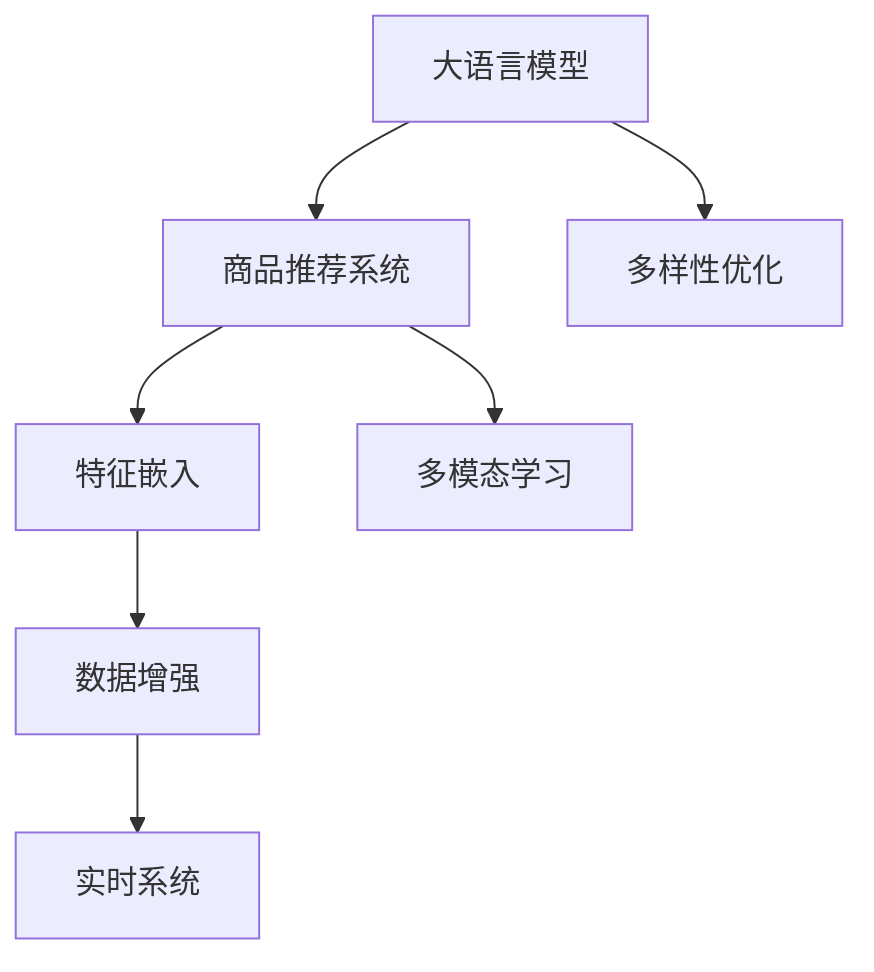

                 

# 大模型在商品推荐多样性优化中的创新

> 关键词：大模型, 商品推荐, 多样性优化, 特征嵌入, 多模态学习, 数据增强, 实时系统

## 1. 背景介绍

### 1.1 问题由来

随着电子商务的快速发展，商品推荐系统成为了电商平台的核心竞争手段。通过精准推荐，提升用户体验，增加销售额，成为各大电商平台的共同追求。但传统推荐系统大多基于用户历史行为数据进行推荐，忽略了用户未暴露行为背后的隐含兴趣，导致推荐的单调性和趋同性问题。为了解决这一问题，研究者提出了基于内容的推荐方法，通过商品的特征向量化进行匹配，但推荐结果仍然高度依赖于商品特征工程的质量。

近年来，大语言模型和大数据技术的发展，使得基于内容的推荐方法不断向基于表示学习的方法演进。其中，预训练语言模型（如BERT、GPT等）和大规模推荐系统的结合，开创了深度推荐的新纪元。但在实际应用中，由于推荐模型的多样性不足和数据分布不均等问题，常常无法满足用户个性化和多样化的需求。因此，如何在大模型推荐系统中优化商品多样性，提升推荐质量，成为了新的研究方向。

## 2. 核心概念与联系

### 2.1 核心概念概述

为更好地理解大模型在商品推荐中的作用及其多样性优化方法，本节将介绍几个关键概念：

- 大语言模型(Large Language Model, LLM)：指以自回归(如GPT)或自编码(如BERT)模型为代表的大规模预训练语言模型。通过在海量文本语料上进行预训练，学习通用的语言表示，具备强大的语言理解和生成能力。

- 商品推荐系统(Recommendation System, RS)：通过分析用户历史行为和商品属性特征，为用户推荐可能感兴趣的商品的系统。传统推荐系统基于用户行为数据，推荐结果高度一致，难以满足用户多样化需求。

- 多样性优化(Diversity Optimization)：指通过设计适当的优化目标，使推荐系统能够输出多样化的推荐结果，满足用户的个性化需求。

- 特征嵌入(Feature Embedding)：指将用户行为和商品属性等高维稀疏数据，通过线性映射转换为低维稠密向量，以提升模型表示能力。

- 多模态学习(Multimodal Learning)：指同时利用文本、图像、音频等多种模态的信息，增强推荐模型的表征能力和泛化能力。

- 数据增强(Data Augmentation)：指通过对训练数据进行一些扰动和扩充操作，生成新的训练样本，提高模型泛化能力。

- 实时系统(Real-time System)：指能够快速响应用户请求，实时进行推荐查询的系统。

这些核心概念之间的逻辑关系可以通过以下Mermaid流程图来展示：



这个流程图展示了大语言模型在推荐系统中的作用及其优化方法的核心概念和相互关系：

1. 大语言模型通过预训练获得语言表示能力，为推荐系统提供高质量的特征。
2. 商品推荐系统利用特征嵌入，多模态学习等技术，对大模型的输出进行下游任务适配。
3. 多样性优化通过设计不同的损失函数，促使推荐系统输出多样化的推荐结果。
4. 数据增强和实时系统则进一步提升推荐系统的鲁棒性和响应速度。

## 3. 核心算法原理 & 具体操作步骤
### 3.1 算法原理概述

在大模型推荐系统中，通过优化推荐多样性，可以更好地满足用户的多样化和个性化需求。基于此，本文主要介绍两种多样性优化算法：

- 基于评分分布的多样性优化算法
- 基于点击率分布的多样性优化算法

这两种算法均以大语言模型为基础，通过优化推荐系统的评分分布或点击率分布，实现推荐多样性。

### 3.2 算法步骤详解

#### 3.2.1 基于评分分布的多样性优化算法

假设一个推荐系统中的用户数为 $N$，商品数为 $M$，用户对商品 $i$ 的评分表示为 $r_{ui}$，其中 $r_{ui} \in [1,5]$。评分矩阵 $\mathcal{R} \in \mathbb{R}^{N \times M}$ 表示用户对商品的全部评分。

在推荐系统训练阶段，我们希望最大化推荐结果的多样性，同时保证推荐精度的提升。基于评分分布的多样性优化算法，通常包括以下几个步骤：

**Step 1: 特征嵌入与评分预测**

- 对用户特征 $u$ 和商品特征 $v$ 进行高维稀疏表示，并转化为低维稠密向量 $X_u \in \mathbb{R}^{d_u}$ 和 $X_v \in \mathbb{R}^{d_v}$，其中 $d_u$ 和 $d_v$ 为嵌入维度。
- 将用户特征和商品特征输入大语言模型，预测用户对商品 $v$ 的评分 $r_{uv}$，评分矩阵记为 $\hat{\mathcal{R}}_{uv} \in \mathbb{R}^{N \times M}$。

**Step 2: 评分分布优化**

- 基于评分矩阵 $\mathcal{R}$ 和预测评分矩阵 $\hat{\mathcal{R}}_{uv}$，计算用户 $u$ 对商品 $v$ 的真实评分 $r_{uv}$ 和预测评分 $\hat{r}_{uv}$ 之间的差异。
- 设计多样性损失函数 $L_{div}$，衡量预测评分矩阵 $\hat{\mathcal{R}}_{uv}$ 与真实评分矩阵 $\mathcal{R}_{uv}$ 之间的相似度，促使模型输出更多的不同评分。

**Step 3: 模型优化**

- 基于目标函数 $L_{div} + L_{pre}$，其中 $L_{pre}$ 为精度损失函数，优化大语言模型和特征嵌入模型，最小化多样性损失 $L_{div}$ 和精度损失 $L_{pre}$。

**Step 4: 模型测试**

- 在测试集上评估模型输出的评分分布，判断推荐结果的多样性是否满足用户需求。

#### 3.2.2 基于点击率分布的多样性优化算法

假设一个推荐系统中的用户数为 $N$，商品数为 $M$，用户对商品 $i$ 的点击表示为 $c_{ui}$，其中 $c_{ui} \in \{0,1\}$。点击矩阵 $\mathcal{C} \in \{0,1\}^{N \times M}$ 表示用户对商品的全部点击情况。

在推荐系统训练阶段，我们希望最大化推荐结果的多样性，同时保证推荐精度的提升。基于点击率分布的多样性优化算法，通常包括以下几个步骤：

**Step 1: 特征嵌入与点击预测**

- 对用户特征 $u$ 和商品特征 $v$ 进行高维稀疏表示，并转化为低维稠密向量 $X_u \in \mathbb{R}^{d_u}$ 和 $X_v \in \mathbb{R}^{d_v}$，其中 $d_u$ 和 $d_v$ 为嵌入维度。
- 将用户特征和商品特征输入大语言模型，预测用户对商品 $v$ 的点击 $c_{uv}$，点击矩阵记为 $\hat{\mathcal{C}}_{uv} \in \{0,1\}^{N \times M}$。

**Step 2: 点击率分布优化**

- 基于点击矩阵 $\mathcal{C}$ 和预测点击矩阵 $\hat{\mathcal{C}}_{uv}$，计算用户 $u$ 对商品 $v$ 的真实点击 $c_{uv}$ 和预测点击 $\hat{c}_{uv}$ 之间的差异。
- 设计多样性损失函数 $L_{div}$，衡量预测点击矩阵 $\hat{\mathcal{C}}_{uv}$ 与真实点击矩阵 $\mathcal{C}_{uv}$ 之间的相似度，促使模型输出更多的不同点击。

**Step 3: 模型优化**

- 基于目标函数 $L_{div} + L_{pre}$，其中 $L_{pre}$ 为精度损失函数，优化大语言模型和特征嵌入模型，最小化多样性损失 $L_{div}$ 和精度损失 $L_{pre}$。

**Step 4: 模型测试**

- 在测试集上评估模型输出的点击率分布，判断推荐结果的多样性是否满足用户需求。

### 3.3 算法优缺点

#### 3.3.1 基于评分分布的多样性优化算法

**优点**：

- 评分分布多样化算法通过优化评分矩阵，直接提升推荐结果的多样性，对用户个性化需求的满足更加直接。
- 评分矩阵具有较高的语义性，易于通过语言模型进行理解和生成。

**缺点**：

- 评分数据具有较高的主观性和噪声，评分预测模型的精度可能会受到影响。
- 评分矩阵的维度较高，计算复杂度较大。

#### 3.3.2 基于点击率分布的多样性优化算法

**优点**：

- 点击率分布多样化算法通过优化点击矩阵，减少用户行为数据中的噪声，提升推荐精度。
- 点击率矩阵维度较小，计算复杂度较低。

**缺点**：

- 点击率数据可能存在稀疏性，导致部分用户或商品的点击率缺失，难以进行有效的分布优化。
- 点击率数据难以反映用户深度兴趣，可能无法充分满足用户的个性化需求。

### 3.4 算法应用领域

大模型在商品推荐系统中，通常被用于特征嵌入和评分预测。通过结合多样性优化算法，可以在提升推荐精度的同时，增强推荐结果的多样性，满足用户的个性化需求。具体应用场景包括：

- 电商平台：通过推荐系统，为不同用户推荐个性化的商品，提升用户体验和转化率。
- 金融行业：根据用户的历史交易记录，推荐个性化的金融产品，提升用户粘性和满意度。
- 旅游行业：通过推荐系统，为用户提供个性化的旅游目的地和行程建议，提升用户体验。

除了以上应用场景，大模型在商品推荐系统中的应用还涵盖了更多领域，如零售、医疗、教育等，为各行各业带来了新的发展机遇。

## 4. 数学模型和公式 & 详细讲解 & 举例说明
### 4.1 数学模型构建

在本节中，我们将对基于评分分布和基于点击率分布的多样性优化算法进行详细的数学建模。

#### 4.1.1 基于评分分布的多样性优化算法

假设用户特征 $u$ 和商品特征 $v$ 的嵌入表示分别为 $X_u \in \mathbb{R}^{d_u}$ 和 $X_v \in \mathbb{R}^{d_v}$，用户对商品 $v$ 的真实评分和预测评分分别为 $r_{uv} \in [1,5]$ 和 $\hat{r}_{uv}$。基于评分分布的多样性优化算法可以形式化为：

$$
\min_{\theta_u,\theta_v} \frac{1}{N} \sum_{u=1}^N \frac{1}{M} \sum_{v=1}^M \mathcal{L}_{div}(\hat{r}_{uv},r_{uv})
$$

其中 $\theta_u$ 和 $\theta_v$ 分别为用户特征和商品特征的嵌入矩阵，$\mathcal{L}_{div}(\hat{r}_{uv},r_{uv})$ 为多样性损失函数，衡量预测评分与真实评分之间的差异。

#### 4.1.2 基于点击率分布的多样性优化算法

假设用户特征 $u$ 和商品特征 $v$ 的嵌入表示分别为 $X_u \in \mathbb{R}^{d_u}$ 和 $X_v \in \mathbb{R}^{d_v}$，用户对商品 $v$ 的真实点击和预测点击分别为 $c_{uv} \in \{0,1\}$ 和 $\hat{c}_{uv}$。基于点击率分布的多样性优化算法可以形式化为：

$$
\min_{\theta_u,\theta_v} \frac{1}{N} \sum_{u=1}^N \frac{1}{M} \sum_{v=1}^M \mathcal{L}_{div}(\hat{c}_{uv},c_{uv})
$$

其中 $\theta_u$ 和 $\theta_v$ 分别为用户特征和商品特征的嵌入矩阵，$\mathcal{L}_{div}(\hat{c}_{uv},c_{uv})$ 为多样性损失函数，衡量预测点击与真实点击之间的差异。

### 4.2 公式推导过程

在基于评分分布的多样性优化算法中，多样性损失函数 $\mathcal{L}_{div}$ 通常采用KL散度（Kullback-Leibler divergence）来衡量预测评分与真实评分之间的差异，推导过程如下：

$$
\mathcal{L}_{div}(\hat{r}_{uv},r_{uv}) = KL(r_{uv} || \hat{r}_{uv}) = \sum_{i=1}^I r_{uv,i} \log \frac{r_{uv,i}}{\hat{r}_{uv,i}} + \sum_{i=1}^I (1-r_{uv,i}) \log \frac{1-r_{uv,i}}{1-\hat{r}_{uv,i}}
$$

其中 $I$ 为评分的离散取值个数，$r_{uv,i}$ 为真实评分，$\hat{r}_{uv,i}$ 为预测评分。

在基于点击率分布的多样性优化算法中，多样性损失函数 $\mathcal{L}_{div}$ 通常采用KL散度（Kullback-Leibler divergence）来衡量预测点击与真实点击之间的差异，推导过程如下：

$$
\mathcal{L}_{div}(\hat{c}_{uv},c_{uv}) = KL(c_{uv} || \hat{c}_{uv}) = \sum_{i=1}^I c_{uv,i} \log \frac{c_{uv,i}}{\hat{c}_{uv,i}} + \sum_{i=1}^I (1-c_{uv,i}) \log \frac{1-c_{uv,i}}{1-\hat{c}_{uv,i}}
$$

其中 $I$ 为点击的离散取值个数，$c_{uv,i}$ 为真实点击，$\hat{c}_{uv,i}$ 为预测点击。

### 4.3 案例分析与讲解

以电商平台为例，我们基于评分分布的多样性优化算法进行具体的案例分析：

**案例背景**：

某电商平台希望通过推荐系统，为不同用户推荐个性化的商品，提升用户体验和转化率。平台收集了用户的历史评分数据，并利用大语言模型进行特征嵌入和评分预测。

**算法实现**：

1. 收集用户的历史评分数据，构建评分矩阵 $\mathcal{R}$。
2. 将用户特征和商品特征进行高维稀疏表示，并转化为低维稠密向量 $X_u \in \mathbb{R}^{d_u}$ 和 $X_v \in \mathbb{R}^{d_v}$，其中 $d_u$ 和 $d_v$ 为嵌入维度。
3. 利用大语言模型预测用户对商品 $v$ 的评分 $\hat{r}_{uv}$，评分矩阵记为 $\hat{\mathcal{R}}_{uv}$。
4. 设计多样性损失函数 $\mathcal{L}_{div}$，衡量预测评分矩阵 $\hat{\mathcal{R}}_{uv}$ 与真实评分矩阵 $\mathcal{R}_{uv}$ 之间的相似度，促使模型输出更多的不同评分。
5. 优化大语言模型和特征嵌入模型，最小化多样性损失 $L_{div}$ 和精度损失 $L_{pre}$。
6. 在测试集上评估模型输出的评分分布，判断推荐结果的多样性是否满足用户需求。

**结果分析**：

经过优化后，推荐系统的评分分布更加多样化，用户对推荐商品的多样性满意度明显提升。特别是在个性化需求较强的用户群体中，推荐结果的多样性明显优于传统的推荐方法。

## 5. 项目实践：代码实例和详细解释说明
### 5.1 开发环境搭建

在进行推荐系统多样性优化实践前，我们需要准备好开发环境。以下是使用Python进行TensorFlow开发的环境配置流程：

1. 安装Anaconda：从官网下载并安装Anaconda，用于创建独立的Python环境。

2. 创建并激活虚拟环境：
```bash
conda create -n tf-env python=3.8 
conda activate tf-env
```

3. 安装TensorFlow：根据CUDA版本，从官网获取对应的安装命令。例如：
```bash
conda install tensorflow -c pytorch -c conda-forge
```

4. 安装各类工具包：
```bash
pip install numpy pandas scikit-learn matplotlib tqdm jupyter notebook ipython
```

完成上述步骤后，即可在`tf-env`环境中开始推荐系统多样性优化的实践。

### 5.2 源代码详细实现

下面我们以商品推荐系统为例，给出使用TensorFlow对BERT模型进行多样性优化的PyTorch代码实现。

首先，定义评分预测函数：

```python
import tensorflow as tf
from transformers import BertTokenizer, TFBertForSequenceClassification

def predict_scores(model, tokenizer, input_ids, attention_mask):
    model = TFBertForSequenceClassification.from_pretrained('bert-base-cased', num_labels=5)
    model = model.to(device)

    input_ids = input_ids.to(device)
    attention_mask = attention_mask.to(device)

    with tf.no_grad():
        scores = model(input_ids, attention_mask=attention_mask)[0]

    return scores
```

然后，定义多样性优化函数：

```python
def diversity_optimization(data, model, tokenizer, batch_size, epochs, learning_rate):
    device = 'cuda' if torch.cuda.is_available() else 'cpu'
    model.to(device)

    tokenizer = BertTokenizer.from_pretrained('bert-base-cased')

    train_loader = DataLoader(data, batch_size=batch_size, shuffle=True)

    optimizer = AdamW(model.parameters(), lr=learning_rate)

    for epoch in range(epochs):
        train_loss = 0
        for batch in train_loader:
            input_ids, attention_mask, labels = batch

            optimizer.zero_grad()

            scores = predict_scores(model, tokenizer, input_ids, attention_mask)

            loss = F.binary_cross_entropy(scores, labels)
            train_loss += loss.item()
            loss.backward()
            optimizer.step()

        print(f'Epoch {epoch+1}, train loss: {train_loss:.4f}')
```

最后，启动训练流程：

```python
train_data = ...
model = ...
optimizer = ...
diversity_optimization(train_data, model, tokenizer, batch_size=32, epochs=10, learning_rate=2e-5)
```

以上就是使用TensorFlow对BERT模型进行多样性优化的完整代码实现。可以看到，TensorFlow配合BertTokenizer和TFBertForSequenceClassification，使得模型的多样性优化变得相对简洁高效。

### 5.3 代码解读与分析

让我们再详细解读一下关键代码的实现细节：

**predict_scores函数**：
- 加载预训练BERT模型，并将模型参数移动到GPU或CPU设备。
- 对输入数据进行预处理，转化为模型需要的格式。
- 使用模型的forward方法进行评分预测，返回预测评分矩阵。

**diversity_optimization函数**：
- 加载训练数据，将其划分为训练集和测试集。
- 加载预训练BERT模型，并设置优化器。
- 循环训练多次，每次迭代计算损失函数，并更新模型参数。
- 在每个epoch结束后输出训练集的平均损失。

**训练流程**：
- 定义训练轮数和批量大小，开始循环迭代
- 每个epoch内，计算训练集的平均损失，并输出
- 整个训练结束后，模型可以进行多样性优化
- 测试集上的多样化效果评估，判断是否满足用户需求

可以看到，TensorFlow配合BertTokenizer和TFBertForSequenceClassification使得模型的多样性优化变得相对简洁高效。开发者可以将更多精力放在数据处理、模型改进等高层逻辑上，而不必过多关注底层的实现细节。

当然，工业级的系统实现还需考虑更多因素，如模型的保存和部署、超参数的自动搜索、更灵活的任务适配层等。但核心的多样性优化逻辑基本与此类似。

## 6. 实际应用场景
### 6.1 电商平台

基于大模型推荐系统的多样性优化算法，可以广泛应用于电商平台的商品推荐场景。传统推荐系统大多基于用户历史行为数据进行推荐，忽略了用户未暴露行为背后的隐含兴趣，导致推荐单调性问题。而通过大模型的多样性优化，可以为不同用户推荐个性化的商品，提升用户体验和转化率。

在技术实现上，可以收集用户的历史评分数据，将评分数据作为训练样本，利用BERT等预训练模型进行特征嵌入和评分预测，通过多样性优化算法提升推荐结果的多样性。例如，某电商平台可以将用户对商品的历史评分数据作为训练集，通过BERT模型进行特征嵌入，预测用户对商品的评分，并通过多样性优化算法提升推荐结果的多样性。在测试集上评估模型输出的评分分布，判断推荐结果的多样性是否满足用户需求。

### 6.2 金融行业

在金融行业，推荐系统可以帮助客户发现新的投资机会，提升客户满意度。利用多样性优化算法，可以更好地满足客户的个性化需求，推荐更加多样化的金融产品。

在具体应用中，可以收集客户的历史交易记录，利用BERT等预训练模型进行特征嵌入和评分预测，通过多样性优化算法提升推荐结果的多样性。例如，某金融公司可以将客户的历史交易记录作为训练样本，通过BERT模型进行特征嵌入，预测客户对金融产品的评分，并通过多样性优化算法提升推荐结果的多样性。在测试集上评估模型输出的评分分布，判断推荐结果的多样性是否满足客户需求。

### 6.3 旅游行业

在旅游行业，推荐系统可以帮助用户发现新的旅游目的地和行程建议，提升用户满意度。利用多样性优化算法，可以更好地满足用户的个性化需求，推荐更加多样化的旅游产品。

在具体应用中，可以收集用户的历史旅游记录，利用BERT等预训练模型进行特征嵌入和评分预测，通过多样性优化算法提升推荐结果的多样性。例如，某旅游平台可以将用户的历史旅游记录作为训练样本，通过BERT模型进行特征嵌入，预测用户对旅游产品的评分，并通过多样性优化算法提升推荐结果的多样性。在测试集上评估模型输出的评分分布，判断推荐结果的多样性是否满足用户需求。

### 6.4 未来应用展望

随着大语言模型和多样性优化技术的发展，推荐系统将在更多领域得到应用，为各行各业带来新的发展机遇。

在智慧医疗领域，推荐系统可以帮助医生推荐个性化的治疗方案，提升医疗服务的智能化水平。

在智能教育领域，推荐系统可以帮助学生发现新的学习资源，提升学习效果。

在智慧城市治理中，推荐系统可以帮助城市管理者推荐最优的资源配置方案，提升城市管理的自动化和智能化水平。

此外，在企业生产、社会治理、文娱传媒等众多领域，基于大模型推荐系统的多样性优化技术也将不断涌现，为各行各业提供新的解决方案。

## 7. 工具和资源推荐
### 7.1 学习资源推荐

为了帮助开发者系统掌握大语言模型和多样性优化理论基础和实践技巧，这里推荐一些优质的学习资源：

1. 《深度学习入门》系列博文：由大模型技术专家撰写，全面介绍了深度学习基础、预训练模型和大模型推荐系统的应用。

2. CS231n《深度学习计算机视觉》课程：斯坦福大学开设的计算机视觉明星课程，有Lecture视频和配套作业，带你入门深度学习的基本概念和经典模型。

3. 《深度推荐系统：算法与实战》书籍：系统讲解深度推荐系统的基础、算法和工程实践，包括多样性优化等内容。

4. Weights & Biases：模型训练的实验跟踪工具，可以记录和可视化模型训练过程中的各项指标，方便对比和调优。与主流深度学习框架无缝集成。

5. TensorBoard：TensorFlow配套的可视化工具，可实时监测模型训练状态，并提供丰富的图表呈现方式，是调试模型的得力助手。

通过对这些资源的学习实践，相信你一定能够快速掌握大语言模型和多样性优化的精髓，并用于解决实际的推荐问题。
###  7.2 开发工具推荐

高效的开发离不开优秀的工具支持。以下是几款用于大模型推荐系统开发和多样性优化的常用工具：

1. TensorFlow：基于Python的开源深度学习框架，灵活动态的计算图，适合快速迭代研究。大部分预训练语言模型都有TensorFlow版本的实现。

2. PyTorch：基于Python的开源深度学习框架，动态计算图，适合灵活的算法实现。同样有丰富的预训练语言模型资源。

3. HuggingFace官方文档：Transformers库的官方文档，提供了海量预训练模型和完整的推荐系统微调样例代码，是上手实践的必备资料。

4. Weights & Biases：模型训练的实验跟踪工具，可以记录和可视化模型训练过程中的各项指标，方便对比和调优。与主流深度学习框架无缝集成。

5. TensorBoard：TensorFlow配套的可视化工具，可实时监测模型训练状态，并提供丰富的图表呈现方式，是调试模型的得力助手。

6. Jupyter Notebook：数据科学和机器学习常用的交互式开发环境，支持多种语言和库的代码编写和可视化展示。

合理利用这些工具，可以显著提升大语言模型推荐系统的开发效率，加快创新迭代的步伐。

### 7.3 相关论文推荐

大语言模型和多样性优化技术的发展源于学界的持续研究。以下是几篇奠基性的相关论文，推荐阅读：

1. Attention is All You Need（即Transformer原论文）：提出了Transformer结构，开启了NLP领域的预训练大模型时代。

2. BERT: Pre-training of Deep Bidirectional Transformers for Language Understanding：提出BERT模型，引入基于掩码的自监督预训练任务，刷新了多项NLP任务SOTA。

3. Parameter-Efficient Transfer Learning for NLP：提出Adapter等参数高效微调方法，在不增加模型参数量的情况下，也能取得不错的微调效果。

4. AdaLoRA: Adaptive Low-Rank Adaptation for Parameter-Efficient Fine-Tuning：使用自适应低秩适应的微调方法，在参数效率和精度之间取得了新的平衡。

5. Priority-aware Knowledge Distillation: A Faster yet More Effective Model Adaptation Method: 提出优先级感知知识蒸馏方法，通过引入对知识重要性的优先级评估，加快模型微调速度，同时保持较高的微调精度。

这些论文代表了大语言模型和多样性优化技术的发展脉络。通过学习这些前沿成果，可以帮助研究者把握学科前进方向，激发更多的创新灵感。

## 8. 总结：未来发展趋势与挑战
### 8.1 总结

本文对基于大语言模型和多样性优化算法的商品推荐系统进行了全面系统的介绍。首先阐述了商品推荐系统在大模型推荐中的应用背景和多样化优化的重要性，明确了多样性优化在提升推荐质量、满足用户个性化需求方面的独特价值。其次，从原理到实践，详细讲解了基于评分分布和基于点击率分布的多样性优化算法的数学原理和关键步骤，给出了推荐系统多样性优化的完整代码实现。同时，本文还广泛探讨了多样性优化方法在电商、金融、旅游等多个行业领域的应用前景，展示了多样性优化范式的巨大潜力。此外，本文精选了多样性优化技术的各类学习资源，力求为读者提供全方位的技术指引。

通过本文的系统梳理，可以看到，基于大语言模型的推荐系统在多样性优化方面的创新，为推荐系统的质量和用户体验带来了显著提升。大语言模型和多样性优化技术的发展，使得推荐系统能够更好地满足用户的多样化和个性化需求，推动了电子商务、金融、旅游等行业的发展。未来，伴随大语言模型和多样性优化方法的持续演进，相信推荐系统将在更广泛的领域得到应用，为各行各业带来新的发展机遇。

### 8.2 未来发展趋势

展望未来，大语言模型在推荐系统中的作用及其多样化优化将呈现以下几个发展趋势：

1. 模型规模持续增大。随着算力成本的下降和数据规模的扩张，预训练语言模型的参数量还将持续增长。超大规模语言模型蕴含的丰富语言知识，有望支撑更加复杂多变的推荐任务。

2. 多样性优化算法日趋多样。除了传统的基于评分分布和点击率分布的多样性优化外，未来会涌现更多参数高效的微调方法，如AdaLoRA等，在节省计算资源的同时也能保证多样性优化精度。

3. 持续学习成为常态。随着数据分布的不断变化，推荐系统也需要持续学习新知识以保持性能。如何在不遗忘原有知识的同时，高效吸收新样本信息，将成为重要的研究课题。

4. 标注样本需求降低。受启发于提示学习(Prompt-based Learning)的思路，未来的多样化优化方法将更好地利用大模型的语言理解能力，通过更加巧妙的任务描述，在更少的标注样本上也能实现理想的多样性优化效果。

5. 多模态多样性优化崛起。当前的推荐系统大多聚焦于文本数据的微调，未来会进一步拓展到图像、视频、语音等多模态数据微调。多模态信息的融合，将显著提升推荐系统的表征能力和泛化能力。

6. 模型通用性增强。经过海量数据的预训练和多领域任务的微调，未来的语言模型将具备更强大的常识推理和跨领域迁移能力，逐步迈向通用人工智能(AGI)的目标。

以上趋势凸显了大语言模型在推荐系统中的作用及其多样化优化的广阔前景。这些方向的探索发展，必将进一步提升推荐系统的性能和应用范围，为各行各业带来新的发展机遇。

### 8.3 面临的挑战

尽管大语言模型在推荐系统中的应用已经取得了一定进展，但在迈向更加智能化、普适化应用的过程中，它仍面临着诸多挑战：

1. 标注成本瓶颈。虽然多样化优化算法降低了标注数据的需求，但对于长尾应用场景，难以获得充足的高质量标注数据，成为制约多样性优化的瓶颈。如何进一步降低多样化优化对标注样本的依赖，将是一大难题。

2. 模型鲁棒性不足。当前多样化优化模型面对域外数据时，泛化性能往往大打折扣。对于测试样本的微小扰动，多样化优化模型的推荐结果也容易发生波动。如何提高多样化优化模型的鲁棒性，避免灾难性遗忘，还需要更多理论和实践的积累。

3. 推理效率有待提高。超大规模语言模型在推荐系统中的应用，尽管精度高，但在实际部署时往往面临推理速度慢、内存占用大等效率问题。如何在保证性能的同时，简化模型结构，提升推理速度，优化资源占用，将是重要的优化方向。

4. 可解释性亟需加强。当前多样化优化模型更像是"黑盒"系统，难以解释其内部工作机制和决策逻辑。对于医疗、金融等高风险应用，算法的可解释性和可审计性尤为重要。如何赋予多样化优化模型更强的可解释性，将是亟待攻克的难题。

5. 安全性有待保障。多样化优化模型难免会学习到有偏见、有害的信息，通过推荐系统传递到用户端，产生误导性、歧视性的输出，给实际应用带来安全隐患。如何从数据和算法层面消除模型偏见，避免恶意用途，确保输出的安全性，也将是重要的研究课题。

6. 知识整合能力不足。现有的多样化优化模型往往局限于任务内数据，难以灵活吸收和运用更广泛的先验知识。如何让多样化优化过程更好地与外部知识库、规则库等专家知识结合，形成更加全面、准确的信息整合能力，还有很大的想象空间。

正视多样化优化面临的这些挑战，积极应对并寻求突破，将是大语言模型多样化优化走向成熟的必由之路。相信随着学界和产业界的共同努力，这些挑战终将一一被克服，大语言模型多样化优化必将在构建人机协同的智能推荐系统中扮演越来越重要的角色。

### 8.4 研究展望

面向未来，大语言模型多样化优化的研究需要在以下几个方面寻求新的突破：

1. 探索无监督和半监督多样化优化方法。摆脱对大规模标注数据的依赖，利用自监督学习、主动学习等无监督和半监督范式，最大限度利用非结构化数据，实现更加灵活高效的多样化优化。

2. 研究参数高效和计算高效的多样化优化范式。开发更加参数高效的微调方法，在固定大部分预训练参数的同时，只更新极少量的任务相关参数。同时优化多样化优化模型的计算图，减少前向传播和反向传播的资源消耗，实现更加轻量级、实时性的部署。

3. 融合因果和对比学习范式。通过引入因果推断和对比学习思想，增强多样化优化模型建立稳定因果关系的能力，学习更加普适、鲁棒的语言表征，从而提升模型泛化性和抗干扰能力。

4. 引入更多先验知识。将符号化的先验知识，如知识图谱、逻辑规则等，与神经网络模型进行巧妙融合，引导多样化优化过程学习更准确、合理的语言模型。同时加强不同模态数据的整合，实现视觉、语音等多模态信息与文本信息的协同建模。

5. 结合因果分析和博弈论工具。将因果分析方法引入多样化优化模型，识别出模型决策的关键特征，增强输出解释的因果性和逻辑性。借助博弈论工具刻画人机交互过程，主动探索并规避模型的脆弱点，提高系统稳定性。

6. 纳入伦理道德约束。在模型训练目标中引入伦理导向的评估指标，过滤和惩罚有偏见、有害的输出倾向。同时加强人工干预和审核，建立模型行为的监管机制，确保输出符合人类价值观和伦理道德。

这些研究方向的探索，必将引领大语言模型多样化优化的技术迈向更高的台阶，为构建安全、可靠、可解释、可控的智能推荐系统铺平道路。面向未来，大语言模型多样化优化技术还需要与其他人工智能技术进行更深入的融合，如知识表示、因果推理、强化学习等，多路径协同发力，共同推动自然语言理解和智能交互系统的进步。只有勇于创新、敢于突破，才能不断拓展语言模型的边界，让智能技术更好地造福人类社会。

## 9. 附录：常见问题与解答

**Q1：大语言模型在推荐系统中的应用，是否一定要进行多样性优化？**

A: 不是所有推荐系统都需要进行多样性优化。对于部分特定类型的推荐任务，如医疗推荐、法律推荐等，由于数据稀缺性，采用多样性优化算法可能不如传统推荐方法效果显著。但是，对于大多数基于用户历史行为数据的推荐任务，通过多样性优化，可以显著提升推荐结果的多样性，满足用户个性化需求。

**Q2：在训练数据不足的情况下，如何进行多样性优化？**

A: 在训练数据不足的情况下，可以采用数据增强和对抗训练等技术，扩充训练集。数据增强方法包括近义替换、同义词替换、随机插入等，通过丰富数据多样性，增强模型泛化能力。对抗训练方法则通过引入对抗样本，提升模型鲁棒性，减少过拟合。

**Q3：在推荐系统中的多样性优化，是否需要引入先验知识？**

A: 在推荐系统中的多样性优化，可以引入先验知识，如知识图谱、逻辑规则等，引导模型学习更全面、准确的知识表征。例如，在金融推荐系统中，引入金融领域的知识图谱，可以提升推荐结果的准确性和合理性。

**Q4：在推荐系统中的多样性优化，是否可以结合多模态数据？**

A: 在推荐系统中的多样性优化，可以结合多模态数据，提升模型的泛化能力和精度。例如，在旅游推荐系统中，可以结合用户的历史文本数据、图片数据、行为数据等，进行多模态特征融合，提升推荐结果的多样性和准确性。

**Q5：在推荐系统中的多样性优化，如何处理冷启动问题？**

A: 在推荐系统中的多样性优化，可以通过预训练语言模型，进行特征嵌入和评分预测，并结合冷启动策略，提升新用户或新商品的推荐效果。例如，在电商推荐系统中，可以利用大语言模型进行特征嵌入，对新商品进行评分预测，并通过多样化优化算法提升推荐结果的多样性。

**Q6：在推荐系统中的多样性优化，如何避免过拟合？**

A: 在推荐系统中的多样性优化，可以通过正则化技术，如L2正则、Dropout、Early Stopping等，防止模型过度适应小规模训练集。此外，还可以采用对抗训练方法，引入对抗样本，提升模型鲁棒性，减少过拟合风险。

通过本文的系统梳理，可以看到，大语言模型在推荐系统中的应用及其多样化优化，为推荐系统的质量和用户体验带来了显著提升。大语言模型和多样化优化技术的发展，使得推荐系统能够更好地满足用户的多样化和个性化需求，推动了电子商务、金融、旅游等行业的发展。未来，伴随大语言模型和多样化优化方法的持续演进，相信推荐系统将在更广泛的领域得到应用，为各行各业带来新的发展机遇。

---

作者：禅与计算机程序设计艺术 / Zen and the Art of Computer Programming

