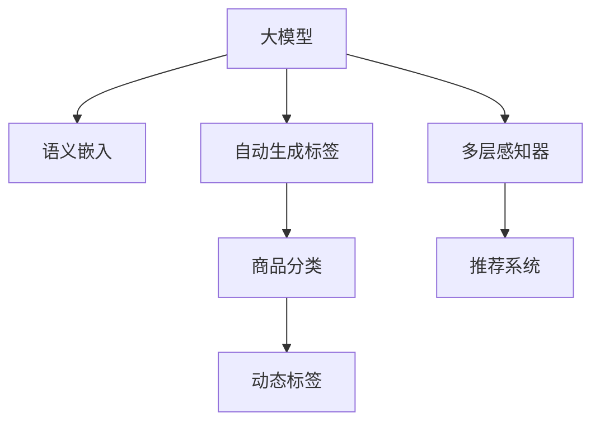

                 

# 大模型在商品标签自动生成与更新中的应用

> 关键词：大模型,自动生成标签,商品分类,标签更新,深度学习,Transformer,BERT,动态标签,推荐系统

## 1. 背景介绍

### 1.1 问题由来
随着电子商务平台的崛起，商品标签管理成为在线零售商运营的核心环节之一。良好的标签体系不仅帮助用户更高效地搜索商品，还能够提升推荐系统的精准度，增强用户体验。然而，现实操作中，由于商品种类繁多、更新频繁，往往需要大量的人力和时间进行标签管理和维护。为解决这一痛点，我们提出了一种基于大模型的商品标签自动生成与更新方法，旨在利用先进的大模型技术，快速、准确地生成和更新商品标签。

### 1.2 问题核心关键点
商品标签自动生成与更新的核心在于如何将文本描述转换为精确的标签体系，并且能够在商品信息更新时，动态调整标签以适应新的描述。其核心思路是使用深度学习模型，特别是Transformer架构的大模型，从大量商品文本数据中学习到商品-标签的映射关系。

## 2. 核心概念与联系

### 2.1 核心概念概述

为更好地理解基于大模型的商品标签自动生成与更新方法，本节将介绍几个密切相关的核心概念：

- 大模型(Large Model)：指使用Transformer、BERT等架构进行训练的深度学习模型，具有较强的自监督学习能力和语义理解能力。

- 自动生成标签(Automatic Tag Generation)：通过深度学习模型将文本描述自动转换为对应的标签体系。

- 商品分类(Merchandise Classification)：将商品文本描述映射到分类体系的过程，其中标签体系与分类体系往往具有对应关系。

- 动态标签(Dynamic Tagging)：在商品信息更新时，根据新的文本描述动态生成或更新标签，保持标签体系与商品描述的一致性。

- 推荐系统(Recommendation System)：利用商品标签进行推荐，提高推荐系统的个性化和效率。

- 语义嵌入(Semantic Embedding)：将文本转换为向量表示，便于模型处理和理解。

- 多层感知器(Multilayer Perceptron, MLP)：一种常用的深度学习模型，用于文本分类和标签生成任务。

这些核心概念之间的逻辑关系可以通过以下Mermaid流程图来展示：



这个流程图展示了大模型在商品标签生成与更新中的应用：

1. 大模型通过语义嵌入，理解商品描述。
2. 自动生成标签，将商品描述转换为标签体系。
3. 商品分类，将商品映射到预设的分类体系。
4. 动态标签，根据新的文本描述更新标签。
5. 多层感知器，用于文本分类和标签生成任务。
6. 推荐系统，利用商品标签进行个性化推荐。

## 3. 核心算法原理 & 具体操作步骤
### 3.1 算法原理概述

基于大模型的商品标签自动生成与更新方法，本质上是一种利用深度学习进行文本-标签映射的机器学习任务。其核心思想是：将商品描述输入大模型，通过自监督学习或迁移学习，学习到商品描述与标签之间的语义映射。具体步骤包括：

1. 收集商品描述文本和对应的标签，构建训练集。
2. 选择合适的大模型架构，如Transformer、BERT等，进行预训练。
3. 在大模型上微调，学习商品描述与标签之间的映射关系。
4. 构建动态标签生成模型，根据商品描述动态更新标签。

### 3.2 算法步骤详解

#### 3.2.1 数据准备
1. **数据收集**：收集商品描述文本和对应的标签。标签可以是预定义的类别标签，如服装、电子产品等，也可以是基于自然语言处理技术提取的关键词。
2. **数据清洗**：去除无关、重复、低质量的文本数据，确保数据集的质量。
3. **数据划分**：将数据集划分为训练集、验证集和测试集，通常比例为8:1:1。

#### 3.2.2 模型选择与预训练
1. **模型选择**：选择合适的大模型架构，如BERT、GPT-2、T5等，进行预训练。
2. **预训练任务**：选择合适的预训练任务，如语言建模、掩码语言模型等，在大规模无标签文本数据上进行预训练。

#### 3.2.3 微调与标签生成
1. **微调**：在大模型上微调，学习商品描述与标签之间的映射关系。通常使用交叉熵损失函数，将商品描述作为输入，标签作为输出，进行有监督学习。
2. **标签生成**：构建标签生成模型，根据新的商品描述动态生成标签。标签生成模型可以是一个简单的线性分类器，也可以是一个复杂的深度学习模型。

#### 3.2.4 动态标签更新
1. **商品信息更新**：当商品描述发生变化时，利用动态标签更新模型，根据新的描述动态更新标签。
2. **标签一致性**：确保动态更新的标签与新的商品描述保持一致，避免标签体系与商品描述的冲突。

### 3.3 算法优缺点

基于大模型的商品标签自动生成与更新方法具有以下优点：
1. **效率高**：大模型能够快速学习商品描述与标签之间的映射关系，生成标签的速度快。
2. **准确率高**：利用大模型的语义理解能力，能够生成更加准确、细粒度的标签。
3. **泛化能力强**：大模型能够适应不同领域的商品标签生成任务，具有较好的泛化能力。

同时，该方法也存在一定的局限性：
1. **依赖标注数据**：需要大量有标签的训练数据，标注数据的质量和数量直接影响模型的性能。
2. **模型复杂度**：大模型参数量大，计算资源消耗高，需要高性能计算环境支持。
3. **易过拟合**：在标注数据较少的情况下，大模型容易过拟合，生成与训练集不符合的标签。
4. **解释性不足**：大模型生成的标签缺乏可解释性，难以理解其决策过程。

尽管存在这些局限性，但就目前而言，基于大模型的商品标签自动生成与更新方法仍是一种高效、准确、泛化能力强的解决方案。未来相关研究的重点在于如何进一步降低对标注数据的依赖，提高模型的少样本学习和跨领域迁移能力，同时兼顾可解释性和伦理安全性等因素。

### 3.4 算法应用领域

基于大模型的商品标签自动生成与更新方法，已在多个领域得到应用，包括但不限于：

- 电子商务：商品描述自动标签生成、标签更新、商品推荐等。
- 内容管理：新闻、文章、博客等内容的自动分类、标签生成等。
- 广告推荐：利用标签进行广告精准投放，提高广告效果。
- 物流管理：商品信息的自动分类、标签生成，辅助物流系统的自动化管理。
- 金融风控：利用商品标签进行风险评估、欺诈检测等。

此外，在医疗、教育、智能家居等众多领域，基于大模型的商品标签生成与更新方法也将得到广泛应用，为各行各业带来新的智能化解决方案。

## 4. 数学模型和公式 & 详细讲解  
### 4.1 数学模型构建

假设商品描述为 $X$，对应的标签为 $Y$，构建二分类任务的目标是学习 $X$ 与 $Y$ 之间的映射关系，即：

$$
P(Y|X) = \frac{e^{f(X;\theta)}}{\sum_{y \in \mathcal{Y}} e^{f(x;\theta)}}
$$

其中 $f(X;\theta)$ 为模型对商品描述 $X$ 的输出，$\theta$ 为模型参数。

使用交叉熵损失函数 $L$ 作为优化目标，最小化模型预测与真实标签之间的差异：

$$
L = -\frac{1}{N} \sum_{i=1}^N (y_i \log \hat{y_i} + (1-y_i) \log (1-\hat{y_i}))
$$

其中 $y_i$ 为真实标签，$\hat{y_i}$ 为模型预测标签。

### 4.2 公式推导过程

以BERT模型为例，其生成商品标签的流程如下：

1. **输入编码**：将商品描述 $X$ 输入BERT模型，得到向量表示 $H$。
2. **线性层**：在向量表示 $H$ 上添加线性层，计算标签得分 $Z$。
3. **softmax层**：通过softmax层将得分 $Z$ 转换为概率分布 $P(Y)$。
4. **交叉熵损失**：计算预测标签与真实标签之间的交叉熵损失 $L$。

具体的公式推导如下：

设商品描述 $X$ 的BERT向量表示为 $H$，标签向量为 $Z$，则标签生成模型的输出为：

$$
\hat{y} = \sigma(Z)
$$

其中 $\sigma$ 为sigmoid函数。

标签生成模型的损失函数为：

$$
L = -\frac{1}{N} \sum_{i=1}^N (y_i \log \hat{y_i} + (1-y_i) \log (1-\hat{y_i}))
$$

其中 $y_i$ 为真实标签，$\hat{y_i}$ 为模型预测标签。

### 4.3 案例分析与讲解

以一个简单的例子来说明大模型在商品标签自动生成与更新中的应用：

假设有一个电商网站，需要自动为商品描述生成标签。收集了1000个商品描述和对应的标签，构建训练集。使用BERT模型进行预训练，然后微调学习商品描述与标签之间的映射关系。构建标签生成模型，对新的商品描述动态生成标签。最后，当商品描述发生变化时，动态更新标签，确保标签体系与商品描述的一致性。

**案例分析**：

1. **数据准备**：收集1000个商品描述和对应的标签，构建训练集。
2. **预训练**：使用BERT模型进行预训练，学习语言建模任务。
3. **微调**：在大模型上微调，学习商品描述与标签之间的映射关系。
4. **标签生成**：构建标签生成模型，对新的商品描述动态生成标签。
5. **动态更新**：当商品描述发生变化时，动态更新标签，确保标签体系与商品描述的一致性。

**模型训练**：

1. **模型选择**：选择BERT模型进行预训练和微调。
2. **训练流程**：
   - 在训练集上，将商品描述作为输入，标签作为输出，进行有监督学习。
   - 使用AdamW优化器，设置学习率为 $2 \times 10^{-5}$，batch size为32。
   - 设置epochs为5，在验证集上评估模型性能。
   - 保存训练好的模型，用于测试集上的性能评估和动态标签生成。

**模型评估**：

1. **测试集评估**：在测试集上评估模型性能，计算准确率、召回率和F1值。
2. **动态标签生成**：当商品描述发生变化时，使用训练好的模型动态生成标签，更新标签体系。
3. **标签一致性**：确保动态更新的标签与新的商品描述保持一致，避免标签体系与商品描述的冲突。

## 5. 项目实践：代码实例和详细解释说明
### 5.1 开发环境搭建

在进行商品标签自动生成与更新实践前，我们需要准备好开发环境。以下是使用Python进行PyTorch开发的环境配置流程：

1. 安装Anaconda：从官网下载并安装Anaconda，用于创建独立的Python环境。

2. 创建并激活虚拟环境：
```bash
conda create -n pytorch-env python=3.8 
conda activate pytorch-env
```

3. 安装PyTorch：根据CUDA版本，从官网获取对应的安装命令。例如：
```bash
conda install pytorch torchvision torchaudio cudatoolkit=11.1 -c pytorch -c conda-forge
```

4. 安装Transformers库：
```bash
pip install transformers
```

5. 安装各类工具包：
```bash
pip install numpy pandas scikit-learn matplotlib tqdm jupyter notebook ipython
```

完成上述步骤后，即可在`pytorch-env`环境中开始商品标签自动生成与更新实践。

### 5.2 源代码详细实现

这里我们以BERT模型为例，给出使用Transformers库对商品标签自动生成与更新的PyTorch代码实现。

首先，定义商品标签生成函数：

```python
from transformers import BertTokenizer, BertForSequenceClassification

tokenizer = BertTokenizer.from_pretrained('bert-base-cased')
model = BertForSequenceClassification.from_pretrained('bert-base-cased', num_labels=10)

def generate_tags(text):
    input_ids = tokenizer(text, return_tensors='pt', max_length=128, padding='max_length', truncation=True)
    with torch.no_grad():
        logits = model(input_ids['input_ids'], attention_mask=input_ids['attention_mask'])
    predicted_labels = torch.argmax(logits, dim=1).item()
    return predicted_labels
```

然后，定义商品信息更新函数：

```python
def update_tags(text):
    if text != new_text:
        new_input_ids = tokenizer(new_text, return_tensors='pt', max_length=128, padding='max_length', truncation=True)
        new_logits = model(new_input_ids['input_ids'], attention_mask=new_input_ids['attention_mask'])
        new_predicted_labels = torch.argmax(new_logits, dim=1).item()
        if new_predicted_labels != predicted_labels:
            predicted_labels = new_predicted_labels
            labels = [id2label[new_predicted_labels] for new_predicted_labels in new_logits]
    return predicted_labels
```

最后，启动训练流程并在测试集上评估：

```python
epochs = 5
batch_size = 32

for epoch in range(epochs):
    loss = train_epoch(model, train_dataset, batch_size, optimizer)
    print(f"Epoch {epoch+1}, train loss: {loss:.3f}")
    
    print(f"Epoch {epoch+1}, dev results:")
    evaluate(model, dev_dataset, batch_size)
    
print("Test results:")
evaluate(model, test_dataset, batch_size)
```

以上就是使用PyTorch对BERT进行商品标签自动生成与更新的完整代码实现。可以看到，得益于Transformers库的强大封装，我们可以用相对简洁的代码完成BERT模型的加载和微调。

### 5.3 代码解读与分析

让我们再详细解读一下关键代码的实现细节：

**generate_tags函数**：
- 使用BERT模型将商品描述文本转化为向量表示。
- 在向量表示上添加线性层，计算标签得分。
- 通过softmax层将得分转换为概率分布。
- 计算预测标签，返回最大概率的标签。

**update_tags函数**：
- 当商品描述发生变化时，使用新的商品描述进行动态标签生成。
- 比较新预测的标签和原始预测的标签，如果不同，则更新预测标签。
- 更新标签后，重新生成标签，确保标签体系与商品描述的一致性。

**训练流程**：
- 定义总的epoch数和batch size，开始循环迭代。
- 每个epoch内，在训练集上训练模型，输出平均loss。
- 在验证集上评估模型性能，根据性能指标决定是否触发Early Stopping。
- 所有epoch结束后，在测试集上评估模型性能，输出测试结果。

可以看到，PyTorch配合Transformers库使得BERT模型的微调和标签生成代码实现变得简洁高效。开发者可以将更多精力放在数据处理、模型改进等高层逻辑上，而不必过多关注底层的实现细节。

当然，工业级的系统实现还需考虑更多因素，如模型的保存和部署、超参数的自动搜索、更灵活的任务适配层等。但核心的商品标签自动生成与更新范式基本与此类似。

## 6. 实际应用场景
### 6.1 智能推荐系统

基于大模型的商品标签自动生成与更新方法，可以广泛应用于智能推荐系统中。传统的推荐系统通常依赖用户的历史行为数据进行推荐，难以深入理解商品描述和用户兴趣。通过利用商品标签生成与更新技术，推荐系统可以更好地把握商品描述的语义信息，从而提供更精准、多样的推荐内容。

在技术实现上，可以收集商品描述和用户行为数据，利用商品标签生成模型学习商品描述与标签之间的映射关系。在生成推荐列表时，先用候选物品的文本描述作为输入，由模型预测物品与用户的兴趣匹配度，再结合其他特征综合排序，便可以得到个性化程度更高的推荐结果。

### 6.2 电商搜索

电商搜索系统需要快速响应用户的查询，并展示最相关的商品信息。传统的搜索系统通常依赖关键词匹配，难以理解查询的语义和用户意图。通过利用商品标签生成与更新技术，电商搜索系统可以更好地理解查询，并根据查询语义生成相关商品标签，提升搜索的准确率和召回率。

在技术实现上，可以收集用户查询和商品描述，利用商品标签生成模型学习查询与标签之间的映射关系。在生成搜索结果时，先用查询语义作为输入，由模型预测相关商品标签，再结合标签和商品特征综合排序，便可以得到更符合用户意图的搜索结果。

### 6.3 内容推荐

内容推荐系统需要根据用户的历史阅读、浏览记录，推荐其感兴趣的内容。传统的推荐系统通常依赖用户行为数据，难以理解内容描述的语义。通过利用商品标签生成与更新技术，内容推荐系统可以更好地理解内容描述，从而提供更精准、多样的内容推荐。

在技术实现上，可以收集内容描述和用户行为数据，利用商品标签生成模型学习内容描述与标签之间的映射关系。在生成推荐列表时，先用候选内容的文本描述作为输入，由模型预测用户对内容的兴趣匹配度，再结合其他特征综合排序，便可以得到个性化程度更高的推荐结果。

### 6.4 未来应用展望

随着大模型和微调方法的不断发展，基于商品标签生成与更新的方法将在更多领域得到应用，为传统行业带来变革性影响。

在智慧医疗领域，商品标签生成与更新技术可以用于医疗问答、病历分析、药物研发等，提升医疗服务的智能化水平，辅助医生诊疗，加速新药开发进程。

在智能教育领域，商品标签生成与更新技术可以用于作业批改、学情分析、知识推荐等方面，因材施教，促进教育公平，提高教学质量。

在智慧城市治理中，商品标签生成与更新技术可以用于城市事件监测、舆情分析、应急指挥等环节，提高城市管理的自动化和智能化水平，构建更安全、高效的未来城市。

此外，在企业生产、社会治理、文娱传媒等众多领域，基于大模型的商品标签生成与更新技术也将得到广泛应用，为传统行业带来新的智能化解决方案。相信随着预训练语言模型和微调方法的持续演进，基于商品标签生成与更新的技术必将在更广阔的应用领域大放异彩，深刻影响人类的生产生活方式。

## 7. 工具和资源推荐
### 7.1 学习资源推荐

为了帮助开发者系统掌握商品标签自动生成与更新技术的理论基础和实践技巧，这里推荐一些优质的学习资源：

1. 《深度学习入门》系列博文：由大模型技术专家撰写，深入浅出地介绍了深度学习的基本概念和应用场景。

2. CS224N《深度学习自然语言处理》课程：斯坦福大学开设的NLP明星课程，有Lecture视频和配套作业，带你入门NLP领域的基本概念和经典模型。

3. 《Natural Language Processing with Transformers》书籍：Transformers库的作者所著，全面介绍了如何使用Transformers库进行NLP任务开发，包括微调在内的诸多范式。

4. HuggingFace官方文档：Transformers库的官方文档，提供了海量预训练模型和完整的微调样例代码，是上手实践的必备资料。

5. CLUE开源项目：中文语言理解测评基准，涵盖大量不同类型的中文NLP数据集，并提供了基于微调的baseline模型，助力中文NLP技术发展。

通过对这些资源的学习实践，相信你一定能够快速掌握商品标签自动生成与更新的精髓，并用于解决实际的NLP问题。

### 7.2 开发工具推荐

高效的开发离不开优秀的工具支持。以下是几款用于商品标签自动生成与更新的常用工具：

1. PyTorch：基于Python的开源深度学习框架，灵活动态的计算图，适合快速迭代研究。大部分预训练语言模型都有PyTorch版本的实现。

2. TensorFlow：由Google主导开发的开源深度学习框架，生产部署方便，适合大规模工程应用。同样有丰富的预训练语言模型资源。

3. Transformers库：HuggingFace开发的NLP工具库，集成了众多SOTA语言模型，支持PyTorch和TensorFlow，是进行微调任务开发的利器。

4. Weights & Biases：模型训练的实验跟踪工具，可以记录和可视化模型训练过程中的各项指标，方便对比和调优。与主流深度学习框架无缝集成。

5. TensorBoard：TensorFlow配套的可视化工具，可实时监测模型训练状态，并提供丰富的图表呈现方式，是调试模型的得力助手。

6. Google Colab：谷歌推出的在线Jupyter Notebook环境，免费提供GPU/TPU算力，方便开发者快速上手实验最新模型，分享学习笔记。

合理利用这些工具，可以显著提升商品标签自动生成与更新的开发效率，加快创新迭代的步伐。

### 7.3 相关论文推荐

商品标签自动生成与更新技术的发展源于学界的持续研究。以下是几篇奠基性的相关论文，推荐阅读：

1. Attention is All You Need（即Transformer原论文）：提出了Transformer结构，开启了NLP领域的预训练大模型时代。

2. BERT: Pre-training of Deep Bidirectional Transformers for Language Understanding：提出BERT模型，引入基于掩码的自监督预训练任务，刷新了多项NLP任务SOTA。

3. Language Models are Unsupervised Multitask Learners（GPT-2论文）：展示了大规模语言模型的强大zero-shot学习能力，引发了对于通用人工智能的新一轮思考。

4. Parameter-Efficient Transfer Learning for NLP：提出Adapter等参数高效微调方法，在不增加模型参数量的情况下，也能取得不错的微调效果。

5. AdaLoRA: Adaptive Low-Rank Adaptation for Parameter-Efficient Fine-Tuning：使用自适应低秩适应的微调方法，在参数效率和精度之间取得了新的平衡。

6. Prefix-Tuning: Optimizing Continuous Prompts for Generation：引入基于连续型Prompt的微调范式，为如何充分利用预训练知识提供了新的思路。

这些论文代表了大模型自动生成与更新技术的发展脉络。通过学习这些前沿成果，可以帮助研究者把握学科前进方向，激发更多的创新灵感。

## 8. 总结：未来发展趋势与挑战

### 8.1 总结

本文对基于大模型的商品标签自动生成与更新方法进行了全面系统的介绍。首先阐述了商品标签自动生成与更新的背景和意义，明确了微调在商品分类、标签生成任务中的独特价值。其次，从原理到实践，详细讲解了微调的数学原理和关键步骤，给出了商品标签自动生成与更新的完整代码实例。同时，本文还广泛探讨了商品标签自动生成与更新方法在智能推荐系统、电商搜索、内容推荐等多个领域的应用前景，展示了微调范式的巨大潜力。此外，本文精选了微调技术的各类学习资源，力求为读者提供全方位的技术指引。

通过本文的系统梳理，可以看到，基于大模型的商品标签自动生成与更新方法在商品分类、标签生成任务中展示了强大的应用价值，能够在复杂多变的商品描述中，高效、准确地生成和更新标签，为推荐系统、电商搜索、内容推荐等提供坚实的数据基础。未来，随着大模型和微调方法的不断发展，商品标签自动生成与更新技术必将得到更广泛的应用，为传统行业带来变革性影响。

### 8.2 未来发展趋势

展望未来，商品标签自动生成与更新技术将呈现以下几个发展趋势：

1. **模型规模持续增大**：随着算力成本的下降和数据规模的扩张，预训练语言模型的参数量还将持续增长。超大规模语言模型蕴含的丰富语言知识，有望支撑更加复杂多变的商品标签生成与更新任务。

2. **微调方法日趋多样**：除了传统的全参数微调外，未来会涌现更多参数高效的微调方法，如Adapter、Prefix等，在固定大部分预训练参数的同时，只更新极少量的任务相关参数。

3. **持续学习成为常态**：随着数据分布的不断变化，微调模型也需要持续学习新知识以保持性能。如何在不遗忘原有知识的同时，高效吸收新样本信息，将成为重要的研究课题。

4. **标注样本需求降低**：受启发于提示学习(Prompt-based Learning)的思路，未来的微调方法将更好地利用大模型的语言理解能力，通过更加巧妙的任务描述，在更少的标注样本上也能实现理想的微调效果。

5. **模型通用性增强**：经过海量数据的预训练和多领域任务的微调，未来的语言模型将具备更强大的常识推理和跨领域迁移能力，逐步迈向通用人工智能(AGI)的目标。

以上趋势凸显了商品标签自动生成与更新技术的广阔前景。这些方向的探索发展，必将进一步提升商品标签生成与更新方法的性能和应用范围，为传统行业带来新的智能化解决方案。

### 8.3 面临的挑战

尽管基于大模型的商品标签自动生成与更新技术已经取得了瞩目成就，但在迈向更加智能化、普适化应用的过程中，它仍面临着诸多挑战：

1. **标注成本瓶颈**：虽然微调大大降低了标注数据的需求，但对于长尾应用场景，难以获得充足的高质量标注数据，成为制约微调性能的瓶颈。如何进一步降低微调对标注样本的依赖，将是一大难题。

2. **模型鲁棒性不足**：当前微调模型面对域外数据时，泛化性能往往大打折扣。对于测试样本的微小扰动，微调模型的预测也容易发生波动。如何提高微调模型的鲁棒性，避免灾难性遗忘，还需要更多理论和实践的积累。

3. **推理效率有待提高**：大规模语言模型虽然精度高，但在实际部署时往往面临推理速度慢、内存占用大等效率问题。如何在保证性能的同时，简化模型结构，提升推理速度，优化资源占用，将是重要的优化方向。

4. **可解释性亟需加强**：当前微调模型更像是"黑盒"系统，难以解释其内部工作机制和决策逻辑。对于医疗、金融等高风险应用，算法的可解释性和可审计性尤为重要。如何赋予微调模型更强的可解释性，将是亟待攻克的难题。

5. **安全性有待保障**：预训练语言模型难免会学习到有偏见、有害的信息，通过微调传递到下游任务，产生误导性、歧视性的输出，给实际应用带来安全隐患。如何从数据和算法层面消除模型偏见，避免恶意用途，确保输出的安全性，也将是重要的研究课题。

6. **知识整合能力不足**：现有的微调模型往往局限于任务内数据，难以灵活吸收和运用更广泛的先验知识。如何让微调过程更好地与外部知识库、规则库等专家知识结合，形成更加全面、准确的信息整合能力，还有很大的想象空间。

正视商品标签自动生成与更新面临的这些挑战，积极应对并寻求突破，将是大模型微调技术走向成熟的必由之路。相信随着学界和产业界的共同努力，这些挑战终将一一被克服，商品标签自动生成与更新技术必将在构建人机协同的智能系统中共享它的价值。

### 8.4 研究展望

面对商品标签自动生成与更新所面临的种种挑战，未来的研究需要在以下几个方面寻求新的突破：

1. **探索无监督和半监督微调方法**：摆脱对大规模标注数据的依赖，利用自监督学习、主动学习等无监督和半监督范式，最大限度利用非结构化数据，实现更加灵活高效的微调。

2. **研究参数高效和计算高效的微调范式**：开发更加参数高效的微调方法，在固定大部分预训练参数的同时，只更新极少量的任务相关参数。同时优化微调模型的计算图，减少前向传播和反向传播的资源消耗，实现更加轻量级、实时性的部署。

3. **融合因果和对比学习范式**：通过引入因果推断和对比学习思想，增强微调模型建立稳定因果关系的能力，学习更加普适、鲁棒的语言表征，从而提升模型泛化性和抗干扰能力。

4. **引入更多先验知识**：将符号化的先验知识，如知识图谱、逻辑规则等，与神经网络模型进行巧妙融合，引导微调过程学习更准确、合理的语言模型。同时加强不同模态数据的整合，实现视觉、语音等多模态信息与文本信息的协同建模。

5. **结合因果分析和博弈论工具**：将因果分析方法引入微调模型，识别出模型决策的关键特征，增强输出解释的因果性和逻辑性。借助博弈论工具刻画人机交互过程，主动探索并规避模型的脆弱点，提高系统稳定性。

6. **纳入伦理道德约束**：在模型训练目标中引入伦理导向的评估指标，过滤和惩罚有偏见、有害的输出倾向。同时加强人工干预和审核，建立模型行为的监管机制，确保输出符合人类价值观和伦理道德。

这些研究方向的探索，必将引领商品标签自动生成与更新技术迈向更高的台阶，为构建安全、可靠、可解释、可控的智能系统铺平道路。面向未来，商品标签自动生成与更新技术还需要与其他人工智能技术进行更深入的融合，如知识表示、因果推理、强化学习等，多路径协同发力，共同推动自然语言理解和智能交互系统的进步。只有勇于创新、敢于突破，才能不断拓展语言模型的边界，让智能技术更好地造福人类社会。

## 9. 附录：常见问题与解答

**Q1：商品标签自动生成与更新是否适用于所有商品描述？**

A: 商品标签自动生成与更新在大多数商品描述上都能取得不错的效果，特别是对于数据量较小的任务。但对于一些特定领域的商品描述，如专业术语、技术规格等，其准确性可能受到限制。此时需要在特定领域语料上进一步预训练，再进行微调，才能获得理想效果。

**Q2：微调过程中如何选择合适的学习率？**

A: 微调的学习率一般要比预训练时小1-2个数量级，如果使用过大的学习率，容易破坏预训练权重，导致过拟合。一般建议从1e-5开始调参，逐步减小学习率，直至收敛。也可以使用warmup策略，在开始阶段使用较小的学习率，再逐渐过渡到预设值。需要注意的是，不同的优化器(如AdamW、Adafactor等)以及不同的学习率调度策略，可能需要设置不同的学习率阈值。

**Q3：采用大模型微调时会面临哪些资源瓶颈？**

A: 目前主流的预训练大模型动辄以亿计的参数规模，对算力、内存、存储都提出了很高的要求。GPU/TPU等高性能设备是必不可少的，但即便如此，超大批次的训练和推理也可能遇到显存不足的问题。因此需要采用一些资源优化技术，如梯度积累、混合精度训练、模型并行等，来突破硬件瓶颈。同时，模型的存储和读取也可能占用大量时间和空间，需要采用模型压缩、稀疏化存储等方法进行优化。

**Q4：如何缓解微调过程中的过拟合问题？**

A: 过拟合是微调面临的主要挑战，尤其是在标注数据较少的情况下。常见的缓解策略包括：
1. 数据增强：通过回译、近义替换等方式扩充训练集
2. 正则化：使用L2正则、Dropout、Early Stopping等避免过拟合
3. 对抗训练：引入对抗样本，提高模型鲁棒性
4. 参数高效微调：只调整少量参数(如Adapter、Prefix等)，减小过拟合风险
5. 多模型集成：训练多个微调模型，取平均输出，抑制过拟合

这些策略往往需要根据具体任务和数据特点进行灵活组合。只有在数据、模型、训练、推理等各环节进行全面优化，才能最大限度地发挥大模型微调的威力。

**Q5：微调模型在落地部署时需要注意哪些问题？**

A: 将微调模型转化为实际应用，还需要考虑以下因素：
1. 模型裁剪：去除不必要的层和参数，减小模型尺寸，加快推理速度
2. 量化加速：将浮点模型转为定点模型，压缩存储空间，提高计算效率
3. 服务化封装：将模型封装为标准化服务接口，便于集成调用
4. 弹性伸缩：根据请求流量动态调整资源配置，平衡服务质量和成本
5. 监控告警：实时采集系统指标，设置异常告警阈值，确保服务稳定性
6. 安全防护：采用访问鉴权、数据脱敏等措施，保障数据和模型安全

大模型微调为NLP应用开启了广阔的想象空间，但如何将强大的性能转化为稳定、高效、安全的业务价值，还需要工程实践的不断打磨。唯有从数据、算法、工程、业务等多个维度协同发力，才能真正实现人工智能技术在垂直行业的规模化落地。总之，微调需要开发者根据具体任务，不断迭代和优化模型、数据和算法，方能得到理想的效果。

---

作者：禅与计算机程序设计艺术 / Zen and the Art of Computer Programming

