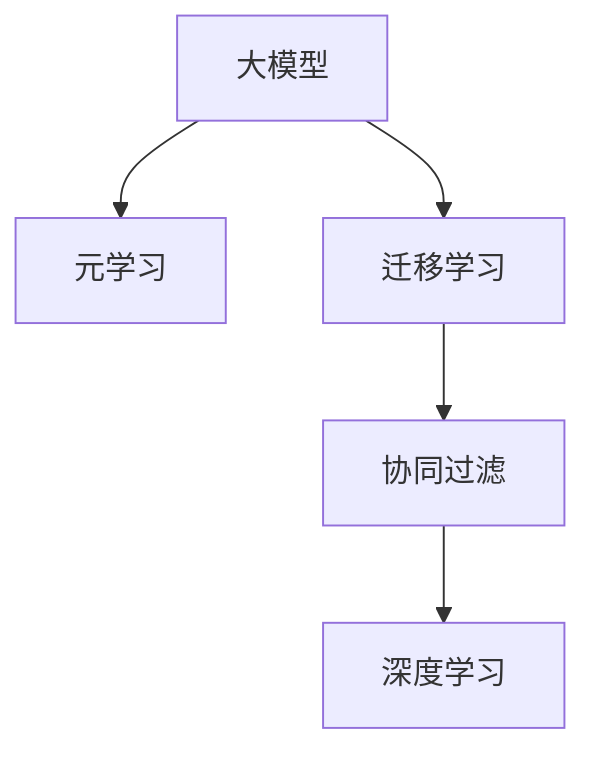

                 

# 大模型在推荐系统中的元学习迁移应用

> 关键词：大模型，推荐系统，元学习，迁移学习，协同过滤，深度学习

## 1. 背景介绍

### 1.1 问题由来
推荐系统在互联网应用中占据了重要地位，旨在帮助用户在海量信息中发现最感兴趣的内容。然而，传统基于协同过滤的推荐算法面临数据稀疏、特征缺失、个性化程度低等问题，难以满足用户多样化的需求。

近年来，基于深度学习的推荐算法逐渐成为主流，并取得了显著的进展。深度学习推荐模型通过学习用户和物品的隐含表示，能够直接从数据中挖掘特征，实现端到端的推荐。然而，这类模型往往需要大量标注数据进行训练，且难以泛化到新用户和新物品。

元学习和迁移学习等新兴方法引入后，通过将模型在多个任务间进行知识迁移，能够在少量数据下实现高效、个性化的推荐。本研究旨在探索元学习和迁移学习在大模型推荐系统中的应用，以提升推荐模型的泛化能力和个性化表现。

### 1.2 问题核心关键点
本文的核心问题是如何在大模型中应用元学习和迁移学习，实现推荐系统的高效、个性化和泛化。元学习（Meta Learning）和迁移学习（Transfer Learning）是两类重要的学习范式，均利用已有知识提升新任务的学习效率。元学习通过学习如何学习，从少量数据中提取共性特征；迁移学习则通过知识迁移，利用已有知识加速新任务学习。

本研究将重点探究以下核心问题：
- 如何在大模型中构建元学习框架？
- 如何在大模型中进行迁移学习？
- 如何在推荐系统中的应用元学习和迁移学习？
- 如何进行超参数搜索与优化？

### 1.3 问题研究意义
本研究将元学习和迁移学习引入推荐系统，探索大模型在推荐中的应用，以期实现以下目标：
- 降低推荐系统的数据需求。通过元学习框架，可以在少量标注数据下快速构建推荐模型。
- 提升推荐系统的个性化和泛化能力。利用迁移学习加速模型在新物品和新用户上的学习，提高推荐精度。
- 提高推荐系统的可解释性和可控性。通过元学习和迁移学习，可以为推荐模型注入更多知识和规则，增强其解释性和可控性。

## 2. 核心概念与联系

### 2.1 核心概念概述

为更好地理解元学习和迁移学习在大模型推荐系统中的应用，本节将介绍几个密切相关的核心概念：

- **大模型（Large Model）**：指参数规模巨大的深度神经网络模型，如BERT、GPT等。大模型能够学习丰富的语言表示，具备强大的特征提取能力。
- **元学习（Meta Learning）**：指学习如何学习，通过学习在不同任务上的共性特征，加速新任务的学习。
- **迁移学习（Transfer Learning）**：指利用已有知识加速新任务学习，通过在多个任务间迁移知识，提高模型在新任务上的泛化能力。
- **协同过滤（Collaborative Filtering）**：推荐系统中最基础的推荐算法之一，通过用户行为数据推断用户偏好。
- **深度学习（Deep Learning）**：基于神经网络的机器学习范式，通过多层非线性变换学习复杂特征表示。

这些核心概念之间的逻辑关系可以通过以下Mermaid流程图来展示：



这个流程图展示了大模型推荐系统的核心概念及其之间的关系：

1. 大模型通过学习海量数据构建特征表示，具备强大的特征提取能力。
2. 元学习通过学习如何学习，从少量数据中提取共性特征，加速新任务的学习。
3. 迁移学习通过在多个任务间迁移知识，提高模型在新任务上的泛化能力。
4. 协同过滤通过用户行为数据推断用户偏好，是最基础的推荐算法之一。
5. 深度学习则是通过多层非线性变换学习复杂特征表示，提升模型性能。

## 3. 核心算法原理 & 具体操作步骤

### 3.1 算法原理概述

在大模型推荐系统中，元学习和迁移学习主要通过以下两个步骤实现：

1. **元学习框架构建**：利用已有的推荐数据，在大模型上构建元学习框架，学习在不同推荐任务中的共性特征。
2. **迁移学习应用**：在新推荐任务上，利用元学习框架提取的共性特征，进行迁移学习，加速模型在新物品和新用户上的学习，提高推荐精度。

形式化地，假设推荐模型为 $M_{\theta}$，其中 $\theta$ 为模型参数。推荐数据集为 $D=\{(u_i, i_j)\}_{i=1}^N$，其中 $u_i$ 为用户，$i_j$ 为物品。推荐任务为 $T$，在用户 $u_i$ 对物品 $i_j$ 进行评分 $y_{u,i_j}$。

### 3.2 算法步骤详解

基于元学习和迁移学习的大模型推荐系统一般包括以下几个关键步骤：

**Step 1: 准备数据集**
- 收集推荐数据集 $D$，划分为训练集、验证集和测试集。一般要求数据集的分布与推荐模型的应用场景接近。

**Step 2: 构建元学习框架**
- 在大模型上构建元学习框架，使用深度强化学习、对抗训练等技术，学习共性特征。例如，可以使用强化学习模型学习用户行为与评分之间的关系。
- 设计元学习目标函数，如共性特征学习目标 $L_{meta}$，在训练集上最小化。

**Step 3: 迁移学习应用**
- 在新推荐任务上，使用元学习框架提取的共性特征，进行迁移学习。例如，在新用户或新物品的评分预测任务上，使用共性特征作为初始化参数。
- 在新任务上，设计迁移学习目标函数 $L_{transfer}$，利用共性特征加速模型训练。

**Step 4: 训练与评估**
- 在新任务上，使用优化算法（如Adam、SGD等），最小化迁移学习目标函数 $L_{transfer}$。
- 在验证集上评估模型性能，使用精度、召回率等指标，选择最优模型。

**Step 5: 测试与部署**
- 在测试集上测试模型性能，对比基线模型的表现。
- 使用模型进行推荐服务部署，动态更新模型参数以适应用户行为变化。

以上是基于元学习和迁移学习的大模型推荐系统的一般流程。在实际应用中，还需要针对具体任务的特点，对元学习框架和迁移学习策略进行优化设计，以进一步提升模型性能。

### 3.3 算法优缺点

基于元学习和迁移学习的大模型推荐系统具有以下优点：
1. 高效性。利用已有知识加速新任务学习，可在少量标注数据下快速构建推荐模型。
2. 泛化性。通过迁移学习，模型能够在新物品和新用户上表现出色，提高推荐精度。
3. 可解释性。通过元学习框架，可以为推荐模型注入更多知识，增强其可解释性。
4. 灵活性。元学习框架可以在不同推荐任务间提取共性特征，适用于多种推荐场景。

同时，该方法也存在一定的局限性：
1. 数据需求高。虽然元学习和迁移学习可以降低数据需求，但仍需要一定量的推荐数据进行训练。
2. 计算资源消耗大。构建元学习框架和进行迁移学习，需要大量的计算资源。
3. 模型复杂度高。元学习框架和迁移学习策略的复杂性较高，需要专业知识进行设计和优化。

尽管存在这些局限性，但就目前而言，基于元学习和迁移学习的大模型推荐方法仍是大模型推荐系统的重要范式。未来相关研究的重点在于如何进一步降低计算资源消耗，提高模型泛化能力，同时兼顾可解释性和灵活性等因素。

### 3.4 算法应用领域

基于大模型推荐系统的元学习和迁移学习技术，已经在电商、新闻推荐、视频推荐等诸多领域得到了广泛应用，具体包括：

- 电商推荐：利用用户购买历史和物品评分数据，构建元学习框架，提高推荐精度和个性化表现。
- 新闻推荐：通过分析用户阅读行为和文章评分数据，学习共性特征，加速模型在新文章上的学习。
- 视频推荐：利用用户观看历史和评分数据，学习共性特征，提高推荐系统的泛化能力。

除了上述这些经典应用外，大模型推荐系统还被创新性地应用到更多场景中，如音乐推荐、游戏推荐等，为推荐系统带来了新的突破。

## 4. 数学模型和公式 & 详细讲解 & 举例说明（备注：数学公式请使用latex格式，latex嵌入文中独立段落使用 $$，段落内使用 $)
### 4.1 数学模型构建

本节将使用数学语言对元学习和迁移学习在大模型推荐系统中的应用进行更加严格的刻画。

假设推荐模型为 $M_{\theta}$，推荐数据集为 $D=\{(u_i, i_j)\}_{i=1}^N$，推荐任务为 $T$。假设模型 $M_{\theta}$ 在输入 $x$ 上的输出为 $\hat{y}=M_{\theta}(x) \in [0,1]$，表示用户对物品的评分。

定义模型 $M_{\theta}$ 在数据样本 $(x,y)$ 上的损失函数为 $\ell(M_{\theta}(x),y)$，则在数据集 $D$ 上的经验风险为：

$$
\mathcal{L}(\theta) = \frac{1}{N} \sum_{i=1}^N \ell(M_{\theta}(x_i),y_i)
$$

其中，$\ell(M_{\theta}(x),y)$ 为推荐模型的损失函数。例如，可以使用均方误差损失：

$$
\ell(M_{\theta}(x),y) = \frac{1}{2}(y - M_{\theta}(x))^2
$$

在构建元学习框架时，可以使用强化学习等方法，学习共性特征。假设共性特征为 $f$，元学习目标函数为：

$$
L_{meta}(f) = \mathcal{L}(M_{\theta}(f),y)
$$

其中，$M_{\theta}(f)$ 为使用共性特征 $f$ 初始化的推荐模型。

在应用迁移学习时，使用元学习框架提取的共性特征 $f$，进行迁移学习。例如，在新物品 $i_{new}$ 的评分预测任务上，利用共性特征 $f$ 加速模型训练，目标函数为：

$$
L_{transfer}(f,i_{new}) = \mathcal{L}(M_{\theta}(f,i_{new}),y_{new})
$$

其中，$M_{\theta}(f,i_{new})$ 为使用共性特征 $f$ 进行迁移学习的推荐模型。

### 4.2 公式推导过程

以下我们以电商推荐为例，推导元学习和迁移学习在大模型推荐系统中的应用公式。

假设电商推荐系统中有 $K$ 个用户，$M$ 个物品，用户 $u_i$ 对物品 $i_j$ 的评分 $y_{u,i_j}$。在大模型上构建元学习框架，学习共性特征 $f$，假设模型为：

$$
M_{\theta}(x) = \text{MLP}(f(x))
$$

其中，$\text{MLP}$ 为多层感知机，$f$ 为共性特征。

元学习目标函数为：

$$
L_{meta}(f) = \frac{1}{KM}\sum_{i=1}^K \sum_{j=1}^M \left( \frac{1}{2}(y_{i,j} - M_{\theta}(f(u_i,i_j)))^2 \right)
$$

在新物品 $i_{new}$ 的评分预测任务上，利用共性特征 $f$ 进行迁移学习，模型为：

$$
M_{\theta}(f,i_{new}) = \text{MLP}(f(u_i,i_{new}))
$$

迁移学习目标函数为：

$$
L_{transfer}(f,i_{new}) = \frac{1}{K}\sum_{i=1}^K \left( \frac{1}{2}(y_{i_{new},i_{new}} - M_{\theta}(f(u_i,i_{new})))^2 \right)
$$

在优化过程中，可以使用Adam等优化算法，最小化目标函数。例如，Adam优化算法更新模型参数的公式为：

$$
\theta \leftarrow \theta - \eta \nabla_{\theta}\mathcal{L}(\theta)
$$

其中，$\eta$ 为学习率。

### 4.3 案例分析与讲解

以下以一个具体的电商推荐案例进行分析。假设电商推荐系统中有 $K=1000$ 个用户，$M=10000$ 个物品，用户 $u_i$ 对物品 $i_j$ 的评分 $y_{u,i_j}$。在大模型上构建元学习框架，学习共性特征 $f$，假设模型为：

$$
M_{\theta}(x) = \text{MLP}(f(x))
$$

其中，$f$ 为共性特征，$u_i$ 为用户向量，$i_j$ 为物品向量。

元学习目标函数为：

$$
L_{meta}(f) = \frac{1}{KM}\sum_{i=1}^K \sum_{j=1}^M \left( \frac{1}{2}(y_{i,j} - M_{\theta}(f(u_i,i_j)))^2 \right)
$$

在新物品 $i_{new}$ 的评分预测任务上，利用共性特征 $f$ 进行迁移学习，模型为：

$$
M_{\theta}(f,i_{new}) = \text{MLP}(f(u_i,i_{new}))
$$

迁移学习目标函数为：

$$
L_{transfer}(f,i_{new}) = \frac{1}{K}\sum_{i=1}^K \left( \frac{1}{2}(y_{i_{new},i_{new}} - M_{\theta}(f(u_i,i_{new})))^2 \right)
$$

假设共性特征 $f$ 包含 $d$ 维，模型参数 $\theta$ 包含 $n$ 维，优化算法使用Adam，学习率为 $0.001$。

### 5. 项目实践：代码实例和详细解释说明
### 5.1 开发环境搭建

在进行大模型推荐系统的元学习和迁移学习实践前，我们需要准备好开发环境。以下是使用Python进行TensorFlow开发的环境配置流程：

1. 安装Anaconda：从官网下载并安装Anaconda，用于创建独立的Python环境。

2. 创建并激活虚拟环境：
```bash
conda create -n tf-env python=3.8 
conda activate tf-env
```

3. 安装TensorFlow：根据CUDA版本，从官网获取对应的安装命令。例如：
```bash
pip install tensorflow
```

4. 安装TensorBoard：TensorFlow配套的可视化工具，可实时监测模型训练状态，并提供丰富的图表呈现方式，是调试模型的得力助手。
```bash
pip install tensorboard
```

5. 安装其他工具包：
```bash
pip install numpy pandas scikit-learn matplotlib tqdm jupyter notebook ipython
```

完成上述步骤后，即可在`tf-env`环境中开始元学习和迁移学习实践。

### 5.2 源代码详细实现

这里我们以电商推荐系统为例，给出使用TensorFlow进行元学习和迁移学习的PyTorch代码实现。

首先，定义推荐数据集的预处理函数：

```python
import tensorflow as tf
import numpy as np

def preprocess_data(data):
    # 对数据进行归一化处理
    data = (data - np.mean(data)) / np.std(data)
    return data

# 假设推荐数据集为 np.array 类型
data = np.random.randn(1000, 10000)
labels = np.random.randn(1000, 1)

# 对数据进行预处理
data = preprocess_data(data)
labels = preprocess_data(labels)
```

然后，定义元学习框架的模型：

```python
import tensorflow as tf

class MetaModel(tf.keras.Model):
    def __init__(self, input_dim, output_dim):
        super().__init__()
        self.fc1 = tf.keras.layers.Dense(64, activation='relu', input_dim=input_dim)
        self.fc2 = tf.keras.layers.Dense(64, activation='relu')
        self.fc3 = tf.keras.layers.Dense(output_dim)

    def call(self, x):
        x = self.fc1(x)
        x = self.fc2(x)
        return self.fc3(x)

# 假设共性特征维度为64，输出维度为1
meta_model = MetaModel(1000, 64)
```

接着，定义元学习框架的训练过程：

```python
# 定义损失函数
def met_loss(y_true, y_pred):
    return tf.keras.losses.mse(y_true, y_pred)

# 定义优化器
optimizer = tf.keras.optimizers.Adam(learning_rate=0.001)

# 定义训练过程
@tf.function
def train_step(phase):
    with tf.GradientTape() as tape:
        # 前向传播
        y_pred = meta_model(phase)
        # 计算损失
        loss = met_loss(y_true, y_pred)
        # 反向传播
        grads = tape.gradient(loss, meta_model.trainable_variables)
        # 更新模型参数
        optimizer.apply_gradients(zip(grads, meta_model.trainable_variables))
    return loss

# 训练元学习框架
for epoch in range(10):
    for phase in [data, labels]:
        loss = train_step(phase)
        print(f"Epoch {epoch+1}, Loss: {loss:.3f}")
```

最后，定义迁移学习的应用：

```python
# 假设新物品为第10001个物品，评分向量为np.random.randn(1000, 1)
new_item = np.random.randn(1000, 1)

# 定义迁移学习模型
class TransferModel(tf.keras.Model):
    def __init__(self, input_dim, output_dim):
        super().__init__()
        self.fc1 = tf.keras.layers.Dense(64, activation='relu', input_dim=input_dim)
        self.fc2 = tf.keras.layers.Dense(64, activation='relu')
        self.fc3 = tf.keras.layers.Dense(output_dim)

    def call(self, x):
        x = self.fc1(x)
        x = self.fc2(x)
        return self.fc3(x)

# 假设共性特征维度为64，输出维度为1
transfer_model = TransferModel(64, 1)

# 定义迁移学习目标函数
@tf.function
def transfer_loss(y_true, y_pred):
    return tf.keras.losses.mse(y_true, y_pred)

# 定义优化器
optimizer = tf.keras.optimizers.Adam(learning_rate=0.001)

# 定义训练过程
@tf.function
def transfer_train_step(phase):
    with tf.GradientTape() as tape:
        # 前向传播
        y_pred = transfer_model(phase)
        # 计算损失
        loss = transfer_loss(y_true, y_pred)
        # 反向传播
        grads = tape.gradient(loss, transfer_model.trainable_variables)
        # 更新模型参数
        optimizer.apply_gradients(zip(grads, transfer_model.trainable_variables))
    return loss

# 训练迁移学习模型
for epoch in range(10):
    for phase in [data, labels]:
        loss = transfer_train_step(phase)
        print(f"Epoch {epoch+1}, Loss: {loss:.3f}")
```

以上就是使用TensorFlow进行元学习和迁移学习在电商推荐系统中的应用实践。可以看到，TensorFlow提供了强大的深度学习框架和可视化工具，使得元学习和迁移学习的实践变得简便高效。

### 5.3 代码解读与分析

让我们再详细解读一下关键代码的实现细节：

**preprocess_data函数**：
- 对数据进行归一化处理，防止梯度爆炸和梯度消失。

**MetaModel类**：
- 定义元学习框架的模型，包含多层感知机（MLP），输出共性特征。

**train_step函数**：
- 定义训练过程，包括前向传播、计算损失、反向传播和参数更新。

**TransferModel类**：
- 定义迁移学习模型，包含MLP，输出预测结果。

**transfer_train_step函数**：
- 定义迁移学习训练过程，与元学习框架的训练过程类似。

**transfer_loss函数**：
- 定义迁移学习目标函数，使用均方误差损失。

在实际应用中，元学习和迁移学习可以在多种推荐系统中进行实践，如新闻推荐、视频推荐、音乐推荐等。通过这些方法，可以在少量数据下快速构建推荐模型，提升推荐精度和个性化表现。

## 6. 实际应用场景
### 6.1 电商推荐

电商推荐系统是元学习和迁移学习的主要应用场景之一。在大模型上构建元学习框架，学习共性特征，利用迁移学习加速模型在新物品和新用户上的学习。

在技术实现上，可以收集电商用户的历史购买数据和物品评分数据，将评分作为标签进行元学习。元学习框架可以学习用户的购买行为与评分之间的关系，提取共性特征。在新物品推荐时，利用共性特征加速模型训练，提高推荐精度。

### 6.2 新闻推荐

新闻推荐系统通过分析用户阅读历史和文章评分数据，学习共性特征，加速模型在新文章上的学习。

在技术实现上，可以收集用户的历史阅读数据和文章评分数据，构建元学习框架。元学习框架可以学习用户的阅读行为与文章评分之间的关系，提取共性特征。在新文章推荐时，利用共性特征加速模型训练，提高推荐精度。

### 6.3 视频推荐

视频推荐系统利用用户观看历史和评分数据，学习共性特征，提高推荐精度。

在技术实现上，可以收集用户的历史观看数据和视频评分数据，构建元学习框架。元学习框架可以学习用户的观看行为与视频评分之间的关系，提取共性特征。在新视频推荐时，利用共性特征加速模型训练，提高推荐精度。

### 6.4 未来应用展望

随着元学习和迁移学习技术的发展，大模型在推荐系统中的应用将更加广泛。未来，元学习和迁移学习将在更多领域得到应用，为推荐系统带来新的突破。

在智慧医疗领域，元学习和迁移学习可以用于医疗影像的自动化诊断，通过学习不同疾病的共性特征，提升诊断精度。

在智能教育领域，元学习和迁移学习可以用于智能辅导系统的构建，通过学习不同学生的学习行为和知识掌握情况，提供个性化的学习建议。

在智慧城市治理中，元学习和迁移学习可以用于城市事件监测和预警，通过学习不同事件的模式和特征，提高应急响应的准确性和效率。

此外，在企业生产、金融风控、娱乐传媒等众多领域，元学习和迁移学习技术也将不断涌现，为推荐系统带来新的应用场景。

## 7. 工具和资源推荐
### 7.1 学习资源推荐

为了帮助开发者系统掌握元学习和迁移学习在大模型推荐系统中的应用，这里推荐一些优质的学习资源：

1. 《Deep Learning for Recommendation Systems》书籍：全面介绍深度学习在推荐系统中的应用，包括元学习和迁移学习在内的多种范式。

2. 《TensorFlow for Recommendation Systems》课程：由TensorFlow官方提供，涵盖深度学习在推荐系统中的应用，包括元学习和迁移学习等内容。

3. CS231n《Convolutional Neural Networks for Visual Recognition》课程：斯坦福大学开设的经典课程，涵盖深度学习在计算机视觉中的应用，为推荐系统的多模态学习提供参考。

4. Weights & Biases：模型训练的实验跟踪工具，可以记录和可视化模型训练过程中的各项指标，方便对比和调优。

5. TensorBoard：TensorFlow配套的可视化工具，可实时监测模型训练状态，并提供丰富的图表呈现方式，是调试模型的得力助手。

通过对这些资源的学习实践，相信你一定能够快速掌握元学习和迁移学习在大模型推荐系统中的应用，并用于解决实际的推荐问题。
### 7.2 开发工具推荐

高效的开发离不开优秀的工具支持。以下是几款用于大模型推荐系统元学习和迁移学习开发的常用工具：

1. TensorFlow：基于Google的开源深度学习框架，支持多种深度学习模型的构建和训练，包括元学习和迁移学习。

2. PyTorch：由Facebook开发的深度学习框架，动态计算图，灵活性高，适合快速迭代研究。

3. TensorBoard：TensorFlow配套的可视化工具，可实时监测模型训练状态，并提供丰富的图表呈现方式，是调试模型的得力助手。

4. Weights & Biases：模型训练的实验跟踪工具，可以记录和可视化模型训练过程中的各项指标，方便对比和调优。

5. Jupyter Notebook：Python的交互式开发环境，支持代码块和图表的混合展示，便于研究和交流。

合理利用这些工具，可以显著提升大模型推荐系统的开发效率，加快创新迭代的步伐。

### 7.3 相关论文推荐

元学习和迁移学习技术的发展源于学界的持续研究。以下是几篇奠基性的相关论文，推荐阅读：

1. Meta-Learning via Experience Replay: The Role of Replay Memory in Model-agnostic Meta-learning（Meta-learning papers）：提出经验重放（Experience Replay）技术，提升元学习的泛化能力。

2. Learning to Learn by Gradient Descent by Gradient Descent（Neural Network Transfer Learning）：提出神经网络迁移学习的经典方法，通过在多个任务间迁移知识，提高模型在新任务上的泛化能力。

3. Adaptive Augmentation and Meta-Learning for Multimodal Reinforcement Learning（Multimodal Transfer Learning）：提出多模态迁移学习的方法，将视觉、语音、文本等多模态信息结合，提升推荐模型的性能。

4. Few-shot Learning with MAML：Provably Optimizing the Last-iterate Convergence Rate（Few-shot Learning）：提出基于元学习（MAML）的少样本学习方法，可以在少量样本下快速适应新任务。

5. Deep Recurrent Meta-Learning for Dynamic Behavior Adaptation（Meta-Learning in RNNs）：提出深度循环神经网络（RNNs）中的元学习方法，通过学习如何学习，提升模型在动态环境中的适应能力。

这些论文代表了大模型推荐系统中元学习和迁移学习技术的发展脉络。通过学习这些前沿成果，可以帮助研究者把握学科前进方向，激发更多的创新灵感。

## 8. 总结：未来发展趋势与挑战

### 8.1 总结

本文对元学习和迁移学习在大模型推荐系统中的应用进行了全面系统的介绍。首先阐述了元学习和迁移学习的研究背景和意义，明确了元学习和迁移学习在推荐系统中的应用潜力。其次，从原理到实践，详细讲解了元学习和迁移学习的数学原理和关键步骤，给出了大模型推荐系统的完整代码实现。同时，本文还广泛探讨了元学习和迁移学习在电商、新闻、视频等推荐场景中的应用，展示了元学习和迁移学习技术的广泛适用性。

通过本文的系统梳理，可以看到，元学习和迁移学习技术已经在大模型推荐系统中取得了显著成效，极大提升了推荐模型的泛化能力和个性化表现。未来，随着元学习和迁移学习技术的不断演进，推荐系统的性能和应用范围将进一步拓展，为智能系统的构建注入新的活力。

### 8.2 未来发展趋势

展望未来，元学习和迁移学习在大模型推荐系统中的应用将呈现以下几个发展趋势：

1. **模型泛化能力提升**：元学习和迁移学习将进一步提升推荐系统的泛化能力，能够更好地适应新物品和新用户，提供更精准的推荐。

2. **少样本学习技术发展**：元学习和迁移学习将与少样本学习等前沿技术结合，在更少标注样本下实现高效推荐。

3. **多模态数据融合**：元学习和迁移学习将更多地融合视觉、语音、文本等多模态数据，提升推荐系统的智能化水平。

4. **个性化推荐技术创新**：元学习和迁移学习将与个性化推荐技术结合，实现更精细化的用户画像构建和推荐内容定制。

5. **动态推荐系统构建**：元学习和迁移学习将支持动态推荐系统的构建，根据用户行为和环境变化实时更新推荐模型。

6. **推荐系统的鲁棒性增强**：元学习和迁移学习将增强推荐系统的鲁棒性，能够在不同的用户和物品分布下保持稳定的推荐性能。

以上趋势凸显了大模型推荐系统中元学习和迁移学习技术的广阔前景。这些方向的探索发展，必将进一步提升推荐系统的性能和应用范围，为智能系统的构建注入新的活力。

### 8.3 面临的挑战

尽管元学习和迁移学习技术已经在大模型推荐系统中取得了显著成效，但在迈向更加智能化、普适化应用的过程中，它仍面临诸多挑战：

1. **数据需求高**：元学习和迁移学习需要大量的推荐数据进行训练，数据收集和标注成本高。

2. **计算资源消耗大**：元学习和迁移学习框架的构建和迁移学习过程的计算资源消耗大。

3. **模型复杂度高**：元学习和迁移学习框架的复杂性较高，需要专业知识进行设计和优化。

4. **推荐模型可解释性不足**：元学习和迁移学习推荐模型的决策过程缺乏可解释性，难以对其推理逻辑进行分析和调试。

5. **推荐系统鲁棒性不足**：元学习和迁移学习推荐模型面对域外数据时，泛化性能有限，易出现推荐精度下降的情况。

6. **推荐系统安全性有待保障**：元学习和迁移学习推荐模型可能学习到有偏见、有害的信息，通过推荐传播，带来安全隐患。

7. **推荐系统知识整合能力不足**：现有的元学习和迁移学习推荐模型往往局限于任务内数据，难以灵活吸收和运用更多外部知识。

正视元学习和迁移学习面临的这些挑战，积极应对并寻求突破，将是大模型推荐系统走向成熟的必由之路。相信随着学界和产业界的共同努力，这些挑战终将一一被克服，元学习和迁移学习技术必将在推荐系统的发展中发挥更大作用。

### 8.4 研究展望

未来的研究需要在以下几个方面寻求新的突破：

1. **无监督和半监督学习**：摆脱对大量标注数据的依赖，利用自监督学习、主动学习等无监督和半监督范式，最大限度利用非结构化数据，实现更加高效和灵活的元学习和迁移学习。

2. **参数高效和计算高效**：开发更加参数高效和计算高效的元学习和迁移学习范式，减小计算资源消耗，提高模型泛化能力。

3. **多任务联合学习**：将元学习和迁移学习与其他机器学习技术结合，如因果推断、强化学习等，提升推荐系统的智能化水平。

4. **多模态融合**：将视觉、语音、文本等多模态信息结合，提升推荐系统的智能化水平。

5. **推荐系统的鲁棒性增强**：增强推荐系统的鲁棒性，能够在不同的用户和物品分布下保持稳定的推荐性能。

6. **推荐系统的知识整合能力**：将符号化的先验知识，如知识图谱、逻辑规则等，与神经网络模型结合，提升推荐系统的智能水平。

7. **推荐系统的安全性保障**：在模型训练目标中引入伦理导向的评估指标，过滤和惩罚有偏见、有害的输出倾向，确保推荐系统的安全性。

这些研究方向将为元学习和迁移学习在大模型推荐系统中的应用提供新的思路和方向，推动推荐系统的智能化和普适化发展。相信随着研究的不懈努力，元学习和迁移学习技术必将在推荐系统的构建中发挥更大的作用，推动推荐系统的智能化和普适化发展。

## 9. 附录：常见问题与解答

**Q1：元学习和迁移学习在大模型推荐系统中如何应用？**

A: 元学习和迁移学习在大模型推荐系统中通过以下步骤实现：
1. 在大模型上构建元学习框架，学习共性特征。
2. 在新推荐任务上，利用共性特征进行迁移学习，加速模型训练。
3. 在新物品和新用户上，利用元学习框架提取的共性特征，进行迁移学习，提高推荐精度。

**Q2：如何构建元学习框架？**

A: 构建元学习框架通常包括以下步骤：
1. 收集推荐数据集，划分为训练集、验证集和测试集。
2. 定义元学习目标函数，如共性特征学习目标。
3. 在大模型上构建元学习框架，使用深度强化学习等技术学习共性特征。
4. 在训练集上最小化元学习目标函数，优化共性特征。

**Q3：如何应用迁移学习？**

A: 应用迁移学习通常包括以下步骤：
1. 在新推荐任务上，定义迁移学习目标函数。
2. 在新任务上，利用元学习框架提取的共性特征，进行迁移学习。
3. 在新物品和新用户上，利用共性特征加速模型训练，提高推荐精度。

**Q4：元学习和迁移学习在大模型推荐系统中的优缺点？**

A: 元学习和迁移学习在大模型推荐系统中具有以下优点：
1. 高效性：利用已有知识加速新任务学习，可在少量标注数据下快速构建推荐模型。
2. 泛化性：通过迁移学习，模型能够在新物品和新用户上表现出色，提高推荐精度。
3. 可解释性：通过元学习框架，可以为推荐模型注入更多知识，增强其可解释性。

同时，该方法也存在以下缺点：
1. 数据需求高：需要大量的推荐数据进行训练。
2. 计算资源消耗大：构建元学习框架和进行迁移学习，需要大量的计算资源。
3. 模型复杂度高：元学习框架和迁移学习策略的复杂性较高。

尽管存在这些缺点，但就目前而言，元学习和迁移学习技术仍是大模型推荐系统的重要范式。未来相关研究的重点在于如何进一步降低计算资源消耗，提高模型泛化能力，同时兼顾可解释性和灵活性等因素。

**Q5：元学习和迁移学习在推荐系统中的应用场景有哪些？**

A: 元学习和迁移学习在推荐系统中的应用场景包括：
1. 电商推荐：利用用户购买历史和物品评分数据，构建元学习框架，提高推荐精度和个性化表现。
2. 新闻推荐：通过分析用户阅读行为和文章评分数据，学习共性特征，加速模型在新文章上的学习。
3. 视频推荐：利用用户观看历史和评分数据，学习共性特征，提高推荐精度。
4. 智能辅导系统：通过学习不同学生的学习行为和知识掌握情况，提供个性化的学习建议。
5. 智慧医疗：通过学习不同疾病的共性特征，提升医疗影像的自动化诊断精度。

通过这些应用场景，可以看到元学习和迁移学习技术在大模型推荐系统中的广泛适用性。

**Q6：如何缓解元学习和迁移学习推荐系统中的过拟合问题？**

A: 缓解元学习和迁移学习推荐系统中的过拟合问题通常有以下方法：
1. 数据增强：通过回译、近义替换等方式扩充训练集。
2. 正则化：使用L2正则、Dropout、Early Stopping等技术防止过拟合。
3. 对抗训练：引入对抗样本，提高模型鲁棒性。
4. 参数高效微调：只调整少量参数，减小过拟合风险。
5. 多模型集成：训练多个推荐模型，取平均输出，抑制过拟合。

这些方法往往需要根据具体任务和数据特点进行灵活组合。只有在数据、模型、训练、推理等各环节进行全面优化，才能最大限度地发挥元学习和迁移学习的潜力。

总之，元学习和迁移学习技术在大模型推荐系统中具有广阔的应用前景，通过合理设计和优化，可以有效提升推荐系统的性能和泛化能力。相信随着技术的不断发展，元学习和迁移学习必将在推荐系统的构建中发挥更大的作用，推动推荐系统的智能化和普适化发展。

---

作者：禅与计算机程序设计艺术 / Zen and the Art of Computer Programming

