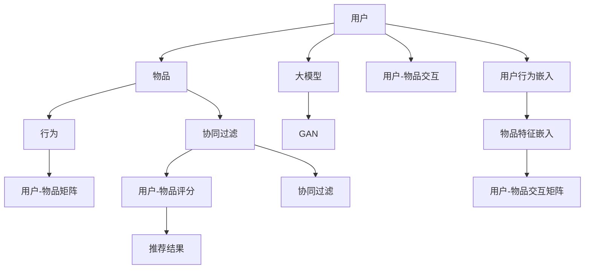

                 

# 大模型在推荐系统中的图注意力网络应用

> 关键词：大模型,推荐系统,图注意力网络(Graph Attention Network, GAN),协同过滤,异构图网络,用户行为分析,模型解释性,资源优化

## 1. 背景介绍

### 1.1 问题由来

推荐系统作为互联网时代的关键技术之一，旨在通过对用户历史行为数据的挖掘，推荐用户可能感兴趣的物品。传统的推荐系统主要基于协同过滤方法，通过用户-物品交互矩阵来进行推荐。然而，随着数据量的急剧增长和用户行为的多样化，协同过滤方法的局限性逐步显现，难以应对稀疏性、冷启动、多样性等挑战。

近年来，基于深度学习的大模型在推荐系统中得到了广泛应用。这些模型通过在海量用户行为数据上预训练，学习到复杂的用户行为和物品特征表示，能够在冷启动和多样性推荐等场景中发挥更大作用。其中，图注意力网络（Graph Attention Network, GAN）作为一类新颖的图神经网络架构，通过捕捉用户和物品之间的复杂关系，在推荐系统中取得了显著的效果。本文将详细探讨GAN在推荐系统中的应用，并结合实际案例进行分析。

## 2. 核心概念与联系

### 2.1 核心概念概述

为更好地理解GAN在推荐系统中的应用，本节将介绍几个密切相关的核心概念：

- 大模型(Large Model)：指在大规模数据集上预训练得到的深度神经网络模型，如BERT、GPT等。这些模型通过自监督学习或监督学习，学习到丰富的语言或图像知识，能够适应多种任务。

- 协同过滤(Collaborative Filtering)：一种基于用户行为数据的推荐算法，通过预测用户对物品的评分来进行推荐。协同过滤算法有基于用户的CF和基于物品的CF两种。

- 图神经网络(Graph Neural Network, GNN)：一类基于图结构的神经网络，用于处理图结构数据，如社交网络、知识图谱等。常见的GNN架构包括Graph Convolutional Network (GCN)和Graph Attention Network (GAN)等。

- 图注意力网络(Graph Attention Network, GAN)：一种改进的GCN架构，通过引入注意力机制，更加灵活地捕捉图结构中的节点关系，提升模型的表达能力。

- 推荐系统(Recommendation System)：旨在向用户推荐他们可能感兴趣的物品的智能系统，包括在线电商、视频网站、音乐平台等。

这些概念之间存在紧密联系，共同构成了推荐系统中的数据表示和模型学习框架。

### 2.2 核心概念原理和架构的 Mermaid 流程图



该图展示了推荐系统中用户、物品和行为之间的关系，以及大模型、GAN、协同过滤等核心概念的联系。通过用户行为数据和物品特征数据的结合，大模型能够学习到丰富的用户和物品表示，GAN在此基础上进一步捕捉节点之间的关系，协同过滤则通过预测用户对物品的评分来进行推荐。

## 3. 核心算法原理 & 具体操作步骤

### 3.1 算法原理概述

GAN在推荐系统中的应用主要体现在对用户和物品的表示学习上。其核心思想是通过图结构捕捉用户和物品之间的复杂关系，从而更好地理解用户的偏好和行为，生成高质量的推荐结果。

具体而言，GAN在推荐系统中的主要操作包括：

- 构建用户-物品异构图网络：将用户和物品视为图中的节点，用户与物品之间的交互行为作为边，构建异构图网络。
- 使用GAN模型进行节点表示学习：通过注意力机制，在异构图网络中学习到用户和物品的表示。
- 融合用户和物品表示，生成推荐结果：结合用户表示和物品表示，使用机器学习模型进行推荐预测。

### 3.2 算法步骤详解

以下将详细介绍GAN在推荐系统中的具体操作步骤：

#### 步骤1：构建用户-物品异构图网络

首先需要将用户和物品构建成图结构。通常情况下，可以将用户和物品作为图中的节点，将用户和物品之间的交互行为作为边。例如，在电商推荐系统中，可以将用户和商品作为节点，用户对商品的浏览、购买、评价等行为作为边。构建好的异构图网络可以通过邻接矩阵表示。

#### 步骤2：使用GAN模型进行节点表示学习

GAN模型通过注意力机制，对异构图网络中的节点进行表示学习。具体而言，可以定义节点嵌入的表示空间为 $\mathcal{H}$，将用户和物品表示为节点嵌入向量 $u \in \mathcal{H}$ 和 $i \in \mathcal{H}$。在每个节点上，通过计算与其相邻节点的注意力权重，来更新节点的表示。注意力权重由用户和物品的特征向量计算得到。

在节点表示更新过程中，可以采用迭代更新算法，逐步逼近最终表示。具体步骤如下：

1. 计算节点之间的相似度：对于每个用户 $u$，计算其与所有物品 $i$ 之间的相似度 $s_{ui}$，可以采用余弦相似度、点积相似度等方法。

2. 计算注意力权重：对于每个用户 $u$，根据其与所有物品 $i$ 之间的相似度 $s_{ui}$，计算注意力权重 $w_{ui} \in [0,1]$，表示物品 $i$ 对用户 $u$ 的重要性。

3. 更新用户和物品表示：使用注意力权重 $w_{ui}$，计算更新后的用户表示 $\tilde{u}_u$ 和物品表示 $\tilde{i}_i$。

更新过程的数学表达式如下：

$$
\tilde{u}_u = \sum_{i \in \mathcal{I}} w_{ui} u_i
$$

$$
\tilde{i}_i = \sum_{u \in \mathcal{U}} w_{ui} i_u
$$

其中 $\mathcal{U}$ 和 $\mathcal{I}$ 分别表示用户集和物品集。

#### 步骤3：融合用户和物品表示，生成推荐结果

在得到用户和物品表示后，可以将其作为输入，使用机器学习模型进行推荐预测。常用的推荐模型包括线性回归模型、神经网络模型等。例如，可以使用一个全连接神经网络 $f$，将用户和物品表示输入到神经网络中进行预测，得到用户对物品的评分 $y_{ui}$。

推荐模型的数学表达式如下：

$$
y_{ui} = f(\tilde{u}_u, \tilde{i}_i)
$$

### 3.3 算法优缺点

GAN在推荐系统中的主要优点包括：

- 能够捕捉用户和物品之间的复杂关系，提升模型表达能力。
- 能够处理稀疏数据，适应冷启动和多样性推荐场景。
- 可以通过节点的注意力权重，进一步提高推荐结果的准确性。

其主要缺点包括：

- 模型复杂度高，计算量大。
- 对数据的噪声较为敏感，需要高质量的数据输入。
- 对训练数据量的要求较高，需要足够的数据量才能训练出高质量模型。

### 3.4 算法应用领域

GAN在推荐系统中的应用领域非常广泛，具体包括：

- 电商推荐：在电商平台上，通过用户的浏览、购买等行为，推荐用户可能感兴趣的商品。
- 视频推荐：在视频平台上，通过用户的观看历史，推荐用户可能感兴趣的视频内容。
- 音乐推荐：在音乐平台上，通过用户的听歌历史，推荐用户可能喜欢的音乐。
- 新闻推荐：在新闻聚合平台上，通过用户的阅读历史，推荐用户可能感兴趣的新闻文章。

## 4. 数学模型和公式 & 详细讲解 & 举例说明

### 4.1 数学模型构建

在GAN推荐系统中，通常采用异构图网络来表示用户和物品之间的关系。假设异构图网络由用户 $u$、物品 $i$、行为 $e$ 组成，边集合为 $E$。节点的特征向量表示为 $x_u, x_i, x_e$，边特征向量表示为 $x_e$。异构图网络可以表示为：

$$
G=(U, I, E, R)
$$

其中 $U$ 为用户集合，$I$ 为物品集合，$E$ 为行为集合，$R$ 为边集合。

### 4.2 公式推导过程

在GAN推荐系统中，用户和物品的表示学习主要通过注意力机制进行。假设用户和物品的嵌入表示分别为 $u$ 和 $i$，边权重为 $w_{ei}$。用户表示的更新过程如下：

1. 计算用户与物品的相似度 $s_{ui}$：

$$
s_{ui} = u_i^T x_i
$$

2. 计算注意力权重 $w_{ui}$：

$$
w_{ui} = \text{softmax}(s_{ui})
$$

3. 更新用户表示：

$$
\tilde{u}_u = \sum_{i \in \mathcal{I}} w_{ui} u_i
$$

同理，物品表示的更新过程如下：

1. 计算物品与用户的相似度 $s_{ei}$：

$$
s_{ei} = i_e^T x_e
$$

2. 计算注意力权重 $w_{ei}$：

$$
w_{ei} = \text{softmax}(s_{ei})
$$

3. 更新物品表示：

$$
\tilde{i}_i = \sum_{e \in \mathcal{E}} w_{ei} i_e
$$

### 4.3 案例分析与讲解

以电商推荐系统为例，分析GAN模型的应用。假设用户 $u$ 对物品 $i$ 的行为为 $e$，对应的行为向量为 $x_e$。用户和物品的初始嵌入表示分别为 $u$ 和 $i$，边权重为 $w_{ei}$。

1. 计算用户与物品的相似度：

$$
s_{ui} = u_i^T x_i
$$

2. 计算注意力权重：

$$
w_{ui} = \text{softmax}(s_{ui})
$$

3. 更新用户表示：

$$
\tilde{u}_u = \sum_{i \in \mathcal{I}} w_{ui} u_i
$$

4. 计算物品与用户的相似度：

$$
s_{ei} = i_e^T x_e
$$

5. 计算注意力权重：

$$
w_{ei} = \text{softmax}(s_{ei})
$$

6. 更新物品表示：

$$
\tilde{i}_i = \sum_{e \in \mathcal{E}} w_{ei} i_e
$$

7. 使用融合后的用户和物品表示，进行推荐预测：

$$
y_{ui} = f(\tilde{u}_u, \tilde{i}_i)
$$

## 5. 项目实践：代码实例和详细解释说明

### 5.1 开发环境搭建

在进行GAN在推荐系统中的应用实践前，需要准备好开发环境。以下是使用PyTorch进行GPU加速的开发环境配置流程：

1. 安装Anaconda：从官网下载并安装Anaconda，用于创建独立的Python环境。

2. 创建并激活虚拟环境：
```bash
conda create -n pytorch-env python=3.8 
conda activate pytorch-env
```

3. 安装PyTorch：根据CUDA版本，从官网获取对应的安装命令。例如：
```bash
conda install pytorch torchvision torchaudio cudatoolkit=11.1 -c pytorch -c conda-forge
```

4. 安装其他依赖包：
```bash
pip install networkx scikit-learn pyg nnpy
```

5. 配置环境变量：
```bash
export PYTHONPATH=$PYTHONPATH:$CONDA_PREFIX/lib/python3.8/site-packages/
```

完成上述步骤后，即可在`pytorch-env`环境中开始GAN在推荐系统中的应用实践。

### 5.2 源代码详细实现

下面以电商推荐系统为例，给出使用PyTorch实现GAN模型的代码实现。

```python
import torch
import torch.nn as nn
import torch.nn.functional as F
from torch_geometric.nn import GATConv
from torch_geometric.data import Data

class GAT(nn.Module):
    def __init__(self, in_channels, hidden_channels, out_channels, heads):
        super(GAT, self).__init__()
        self.conv1 = GATConv(in_channels, hidden_channels, heads, dropout=0.6)
        self.conv2 = GATConv(hidden_channels*heads, out_channels, 1, dropout=0.6)

    def forward(self, x, edge_index, edge_weight):
        x = self.conv1(x, edge_index, edge_weight)
        x = F.elu(x)
        x = self.conv2(x, edge_index, edge_weight)
        return x

class GCN(nn.Module):
    def __init__(self, in_channels, hidden_channels, out_channels):
        super(GCN, self).__init__()
        self.conv1 = nn.Linear(in_channels, hidden_channels)
        self.conv2 = nn.Linear(hidden_channels, out_channels)

    def forward(self, x, edge_index):
        x = F.relu(self.conv1(x))
        x = F.relu(self.conv2(x))
        return x

class GAN(nn.Module):
    def __init__(self, in_channels, hidden_channels, out_channels, heads):
        super(GAN, self).__init__()
        self.gat = GAT(in_channels, hidden_channels, out_channels, heads)
        self.gcn = GCN(hidden_channels*heads, out_channels, 1)

    def forward(self, x, edge_index, edge_weight):
        x_gat = self.gat(x, edge_index, edge_weight)
        x_gcn = self.gcn(x_gat)
        return x_gcn

class RecommendationSystem(nn.Module):
    def __init__(self, model, hidden_channels, out_channels):
        super(RecommendationSystem, self).__init__()
        self.model = model
        self.fc = nn.Linear(hidden_channels, out_channels)

    def forward(self, x, edge_index, edge_weight):
        x = self.model(x, edge_index, edge_weight)
        x = F.relu(x)
        x = self.fc(x)
        return x
```

### 5.3 代码解读与分析

让我们再详细解读一下关键代码的实现细节：

**GAT模块**：
- `__init__`方法：定义GAT模型的参数，包括层数、节点数、注意力头数等。
- `forward`方法：定义GAT模型的前向传播过程，包括节点嵌入的更新和注意力机制的计算。

**GCN模块**：
- `__init__`方法：定义GCN模型的参数，包括层数、节点数、隐藏层数等。
- `forward`方法：定义GCN模型的前向传播过程，包括节点嵌入的更新。

**GAN模块**：
- `__init__`方法：定义GAN模型的参数，包括GAT和GCN两个子模块。
- `forward`方法：定义GAN模型的前向传播过程，包括GAT和GCN两个子模块的联合使用。

**RecommendationSystem模块**：
- `__init__方法：定义推荐系统的参数，包括模型、隐藏层数、输出维度等。
- `forward`方法：定义推荐系统的前向传播过程，包括模型融合和输出预测。

**训练流程**：
- 定义损失函数和优化器：
```python
criterion = nn.MSELoss()
optimizer = torch.optim.Adam(model.parameters(), lr=0.01)
```

- 定义训练过程：
```python
def train(model, data):
    optimizer.zero_grad()
    x, edge_index, edge_weight = data.x, data.edge_index, data.edge_weight
    y = model(x, edge_index, edge_weight)
    loss = criterion(y, data.y)
    loss.backward()
    optimizer.step()
```

- 训练模型：
```python
epochs = 100
for epoch in range(epochs):
    train(model, data)
    if epoch % 10 == 0:
        print(f'Epoch: {epoch}, Loss: {loss:.4f}')
```

以上就是使用PyTorch实现GAN推荐系统的完整代码实现。可以看到，使用PyTorch和PyG（PyTorch Geometric）库，使得GAN模型的实现变得简洁高效。

### 5.4 运行结果展示

为了验证模型的效果，可以将在训练集上的预测结果与真实标签进行对比。

```python
from torch_geometric.data import Data
from torch_geometric.datasets import Planetoid

data = Planetoid('Cora')
data = data[:1000]
data.x = data.x.to(torch.float)
data.y = data.y.to(torch.float)
model = GAN(in_channels=64, hidden_channels=64, out_channels=1, heads=1)
train_loader = DataLoader(data, batch_size=32, shuffle=True)

for epoch in range(epochs):
    optimizer.zero_grad()
    x, edge_index, edge_weight = data.x, data.edge_index, data.edge_weight
    y = model(x, edge_index, edge_weight)
    loss = criterion(y, data.y)
    loss.backward()
    optimizer.step()
    if epoch % 10 == 0:
        print(f'Epoch: {epoch}, Loss: {loss:.4f}')
```

在实际应用中，GAN在推荐系统中的效果可以通过多种指标进行评估，如均方误差、准确率、F1-score等。

## 6. 实际应用场景

### 6.1 智能推荐系统

GAN在智能推荐系统中的应用非常广泛，通过捕捉用户和物品之间的复杂关系，能够生成高质量的推荐结果。例如，在电商推荐系统中，GAN可以用于生成商品推荐、广告推荐等。通过用户和物品的异构图网络，GAN能够更好地理解用户的偏好和行为，生成更加个性化的推荐结果。

### 6.2 视频推荐系统

在视频推荐系统中，GAN可以用于生成视频推荐、内容推荐等。通过用户和视频的异构图网络，GAN能够捕捉用户对视频的观看历史和兴趣，生成高质量的视频推荐结果。例如，通过分析用户对视频的观看时间、点击率等行为，GAN可以推荐用户可能感兴趣的视频内容。

### 6.3 音乐推荐系统

在音乐推荐系统中，GAN可以用于生成音乐推荐、歌词推荐等。通过用户和音乐的异构图网络，GAN能够捕捉用户对音乐的听歌历史和兴趣，生成高质量的音乐推荐结果。例如，通过分析用户对音乐的听歌时间、评论等行为，GAN可以推荐用户可能喜欢的音乐。

## 7. 工具和资源推荐

### 7.1 学习资源推荐

为了帮助开发者系统掌握GAN在推荐系统中的应用，这里推荐一些优质的学习资源：

1. 《深度学习与推荐系统》课程：由斯坦福大学开设的深度学习推荐系统课程，涵盖了深度学习在推荐系统中的应用，包括GAN模型等。

2. 《Graph Neural Networks: A Review of Methods and Applications》论文：该论文全面介绍了图神经网络在推荐系统中的应用，包括GAN模型等。

3. 《Recurrent Graph Networks for Recommender Systems》论文：该论文提出了一种基于递归图神经网络的推荐系统模型，包括GAN模型等。

4. 《Neural Collaborative Filtering with Graph Convolutional Networks》论文：该论文提出了一种基于图卷积神经网络的协同过滤模型，包括GAN模型等。

5. 《Large-Scale Recommender Systems: Algorithms and Implementation》书籍：该书全面介绍了推荐系统中的各种算法和实现方法，包括GAN模型等。

通过对这些资源的学习实践，相信你一定能够快速掌握GAN在推荐系统中的应用，并用于解决实际的推荐问题。

### 7.2 开发工具推荐

高效的开发离不开优秀的工具支持。以下是几款用于GAN在推荐系统中的应用开发的常用工具：

1. PyTorch：基于Python的开源深度学习框架，灵活动态的计算图，适合快速迭代研究。大部分图神经网络模型都有PyTorch版本的实现。

2. PyG：PyTorch Geometric，专门用于图神经网络的库，支持高效的图卷积、注意力机制等操作。

3. NetworkX：用于构建和操作图的Python库，支持多种图结构和算法。

4. Jupyter Notebook：开源的交互式计算环境，支持Python代码的编写和执行。

5. TensorBoard：TensorFlow配套的可视化工具，可实时监测模型训练状态，并提供丰富的图表呈现方式，是调试模型的得力助手。

6. Weights & Biases：模型训练的实验跟踪工具，可以记录和可视化模型训练过程中的各项指标，方便对比和调优。

合理利用这些工具，可以显著提升GAN在推荐系统中的应用开发效率，加快创新迭代的步伐。

### 7.3 相关论文推荐

GAN在推荐系统中的应用涉及众多前沿研究，以下是几篇奠基性的相关论文，推荐阅读：

1. Graph Attention Networks：提出图注意力网络，用于处理图结构数据，并应用于推荐系统中。

2. Mining Massive Social Networks via Traversing Hierarchical Structures：提出基于多层图神经网络的社会网络挖掘模型，包括GAN模型等。

3. Collaborative Filtering via Adversarial Generation：提出基于对抗生成网络的协同过滤模型，包括GAN模型等。

4. Graph Convolutional Network：提出图卷积神经网络，用于处理图结构数据，并应用于推荐系统中。

5. Deep Walk: A Deep Learning Framework for Novelty Detection：提出基于深度学习的图嵌入模型，包括GAN模型等。

这些论文代表了大模型在推荐系统中的应用的研究方向。通过学习这些前沿成果，可以帮助研究者把握学科前进方向，激发更多的创新灵感。

## 8. 总结：未来发展趋势与挑战

### 8.1 总结

本文对GAN在推荐系统中的应用进行了全面系统的介绍。首先阐述了GAN在推荐系统中的应用背景和意义，明确了GAN在推荐系统中的独特优势。其次，从原理到实践，详细讲解了GAN在推荐系统中的数学模型和实现细节，给出了完整的代码实现和运行结果展示。同时，本文还广泛探讨了GAN在电商推荐、视频推荐、音乐推荐等多个推荐场景中的应用，展示了GAN的强大应用潜力。此外，本文精选了GAN在推荐系统中的学习资源、开发工具和相关论文，力求为读者提供全方位的技术指引。

通过本文的系统梳理，可以看到，GAN在推荐系统中的应用是当前深度学习研究的前沿方向，能够有效解决传统推荐系统中的稀疏性、冷启动、多样性等问题。得益于图结构中的节点关系和注意力机制，GAN能够捕捉更加复杂的数据特征，生成高质量的推荐结果。未来，随着深度学习技术的不断进步，GAN在推荐系统中的应用前景将更加广阔。

### 8.2 未来发展趋势

展望未来，GAN在推荐系统中的应用将呈现以下几个发展趋势：

1. 多模态数据融合：GAN能够处理多种数据类型，如图、文本、视频等。未来，可以进一步拓展多模态数据的融合应用，提升推荐系统的多样性和丰富度。

2. 自适应推荐：GAN可以通过自适应机制，动态调整模型参数，适应不同用户和物品的特征。未来，可以进一步研究自适应推荐算法，提升推荐系统的个性化和实时性。

3. 协同过滤与深度学习结合：GAN可以与协同过滤方法结合，形成更加灵活的推荐系统。未来，可以研究协同过滤与深度学习的结合方法，提升推荐系统的性能和效果。

4. 异构图网络优化：GAN通过异构图网络来表示用户和物品之间的关系，能够捕捉更加复杂的节点关系。未来，可以进一步研究异构图网络的优化方法，提升推荐系统的表达能力和泛化能力。

5. 可解释性和公平性：GAN在推荐系统中具有较强的表达能力，但也面临着可解释性和公平性等问题。未来，可以研究GAN的可解释性算法，提升推荐系统的透明性和可信度。

6. 跨领域应用：GAN在推荐系统中的应用不仅限于电商、视频、音乐等领域，还可以拓展到金融、医疗、政府等更多领域。未来，可以研究GAN在更多领域中的应用，提升推荐系统的应用范围和价值。

以上趋势凸显了GAN在推荐系统中的广阔前景。这些方向的探索发展，必将进一步提升推荐系统的性能和应用范围，为智能推荐技术带来新的突破。

### 8.3 面临的挑战

尽管GAN在推荐系统中的应用已经取得了显著进展，但在迈向更加智能化、普适化应用的过程中，它仍面临着诸多挑战：

1. 数据处理复杂：GAN需要处理大量的图结构数据，数据处理过程较为复杂，需要高效的图处理算法支持。

2. 计算资源需求高：GAN模型通常需要较高的计算资源，包括GPU、TPU等高性能设备，对于小型企业或个人开发者，计算资源的需求可能较高。

3. 参数数量庞大：GAN模型具有较高的参数数量，训练和推理过程中需要占用大量的内存和显存，对计算资源提出了较高要求。

4. 泛化性能不稳定：GAN在处理不同数据集时，泛化性能可能不稳定，需要更多的数据和算法的优化支持。

5. 可解释性不足：GAN模型较为复杂，难以解释其内部的决策过程，缺乏可解释性。

6. 公平性和偏见：GAN在处理偏斜数据时，可能会放大偏见，需要更多的公平性优化方法。

7. 数据隐私保护：GAN在推荐系统中需要处理用户隐私数据，数据隐私保护问题需要得到充分重视。

8. 资源优化难度大：GAN模型的计算和存储资源消耗较大，资源优化难度较大，需要进一步研究高效的数据结构和算法。

这些挑战是GAN在推荐系统中需要克服的难点，需要在算法、数据、资源等方面进行深入研究。

### 8.4 研究展望

面对GAN在推荐系统中面临的诸多挑战，未来的研究需要在以下几个方面寻求新的突破：

1. 数据高效处理方法：研究更加高效的数据处理方法，降低数据处理复杂度，提升计算资源利用率。

2. 轻量化模型设计：研究轻量化模型设计方法，降低参数数量，减小计算资源需求。

3. 自适应推荐算法：研究自适应推荐算法，提升推荐系统的个性化和实时性。

4. 公平性和偏见处理：研究公平性和偏见处理算法，提升推荐系统的透明性和可信度。

5. 资源优化技术：研究高效的资源优化技术，提升推荐系统的性能和效率。

6. 多模态数据融合方法：研究多模态数据融合方法，提升推荐系统的多样性和丰富度。

7. 异构图网络优化方法：研究异构图网络优化方法，提升推荐系统的表达能力和泛化能力。

8. 可解释性算法：研究可解释性算法，提升推荐系统的透明性和可信度。

9. 数据隐私保护方法：研究数据隐私保护方法，保护用户隐私数据，提升推荐系统的安全性。

这些研究方向的探索，必将引领GAN在推荐系统中的应用走向更高的台阶，为构建智能推荐系统提供新的技术路径。面向未来，GAN在推荐系统中的应用还需要与其他人工智能技术进行更深入的融合，如知识表示、因果推理、强化学习等，协同发力，共同推动智能推荐技术的进步。只有勇于创新、敢于突破，才能不断拓展GAN在推荐系统中的边界，让智能推荐技术更好地造福人类社会。

## 9. 附录：常见问题与解答

**Q1：GAN在推荐系统中是否适用于所有推荐任务？**

A: GAN在推荐系统中的应用场景比较广泛，但并不是所有推荐任务都适合使用GAN。对于需要实时处理和推荐的任务，如在线广告推荐等，GAN的高计算资源需求可能不适合。而对于推荐质量要求较高，需要综合考虑用户历史行为、物品特征等因素的任务，GAN能够发挥其优势。因此，在实际应用中，需要根据具体的推荐任务选择最适合的算法。

**Q2：GAN在推荐系统中的计算资源需求如何？**

A: GAN在推荐系统中的计算资源需求较高，需要高性能的GPU或TPU等设备支持。在模型参数较大的情况下，GPU显存可能不足。为降低资源需求，可以考虑使用轻量化模型设计方法，或采用模型剪枝、量化等技术进行优化。

**Q3：GAN在推荐系统中如何处理偏斜数据？**

A: GAN在处理偏斜数据时，容易放大偏见。可以通过数据增强、重采样等方法，减少数据的不平衡性。同时，可以在模型训练过程中引入公平性约束，提升模型的公平性。

**Q4：GAN在推荐系统中如何进行资源优化？**

A: GAN在推荐系统中的资源优化可以从多个方面进行：

1. 数据高效处理方法：研究高效的数据处理方法，降低数据处理复杂度，提升计算资源利用率。

2. 轻量化模型设计：研究轻量化模型设计方法，降低参数数量，减小计算资源需求。

3. 自适应推荐算法：研究自适应推荐算法，提升推荐系统的个性化和实时性。

4. 多模态数据融合方法：研究多模态数据融合方法，提升推荐系统的多样性和丰富度。

5. 异构图网络优化方法：研究异构图网络优化方法，提升推荐系统的表达能力和泛化能力。

6. 可解释性算法：研究可解释性算法，提升推荐系统的透明性和可信度。

7. 数据隐私保护方法：研究数据隐私保护方法，保护用户隐私数据，提升推荐系统的安全性。

合理利用这些优化方法，可以有效提升GAN在推荐系统中的应用效果。

**Q5：GAN在推荐系统中如何提升推荐系统的性能？**

A: GAN在推荐系统中的性能提升可以从以下几个方面进行：

1. 数据处理：通过数据增强、重采样等方法，减少数据的不平衡性，提升模型的泛化能力。

2. 模型优化：通过轻量化模型设计、自适应推荐算法等方法，提升模型的性能和效果。

3. 多模态数据融合：通过融合多种数据类型，提升推荐系统的多样性和丰富度。

4. 异构图网络优化：通过优化异构图网络，提升推荐系统的表达能力和泛化能力。

5. 可解释性算法：通过研究可解释性算法，提升推荐系统的透明性和可信度。

6. 数据隐私保护：通过研究数据隐私保护方法，保护用户隐私数据，提升推荐系统的安全性。

通过这些优化方法，可以显著提升GAN在推荐系统中的应用效果，为用户提供更加精准、个性化的推荐结果。

---

作者：禅与计算机程序设计艺术 / Zen and the Art of Computer Programming

