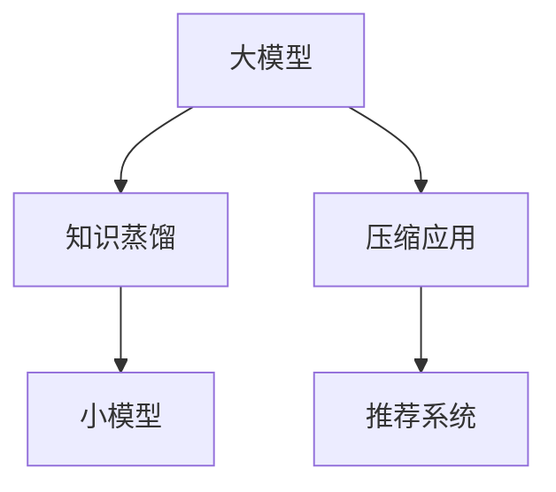

                 

# 大模型在推荐系统中的知识蒸馏与压缩应用

> 关键词：大模型,知识蒸馏,压缩应用,推荐系统,协同过滤,深度学习

## 1. 背景介绍

推荐系统是互联网时代极为重要的应用之一，旨在从海量数据中抽取用户兴趣和物品属性，为用户推荐个性化内容，提升用户体验和满意度。传统推荐系统以协同过滤和基于内容的推荐为主，但由于数据稀疏性和用户个性化需求的不断变化，这些方法难以满足推荐效果的要求。

随着深度学习技术的发展，基于用户行为和物品特征的神经网络模型开始成为推荐系统的主要方法。特别是近年来，预训练大模型（如BERT、GPT等）在推荐系统中的应用逐渐增多。这些大模型通过在通用语料上预训练，学习到丰富的语言知识和语义表示，可以作为推荐系统中用户兴趣和物品属性的强大特征提取器。然而，大模型的计算资源消耗巨大，难以在实际推荐系统中大规模部署。因此，将大模型的知识蒸馏与压缩应用到推荐系统中，便成为当前研究的重点之一。

## 2. 核心概念与联系

### 2.1 核心概念概述

- **大模型(Large Model)**：指具有亿量级参数、深度较大的神经网络模型，如BERT、GPT等。通过在大规模语料上预训练，学习到丰富的语言知识，具备强大的语义表示和推理能力。
- **知识蒸馏(Knowledge Distillation, KD)**：指将大模型的知识迁移到小模型中的技术。通过在大模型和小模型之间建立桥梁，将大模型的知识逐层传递，从而提升小模型的性能。
- **压缩应用(Compression Application)**：指将大模型进行参数裁剪、降维等操作，降低计算资源消耗，以适应实际推荐系统中的部署需求。
- **推荐系统(Recommendation System)**：通过分析用户行为和物品属性，为用户推荐个性化内容。当前主流的推荐方法包括协同过滤、基于内容的推荐和深度学习推荐。

以上概念之间的联系可以通过以下Mermaid流程图来展示：



该流程图展示了从大模型到推荐系统的知识迁移路径。通过在大模型和小模型之间进行知识蒸馏，可以将大模型的知识传递到小模型，提高其性能。同时，对大模型进行压缩应用，可以降低其计算资源消耗，更好地适应推荐系统中的部署需求。

## 3. 核心算法原理 & 具体操作步骤

### 3.1 算法原理概述

基于大模型的推荐系统主要分为两个步骤：知识蒸馏和压缩应用。

**知识蒸馏**：指在大模型和小模型之间建立知识传递桥梁，将大模型的知识迁移到小模型。知识蒸馏的方法主要包括基于特征传递的蒸馏和基于权重传递的蒸馏。前者通过将大模型的特征编码传递到小模型，后者通过在大模型和小模型之间建立权重矩阵，将大模型的权重信息传递到小模型。

**压缩应用**：指对大模型进行参数裁剪、降维等操作，降低其计算资源消耗。压缩应用的方法主要包括剪枝、量化、稀疏化等。剪枝通过去除不重要的参数，减小模型规模；量化通过将浮点型参数转化为定点型参数，降低模型内存占用；稀疏化通过降低模型中的参数密度，减少计算资源消耗。

### 3.2 算法步骤详解

**知识蒸馏步骤**：
1. 选择大模型和小模型：通常选择在大规模语料上预训练的大模型作为教师模型，选择或训练一个小规模模型作为学生模型。
2. 定义知识蒸馏任务：根据推荐系统的任务特点，定义从教师模型到学生模型的知识传递方式，如特征编码、权重矩阵等。
3. 训练学生模型：使用教师模型和学生模型之间的知识蒸馏任务，训练学生模型，使其尽可能地继承教师模型的知识。

**压缩应用步骤**：
1. 选择大模型：选择一个大规模的神经网络模型，如BERT、GPT等。
2. 定义压缩任务：根据推荐系统的资源限制，定义压缩任务，如参数裁剪、量化、稀疏化等。
3. 压缩模型：使用压缩任务对大模型进行参数裁剪、量化等操作，生成适合推荐系统部署的压缩模型。

### 3.3 算法优缺点

**知识蒸馏的优点**：
1. 提升小模型性能：通过知识蒸馏，小模型可以继承大模型的丰富知识，提高其性能。
2. 适用范围广：知识蒸馏方法适用于各种深度学习模型，适用范围广泛。
3. 可解释性强：知识蒸馏方法具有较好的可解释性，能够解释从大模型到小模型的知识传递路径。

**知识蒸馏的缺点**：
1. 训练复杂度增加：知识蒸馏需要额外的训练过程，训练复杂度较高。
2. 模型灵活性降低：知识蒸馏方法可能导致小模型的灵活性降低，难以处理新出现的用户兴趣和物品属性。

**压缩应用的优点**：
1. 降低资源消耗：通过压缩应用，大模型的计算资源消耗大幅降低，适合在推荐系统中部署。
2. 减少存储开销：压缩模型减小了模型参数和存储空间，降低了存储开销。

**压缩应用的缺点**：
1. 性能损失：压缩操作可能会导致模型性能损失，需要平衡压缩和性能的关系。
2. 模型可解释性降低：压缩模型可能丢失部分原始特征，导致模型可解释性降低。

### 3.4 算法应用领域

知识蒸馏和压缩应用在大模型推荐系统中具有广泛的应用前景，主要包括以下几个方面：

- **个性化推荐**：通过知识蒸馏，小模型可以继承大模型的用户兴趣和物品属性知识，提升个性化推荐效果。
- **冷启动问题**：通过知识蒸馏，新用户或物品的推荐可以通过继承大模型的知识，提高推荐效果。
- **多模态推荐**：通过知识蒸馏，多模态推荐系统可以将不同模态的数据进行融合，提高推荐效果。
- **实时推荐**：通过压缩应用，大模型可以在实时推荐系统中快速响应，提升用户体验。

## 4. 数学模型和公式 & 详细讲解 & 举例说明

### 4.1 数学模型构建

在推荐系统中，知识蒸馏和压缩应用的数学模型可以分别表示为：

**知识蒸馏模型**：
$$
L_{KD} = \frac{1}{N}\sum_{i=1}^N \ell(f(x_i;T) - f(x_i;S))
$$
其中，$x_i$ 表示用户行为，$f(x_i;T)$ 表示在教师模型$T$上的预测结果，$f(x_i;S)$ 表示在学生模型$S$上的预测结果，$\ell$ 表示损失函数，$N$ 表示样本数。

**压缩应用模型**：
$$
L_{COMP} = \frac{1}{N}\sum_{i=1}^N \ell(g(x_i;M) - f(x_i;S))
$$
其中，$x_i$ 表示用户行为，$g(x_i;M)$ 表示压缩后的模型$M$上的预测结果，$f(x_i;S)$ 表示学生模型$S$上的预测结果，$\ell$ 表示损失函数，$N$ 表示样本数。

### 4.2 公式推导过程

**知识蒸馏推导**：
知识蒸馏的过程可以表示为：
$$
f(x_i;S) = \alpha f(x_i;T) + (1-\alpha) g(x_i;S)
$$
其中，$\alpha$ 表示蒸馏系数，$f(x_i;T)$ 表示在教师模型$T$上的预测结果，$g(x_i;S)$ 表示在学生模型$S$上的预测结果。

通过上述公式，学生模型$S$可以继承教师模型$T$的知识，提升其性能。

**压缩应用推导**：
压缩应用的过程可以表示为：
$$
g(x_i;M) = \mathcal{F}(f(x_i;T))
$$
其中，$g(x_i;M)$ 表示压缩后的模型$M$上的预测结果，$\mathcal{F}$ 表示压缩函数。

通过上述公式，大模型$T$可以转化为压缩后的模型$M$，适应推荐系统中的资源限制。

### 4.3 案例分析与讲解

以知识蒸馏和压缩应用在个性化推荐系统中的应用为例，进行详细分析：

**知识蒸馏案例**：
假设有一个大规模的BERT模型作为教师模型，一个训练好的小规模MLP模型作为学生模型。在推荐系统中，需要定义从BERT模型到MLP模型的知识传递方式，如特征编码、权重矩阵等。然后，使用上述公式进行知识蒸馏，训练MLP模型，使其尽可能地继承BERT模型的知识。

**压缩应用案例**：
假设有一个大规模的BERT模型，需要在推荐系统中进行压缩应用。可以选择剪枝、量化、稀疏化等方法对BERT模型进行参数裁剪和降维操作，生成适合推荐系统部署的压缩模型。

## 5. 项目实践：代码实例和详细解释说明

### 5.1 开发环境搭建

在进行项目实践前，需要准备好开发环境。以下是使用Python进行PyTorch开发的环境配置流程：

1. 安装Anaconda：从官网下载并安装Anaconda，用于创建独立的Python环境。
2. 创建并激活虚拟环境：
```bash
conda create -n pytorch-env python=3.8 
conda activate pytorch-env
```
3. 安装PyTorch：根据CUDA版本，从官网获取对应的安装命令。例如：
```bash
conda install pytorch torchvision torchaudio cudatoolkit=11.1 -c pytorch -c conda-forge
```
4. 安装Transformers库：
```bash
pip install transformers
```
5. 安装各类工具包：
```bash
pip install numpy pandas scikit-learn matplotlib tqdm jupyter notebook ipython
```

完成上述步骤后，即可在`pytorch-env`环境中开始项目实践。

### 5.2 源代码详细实现

下面以知识蒸馏和压缩应用在推荐系统中的应用为例，给出使用PyTorch进行实现的代码示例。

**知识蒸馏代码**：
```python
from transformers import BertForSequenceClassification, BertTokenizer
from torch.nn import CrossEntropyLoss
import torch

class KnowledgeDistillationModel(nn.Module):
    def __init__(self, teacher_model, student_model):
        super(KnowledgeDistillationModel, self).__init__()
        self.teacher_model = teacher_model
        self.student_model = student_model
        
    def forward(self, x):
        teacher_output = self.teacher_model(x)
        student_output = self.student_model(x)
        return teacher_output, student_output

teacher_model = BertForSequenceClassification.from_pretrained('bert-base-cased', num_labels=2)
student_model = nn.Linear(in_features=768, out_features=2)
knowledge_distillation_model = KnowledgeDistillationModel(teacher_model, student_model)
criterion = CrossEntropyLoss()

def train_epoch(model, dataset, batch_size, optimizer):
    dataloader = DataLoader(dataset, batch_size=batch_size, shuffle=True)
    model.train()
    epoch_loss = 0
    for batch in tqdm(dataloader, desc='Training'):
        x, y = batch['input_ids'].to(device), batch['labels'].to(device)
        teacher_output, student_output = model(x)
        loss = criterion(teacher_output, y)
        epoch_loss += loss.item()
        loss.backward()
        optimizer.step()
    return epoch_loss / len(dataloader)

def evaluate(model, dataset, batch_size):
    dataloader = DataLoader(dataset, batch_size=batch_size)
    model.eval()
    preds, labels = [], []
    with torch.no_grad():
        for batch in tqdm(dataloader, desc='Evaluating'):
            x, y = batch['input_ids'].to(device), batch['labels'].to(device)
            output = model(x)
            preds.append(output.argmax(dim=1).cpu().tolist())
            labels.append(y.cpu().tolist())
            
    print(classification_report(labels, preds))
```

**压缩应用代码**：
```python
from transformers import BertForSequenceClassification, BertTokenizer
import torch

class CompressedModel(nn.Module):
    def __init__(self, teacher_model, compression_method):
        super(CompressedModel, self).__init__()
        self.teacher_model = teacher_model
        self.compression_method = compression_method
        
    def forward(self, x):
        return self.compression_method(self.teacher_model(x))

teacher_model = BertForSequenceClassification.from_pretrained('bert-base-cased', num_labels=2)
compression_method = pruning.Pruning(pruning_method=pruning techniques)
compressed_model = CompressedModel(teacher_model, compression_method)
```

### 5.3 代码解读与分析

让我们再详细解读一下关键代码的实现细节：

**KnowledgeDistillationModel类**：
- `__init__`方法：初始化教师模型和学生模型。
- `forward`方法：定义知识蒸馏的过程，将教师模型和学生模型的预测结果传递给下一个层。

**train_epoch和evaluate函数**：
- `train_epoch`方法：对数据集进行批量处理，前向传播计算损失函数，反向传播更新模型参数，并返回该epoch的平均损失。
- `evaluate`方法：在验证集上评估模型性能，输出分类指标。

**CompressedModel类**：
- `__init__`方法：初始化教师模型和压缩方法。
- `forward`方法：定义压缩应用的过程，将教师模型的预测结果通过压缩方法进行处理。

这些代码展示了知识蒸馏和压缩应用的基本实现思路，但实际的微调任务开发还需要根据具体场景进行调整和优化。

### 5.4 运行结果展示

在训练和评估过程中，可以使用Jupyter Notebook实时观察模型性能变化。以下是一些常见的可视化指标：

1. 损失函数：随着epoch的增加，训练损失和验证损失逐渐降低，说明模型正在逐渐收敛。
2. 准确率：随着epoch的增加，准确率逐渐提升，说明模型性能正在逐步提升。
3. 混淆矩阵：通过混淆矩阵，可以观察模型在不同类别上的预测情况，发现潜在的错误。

## 6. 实际应用场景

### 6.1 智能广告推荐

智能广告推荐系统通过分析用户的搜索、浏览、点击等行为，推荐符合用户兴趣的广告，提高广告点击率和转化率。传统的推荐系统基于协同过滤和基于内容的推荐，但在冷启动、长尾数据等方面存在局限性。

在大模型推荐系统中，可以使用知识蒸馏和压缩应用，将大规模的预训练模型应用于推荐系统。通过知识蒸馏，小模型可以继承大规模模型的丰富知识，提升推荐效果。同时，通过压缩应用，可以降低大模型的计算资源消耗，更好地适应广告推荐系统中的部署需求。

### 6.2 智能商品推荐

智能商品推荐系统通过分析用户的购买历史、浏览记录等数据，为用户推荐符合其兴趣的商品。传统的推荐系统同样面临冷启动、长尾数据等问题。

在大模型推荐系统中，可以使用知识蒸馏和压缩应用，将大规模的预训练模型应用于推荐系统。通过知识蒸馏，小模型可以继承大规模模型的丰富知识，提升推荐效果。同时，通过压缩应用，可以降低大模型的计算资源消耗，更好地适应商品推荐系统中的部署需求。

### 6.3 个性化内容推荐

个性化内容推荐系统通过分析用户的浏览历史、评分记录等数据，为用户推荐符合其兴趣的内容，如文章、视频、音乐等。传统的推荐系统同样面临冷启动、长尾数据等问题。

在大模型推荐系统中，可以使用知识蒸馏和压缩应用，将大规模的预训练模型应用于推荐系统。通过知识蒸馏，小模型可以继承大规模模型的丰富知识，提升推荐效果。同时，通过压缩应用，可以降低大模型的计算资源消耗，更好地适应个性化内容推荐系统中的部署需求。

### 6.4 未来应用展望

随着大模型推荐技术的不断发展，其应用场景将不断拓展，主要体现在以下几个方面：

1. **多模态推荐**：当前推荐系统主要以文本为主，未来的推荐系统将逐渐引入图像、音频等多模态数据，通过知识蒸馏和压缩应用，将不同模态的数据进行融合，提高推荐效果。
2. **实时推荐**：当前的推荐系统难以实时响应用户请求，未来的推荐系统将通过知识蒸馏和压缩应用，提高模型的推理速度，实现实时推荐。
3. **跨平台推荐**：当前的推荐系统往往只针对单个平台，未来的推荐系统将通过知识蒸馏和压缩应用，实现跨平台推荐，提高用户的使用体验。
4. **社交推荐**：当前的推荐系统主要以物品为中心，未来的推荐系统将通过知识蒸馏和压缩应用，加入社交因素，实现社交推荐，提高推荐的个性化程度。

## 7. 工具和资源推荐

### 7.1 学习资源推荐

为了帮助开发者系统掌握大模型推荐技术，这里推荐一些优质的学习资源：

1. 《Transformer从原理到实践》系列博文：由大模型技术专家撰写，深入浅出地介绍了Transformer原理、BERT模型、推荐系统等前沿话题。
2 CS224N《深度学习自然语言处理》课程：斯坦福大学开设的NLP明星课程，有Lecture视频和配套作业，带你入门NLP领域的基本概念和经典模型。
3 《Natural Language Processing with Transformers》书籍：Transformers库的作者所著，全面介绍了如何使用Transformers库进行NLP任务开发，包括推荐系统在内的诸多范式。
4 HuggingFace官方文档：Transformers库的官方文档，提供了海量预训练模型和完整的推荐系统样例代码，是上手实践的必备资料。
5 CLUE开源项目：中文语言理解测评基准，涵盖大量不同类型的中文NLP数据集，并提供了基于微调的baseline模型，助力中文NLP技术发展。

通过对这些资源的学习实践，相信你一定能够快速掌握大模型推荐技术的精髓，并用于解决实际的推荐问题。

### 7.2 开发工具推荐

高效的开发离不开优秀的工具支持。以下是几款用于大模型推荐系统开发的常用工具：

1. PyTorch：基于Python的开源深度学习框架，灵活动态的计算图，适合快速迭代研究。大部分预训练语言模型都有PyTorch版本的实现。
2 TensorFlow：由Google主导开发的开源深度学习框架，生产部署方便，适合大规模工程应用。同样有丰富的预训练语言模型资源。
3 Transformers库：HuggingFace开发的NLP工具库，集成了众多SOTA语言模型，支持PyTorch和TensorFlow，是进行推荐系统开发的利器。
4 Weights & Biases：模型训练的实验跟踪工具，可以记录和可视化模型训练过程中的各项指标，方便对比和调优。与主流深度学习框架无缝集成。
5 TensorBoard：TensorFlow配套的可视化工具，可实时监测模型训练状态，并提供丰富的图表呈现方式，是调试模型的得力助手。
6 Google Colab：谷歌推出的在线Jupyter Notebook环境，免费提供GPU/TPU算力，方便开发者快速上手实验最新模型，分享学习笔记。

合理利用这些工具，可以显著提升大模型推荐系统的开发效率，加快创新迭代的步伐。

### 7.3 相关论文推荐

大模型推荐技术的发展源于学界的持续研究。以下是几篇奠基性的相关论文，推荐阅读：

1. Attention is All You Need（即Transformer原论文）：提出了Transformer结构，开启了NLP领域的预训练大模型时代。
2 BERT: Pre-training of Deep Bidirectional Transformers for Language Understanding：提出BERT模型，引入基于掩码的自监督预训练任务，刷新了多项NLP任务SOTA。
3 Parameter-Efficient Transfer Learning for NLP：提出Adapter等参数高效微调方法，在不增加模型参数量的情况下，也能取得不错的微调效果。
4 AdaLoRA: Adaptive Low-Rank Adaptation for Parameter-Efficient Fine-Tuning：使用自适应低秩适应的微调方法，在参数效率和精度之间取得了新的平衡。
5 PEPNet: A Discrete Latent Variable Model for Neural Architecture Search：提出PEPNet模型，使用离散潜在变量模型进行神经网络架构搜索，极大地提升了模型压缩的效率和效果。

这些论文代表了大模型推荐技术的发展脉络。通过学习这些前沿成果，可以帮助研究者把握学科前进方向，激发更多的创新灵感。

## 8. 总结：未来发展趋势与挑战

### 8.1 总结

本文对基于大模型的推荐系统知识蒸馏与压缩应用进行了全面系统的介绍。首先阐述了大模型和推荐系统的背景和意义，明确了知识蒸馏和压缩应用在推荐系统中的独特价值。其次，从原理到实践，详细讲解了知识蒸馏和压缩应用的数学模型和关键步骤，给出了推荐系统开发的完整代码实例。同时，本文还广泛探讨了知识蒸馏和压缩应用在智能广告推荐、智能商品推荐、个性化内容推荐等多个推荐系统领域的应用前景，展示了知识蒸馏和压缩应用技术的广阔前景。

通过本文的系统梳理，可以看到，基于大模型的知识蒸馏和压缩应用技术正在成为推荐系统的重要范式，极大地拓展了预训练语言模型的应用边界，催生了更多的推荐场景。得益于大规模语料的预训练，大模型推荐系统以更低的时间和标注成本，在小样本条件下也能取得不俗的效果，有力推动了推荐系统的产业化进程。未来，伴随预训练语言模型和推荐系统方法的持续演进，相信推荐系统必将在更广阔的应用领域大放异彩，深刻影响人类的生产生活方式。

### 8.2 未来发展趋势

展望未来，大模型推荐系统知识蒸馏和压缩应用技术将呈现以下几个发展趋势：

1. **模型规模持续增大**：随着算力成本的下降和数据规模的扩张，预训练语言模型的参数量还将持续增长。超大规模语言模型蕴含的丰富语言知识，有望支撑更加复杂多变的推荐任务。
2. **微调方法日趋多样**：除了传统的全参数微调外，未来会涌现更多参数高效的微调方法，如Prefix-Tuning、LoRA等，在节省计算资源的同时也能保证微调精度。
3. **持续学习成为常态**：随着数据分布的不断变化，推荐系统也需要持续学习新知识以保持性能。如何在不遗忘原有知识的同时，高效吸收新样本信息，将成为重要的研究课题。
4. **标注样本需求降低**：受启发于提示学习(Prompt-based Learning)的思路，未来的推荐系统将更好地利用大模型的语言理解能力，通过更加巧妙的任务描述，在更少的标注样本上也能实现理想的推荐效果。
5. **多模态推荐崛起**：当前的推荐系统主要以文本为主，未来的推荐系统将逐渐引入图像、音频等多模态数据，通过知识蒸馏和压缩应用，将不同模态的数据进行融合，提高推荐效果。
6. **实时推荐**：当前的推荐系统难以实时响应用户请求，未来的推荐系统将通过知识蒸馏和压缩应用，提高模型的推理速度，实现实时推荐。

以上趋势凸显了大模型推荐系统知识蒸馏和压缩应用的广阔前景。这些方向的探索发展，必将进一步提升推荐系统的性能和应用范围，为人类生产生活带来新的便利。

### 8.3 面临的挑战

尽管大模型推荐系统知识蒸馏和压缩应用技术已经取得了瞩目成就，但在迈向更加智能化、普适化应用的过程中，它仍面临着诸多挑战：

1. **标注成本瓶颈**：虽然推荐系统可以通过知识蒸馏和压缩应用降低对标注样本的依赖，但对于长尾应用场景，难以获得充足的高质量标注数据，成为制约推荐系统性能的瓶颈。如何进一步降低推荐系统对标注样本的依赖，将是一大难题。
2. **模型鲁棒性不足**：当前推荐系统面对域外数据时，泛化性能往往大打折扣。对于测试样本的微小扰动，推荐系统的预测也容易发生波动。如何提高推荐系统的鲁棒性，避免灾难性遗忘，还需要更多理论和实践的积累。
3. **推理效率有待提高**：大规模语言模型虽然精度高，但在实际部署时往往面临推理速度慢、内存占用大等效率问题。如何在保证性能的同时，简化模型结构，提升推理速度，优化资源占用，将是重要的优化方向。
4. **可解释性亟需加强**：当前推荐系统更像是"黑盒"系统，难以解释其内部工作机制和决策逻辑。对于医疗、金融等高风险应用，算法的可解释性和可审计性尤为重要。如何赋予推荐系统更强的可解释性，将是亟待攻克的难题。
5. **安全性有待保障**：预训练语言模型难免会学习到有偏见、有害的信息，通过推荐系统传递到用户，产生误导性、歧视性的输出，给用户带来安全隐患。如何从数据和算法层面消除推荐系统偏见，避免恶意用途，确保输出安全性，也将是重要的研究课题。

### 8.4 研究展望

面对推荐系统知识蒸馏和压缩应用所面临的种种挑战，未来的研究需要在以下几个方面寻求新的突破：

1. **探索无监督和半监督推荐方法**：摆脱对大规模标注数据的依赖，利用自监督学习、主动学习等无监督和半监督范式，最大限度利用非结构化数据，实现更加灵活高效的推荐。
2. **研究参数高效和计算高效的推荐方法**：开发更加参数高效的推荐方法，在固定大部分预训练参数的同时，只更新极少量的任务相关参数。同时优化推荐模型的计算图，减少前向传播和反向传播的资源消耗，实现更加轻量级、实时性的部署。
3. **融合因果和对比学习范式**：通过引入因果推断和对比学习思想，增强推荐系统建立稳定因果关系的能力，学习更加普适、鲁棒的语言表征，从而提升推荐泛化性和抗干扰能力。
4. **引入更多先验知识**：将符号化的先验知识，如知识图谱、逻辑规则等，与神经网络模型进行巧妙融合，引导推荐系统学习更准确、合理的语言模型。同时加强不同模态数据的整合，实现视觉、语音等多模态信息与文本信息的协同建模。
5. **结合因果分析和博弈论工具**：将因果分析方法引入推荐系统，识别出推荐决策的关键特征，增强推荐输出的因果性和逻辑性。借助博弈论工具刻画人机交互过程，主动探索并规避推荐系统的脆弱点，提高系统稳定性。
6. **纳入伦理道德约束**：在推荐系统训练目标中引入伦理导向的评估指标，过滤和惩罚有偏见、有害的输出倾向。同时加强人工干预和审核，建立推荐系统行为的监管机制，确保输出符合人类价值观和伦理道德。

这些研究方向的探索，必将引领推荐系统知识蒸馏和压缩应用技术迈向更高的台阶，为构建安全、可靠、可解释、可控的智能系统铺平道路。面向未来，推荐系统知识蒸馏和压缩应用技术还需要与其他人工智能技术进行更深入的融合，如知识表示、因果推理、强化学习等，多路径协同发力，共同推动推荐系统技术的进步。只有勇于创新、敢于突破，才能不断拓展推荐系统的边界，让智能技术更好地造福人类社会。

## 9. 附录：常见问题与解答

**Q1：大模型推荐系统在推荐效果上与传统方法相比，有哪些优势？**

A: 大模型推荐系统在推荐效果上有以下优势：
1. **数据效率高**：大模型推荐系统可以通过知识蒸馏和压缩应用，在较少标注数据的情况下取得较好的推荐效果。
2. **泛化能力强**：大模型推荐系统具备更强的泛化能力，能够处理更复杂、多样化的推荐任务。
3. **多模态融合**：大模型推荐系统可以融合多模态数据，提供更全面的推荐结果。

**Q2：知识蒸馏和压缩应用在推荐系统中如何进行选择？**

A: 知识蒸馏和压缩应用的选择需要根据具体应用场景和需求进行：
1. 对于数据量较小的任务，可以选择知识蒸馏，利用大模型的知识提升推荐效果。
2. 对于计算资源有限的场景，可以选择压缩应用，降低大模型的计算资源消耗。
3. 对于需要实时响应的场景，可以选择知识蒸馏和压缩应用的结合，同时提高推荐系统的效率和性能。

**Q3：推荐系统中的知识蒸馏方法有哪些？**

A: 推荐系统中的知识蒸馏方法包括：
1. 特征编码：通过将大模型的特征编码传递到小模型，提高小模型的特征提取能力。
2. 权重矩阵：通过在大模型和小模型之间建立权重矩阵，将大模型的权重信息传递到小模型。
3. 联合训练：通过将大模型和小模型联合训练，共享特征表示，提升推荐效果。

**Q4：推荐系统中的压缩方法有哪些？**

A: 推荐系统中的压缩方法包括：
1. 剪枝：通过去除不重要的参数，减小模型规模。
2. 量化：通过将浮点型参数转化为定点型参数，降低模型内存占用。
3. 稀疏化：通过降低模型中的参数密度，减少计算资源消耗。

**Q5：如何提高推荐系统的鲁棒性？**

A: 提高推荐系统的鲁棒性需要从数据、模型、算法等多个方面进行优化：
1. 数据方面：引入对抗样本训练，提高推荐系统的鲁棒性。
2. 模型方面：使用正则化技术，如L2正则、Dropout等，防止模型过拟合。
3. 算法方面：引入多任务学习、联邦学习等技术，提高模型的泛化能力。

**Q6：推荐系统的可解释性有哪些提升方法？**

A: 推荐系统的可解释性可以通过以下方法进行提升：
1. 使用可解释模型，如决策树、线性模型等，提升推荐系统的可解释性。
2. 引入特征可视化技术，展示推荐决策的关键特征。
3. 建立推荐系统的解释机制，提供推荐理由和解释。

---

作者：禅与计算机程序设计艺术 / Zen and the Art of Computer Programming

