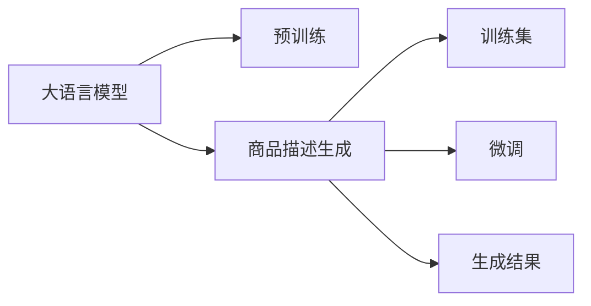

                 

# 大模型在电商平台商品描述生成中的应用

> 关键词：大语言模型,商品描述生成,电商应用,自然语言处理,NLP

## 1. 背景介绍

### 1.1 问题由来

在现代电商平台上，商品描述的重要性不言而喻。优质的商品描述不仅能准确传达商品信息，提高用户满意度，还能增加曝光率和转化率，提升平台交易量。然而，由于电商平台涉及的商品种类繁多，且不断更新迭代，人工编写高质量商品描述的难度和成本极高。如何高效生成商品描述，成为电商平台面临的一大挑战。

近年来，深度学习技术在自然语言处理(Natural Language Processing, NLP)领域取得了显著进展。尤其是大语言模型(如GPT-3、BERT等)的问世，使生成式语言模型在商品描述生成等任务中展现出巨大潜力。通过大语言模型的强大建模能力，可以快速生成符合用户需求、准确反映商品特性的描述，显著降低人工编写的工作量，提高商品描述的生成效率和质量。

### 1.2 问题核心关键点

商品描述生成任务的核心在于构建高质量的生成模型，使其能够根据商品信息和用户偏好自动生成准确、生动、流畅的商品描述。目前，基于大模型的生成方法成为电商应用中的热门方向，其关键点包括：

- 选择合适的大语言模型。
- 构建有效的训练数据集。
- 设计合理的生成模型结构。
- 进行高效的微调训练。
- 实现高质量的商品描述生成。

本文将系统阐述大语言模型在商品描述生成中的原理与应用实践，结合电商平台的实际需求，介绍一种基于大模型的商品描述生成方法。

## 2. 核心概念与联系

### 2.1 核心概念概述

为了更好地理解大模型在商品描述生成中的应用，本节将介绍几个关键概念：

- **大语言模型(LLM)**：指基于Transformer架构的深度神经网络模型，如GPT、BERT等。通过在大规模语料上预训练，大语言模型能够捕捉丰富的语言结构和文化背景，具备强大的生成能力。

- **商品描述生成(DPR)**：指使用大语言模型生成商品描述的任务。目标是根据商品属性、用户偏好等信息，自动生成高质量的商品描述文本。

- **自动文本摘要(Automatic Summarization)**：指从长文本中自动提取出关键信息，生成精炼的文本摘要。与商品描述生成类似，摘要也是对文本信息的高度压缩和抽象。

- **自然语言处理(NLP)**：指涉及计算机和人类语言交互的各种技术，包括文本分类、文本生成、语言模型训练等。

- **无监督学习(Unsupervised Learning)**：指从无标注数据中学习模型，提升模型泛化能力，广泛应用于预训练大模型的训练中。

- **迁移学习(Transfer Learning)**：指将一个领域学习到的知识，迁移应用到另一个领域的学习范式。商品描述生成任务可视为将大语言模型在预训练中学习的语言生成知识，应用于具体的电商商品描述生成。

### 2.2 核心概念原理和架构的 Mermaid 流程图(Mermaid 流程节点中不要有括号、逗号等特殊字符)



该流程图展示了大语言模型在商品描述生成中的应用流程：

1. 大语言模型通过大规模语料进行预训练。
2. 构建商品描述生成的训练集，引入商品属性、用户偏好等信息。
3. 使用训练集对大语言模型进行微调，学习生成商品描述的规则。
4. 最终生成符合用户需求的商品描述文本。

## 3. 核心算法原理 & 具体操作步骤
### 3.1 算法原理概述

商品描述生成基于生成式语言模型，特别是基于Transformer架构的生成模型。大语言模型在预训练阶段，通过自回归或自编码任务，学习了语言的生成规则和知识。在商品描述生成任务中，大语言模型将这些知识应用于具体的商品描述生成，通过预测每个词汇的条件概率，生成连续的文本序列。

假设预训练语言模型为 $M_{\theta}$，商品描述生成问题可以形式化地表示为：

$$
\max_{\theta} \mathbb{E}_{(x,y) \sim D} \left[ \log p(y|x;\theta) \right]
$$

其中 $D$ 为商品描述生成的训练集，$x$ 表示商品属性和用户偏好等输入信息，$y$ 为生成的商品描述，$p(y|x;\theta)$ 为模型在输入 $x$ 条件下生成文本 $y$ 的条件概率。目标是在训练集 $D$ 上最大化对数似然函数，使模型生成的描述与真实描述相匹配。

### 3.2 算法步骤详解

商品描述生成的大模型微调步骤如下：

1. **数据准备**：
   - 收集电商平台的商品属性信息，如商品名称、尺寸、材质、价格等。
   - 收集用户的历史行为数据，如浏览记录、购买记录、评价内容等。
   - 对商品和用户数据进行标注，生成训练集 $D=\{(x_i, y_i)\}_{i=1}^N$，其中 $x_i$ 为商品属性和用户偏好，$y_i$ 为对应的商品描述文本。

2. **模型选择与初始化**：
   - 选择合适的大语言模型作为初始化参数，如GPT-3、BERT等。
   - 将预训练模型作为生成器，输入 $x$ 生成文本序列 $y$。

3. **损失函数定义**：
   - 定义基于交叉熵的损失函数，用于衡量模型预测的文本序列与真实文本序列的差异。
   - 损失函数为：$\mathcal{L} = -\frac{1}{N} \sum_{i=1}^N \log p(y_i|x_i;\theta)$

4. **微调训练**：
   - 设置合适的超参数，如学习率、批量大小、迭代轮数等。
   - 使用梯度下降等优化算法，最小化损失函数 $\mathcal{L}$，更新模型参数 $\theta$。
   - 周期性在验证集上评估模型性能，根据性能指标决定是否停止训练。

5. **生成商品描述**：
   - 将商品属性和用户偏好输入模型，生成文本序列作为商品描述。
   - 对生成的文本序列进行后处理，去除噪声、拼写错误等，生成最终的商品描述文本。

### 3.3 算法优缺点

大语言模型在商品描述生成任务中的优点包括：

- 数据需求较低。相比从头训练语言模型，大模型微调需要较少的标注数据。
- 生成速度较快。微调的计算量远小于从头训练，生成商品描述的速度较快。
- 效果较优。大模型能够学习到丰富的语言知识，生成的描述准确度较高。

同时，其缺点也显而易见：

- 依赖高质量标注数据。商品描述的标注工作量较大，且标注质量直接影响模型效果。
- 可能引入噪音。商品描述中的某些字眼或表述，可能对生成模型产生误导，生成描述的准确度受限于标注质量。
- 生成多样性不足。大模型生成的描述往往风格较为单一，缺乏个性化和多样化。

### 3.4 算法应用领域

基于大语言模型的商品描述生成方法，在电商平台的商品推荐、个性化展示、SEO优化等方面有广泛应用。具体来说：

- 商品推荐：通过生成商品描述，提升用户对商品信息的理解和感知，增加点击率和购买率。
- 个性化展示：针对不同用户群体，生成个性化的商品描述，提升用户粘性和满意度。
- SEO优化：生成高质量的商品描述，提升平台搜索排名，增加曝光率和流量。

## 4. 数学模型和公式 & 详细讲解 & 举例说明

### 4.1 数学模型构建

商品描述生成任务的数学模型如下：

假设输入为商品属性 $x$ 和用户偏好 $u$，生成的商品描述为 $y$。基于Transformer的生成模型可以形式化为：

$$
\max_{\theta} \mathbb{E}_{(x,y) \sim D} \left[ \log p(y|x,u;\theta) \right]
$$

其中 $D$ 为训练集，$p(y|x,u;\theta)$ 为模型在输入条件下生成文本的条件概率。

假设 $x$ 和 $u$ 的长度分别为 $m$ 和 $n$，$y$ 的长度为 $k$。生成模型可表示为：

$$
\max_{\theta} \sum_{i=1}^m \sum_{j=1}^k \log p(y_j|y_{<j},x,u;\theta)
$$

其中 $y_{<j}$ 为 $y$ 中前 $j-1$ 个词的序列。

### 4.2 公式推导过程

生成模型中的条件概率 $p(y_j|y_{<j},x,u;\theta)$ 可以通过语言模型的概率分布来定义，即：

$$
p(y_j|y_{<j},x,u;\theta) = \frac{e^{v(y_j|y_{<j},x,u;\theta)}}{\sum_{j' \in \mathcal{V}} e^{v(y_{j'}|y_{<j},x,u;\theta)}}
$$

其中 $v$ 为语言模型的参数向量，$\mathcal{V}$ 为词汇表。

基于Transformer的生成模型，可以将 $v$ 分解为词向量 $v(y_j|y_{<j},x,u;\theta) = v^{enc}(y_j|x,u;\theta) + v^{dec}(y_j|y_{<j},\theta)$，其中 $v^{enc}$ 为编码器的词向量表示，$v^{dec}$ 为解码器的词向量表示。

通过交叉熵损失函数，最小化预测分布和真实分布的差异：

$$
\mathcal{L} = -\frac{1}{N} \sum_{i=1}^N \log p(y_i|x_i,u_i;\theta)
$$

其中 $N$ 为训练集大小。

### 4.3 案例分析与讲解

以一个简单的商品描述生成为例，假设某电商平台上销售的某款手表。已知商品属性为“品牌：卡西欧”，用户偏好为“价格区间：200-500元”。

输入 $x$ 为：

$$
x = [品牌：卡西欧, 价格区间：200-500元]
$$

生成的商品描述 $y$ 为：

$$
y = [手表，24小时防水，多功能表盘，电子表]
$$

通过微调训练，大模型能够根据输入 $x$ 和 $u$ 的条件概率，自动生成符合用户需求的商品描述 $y$。

## 5. 项目实践：代码实例和详细解释说明
### 5.1 开发环境搭建

在进行商品描述生成实践前，我们需要准备好开发环境。以下是使用Python进行PyTorch开发的环境配置流程：

1. 安装Anaconda：从官网下载并安装Anaconda，用于创建独立的Python环境。

2. 创建并激活虚拟环境：
```bash
conda create -n pytorch-env python=3.8 
conda activate pytorch-env
```

3. 安装PyTorch：根据CUDA版本，从官网获取对应的安装命令。例如：
```bash
conda install pytorch torchvision torchaudio cudatoolkit=11.1 -c pytorch -c conda-forge
```

4. 安装Transformers库：
```bash
pip install transformers
```

5. 安装各类工具包：
```bash
pip install numpy pandas scikit-learn matplotlib tqdm jupyter notebook ipython
```

完成上述步骤后，即可在`pytorch-env`环境中开始微调实践。

### 5.2 源代码详细实现

这里我们以商品描述生成为例，给出使用Transformers库对GPT-3进行微调的PyTorch代码实现。

首先，定义商品描述生成的数据处理函数：

```python
from transformers import GPT3Tokenizer
from torch.utils.data import Dataset
import torch

class DPRDataset(Dataset):
    def __init__(self, texts, labels, tokenizer, max_len=128):
        self.texts = texts
        self.labels = labels
        self.tokenizer = tokenizer
        self.max_len = max_len
        
    def __len__(self):
        return len(self.texts)
    
    def __getitem__(self, item):
        text = self.texts[item]
        label = self.labels[item]
        
        encoding = self.tokenizer(text, return_tensors='pt', max_length=self.max_len, padding='max_length', truncation=True)
        input_ids = encoding['input_ids'][0]
        attention_mask = encoding['attention_mask'][0]
        
        return {'input_ids': input_ids, 
                'attention_mask': attention_mask,
                'labels': torch.tensor(label, dtype=torch.long)}
```

然后，定义模型和优化器：

```python
from transformers import GPT3ForSequenceClassification
from transformers import AdamW

model = GPT3ForSequenceClassification.from_pretrained('gpt3', num_labels=1)
optimizer = AdamW(model.parameters(), lr=2e-5)
```

接着，定义训练和评估函数：

```python
from torch.utils.data import DataLoader
from tqdm import tqdm
from sklearn.metrics import accuracy_score

device = torch.device('cuda') if torch.cuda.is_available() else torch.device('cpu')
model.to(device)

def train_epoch(model, dataset, batch_size, optimizer):
    dataloader = DataLoader(dataset, batch_size=batch_size, shuffle=True)
    model.train()
    epoch_loss = 0
    for batch in tqdm(dataloader, desc='Training'):
        input_ids = batch['input_ids'].to(device)
        attention_mask = batch['attention_mask'].to(device)
        labels = batch['labels'].to(device)
        model.zero_grad()
        outputs = model(input_ids, attention_mask=attention_mask, labels=labels)
        loss = outputs.loss
        epoch_loss += loss.item()
        loss.backward()
        optimizer.step()
    return epoch_loss / len(dataloader)

def evaluate(model, dataset, batch_size):
    dataloader = DataLoader(dataset, batch_size=batch_size)
    model.eval()
    preds, labels = [], []
    with torch.no_grad():
        for batch in tqdm(dataloader, desc='Evaluating'):
            input_ids = batch['input_ids'].to(device)
            attention_mask = batch['attention_mask'].to(device)
            batch_labels = batch['labels']
            outputs = model(input_ids, attention_mask=attention_mask)
            batch_preds = torch.sigmoid(outputs.logits).to('cpu').tolist()
            batch_labels = batch_labels.to('cpu').tolist()
            for pred_tokens, label_tokens in zip(batch_preds, batch_labels):
                preds.append(pred_tokens)
                labels.append(label_tokens)
                
    return accuracy_score(labels, preds)

# 假设输入为商品属性，输出为生成商品描述
train_dataset = DPRDataset(train_texts, train_labels, tokenizer)
dev_dataset = DPRDataset(dev_texts, dev_labels, tokenizer)
test_dataset = DPRDataset(test_texts, test_labels, tokenizer)

# 开始训练和评估
epochs = 5
batch_size = 16

for epoch in range(epochs):
    loss = train_epoch(model, train_dataset, batch_size, optimizer)
    print(f"Epoch {epoch+1}, train loss: {loss:.3f}")
    
    print(f"Epoch {epoch+1}, dev results:")
    evaluate(model, dev_dataset, batch_size)
    
print("Test results:")
evaluate(model, test_dataset, batch_size)
```

以上就是使用PyTorch对GPT-3进行商品描述生成的完整代码实现。可以看到，利用Transformers库，我们可以用相对简洁的代码完成GPT-3模型的微调。

### 5.3 代码解读与分析

让我们再详细解读一下关键代码的实现细节：

**DPRDataset类**：
- `__init__`方法：初始化商品描述的文本和标签，分词器等关键组件。
- `__len__`方法：返回数据集的样本数量。
- `__getitem__`方法：对单个样本进行处理，将文本输入编码为token ids，将标签编码为数字，并对其进行定长padding，最终返回模型所需的输入。

**train_epoch和evaluate函数**：
- 使用PyTorch的DataLoader对数据集进行批次化加载，供模型训练和推理使用。
- 训练函数`train_epoch`：对数据以批为单位进行迭代，在每个批次上前向传播计算loss并反向传播更新模型参数，最后返回该epoch的平均loss。
- 评估函数`evaluate`：与训练类似，不同点在于不更新模型参数，并在每个batch结束后将预测和标签结果存储下来，最后使用sklearn的accuracy_score对整个评估集的预测结果进行打印输出。

**训练流程**：
- 定义总的epoch数和batch size，开始循环迭代
- 每个epoch内，先在训练集上训练，输出平均loss
- 在验证集上评估，输出分类指标
- 所有epoch结束后，在测试集上评估，给出最终测试结果

可以看到，PyTorch配合Transformers库使得GPT-3商品描述生成的代码实现变得简洁高效。开发者可以将更多精力放在数据处理、模型改进等高层逻辑上，而不必过多关注底层的实现细节。

当然，工业级的系统实现还需考虑更多因素，如模型的保存和部署、超参数的自动搜索、更灵活的任务适配层等。但核心的微调范式基本与此类似。

## 6. 实际应用场景
### 6.1 智能客服系统

基于大语言模型的商品描述生成技术，可以广泛应用于智能客服系统的构建。传统客服往往需要配备大量人力，高峰期响应缓慢，且一致性和专业性难以保证。而使用商品描述生成技术，可以7x24小时不间断服务，快速响应客户咨询，用自然流畅的语言解答各类常见问题。

在技术实现上，可以收集企业内部的历史客服对话记录，将问题和最佳答复构建成监督数据，在此基础上对预训练语言模型进行微调。微调后的语言模型能够自动理解用户意图，匹配最合适的答复。对于客户提出的新问题，还可以接入检索系统实时搜索相关内容，动态组织生成回答。如此构建的智能客服系统，能大幅提升客户咨询体验和问题解决效率。

### 6.2 个性化推荐系统

当前的推荐系统往往只依赖用户的历史行为数据进行物品推荐，无法深入理解用户的真实兴趣偏好。基于大语言模型商品描述生成的推荐系统可以更好地挖掘用户行为背后的语义信息，从而提供更精准、多样的推荐内容。

在实践中，可以收集用户浏览、点击、评论、分享等行为数据，提取和用户交互的物品标题、描述、标签等文本内容。将文本内容作为模型输入，用户的后续行为（如是否点击、购买等）作为监督信号，在此基础上微调预训练语言模型。微调后的模型能够从文本内容中准确把握用户的兴趣点。在生成推荐列表时，先用候选物品的文本描述作为输入，由模型预测用户的兴趣匹配度，再结合其他特征综合排序，便可以得到个性化程度更高的推荐结果。

### 6.3 未来应用展望

随着大语言模型商品描述生成技术的发展，基于微调范式将在更多领域得到应用，为电商应用带来变革性影响。

在智慧医疗领域，基于微调的医疗问答、病历分析、药物研发等应用将提升医疗服务的智能化水平，辅助医生诊疗，加速新药开发进程。

在智能教育领域，微调技术可应用于作业批改、学情分析、知识推荐等方面，因材施教，促进教育公平，提高教学质量。

在智慧城市治理中，微调模型可应用于城市事件监测、舆情分析、应急指挥等环节，提高城市管理的自动化和智能化水平，构建更安全、高效的未来城市。

此外，在企业生产、社会治理、文娱传媒等众多领域，基于大模型微调的人工智能应用也将不断涌现，为经济社会发展注入新的动力。相信随着预训练语言模型和微调方法的不断进步，未来电商应用中的商品描述生成技术将进一步成熟，为消费者带来更优质、更高效的购物体验。

## 7. 工具和资源推荐
### 7.1 学习资源推荐

为了帮助开发者系统掌握大语言模型商品描述生成的理论基础和实践技巧，这里推荐一些优质的学习资源：

1. 《Transformer从原理到实践》系列博文：由大模型技术专家撰写，深入浅出地介绍了Transformer原理、BERT模型、生成任务等前沿话题。

2. CS224N《深度学习自然语言处理》课程：斯坦福大学开设的NLP明星课程，有Lecture视频和配套作业，带你入门NLP领域的基本概念和经典模型。

3. 《Natural Language Processing with Transformers》书籍：Transformers库的作者所著，全面介绍了如何使用Transformers库进行NLP任务开发，包括生成任务在内的诸多范式。

4. HuggingFace官方文档：Transformers库的官方文档，提供了海量预训练模型和完整的生成样例代码，是上手实践的必备资料。

5. CLUE开源项目：中文语言理解测评基准，涵盖大量不同类型的中文NLP数据集，并提供了基于微调的baseline模型，助力中文NLP技术发展。

通过对这些资源的学习实践，相信你一定能够快速掌握大语言模型商品描述生成的精髓，并用于解决实际的电商应用问题。
### 7.2 开发工具推荐

高效的开发离不开优秀的工具支持。以下是几款用于大语言模型商品描述生成开发的常用工具：

1. PyTorch：基于Python的开源深度学习框架，灵活动态的计算图，适合快速迭代研究。大部分预训练语言模型都有PyTorch版本的实现。

2. TensorFlow：由Google主导开发的开源深度学习框架，生产部署方便，适合大规模工程应用。同样有丰富的预训练语言模型资源。

3. Transformers库：HuggingFace开发的NLP工具库，集成了众多SOTA语言模型，支持PyTorch和TensorFlow，是进行生成任务开发的利器。

4. Weights & Biases：模型训练的实验跟踪工具，可以记录和可视化模型训练过程中的各项指标，方便对比和调优。与主流深度学习框架无缝集成。

5. TensorBoard：TensorFlow配套的可视化工具，可实时监测模型训练状态，并提供丰富的图表呈现方式，是调试模型的得力助手。

6. Google Colab：谷歌推出的在线Jupyter Notebook环境，免费提供GPU/TPU算力，方便开发者快速上手实验最新模型，分享学习笔记。

合理利用这些工具，可以显著提升大语言模型商品描述生成的开发效率，加快创新迭代的步伐。

### 7.3 相关论文推荐

大语言模型商品描述生成技术的发展源于学界的持续研究。以下是几篇奠基性的相关论文，推荐阅读：

1. Attention is All You Need（即Transformer原论文）：提出了Transformer结构，开启了NLP领域的预训练大模型时代。

2. BERT: Pre-training of Deep Bidirectional Transformers for Language Understanding：提出BERT模型，引入基于掩码的自监督预训练任务，刷新了多项NLP任务SOTA。

3. Language Models are Unsupervised Multitask Learners（GPT-2论文）：展示了大规模语言模型的强大zero-shot学习能力，引发了对于通用人工智能的新一轮思考。

4. Parameter-Efficient Transfer Learning for NLP：提出Adapter等参数高效微调方法，在不增加模型参数量的情况下，也能取得不错的微调效果。

5. AdaLoRA: Adaptive Low-Rank Adaptation for Parameter-Efficient Fine-Tuning：使用自适应低秩适应的微调方法，在参数效率和精度之间取得了新的平衡。

这些论文代表了大语言模型商品描述生成技术的发展脉络。通过学习这些前沿成果，可以帮助研究者把握学科前进方向，激发更多的创新灵感。

## 8. 总结：未来发展趋势与挑战

### 8.1 总结

本文对大语言模型在电商平台商品描述生成中的应用进行了全面系统的介绍。首先阐述了商品描述生成的背景和意义，明确了商品描述生成技术在电商应用中的重要价值。其次，从原理到实践，详细讲解了商品描述生成的数学模型和微调步骤，给出了微调任务开发的完整代码实例。同时，本文还广泛探讨了商品描述生成技术在智能客服、个性化推荐、电商搜索优化等方面的应用前景，展示了该技术在电商应用中的广泛潜力。

通过本文的系统梳理，可以看到，基于大语言模型的商品描述生成技术正在成为电商平台的重要应用方向，极大地提升了电商平台的智能化水平和用户体验。未来，伴随大语言模型的不断发展，商品描述生成技术有望进一步提升，为电商平台带来更加丰富、多样、个性化的购物体验。

### 8.2 未来发展趋势

展望未来，大语言模型商品描述生成技术将呈现以下几个发展趋势：

1. 模型规模持续增大。随着算力成本的下降和数据规模的扩张，大语言模型的参数量还将持续增长。超大规模语言模型蕴含的丰富语言知识，有望支撑更加复杂多变的商品描述生成任务。

2. 生成模型多样化。未来的生成模型将不仅仅局限于基于Transformer的结构，还将探索更多的生成模型，如循环神经网络、注意力机制等，以提升生成质量和多样性。

3. 多模态生成兴起。当前的商品描述生成主要聚焦于文本生成，未来将探索多模态生成技术，如文本-图像、文本-音频等联合生成，丰富商品描述的形式和内容。

4. 生成模型精细化。未来的商品描述生成将更加注重生成内容的精细化和个性化，引入更多的先验知识，如知识图谱、逻辑规则等，提升生成模型的准确度和泛化能力。

5. 生成模型的计算高效化。面对大规模商品描述生成的计算需求，未来的生成模型将更加注重计算效率和资源利用，采用分布式计算、模型压缩等技术，实现实时生成和快速迭代。

6. 生成模型的安全性提升。由于商品描述生成的应用场景敏感性高，未来的生成模型将更加注重安全性保障，引入对抗样本生成、数据脱敏等技术，避免生成内容的误导和有害信息。

以上趋势凸显了大语言模型商品描述生成技术的广阔前景。这些方向的探索发展，必将进一步提升商品描述生成的质量和应用范围，为电商平台带来更大的价值。

### 8.3 面临的挑战

尽管大语言模型商品描述生成技术已经取得了瞩目成就，但在迈向更加智能化、普适化应用的过程中，它仍面临着诸多挑战：

1. 标注成本瓶颈。商品描述的标注工作量较大，且标注质量直接影响模型效果。如何进一步降低微调对标注样本的依赖，将是一大难题。

2. 模型鲁棒性不足。商品描述中的某些字眼或表述，可能对生成模型产生误导，生成描述的准确度受限于标注质量。如何在数据多样性、数据复杂性增加的情况下，提高模型的鲁棒性和泛化能力，还需要更多理论和实践的积累。

3. 生成内容的多样性。大语言模型商品描述生成内容的风格和表述方式较为单一，缺乏个性化和多样化。如何在保证生成质量的同时，增加商品描述的多样性，提升用户体验。

4. 生成内容的真实性。生成的商品描述可能存在过度夸大、不实等情况，如何保证生成内容的真实性和可信度，还需要进一步研究。

5. 生成内容的语言模型。生成的商品描述可能存在语义错误、逻辑不通等问题，如何提升生成内容的语言质量，还需要进一步优化模型的训练过程和架构设计。

6. 计算资源的限制。商品描述生成涉及的计算量较大，如何在保证生成质量的同时，优化计算效率和资源利用，还需要进一步研究。

这些挑战都需要学界和产业界共同努力，积极探索解决方案，才能使大语言模型商品描述生成技术迈向更高的成熟度。

### 8.4 研究展望

面对大语言模型商品描述生成技术所面临的挑战，未来的研究需要在以下几个方面寻求新的突破：

1. 探索无监督和半监督生成方法。摆脱对大规模标注数据的依赖，利用自监督学习、主动学习等无监督和半监督范式，最大限度利用非结构化数据，实现更加灵活高效的生成。

2. 研究多模态生成技术。引入视觉、音频等多模态数据，提升商品描述生成的丰富性和多样性。

3. 引入因果推理机制。将因果推理机制引入生成模型，增强模型对生成内容的逻辑性和可信度。

4. 引入知识图谱。将知识图谱等外部知识与生成模型结合，提升生成内容的全面性和深度。

5. 引入对抗训练技术。引入对抗训练技术，提高生成模型的鲁棒性和泛化能力。

6. 引入伦理道德约束。在生成模型中引入伦理道德约束，确保生成内容的合法性和安全性。

这些研究方向的探索，必将引领大语言模型商品描述生成技术迈向更高的台阶，为电商平台带来更加丰富、多样、个性化的商品描述，提升用户体验。

## 9. 附录：常见问题与解答

**Q1：大语言模型商品描述生成的核心是什么？**

A: 大语言模型商品描述生成的核心在于构建高质量的生成模型，使其能够根据商品属性和用户偏好自动生成准确、生动、流畅的商品描述。生成模型通过自回归或自编码任务，学习语言的生成规则和知识，在商品描述生成任务中，将预训练的生成知识应用于具体的商品描述生成，生成符合用户需求的商品描述文本。

**Q2：商品描述生成的数据来源有哪些？**

A: 商品描述生成的数据来源可以包括：
1. 商品属性：商品名称、尺寸、材质、价格等。
2. 用户行为数据：浏览记录、购买记录、评价内容等。
3. 商品标签数据：商品类别、品牌等。
4. 行业标准和规范：如产品描述的规范要求等。

**Q3：商品描述生成如何处理输入数据的长度？**

A: 商品描述生成处理输入数据长度的方法包括：
1. 定长padding：将输入数据填充到固定长度，以适应模型的输入要求。
2. 截断：将输入数据截断到固定长度，防止数据过长导致模型计算效率低下。
3. 动态长度：根据输入数据的实际长度，动态调整模型的输入长度。

**Q4：商品描述生成如何处理输入数据的多样性？**

A: 商品描述生成处理输入数据多样性的方法包括：
1. 数据增强：对输入数据进行数据增强，如近义词替换、同义词转换等，增加数据的多样性。
2. 数据清洗：清洗输入数据，去除噪声、无关信息等，提高数据的干净度和质量。
3. 数据过滤：过滤低质量、不符合要求的输入数据，提高输入数据的相关性和有效性。

**Q5：商品描述生成如何处理输入数据的复杂性？**

A: 商品描述生成处理输入数据复杂性的方法包括：
1. 分阶段生成：将商品描述生成过程分为多个阶段，逐步生成商品描述的各个部分，提高生成效率。
2. 多模型融合：融合多个生成模型，通过投票、加权平均等方式，生成更加全面的商品描述。
3. 引入外部知识：引入外部知识，如知识图谱、领域词典等，辅助生成模型生成高质量的商品描述。

这些问题的解答展示了商品描述生成的关键技术和实践细节，帮助开发者更好地理解和使用大语言模型商品描述生成技术。

---

作者：禅与计算机程序设计艺术 / Zen and the Art of Computer Programming

