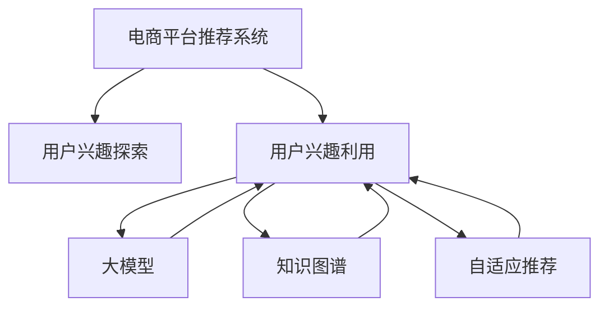

                 

# 大模型在电商平台用户兴趣探索与利用平衡中的应用

> 关键词：电商平台,用户兴趣探索,利用平衡,大模型,自适应推荐,知识图谱,深度学习

## 1. 背景介绍

### 1.1 问题由来
随着互联网电商市场的快速发展和竞争加剧，各大电商平台纷纷将数据驱动的个性化推荐作为核心竞争力。以推荐系统为例，其基本流程包括用户兴趣探索和利用两个关键环节。通过用户兴趣的精准获取和高效利用，可以有效提升用户满意度、增加平台转化率和复购率，从而获得更大的商业价值。

然而，用户在电商平台上的行为数据往往非常复杂多变，难以简单地通过统计方法建模。为此，各大电商平台开始尝试引入先进的大模型技术，期望通过预训练模型对用户行为进行深度学习，从而在复杂数据下更好地完成用户兴趣的探索与利用。

### 1.2 问题核心关键点
大模型在电商平台的实际应用，主要体现在以下几个方面：

- **用户兴趣探索**：通过对用户行为数据的预训练模型进行微调，学习用户的行为模式和偏好，从而提取出用户的潜在兴趣。
- **用户兴趣利用**：基于提取出的用户兴趣，对电商平台中的商品进行精确定位和推荐，提高用户满意度和平台收益。
- **兴趣探索与利用的平衡**：在电商平台中，需要平衡兴趣探索的深度和广度，既要全面覆盖用户兴趣，又不能造成用户疲劳，影响后续行为。
- **模型效果评估**：需要对模型推荐效果进行科学的评估，保证模型输出的商品与用户兴趣高度相关，同时也需要衡量模型对平台的商业价值提升。

本文旨在详细介绍如何利用大模型技术在电商平台中实现用户兴趣的探索与利用，并探讨如何在大模型中平衡这两个环节，实现综合效果最优。

## 2. 核心概念与联系

### 2.1 核心概念概述

为更好地理解大模型在电商平台中的应用，本节将介绍几个核心概念：

- **电商平台推荐系统**：利用用户行为数据和商品属性数据，通过推荐算法对用户进行精准推荐，提高用户满意度和平台转化率的系统。

- **用户兴趣探索**：通过分析和挖掘用户行为数据，提取出用户的兴趣点，为个性化推荐提供依据。

- **用户兴趣利用**：根据用户兴趣点，通过算法模型对商品进行排序和推荐，使用户能够快速找到满足自己需求的商品。

- **大模型**：以深度学习模型（如BERT、GPT等）为基础，通过大规模语料预训练得到的通用模型，具备强大的语言理解和生成能力，可以用于复杂的数据建模和推理。

- **知识图谱**：将电商平台中的商品、用户、评价等实体和它们之间的关系表示为图结构，用于提升推荐的准确性和解释性。

- **自适应推荐**：根据用户的实时反馈和行为变化，动态调整推荐策略，提高推荐的实时性和准确性。

这些核心概念之间的逻辑关系可以通过以下Mermaid流程图来展示：



这个流程图展示了大模型在电商平台中的应用场景：

1. 电商平台通过用户行为数据和商品属性数据，启动推荐系统。
2. 推荐系统启动用户兴趣探索，利用大模型和知识图谱对用户行为进行建模，提取用户兴趣。
3. 基于用户兴趣，推荐系统启动用户兴趣利用，对商品进行排序推荐。
4. 在推荐过程中，引入自适应推荐策略，实时调整推荐内容，提升用户体验。

## 3. 核心算法原理 & 具体操作步骤

### 3.1 算法原理概述

基于大模型的电商平台推荐系统，主要利用深度学习模型的预训练和微调技术，对用户行为进行建模和预测。具体算法流程如下：

1. **数据准备**：收集电商平台的用户行为数据和商品属性数据，准备作为模型输入。
2. **模型预训练**：利用大规模无标签数据对大模型进行预训练，学习通用的语言和知识表示。
3. **任务适配**：针对电商平台的推荐任务，在大模型上进行微调，使其学习到与电商相关的特定知识。
4. **用户兴趣探索**：利用微调后的模型对用户行为数据进行推理，提取出用户的兴趣点。
5. **商品推荐**：根据用户兴趣点，对商品进行排序推荐。
6. **推荐效果评估**：对推荐效果进行评估，根据评估结果不断优化模型。

### 3.2 算法步骤详解

#### 3.2.1 数据准备

数据准备是推荐系统的重要步骤，包括以下几个关键点：

- **用户行为数据**：收集用户在电商平台上的浏览、点击、购买等行为数据，形成用户行为矩阵。
- **商品属性数据**：收集商品的分类、价格、评论等属性信息，形成商品属性矩阵。
- **用户画像数据**：收集用户的个人信息和历史行为，形成用户画像数据。

#### 3.2.2 模型预训练

模型预训练是利用大模型进行电商推荐的基础，主要分为以下步骤：

- **选择预训练模型**：选择合适的深度学习模型（如BERT、GPT等）作为预训练的初始化参数。
- **准备预训练数据**：收集大规模无标签文本数据，作为模型的预训练语料。
- **预训练任务**：定义预训练任务，如掩码语言模型、掩码实体识别等，在大模型上进行预训练。

#### 3.2.3 任务适配

任务适配是利用大模型进行电商推荐的核心环节，主要分为以下步骤：

- **任务定义**：根据电商推荐任务的特点，定义任务的具体目标，如点击率预测、转化率预测等。
- **模型微调**：在大模型的基础上，针对电商推荐任务进行微调，学习电商相关的特定知识。
- **模型评估**：在验证集上对微调后的模型进行评估，选择最优模型。

#### 3.2.4 用户兴趣探索

用户兴趣探索主要通过微调后的模型对用户行为数据进行推理，提取出用户的兴趣点。主要分为以下步骤：

- **行为数据编码**：将用户行为数据进行编码，形成模型输入。
- **兴趣推理**：利用微调后的模型对行为数据进行推理，提取用户兴趣点。
- **兴趣融合**：将用户的多个兴趣点进行融合，形成用户的整体兴趣。

#### 3.2.5 商品推荐

商品推荐主要通过模型对商品进行排序，推荐符合用户兴趣的商品。主要分为以下步骤：

- **商品编码**：将商品属性数据进行编码，形成模型输入。
- **商品匹配**：利用微调后的模型对商品进行匹配，计算商品与用户兴趣的匹配度。
- **推荐排序**：对匹配度进行排序，选择高匹配度的商品进行推荐。

#### 3.2.6 推荐效果评估

推荐效果评估是衡量电商平台推荐系统性能的重要环节，主要分为以下步骤：

- **评价指标**：选择合适的评价指标，如准确率、召回率、F1-score等。
- **数据划分**：将用户行为数据划分为训练集、验证集和测试集。
- **模型评估**：在测试集上对推荐系统进行评估，输出评价指标。
- **效果优化**：根据评估结果，不断优化模型，提升推荐效果。

### 3.3 算法优缺点

#### 3.3.1 优点

基于大模型的电商平台推荐系统具有以下优点：

1. **通用性强**：大模型可以在大规模语料上进行预训练，学习通用的语言和知识表示，适用于多种电商任务。
2. **鲁棒性高**：大模型通过自适应推荐和实时学习，能够适应用户行为的快速变化，提升推荐效果。
3. **推荐效果高**：大模型通过多层次的特征提取和深度学习，能够捕捉到复杂的用户和商品关系，提高推荐的准确性和个性化程度。
4. **解释性强**：大模型通过生成式建模，能够对推荐过程进行解释，提高用户的信任度和满意度。

#### 3.3.2 缺点

基于大模型的电商平台推荐系统也存在以下缺点：

1. **计算成本高**：大模型需要消耗大量的计算资源进行训练和推理，对硬件要求较高。
2. **数据隐私问题**：电商平台需要对用户行为数据进行建模，可能涉及用户隐私问题。
3. **模型复杂性高**：大模型的结构复杂，难以进行人工解释和调试，调试难度较大。
4. **过度拟合风险**：大模型可能过度拟合特定数据集，导致泛化性能不足。

### 3.4 算法应用领域

基于大模型的电商平台推荐系统已经在多个领域得到应用，例如：

- **商品推荐**：根据用户历史行为和兴趣，对商品进行排序推荐，提高用户满意度和平台收益。
- **广告推荐**：根据用户兴趣和行为，对广告进行精准投放，提高广告效果和平台收益。
- **价格优化**：通过用户行为数据，预测商品的市场需求和价格变化趋势，帮助商家优化定价策略。
- **库存管理**：通过用户行为数据，预测商品的市场需求，帮助商家优化库存管理，降低库存成本。
- **用户流失预测**：通过用户行为数据，预测用户流失风险，帮助商家提升用户留存率。

除了上述这些经典应用外，大模型还被创新性地应用于更多场景中，如个性化搜索、内容推荐、品牌推荐等，为电商平台提供了更加精准的推荐服务。

## 4. 数学模型和公式 & 详细讲解

### 4.1 数学模型构建

假设电商平台有用户集合 $U$ 和商品集合 $I$，用户行为数据表示为 $D=\{(x_i, y_i)\}_{i=1}^N$，其中 $x_i$ 表示用户行为，$y_i$ 表示用户兴趣。平台对每个用户 $u$ 进行商品推荐 $i$，表示为 $r_{ui}$。

定义推荐模型的目标函数为：

$$
\mathcal{L}(r_{ui}, y_i) = -\log P(r_{ui} = y_i | x_i)
$$

其中 $P(r_{ui} = y_i | x_i)$ 为推荐模型在输入 $x_i$ 下推荐商品 $y_i$ 的概率。

### 4.2 公式推导过程

下面，我们将对推荐模型的目标函数进行详细推导：

- **点击率预测**：假设平台希望预测用户是否会对商品产生点击行为，目标函数可以定义为：

$$
\mathcal{L}(r_{ui}, y_i) = -\log P(r_{ui} = 1 | x_i)
$$

- **转化率预测**：假设平台希望预测用户是否会对商品产生购买行为，目标函数可以定义为：

$$
\mathcal{L}(r_{ui}, y_i) = -\log P(r_{ui} = 1 | x_i)
$$

- **用户兴趣探索**：假设平台希望探索用户的兴趣点，目标函数可以定义为：

$$
\mathcal{L}(r_{ui}, y_i) = -\log P(y_i | x_i)
$$

### 4.3 案例分析与讲解

假设平台收集到用户 $u$ 的行为数据 $x_i$，使用大模型进行用户兴趣探索，预测用户对商品 $i$ 的兴趣点 $y_i$。目标函数为：

$$
\mathcal{L}(r_{ui}, y_i) = -\log P(y_i | x_i)
$$

具体实现步骤如下：

1. **数据编码**：将用户行为数据 $x_i$ 进行编码，形成模型输入。
2. **模型推理**：利用微调后的模型对用户行为数据 $x_i$ 进行推理，提取用户兴趣点 $y_i$。
3. **兴趣融合**：将用户多个兴趣点进行融合，形成用户的整体兴趣。
4. **推荐排序**：对商品 $i$ 与用户兴趣点 $y_i$ 进行匹配，计算匹配度 $P(y_i | x_i)$。
5. **推荐生成**：根据匹配度 $P(y_i | x_i)$，对商品进行排序推荐。

## 5. 项目实践：代码实例和详细解释说明

### 5.1 开发环境搭建

在进行推荐系统开发前，我们需要准备好开发环境。以下是使用Python进行PyTorch开发的环境配置流程：

1. 安装Anaconda：从官网下载并安装Anaconda，用于创建独立的Python环境。

2. 创建并激活虚拟环境：
```bash
conda create -n pytorch-env python=3.8 
conda activate pytorch-env
```

3. 安装PyTorch：根据CUDA版本，从官网获取对应的安装命令。例如：
```bash
conda install pytorch torchvision torchaudio cudatoolkit=11.1 -c pytorch -c conda-forge
```

4. 安装Transformers库：
```bash
pip install transformers
```

5. 安装各类工具包：
```bash
pip install numpy pandas scikit-learn matplotlib tqdm jupyter notebook ipython
```

完成上述步骤后，即可在`pytorch-env`环境中开始推荐系统开发。

### 5.2 源代码详细实现

下面我们以商品推荐任务为例，给出使用Transformers库对BERT模型进行微调的PyTorch代码实现。

首先，定义商品推荐任务的数据处理函数：

```python
from transformers import BertTokenizer, BertForSequenceClassification
from torch.utils.data import Dataset
import torch

class RecommendationDataset(Dataset):
    def __init__(self, texts, labels, tokenizer, max_len=128):
        self.texts = texts
        self.labels = labels
        self.tokenizer = tokenizer
        self.max_len = max_len
        
    def __len__(self):
        return len(self.texts)
    
    def __getitem__(self, item):
        text = self.texts[item]
        label = self.labels[item]
        
        encoding = self.tokenizer(text, return_tensors='pt', max_length=self.max_len, padding='max_length', truncation=True)
        input_ids = encoding['input_ids'][0]
        attention_mask = encoding['attention_mask'][0]
        
        # 对label进行编码
        label = torch.tensor(label, dtype=torch.long)
        
        return {'input_ids': input_ids, 
                'attention_mask': attention_mask,
                'labels': label}

# 选择标签和数字标签的映射
label2id = {0: 'not clicked', 1: 'clicked'}
id2label = {v: k for k, v in label2id.items()}

# 创建dataset
tokenizer = BertTokenizer.from_pretrained('bert-base-cased')

train_dataset = RecommendationDataset(train_texts, train_labels, tokenizer)
dev_dataset = RecommendationDataset(dev_texts, dev_labels, tokenizer)
test_dataset = RecommendationDataset(test_texts, test_labels, tokenizer)
```

然后，定义模型和优化器：

```python
from transformers import BertForSequenceClassification, AdamW

model = BertForSequenceClassification.from_pretrained('bert-base-cased', num_labels=len(label2id))

optimizer = AdamW(model.parameters(), lr=2e-5)
```

接着，定义训练和评估函数：

```python
from torch.utils.data import DataLoader
from tqdm import tqdm
from sklearn.metrics import classification_report

device = torch.device('cuda') if torch.cuda.is_available() else torch.device('cpu')
model.to(device)

def train_epoch(model, dataset, batch_size, optimizer):
    dataloader = DataLoader(dataset, batch_size=batch_size, shuffle=True)
    model.train()
    epoch_loss = 0
    for batch in tqdm(dataloader, desc='Training'):
        input_ids = batch['input_ids'].to(device)
        attention_mask = batch['attention_mask'].to(device)
        labels = batch['labels'].to(device)
        model.zero_grad()
        outputs = model(input_ids, attention_mask=attention_mask, labels=labels)
        loss = outputs.loss
        epoch_loss += loss.item()
        loss.backward()
        optimizer.step()
    return epoch_loss / len(dataloader)

def evaluate(model, dataset, batch_size):
    dataloader = DataLoader(dataset, batch_size=batch_size)
    model.eval()
    preds, labels = [], []
    with torch.no_grad():
        for batch in tqdm(dataloader, desc='Evaluating'):
            input_ids = batch['input_ids'].to(device)
            attention_mask = batch['attention_mask'].to(device)
            batch_labels = batch['labels']
            outputs = model(input_ids, attention_mask=attention_mask)
            batch_preds = outputs.logits.argmax(dim=2).to('cpu').tolist()
            batch_labels = batch_labels.to('cpu').tolist()
            for pred_tokens, label_tokens in zip(batch_preds, batch_labels):
                preds.append(pred_tokens[:len(label_tokens)])
                labels.append(label_tokens)
                
    print(classification_report(labels, preds))
```

最后，启动训练流程并在测试集上评估：

```python
epochs = 5
batch_size = 16

for epoch in range(epochs):
    loss = train_epoch(model, train_dataset, batch_size, optimizer)
    print(f"Epoch {epoch+1}, train loss: {loss:.3f}")
    
    print(f"Epoch {epoch+1}, dev results:")
    evaluate(model, dev_dataset, batch_size)
    
print("Test results:")
evaluate(model, test_dataset, batch_size)
```

以上就是使用PyTorch对BERT进行商品推荐任务微调的完整代码实现。可以看到，得益于Transformers库的强大封装，我们可以用相对简洁的代码完成BERT模型的加载和微调。

### 5.3 代码解读与分析

让我们再详细解读一下关键代码的实现细节：

**RecommendationDataset类**：
- `__init__`方法：初始化文本、标签、分词器等关键组件。
- `__len__`方法：返回数据集的样本数量。
- `__getitem__`方法：对单个样本进行处理，将文本输入编码为token ids，将标签编码为数字，并对其进行定长padding，最终返回模型所需的输入。

**label2id和id2label字典**：
- 定义了标签与数字标签之间的映射关系，用于将预测结果解码为真实的标签。

**训练和评估函数**：
- 使用PyTorch的DataLoader对数据集进行批次化加载，供模型训练和推理使用。
- 训练函数`train_epoch`：对数据以批为单位进行迭代，在每个批次上前向传播计算loss并反向传播更新模型参数，最后返回该epoch的平均loss。
- 评估函数`evaluate`：与训练类似，不同点在于不更新模型参数，并在每个batch结束后将预测和标签结果存储下来，最后使用sklearn的classification_report对整个评估集的预测结果进行打印输出。

**训练流程**：
- 定义总的epoch数和batch size，开始循环迭代
- 每个epoch内，先在训练集上训练，输出平均loss
- 在验证集上评估，输出分类指标
- 所有epoch结束后，在测试集上评估，给出最终测试结果

可以看到，PyTorch配合Transformers库使得BERT微调的代码实现变得简洁高效。开发者可以将更多精力放在数据处理、模型改进等高层逻辑上，而不必过多关注底层的实现细节。

当然，工业级的系统实现还需考虑更多因素，如模型的保存和部署、超参数的自动搜索、更灵活的任务适配层等。但核心的微调范式基本与此类似。

## 6. 实际应用场景

### 6.1 智能客服系统

智能客服系统通过推荐系统，可以根据用户历史行为数据和当前咨询内容，实时推荐相关解决方案，提升客户满意度。具体实现如下：

1. **数据收集**：收集用户的聊天记录和行为数据，作为推荐系统的输入。
2. **用户画像构建**：利用大模型对用户历史行为数据进行建模，构建用户画像。
3. **问题推荐**：利用用户画像和当前咨询内容，通过推荐系统推荐相关解决方案。
4. **系统优化**：根据用户反馈，不断优化推荐系统，提升推荐效果。

### 6.2 金融舆情监测

金融舆情监测系统通过推荐系统，可以实时监测市场舆论动向，提前预警风险。具体实现如下：

1. **数据收集**：收集金融领域相关的新闻、报道、评论等文本数据，作为推荐系统的输入。
2. **情感分析**：利用大模型对文本数据进行情感分析，提取出舆情信息。
3. **风险预警**：利用推荐系统对舆情信息进行排序，提前预警风险。
4. **系统优化**：根据舆情变化，不断优化推荐系统，提升风险预警效果。

### 6.3 个性化推荐系统

个性化推荐系统通过推荐系统，可以根据用户历史行为和实时反馈，动态调整推荐策略。具体实现如下：

1. **数据收集**：收集用户浏览、点击、评价等行为数据，作为推荐系统的输入。
2. **用户画像构建**：利用大模型对用户行为数据进行建模，构建用户画像。
3. **推荐策略调整**：根据用户画像和实时反馈，动态调整推荐策略，提高推荐效果。
4. **系统优化**：根据用户反馈，不断优化推荐策略，提升用户体验。

### 6.4 未来应用展望

随着大模型和推荐技术的不断发展，未来推荐系统将呈现出以下几个趋势：

1. **深度融合**：推荐系统将深度融合大模型、知识图谱、情感分析等多种技术，实现更加精准和智能的推荐。
2. **实时学习**：推荐系统将引入在线学习机制，动态调整推荐策略，提升实时性。
3. **多模态融合**：推荐系统将引入图像、视频等多模态信息，提升推荐的全面性和准确性。
4. **用户隐私保护**：推荐系统将引入隐私保护技术，保障用户数据安全。
5. **效果评估**：推荐系统将引入更科学的效果评估方法，确保推荐效果和平台收益。

## 7. 工具和资源推荐

### 7.1 学习资源推荐

为了帮助开发者系统掌握大模型在电商平台中的应用，这里推荐一些优质的学习资源：

1. 《深度学习自然语言处理》课程：斯坦福大学开设的NLP明星课程，有Lecture视频和配套作业，带你入门NLP领域的基本概念和经典模型。
2. CS224N《自然语言处理与深度学习》课程：斯坦福大学开设的NLP前沿课程，涵盖最新的大模型和推荐技术。
3. 《自然语言处理》书籍：北京大学出版社的NLP教材，详细介绍NLP技术的基础知识和前沿应用。
4. 《推荐系统实战》书籍：清华大学出版社的推荐系统实践指南，涵盖推荐系统设计的各个方面。
5. Weights & Biases：模型训练的实验跟踪工具，可以记录和可视化模型训练过程中的各项指标，方便对比和调优。

通过对这些资源的学习实践，相信你一定能够快速掌握大模型在电商平台中的应用，并用于解决实际的NLP问题。

### 7.2 开发工具推荐

高效的开发离不开优秀的工具支持。以下是几款用于大模型推荐系统开发的常用工具：

1. PyTorch：基于Python的开源深度学习框架，灵活动态的计算图，适合快速迭代研究。大部分预训练语言模型都有PyTorch版本的实现。
2. TensorFlow：由Google主导开发的开源深度学习框架，生产部署方便，适合大规模工程应用。同样有丰富的预训练语言模型资源。
3. Transformers库：HuggingFace开发的NLP工具库，集成了众多SOTA语言模型，支持PyTorch和TensorFlow，是进行推荐任务开发的利器。
4. Weights & Biases：模型训练的实验跟踪工具，可以记录和可视化模型训练过程中的各项指标，方便对比和调优。与主流深度学习框架无缝集成。
5. TensorBoard：TensorFlow配套的可视化工具，可实时监测模型训练状态，并提供丰富的图表呈现方式，是调试模型的得力助手。
6. Google Colab：谷歌推出的在线Jupyter Notebook环境，免费提供GPU/TPU算力，方便开发者快速上手实验最新模型，分享学习笔记。

合理利用这些工具，可以显著提升大模型推荐系统的开发效率，加快创新迭代的步伐。

### 7.3 相关论文推荐

大模型在推荐系统中的应用源于学界的持续研究。以下是几篇奠基性的相关论文，推荐阅读：

1. Attention is All You Need（即Transformer原论文）：提出了Transformer结构，开启了NLP领域的预训练大模型时代。
2. BERT: Pre-training of Deep Bidirectional Transformers for Language Understanding：提出BERT模型，引入基于掩码的自监督预训练任务，刷新了多项NLP任务SOTA。
3. Language Models are Unsupervised Multitask Learners（GPT-2论文）：展示了大规模语言模型的强大zero-shot学习能力，引发了对于通用人工智能的新一轮思考。
4. Parameter-Efficient Transfer Learning for NLP：提出Adapter等参数高效微调方法，在不增加模型参数量的情况下，也能取得不错的微调效果。
5. Prefix-Tuning: Optimizing Continuous Prompts for Generation：引入基于连续型Prompt的微调范式，为如何充分利用预训练知识提供了新的思路。

这些论文代表了大模型在推荐系统中的应用方向。通过学习这些前沿成果，可以帮助研究者把握学科前进方向，激发更多的创新灵感。

## 8. 总结：未来发展趋势与挑战

### 8.1 总结

本文对大模型在电商平台中的用户兴趣探索与利用平衡进行了全面系统的介绍。首先，阐述了大模型和推荐系统在电商平台中的实际应用，明确了用户兴趣探索与利用的核心目标。其次，从原理到实践，详细讲解了基于大模型的推荐系统设计，给出了推荐系统开发的完整代码实例。同时，本文还探讨了如何在推荐系统中找到用户兴趣探索与利用的平衡点，实现综合效果最优。

通过本文的系统梳理，可以看到，基于大模型的电商平台推荐系统已经在多个领域得到应用，为电商平台的个性化推荐提供了有力的技术支撑。未来，伴随大模型和推荐技术的不断演进，推荐系统必将在更多行业得到应用，为传统行业带来颠覆性变革。

### 8.2 未来发展趋势

展望未来，大模型在电商平台中的应用将呈现以下几个趋势：

1. **多模态融合**：电商平台将引入图像、视频等多模态信息，提升推荐系统的全面性和准确性。
2. **实时学习**：电商平台将引入在线学习机制，动态调整推荐策略，提升实时性。
3. **深度融合**：电商平台将深度融合大模型、知识图谱、情感分析等多种技术，实现更加精准和智能的推荐。
4. **个性化推荐**：电商平台将引入自适应推荐和个性化推荐技术，提升用户体验和平台收益。
5. **用户隐私保护**：电商平台将引入隐私保护技术，保障用户数据安全。

### 8.3 面临的挑战

尽管大模型在电商平台中的应用已经取得了一定的成果，但在迈向更加智能化、普适化应用的过程中，它仍面临着诸多挑战：

1. **计算成本高**：大模型需要消耗大量的计算资源进行训练和推理，对硬件要求较高。
2. **数据隐私问题**：电商平台需要对用户行为数据进行建模，可能涉及用户隐私问题。
3. **模型复杂性高**：大模型的结构复杂，难以进行人工解释和调试，调试难度较大。
4. **过度拟合风险**：大模型可能过度拟合特定数据集，导致泛化性能不足。

### 8.4 研究展望

面对大模型在电商平台中面临的挑战，未来的研究需要在以下几个方面寻求新的突破：

1. **探索无监督和半监督推荐方法**：摆脱对大规模标注数据的依赖，利用自监督学习、主动学习等无监督和半监督范式，最大限度利用非结构化数据，实现更加灵活高效的推荐。
2. **研究参数高效和计算高效的推荐范式**：开发更加参数高效的推荐方法，在固定大部分预训练参数的同时，只更新极少量的任务相关参数。同时优化推荐模型的计算图，减少前向传播和反向传播的资源消耗，实现更加轻量级、实时性的部署。
3. **引入因果分析和博弈论工具**：将因果分析方法引入推荐系统，识别出推荐过程中的关键特征，增强推荐输出的因果性和逻辑性。借助博弈论工具刻画人机交互过程，主动探索并规避推荐模型的脆弱点，提高系统稳定性。
4. **纳入伦理道德约束**：在推荐系统设计目标中引入伦理导向的评估指标，过滤和惩罚有害的输出倾向。同时加强人工干预和审核，建立推荐模型的监管机制，确保输出符合人类价值观和伦理道德。

这些研究方向的探索，必将引领大模型在电商平台中的应用走向更高的台阶，为构建安全、可靠、可解释、可控的智能推荐系统铺平道路。面向未来，大模型在电商平台中的应用还需要与其他人工智能技术进行更深入的融合，如知识表示、因果推理、强化学习等，多路径协同发力，共同推动电商平台技术的进步。

## 9. 附录：常见问题与解答

**Q1：大模型在电商平台中如何实现用户兴趣探索与利用平衡？**

A: 大模型在电商平台中实现用户兴趣探索与利用平衡，主要通过以下几个步骤：

1. **用户画像构建**：利用大模型对用户历史行为数据进行建模，构建用户画像。
2. **用户兴趣提取**：利用大模型对用户行为数据进行推理，提取用户兴趣点。
3. **推荐策略设计**：根据用户画像和兴趣点，设计推荐策略，实现兴趣探索与利用的平衡。
4. **系统优化**：根据用户反馈，不断优化推荐系统，提升推荐效果。

**Q2：大模型在电商平台中如何降低计算成本？**

A: 大模型在电商平台中降低计算成本，主要通过以下几个方法：

1. **模型裁剪**：去除不必要的层和参数，减小模型尺寸，加快推理速度。
2. **量化加速**：将浮点模型转为定点模型，压缩存储空间，提高计算效率。
3. **分布式训练**：利用分布式训练技术，加速模型的训练过程。
4. **模型并行**：利用模型并行技术，提高模型训练的并发度。

**Q3：大模型在电商平台中如何保障用户隐私？**

A: 大模型在电商平台中保障用户隐私，主要通过以下几个方法：

1. **数据匿名化**：对用户行为数据进行匿名化处理，去除敏感信息。
2. **差分隐私**：利用差分隐私技术，保护用户数据隐私。
3. **数据加密**：对用户数据进行加密处理，防止数据泄露。

**Q4：大模型在电商平台中如何提升推荐效果？**

A: 大模型在电商平台中提升推荐效果，主要通过以下几个方法：

1. **多模态融合**：引入图像、视频等多模态信息，提升推荐的全面性和准确性。
2. **实时学习**：引入在线学习机制，动态调整推荐策略，提升实时性。
3. **深度融合**：深度融合大模型、知识图谱、情感分析等多种技术，实现更加精准和智能的推荐。

**Q5：大模型在电商平台中如何降低数据获取成本？**

A: 大模型在电商平台中降低数据获取成本，主要通过以下几个方法：

1. **数据增强**：利用数据增强技术，扩充训练集。
2. **冷启动问题**：利用大模型的语言理解能力，进行冷启动推荐，提升推荐效果。
3. **自动化数据收集**：利用自动化数据收集技术，降低数据获取成本。

总之，大模型在电商平台中的应用需要全面考虑数据、模型、算法、工程等多个方面，方能实现用户兴趣探索与利用平衡，提升推荐效果，保障用户隐私，降低计算成本，推动电商平台技术的进步。相信随着技术的不断发展，大模型必将在电商平台中发挥越来越重要的作用。

---

作者：禅与计算机程序设计艺术 / Zen and the Art of Computer Programming

