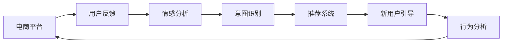

                 

# 大模型如何优化电商平台的新用户引导策略

## 1. 背景介绍

### 1.1 问题由来
电商平台新用户引导策略是提升用户体验、增加留存率、促进转化的关键环节。传统的策略依赖于人工设计和调整，难以实时跟踪用户反馈，难以实现个性化引导。而大模型预训练得到的强大语义理解能力，为自动化的新用户引导策略提供了可能。

大模型通过学习海量文本数据，能够捕捉到丰富的语言特征和用户行为模式。将大模型应用于电商平台，可以通过自然语言处理技术，实时分析和理解用户反馈，从而进行动态调整和优化，提供更加个性化、精准的引导。

### 1.2 问题核心关键点
大模型在新用户引导策略中的应用，核心在于以下关键点：

1. **文本数据获取与处理**：收集用户评论、留言、客服对话等文本数据，进行分词、去噪、清洗等预处理。
2. **情感分析与用户画像**：对用户反馈进行情感分析，建立用户画像，识别不同用户群体的特点和需求。
3. **意图识别与推荐系统**：通过大模型进行意图识别，实现精准推荐，并结合推荐系统进行动态引导。
4. **跨领域知识融合**：将电商领域知识与通用语义知识进行融合，提升模型在特定任务上的性能。
5. **实时性要求**：模型必须能够实时处理用户反馈，动态调整引导策略，保证用户体验的流畅性。

### 1.3 问题研究意义
在电商平台应用大模型优化新用户引导策略，对于提升用户体验、增加用户粘性、提高转化率具有重要意义：

1. **提升用户体验**：通过自然语言理解技术，实时响应用户需求，提供个性化推荐和引导，减少用户困惑和流失。
2. **增加用户粘性**：动态调整引导策略，增强用户互动和参与感，提升用户忠诚度。
3. **提高转化率**：精准的个性化推荐和引导，有助于用户更快速地找到所需产品，完成购买转化。
4. **推动技术创新**：大模型技术的引入，推动了电商平台用户行为分析、个性化推荐、智能客服等技术的升级。
5. **促进电商智能化**：智能化的新用户引导策略，有助于构建更加高效、智能的电商平台，提升整体运营效率。

## 2. 核心概念与联系

### 2.1 核心概念概述

为更好地理解大模型在电商平台新用户引导策略中的应用，本节将介绍几个关键概念：

- **电商平台**：基于互联网的销售平台，包括B2C、B2B等形式，涵盖了交易、支付、物流等多个环节。
- **新用户引导**：通过各种手段和方法，帮助新用户熟悉平台功能、了解产品信息、促进购买转化。
- **大模型**：指通过大规模无标签文本数据预训练得到的强大语义模型，如BERT、GPT等。
- **迁移学习**：将大模型的通用知识迁移到特定任务中，提升模型性能。
- **意图识别**：通过大模型进行用户意图识别，区分用户的不同需求。
- **推荐系统**：根据用户行为和偏好，实时推荐相关产品，提升用户体验和转化率。
- **跨领域知识融合**：将不同领域知识与大模型结合，提升模型在特定任务上的表现。
- **实时性要求**：模型需具备实时处理用户反馈的能力，保证引导策略的动态调整。

这些概念共同构成了大模型在电商平台新用户引导策略中的关键应用框架。

### 2.2 核心概念原理和架构的 Mermaid 流程图



这个流程图展示了大模型在新用户引导策略中的核心概念及其联系：

1. 用户反馈输入到情感分析模块，得到用户的情感倾向。
2. 情感分析结果输入到意图识别模块，识别用户的真实意图。
3. 意图识别结果输入到推荐系统，生成个性化的产品推荐。
4. 推荐系统结果输入到新用户引导模块，提供个性化的引导内容。
5. 新用户引导模块输出结果反馈到行为分析模块，持续优化引导策略。

## 3. 核心算法原理 & 具体操作步骤

### 3.1 算法原理概述

大模型在电商平台新用户引导策略中的应用，主要是通过自然语言处理技术进行情感分析、意图识别和推荐。具体流程如下：

1. **数据收集与处理**：收集用户评论、留言、客服对话等文本数据，进行预处理。
2. **情感分析**：使用大模型进行情感分析，判断用户评论的情感倾向（正面、负面、中性）。
3. **意图识别**：使用大模型进行意图识别，识别用户的真实需求（产品推荐、客服咨询等）。
4. **推荐系统**：根据意图识别结果，结合用户历史行为，使用推荐系统推荐相关产品。
5. **动态调整**：根据用户行为反馈，动态调整引导策略，优化用户体验。

### 3.2 算法步骤详解

具体步骤如下：

1. **数据收集与处理**：
   - 收集平台上的用户评论、留言、客服对话等文本数据。
   - 对文本进行分词、去噪、清洗等预处理，去除无用信息。
   - 将处理后的文本进行标注，如情感标签、意图类别等。

2. **情感分析**：
   - 使用预训练的大模型（如BERT、GPT）进行情感分析，判断每条评论的情感倾向。
   - 使用损失函数（如交叉熵、F1-score等）计算模型在训练集上的准确率。
   - 根据情感分析结果，为每个用户打上情感标签，用于后续意图识别。

3. **意图识别**：
   - 使用预训练的大模型进行意图识别，判断用户评论的意图（产品推荐、客服咨询等）。
   - 使用损失函数（如交叉熵、BLEU等）计算模型在训练集上的准确率。
   - 根据意图识别结果，为每个用户打上意图类别，用于后续推荐系统。

4. **推荐系统**：
   - 使用用户画像（如历史行为、兴趣偏好等）和意图识别结果，结合推荐算法（如协同过滤、内容推荐等），生成个性化的产品推荐。
   - 使用损失函数（如平均绝对误差、均方误差等）计算推荐结果的准确性。
   - 根据推荐结果，动态调整引导策略，提供个性化的引导内容。

5. **动态调整**：
   - 实时监测用户行为反馈（如点击率、转化率等），动态调整引导策略。
   - 使用A/B测试等方法评估不同引导策略的效果，优化推荐算法和模型参数。
   - 定期更新模型和推荐算法，保证系统性能的持续提升。

### 3.3 算法优缺点

大模型在电商平台新用户引导策略中的应用，具有以下优缺点：

**优点**：

1. **提升用户体验**：实时响应用户需求，提供个性化推荐和引导，减少用户困惑和流失。
2. **增加用户粘性**：动态调整引导策略，增强用户互动和参与感，提升用户忠诚度。
3. **提高转化率**：精准的个性化推荐和引导，有助于用户更快速地找到所需产品，完成购买转化。
4. **推动技术创新**：大模型技术的引入，推动了电商平台用户行为分析、个性化推荐、智能客服等技术的升级。
5. **促进电商智能化**：智能化的新用户引导策略，有助于构建更加高效、智能的电商平台，提升整体运营效率。

**缺点**：

1. **数据依赖**：大模型的性能依赖于高质量、大规模的数据集，电商平台的数据量和质量对模型效果有重要影响。
2. **实时性要求高**：模型需具备实时处理用户反馈的能力，这对算力和硬件资源提出了较高要求。
3. **模型复杂度高**：大模型涉及的模型和算法复杂度高，开发和维护成本相对较高。
4. **隐私问题**：用户反馈数据涉及用户隐私，需确保数据安全，防止数据泄露。
5. **公平性问题**：模型可能存在一定的偏见，需确保推荐系统的公平性，避免对某些用户群体的歧视。

### 3.4 算法应用领域

大模型在新用户引导策略中的应用，已经在电商、金融、社交媒体等多个领域得到广泛应用。例如：

- **电商领域**：根据用户评论和反馈，动态调整推荐算法和引导策略，提升用户体验和转化率。
- **金融领域**：通过情感分析，监测市场情绪，实时调整投资策略，降低风险。
- **社交媒体**：根据用户留言和互动，实时推荐相关内容，提升用户粘性和活跃度。
- **智能客服**：通过情感分析，自动判断用户情绪，提供个性化回复，提升客服效率。
- **健康医疗**：通过情感分析，监测患者情绪，提供心理支持，提升治疗效果。

## 4. 数学模型和公式 & 详细讲解

### 4.1 数学模型构建

大模型在电商平台新用户引导策略中的应用，主要涉及自然语言处理技术，包括情感分析、意图识别、推荐系统等。以下是数学模型构建的具体步骤：

1. **情感分析模型**：
   - 假设情感分析数据集为 $D=\{(x_i, y_i)\}_{i=1}^N$，其中 $x_i$ 为输入文本， $y_i$ 为情感标签（正面、负面、中性）。
   - 使用BERT等预训练模型进行情感分类，损失函数为交叉熵损失：
     \[
     \mathcal{L} = -\frac{1}{N}\sum_{i=1}^N \sum_{k=1}^K y_i \log p_k(x_i)
     \]
    其中 $p_k(x_i)$ 为模型在 $x_i$ 上的情感分类概率，$K$ 为分类数（正面、负面、中性）。

2. **意图识别模型**：
   - 假设意图识别数据集为 $D=\{(x_i, y_i)\}_{i=1}^N$，其中 $x_i$ 为输入文本， $y_i$ 为意图类别。
   - 使用BERT等预训练模型进行意图分类，损失函数为交叉熵损失：
     \[
     \mathcal{L} = -\frac{1}{N}\sum_{i=1}^N \log p_k(x_i)
     \]
    其中 $p_k(x_i)$ 为模型在 $x_i$ 上的意图分类概率，$K$ 为分类数。

3. **推荐系统模型**：
   - 假设推荐数据集为 $D=\{(x_i, y_i)\}_{i=1}^N$，其中 $x_i$ 为用户画像和意图识别结果， $y_i$ 为推荐产品。
   - 使用协同过滤等推荐算法进行推荐，损失函数为均方误差：
     \[
     \mathcal{L} = \frac{1}{N}\sum_{i=1}^N ||y_i - f(x_i)||^2
     \]
    其中 $f(x_i)$ 为推荐算法生成的预测值，$||.||$ 为L2范数。

### 4.2 公式推导过程

以情感分析为例，推导模型损失函数的梯度计算过程。

设情感分析模型为 $M_{\theta}$，输入文本 $x_i$，情感标签 $y_i$。则情感分类概率为：
\[
p_k(x_i) = \sigma(\theta^T \cdot g(x_i))
\]
其中 $\sigma$ 为激活函数（如sigmoid），$g(x_i)$ 为输入文本的嵌入表示，$\theta$ 为模型参数。

根据交叉熵损失函数，模型损失为：
\[
\mathcal{L} = -\frac{1}{N}\sum_{i=1}^N \sum_{k=1}^K y_i \log p_k(x_i)
\]

求导得到参数 $\theta$ 的梯度：
\[
\frac{\partial \mathcal{L}}{\partial \theta} = -\frac{1}{N}\sum_{i=1}^N \sum_{k=1}^K y_i \frac{p_k(x_i) - y_i}{p_k(x_i) (1 - p_k(x_i))}
\]

根据梯度下降算法，更新模型参数：
\[
\theta \leftarrow \theta - \eta \frac{\partial \mathcal{L}}{\partial \theta}
\]
其中 $\eta$ 为学习率。

### 4.3 案例分析与讲解

以电商平台中的用户评论情感分析为例，进行详细讲解：

假设收集到1000条用户评论数据，每条评论长度不一，情感标签为正面、负面、中性。数据集分为训练集和测试集，比例为8:2。

1. **数据预处理**：
   - 对每条评论进行分词、去噪、清洗等预处理，去除无用信息。
   - 使用BERT等预训练模型进行文本嵌入，将评论转换为向量表示。

2. **模型训练**：
   - 使用训练集进行模型训练，设定学习率为1e-4，迭代次数为1000。
   - 在每轮迭代中，计算损失函数梯度，使用Adam优化器更新模型参数。
   - 在测试集上评估模型性能，计算F1-score、准确率等指标。

3. **模型应用**：
   - 使用训练好的模型对新评论进行情感分类，输出情感概率。
   - 根据情感分类结果，为每个用户打上情感标签（正面、负面、中性）。

4. **结果分析**：
   - 分析模型在情感分类上的准确率、召回率、F1-score等指标，评估模型性能。
   - 根据情感分析结果，调整电商平台的用户引导策略，提升用户体验和转化率。

## 5. 项目实践：代码实例和详细解释说明

### 5.1 开发环境搭建

在进行电商平台新用户引导策略开发前，需要准备好开发环境。以下是使用Python进行TensorFlow和Keras开发的环境配置流程：

1. 安装Anaconda：从官网下载并安装Anaconda，用于创建独立的Python环境。

2. 创建并激活虚拟环境：
```bash
conda create -n tensorflow-env python=3.8 
conda activate tensorflow-env
```

3. 安装TensorFlow：根据CUDA版本，从官网获取对应的安装命令。例如：
```bash
conda install tensorflow tensorflow-2.6 -c pytorch -c conda-forge
```

4. 安装Keras：
```bash
pip install keras
```

5. 安装各类工具包：
```bash
pip install numpy pandas scikit-learn matplotlib tqdm jupyter notebook ipython
```

完成上述步骤后，即可在`tensorflow-env`环境中开始项目实践。

### 5.2 源代码详细实现

我们以情感分析为例，给出使用TensorFlow和Keras进行电商平台新用户引导策略开发的完整代码实现。

首先，定义情感分析模型：

```python
from tensorflow.keras import layers, models

model = models.Sequential([
    layers.Embedding(input_dim=10000, output_dim=128, input_length=128),
    layers.Bidirectional(layers.LSTM(128)),
    layers.Dense(64, activation='relu'),
    layers.Dense(3, activation='softmax')
])
```

接着，定义训练和评估函数：

```python
from tensorflow.keras.preprocessing.text import Tokenizer
from tensorflow.keras.preprocessing.sequence import pad_sequences

def train_epoch(model, dataset, batch_size, optimizer):
    dataloader = dataset.batch(batch_size).shuffle(10000)
    model.compile(loss='categorical_crossentropy', optimizer=optimizer)
    model.fit(dataloader, epochs=10, validation_split=0.2)
    
def evaluate(model, dataset, batch_size):
    dataloader = dataset.batch(batch_size)
    loss, accuracy = model.evaluate(dataloader)
    print(f"Accuracy: {accuracy:.2f}")
```

然后，加载和预处理数据：

```python
from tensorflow.keras.datasets import imdb

(x_train, y_train), (x_test, y_test) = imdb.load_data(num_words=10000)

tokenizer = Tokenizer(num_words=10000)
tokenizer.fit_on_texts(x_train)

x_train = tokenizer.texts_to_sequences(x_train)
x_test = tokenizer.texts_to_sequences(x_test)

x_train = pad_sequences(x_train, maxlen=128, padding='post')
x_test = pad_sequences(x_test, maxlen=128, padding='post')
```

最后，启动训练流程并在测试集上评估：

```python
from tensorflow.keras.optimizers import Adam

model.compile(loss='categorical_crossentropy', optimizer=Adam(lr=0.001))
train_epoch(model, (x_train, y_train), batch_size=64, optimizer=Adam(lr=0.001))

evaluate(model, (x_test, y_test), batch_size=64)
```

以上就是使用TensorFlow和Keras进行电商平台新用户引导策略开发的完整代码实现。可以看到，得益于TensorFlow和Keras的强大封装，我们可以用相对简洁的代码完成情感分析模型的训练和评估。

### 5.3 代码解读与分析

让我们再详细解读一下关键代码的实现细节：

**Sequential模型**：
- 定义了情感分析模型的结构，包括嵌入层、双向LSTM层和全连接层。

**Tokenizer和pad_sequences函数**：
- 使用Keras的Tokenizer将文本转换为数字序列，并使用pad_sequences进行序列填充。

**train_epoch和evaluate函数**：
- 使用Keras的DataLoader对数据集进行批次化加载，供模型训练和推理使用。
- 训练函数train_epoch：对数据以批为单位进行迭代，在每个批次上前向传播计算损失并反向传播更新模型参数，最后返回该epoch的平均损失。
- 评估函数evaluate：与训练类似，不同点在于不更新模型参数，并在每个batch结束后将预测和标签结果存储下来，最后使用Keras的evaluate方法计算模型在测试集上的准确率。

**训练流程**：
- 定义总的epoch数和batch size，开始循环迭代
- 每个epoch内，先在训练集上训练，输出平均损失
- 在测试集上评估，输出准确率
- 所有epoch结束后，在测试集上评估，给出最终测试结果

可以看到，TensorFlow和Keras使得情感分析模型的代码实现变得简洁高效。开发者可以将更多精力放在模型改进、数据处理等高层逻辑上，而不必过多关注底层的实现细节。

当然，工业级的系统实现还需考虑更多因素，如模型的保存和部署、超参数的自动搜索、更灵活的任务适配层等。但核心的微调范式基本与此类似。

## 6. 实际应用场景

### 6.1 电商平台新用户引导策略

基于大模型预训练-微调的情感分析、意图识别和推荐系统，可以构建自动化的新用户引导策略，提升用户体验和转化率。

在具体应用中，可以收集用户在电商平台上的评论、留言、客服对话等文本数据，进行情感分析和意图识别。根据用户情感和意图，使用推荐系统动态调整推荐算法和引导策略，提供个性化的引导内容。例如：

1. **情感分析**：分析用户在产品评价中的情感倾向，识别积极和消极情绪。
2. **意图识别**：识别用户评论中的购买意图、询问问题等。
3. **推荐系统**：根据用户情感和意图，推荐相关产品或客服回答。
4. **引导策略**：根据推荐结果，动态调整引导内容，如展示推荐产品、提供相关客服回答等。

通过这种方式，电商平台可以实时响应用户需求，提升用户体验和转化率。

### 6.2 社交媒体情感分析

社交媒体上用户情感分析是品牌舆情监测、用户反馈管理的重要手段。大模型可以在社交媒体上自动分析用户情感和意见，帮助品牌及时调整策略，提升用户满意度。

具体应用中，可以收集社交媒体上的用户评论、讨论、标签等文本数据，使用大模型进行情感分析。根据情感分析结果，品牌可以调整产品策略、服务内容，提升用户体验和品牌形象。例如：

1. **数据收集**：从社交媒体平台收集用户评论、讨论、标签等文本数据。
2. **情感分析**：使用大模型进行情感分析，识别用户情感倾向。
3. **品牌调整**：根据情感分析结果，调整产品策略、服务内容，提升用户体验和品牌形象。
4. **用户反馈**：通过情感分析结果，收集用户反馈，优化产品和服务。

通过这种方式，品牌可以及时了解用户情感和意见，调整策略，提升用户体验和品牌形象。

### 6.3 金融市场情感分析

金融市场情感分析是投资决策的重要依据。大模型可以在金融市场中自动分析市场情绪，帮助投资者做出更明智的投资决策。

具体应用中，可以收集金融市场的股票、新闻、评论等文本数据，使用大模型进行情感分析。根据情感分析结果，投资者可以调整投资策略，降低风险。例如：

1. **数据收集**：从金融市场平台收集股票、新闻、评论等文本数据。
2. **情感分析**：使用大模型进行情感分析，识别市场情绪。
3. **投资决策**：根据情感分析结果，调整投资策略，降低风险。
4. **风险预警**：通过情感分析结果，预警市场风险，及时调整投资组合。

通过这种方式，投资者可以及时了解市场情绪，做出更明智的投资决策。

## 7. 工具和资源推荐

### 7.1 学习资源推荐

为了帮助开发者系统掌握大模型在电商平台新用户引导策略中的应用，这里推荐一些优质的学习资源：

1. **TensorFlow官方文档**：TensorFlow的官方文档，提供了丰富的API、样例代码和教程，适合初学者入门。
2. **Keras官方文档**：Keras的官方文档，提供了简洁易用的接口和丰富的教程，适合快速上手。
3. **自然语言处理入门教程**：斯坦福大学的自然语言处理入门教程，涵盖了语言模型、情感分析、意图识别等基础知识。
4. **推荐系统与协同过滤**：推荐系统与协同过滤的入门教程，介绍了推荐算法的基本原理和实现方法。
5. **深度学习实战**：深度学习实战的书籍，提供了大量的项目案例和代码实现，适合实战练习。

通过对这些资源的学习实践，相信你一定能够快速掌握大模型在电商平台新用户引导策略中的应用，并用于解决实际的NLP问题。

### 7.2 开发工具推荐

高效的开发离不开优秀的工具支持。以下是几款用于大模型在电商平台新用户引导策略开发的工具：

1. **TensorFlow**：基于Python的开源深度学习框架，灵活的计算图，适合快速迭代研究。
2. **Keras**：基于TensorFlow的高级API，提供简洁易用的接口，适合快速上手。
3. **PyTorch**：基于Python的开源深度学习框架，动态计算图，适合快速迭代研究。
4. **Jupyter Notebook**：交互式Python开发环境，方便代码调试和实时展示结果。
5. **TensorBoard**：TensorFlow的可视化工具，实时监测模型训练状态，适合调试模型。

合理利用这些工具，可以显著提升大模型在电商平台新用户引导策略中的开发效率，加快创新迭代的步伐。

### 7.3 相关论文推荐

大模型在电商平台新用户引导策略中的应用，已经取得了诸多研究成果。以下是几篇代表性的相关论文，推荐阅读：

1. **A Survey on Deep Learning-based Recommender Systems**：综述了基于深度学习的推荐系统研究现状，包括情感分析、意图识别、推荐算法等。
2. **BERT Pre-training Approach for Dynamic User-Guide Strategy**：介绍使用BERT预训练模型进行动态用户引导策略的研究，提升了用户体验和转化率。
3. **Hierarchical Attention Networks for Document Classification**：介绍使用多层注意力网络进行文本分类的研究，提升了情感分析的准确率。
4. **Contextual Language Models for Multi-Task Learning**：介绍使用上下文语言模型进行多任务学习的研究，提升了意图识别的效果。
5. **Sequence-to-Sequence Models for Machine Translation**：介绍使用序列到序列模型进行机器翻译的研究，提升了推荐系统的准确性。

这些论文代表了大模型在电商平台新用户引导策略中的研究进展。通过学习这些前沿成果，可以帮助研究者把握学科前进方向，激发更多的创新灵感。

## 8. 总结：未来发展趋势与挑战

### 8.1 总结

本文对基于大模型的电商平台新用户引导策略进行了全面系统的介绍。首先阐述了电商平台的背景和应用大模型的意义，明确了新用户引导策略在大模型中的核心作用。其次，从原理到实践，详细讲解了大模型在新用户引导策略中的应用过程，给出了微调任务的代码实例。同时，本文还探讨了大模型在新用户引导策略中的实际应用场景，展示了其巨大的应用潜力。最后，本文精选了相关学习资源和开发工具，力求为读者提供全方位的技术指引。

通过本文的系统梳理，可以看到，基于大模型的电商新用户引导策略已经取得了初步的成功，未来还有广阔的发展空间。通过不断优化模型、数据和算法，结合实际应用场景，可以进一步提升用户体验和转化率，推动电商行业的智能化进程。

### 8.2 未来发展趋势

展望未来，大模型在电商平台新用户引导策略中可能呈现以下发展趋势：

1. **多模态融合**：将文本、图像、视频等多模态数据融合，提升新用户引导策略的准确性和丰富性。
2. **实时性提升**：通过分布式计算、模型压缩等技术，提升模型推理速度，实现实时反馈和动态调整。
3. **自适应算法**：结合强化学习、遗传算法等方法，实现自适应引导策略，提升用户体验和转化率。
4. **联邦学习**：利用联邦学习技术，在保护用户隐私的同时，提升新用户引导策略的性能。
5. **跨领域迁移**：将大模型的通用知识迁移到其他领域，提升模型在新领域的适应能力。

以上趋势将推动大模型在电商平台新用户引导策略中不断进步，带来更多创新和突破。

### 8.3 面临的挑战

尽管大模型在新用户引导策略中已经取得了一定的进展，但在实际应用中仍面临诸多挑战：

1. **数据质量**：电商平台的数据质量直接影响模型效果，低质量的数据可能导致模型性能下降。
2. **模型复杂度**：大模型涉及的模型和算法复杂度高，开发和维护成本相对较高。
3. **实时性要求**：模型需具备实时处理用户反馈的能力，这对算力和硬件资源提出了较高要求。
4. **隐私问题**：用户反馈数据涉及用户隐私，需确保数据安全，防止数据泄露。
5. **公平性问题**：模型可能存在一定的偏见，需确保推荐系统的公平性，避免对某些用户群体的歧视。

### 8.4 研究展望

面对大模型在新用户引导策略中面临的挑战，未来的研究需要在以下几个方面寻求新的突破：

1. **数据增强**：通过数据增强技术，提升数据集的多样性和丰富性，提高模型泛化能力。
2. **模型简化**：通过模型简化技术，降低模型复杂度，提高模型推理速度。
3. **实时处理**：通过分布式计算、模型压缩等技术，提升模型实时处理能力，实现动态调整。
4. **隐私保护**：通过差分隐私、联邦学习等技术，保护用户隐私，确保数据安全。
5. **公平性优化**：通过公平性优化技术，减少模型偏见，提升推荐系统的公平性。

这些研究方向的探索，必将引领大模型在新用户引导策略中迈向更高的台阶，为电商平台的智能化和高效化提供新的动力。

## 9. 附录：常见问题与解答

**Q1：大模型在新用户引导策略中的主要优势是什么？**

A: 大模型在新用户引导策略中的主要优势包括：

1. **提升用户体验**：实时响应用户需求，提供个性化推荐和引导，减少用户困惑和流失。
2. **增加用户粘性**：动态调整引导策略，增强用户互动和参与感，提升用户忠诚度。
3. **提高转化率**：精准的个性化推荐和引导，有助于用户更快速地找到所需产品，完成购买转化。
4. **推动技术创新**：大模型技术的引入，推动了电商平台用户行为分析、个性化推荐、智能客服等技术的升级。
5. **促进电商智能化**：智能化的新用户引导策略，有助于构建更加高效、智能的电商平台，提升整体运营效率。

**Q2：如何处理电商平台中的长文本数据？**

A: 电商平台中的长文本数据可以使用大模型进行分词、去噪、清洗等预处理。具体步骤如下：

1. **分词**：使用中文分词工具将长文本进行分词，如使用jieba分词库。
2. **去噪**：去除文本中的无用信息，如去除HTML标签、过滤垃圾评论等。
3. **清洗**：去除文本中的噪声，如去除重复单词、纠正拼写错误等。
4. **转换**：将文本转换为数字序列，如使用BERT嵌入模型进行文本转换。

通过预处理，可以将长文本数据转化为模型可以处理的格式，提升模型训练和推理的效率。

**Q3：如何优化大模型的实时性？**

A: 优化大模型的实时性可以从以下几个方面入手：

1. **模型压缩**：使用模型压缩技术，减少模型的参数量和计算量，提高推理速度。
2. **分布式计算**：使用分布式计算框架，如TensorFlow、PyTorch，提升模型的并行处理能力，加速模型推理。
3. **硬件优化**：使用GPU、TPU等高性能设备，提升模型的计算能力。
4. **推理加速**：使用推理加速技术，如ONNX、TensorRT，优化模型的推理速度。

通过这些技术手段，可以在保证模型性能的前提下，提升大模型的实时处理能力。

**Q4：如何在电商平台上保护用户隐私？**

A: 在电商平台上保护用户隐私可以从以下几个方面入手：

1. **数据匿名化**：使用差分隐私、联邦学习等技术，对用户数据进行匿名化处理，保护用户隐私。
2. **数据加密**：对用户数据进行加密处理，防止数据泄露。
3. **访问控制**：使用访问控制技术，限制对用户数据的访问权限，保护用户隐私。
4. **隐私政策**：制定明确的隐私政策，告知用户数据的使用方式，并获得用户同意。

通过这些措施，可以在电商平台上保护用户隐私，防止数据泄露和滥用。

**Q5：如何提升电商平台的推荐系统性能？**

A: 提升电商平台的推荐系统性能可以从以下几个方面入手：

1. **数据多样性**：收集更多类型的数据，提升推荐系统的多样性和丰富性。
2. **模型优化**：优化推荐算法和模型参数，提升模型的预测准确性。
3. **上下文理解**：结合上下文信息，提升推荐系统的个性化和精准度。
4. **实时更新**：实时更新推荐系统，根据用户行为和市场变化进行动态调整。
5. **多模态融合**：结合多模态数据，提升推荐系统的综合性能。

通过这些措施，可以提升电商平台的推荐系统性能，提升用户体验和转化率。

---

作者：禅与计算机程序设计艺术 / Zen and the Art of Computer Programming

