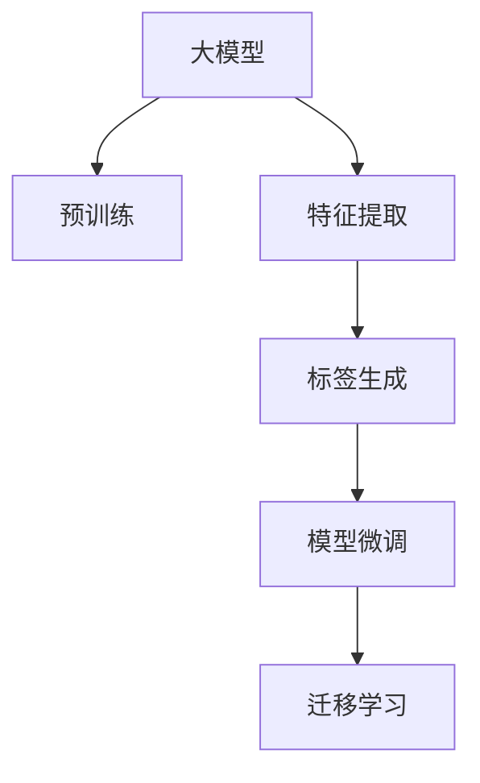

                 

# 大模型技术在电商平台商品标签生成中的应用

> 关键词：大模型,电商平台,商品标签生成,自然语言处理,深度学习,特征提取,应用实践,算法优化,项目案例,业务应用

## 1. 背景介绍

### 1.1 问题由来
电商平台作为现代商业的重要组成部分，其运营效率和服务质量直接影响到用户的购物体验和商家的收益。标签是商品信息的重要组成部分，用户通过标签可以快速找到所需商品，提升搜索和浏览效率。然而，手动标注商品标签耗时耗力，难以满足大规模商品管理的需求。

近年来，随着大模型技术在自然语言处理(NLP)领域的迅速发展，大语言模型在商品标签生成、商品描述优化、客服对话自动回复等电商场景中的应用得到了广泛探索。借助大语言模型，电商平台可以自动提取商品特征、生成标签，大幅提升运营效率，同时也为个性化推荐和内容生成提供了有力支撑。

### 1.2 问题核心关键点
大模型技术在商品标签生成中的应用，关键在于通过预训练模型对商品特征进行自动化提取和标签生成。主要技术手段包括：

1. 选择合适的大模型。通常使用已在大规模语料上预训练的模型，如GPT-3、BERT等。这些模型通过自监督学习任务获得泛化能力，能够理解和生成自然语言。

2. 数据预处理。清洗和标准化商品数据，提取商品的关键特征和描述，如商品名称、类别、价格、品牌等。

3. 特征提取。利用大模型对商品特征进行编码和表示，提取模型认为重要的特征。

4. 标签生成。基于提取的特征，利用大模型预测和生成商品标签。

5. 模型微调。利用小样本标注数据，对大模型进行微调，提升生成标签的准确性和多样性。

## 2. 核心概念与联系

### 2.1 核心概念概述

为了更好地理解大模型技术在商品标签生成中的应用，本节将介绍几个密切相关的核心概念：

- 大模型：以自回归(如GPT)或自编码(如BERT)模型为代表的，在大规模语料上进行预训练的语言模型。这些模型通过自监督学习任务获得泛化能力，能够理解和生成自然语言。

- 预训练：指在大规模无标签语料上，通过自监督学习任务训练通用语言模型的过程。常见的预训练任务包括掩码语言模型、下一句预测等。

- 特征提取：从商品数据中提取出模型认为重要的特征，如商品名称、类别、价格、品牌等。特征提取技术在大模型中的应用，有助于提高模型对商品的表示能力。

- 标签生成：基于提取的特征，利用大模型预测和生成商品标签。大模型的语言理解能力和生成能力，使得其在标签生成中具备优势。

- 模型微调：通过在少量标注数据上进行有监督学习，优化大模型在特定任务上的性能。商品标签生成任务通常使用微调方法，提升模型生成标签的准确性和多样性。

- 迁移学习：指将一个领域学习到的知识，迁移应用到另一个不同但相关的领域的学习范式。大模型的预训练和微调过程，实际上就是一种迁移学习过程。

这些核心概念之间的逻辑关系可以通过以下Mermaid流程图来展示：



这个流程图展示了大模型技术在商品标签生成中的应用核心概念及其之间的关系：

1. 大模型通过预训练获得泛化能力。
2. 特征提取从商品数据中提取出重要特征。
3. 标签生成利用大模型预测和生成商品标签。
4. 模型微调通过有监督学习优化模型性能。
5. 迁移学习促进了知识在不同任务间的传递和应用。

这些概念共同构成了大模型技术在商品标签生成中的核心逻辑，使其能够自动化、高效地提取商品特征和生成标签。

## 3. 核心算法原理 & 具体操作步骤
### 3.1 算法原理概述

大模型技术在商品标签生成中的应用，本质上是一个特征提取和条件生成的问题。其核心思想是：将大模型视为一个强大的"特征提取器"和"标签生成器"，通过有监督地训练来优化模型在特定任务上的性能。

具体而言，假设商品特征表示为 $\mathbf{x} \in \mathcal{X}$，商品标签表示为 $\mathbf{y} \in \mathcal{Y}$。则商品标签生成的过程可以描述为：

$$
P(y|\mathbf{x}) = \text{softmax}(\mathbf{W} \mathbf{f}(\mathbf{x}))
$$

其中，$f(\mathbf{x})$ 为商品特征的表示向量，$\mathbf{W}$ 为分类器的权重矩阵，softmax函数将线性变换结果映射到概率分布上。

模型的优化目标是最小化预测标签与真实标签之间的差异，即交叉熵损失：

$$
\mathcal{L}(\theta) = -\frac{1}{N}\sum_{i=1}^N \ell(y_i, \hat{y}_i)
$$

其中 $\ell(y_i, \hat{y}_i)$ 为交叉熵损失函数，$\hat{y}_i$ 为模型预测的标签。

通过梯度下降等优化算法，模型不断更新权重参数 $\theta$，最小化损失函数 $\mathcal{L}$，使得模型输出逼近真实标签。

### 3.2 算法步骤详解

基于大模型技术在商品标签生成中的应用，一般包括以下几个关键步骤：

**Step 1: 准备数据集**

1. 收集商品数据：包括商品名称、类别、价格、品牌等信息。清洗和标准化数据，去除噪声和异常值。
2. 标注商品标签：为部分商品手动标注标签，如类别标签、促销标签等。标注数据应覆盖商品的主要类别和场景。

**Step 2: 特征提取**

1. 选择特征：根据商品特性，选择对标签生成有重要影响的特征。例如，商品名称、类别、价格、品牌、描述等。
2. 特征编码：使用大模型对商品特征进行编码和表示。例如，利用BERT模型对商品名称进行嵌入表示，得到特征向量 $\mathbf{x}$。

**Step 3: 模型初始化**

1. 加载预训练模型：选择合适的大模型，如BERT、GPT等，作为初始化参数。
2. 特征映射：将商品特征映射到模型输入空间，例如，将商品名称作为输入，进行向量嵌入。

**Step 4: 标签生成**

1. 模型输入：将商品特征向量作为模型的输入。
2. 标签预测：利用模型对商品标签进行预测，输出概率分布。
3. 标签选择：根据预测概率选择最可能的标签。

**Step 5: 模型微调**

1. 设置微调超参数：选择合适的优化算法、学习率、批次大小、迭代轮数等。
2. 定义损失函数：选择适当的损失函数，如交叉熵损失、F1-Score等。
3. 执行微调：在标注数据集上进行有监督训练，更新模型参数。
4. 验证和优化：在验证集上评估模型性能，根据性能指标调整模型参数。

**Step 6: 模型部署**

1. 模型保存：保存微调后的模型，以便后续使用。
2. 集成系统：将微调模型集成到电商平台的商品管理系统，自动生成商品标签。

### 3.3 算法优缺点

基于大模型技术在商品标签生成中的应用，具有以下优点：

1. 高效自动化：大模型能够自动提取商品特征和生成标签，无需人工干预，大幅提升运营效率。
2. 泛化能力强：大模型在大规模语料上进行预训练，具备泛化能力，能够处理各种商品描述。
3. 鲁棒性强：大模型在多个任务上表现稳定，受噪声数据影响较小。
4. 可扩展性好：大模型可以通过微调等手段，适应不同领域和场景。

同时，该方法也存在以下局限性：

1. 数据需求高：标签生成依赖大量标注数据，数据量不足时效果可能不佳。
2. 计算资源要求高：大模型通常参数量较大，对计算资源有较高要求。
3. 微调参数量大：微调过程需要更新模型参数，计算复杂度较高。
4. 标签多样性不足：模型生成的标签可能不够丰富，需要后续人工筛选和调整。

尽管存在这些局限性，但就目前而言，大模型技术在商品标签生成中的应用仍然具有重要价值。未来相关研究的目标是进一步降低对标注数据的依赖，提高模型生成标签的多样性和准确性，同时兼顾计算资源和性能的优化。

### 3.4 算法应用领域

大模型技术在商品标签生成中的应用，已经在电商平台的商品管理、个性化推荐、内容生成等多个领域得到应用。具体包括：

1. 商品标签自动生成：基于商品特征，自动生成商品标签，如商品类别、促销标签、属性标签等。
2. 商品描述优化：通过大模型自动生成商品描述，提高用户搜索和浏览体验。
3. 个性化推荐：利用商品标签和描述，为不同用户推荐个性化商品。
4. 客服对话自动回复：利用大模型自动生成客服对话内容，提升客户服务质量。
5. 营销活动优化：基于商品标签和促销信息，优化营销活动策略，提升转化率。

除了这些直接应用外，大模型技术还广泛应用于电商平台的决策支持、风险控制、舆情监测等间接领域，为电商运营提供有力支撑。

## 4. 数学模型和公式 & 详细讲解 & 举例说明

### 4.1 数学模型构建

本节将使用数学语言对大模型技术在商品标签生成中的应用进行更加严格的刻画。

记商品特征为 $\mathbf{x} \in \mathcal{X}$，商品标签为 $\mathbf{y} \in \mathcal{Y}$，其中 $\mathcal{X}$ 为特征空间，$\mathcal{Y}$ 为标签空间。大模型为 $\mathbf{W} \in \mathbb{R}^{d \times |\mathcal{Y}|}$，其中 $d$ 为特征向量维度，$|\mathcal{Y}|$ 为标签类别数。

定义大模型在商品特征 $\mathbf{x}$ 上的输出为 $\mathbf{f}(\mathbf{x}) \in \mathbb{R}^d$，则商品标签生成的概率分布为：

$$
P(y|\mathbf{x}) = \text{softmax}(\mathbf{W} \mathbf{f}(\mathbf{x}))
$$

模型的优化目标是最小化预测标签与真实标签之间的差异，即交叉熵损失：

$$
\mathcal{L}(\theta) = -\frac{1}{N}\sum_{i=1}^N \ell(y_i, \hat{y}_i)
$$

其中 $\ell(y_i, \hat{y}_i)$ 为交叉熵损失函数，$\hat{y}_i$ 为模型预测的标签。

### 4.2 公式推导过程

以下我们以二分类任务为例，推导交叉熵损失函数及其梯度的计算公式。

假设商品特征 $\mathbf{x}$ 被大模型编码为 $\mathbf{f}(\mathbf{x})$，则商品标签生成的概率分布为：

$$
P(y=1|\mathbf{x}) = \sigma(\mathbf{W} \mathbf{f}(\mathbf{x}))
$$

其中 $\sigma(\cdot)$ 为sigmoid函数，将线性变换结果映射到概率空间。交叉熵损失函数为：

$$
\ell(y_i, \hat{y}_i) = -[y_i \log \hat{y}_i + (1-y_i) \log (1-\hat{y}_i)]
$$

在训练集 $D=\{(\mathbf{x}_i, y_i)\}_{i=1}^N$ 上，经验风险最小化问题为：

$$
\mathcal{L}(\theta) = -\frac{1}{N}\sum_{i=1}^N \ell(y_i, \hat{y}_i)
$$

其中 $\hat{y}_i = \sigma(\mathbf{W} \mathbf{f}(\mathbf{x}_i))$。

对模型参数 $\theta$ 的梯度更新为：

$$
\frac{\partial \mathcal{L}(\theta)}{\partial \theta} = -\frac{1}{N}\sum_{i=1}^N (\hat{y}_i - y_i) \frac{\partial \hat{y}_i}{\partial \theta}
$$

其中 $\frac{\partial \hat{y}_i}{\partial \theta} = \frac{\partial}{\partial \theta} \sigma(\mathbf{W} \mathbf{f}(\mathbf{x}_i))$。

在得到损失函数的梯度后，即可带入参数更新公式，完成模型的迭代优化。重复上述过程直至收敛，最终得到适应商品标签生成任务的最优模型参数 $\theta^*$。

### 4.3 案例分析与讲解

以一个商品分类任务为例，进一步讲解大模型在商品标签生成中的应用。

假设某电商平台上销售的家电商品，商品特征包括品牌、型号、价格等，标签包括电器、家具、厨具等类别。以下是大模型在商品分类任务上的具体应用：

**Step 1: 准备数据集**

1. 收集商品数据：包括商品名称、类别、价格、品牌等信息。清洗和标准化数据，去除噪声和异常值。
2. 标注商品标签：为部分商品手动标注标签，如电器、家具、厨具等。标注数据应覆盖商品的主要类别和场景。

**Step 2: 特征提取**

1. 选择特征：根据商品特性，选择对标签生成有重要影响的特征。例如，商品名称、类别、价格、品牌、描述等。
2. 特征编码：使用BERT模型对商品名称进行嵌入表示，得到特征向量 $\mathbf{x}$。

**Step 3: 模型初始化**

1. 加载预训练模型：选择BERT模型作为初始化参数。
2. 特征映射：将商品名称作为输入，进行向量嵌入，得到特征向量 $\mathbf{x}$。

**Step 4: 标签生成**

1. 模型输入：将商品特征向量 $\mathbf{x}$ 作为模型的输入。
2. 标签预测：利用模型对商品类别标签进行预测，输出概率分布。
3. 标签选择：根据预测概率选择最可能的标签，如电器、家具、厨具等。

**Step 5: 模型微调**

1. 设置微调超参数：选择合适的优化算法、学习率、批次大小、迭代轮数等。
2. 定义损失函数：选择交叉熵损失函数。
3. 执行微调：在标注数据集上进行有监督训练，更新模型参数。
4. 验证和优化：在验证集上评估模型性能，根据性能指标调整模型参数。

**Step 6: 模型部署**

1. 模型保存：保存微调后的模型，以便后续使用。
2. 集成系统：将微调模型集成到电商平台的商品管理系统，自动生成商品标签。

在上述案例中，大模型技术在商品分类任务上展示了其强大的泛化能力和自动化生成标签的能力。通过合理选择特征和优化模型参数，可以提升模型的预测准确性，满足电商平台的实际需求。

## 5. 项目实践：代码实例和详细解释说明

### 5.1 开发环境搭建

在进行商品标签生成的大模型应用实践前，我们需要准备好开发环境。以下是使用Python进行PyTorch开发的环境配置流程：

1. 安装Anaconda：从官网下载并安装Anaconda，用于创建独立的Python环境。

2. 创建并激活虚拟环境：
```bash
conda create -n pytorch-env python=3.8 
conda activate pytorch-env
```

3. 安装PyTorch：根据CUDA版本，从官网获取对应的安装命令。例如：
```bash
conda install pytorch torchvision torchaudio cudatoolkit=11.1 -c pytorch -c conda-forge
```

4. 安装Transformers库：
```bash
pip install transformers
```

5. 安装各类工具包：
```bash
pip install numpy pandas scikit-learn matplotlib tqdm jupyter notebook ipython
```

完成上述步骤后，即可在`pytorch-env`环境中开始大模型应用实践。

### 5.2 源代码详细实现

下面我们以商品分类任务为例，给出使用Transformers库对BERT模型进行商品分类微调的PyTorch代码实现。

首先，定义商品分类任务的数据处理函数：

```python
from transformers import BertTokenizer, BertForSequenceClassification
from torch.utils.data import Dataset
import torch

class GoodsDataset(Dataset):
    def __init__(self, texts, labels, tokenizer, max_len=128):
        self.texts = texts
        self.labels = labels
        self.tokenizer = tokenizer
        self.max_len = max_len
        
    def __len__(self):
        return len(self.texts)
    
    def __getitem__(self, item):
        text = self.texts[item]
        label = self.labels[item]
        
        encoding = self.tokenizer(text, return_tensors='pt', max_length=self.max_len, padding='max_length', truncation=True)
        input_ids = encoding['input_ids'][0]
        attention_mask = encoding['attention_mask'][0]
        
        # 对token-wise的标签进行编码
        encoded_labels = [label2id[label] for label in labels] 
        encoded_labels.extend([label2id['O']] * (self.max_len - len(encoded_labels)))
        labels = torch.tensor(encoded_labels, dtype=torch.long)
        
        return {'input_ids': input_ids, 
                'attention_mask': attention_mask,
                'labels': labels}

# 标签与id的映射
label2id = {'电器': 0, '家具': 1, '厨具': 2, 'O': 3}
id2label = {v: k for k, v in label2id.items()}

# 创建dataset
tokenizer = BertTokenizer.from_pretrained('bert-base-cased')

train_dataset = GoodsDataset(train_texts, train_labels, tokenizer)
dev_dataset = GoodsDataset(dev_texts, dev_labels, tokenizer)
test_dataset = GoodsDataset(test_texts, test_labels, tokenizer)
```

然后，定义模型和优化器：

```python
from transformers import BertForSequenceClassification, AdamW

model = BertForSequenceClassification.from_pretrained('bert-base-cased', num_labels=len(label2id))

optimizer = AdamW(model.parameters(), lr=2e-5)
```

接着，定义训练和评估函数：

```python
from torch.utils.data import DataLoader
from tqdm import tqdm
from sklearn.metrics import classification_report

device = torch.device('cuda') if torch.cuda.is_available() else torch.device('cpu')
model.to(device)

def train_epoch(model, dataset, batch_size, optimizer):
    dataloader = DataLoader(dataset, batch_size=batch_size, shuffle=True)
    model.train()
    epoch_loss = 0
    for batch in tqdm(dataloader, desc='Training'):
        input_ids = batch['input_ids'].to(device)
        attention_mask = batch['attention_mask'].to(device)
        labels = batch['labels'].to(device)
        model.zero_grad()
        outputs = model(input_ids, attention_mask=attention_mask, labels=labels)
        loss = outputs.loss
        epoch_loss += loss.item()
        loss.backward()
        optimizer.step()
    return epoch_loss / len(dataloader)

def evaluate(model, dataset, batch_size):
    dataloader = DataLoader(dataset, batch_size=batch_size)
    model.eval()
    preds, labels = [], []
    with torch.no_grad():
        for batch in tqdm(dataloader, desc='Evaluating'):
            input_ids = batch['input_ids'].to(device)
            attention_mask = batch['attention_mask'].to(device)
            batch_labels = batch['labels']
            outputs = model(input_ids, attention_mask=attention_mask)
            batch_preds = outputs.logits.argmax(dim=2).to('cpu').tolist()
            batch_labels = batch_labels.to('cpu').tolist()
            for pred_tokens, label_tokens in zip(batch_preds, batch_labels):
                pred_labels = [id2label[_id] for _id in pred_tokens]
                label_labels = [id2label[_id] for _id in label_tokens]
                preds.append(pred_labels[:len(label_labels)])
                labels.append(label_labels)
                
    print(classification_report(labels, preds))
```

最后，启动训练流程并在测试集上评估：

```python
epochs = 5
batch_size = 16

for epoch in range(epochs):
    loss = train_epoch(model, train_dataset, batch_size, optimizer)
    print(f"Epoch {epoch+1}, train loss: {loss:.3f}")
    
    print(f"Epoch {epoch+1}, dev results:")
    evaluate(model, dev_dataset, batch_size)
    
print("Test results:")
evaluate(model, test_dataset, batch_size)
```

以上就是使用PyTorch对BERT模型进行商品分类任务微调的完整代码实现。可以看到，得益于Transformers库的强大封装，我们可以用相对简洁的代码完成BERT模型的加载和微调。

### 5.3 代码解读与分析

让我们再详细解读一下关键代码的实现细节：

**GoodsDataset类**：
- `__init__`方法：初始化文本、标签、分词器等关键组件。
- `__len__`方法：返回数据集的样本数量。
- `__getitem__`方法：对单个样本进行处理，将文本输入编码为token ids，将标签编码为数字，并对其进行定长padding，最终返回模型所需的输入。

**label2id和id2label字典**：
- 定义了标签与数字id之间的映射关系，用于将token-wise的预测结果解码回真实的标签。

**训练和评估函数**：
- 使用PyTorch的DataLoader对数据集进行批次化加载，供模型训练和推理使用。
- 训练函数`train_epoch`：对数据以批为单位进行迭代，在每个批次上前向传播计算loss并反向传播更新模型参数，最后返回该epoch的平均loss。
- 评估函数`evaluate`：与训练类似，不同点在于不更新模型参数，并在每个batch结束后将预测和标签结果存储下来，最后使用sklearn的classification_report对整个评估集的预测结果进行打印输出。

**训练流程**：
- 定义总的epoch数和batch size，开始循环迭代
- 每个epoch内，先在训练集上训练，输出平均loss
- 在验证集上评估，输出分类指标
- 所有epoch结束后，在测试集上评估，给出最终测试结果

可以看到，PyTorch配合Transformers库使得BERT微调的代码实现变得简洁高效。开发者可以将更多精力放在数据处理、模型改进等高层逻辑上，而不必过多关注底层的实现细节。

当然，工业级的系统实现还需考虑更多因素，如模型的保存和部署、超参数的自动搜索、更灵活的任务适配层等。但核心的微调范式基本与此类似。

## 6. 实际应用场景
### 6.1 智能推荐系统

大模型技术在商品分类和标签生成中的应用，可以进一步拓展到智能推荐系统中。通过自动提取商品特征和生成标签，推荐系统能够更加精准地为用户推荐商品，提升用户体验和转化率。

在技术实现上，推荐系统可以基于用户历史行为数据和商品标签数据，构建用户-商品画像，使用大模型进行相似度匹配和召回，实现个性化推荐。例如，某用户经常购买电器和家具，系统可以通过商品分类和标签，找到与之匹配的推荐商品，满足用户需求。

### 6.2 用户画像构建

电商平台的运营决策离不开用户画像的支撑。基于大模型技术，可以自动提取用户行为数据中的关键特征，构建用户画像，从而进行精准的用户行为预测和决策支持。

例如，某用户在电商平台上浏览了多个商品，系统可以自动分析这些商品的属性标签和类别，构建用户画像，预测该用户可能感兴趣的商品类型，进行精准营销和个性化推荐。

### 6.3 实时营销活动

营销活动是电商平台上重要的推广手段，基于大模型技术，可以实现实时营销活动的优化和预测。通过自动提取商品标签和描述，系统可以实时分析活动效果，优化活动策略，提升营销转化率。

例如，某电商平台在进行限时折扣活动，系统可以自动提取参与活动商品的标签和描述，实时分析用户行为和反馈，调整活动策略，提升活动效果。

### 6.4 未来应用展望

随着大模型技术的发展，未来在商品标签生成中的应用将更加广泛，其带来的业务价值也将更加显著。

在智慧零售领域，大模型技术可以应用于供应链优化、库存管理、需求预测等环节，为零售运营提供科学决策支持。

在智能客服领域，基于大模型技术的商品分类和标签生成，可以辅助客服系统进行快速响应和自动回复，提升客户服务质量。

在供应链金融领域，大模型技术可以应用于风险控制、信用评估等环节，为供应链金融提供决策支持。

总之，大模型技术在商品标签生成中的应用，将极大地提升电商平台的运营效率和决策质量，为传统电商行业带来数字化转型的新机遇。

## 7. 工具和资源推荐
### 7.1 学习资源推荐

为了帮助开发者系统掌握大模型技术在商品标签生成中的应用，这里推荐一些优质的学习资源：

1. 《Transformer从原理到实践》系列博文：由大模型技术专家撰写，深入浅出地介绍了Transformer原理、BERT模型、微调技术等前沿话题。

2. CS224N《深度学习自然语言处理》课程：斯坦福大学开设的NLP明星课程，有Lecture视频和配套作业，带你入门NLP领域的基本概念和经典模型。

3. 《Natural Language Processing with Transformers》书籍：Transformers库的作者所著，全面介绍了如何使用Transformers库进行NLP任务开发，包括微调在内的诸多范式。

4. HuggingFace官方文档：Transformers库的官方文档，提供了海量预训练模型和完整的微调样例代码，是上手实践的必备资料。

5. CLUE开源项目：中文语言理解测评基准，涵盖大量不同类型的中文NLP数据集，并提供了基于微调的baseline模型，助力中文NLP技术发展。

通过对这些资源的学习实践，相信你一定能够快速掌握大模型技术在商品标签生成中的应用，并用于解决实际的NLP问题。
###  7.2 开发工具推荐

高效的开发离不开优秀的工具支持。以下是几款用于大模型应用开发的常用工具：

1. PyTorch：基于Python的开源深度学习框架，灵活动态的计算图，适合快速迭代研究。大部分预训练语言模型都有PyTorch版本的实现。

2. TensorFlow：由Google主导开发的开源深度学习框架，生产部署方便，适合大规模工程应用。同样有丰富的预训练语言模型资源。

3. Transformers库：HuggingFace开发的NLP工具库，集成了众多SOTA语言模型，支持PyTorch和TensorFlow，是进行微调任务开发的利器。

4. Weights & Biases：模型训练的实验跟踪工具，可以记录和可视化模型训练过程中的各项指标，方便对比和调优。与主流深度学习框架无缝集成。

5. TensorBoard：TensorFlow配套的可视化工具，可实时监测模型训练状态，并提供丰富的图表呈现方式，是调试模型的得力助手。

6. Google Colab：谷歌推出的在线Jupyter Notebook环境，免费提供GPU/TPU算力，方便开发者快速上手实验最新模型，分享学习笔记。

合理利用这些工具，可以显著提升大模型应用开发的效率，加快创新迭代的步伐。

### 7.3 相关论文推荐

大模型技术在商品标签生成中的应用，源于学界的持续研究。以下是几篇奠基性的相关论文，推荐阅读：

1. Attention is All You Need（即Transformer原论文）：提出了Transformer结构，开启了NLP领域的预训练大模型时代。

2. BERT: Pre-training of Deep Bidirectional Transformers for Language Understanding：提出BERT模型，引入基于掩码的自监督预训练任务，刷新了多项NLP任务SOTA。

3. Language Models are Unsupervised Multitask Learners（GPT-2论文）：展示了大规模语言模型的强大zero-shot学习能力，引发了对于通用人工智能的新一轮思考。

4. Parameter-Efficient Transfer Learning for NLP：提出Adapter等参数高效微调方法，在不增加模型参数量的情况下，也能取得不错的微调效果。

5. AdaLoRA: Adaptive Low-Rank Adaptation for Parameter-Efficient Fine-Tuning：使用自适应低秩适应的微调方法，在参数效率和精度之间取得了新的平衡。

这些论文代表了大模型技术在商品标签生成中的应用的发展脉络。通过学习这些前沿成果，可以帮助研究者把握学科前进方向，激发更多的创新灵感。

## 8. 总结：未来发展趋势与挑战

### 8.1 总结

本文对大模型技术在商品标签生成中的应用进行了全面系统的介绍。首先阐述了大模型技术和微调技术的研究背景和意义，明确了在商品标签生成任务上的应用前景。其次，从原理到实践，详细讲解了大模型技术在商品分类任务中的数学模型和优化算法，给出了微调任务开发的完整代码实例。同时，本文还广泛探讨了大模型技术在电商平台的商品管理、个性化推荐、用户画像构建等多个领域的应用前景，展示了大模型技术的巨大潜力。最后，本文精选了相关学习资源，力求为读者提供全方位的技术指引。

通过本文的系统梳理，可以看到，大模型技术在商品标签生成中的应用具有重要价值。其强大的泛化能力和自动化特征提取能力，使得商品分类和标签生成变得更加高效和精准。未来，随着大模型技术的不断发展，其在电商平台的更多场景中的应用将更加广泛，为传统电商行业带来数字化转型的新机遇。

### 8.2 未来发展趋势

展望未来，大模型技术在商品标签生成中的应用将呈现以下几个发展趋势：

1. 模型规模持续增大。随着算力成本的下降和数据规模的扩张，预训练语言模型的参数量还将持续增长。超大规模语言模型蕴含的丰富语言知识，有望支撑更加复杂多变的商品分类任务。

2. 微调方法日趋多样。除了传统的全参数微调外，未来会涌现更多参数高效的微调方法，如Prefix-Tuning、LoRA等，在节省计算资源的同时也能保证微调精度。

3. 持续学习成为常态。随着数据分布的不断变化，微调模型也需要持续学习新知识以保持性能。如何在不遗忘原有知识的同时，高效吸收新样本信息，将成为重要的研究课题。

4. 标注样本需求降低。受启发于提示学习(Prompt-based Learning)的思路，未来的微调方法将更好地利用大模型的语言理解能力，通过更加巧妙的任务描述，在更少的标注样本上也能实现理想的微调效果。

5. 标签多样性提升。模型生成的标签将更加丰富，涵盖商品类别、属性、促销等多个维度，满足更多场景下的分类需求。

6. 多模态微调崛起。未来的微调模型将不仅仅依赖文本数据，还将融合图像、视频、语音等多模态信息，实现视觉、语音等多模态信息的协同建模。

以上趋势凸显了大模型技术在商品标签生成中的应用前景。这些方向的探索发展，必将进一步提升商品分类的自动化和精准性，为电商平台的运营效率和用户体验带来质的提升。

### 8.3 面临的挑战

尽管大模型技术在商品标签生成中的应用已经取得了显著成果，但在迈向更加智能化、普适化应用的过程中，它仍面临着诸多挑战：

1. 数据需求高。标签生成依赖大量标注数据，数据量不足时效果可能不佳。如何降低对标注数据的依赖，利用无监督和半监督学习范式，是未来的重要研究方向。

2. 计算资源要求高。大模型通常参数量较大，对计算资源有较高要求。如何在保证性能的同时，降低计算成本，优化模型结构和推理速度，将是一个重要的研究方向。

3. 标签多样性不足。模型生成的标签可能不够丰富，需要后续人工筛选和调整。如何提升标签多样性，实现更全面、细致的商品分类，将是重要的研究方向。

4. 模型鲁棒性不足。当前微调模型面对噪声数据时，泛化性能往往大打折扣。如何提高模型鲁棒性，避免灾难性遗忘，还需要更多理论和实践的积累。

5. 标签生成准确性。在标注数据较少的情况下，模型生成的标签可能不够准确。如何通过数据增强、对抗训练等手段提升标签生成准确性，将是重要的研究方向。

尽管存在这些挑战，但随着学界和产业界的共同努力，这些难题终将一一被克服，大模型技术在商品标签生成中的应用必将在未来更加广泛和深入。

### 8.4 研究展望

面对大模型技术在商品标签生成中所面临的挑战，未来的研究需要在以下几个方面寻求新的突破：

1. 探索无监督和半监督微调方法。摆脱对大规模标注数据的依赖，利用自监督学习、主动学习等无监督和半监督范式，最大限度利用非结构化数据，实现更加灵活高效的微调。

2. 研究参数高效和计算高效的微调范式。开发更加参数高效的微调方法，在固定大部分预训练参数的同时，只更新极少量的任务相关参数。同时优化微调模型的计算图，减少前向传播和反向传播的资源消耗，实现更加轻量级、实时性的部署。

3. 融合因果和对比学习范式。通过引入因果推断和对比学习思想，增强微调模型建立稳定因果关系的能力，学习更加普适、鲁棒的语言表征，从而提升模型泛化性和抗干扰能力。

4. 引入更多先验知识。将符号化的先验知识，如知识图谱、逻辑规则等，与神经网络模型进行巧妙融合，引导微调过程学习更准确、合理的语言模型。同时加强不同模态数据的整合，实现视觉、语音等多模态信息与文本信息的协同建模。

5. 结合因果分析和博弈论工具。将因果分析方法引入微调模型，识别出模型决策的关键特征，增强输出解释的因果性和逻辑性。借助博弈论工具刻画人机交互过程，主动探索并规避模型的脆弱点，提高系统稳定性。

6. 纳入伦理道德约束。在模型训练目标中引入伦理导向的评估指标，过滤和惩罚有偏见、有害的输出倾向。同时加强人工干预和审核，建立模型行为的监管机制，确保输出符合人类价值观和伦理道德。

这些研究方向的探索，必将引领大模型技术在商品标签生成中的应用走向更高的台阶，为构建安全、可靠、可解释、可控的智能系统铺平道路。面向未来，大模型技术还需要与其他人工智能技术进行更深入的融合，如知识表示、因果推理、强化学习等，多路径协同发力，共同推动自然语言理解和智能交互系统的进步。只有勇于创新、敢于突破，才能不断拓展大模型的边界，让智能技术更好地造福人类社会。

## 9. 附录：常见问题与解答

**Q1：大模型技术在商品标签生成中是否适用于所有商品类别？**

A: 大模型技术在商品标签生成中具有较强的泛化能力，但不同商品类别可能具有不同的特征和标签体系。例如，某些特殊商品（如艺术品、古董等）的标签体系可能较为复杂，需要更精细的标签划分和特征提取方法。因此，在应用大模型技术时，需要根据具体商品类别进行模型调整和优化。

**Q2：大模型技术在商品标签生成中如何处理长尾商品？**

A: 长尾商品指那些需求量较少的商品，其标签数据可能较少，影响模型的泛化能力。为了处理长尾商品，可以采用以下策略：

1. 数据增强：通过合成数据、回译等方式扩充长尾商品的标注数据。
2. 迁移学习：利用大模型在全类别数据上的泛化能力，对长尾商品进行迁移学习，提升其标签生成效果。
3. 小样本学习：在大模型的基础上，使用小样本学习技术，通过少量标注数据进行微调，提升模型对长尾商品的分类能力。

**Q3：大模型技术在商品标签生成中如何提升模型的泛化能力？**

A: 提升模型的泛化能力，需要从数据、模型和算法多个层面入手：

1. 数据层面：收集更广泛的标注数据，涵盖不同类别和场景的商品，丰富数据分布。
2. 模型层面：选择更强大的大模型，如GPT-3、BERT等，提升模型的语言理解和生成能力。
3. 算法层面：采用更多的正则化技术，如L2正则、Dropout等，防止模型过拟合。
4. 特征层面：合理选择和组合特征，提升模型对不同商品特征的表征能力。

通过多方面的优化，可以显著提升大模型在商品标签生成中的泛化能力，使其适应更广泛的商品分类任务。

**Q4：大模型技术在商品标签生成中的计算资源需求如何？**

A: 大模型技术在商品标签生成中的应用，对计算资源的需求较高。主要原因包括：

1. 模型参数量较大。当前主流的预训练大模型通常包含亿级的参数，对计算资源有较高要求。
2. 训练和推理复杂度高。大模型需要进行全参数微调，计算复杂度较高，推理速度较慢。

为了降低计算资源需求，可以采用以下策略：

1. 参数剪枝：剪除模型中不重要的参数，减少模型复杂度。
2. 模型量化：将浮点模型转为定点模型，压缩存储空间，提高计算效率。
3. 模型压缩：通过知识蒸馏、模型裁剪等方法，减小模型尺寸。
4. 分布式训练：利用多机多核的分布式计算资源，加速模型训练。

通过这些优化手段，可以在保证性能的同时，显著降低大模型技术在商品标签生成中的应用成本。

**Q5：大模型技术在商品标签生成中如何处理噪声数据？**

A: 大模型技术在商品标签生成中，可能会面临噪声数据的干扰。为了处理噪声数据，可以采用以下策略：

1. 数据清洗：在数据预处理阶段，进行数据清洗，去除噪声和异常值。
2. 噪声过滤：在模型训练阶段，利用对抗训练等技术，提升模型的鲁棒性，防止噪声数据对模型造成影响。
3. 参数调整：通过调整模型参数，提高模型对噪声数据的鲁棒性。

通过多方面的优化，可以显著提升大模型在商品标签生成中的鲁棒性，使其在噪声数据环境下仍能保持稳定表现。

---

作者：禅与计算机程序设计艺术 / Zen and the Art of Computer Programming

