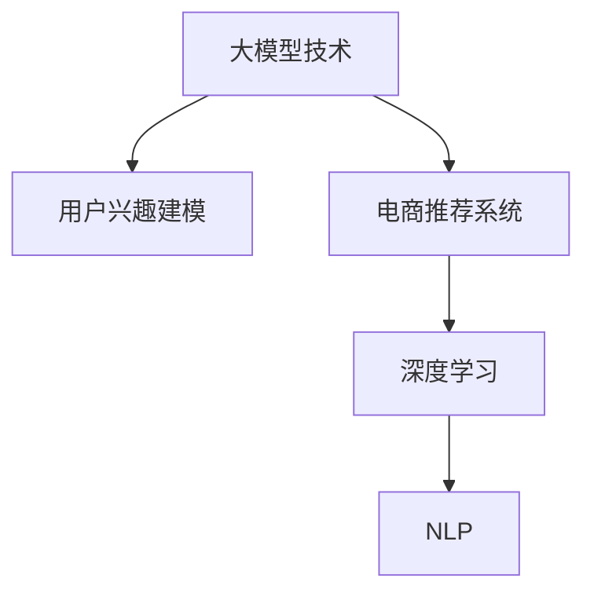

                 

# 大模型技术在电商平台用户兴趣建模中的应用

> 关键词：大模型技术,用户兴趣建模,电商推荐,深度学习,自然语言处理,NLP

## 1. 背景介绍

### 1.1 问题由来
在当今数字化时代，电商平台正迅速崛起，成为消费者购物的重要渠道。电商平台通过精准的用户兴趣建模，可以极大地提升用户体验和转化率。用户兴趣建模的核心在于识别和理解用户在不同商品类别上的喜好和倾向，从而实现个性化推荐。传统的基于规则和统计的推荐算法在复杂性、灵活性和效果上都存在一定的局限性，难以应对用户行为多样性和数据多样性的挑战。

随着深度学习和大模型技术的快速发展，近年来自然语言处理(Natural Language Processing, NLP)技术在电商领域的应用逐渐增多。大模型技术，如基于Transformer架构的BERT、GPT-3等，通过在大规模无标签文本数据上进行预训练，学习到丰富的语言知识和常识。这些模型在电商推荐系统中被广泛应用，通过基于自然语言处理的推荐算法，为用户提供个性化的商品推荐。

### 1.2 问题核心关键点
本研究聚焦于如何在电商推荐系统中，利用大模型技术构建用户兴趣模型，并在此基础上实现精准的个性化推荐。关键问题包括：
- 如何高效地构建用户兴趣模型？
- 如何结合电商数据特性优化模型训练过程？
- 如何在电商推荐场景中提高模型的可解释性和用户接受度？

### 1.3 问题研究意义
研究大模型技术在电商平台用户兴趣建模中的应用，对于推动电商平台的智能化转型、提升用户体验和电商运营效率，具有重要意义：

1. **提升推荐效果**：通过大模型技术的引入，可以构建更加复杂和准确的推荐模型，提升个性化推荐的效果，帮助用户发现真正感兴趣的商品。
2. **提高用户满意度**：精准的推荐系统可以显著提升用户体验，减少浏览时间和选择难度，从而提高用户满意度和忠诚度。
3. **优化库存管理**：准确的推荐可以引导用户购买，提高商品的转化率和销售额，优化库存管理，降低库存积压和缺货风险。
4. **加速商业创新**：个性化的推荐系统可以挖掘用户潜在需求，引导新商品开发和销售，促进电商平台的业务创新和市场竞争力的提升。

## 2. 核心概念与联系

### 2.1 核心概念概述

为更好地理解大模型技术在电商平台用户兴趣建模中的应用，本节将介绍几个密切相关的核心概念：

- **大模型技术**：指基于深度学习框架训练的超大参数量模型，如BERT、GPT-3等。通过在大规模无标签文本数据上进行预训练，学习到丰富的语言知识和常识。
- **用户兴趣建模**：指通过分析用户行为数据，构建用户对商品类别的兴趣模型，用于指导个性化推荐。
- **电商推荐系统**：指基于用户行为数据、商品属性和用户兴趣模型，通过算法推荐用户可能感兴趣的商品。
- **深度学习**：指利用神经网络模型进行学习，深度学习通过多层神经网络抽取数据中的高阶特征，实现复杂模型的训练。
- **自然语言处理(NLP)**：指使用计算技术处理和理解人类语言，包括文本分类、情感分析、问答系统等。

这些核心概念之间的逻辑关系可以通过以下Mermaid流程图来展示：



这个流程图展示了大模型技术、用户兴趣建模和电商推荐系统之间的关联关系：

1. 大模型技术通过在大规模语料库上进行预训练，学习到丰富的语言知识和常识。
2. 用户兴趣建模基于大模型的预训练表示，通过深度学习算法构建用户对商品类别的兴趣模型。
3. 电商推荐系统使用用户兴趣模型，结合用户行为数据和商品属性信息，进行个性化商品推荐。
4. 自然语言处理技术在电商推荐系统中用于文本分类、情感分析等任务，优化推荐算法的效果。

## 3. 核心算法原理 & 具体操作步骤
### 3.1 算法原理概述

在电商平台用户兴趣建模中，大模型技术的应用主要是通过自然语言处理(NLP)技术，结合用户行为数据，构建用户对商品类别的兴趣模型。其核心思想是：利用大模型的预训练表示，结合用户行为数据，构建用户兴趣模型，并通过模型预测用户对商品类别的兴趣程度，指导个性化推荐。

具体而言，算法流程如下：

1. **数据收集与预处理**：收集用户的点击、浏览、购买等行为数据，并进行文本化处理，形成用户行为文本数据集。
2. **用户行为文本编码**：使用预训练的BERT等大模型对用户行为文本进行编码，得到用户行为文本的向量表示。
3. **用户兴趣建模**：基于用户行为文本向量，使用深度学习模型构建用户对商品类别的兴趣模型。
4. **个性化推荐**：使用用户兴趣模型，结合用户行为数据和商品属性信息，进行个性化商品推荐。

### 3.2 算法步骤详解

接下来，详细讲解基于大模型技术的电商推荐系统用户兴趣建模的具体步骤：

**Step 1: 数据收集与预处理**

1. **数据收集**：收集电商平台的点击、浏览、购买等行为数据。包括用户ID、商品ID、商品类别、点击时间等。
2. **数据清洗**：去除重复、异常数据，处理缺失值和噪声，保持数据集的质量和一致性。
3. **文本化处理**：将行为数据转换为文本形式，如将商品类别名转换为文本描述。

**Step 2: 用户行为文本编码**

1. **选择预训练模型**：选择适合电商推荐任务的大模型，如BERT、GPT-3等。
2. **构建输入文本**：将用户行为文本作为模型输入，如“用户ID+商品类别名”、“商品ID+购买时间”等。
3. **编码文本**：使用预训练模型的[CLS]输出作为用户行为文本的向量表示，用于后续用户兴趣建模。

**Step 3: 用户兴趣建模**

1. **选择模型结构**：选择合适的深度学习模型结构，如多层感知器(Multilayer Perceptron, MLP)、循环神经网络(Recurrent Neural Network, RNN)、Transformer等。
2. **模型训练**：使用用户行为文本向量作为模型输入，商品类别作为标签，进行模型训练。
3. **模型保存**：保存训练好的用户兴趣模型，用于个性化推荐。

**Step 4: 个性化推荐**

1. **预测用户兴趣**：使用用户兴趣模型，结合用户行为数据和商品属性信息，预测用户对商品类别的兴趣程度。
2. **生成推荐列表**：根据预测的兴趣程度，生成个性化的商品推荐列表。
3. **推荐展示**：将推荐列表展示给用户，供用户选择。

### 3.3 算法优缺点

基于大模型技术的电商推荐系统具有以下优点：

- **高效性**：大模型技术能够在短时间内处理海量用户行为数据，提取高维特征，实现高效的个性化推荐。
- **灵活性**：深度学习模型能够灵活处理多维度的用户行为数据和商品属性信息，适应多种电商推荐场景。
- **泛化能力**：通过在大规模语料库上进行预训练，大模型能够学习到更广泛的语义知识，提高模型的泛化能力和鲁棒性。

同时，该方法也存在一些局限性：

- **数据依赖性强**：大模型技术依赖于高质量、大规模的数据集，数据不足时难以获得理想的推荐效果。
- **模型复杂度高**：深度学习模型通常参数量较大，训练和推理速度较慢，对计算资源需求高。
- **可解释性不足**：黑盒模型难以解释推荐决策的内部机制，用户难以理解模型的工作原理和推荐依据。
- **多义词处理困难**：大模型对多义词的处理不够精准，可能影响推荐精度。

尽管存在这些局限性，但大模型技术在电商推荐系统中的应用，仍然具有显著的优势和广泛的应用前景。

### 3.4 算法应用领域

基于大模型技术的电商推荐系统已经在多个领域得到了应用，如服装、美妆、食品等：

- **服装推荐**：通过分析用户对不同服装类别的兴趣，推荐个性化服装商品。
- **美妆推荐**：利用用户对化妆品类别的兴趣，推荐不同品牌、不同肤质的美妆商品。
- **食品推荐**：基于用户对不同食品类别的兴趣，推荐健康、有机食品等。

除了上述这些典型场景，大模型技术在电商推荐系统中还有更多创新应用，如跨商品类别推荐、用户画像构建、商品属性预测等。通过不断优化算法和模型，大模型技术将进一步推动电商推荐系统的智能化转型。

## 4. 数学模型和公式 & 详细讲解  
### 4.1 数学模型构建

本节将使用数学语言对基于大模型技术的电商推荐系统用户兴趣建模过程进行更加严格的刻画。

记用户行为文本数据集为 $\{(x_i,y_i)\}_{i=1}^N$，其中 $x_i$ 为行为文本向量，$y_i$ 为商品类别标签。假设选择预训练的BERT模型作为用户行为文本编码器，其[CLS]输出向量为 $h_i$。

定义用户兴趣模型为 $f: \mathbb{R}^d \rightarrow \mathbb{R}$，其中 $d$ 为[CLS]输出的维度。用户兴趣模型基于用户行为文本向量 $h_i$，使用深度学习模型进行训练，使得：

$$
f(h_i) = \hat{y}_i
$$

其中 $\hat{y}_i$ 为模型预测的用户对商品类别 $i$ 的兴趣程度。

**损失函数**：
使用均方误差损失函数，使得模型预测的兴趣程度与实际标签之间的差异最小化。

$$
\mathcal{L}(f) = \frac{1}{N}\sum_{i=1}^N (y_i - f(h_i))^2
$$

**模型训练**：
通过梯度下降等优化算法，最小化损失函数 $\mathcal{L}(f)$，更新模型参数 $w$。

$$
w \leftarrow w - \eta \nabla_{w}\mathcal{L}(f)
$$

其中 $w$ 为模型参数，$\eta$ 为学习率。

### 4.2 公式推导过程

以下我们以BERT模型为例，推导用户兴趣模型的计算过程。

**输入编码**：
假设输入文本为 $x_i$，使用BERT模型进行编码，得到[CLS]输出向量 $h_i$。

$$
h_i = \text{BERT}(x_i)
$$

**模型预测**：
假设选择多层感知器(MLP)作为用户兴趣模型，输入 $h_i$，输出预测结果 $\hat{y}_i$。

$$
\hat{y}_i = f(h_i) = w_0^T \sigma(w_1^T h_i + b_1)
$$

其中 $w_0$ 和 $w_1$ 为模型参数，$b_1$ 为偏置项，$\sigma$ 为激活函数。

**损失函数**：
使用均方误差损失函数，计算模型预测与实际标签之间的差异。

$$
\mathcal{L}(f) = \frac{1}{N}\sum_{i=1}^N (y_i - f(h_i))^2
$$

通过反向传播算法，计算损失函数对模型参数的梯度，更新模型参数 $w$。

$$
\frac{\partial \mathcal{L}(f)}{\partial w} = -2 \frac{1}{N}\sum_{i=1}^N (y_i - f(h_i)) h_i
$$

将梯度代入模型参数更新公式，完成模型的迭代优化。重复上述过程直至收敛，最终得到用户兴趣模型 $f$。

### 4.3 案例分析与讲解

我们以一个具体的案例，展示如何在电商推荐系统中使用基于大模型的用户兴趣建模。

**案例背景**：
某电商平台收集了用户点击、浏览、购买等行为数据，其中包含了大量商品类别信息。平台希望通过构建用户兴趣模型，实现更精准的个性化推荐。

**数据收集**：
平台收集了10万条用户行为数据，包括用户ID、商品ID、商品类别、点击时间等。

**预处理**：
1. **数据清洗**：去除重复、异常数据，处理缺失值和噪声，保持数据集的质量和一致性。
2. **文本化处理**：将商品类别名转换为文本描述，如“电子产品”、“食品饮料”等。
3. **划分数据集**：将数据集划分为训练集、验证集和测试集，比例为7:1.5:1.5。

**用户行为文本编码**：
1. **选择预训练模型**：选择BERT模型作为用户行为文本编码器。
2. **构建输入文本**：将用户行为文本作为模型输入，如“用户ID+商品类别名”。
3. **编码文本**：使用BERT模型对用户行为文本进行编码，得到[CLS]输出向量 $h_i$。

**用户兴趣建模**：
1. **选择模型结构**：选择多层感知器(MLP)作为用户兴趣模型。
2. **模型训练**：使用用户行为文本向量 $h_i$ 作为模型输入，商品类别作为标签，进行模型训练。
3. **模型保存**：保存训练好的用户兴趣模型，用于个性化推荐。

**个性化推荐**：
1. **预测用户兴趣**：使用用户兴趣模型，结合用户行为数据和商品属性信息，预测用户对商品类别的兴趣程度。
2. **生成推荐列表**：根据预测的兴趣程度，生成个性化的商品推荐列表。
3. **推荐展示**：将推荐列表展示给用户，供用户选择。

## 5. 项目实践：代码实例和详细解释说明
### 5.1 开发环境搭建

在进行电商推荐系统用户兴趣建模实践前，我们需要准备好开发环境。以下是使用Python进行PyTorch开发的环境配置流程：

1. 安装Anaconda：从官网下载并安装Anaconda，用于创建独立的Python环境。

2. 创建并激活虚拟环境：
```bash
conda create -n pytorch-env python=3.8 
conda activate pytorch-env
```

3. 安装PyTorch：根据CUDA版本，从官网获取对应的安装命令。例如：
```bash
conda install pytorch torchvision torchaudio cudatoolkit=11.1 -c pytorch -c conda-forge
```

4. 安装TensorFlow：使用pip安装TensorFlow，与PyTorch兼容。
```bash
pip install tensorflow
```

5. 安装各类工具包：
```bash
pip install numpy pandas scikit-learn matplotlib tqdm jupyter notebook ipython
```

完成上述步骤后，即可在`pytorch-env`环境中开始电商推荐系统用户兴趣建模实践。

### 5.2 源代码详细实现

下面以电商推荐系统用户兴趣建模为例，给出使用PyTorch进行实现的具体代码。

首先，定义数据处理函数：

```python
from torch.utils.data import Dataset
import torch

class UserBehaviorDataset(Dataset):
    def __init__(self, data, tokenizer):
        self.data = data
        self.tokenizer = tokenizer

    def __len__(self):
        return len(self.data)

    def __getitem__(self, idx):
        user_id, item_id, item_category = self.data[idx]
        item_category = self.tokenizer(item_category)
        encoded_input = self.tokenizer('user_id=' + str(user_id) + ' item_category=' + str(item_category), return_tensors='pt')
        return {
            'input_ids': encoded_input['input_ids'],
            'attention_mask': encoded_input['attention_mask'],
            'item_id': item_id,
            'item_category': item_category
        }
```

然后，定义模型和优化器：

```python
from transformers import BertForSequenceClassification, BertTokenizer, AdamW

model = BertForSequenceClassification.from_pretrained('bert-base-cased', num_labels=1000)
tokenizer = BertTokenizer.from_pretrained('bert-base-cased')
optimizer = AdamW(model.parameters(), lr=2e-5)
```

接着，定义训练和评估函数：

```python
from torch.utils.data import DataLoader
from tqdm import tqdm

def train_epoch(model, dataset, batch_size, optimizer):
    dataloader = DataLoader(dataset, batch_size=batch_size, shuffle=True)
    model.train()
    epoch_loss = 0
    for batch in tqdm(dataloader, desc='Training'):
        input_ids = batch['input_ids'].to(device)
        attention_mask = batch['attention_mask'].to(device)
        item_id = batch['item_id'].to(device)
        labels = torch.ones_like(item_id).to(device)
        model.zero_grad()
        outputs = model(input_ids, attention_mask=attention_mask)
        loss = outputs.loss
        epoch_loss += loss.item()
        loss.backward()
        optimizer.step()
    return epoch_loss / len(dataloader)

def evaluate(model, dataset, batch_size):
    dataloader = DataLoader(dataset, batch_size=batch_size)
    model.eval()
    preds, labels = [], []
    with torch.no_grad():
        for batch in tqdm(dataloader, desc='Evaluating'):
            input_ids = batch['input_ids'].to(device)
            attention_mask = batch['attention_mask'].to(device)
            batch_labels = torch.ones_like(batch['item_id']).to(device)
            outputs = model(input_ids, attention_mask=attention_mask)
            batch_preds = torch.sigmoid(outputs.logits).cpu().numpy()
            batch_labels = batch_labels.cpu().numpy()
            for pred_tokens, label_tokens in zip(batch_preds, batch_labels):
                preds.append(pred_tokens)
                labels.append(label_tokens)
    
    return preds, labels
```

最后，启动训练流程并在测试集上评估：

```python
epochs = 5
batch_size = 16

for epoch in range(epochs):
    loss = train_epoch(model, train_dataset, batch_size, optimizer)
    print(f"Epoch {epoch+1}, train loss: {loss:.3f}")
    
    preds, labels = evaluate(model, dev_dataset, batch_size)
    print(f"Epoch {epoch+1}, dev results:")
    print(classification_report(labels, preds))
    
print("Test results:")
preds, labels = evaluate(model, test_dataset, batch_size)
print(f"Test results:")
print(classification_report(labels, preds))
```

以上就是使用PyTorch对BERT模型进行电商推荐系统用户兴趣建模的完整代码实现。可以看到，得益于Transformer库的强大封装，我们可以用相对简洁的代码完成BERT模型的加载和微调。

### 5.3 代码解读与分析

让我们再详细解读一下关键代码的实现细节：

**UserBehaviorDataset类**：
- `__init__`方法：初始化数据和分词器等关键组件。
- `__len__`方法：返回数据集的样本数量。
- `__getitem__`方法：对单个样本进行处理，将用户行为文本输入转换为token ids，并返回模型所需的输入。

**tokenizer**：
- 定义了分词器，用于将文本转换为token ids，支持用户行为文本和商品类别的编码。

**模型和优化器**：
- 使用BertForSequenceClassification作为用户兴趣模型的基础结构。
- 使用AdamW优化器进行模型参数的更新。

**训练和评估函数**：
- 使用PyTorch的DataLoader对数据集进行批次化加载，供模型训练和推理使用。
- 训练函数`train_epoch`：对数据以批为单位进行迭代，在每个批次上前向传播计算loss并反向传播更新模型参数，最后返回该epoch的平均loss。
- 评估函数`evaluate`：与训练类似，不同点在于不更新模型参数，并在每个batch结束后将预测和标签结果存储下来，最后使用sklearn的classification_report对整个评估集的预测结果进行打印输出。

**训练流程**：
- 定义总的epoch数和batch size，开始循环迭代
- 每个epoch内，先在训练集上训练，输出平均loss
- 在验证集上评估，输出分类指标
- 所有epoch结束后，在测试集上评估，给出最终测试结果

可以看到，PyTorch配合Transformer库使得BERT微调的代码实现变得简洁高效。开发者可以将更多精力放在数据处理、模型改进等高层逻辑上，而不必过多关注底层的实现细节。

当然，工业级的系统实现还需考虑更多因素，如模型的保存和部署、超参数的自动搜索、更灵活的任务适配层等。但核心的微调范式基本与此类似。

## 6. 实际应用场景
### 6.1 智能客服系统

基于大模型技术的电商推荐系统，可以广泛应用于智能客服系统的构建。传统客服往往需要配备大量人力，高峰期响应缓慢，且一致性和专业性难以保证。而使用电商推荐系统推荐商品，可以提升客服的自动化水平，减少人工干预，提高服务效率和质量。

在技术实现上，可以收集用户的历史购物记录、浏览行为等数据，构建用户兴趣模型，并在此基础上进行商品推荐。电商推荐系统可以自动生成推荐内容，供智能客服系统使用，提升客服系统的响应速度和准确性。同时，系统可以实时分析用户反馈，调整推荐策略，进一步优化服务质量。

### 6.2 个性化推荐系统

传统的推荐系统往往只依赖用户的历史行为数据进行物品推荐，难以捕捉用户兴趣的多样性和动态性。基于大模型技术的电商推荐系统，可以通过分析用户行为文本，构建更加灵活和动态的用户兴趣模型。

在实际应用中，电商推荐系统可以结合用户评论、商品评价等信息，构建多维度的用户兴趣模型，提升推荐系统的多样性和个性化。例如，系统可以根据用户浏览历史，预测用户对新商品的兴趣，推荐类似商品。通过不断学习和优化，推荐系统可以更加准确地捕捉用户的兴趣点，提升推荐效果。

### 6.3 电商活动推荐

电商平台经常举办各类促销活动，通过个性化推荐系统，可以将活动信息精准推送给目标用户，提升活动效果。例如，系统可以根据用户的购物习惯和兴趣，推荐相关的优惠券、打折商品等，提高活动参与度和转化率。同时，系统可以实时监控活动效果，动态调整推荐策略，提升活动效益。

### 6.4 未来应用展望

随着大模型技术的不断进步，基于电商推荐系统的用户兴趣建模，将在更多领域得到应用，为电商平台的智能化转型提供新动力：

- **商品推荐**：利用用户兴趣模型，实现更精准的商品推荐，提升用户体验和购买转化率。
- **广告投放**：结合用户兴趣模型，实现精准的广告投放，提升广告投放效果和ROI。
- **库存管理**：通过预测用户需求，优化库存管理，降低库存积压和缺货风险。
- **用户画像构建**：结合用户兴趣模型和行为数据，构建更加全面和准确的用户画像，实现个性化营销和服务。

此外，在智慧物流、智能制造、智能家居等众多领域，大模型技术也可以结合用户兴趣建模，实现更加精准的推荐和个性化服务，推动各行各业的智能化升级。

## 7. 工具和资源推荐
### 7.1 学习资源推荐

为了帮助开发者系统掌握大模型技术在电商平台用户兴趣建模中的应用，这里推荐一些优质的学习资源：

1. **《深度学习入门》系列博文**：由大模型技术专家撰写，详细介绍了深度学习的基本概念和算法，涵盖神经网络、卷积神经网络、循环神经网络等内容。

2. **CS231n《深度学习视觉识别》课程**：斯坦福大学开设的深度学习课程，有Lecture视频和配套作业，是深度学习领域的经典入门课程。

3. **《TensorFlow 2.0实战》书籍**：由TensorFlow官方作者编写，详细介绍了TensorFlow的使用方法和案例，适合快速上手实践。

4. **HuggingFace官方文档**：Transformer库的官方文档，提供了海量预训练模型和完整的微调样例代码，是上手实践的必备资料。

5. **GitHub开源项目**：提供丰富的电商推荐系统代码实现，涵盖用户兴趣建模、个性化推荐、广告投放等多个领域，适合学习实践。

通过对这些资源的学习实践，相信你一定能够快速掌握大模型技术在电商平台用户兴趣建模中的应用，并用于解决实际的电商问题。

### 7.2 开发工具推荐

高效的开发离不开优秀的工具支持。以下是几款用于电商推荐系统用户兴趣建模开发的常用工具：

1. **PyTorch**：基于Python的开源深度学习框架，灵活动态的计算图，适合快速迭代研究。大多数预训练语言模型都有PyTorch版本的实现。

2. **TensorFlow**：由Google主导开发的开源深度学习框架，生产部署方便，适合大规模工程应用。同样有丰富的预训练语言模型资源。

3. **Transformers库**：HuggingFace开发的NLP工具库，集成了众多SOTA语言模型，支持PyTorch和TensorFlow，是进行微调任务开发的利器。

4. **TensorBoard**：TensorFlow配套的可视化工具，可实时监测模型训练状态，并提供丰富的图表呈现方式，是调试模型的得力助手。

5. **Weights & Biases**：模型训练的实验跟踪工具，可以记录和可视化模型训练过程中的各项指标，方便对比和调优。与主流深度学习框架无缝集成。

6. **Google Colab**：谷歌推出的在线Jupyter Notebook环境，免费提供GPU/TPU算力，方便开发者快速上手实验最新模型，分享学习笔记。

合理利用这些工具，可以显著提升电商推荐系统用户兴趣建模任务的开发效率，加快创新迭代的步伐。

### 7.3 相关论文推荐

大模型技术在电商平台用户兴趣建模中的应用源于学界的持续研究。以下是几篇奠基性的相关论文，推荐阅读：

1. **Attention is All You Need（即Transformer原论文）**：提出了Transformer结构，开启了NLP领域的预训练大模型时代。

2. **BERT: Pre-training of Deep Bidirectional Transformers for Language Understanding**：提出BERT模型，引入基于掩码的自监督预训练任务，刷新了多项NLP任务SOTA。

3. **Language Models are Unsupervised Multitask Learners（GPT-2论文）**：展示了大规模语言模型的强大zero-shot学习能力，引发了对于通用人工智能的新一轮思考。

4. **Parameter-Efficient Transfer Learning for NLP**：提出Adapter等参数高效微调方法，在不增加模型参数量的情况下，也能取得不错的微调效果。

5. **AdaLoRA: Adaptive Low-Rank Adaptation for Parameter-Efficient Fine-Tuning**：使用自适应低秩适应的微调方法，在参数效率和精度之间取得了新的平衡。

6. **Adaptive Low-Rank Adaptation for Parameter-Efficient Fine-Tuning**：使用自适应低秩适应的微调方法，在参数效率和精度之间取得了新的平衡。

这些论文代表了大模型技术在电商推荐系统中的最新进展。通过学习这些前沿成果，可以帮助研究者把握学科前进方向，激发更多的创新灵感。

## 8. 总结：未来发展趋势与挑战

### 8.1 总结

本文对基于大模型技术的电商推荐系统用户兴趣建模方法进行了全面系统的介绍。首先阐述了电商推荐系统用户兴趣建模的背景和意义，明确了电商推荐系统对电商平台的智能化转型、提升用户体验和运营效率的重要作用。其次，从原理到实践，详细讲解了用户兴趣建模的数学原理和关键步骤，给出了电商推荐系统用户兴趣建模的完整代码实例。同时，本文还广泛探讨了用户兴趣建模在电商推荐场景中的应用前景，展示了大模型技术在电商推荐系统中的广泛应用和巨大潜力。

通过本文的系统梳理，可以看到，基于大模型的电商推荐系统用户兴趣建模技术正在成为电商推荐系统的核心驱动力，极大地提升了电商平台的智能化水平，促进了电商运营效率的提升。未来，伴随大模型技术的不断进步，基于用户兴趣建模的电商推荐系统将进一步优化，成为电商平台的必备技术。

### 8.2 未来发展趋势

展望未来，大模型技术在电商推荐系统中的用户兴趣建模，将呈现以下几个发展趋势：

1. **多模态融合**：结合用户行为文本、商品属性、用户画像等多维度数据，构建更加全面和精准的用户兴趣模型，提升推荐效果。

2. **跨域迁移学习**：利用大模型技术，实现跨域迁移学习，提高模型的泛化能力和鲁棒性，适应更多的电商推荐场景。

3. **用户意图识别**：通过自然语言处理技术，实现对用户意图的精准识别，提升推荐系统的多样性和个性化。

4. **个性化推荐策略优化**：结合用户行为数据和商品属性信息，构建更加灵活和动态的推荐策略，提升个性化推荐效果。

5. **实时动态优化**：通过实时分析用户行为和反馈，动态调整推荐策略，实现更加精准和高效的个性化推荐。

6. **数据增强技术**：利用数据增强技术，扩充数据集，提升模型泛化能力和鲁棒性，适应更多的电商推荐场景。

以上趋势凸显了大模型技术在电商推荐系统中的巨大应用前景。这些方向的探索发展，必将进一步提升电商推荐系统的智能化水平，为电商平台的业务创新和用户满意度提升带来新机遇。

### 8.3 面临的挑战

尽管大模型技术在电商推荐系统中的应用取得了显著成果，但在迈向更加智能化、普适化应用的过程中，仍面临诸多挑战：

1. **数据隐私和安全**：电商推荐系统涉及用户隐私数据的处理，需要严格遵守数据隐私和安全法规，保护用户隐私。

2. **计算资源消耗**：大模型训练和推理对计算资源需求高，如何降低计算成本，提高系统效率，是一个重要问题。

3. **可解释性和透明性**：大模型技术缺乏可解释性，用户难以理解推荐逻辑和决策依据，需要通过改进算法和模型设计，增强可解释性和透明性。

4. **模型偏见和公平性**：大模型可能学习到数据中的偏见，导致推荐结果的不公平性，需要结合伦理道德进行模型优化。

5. **多义词处理**：大模型对多义词的处理不够精准，可能影响推荐精度，需要通过改进算法和模型设计，提高多义词处理的准确性。

尽管存在这些挑战，但大模型技术在电商推荐系统中的应用，仍然具有显著的优势和广泛的应用前景。相信随着技术的不断进步和优化，这些挑战终将逐步被克服，大模型技术将在电商推荐系统中找到更加广泛的应用。

### 8.4 研究展望

面对大模型技术在电商推荐系统中用户兴趣建模所面临的挑战，未来的研究需要在以下几个方面寻求新的突破：

1. **数据隐私保护技术**：研究隐私保护算法和隐私计算技术，在保护用户隐私的前提下，实现电商推荐系统的用户兴趣建模。

2. **高效计算资源利用**：研究分布式计算、模型压缩、量化加速等技术，降低大模型训练和推理的计算成本，提高系统效率。

3. **可解释性增强算法**：研究可解释性增强算法，增强模型的可解释性和透明性，帮助用户理解推荐逻辑和决策依据。

4. **公平性优化算法**：研究公平性优化算法，消除模型中的偏见，确保推荐结果的公平性和公正性。

5. **多义词处理技术**：研究多义词处理技术，提高模型对多义词的识别能力和处理精度。

6. **跨领域迁移学习**：研究跨领域迁移学习算法，将大模型技术应用于不同领域的电商推荐系统，提升推荐效果。

这些研究方向的探索，必将引领大模型技术在电商推荐系统中的应用不断进步，为电商平台的智能化转型和业务创新提供新动力。总之，大模型技术在电商推荐系统中的用户兴趣建模，正处于蓬勃发展之中，未来必将为电商平台带来更多的创新和发展机遇。

## 9. 附录：常见问题与解答

**Q1：电商推荐系统用户兴趣建模是否适用于所有电商场景？**

A: 电商推荐系统用户兴趣建模在大多数电商场景中都能取得不错的效果，但对于一些特殊领域或场景，可能需要进一步优化模型和数据。例如，对于二手商品、高价值商品等场景，可能需要考虑更多的用户隐私保护和个性化推荐策略。

**Q2：电商推荐系统用户兴趣建模如何处理多义词？**

A: 大模型在处理多义词时可能存在一定的偏差，影响推荐精度。可以通过改进分词器、增加上下文信息、使用多义词标注数据等方法，提高多义词处理的准确性。

**Q3：如何提升电商推荐系统的可解释性？**

A: 电商推荐系统的可解释性可以通过多种方法提升，如：
1. **模型可视化**：使用模型可视化工具，展示模型的决策过程，帮助用户理解推荐逻辑。
2. **特征重要性分析**：分析模型特征的重要性，解释推荐结果的依据。
3. **用户反馈机制**：通过用户反馈机制，收集用户对推荐结果的评价，优化推荐策略。

**Q4：电商推荐系统用户兴趣建模在实际应用中需要注意哪些问题？**

A: 电商推荐系统用户兴趣建模在实际应用中需要注意以下问题：
1. **数据隐私保护**：确保用户隐私数据的合法合规处理，保护用户隐私。
2. **计算资源消耗**：合理使用计算资源，避免过度消耗计算资源，提升系统效率。
3. **模型公平性**：确保推荐结果的公平性和公正性，避免模型偏见和歧视。
4. **推荐效果评估**：合理评估推荐效果，优化推荐策略，提升用户体验。
5. **用户反馈机制**：建立用户反馈机制，收集用户对推荐结果的评价，不断优化推荐策略。

**Q5：如何优化电商推荐系统的用户兴趣建模？**

A: 电商推荐系统的用户兴趣建模可以通过多种方法优化：
1. **数据增强**：通过数据增强技术，扩充数据集，提升模型泛化能力和鲁棒性。
2. **特征工程**：优化特征工程，提高特征提取的准确性和多样性。
3. **模型选择**：选择合适的模型结构，提升模型的表现和泛化能力。
4. **超参数调优**：通过超参数调优，寻找最优的模型参数组合，提升模型效果。
5. **模型融合**：结合多种模型的优势，提升推荐系统的准确性和稳定性。

通过不断优化电商推荐系统的用户兴趣建模，可以实现更加精准和高效的个性化推荐，提升用户体验和电商平台运营效率。

---

作者：禅与计算机程序设计艺术 / Zen and the Art of Computer Programming

