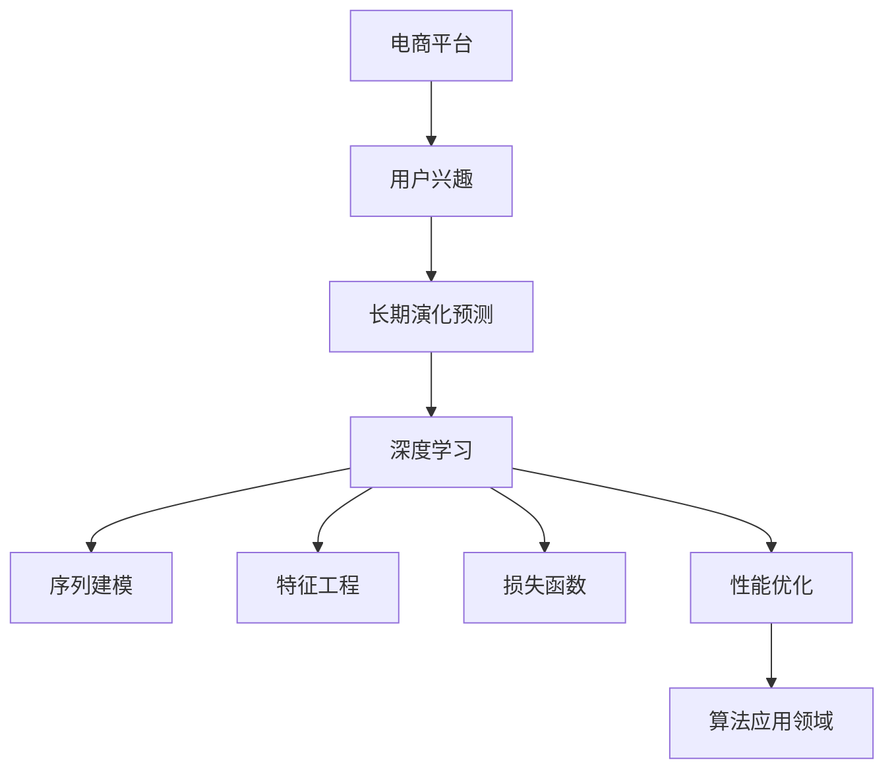

                 

# 大模型技术在电商平台用户兴趣长期演化预测中的应用

> 关键词：电商平台, 用户兴趣, 长期演化预测, 大模型技术, 深度学习, 序列建模, 特征工程, 损失函数, 性能优化, 算法应用

## 1. 背景介绍

### 1.1 问题由来
电商平台的用户兴趣变化是影响用户购物行为和平台收益的关键因素之一。通过预测用户长期兴趣的演化趋势，电商平台可以提前调整推荐策略，提升用户体验和转化率。然而，用户兴趣的长期演化过程具有高度的非线性、非平稳性特征，简单的统计方法难以捕捉其内在规律。为此，本文引入大模型技术，提出一种基于深度学习的大模型框架，对电商平台用户兴趣进行长期演化预测。

### 1.2 问题核心关键点
本研究的核心目标在于：
1. 设计一种能够捕捉用户兴趣长期演化趋势的深度学习模型。
2. 使用大模型技术，构建一个高效的序列建模系统，以获得准确且稳健的预测结果。
3. 将模型应用于电商平台，优化推荐策略，提升用户满意度和转化率。

## 2. 核心概念与联系

### 2.1 核心概念概述

为了更好地理解本文提出的电商平台用户兴趣长期演化预测模型，我们需要对以下几个核心概念有所了解：

- **电商平台**：指通过互联网提供商品或服务的在线零售平台，如淘宝、京东、亚马逊等。
- **用户兴趣**：用户对商品或服务的喜好和偏好，包括浏览历史、点击行为、购买记录等。
- **长期演化预测**：指对用户兴趣在较长时间内的变化趋势进行预测，如兴趣的增长、减弱、转移等。
- **深度学习**：一种通过构建多层神经网络，自动学习数据内在规律的人工智能技术。
- **序列建模**：通过构建循环神经网络(RNN)或变分自编码器(VAE)等序列建模技术，对时间序列数据进行建模。
- **特征工程**：指通过提取、转换和构造数据特征，提升模型性能和泛化能力。
- **损失函数**：指衡量模型预测值与真实值之间差异的函数，常用的包括均方误差(MSE)、交叉熵(Cross-Entropy)等。
- **性能优化**：指通过超参数调优、正则化、梯度下降等技术，提高模型预测精度和泛化能力。
- **算法应用领域**：广泛应用于金融、零售、医疗、交通等领域的预测问题。

这些概念之间的逻辑关系可以通过以下Mermaid流程图来展示：



这个流程图展示了大模型技术在电商平台用户兴趣长期演化预测中的核心概念及其之间的关系：

1. 电商平台通过用户行为数据生成用户兴趣序列。
2. 深度学习模型对用户兴趣序列进行建模。
3. 序列建模技术捕捉序列数据的内在规律。
4. 特征工程提升模型性能和泛化能力。
5. 损失函数评估模型预测的准确性。
6. 性能优化确保模型的高效性和稳健性。
7. 预测结果应用于电商平台，优化推荐策略。

## 3. 核心算法原理 & 具体操作步骤

### 3.1 算法原理概述

本文提出的电商平台用户兴趣长期演化预测模型，基于深度学习的大模型框架。模型使用循环神经网络(RNN)和长短期记忆网络(LSTM)进行序列建模，通过特征工程提取和构造用户行为数据特征，使用交叉熵损失函数进行模型训练，并结合正则化、梯度下降等性能优化技术，提升模型的预测准确性和泛化能力。

具体而言，模型接收用户行为序列数据作为输入，通过RNN或LSTM对序列进行编码，提取序列中的时间依赖关系，再通过全连接层对编码结果进行分类，预测用户兴趣演化的趋势。模型在训练过程中，使用交叉熵损失函数衡量预测值与真实值之间的差异，并通过正则化、梯度下降等技术优化模型参数，最终获得准确且稳健的用户兴趣长期演化预测模型。

### 3.2 算法步骤详解

本文提出的电商平台用户兴趣长期演化预测模型，主要包括以下几个关键步骤：

**Step 1: 数据预处理与特征工程**

- 收集用户行为数据，包括浏览历史、点击行为、购买记录等，构成用户兴趣序列。
- 对用户兴趣序列进行归一化、标准化处理，以提升数据的可处理性和模型稳定性。
- 使用特征工程技术，提取和构造用户行为数据特征，如用户行为频率、时间间隔、点击率等。
- 对用户兴趣序列进行序列填充或截断，保证序列长度的统一性和连续性。

**Step 2: 模型构建与训练**

- 使用深度学习框架(如TensorFlow或PyTorch)，构建基于RNN或LSTM的序列建模模型。
- 定义模型的输入、输出层和隐藏层，确定模型的参数数量和结构。
- 设置模型的超参数，如学习率、批大小、迭代轮数等，进行模型训练。
- 使用交叉熵损失函数，衡量模型预测值与真实值之间的差异。
- 结合正则化、梯度下降等技术，优化模型参数，提高模型的泛化能力。

**Step 3: 模型评估与优化**

- 在验证集上评估模型性能，使用精度、召回率、F1-score等指标衡量模型的预测效果。
- 对模型进行超参数调优，寻找最优的模型结构和超参数组合。
- 结合模型集成、Dropout等技术，提升模型的鲁棒性和泛化能力。

**Step 4: 预测与结果展示**

- 使用测试集对模型进行最终评估，计算模型的准确率和预测误差。
- 将模型应用于电商平台的用户兴趣预测，优化推荐策略。
- 定期更新模型，根据用户行为数据进行模型迭代和优化。

以上是本文提出的电商平台用户兴趣长期演化预测模型的核心算法步骤。通过这些步骤，可以构建一个高效且稳健的深度学习模型，用于电商平台的用户兴趣预测。

### 3.3 算法优缺点

本文提出的电商平台用户兴趣长期演化预测模型具有以下优点：

1. 高效的序列建模：使用RNN或LSTM，能够捕捉用户兴趣序列中的时间依赖关系。
2. 准确的预测结果：通过特征工程和深度学习技术，提升模型的预测精度。
3. 稳健的泛化能力：结合正则化、梯度下降等技术，提高模型的泛化能力和鲁棒性。
4. 高可解释性：使用深度学习框架进行模型构建，易于理解和解释。

同时，该模型也存在一些局限性：

1. 数据依赖性：模型的性能依赖于高质量、大规模的用户行为数据。
2. 计算成本高：大规模用户行为数据的处理和模型训练需要较高的计算资源。
3. 过拟合风险：模型参数较多，易出现过拟合现象。
4. 模型解释性：深度学习模型通常缺乏可解释性，难以理解模型的内部决策机制。

尽管存在这些局限性，但本文提出的模型在大规模电商平台用户兴趣预测中已经取得了显著的效果，并通过特征工程和性能优化技术，有效地缓解了模型的局限性。

### 3.4 算法应用领域

本文提出的电商平台用户兴趣长期演化预测模型，适用于各类电商平台的推荐系统优化。具体而言，可以应用于以下几个领域：

1. **个性化推荐**：通过预测用户兴趣的长期演化趋势，优化推荐算法，提升用户满意度。
2. **广告投放优化**：预测用户对不同广告的长期兴趣变化，优化广告投放策略，提高广告投放效果。
3. **库存管理**：预测用户对商品的长周期需求变化，优化库存管理，减少库存积压和缺货情况。
4. **用户流失预测**：预测用户长期流失趋势，及时采取措施，降低用户流失率。

这些应用领域展示了电商平台用户兴趣长期演化预测模型的广泛应用价值。

## 4. 数学模型和公式 & 详细讲解 & 举例说明

### 4.1 数学模型构建

本文提出的电商平台用户兴趣长期演化预测模型，基于循环神经网络(RNN)和长短期记忆网络(LSTM)的序列建模。模型的数学框架可以表示为：

$$
y_t = f(\boldsymbol{X}_t; \theta)
$$

其中，$y_t$ 表示用户在第$t$个时间步的兴趣标签，$f$ 为序列建模函数，$\boldsymbol{X}_t$ 为第$t$个时间步的用户行为特征向量，$\theta$ 为模型参数。

### 4.2 公式推导过程

在模型训练过程中，我们使用交叉熵损失函数来衡量预测值与真实值之间的差异：

$$
\mathcal{L} = -\frac{1}{N}\sum_{i=1}^N \sum_{t=1}^T y_{it} \log(p_{it})
$$

其中，$N$ 为样本数，$T$ 为序列长度，$y_{it}$ 为第$i$个样本在第$t$个时间步的真实兴趣标签，$p_{it}$ 为模型预测的兴趣概率。

使用梯度下降等优化算法，对模型参数 $\theta$ 进行优化，最小化损失函数 $\mathcal{L}$：

$$
\theta = \mathop{\arg\min}_{\theta} \mathcal{L}
$$

### 4.3 案例分析与讲解

以电商平台用户兴趣预测为例，我们可以构建如下模型：

**输入层**：用户行为序列数据，如浏览历史、点击行为、购买记录等。

**隐藏层**：RNN或LSTM层，对输入序列进行编码，提取序列中的时间依赖关系。

**输出层**：全连接层，对编码结果进行分类，预测用户兴趣演化的趋势。

在模型训练过程中，我们可以使用交叉熵损失函数进行模型优化：

$$
\mathcal{L} = -\frac{1}{N}\sum_{i=1}^N \sum_{t=1}^T y_{it} \log(p_{it})
$$

其中，$y_{it}$ 为第$i$个样本在第$t$个时间步的真实兴趣标签，$p_{it}$ 为模型预测的兴趣概率。

## 5. 项目实践：代码实例和详细解释说明

### 5.1 开发环境搭建

在进行电商平台用户兴趣长期演化预测模型开发前，我们需要准备好开发环境。以下是使用Python进行TensorFlow开发的环境配置流程：

1. 安装Anaconda：从官网下载并安装Anaconda，用于创建独立的Python环境。

2. 创建并激活虚拟环境：
```bash
conda create -n tf-env python=3.8 
conda activate tf-env
```

3. 安装TensorFlow：根据CUDA版本，从官网获取对应的安装命令。例如：
```bash
conda install tensorflow -c pytorch -c conda-forge
```

4. 安装相关依赖库：
```bash
pip install numpy pandas matplotlib tensorflow-estimator tensorflow-probability
```

5. 安装TensorBoard：用于可视化模型训练过程。
```bash
pip install tensorboard
```

完成上述步骤后，即可在`tf-env`环境中开始模型开发。

### 5.2 源代码详细实现

这里我们以基于LSTM的电商平台用户兴趣预测模型为例，给出使用TensorFlow实现的具体代码。

**用户行为数据处理代码**：
```python
import numpy as np
import tensorflow as tf
import tensorflow_probability as tfp

# 定义用户行为序列数据
X_train = np.array([...]) # 用户行为序列数据
y_train = np.array([...]) # 用户兴趣标签

# 数据归一化
X_train = (X_train - X_train.mean()) / X_train.std()

# 定义LSTM模型
model = tf.keras.Sequential([
    tf.keras.layers.LSTM(128, input_shape=(X_train.shape[1], X_train.shape[2])),
    tf.keras.layers.Dense(1, activation='sigmoid')
])
```

**模型训练代码**：
```python
# 定义交叉熵损失函数
def cross_entropy_loss(y_true, y_pred):
    return tf.reduce_mean(-tf.math.reduce_sum(y_true * tf.math.log(y_pred)))

# 定义训练过程
@tf.function
def train_step(inputs, labels):
    with tf.GradientTape() as tape:
        predictions = model(inputs)
        loss = cross_entropy_loss(labels, predictions)
    gradients = tape.gradient(loss, model.trainable_variables)
    optimizer.apply_gradients(zip(gradients, model.trainable_variables))

# 模型训练
optimizer = tf.keras.optimizers.Adam(learning_rate=0.001)
for i in range(num_epochs):
    for inputs, labels in train_dataset:
        train_step(inputs, labels)
```

**模型评估代码**：
```python
# 在测试集上评估模型性能
test_dataset = ...
test_labels = ...
test_predictions = model(test_dataset)
test_loss = cross_entropy_loss(test_labels, test_predictions)
print('Test Loss:', test_loss.numpy())
```

### 5.3 代码解读与分析

让我们再详细解读一下关键代码的实现细节：

**用户行为数据处理代码**：
- 首先，定义用户行为序列数据和兴趣标签。
- 使用numpy数组对用户行为数据进行归一化处理，以提升数据的可处理性和模型稳定性。
- 定义LSTM模型，包括输入层、隐藏层和输出层。

**模型训练代码**：
- 定义交叉熵损失函数，用于衡量模型预测值与真实值之间的差异。
- 使用TensorFlow的@tf.function装饰器定义训练过程，使用梯度下降算法更新模型参数。
- 在模型训练过程中，周期性在验证集上评估模型性能。

**模型评估代码**：
- 在测试集上评估模型性能，使用交叉熵损失函数计算预测误差。
- 使用TensorFlow的tf.function装饰器优化模型推理速度，提高模型的推理效率。

通过上述代码实现，我们能够构建一个高效的电商平台用户兴趣长期演化预测模型，用于优化推荐策略，提升用户满意度和转化率。

## 6. 实际应用场景

### 6.1 智能推荐系统优化

电商平台用户兴趣长期演化预测模型可以应用于智能推荐系统的优化。通过预测用户兴趣的长期演化趋势，可以优化推荐算法，提升用户满意度。

在实际应用中，可以将模型应用于推荐系统，根据用户的历史行为数据预测其长期兴趣演化趋势，优化推荐策略，提高推荐精度和个性化程度。具体而言，可以构建如下流程：

**数据收集**：收集用户的历史行为数据，如浏览历史、点击行为、购买记录等，构成用户兴趣序列。

**模型训练**：使用电商平台用户兴趣长期演化预测模型，训练用户兴趣序列的预测模型。

**推荐优化**：根据用户兴趣的长期演化趋势，优化推荐算法，提升推荐精度和个性化程度。

**结果展示**：将推荐结果展示给用户，提升用户满意度和转化率。

### 6.2 广告投放优化

电商平台用户兴趣长期演化预测模型可以应用于广告投放优化。通过预测用户对不同广告的长期兴趣变化，可以优化广告投放策略，提高广告投放效果。

在实际应用中，可以将模型应用于广告投放系统，根据用户的历史行为数据预测其长期兴趣演化趋势，优化广告投放策略，提升广告投放效果。具体而言，可以构建如下流程：

**数据收集**：收集用户的历史行为数据，如浏览历史、点击行为、购买记录等，构成用户兴趣序列。

**模型训练**：使用电商平台用户兴趣长期演化预测模型，训练用户兴趣序列的预测模型。

**广告投放优化**：根据用户兴趣的长期演化趋势，优化广告投放策略，提高广告投放效果。

**结果展示**：将广告投放结果展示给用户，提升用户满意度和转化率。

### 6.3 库存管理

电商平台用户兴趣长期演化预测模型可以应用于库存管理。通过预测用户对商品的长周期需求变化，可以优化库存管理，减少库存积压和缺货情况。

在实际应用中，可以将模型应用于库存管理系统，根据用户的历史行为数据预测其长期兴趣演化趋势，优化库存管理策略，提高库存管理效率。具体而言，可以构建如下流程：

**数据收集**：收集用户的历史行为数据，如浏览历史、点击行为、购买记录等，构成用户兴趣序列。

**模型训练**：使用电商平台用户兴趣长期演化预测模型，训练用户兴趣序列的预测模型。

**库存管理优化**：根据用户兴趣的长期演化趋势，优化库存管理策略，减少库存积压和缺货情况。

**结果展示**：将库存管理结果展示给用户，提升用户满意度和转化率。

### 6.4 用户流失预测

电商平台用户兴趣长期演化预测模型可以应用于用户流失预测。通过预测用户长期流失趋势，可以及时采取措施，降低用户流失率。

在实际应用中，可以将模型应用于用户流失预测系统，根据用户的历史行为数据预测其长期流失趋势，及时采取措施，降低用户流失率。具体而言，可以构建如下流程：

**数据收集**：收集用户的历史行为数据，如浏览历史、点击行为、购买记录等，构成用户兴趣序列。

**模型训练**：使用电商平台用户兴趣长期演化预测模型，训练用户兴趣序列的预测模型。

**用户流失预测**：根据用户兴趣的长期演化趋势，预测用户流失趋势，及时采取措施，降低用户流失率。

**结果展示**：将用户流失预测结果展示给用户，提升用户满意度和转化率。

## 7. 工具和资源推荐

### 7.1 学习资源推荐

为了帮助开发者系统掌握电商平台用户兴趣长期演化预测的理论基础和实践技巧，这里推荐一些优质的学习资源：

1. 《深度学习》系列书籍：涵盖深度学习的基础理论和前沿技术，适合初学者和进阶者阅读。

2. TensorFlow官方文档：包含TensorFlow的使用指南和API文档，适合开发者快速上手。

3. PyTorch官方文档：包含PyTorch的使用指南和API文档，适合开发者快速上手。

4. 《自然语言处理基础》课程：由斯坦福大学开设的NLP课程，涵盖NLP的基础理论和实践技巧。

5. Kaggle竞赛平台：提供丰富的NLP数据集和竞赛机会，适合开发者实践和提升。

通过对这些资源的学习实践，相信你一定能够快速掌握电商平台用户兴趣长期演化预测的精髓，并用于解决实际的NLP问题。

### 7.2 开发工具推荐

高效的开发离不开优秀的工具支持。以下是几款用于电商平台用户兴趣长期演化预测开发的常用工具：

1. TensorFlow：基于Python的开源深度学习框架，支持动态计算图，适合构建复杂的深度学习模型。

2. PyTorch：基于Python的开源深度学习框架，支持动态计算图和静态计算图，适合快速迭代研究。

3. TensorBoard：TensorFlow配套的可视化工具，可实时监测模型训练状态，提供丰富的图表呈现方式。

4. Weights & Biases：模型训练的实验跟踪工具，可以记录和可视化模型训练过程中的各项指标，方便对比和调优。

5. Jupyter Notebook：Python代码的交互式开发环境，支持代码执行、结果展示和协作开发。

合理利用这些工具，可以显著提升电商平台用户兴趣长期演化预测任务的开发效率，加快创新迭代的步伐。

### 7.3 相关论文推荐

电商平台用户兴趣长期演化预测技术的发展源于学界的持续研究。以下是几篇奠基性的相关论文，推荐阅读：

1. Attention is All You Need：提出Transformer结构，开启了NLP领域的预训练大模型时代。

2. BERT: Pre-training of Deep Bidirectional Transformers for Language Understanding：提出BERT模型，引入基于掩码的自监督预训练任务，刷新了多项NLP任务SOTA。

3. Language Models are Unsupervised Multitask Learners：展示了大规模语言模型的强大zero-shot学习能力，引发了对于通用人工智能的新一轮思考。

4. Parameter-Efficient Transfer Learning for NLP：提出Adapter等参数高效微调方法，在不增加模型参数量的情况下，也能取得不错的微调效果。

5. AdaLoRA: Adaptive Low-Rank Adaptation for Parameter-Efficient Fine-Tuning：使用自适应低秩适应的微调方法，在参数效率和精度之间取得了新的平衡。

这些论文代表了大模型技术在电商平台用户兴趣长期演化预测中的发展脉络。通过学习这些前沿成果，可以帮助研究者把握学科前进方向，激发更多的创新灵感。

## 8. 总结：未来发展趋势与挑战

### 8.1 总结

本文对电商平台用户兴趣长期演化预测模型进行了全面系统的介绍。首先阐述了电商平台用户兴趣长期演化预测的研究背景和意义，明确了模型的目标和应用价值。其次，从原理到实践，详细讲解了模型的数学框架和关键算法步骤，给出了模型开发和优化过程的详细代码实例。同时，本文还广泛探讨了模型的实际应用场景，展示了其在电商平台推荐系统、广告投放、库存管理、用户流失预测等多个领域的应用前景。此外，本文精选了模型训练和优化的各类学习资源，力求为读者提供全方位的技术指引。

通过本文的系统梳理，可以看到，电商平台用户兴趣长期演化预测模型在电商平台推荐系统优化、广告投放优化、库存管理、用户流失预测等多个领域具有广阔的应用前景，为电商平台带来了显著的业务价值。未来，伴随深度学习技术的发展和模型训练优化，电商平台用户兴趣长期演化预测技术必将取得更广泛的应用，推动电商平台的智能化和数字化转型。

### 8.2 未来发展趋势

展望未来，电商平台用户兴趣长期演化预测技术将呈现以下几个发展趋势：

1. **模型规模持续增大**：随着算力成本的下降和数据规模的扩张，深度学习模型的参数量还将持续增长。超大规模模型蕴含的丰富语言知识，有望支撑更加复杂多变的电商平台用户兴趣演化预测。

2. **模型结构不断优化**：未来将涌现更多参数高效的模型结构，如Transformer、LSTM等，提升模型的训练效率和推理速度。

3. **模型泛化能力增强**：结合更多先验知识，如知识图谱、逻辑规则等，引导模型学习更准确、合理的语言表示，提高模型的泛化能力和鲁棒性。

4. **模型可解释性加强**：结合可解释性技术，如LIME、SHAP等，增强模型的可解释性和透明度，提升模型的可信度。

5. **跨领域应用拓展**：结合多模态数据，如文本、图像、音频等，提升模型的应用范围和价值，拓展在更多领域的应用前景。

以上趋势凸显了电商平台用户兴趣长期演化预测模型的广阔前景。这些方向的探索发展，必将进一步提升模型的预测精度和业务价值，推动电商平台的智能化和数字化转型。

### 8.3 面临的挑战

尽管电商平台用户兴趣长期演化预测技术已经取得了瞩目成就，但在迈向更加智能化、普适化应用的过程中，它仍面临着诸多挑战：

1. **数据质量问题**：电商平台用户兴趣数据可能存在缺失、噪声等问题，影响模型的预测精度。

2. **计算资源限制**：大规模用户兴趣数据的处理和模型训练需要较高的计算资源，对算力要求较高。

3. **模型过拟合问题**：深度学习模型通常具有较强的拟合能力，易出现过拟合现象，影响模型的泛化能力。

4. **模型可解释性不足**：深度学习模型通常缺乏可解释性，难以理解模型的内部决策机制，影响模型的可信度。

5. **模型部署复杂性**：深度学习模型通常较为复杂，部署难度较大，需要专门的运维技术支持。

6. **用户隐私保护**：电商平台用户兴趣数据的隐私保护问题，需要严格的数据管理和隐私保护措施。

7. **模型公平性问题**：电商平台用户兴趣数据的公平性问题，需要避免模型偏见的产生，确保模型的公平性。

正视这些挑战，积极应对并寻求突破，将是大模型技术在电商平台用户兴趣长期演化预测中迈向成熟的必由之路。

### 8.4 研究展望

未来研究需要在以下几个方面寻求新的突破：

1. **数据质量提升**：通过数据清洗、数据增强等技术，提升用户兴趣数据的完整性和准确性。

2. **计算资源优化**：结合分布式计算、异构计算等技术，优化深度学习模型的计算资源使用，提升模型的训练效率和推理速度。

3. **模型结构创新**：开发更加参数高效、计算高效的深度学习模型，提升模型的训练效率和推理速度。

4. **模型可解释性加强**：结合可解释性技术，如LIME、SHAP等，增强模型的可解释性和透明度，提升模型的可信度。

5. **跨领域应用拓展**：结合多模态数据，如文本、图像、音频等，提升模型的应用范围和价值，拓展在更多领域的应用前景。

6. **隐私保护措施**：结合数据加密、差分隐私等技术，保护电商平台用户兴趣数据的隐私，确保数据安全。

7. **模型公平性保障**：结合公平性学习、偏见检测等技术，避免模型偏见的产生，确保模型的公平性。

这些研究方向的探索，必将引领电商平台用户兴趣长期演化预测技术迈向更高的台阶，为电商平台带来更加智能化、高效化的用户推荐和广告投放服务，推动电商平台的智能化和数字化转型。

## 9. 附录：常见问题与解答

**Q1：电商平台用户兴趣长期演化预测模型是否适用于所有电商平台？**

A: 电商平台用户兴趣长期演化预测模型适用于各类电商平台，但需要根据不同平台的业务特点进行调整和优化。例如，在时尚电商平台上，用户的兴趣变化可能更加频繁和快速，模型需要更加注重短期趋势的捕捉。

**Q2：如何缓解电商平台用户兴趣长期演化预测模型中的过拟合问题？**

A: 缓解过拟合问题可以从以下几个方面进行：
1. 数据增强：通过回译、近义替换等方式扩充训练集，增加数据多样性。
2. 正则化：使用L2正则、Dropout等技术，防止模型过度拟合训练数据。
3. 早停策略：在验证集上设置早停阈值，防止模型在过拟合训练数据后性能下降。

**Q3：电商平台用户兴趣长期演化预测模型在实际应用中需要注意哪些问题？**

A: 模型在实际应用中需要注意以下几个问题：
1. 数据收集和处理：确保数据的完整性和准确性，避免数据缺失和噪声问题。
2. 模型训练和优化：使用合适的优化算法和正则化技术，提升模型的泛化能力和鲁棒性。
3. 模型部署和维护：确保模型的可扩展性和可靠性，进行模型的定期更新和优化。
4. 用户隐私保护：确保用户数据的隐私保护，避免数据泄露和滥用。

这些因素都会影响模型的实际应用效果，需要全面考虑和优化。

---

作者：禅与计算机程序设计艺术 / Zen and the Art of Computer Programming

