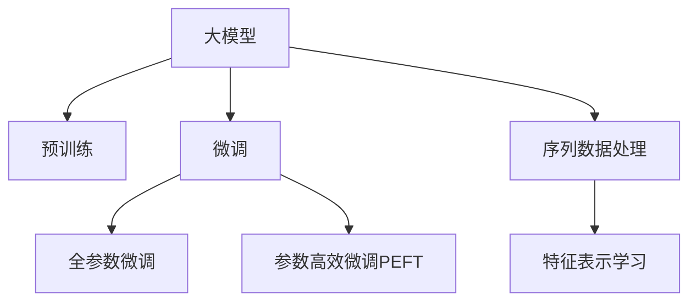

                 

## 1. 背景介绍

### 1.1 问题由来

随着电子商务的快速发展，电商平台已经成为了数以亿计用户的主要购物渠道。用户行为预测是电商平台中一个非常重要的应用场景，它不仅能提升用户体验，还能极大提升电商平台的运营效率。传统的用户行为预测多采用基于统计的方法，如协同过滤、基于规则的方法等，但这些方法难以适应数据量大、维度高、复杂度高的电商数据，导致预测效果不佳。

近年来，随着深度学习技术在自然语言处理领域的突破，大模型技术在用户行为预测中也得到了广泛的应用。大模型通过大规模无标签数据的预训练，学习到丰富的用户行为规律，再通过微调的方式，在电商平台用户行为预测任务中取得了显著的成果。

### 1.2 问题核心关键点

目前，大模型在电商平台用户行为预测中的应用主要基于预训练-微调的框架。即在大规模无标签数据上进行预训练，学习用户行为的基本规律，再在电商平台的标注数据上进行微调，进一步优化模型的预测能力。

大模型技术在用户行为预测中的核心关键点包括：

- 大规模数据预训练：利用无标签数据进行预训练，学习用户行为的基本规律。
- 微调技术：在电商平台标注数据上进行有监督的微调，优化模型针对电商场景的预测能力。
- 数据增强：通过数据增强技术提升模型泛化能力，应对电商平台用户行为的多样性。
- 多任务学习：通过多任务学习的方式，提升模型对用户行为多维度的预测能力。

这些关键点共同构成了大模型在电商平台用户行为预测中的应用框架，使得模型能够有效地适应电商数据的高维性、稀疏性和复杂性。

## 2. 核心概念与联系

### 2.1 核心概念概述

为更好地理解大模型在电商平台用户行为预测中的应用，本节将介绍几个密切相关的核心概念：

- 大模型：以Transformer模型为代表的大规模预训练语言模型。通过在大规模无标签文本数据上进行预训练，学习通用的语言表示，具备强大的语言理解和生成能力。
- 预训练(Pre-training)：指在大规模无标签文本数据上，通过自监督学习任务训练通用语言模型的过程。常见的预训练任务包括掩码语言模型、下一句预测等。
- 微调(Fine-tuning)：指在预训练模型的基础上，使用下游任务的少量标注数据，通过有监督学习优化模型在特定任务上的性能。
- 迁移学习(Transfer Learning)：指将一个领域学习到的知识，迁移应用到另一个不同但相关的领域的学习范式。大模型的预训练-微调过程即是一种典型的迁移学习方式。
- 序列数据处理：电商平台用户行为数据以序列形式呈现，如用户浏览记录、点击记录等，需要应用特殊的序列处理技术，如Transformer模型。
- 特征表示学习：电商平台用户行为数据具有高维稀疏性，需要通过特征表示学习技术将原始数据转化为模型能够处理的低维特征向量。

这些核心概念之间的逻辑关系可以通过以下Mermaid流程图来展示：



这个流程图展示了大模型的核心概念及其之间的关系：

1. 大模型通过预训练获得基础能力。
2. 微调是对预训练模型进行任务特定的优化，可以分为全参数微调和参数高效微调（PEFT）。
3. 序列数据处理技术使得大模型能够高效处理电商平台的序列数据。
4. 特征表示学习技术将原始数据转化为模型能够处理的低维特征向量，提升模型处理能力。

这些概念共同构成了大模型在电商平台用户行为预测中的应用框架，使其能够有效地适应电商数据的特点，提升模型预测性能。

## 3. 核心算法原理 & 具体操作步骤

### 3.1 算法原理概述

基于大模型的电商平台用户行为预测方法，本质上是一种序列分类任务，即通过预训练模型对用户行为序列进行分类。假设用户行为序列为 $S=\{x_1,x_2,...,x_T\}$，其中 $x_t$ 表示第 $t$ 个用户行为，$y$ 表示用户行为分类标签。模型的输入为序列 $S$，输出为分类标签 $y$。

大模型在预训练阶段学习到的通用语言表示能力，可以迁移到电商平台的序列数据上，通过微调进一步优化分类效果。微调的过程如下：

1. 将用户行为序列 $S$ 输入到预训练模型中，得到序列表示 $Z$。
2. 将序列表示 $Z$ 送入全连接层或softmax层，得到分类概率分布 $P(y|Z)$。
3. 利用电商平台标注数据 $D$，通过有监督的交叉熵损失函数训练模型参数，使得模型输出更贴近真实标签。

形式化地，假设预训练模型为 $M_{\theta}$，其中 $\theta$ 为预训练得到的模型参数。假设电商平台标注数据集 $D=\{(S_i,y_i)\}_{i=1}^N$，微调的目标是找到新的模型参数 $\hat{\theta}$，使得：

$$
\hat{\theta}=\mathop{\arg\min}_{\theta} \mathcal{L}(M_{\theta},D)
$$

其中 $\mathcal{L}$ 为针对电商平台标注数据的交叉熵损失函数，用于衡量模型预测输出与真实标签之间的差异。

### 3.2 算法步骤详解

基于大模型的电商平台用户行为预测，一般包括以下几个关键步骤：

**Step 1: 准备预训练模型和数据集**
- 选择合适的预训练语言模型 $M_{\theta}$ 作为初始化参数，如 BERT、GPT等。
- 准备电商平台标注数据集 $D$，划分为训练集、验证集和测试集。一般要求标注数据与预训练数据的分布不要差异过大。

**Step 2: 添加任务适配层**
- 根据任务类型，在预训练模型顶层设计合适的输出层和损失函数。
- 对于分类任务，通常在顶层添加线性分类器和交叉熵损失函数。
- 对于生成任务，通常使用语言模型的解码器输出概率分布，并以负对数似然为损失函数。

**Step 3: 设置微调超参数**
- 选择合适的优化算法及其参数，如 AdamW、SGD 等，设置学习率、批大小、迭代轮数等。
- 设置正则化技术及强度，包括权重衰减、Dropout、Early Stopping等。
- 确定冻结预训练参数的策略，如仅微调顶层，或全部参数都参与微调。

**Step 4: 执行梯度训练**
- 将训练集数据分批次输入模型，前向传播计算损失函数。
- 反向传播计算参数梯度，根据设定的优化算法和学习率更新模型参数。
- 周期性在验证集上评估模型性能，根据性能指标决定是否触发 Early Stopping。
- 重复上述步骤直到满足预设的迭代轮数或 Early Stopping 条件。

**Step 5: 测试和部署**
- 在测试集上评估微调后模型 $M_{\hat{\theta}}$ 的性能，对比微调前后的精度提升。
- 使用微调后的模型对新样本进行推理预测，集成到实际的应用系统中。
- 持续收集新的数据，定期重新微调模型，以适应数据分布的变化。

以上是基于大模型进行电商平台用户行为预测的一般流程。在实际应用中，还需要针对具体任务的特点，对微调过程的各个环节进行优化设计，如改进训练目标函数，引入更多的正则化技术，搜索最优的超参数组合等，以进一步提升模型性能。

### 3.3 算法优缺点

基于大模型的电商平台用户行为预测方法具有以下优点：

1. 简单高效。只需准备少量标注数据，即可对预训练模型进行快速适配，获得较大的性能提升。
2. 通用适用。适用于各种电商平台的分类任务，包括商品推荐、用户画像、行为分析等，设计简单的任务适配层即可实现微调。
3. 参数高效。利用参数高效微调技术，在固定大部分预训练权重不变的情况下，仍可取得不错的提升。
4. 效果显著。在学术界和工业界的诸多任务上，基于微调的方法已经刷新了多项NLP任务SOTA。

同时，该方法也存在一定的局限性：

1. 依赖标注数据。微调的效果很大程度上取决于标注数据的质量和数量，获取高质量标注数据的成本较高。
2. 迁移能力有限。当目标任务与预训练数据的分布差异较大时，微调的性能提升有限。
3. 负面效果传递。预训练模型的固有偏见、有害信息等，可能通过微调传递到下游任务，造成负面影响。
4. 可解释性不足。微调模型的决策过程通常缺乏可解释性，难以对其推理逻辑进行分析和调试。

尽管存在这些局限性，但就目前而言，基于大模型的电商平台用户行为预测方法仍是最主流范式。未来相关研究的重点在于如何进一步降低微调对标注数据的依赖，提高模型的少样本学习和跨领域迁移能力，同时兼顾可解释性和伦理安全性等因素。

### 3.4 算法应用领域

基于大模型的电商平台用户行为预测方法，已经在推荐系统、广告定向、用户画像等多个电商领域得到了广泛的应用，涵盖了从商品推荐到个性化营销等诸多环节。具体包括：

- 推荐系统：根据用户历史行为和兴趣，预测用户可能感兴趣的商品，推荐系统可以极大地提升用户购买转化率和购物体验。
- 广告定向：根据用户行为数据，预测用户对不同广告的响应概率，实现广告的精准投放。
- 用户画像：构建用户行为数据的高维特征向量，挖掘用户多维度的兴趣和偏好，用于个性化推荐和定制化营销。
- 行为分析：分析用户的行为模式和趋势，用于电商平台的策略优化和用户体验提升。

除了上述这些经典应用外，大模型的用户行为预测方法还被创新性地应用于更多场景中，如电商平台中的实时推荐、智能客服系统、用户行为异常检测等，为电商平台的数字化转型和运营优化提供了有力的技术支撑。

## 4. 数学模型和公式 & 详细讲解  
### 4.1 数学模型构建

本节将使用数学语言对基于大模型的电商平台用户行为预测过程进行更加严格的刻画。

记预训练语言模型为 $M_{\theta}$，其中 $\theta$ 为预训练得到的模型参数。假设电商平台标注数据集为 $D=\{(S_i,y_i)\}_{i=1}^N$，其中 $S_i=\{x_{i1},x_{i2},...,x_{iT}\}$ 为第 $i$ 个用户的行为序列，$y_i$ 表示该序列的分类标签。

定义模型 $M_{\theta}$ 在用户行为序列 $S$ 上的损失函数为 $\ell(M_{\theta}(S),y)$，则在数据集 $D$ 上的经验风险为：

$$
\mathcal{L}(\theta) = \frac{1}{N} \sum_{i=1}^N \ell(M_{\theta}(S_i),y_i)
$$

其中 $\ell$ 为针对电商平台标注数据的交叉熵损失函数，用于衡量模型预测输出与真实标签之间的差异。形式上，交叉熵损失函数为：

$$
\ell(M_{\theta}(S),y) = -\sum_{t=1}^T y_t \log M_{\theta}(x_t)
$$

其中 $y_t$ 表示用户行为序列 $S$ 中第 $t$ 个行为标签。

通过梯度下降等优化算法，微调过程不断更新模型参数 $\theta$，最小化损失函数 $\mathcal{L}$，使得模型输出逼近真实标签。由于 $\theta$ 已经通过预训练获得了较好的初始化，因此即便在电商平台的少量标注数据上进行微调，也能较快收敛到理想的模型参数 $\hat{\theta}$。

### 4.2 公式推导过程

以下我们以电商平台用户行为预测为例，推导交叉熵损失函数及其梯度的计算公式。

假设模型 $M_{\theta}$ 在输入 $S$ 上的输出为 $\hat{y}=M_{\theta}(S) \in [0,1]$，表示用户行为序列的分类概率。真实标签 $y \in \{0,1\}$。则交叉熵损失函数定义为：

$$
\ell(M_{\theta}(S),y) = -y \log \hat{y} - (1-y) \log (1-\hat{y})
$$

将其代入经验风险公式，得：

$$
\mathcal{L}(\theta) = -\frac{1}{N}\sum_{i=1}^N \sum_{t=1}^T [y_{it} \log M_{\theta}(x_{it})+(1-y_{it}) \log(1-M_{\theta}(x_{it}))
$$

根据链式法则，损失函数对参数 $\theta_k$ 的梯度为：

$$
\frac{\partial \mathcal{L}(\theta)}{\partial \theta_k} = -\frac{1}{N}\sum_{i=1}^N \sum_{t=1}^T \left(\frac{y_{it}}{M_{\theta}(x_{it})}-\frac{1-y_{it}}{1-M_{\theta}(x_{it})}\right) \frac{\partial M_{\theta}(x_{it})}{\partial \theta_k}
$$

其中 $\frac{\partial M_{\theta}(x_{it})}{\partial \theta_k}$ 可进一步递归展开，利用自动微分技术完成计算。

在得到损失函数的梯度后，即可带入参数更新公式，完成模型的迭代优化。重复上述过程直至收敛，最终得到适应电商平台标注数据的最优模型参数 $\theta^*$。

## 5. 项目实践：代码实例和详细解释说明
### 5.1 开发环境搭建

在进行电商平台用户行为预测实践前，我们需要准备好开发环境。以下是使用Python进行PyTorch开发的环境配置流程：

1. 安装Anaconda：从官网下载并安装Anaconda，用于创建独立的Python环境。

2. 创建并激活虚拟环境：
```bash
conda create -n pytorch-env python=3.8 
conda activate pytorch-env
```

3. 安装PyTorch：根据CUDA版本，从官网获取对应的安装命令。例如：
```bash
conda install pytorch torchvision torchaudio cudatoolkit=11.1 -c pytorch -c conda-forge
```

4. 安装Transformers库：
```bash
pip install transformers
```

5. 安装各类工具包：
```bash
pip install numpy pandas scikit-learn matplotlib tqdm jupyter notebook ipython
```

完成上述步骤后，即可在`pytorch-env`环境中开始用户行为预测实践。

### 5.2 源代码详细实现

这里我们以电商平台推荐系统为例，给出使用Transformers库对BERT模型进行用户行为预测的PyTorch代码实现。

首先，定义数据处理函数：

```python
from transformers import BertTokenizer
from torch.utils.data import Dataset
import torch

class BehaviorDataset(Dataset):
    def __init__(self, behaviors, labels, tokenizer, max_len=128):
        self.behaviors = behaviors
        self.labels = labels
        self.tokenizer = tokenizer
        self.max_len = max_len
        
    def __len__(self):
        return len(self.behaviors)
    
    def __getitem__(self, item):
        behavior = self.behaviors[item]
        label = self.labels[item]
        
        encoding = self.tokenizer(behavior, return_tensors='pt', max_length=self.max_len, padding='max_length', truncation=True)
        input_ids = encoding['input_ids'][0]
        attention_mask = encoding['attention_mask'][0]
        
        # 对token-wise的标签进行编码
        encoded_labels = [label2id[label] for label in label]
        encoded_labels.extend([label2id['O']] * (self.max_len - len(encoded_labels)))
        labels = torch.tensor(encoded_labels, dtype=torch.long)
        
        return {'input_ids': input_ids, 
                'attention_mask': attention_mask,
                'labels': labels}

# 标签与id的映射
label2id = {'O': 0, 'buy': 1, 'view': 2, 'cart': 3, 'recommend': 4, 'search': 5, 'pageview': 6}
id2label = {v: k for k, v in label2id.items()}

# 创建dataset
tokenizer = BertTokenizer.from_pretrained('bert-base-cased')

train_dataset = BehaviorDataset(train_behaviors, train_labels, tokenizer)
dev_dataset = BehaviorDataset(dev_behaviors, dev_labels, tokenizer)
test_dataset = BehaviorDataset(test_behaviors, test_labels, tokenizer)
```

然后，定义模型和优化器：

```python
from transformers import BertForTokenClassification, AdamW

model = BertForTokenClassification.from_pretrained('bert-base-cased', num_labels=len(label2id))

optimizer = AdamW(model.parameters(), lr=2e-5)
```

接着，定义训练和评估函数：

```python
from torch.utils.data import DataLoader
from tqdm import tqdm
from sklearn.metrics import classification_report

device = torch.device('cuda') if torch.cuda.is_available() else torch.device('cpu')
model.to(device)

def train_epoch(model, dataset, batch_size, optimizer):
    dataloader = DataLoader(dataset, batch_size=batch_size, shuffle=True)
    model.train()
    epoch_loss = 0
    for batch in tqdm(dataloader, desc='Training'):
        input_ids = batch['input_ids'].to(device)
        attention_mask = batch['attention_mask'].to(device)
        labels = batch['labels'].to(device)
        model.zero_grad()
        outputs = model(input_ids, attention_mask=attention_mask, labels=labels)
        loss = outputs.loss
        epoch_loss += loss.item()
        loss.backward()
        optimizer.step()
    return epoch_loss / len(dataloader)

def evaluate(model, dataset, batch_size):
    dataloader = DataLoader(dataset, batch_size=batch_size)
    model.eval()
    preds, labels = [], []
    with torch.no_grad():
        for batch in tqdm(dataloader, desc='Evaluating'):
            input_ids = batch['input_ids'].to(device)
            attention_mask = batch['attention_mask'].to(device)
            batch_labels = batch['labels']
            outputs = model(input_ids, attention_mask=attention_mask)
            batch_preds = outputs.logits.argmax(dim=2).to('cpu').tolist()
            batch_labels = batch_labels.to('cpu').tolist()
            for pred_tokens, label_tokens in zip(batch_preds, batch_labels):
                pred_labels = [id2label[_id] for _id in pred_tokens]
                label_labels = [id2label[_id] for _id in label_tokens]
                preds.append(pred_labels[:len(label_tokens)])
                labels.append(label_labels)
                
    print(classification_report(labels, preds))
```

最后，启动训练流程并在测试集上评估：

```python
epochs = 5
batch_size = 16

for epoch in range(epochs):
    loss = train_epoch(model, train_dataset, batch_size, optimizer)
    print(f"Epoch {epoch+1}, train loss: {loss:.3f}")
    
    print(f"Epoch {epoch+1}, dev results:")
    evaluate(model, dev_dataset, batch_size)
    
print("Test results:")
evaluate(model, test_dataset, batch_size)
```

以上就是使用PyTorch对BERT进行电商平台用户行为预测的完整代码实现。可以看到，得益于Transformers库的强大封装，我们可以用相对简洁的代码完成BERT模型的加载和微调。

### 5.3 代码解读与分析

让我们再详细解读一下关键代码的实现细节：

**BehaviorDataset类**：
- `__init__`方法：初始化行为、标签、分词器等关键组件。
- `__len__`方法：返回数据集的样本数量。
- `__getitem__`方法：对单个样本进行处理，将行为输入编码为token ids，将标签编码为数字，并对其进行定长padding，最终返回模型所需的输入。

**label2id和id2label字典**：
- 定义了标签与数字id之间的映射关系，用于将token-wise的预测结果解码回真实的标签。

**训练和评估函数**：
- 使用PyTorch的DataLoader对数据集进行批次化加载，供模型训练和推理使用。
- 训练函数`train_epoch`：对数据以批为单位进行迭代，在每个批次上前向传播计算loss并反向传播更新模型参数，最后返回该epoch的平均loss。
- 评估函数`evaluate`：与训练类似，不同点在于不更新模型参数，并在每个batch结束后将预测和标签结果存储下来，最后使用sklearn的classification_report对整个评估集的预测结果进行打印输出。

**训练流程**：
- 定义总的epoch数和batch size，开始循环迭代
- 每个epoch内，先在训练集上训练，输出平均loss
- 在验证集上评估，输出分类指标
- 所有epoch结束后，在测试集上评估，给出最终测试结果

可以看到，PyTorch配合Transformers库使得BERT微调的代码实现变得简洁高效。开发者可以将更多精力放在数据处理、模型改进等高层逻辑上，而不必过多关注底层的实现细节。

当然，工业级的系统实现还需考虑更多因素，如模型的保存和部署、超参数的自动搜索、更灵活的任务适配层等。但核心的微调范式基本与此类似。

## 6. 实际应用场景

### 6.1 电商平台推荐系统

基于大模型的电商平台推荐系统，可以显著提升用户的购物体验和购买转化率。传统的推荐系统往往只依赖用户的历史行为数据进行物品推荐，难以充分理解用户的兴趣和需求。而使用微调后的推荐模型，可以挖掘用户行为的语义信息，从高维稀疏数据中提取有用特征，更准确地预测用户兴趣，提供个性化的商品推荐。

在技术实现上，可以收集用户浏览、点击、购买等行为数据，提取和用户交互的物品标题、描述、标签等文本内容。将文本内容作为模型输入，用户的后续行为（如是否点击、购买等）作为监督信号，在此基础上微调预训练语言模型。微调后的模型能够从文本内容中准确把握用户的兴趣点。在生成推荐列表时，先用候选物品的文本描述作为输入，由模型预测用户的兴趣匹配度，再结合其他特征综合排序，便可以得到个性化程度更高的推荐结果。

### 6.2 广告定向

通过基于大模型的用户行为预测技术，可以更精准地进行广告定向。传统广告定向往往只能依据用户的点击行为进行推荐，难以捕捉用户的真实兴趣和需求。而使用微调后的用户行为预测模型，可以深入分析用户浏览记录、点击记录等序列数据，挖掘用户的兴趣点和行为模式，从而实现更加精准的广告投放。

在具体实现中，可以使用用户的浏览记录作为输入，通过微调模型预测用户对不同广告的响应概率，实现广告的个性化推荐和定向投放。结合用户在平台上的其他行为数据，如搜索记录、购物车记录等，可以进一步提升广告的转化率和广告投放的效果。

### 6.3 用户画像

构建用户画像是大模型在电商平台用户行为预测中的一个重要应用。通过分析用户的行为序列数据，可以挖掘用户的兴趣和偏好，构建高维度的用户画像，用于个性化推荐和定制化营销。

在实践中，可以将用户的浏览记录、点击记录、搜索记录等行为数据作为模型输入，通过微调模型学习用户的兴趣和行为模式。通过高维特征向量的表示，可以更全面地了解用户的兴趣偏好，为电商平台提供更精准的用户画像，支持个性化的推荐和营销活动。

### 6.4 行为分析

电商平台用户行为分析是大模型在电商平台用户行为预测中的一个关键应用。通过分析用户的行为数据，可以挖掘用户的行为模式和趋势，用于电商平台的策略优化和用户体验提升。

在具体实现中，可以使用用户的浏览记录、点击记录、购买记录等行为数据作为模型输入，通过微调模型预测用户的行为意图。结合平台上的其他数据，如商品评分、用户反馈等，可以进一步提升电商平台的运营效果和用户体验。

## 7. 工具和资源推荐
### 7.1 学习资源推荐

为了帮助开发者系统掌握大模型在电商平台用户行为预测的理论基础和实践技巧，这里推荐一些优质的学习资源：

1. 《深度学习理论与实践》系列博文：由大模型技术专家撰写，深入浅出地介绍了深度学习的基本理论和实践技巧，涵盖了电商数据处理和特征表示等关键内容。

2. CS229《机器学习》课程：斯坦福大学开设的机器学习明星课程，有Lecture视频和配套作业，带你全面掌握机器学习的基本概念和经典算法。

3. 《深度学习框架PyTorch》书籍：PyTorch官方团队所著，全面介绍了PyTorch的使用方法和技巧，适合初学者入门。

4. Weights & Biases：模型训练的实验跟踪工具，可以记录和可视化模型训练过程中的各项指标，方便对比和调优。与主流深度学习框架无缝集成。

5. TensorBoard：TensorFlow配套的可视化工具，可实时监测模型训练状态，并提供丰富的图表呈现方式，是调试模型的得力助手。

通过对这些资源的学习实践，相信你一定能够快速掌握大模型在电商平台用户行为预测的精髓，并用于解决实际的电商问题。
###  7.2 开发工具推荐

高效的开发离不开优秀的工具支持。以下是几款用于电商平台用户行为预测开发的常用工具：

1. PyTorch：基于Python的开源深度学习框架，灵活动态的计算图，适合快速迭代研究。大部分预训练语言模型都有PyTorch版本的实现。

2. TensorFlow：由Google主导开发的开源深度学习框架，生产部署方便，适合大规模工程应用。同样有丰富的预训练语言模型资源。

3. Transformers库：HuggingFace开发的NLP工具库，集成了众多SOTA语言模型，支持PyTorch和TensorFlow，是进行电商平台用户行为预测开发的利器。

4. Weights & Biases：模型训练的实验跟踪工具，可以记录和可视化模型训练过程中的各项指标，方便对比和调优。与主流深度学习框架无缝集成。

5. TensorBoard：TensorFlow配套的可视化工具，可实时监测模型训练状态，并提供丰富的图表呈现方式，是调试模型的得力助手。

6. Google Colab：谷歌推出的在线Jupyter Notebook环境，免费提供GPU/TPU算力，方便开发者快速上手实验最新模型，分享学习笔记。

合理利用这些工具，可以显著提升电商平台用户行为预测任务的开发效率，加快创新迭代的步伐。

### 7.3 相关论文推荐

大模型在电商平台用户行为预测中的应用源于学界的持续研究。以下是几篇奠基性的相关论文，推荐阅读：

1. Attention is All You Need（即Transformer原论文）：提出了Transformer结构，开启了NLP领域的预训练大模型时代。

2. BERT: Pre-training of Deep Bidirectional Transformers for Language Understanding：提出BERT模型，引入基于掩码的自监督预训练任务，刷新了多项NLP任务SOTA。

3. Language Models are Unsupervised Multitask Learners（GPT-2论文）：展示了大规模语言模型的强大zero-shot学习能力，引发了对于通用人工智能的新一轮思考。

4. Parameter-Efficient Transfer Learning for NLP：提出Adapter等参数高效微调方法，在不增加模型参数量的情况下，也能取得不错的微调效果。

5. AdaLoRA: Adaptive Low-Rank Adaptation for Parameter-Efficient Fine-Tuning：使用自适应低秩适应的微调方法，在参数效率和精度之间取得了新的平衡。

这些论文代表了大模型在电商平台用户行为预测中的应用框架和发展脉络。通过学习这些前沿成果，可以帮助研究者把握学科前进方向，激发更多的创新灵感。

## 8. 总结：未来发展趋势与挑战

### 8.1 总结

本文对基于大模型的电商平台用户行为预测方法进行了全面系统的介绍。首先阐述了大模型在电商平台用户行为预测中的应用背景和意义，明确了大模型在电商数据高维稀疏性处理中的优势。其次，从原理到实践，详细讲解了电商平台的推荐系统、广告定向、用户画像等多个电商场景中的应用。最后，本文还广泛探讨了大模型在电商平台的未来应用前景，展示了其在推荐系统、广告定向、用户画像等方面的巨大潜力。

通过本文的系统梳理，可以看到，基于大模型的电商平台用户行为预测方法，已经在推荐系统、广告定向、用户画像等多个电商场景中取得显著成果，为用户行为预测带来了新的突破。大模型的强大语言理解能力，使得电商平台的用户行为预测更准确、更全面、更个性化。未来，伴随预训练语言模型和微调方法的持续演进，相信NLP技术将在更广阔的应用领域大放异彩。

### 8.2 未来发展趋势

展望未来，大模型在电商平台用户行为预测的应用将呈现以下几个发展趋势：

1. 模型规模持续增大。随着算力成本的下降和数据规模的扩张，预训练语言模型的参数量还将持续增长。超大规模语言模型蕴含的丰富语言知识，有望支撑更加复杂多变的电商数据处理任务。

2. 微调方法日趋多样。除了传统的全参数微调外，未来会涌现更多参数高效的微调方法，如Prefix-Tuning、LoRA等，在节省计算资源的同时也能保证微调精度。

3. 持续学习成为常态。随着电商数据分布的不断变化，微调模型也需要持续学习新知识以保持性能。如何在不遗忘原有知识的同时，高效吸收新样本信息，将成为重要的研究课题。

4. 标注样本需求降低。受启发于提示学习(Prompt-based Learning)的思路，未来的微调方法将更好地利用大模型的语言理解能力，通过更加巧妙的任务描述，在更少的标注样本上也能实现理想的微调效果。

5. 标注样本需求降低。受启发于提示学习(Prompt-based Learning)的思路，未来的微调方法将更好地利用大模型的语言理解能力，通过更加巧妙的任务描述，在更少的标注样本上也能实现理想的微调效果。

6. 多模态微调崛起。当前的微调主要聚焦于纯文本数据，未来会进一步拓展到图像、视频、语音等多模态数据微调。多模态信息的融合，将显著提升语言模型对现实世界的理解和建模能力。

7. 模型通用性增强。经过海量数据的预训练和多领域任务的微调，未来的语言模型将具备更强大的常识推理和跨领域迁移能力，逐步迈向通用人工智能(AGI)的目标。

以上趋势凸显了大模型在电商平台用户行为预测的应用前景。这些方向的探索发展，必将进一步提升电商平台的用户行为预测能力，为电商平台的用户体验和运营优化带来更深刻的变革。

### 8.3 面临的挑战

尽管大模型在电商平台用户行为预测中的应用已经取得了显著成效，但在迈向更加智能化、普适化应用的过程中，仍面临诸多挑战：

1. 标注成本瓶颈。虽然微调可以大幅度降低标注数据的需求，但对于长尾应用场景，仍然难以获得充足的高质量标注数据，成为制约微调性能的瓶颈。如何进一步降低微调对标注样本的依赖，将是一大难题。

2. 模型鲁棒性不足。当前微调模型面对域外数据时，泛化性能往往大打折扣。对于测试样本的微小扰动，微调模型的预测也容易发生波动。如何提高微调模型的鲁棒性，避免灾难性遗忘，还需要更多理论和实践的积累。

3. 推理效率有待提高。大规模语言模型虽然精度高，但在实际部署时往往面临推理速度慢、内存占用大等效率问题。如何在保证性能的同时，简化模型结构，提升推理速度，优化资源占用，将是重要的优化方向。

4. 可解释性亟需加强。当前微调模型更像是"黑盒"系统，难以解释其内部工作机制和决策逻辑。对于电商平台的复杂任务，算法的可解释性和可审计性尤为重要。如何赋予微调模型更强的可解释性，将是亟待攻克的难题。

5. 安全性有待保障。预训练语言模型难免会学习到有偏见、有害的信息，通过微调传递到下游任务，产生误导性、歧视性的输出，给实际应用带来安全隐患。如何从数据和算法层面消除模型偏见，避免恶意用途，确保输出的安全性，也将是重要的研究课题。

6. 知识整合能力不足。现有的微调模型往往局限于任务内数据，难以灵活吸收和运用更广泛的先验知识。如何让微调过程更好地与外部知识库、规则库等专家知识结合，形成更加全面、准确的信息整合能力，还有很大的想象空间。

正视微调面临的这些挑战，积极应对并寻求突破，将是大模型在电商平台用户行为预测中走向成熟的必由之路。相信随着学界和产业界的共同努力，这些挑战终将一一被克服，大模型在电商平台用户行为预测中的应用必将在未来取得更加显著的成果。

### 8.4 研究展望

面对大模型在电商平台用户行为预测所面临的挑战，未来的研究需要在以下几个方面寻求新的突破：

1. 探索无监督和半监督微调方法。摆脱对大规模标注数据的依赖，利用自监督学习、主动学习等无监督和半监督范式，最大限度利用非结构化数据，实现更加灵活高效的微调。

2. 研究参数高效和计算高效的微调范式。开发更加参数高效的微调方法，在固定大部分预训练参数的同时，只更新极少量的任务相关参数。同时优化微调模型的计算图，减少前向传播和反向传播的资源消耗，实现更加轻量级、实时性的部署。

3. 引入因果和对比学习范式。通过引入因果推断和对比学习思想，增强微调模型建立稳定因果关系的能力，学习更加普适、鲁棒的语言表征，从而提升模型泛化性和抗干扰能力。

4. 引入更多先验知识。将符号化的先验知识，如知识图谱、逻辑规则等，与神经网络模型进行巧妙融合，引导微调过程学习更准确、合理的语言模型。同时加强不同模态数据的整合，实现视觉、语音等多模态信息与文本信息的协同建模。

5. 结合因果分析和博弈论工具。将因果分析方法引入微调模型，识别出模型决策的关键特征，增强输出解释的因果性和逻辑性。借助博弈论工具刻画人机交互过程，主动探索并规避模型的脆弱点，提高系统稳定性。

6. 纳入伦理道德约束。在模型训练目标中引入伦理导向的评估指标，过滤和惩罚有偏见、有害的输出倾向。同时加强人工干预和审核，建立模型行为的监管机制，确保输出符合人类价值观和伦理道德。

这些研究方向的探索，必将引领大模型在电商平台用户行为预测技术迈向更高的台阶，为构建安全、可靠、可解释、可控的智能系统铺平道路。面向未来，大模型在电商平台用户行为预测技术还需要与其他人工智能技术进行更深入的融合，如知识表示、因果推理、强化学习等，多路径协同发力，共同推动自然语言理解和智能交互系统的进步。只有勇于创新、敢于突破，才能不断拓展语言模型的边界，让智能技术更好地造福人类社会。

## 9. 附录：常见问题与解答

**Q1：大模型在电商平台用户行为预测中的应用是否只限于推荐系统？**

A: 大模型在电商平台用户行为预测中的应用不仅限于推荐系统。除了推荐系统，还包括广告定向、用户画像、行为分析等多个电商场景。通过大模型在电商平台用户行为预测中的微调，可以实现对用户兴趣和行为的全面了解，提升电商平台的运营效果和用户体验。

**Q2：微调过程中如何选择合适的学习率？**

A: 微调过程中，学习率的选择非常重要，通常需要从1e-5开始调参，逐步减小学习率。过大的学习率容易破坏预训练权重，导致过拟合。可以使用warmup策略，在开始阶段使用较小的学习率，再逐渐过渡到预设值。需要注意的是，不同的优化器(如AdamW、Adafactor等)以及不同的学习率调度策略，可能需要设置不同的学习率阈值。

**Q3：微调过程中如何缓解过拟合问题？**

A: 微调过程中缓解过拟合问题的方法包括：数据增强、正则化技术、对抗训练、参数高效微调等。数据增强可以通过回译、近义替换等方式扩充训练集，防止模型过拟合。正则化技术包括L2正则、Dropout、Early Stopping等，用于控制模型的复杂度。对抗训练引入对抗样本，提高模型的鲁棒性。参数高效微调只调整少量参数，减小过拟合风险。

**Q4：大模型在电商平台用户行为预测中如何处理高维稀疏数据？**

A: 大模型在电商平台用户行为预测中处理高维稀疏数据的方法包括特征表示学习、序列数据处理等。特征表示学习将原始数据转化为模型能够处理的低维特征向量，提升模型处理能力。序列数据处理技术使得大模型能够高效处理电商平台的序列数据，通过Transformer等模型，将高维稀疏数据转化为序列数据，进行分类预测。

**Q5：微调后的大模型在实际部署时如何优化效率？**

A: 微调后的大模型在实际部署时，可以通过优化模型结构、使用混合精度训练、模型并行等方法进行效率优化。模型裁剪去除不必要的层和参数，减小模型尺寸，加快推理速度。混合精度训练将浮点模型转为定点模型，压缩存储空间，提高计算效率。模型并行通过分布式计算，提升计算效率，缩短推理时间。

通过合理利用这些方法，可以显著提升大模型在电商平台用户行为预测中的部署效率，满足大规模应用的需求。

---

作者：禅与计算机程序设计艺术 / Zen and the Art of Computer Programming

