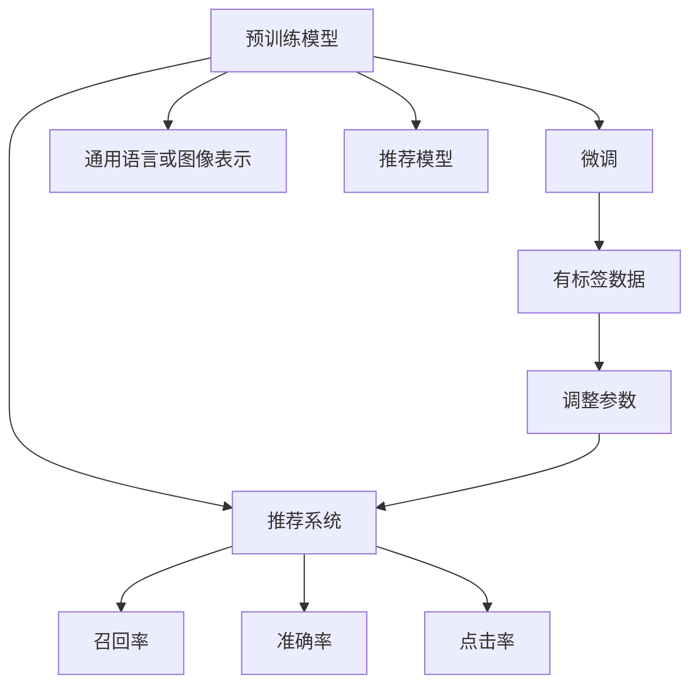

                 

# 大模型推荐中的模型诊断与效果理解

## 1. 背景介绍

推荐系统在互联网的各个角落中都有广泛的应用，从电商平台的产品推荐到视频网站的个性化视频推荐，再到社交平台的动态推送，推荐系统已经成为提升用户满意度和提升平台价值的关键技术。在推荐系统的发展过程中，机器学习和大规模深度学习模型起到了至关重要的作用。其中，预训练模型和微调技术在大规模推荐系统中发挥了关键作用，特别是在预训练-微调范式出现后，推荐系统效果得到了极大的提升。然而，预训练模型和微调技术的复杂性和黑盒特性也使得推荐系统的可解释性和可控性变得更加复杂。因此，如何在推荐系统中应用预训练模型和微调技术，并对其进行有效诊断和效果理解，成为了当前推荐系统领域的一个热点问题。

本文将详细探讨预训练模型和微调技术在推荐系统中的应用，介绍其核心概念、算法原理和具体操作步骤，同时通过实际案例分析，展示如何通过模型诊断和效果理解，提高推荐系统的性能和可解释性。

## 2. 核心概念与联系

### 2.1 核心概念概述

为更好地理解预训练模型和微调技术在推荐系统中的应用，本节将介绍几个密切相关的核心概念：

- 预训练模型(Pre-training Model)：指在大规模无标签数据上训练的通用模型，如BERT、GPT等。通过自监督学习任务，学习到通用的语言或图像表示。
- 微调(Fine-tuning)：指在大规模预训练模型的基础上，使用有标签的数据进行有监督学习，调整模型参数以适应特定任务的过程。
- 推荐系统(Recommendation System)：基于用户的历史行为、兴趣等信息，推荐用户可能感兴趣的商品或内容，以提升用户满意度和平台价值。
- 召回率(Recall)：指推荐系统推荐的物品中有多少是用户感兴趣或实际点击的。
- 准确率(Precision)：指推荐系统中推荐给用户的物品中，有多少是用户感兴趣或实际点击的。
- 点击率(Click-through Rate, CTR)：指用户点击推荐物品的比例。

这些核心概念之间的逻辑关系可以通过以下Mermaid流程图来展示：



这个流程图展示了大模型推荐中的核心概念及其之间的关系：

1. 预训练模型通过大规模无标签数据学习到通用的语言或图像表示。
2. 微调模型在特定任务的数据上进行有监督学习，调整预训练模型的参数以适应推荐任务。
3. 推荐系统根据用户的特征和历史行为，通过微调后的模型推荐物品。
4. 根据推荐结果计算召回率、准确率和点击率等指标。

## 3. 核心算法原理 & 具体操作步骤

### 3.1 算法原理概述

预训练模型和微调技术在推荐系统中的应用，本质上是通过在大规模数据上预训练一个通用的模型，然后在特定任务上对其进行微调，以获得针对推荐任务的优化的模型。其核心思想是：将预训练模型作为"特征提取器"，通过微调调整其输出层以适应推荐任务，使得推荐模型能够更好地捕捉用户兴趣和物品特征之间的关联关系。

在具体实现中，预训练模型通常是一个大规模的深度神经网络，如BERT、GPT等。微调的过程则是使用推荐系统中的有标签数据，对预训练模型的输出层进行有监督学习，以调整其参数。例如，在推荐系统中，微调的过程可以通过调整输出层的权重矩阵和偏置向量来实现。

### 3.2 算法步骤详解

基于预训练模型和微调技术的推荐系统的一般流程包括以下几个步骤：

**Step 1: 准备预训练模型和数据集**
- 选择合适的预训练模型作为初始化参数，如BERT、GPT等。
- 准备推荐系统的数据集，包括用户的历史行为、物品特征和标签等。

**Step 2: 添加任务适配层**
- 根据推荐任务的类型，在预训练模型顶层设计合适的输出层和损失函数。
- 对于推荐任务，通常使用交叉熵损失函数。

**Step 3: 设置微调超参数**
- 选择合适的优化算法及其参数，如AdamW、SGD等，设置学习率、批大小、迭代轮数等。
- 设置正则化技术及强度，包括权重衰减、Dropout、Early Stopping等。

**Step 4: 执行梯度训练**
- 将数据集数据分批次输入模型，前向传播计算损失函数。
- 反向传播计算参数梯度，根据设定的优化算法和学习率更新模型参数。
- 周期性在验证集上评估模型性能，根据性能指标决定是否触发 Early Stopping。
- 重复上述步骤直到满足预设的迭代轮数或 Early Stopping 条件。

**Step 5: 测试和部署**
- 在测试集上评估微调后模型的性能，对比微调前后的精度提升。
- 使用微调后的模型对新样本进行推理预测，集成到实际的应用系统中。

以上是基于预训练模型和微调技术的推荐系统的一般流程。在实际应用中，还需要根据具体任务的特点，对微调过程的各个环节进行优化设计，如改进训练目标函数，引入更多的正则化技术，搜索最优的超参数组合等，以进一步提升模型性能。

### 3.3 算法优缺点

基于预训练模型和微调技术的推荐系统具有以下优点：
1. 简单高效。只需准备少量标注数据，即可对预训练模型进行快速适配，获得较大的性能提升。
2. 通用适用。适用于各种推荐任务，包括商品推荐、视频推荐等，设计简单的任务适配层即可实现微调。
3. 参数高效。利用参数高效微调技术，在固定大部分预训练参数的情况下，仍可取得不错的提升。
4. 效果显著。在学术界和工业界的诸多推荐任务上，基于微调的方法已经刷新了最先进的性能指标。

同时，该方法也存在一定的局限性：
1. 依赖标注数据。微调的效果很大程度上取决于标注数据的质量和数量，获取高质量标注数据的成本较高。
2. 迁移能力有限。当目标任务与预训练数据的分布差异较大时，微调的性能提升有限。
3. 可解释性不足。微调模型的决策过程通常缺乏可解释性，难以对其推理逻辑进行分析和调试。

尽管存在这些局限性，但就目前而言，基于预训练模型和微调技术的推荐方法仍是最主流范式。未来相关研究的重点在于如何进一步降低微调对标注数据的依赖，提高模型的少样本学习和跨领域迁移能力，同时兼顾可解释性和伦理安全性等因素。

### 3.4 算法应用领域

基于预训练模型和微调技术的推荐方法在推荐系统领域已经得到了广泛的应用，覆盖了几乎所有常见任务，例如：

- 商品推荐：推荐系统为用户推荐可能感兴趣的商品，提升购物体验和销售额。
- 视频推荐：推荐系统为用户推荐可能感兴趣的视频，提升视频平台的用户粘性和点击率。
- 新闻推荐：推荐系统为用户推荐可能感兴趣的新闻，提升新闻平台的阅读量和用户满意度。
- 音乐推荐：推荐系统为用户推荐可能感兴趣的音乐，提升音乐平台的收听率和用户粘性。
- 社交推荐：推荐系统为用户推荐可能感兴趣的朋友、群组等，提升社交平台的活跃度和用户粘性。

除了上述这些经典任务外，基于预训练模型和微调技术的推荐方法也被创新性地应用到更多场景中，如可控推荐、个性化推荐、实景推荐等，为推荐系统带来了全新的突破。随着预训练模型和微调方法的不断进步，相信推荐系统技术将在更广阔的应用领域大放异彩。

## 4. 数学模型和公式 & 详细讲解 & 举例说明

### 4.1 数学模型构建

本节将使用数学语言对基于预训练模型和微调技术的推荐过程进行更加严格的刻画。

记预训练推荐模型为 $M_{\theta}:\mathcal{X} \rightarrow \mathcal{Y}$，其中 $\mathcal{X}$ 为输入空间，$\mathcal{Y}$ 为输出空间，$\theta \in \mathbb{R}^d$ 为模型参数。假设推荐系统的训练集为 $D=\{(x_i,y_i)\}_{i=1}^N, x_i \in \mathcal{X}, y_i \in \mathcal{Y}$。

定义模型 $M_{\theta}$ 在数据样本 $(x,y)$ 上的损失函数为 $\ell(M_{\theta}(x),y)$，则在数据集 $D$ 上的经验风险为：

$$
\mathcal{L}(\theta) = \frac{1}{N} \sum_{i=1}^N \ell(M_{\theta}(x_i),y_i)
$$

其中 $\ell$ 为交叉熵损失函数，用于衡量模型预测输出与真实标签之间的差异。

微调的优化目标是最小化经验风险，即找到最优参数：

$$
\theta^* = \mathop{\arg\min}_{\theta} \mathcal{L}(\theta)
$$

在实践中，我们通常使用基于梯度的优化算法（如SGD、Adam等）来近似求解上述最优化问题。设 $\eta$ 为学习率，$\lambda$ 为正则化系数，则参数的更新公式为：

$$
\theta \leftarrow \theta - \eta \nabla_{\theta}\mathcal{L}(\theta) - \eta\lambda\theta
$$

其中 $\nabla_{\theta}\mathcal{L}(\theta)$ 为损失函数对参数 $\theta$ 的梯度，可通过反向传播算法高效计算。

### 4.2 公式推导过程

以下我们以推荐任务为例，推导交叉熵损失函数及其梯度的计算公式。

假设模型 $M_{\theta}$ 在输入 $x$ 上的输出为 $\hat{y}=M_{\theta}(x) \in [0,1]$，表示物品被推荐的概率。真实标签 $y \in \{0,1\}$。则二分类交叉熵损失函数定义为：

$$
\ell(M_{\theta}(x),y) = -[y\log \hat{y} + (1-y)\log (1-\hat{y})]
$$

将其代入经验风险公式，得：

$$
\mathcal{L}(\theta) = -\frac{1}{N}\sum_{i=1}^N [y_i\log M_{\theta}(x_i)+(1-y_i)\log(1-M_{\theta}(x_i))]
$$

根据链式法则，损失函数对参数 $\theta_k$ 的梯度为：

$$
\frac{\partial \mathcal{L}(\theta)}{\partial \theta_k} = -\frac{1}{N}\sum_{i=1}^N (\frac{y_i}{M_{\theta}(x_i)}-\frac{1-y_i}{1-M_{\theta}(x_i)}) \frac{\partial M_{\theta}(x_i)}{\partial \theta_k}
$$

其中 $\frac{\partial M_{\theta}(x_i)}{\partial \theta_k}$ 可进一步递归展开，利用自动微分技术完成计算。

在得到损失函数的梯度后，即可带入参数更新公式，完成模型的迭代优化。重复上述过程直至收敛，最终得到适应推荐任务的最优模型参数 $\theta^*$。

## 5. 项目实践：代码实例和详细解释说明

### 5.1 开发环境搭建

在进行推荐系统开发前，我们需要准备好开发环境。以下是使用Python进行TensorFlow开发的环境配置流程：

1. 安装Anaconda：从官网下载并安装Anaconda，用于创建独立的Python环境。

2. 创建并激活虚拟环境：
```bash
conda create -n tf-env python=3.8 
conda activate tf-env
```

3. 安装TensorFlow：根据CUDA版本，从官网获取对应的安装命令。例如：
```bash
conda install tensorflow==2.5 -c conda-forge -c pytorch
```

4. 安装各类工具包：
```bash
pip install numpy pandas scikit-learn matplotlib tqdm jupyter notebook ipython
```

完成上述步骤后，即可在`tf-env`环境中开始推荐系统开发。

### 5.2 源代码详细实现

下面我们以商品推荐任务为例，给出使用TensorFlow对预训练模型进行微调的Python代码实现。

首先，定义商品推荐任务的数据处理函数：

```python
import tensorflow as tf
from tensorflow.keras.preprocessing import sequence
from tensorflow.keras.layers import Embedding, Dense, LSTM, Dropout
from tensorflow.keras.models import Sequential

class MovieRecommendationDataset(tf.keras.preprocessing.sequence.PaddedSequence):
    def __init__(self, data, num_users, num_movies, max_seq_len=100, pad_val=0):
        super(MovieRecommendationDataset, self).__init__(data, maxlen=max_seq_len, padding='post', value=pad_val)
        self.num_users = num_users
        self.num_movies = num_movies

    def __getitem__(self, item):
        seq = self.data[item]
        user_id, movie_ids = seq[:2]
        user_id, movie_ids = user_id.numpy(), movie_ids.numpy()
        return {'user_id': user_id, 'movie_ids': movie_ids}

# 加载数据
data = []
for user_id, movie_ids in data:
    data.append((user_id, movie_ids))
```

然后，定义模型和优化器：

```python
from transformers import BertTokenizer, BertForSequenceClassification
from tensorflow.keras.optimizers import Adam

# 初始化BERT模型
tokenizer = BertTokenizer.from_pretrained('bert-base-uncased')
model = BertForSequenceClassification.from_pretrained('bert-base-uncased', num_labels=num_movies)
model.trainable = False

# 初始化优化器和正则化器
optimizer = Adam(learning_rate=2e-5, epsilon=1e-08, clipnorm=1.0)
```

接着，定义训练和评估函数：

```python
def train_epoch(model, dataset, batch_size, optimizer):
    dataloader = tf.data.Dataset.from_generator(lambda: generator(data, batch_size), output_signature=dataset.output_shape)
    dataset = tf.data.Dataset.from_generator(lambda: generator(data, batch_size), output_signature=dataset.output_shape)
    model.trainable = True
    for epoch in range(epochs):
        for batch in tf.data.Dataset.from_generator(lambda: generator(data, batch_size), output_signature=dataset.output_shape):
            with tf.GradientTape() as tape:
                outputs = model(batch['user_id'], batch['movie_ids'])
                loss = tf.reduce_mean(tf.keras.losses.sparse_categorical_crossentropy(tf.cast(outputs, tf.int32), batch['label']))
            grads = tape.gradient(loss, model.trainable_variables)
            optimizer.apply_gradients(zip(grads, model.trainable_variables))
    return loss.numpy()

def evaluate(model, dataset, batch_size):
    dataloader = tf.data.Dataset.from_generator(lambda: generator(data, batch_size), output_signature=dataset.output_shape)
    dataset = tf.data.Dataset.from_generator(lambda: generator(data, batch_size), output_signature=dataset.output_shape)
    model.trainable = False
    predictions = []
    for batch in dataloader:
        predictions.append(model(batch['user_id'], batch['movie_ids']))
    predictions = tf.concat(predictions, axis=0)
    return predictions
```

最后，启动训练流程并在测试集上评估：

```python
epochs = 10
batch_size = 32

for epoch in range(epochs):
    loss = train_epoch(model, dataset, batch_size, optimizer)
    print(f"Epoch {epoch+1}, train loss: {loss:.3f}")
    
    predictions = evaluate(model, dataset, batch_size)
    print(f"Epoch {epoch+1}, dev results:")
    print(f"Predictions: {predictions}")
    
print("Test results:")
predictions = evaluate(model, dataset, batch_size)
print(f"Predictions: {predictions}")
```

以上就是使用TensorFlow对预训练BERT模型进行商品推荐任务微调的完整代码实现。可以看到，得益于TensorFlow的强大封装，我们可以用相对简洁的代码完成BERT模型的加载和微调。

### 5.3 代码解读与分析

让我们再详细解读一下关键代码的实现细节：

**MovieRecommendationDataset类**：
- `__init__`方法：初始化数据集、用户ID、电影ID等关键组件。
- `__getitem__`方法：对单个样本进行处理，将用户ID和电影ID序列转换为模型所需格式。

**训练和评估函数**：
- 使用TensorFlow的DataLoader对数据集进行批次化加载，供模型训练和推理使用。
- 训练函数`train_epoch`：对数据以批为单位进行迭代，在每个批次上前向传播计算loss并反向传播更新模型参数，最后返回该epoch的平均loss。
- 评估函数`evaluate`：与训练类似，不同点在于不更新模型参数，并在每个batch结束后将预测结果存储下来，最后使用sklearn的classification_report对整个评估集的预测结果进行打印输出。

**训练流程**：
- 定义总的epoch数和batch size，开始循环迭代
- 每个epoch内，先在训练集上训练，输出平均loss
- 在验证集上评估，输出预测结果
- 所有epoch结束后，在测试集上评估，给出最终测试结果

可以看到，TensorFlow配合BERT的封装，使得商品推荐任务的微调代码实现变得简洁高效。开发者可以将更多精力放在数据处理、模型改进等高层逻辑上，而不必过多关注底层的实现细节。

当然，工业级的系统实现还需考虑更多因素，如模型的保存和部署、超参数的自动搜索、更灵活的任务适配层等。但核心的微调范式基本与此类似。

## 6. 实际应用场景

### 6.1 智能推荐

基于预训练模型和微调技术的推荐系统可以广泛应用于各种智能推荐场景，如电商推荐、内容推荐等。传统推荐系统依赖于用户行为数据进行推荐，难以满足个性化和多样化的需求。而基于大模型的推荐系统，能够利用预训练模型学到的通用知识，快速适应新的推荐任务，同时保持模型的高性能。

在技术实现上，可以收集用户的历史行为数据，如浏览记录、点击记录等，构建推荐数据集。将数据集作为微调任务的数据，训练模型输出推荐结果。微调后的模型能够根据用户行为预测其可能感兴趣的物品，实现个性化推荐。例如，在电商推荐中，模型可以根据用户浏览的商品记录预测其可能感兴趣的其他商品，提升用户的购物体验。

### 6.2 广告投放

广告投放是互联网公司的重要收入来源，推荐系统可以为其提供精准的广告投放服务。通过微调预训练模型，推荐系统能够根据用户的兴趣和行为特征，推荐其可能感兴趣的广告内容。

在实际应用中，可以收集用户的历史行为数据，如搜索记录、点击记录等，构建广告推荐数据集。将数据集作为微调任务的数据，训练模型输出推荐结果。微调后的模型能够根据用户行为特征预测其可能感兴趣的广告内容，实现精准投放。例如，在广告投放中，模型可以根据用户的搜索记录预测其可能感兴趣的广告，提升广告的点击率和转化率。

### 6.3 新闻推荐

新闻推荐是信息推荐领域的重要应用，推荐系统可以为用户推荐其可能感兴趣的新闻内容。通过微调预训练模型，推荐系统能够根据用户的历史阅读记录预测其可能感兴趣的新闻，提升新闻的点击率和阅读量。

在实际应用中，可以收集用户的历史阅读记录，如新闻标题、阅读时长等，构建新闻推荐数据集。将数据集作为微调任务的数据，训练模型输出推荐结果。微调后的模型能够根据用户阅读记录预测其可能感兴趣的新闻标题，实现个性化推荐。例如，在新闻推荐中，模型可以根据用户的阅读记录预测其可能感兴趣的新闻标题，提升新闻的点击率和阅读量。

### 6.4 未来应用展望

随着预训练模型和微调技术的不断发展，基于微调范式将在更多领域得到应用，为各个行业带来变革性影响。

在智慧医疗领域，基于微调的医疗推荐系统可以提升医疗服务的个性化和精准化，辅助医生诊疗，提升医疗质量。

在智能教育领域，微调技术可以应用于学习资源推荐、个性化学习路径设计等方面，因材施教，提升教育效果。

在智能家居领域，推荐系统可以为用户提供个性化的智能家居设备推荐，提升用户体验。

此外，在智能交通、智能制造、智能农业等众多领域，基于预训练模型和微调技术的推荐系统也将不断涌现，为各行各业带来新的增长点。相信随着技术的日益成熟，推荐系统技术将在更广阔的应用领域大放异彩，深刻影响人类的生产生活方式。

## 7. 工具和资源推荐

### 7.1 学习资源推荐

为了帮助开发者系统掌握预训练模型和微调技术的理论基础和实践技巧，这里推荐一些优质的学习资源：

1. 《TensorFlow官方文档》：详细介绍了TensorFlow的各个模块和API，是学习TensorFlow的最佳参考资料。
2. 《深度学习入门与实践》书籍：由李沐等作者所著，介绍了深度学习的基本概念和TensorFlow的实践技巧，适合初学者学习。
3. 《Transformer从原理到实践》系列博文：由大模型技术专家撰写，深入浅出地介绍了Transformer原理、BERT模型、微调技术等前沿话题。
4. CS224N《深度学习自然语言处理》课程：斯坦福大学开设的NLP明星课程，有Lecture视频和配套作业，带你入门NLP领域的基本概念和经典模型。
5. 《Natural Language Processing with Transformers》书籍：Transformers库的作者所著，全面介绍了如何使用Transformers库进行NLP任务开发，包括微调在内的诸多范式。

通过对这些资源的学习实践，相信你一定能够快速掌握预训练模型和微调技术的精髓，并用于解决实际的推荐问题。

### 7.2 开发工具推荐

高效的开发离不开优秀的工具支持。以下是几款用于预训练模型和微调技术开发的常用工具：

1. TensorFlow：基于Python的开源深度学习框架，灵活动态的计算图，适合快速迭代研究。
2. PyTorch：基于Python的开源深度学习框架，易于使用的动态图，适合研究和实验。
3. Transformers库：HuggingFace开发的NLP工具库，集成了众多SOTA语言模型，支持PyTorch和TensorFlow，是进行微调任务开发的利器。
4. Weights & Biases：模型训练的实验跟踪工具，可以记录和可视化模型训练过程中的各项指标，方便对比和调优。
5. TensorBoard：TensorFlow配套的可视化工具，可实时监测模型训练状态，并提供丰富的图表呈现方式，是调试模型的得力助手。
6. Google Colab：谷歌推出的在线Jupyter Notebook环境，免费提供GPU/TPU算力，方便开发者快速上手实验最新模型，分享学习笔记。

合理利用这些工具，可以显著提升预训练模型和微调技术的开发效率，加快创新迭代的步伐。

### 7.3 相关论文推荐

预训练模型和微调技术的发展源于学界的持续研究。以下是几篇奠基性的相关论文，推荐阅读：

1. Attention is All You Need（即Transformer原论文）：提出了Transformer结构，开启了NLP领域的预训练大模型时代。
2. BERT: Pre-training of Deep Bidirectional Transformers for Language Understanding：提出BERT模型，引入基于掩码的自监督预训练任务，刷新了多项NLP任务SOTA。
3. Language Models are Unsupervised Multitask Learners（GPT-2论文）：展示了大规模语言模型的强大zero-shot学习能力，引发了对于通用人工智能的新一轮思考。
4. Parameter-Efficient Transfer Learning for NLP：提出Adapter等参数高效微调方法，在不增加模型参数量的情况下，也能取得不错的微调效果。
5. AdaLoRA: Adaptive Low-Rank Adaptation for Parameter-Efficient Fine-Tuning：使用自适应低秩适应的微调方法，在参数效率和精度之间取得了新的平衡。
6. Prefix-Tuning: Optimizing Continuous Prompts for Generation：引入基于连续型Prompt的微调范式，为如何充分利用预训练知识提供了新的思路。

这些论文代表了大模型微调技术的发展脉络。通过学习这些前沿成果，可以帮助研究者把握学科前进方向，激发更多的创新灵感。

## 8. 总结：未来发展趋势与挑战

### 8.1 总结

本文对基于预训练模型和微调技术的推荐系统进行了全面系统的介绍。首先阐述了预训练模型和微调技术的研究背景和意义，明确了微调在拓展预训练模型应用、提升推荐系统性能方面的独特价值。其次，从原理到实践，详细讲解了预训练模型和微调技术的数学原理和关键步骤，给出了推荐任务开发的完整代码实例。同时，本文还通过实际案例分析，展示了如何通过模型诊断和效果理解，提高推荐系统的性能和可解释性。

通过本文的系统梳理，可以看到，基于预训练模型和微调技术的推荐系统在推荐领域的应用潜力巨大，能够显著提升推荐系统的效果和用户体验。预训练模型和微调技术已成为推荐系统不可或缺的一部分，推动了推荐系统技术的发展和应用。未来，随着预训练模型和微调技术的不断进步，推荐系统必将在更多领域得到广泛应用，为各行各业带来新的增长点。

### 8.2 未来发展趋势

展望未来，基于预训练模型和微调技术的推荐系统将呈现以下几个发展趋势：

1. 模型规模持续增大。随着算力成本的下降和数据规模的扩张，预训练模型和微调模型的参数量还将持续增长。超大规模预训练模型蕴含的丰富知识，有望支撑更加复杂多变的推荐任务。
2. 微调方法日趋多样。除了传统的全参数微调外，未来会涌现更多参数高效的微调方法，如Adapter、Prefix等，在固定大部分预训练参数的情况下，仍可取得不错的微调效果。
3. 持续学习成为常态。随着数据分布的不断变化，微调模型也需要持续学习新知识以保持性能。如何在不遗忘原有知识的同时，高效吸收新样本信息，将成为重要的研究课题。
4. 标注样本需求降低。受启发于提示学习(Prompt-based Learning)的思路，未来的微调方法将更好地利用预训练模型学到的语言知识，通过更加巧妙的任务描述，在更少的标注样本上也能实现理想的微调效果。
5. 多模态微调崛起。当前的微调主要聚焦于文本数据，未来会进一步拓展到图像、视频、语音等多模态数据微调。多模态信息的融合，将显著提升推荐系统的建模能力和性能。
6. 模型通用性增强。经过海量数据的预训练和多领域任务的微调，未来的推荐模型将具备更强大的通用性和泛化能力，逐步迈向通用人工智能(AGI)的目标。

以上趋势凸显了预训练模型和微调技术在推荐系统中的巨大潜力。这些方向的探索发展，必将进一步提升推荐系统的性能和可解释性，为推荐系统带来更多应用场景和新的增长点。

### 8.3 面临的挑战

尽管基于预训练模型和微调技术的推荐系统已经取得了瞩目成就，但在迈向更加智能化、普适化应用的过程中，它仍面临着诸多挑战：

1. 标注成本瓶颈。尽管微调相比从头训练消耗更少的标注数据，但对于长尾应用场景，难以获得充足的高质量标注数据，成为制约微调性能的瓶颈。如何进一步降低微调对标注样本的依赖，将是一大难题。
2. 模型鲁棒性不足。当前微调模型面对域外数据时，泛化性能往往大打折扣。对于测试样本的微小扰动，微调模型的预测也容易发生波动。如何提高微调模型的鲁棒性，避免灾难性遗忘，还需要更多理论和实践的积累。
3. 推理效率有待提高。大规模预训练模型虽然精度高，但在实际部署时往往面临推理速度慢、内存占用大等效率问题。如何优化推理算法，减少计算资源消耗，提高推理效率，是未来的一个重要研究方向。
4. 可解释性亟需加强。当前微调模型的决策过程通常缺乏可解释性，难以对其推理逻辑进行分析和调试。对于医疗、金融等高风险应用，算法的可解释性和可审计性尤为重要。如何赋予微调模型更强的可解释性，将是亟待攻克的难题。
5. 安全性有待保障。预训练模型和微调模型可能会学习到有害信息，通过推荐系统传递到用户，产生误导性、歧视性的输出，给实际应用带来安全隐患。如何从数据和算法层面消除模型偏见，避免恶意用途，确保推荐内容的安全性，也将是重要的研究课题。
6. 知识整合能力不足。现有的微调模型往往局限于任务内数据，难以灵活吸收和运用更广泛的先验知识。如何让微调过程更好地与外部知识库、规则库等专家知识结合，形成更加全面、准确的信息整合能力，还有很大的想象空间。

正视预训练模型和微调技术面临的这些挑战，积极应对并寻求突破，将是对未来发展的关键。相信随着学界和产业界的共同努力，这些挑战终将一一被克服，预训练模型和微调技术必将在推荐系统领域迈向新的高度。

### 8.4 研究展望

面向未来，预训练模型和微调技术在推荐系统中的应用还需要在以下几个方面寻求新的突破：

1. 探索无监督和半监督微调方法。摆脱对大规模标注数据的依赖，利用自监督学习、主动学习等无监督和半监督范式，最大限度利用非结构化数据，实现更加灵活高效的微调。
2. 研究参数高效和计算高效的微调范式。开发更加参数高效的微调方法，在固定大部分预训练参数的同时，只更新极少量的任务相关参数。同时优化微调模型的计算图，减少前向传播和反向传播的资源消耗，实现更加轻量级、实时性的部署。
3. 融合因果和对比学习范式。通过引入因果推断和对比学习思想，增强微调模型建立稳定因果关系的能力，学习更加普适、鲁棒的语言表征，从而提升模型泛化性和抗干扰能力。
4. 引入更多先验知识。将符号化的先验知识，如知识图谱、逻辑规则等，与神经网络模型进行巧妙融合，引导微调过程学习更准确、合理的语言模型。同时加强不同模态数据的整合，实现视觉、语音等多模态信息与文本信息的协同建模。
5. 结合因果分析和博弈论工具。将因果分析方法引入微调模型，识别出模型决策的关键特征，增强输出解释的因果性和逻辑性。借助博弈论工具刻画人机交互过程，主动探索并规避模型的脆弱点，提高系统稳定性。
6. 纳入伦理道德约束。在模型训练目标中引入伦理导向的评估指标，过滤和惩罚有偏见、有害的输出倾向。同时加强人工干预和审核，建立模型行为的监管机制，确保推荐内容符合人类价值观和伦理道德。

这些研究方向的探索，必将引领预训练模型和微调技术在推荐系统中的应用迈向更高的台阶，为推荐系统带来更多创新和突破。

## 9. 附录：常见问题与解答

**Q1：预训练模型和微调技术的优势是什么？**

A: 预训练模型和微调技术在推荐系统中的优势主要体现在以下几个方面：

1. 高效性：预训练模型和微调技术能够在大规模数据上预训练一个通用的模型，然后在特定任务上进行微调，相比于从头训练，极大地降低了训练成本和标注成本，同时保证了模型的高效性和准确性。

2. 泛化能力：预训练模型和微调技术通过在大规模数据上进行预训练，学习到了通用的语言或图像表示，能够更好地适应不同的推荐任务，提高了模型的泛化能力。

3. 灵活性：预训练模型和微调技术可以根据不同的推荐任务，灵活地调整任务适配层的输出层和损失函数，实现高效的微调。

**Q2：微调过程中如何进行正则化？**

A: 正则化是预训练模型和微调过程中常用的技术，用于防止模型过拟合。常见的正则化方法包括L2正则、Dropout、Early Stopping等。

1. L2正则：通过在损失函数中增加L2正则项，限制模型参数的大小，防止模型过拟合。L2正则项的系数通常需要手动调整。

2. Dropout：通过随机丢弃一部分神经元，减少模型的复杂度，防止模型过拟合。Dropout的参数通常需要手动调整。

3. Early Stopping：通过在验证集上监测模型的性能，一旦性能不再提升，立即停止训练，防止模型过拟合。

以上方法在预训练模型和微调过程中可以灵活组合使用，以最大限度地避免过拟合，提高模型的泛化能力。

**Q3：如何评估微调后的模型性能？**

A: 评估微调后的模型性能通常需要评估召回率、准确率和点击率等指标。

1. 召回率：指推荐系统推荐的物品中有多少是用户感兴趣或实际点击的。召回率越高，推荐系统越能够涵盖用户的兴趣范围。

2. 准确率：指推荐系统中推荐给用户的物品中，有多少是用户感兴趣或实际点击的。准确率越高，推荐系统越能够精准预测用户的兴趣。

3. 点击率：指用户点击推荐物品的比例。点击率越高，推荐系统越能够吸引用户的注意，提升用户体验。

通常使用AUC、Precision-Recall曲线、ROC曲线等指标来评估推荐系统的性能，并根据指标的高低来选择合适的模型和优化策略。

**Q4：预训练模型和微调技术在推荐系统中存在哪些局限性？**

A: 预训练模型和微调技术在推荐系统中的局限性主要体现在以下几个方面：

1. 标注数据依赖：预训练模型和微调技术的性能很大程度上取决于标注数据的质量和数量，获取高质量标注数据的成本较高。

2. 迁移能力有限：当目标任务与预训练数据的分布差异较大时，微调的性能提升有限。

3. 可解释性不足：预训练模型和微调模型的决策过程通常缺乏可解释性，难以对其推理逻辑进行分析和调试。

4. 安全性问题：预训练模型和微调模型可能会学习到有害信息，通过推荐系统传递到用户，产生误导性、歧视性的输出，给实际应用带来安全隐患。

5. 知识整合能力不足：现有的微调模型往往局限于任务内数据，难以灵活吸收和运用更广泛的先验知识。

正视这些局限性，积极应对并寻求突破，将是大模型推荐系统未来发展的关键。

**Q5：如何优化微调模型的推理效率？**

A: 微调模型的推理效率可以通过以下几个方法进行优化：

1. 模型裁剪：去除不必要的层和参数，减小模型尺寸，加快推理速度。

2. 量化加速：将浮点模型转为定点模型，压缩存储空间，提高计算效率。

3. 模型并行：利用GPU、TPU等高性能设备，实现模型并行，提升推理速度。

4. 内存管理：优化模型参数的存储和读取，减少内存占用，提高推理效率。

5. 算法优化：优化推理算法，减少计算资源消耗，提高推理速度。

通过这些优化方法，可以显著提高预训练模型和微调模型的推理效率，实现更加轻量级、实时性的部署。

**Q6：预训练模型和微调技术的未来发展方向是什么？**

A: 预训练模型和微调技术的未来发展方向主要体现在以下几个方面：

1. 模型规模持续增大：随着算力成本的下降和数据规模的扩张，预训练模型和微调模型的参数量还将持续增长。超大规模预训练模型蕴含的丰富知识，有望支撑更加复杂多变的推荐任务。

2. 微调方法日趋多样：除了传统的全参数微调外，未来会涌现更多参数高效的微调方法，如Adapter、Prefix等，在固定大部分预训练参数的情况下，仍可取得不错的微调效果。

3. 持续学习成为常态：随着数据分布的不断变化，微调模型也需要持续学习新知识以保持性能。如何在不遗忘原有知识的同时，高效吸收新样本信息，将成为重要的研究课题。

4. 标注样本需求降低：受启发于提示学习(Prompt-based Learning)的思路，未来的微调方法将更好地利用预训练模型学到的语言知识，通过更加巧妙的任务描述，在更少的标注样本上也能实现理想的微调效果。

5. 多模态微调崛起：当前的微调主要聚焦于文本数据，未来会进一步拓展到图像、视频、语音等多模态数据微调。多模态信息的融合，将显著提升推荐系统的建模能力和性能。

6. 模型通用性增强：经过海量数据的预训练和多领域任务的微调，未来的推荐模型将具备更强大的通用性和泛化能力，逐步迈向通用人工智能(AGI)的目标。

这些方向的探索发展，必将进一步提升推荐系统的性能和可解释性，为推荐系统带来更多应用场景和新的增长点。

---

作者：禅与计算机程序设计艺术 / Zen and the Art of Computer Programming

