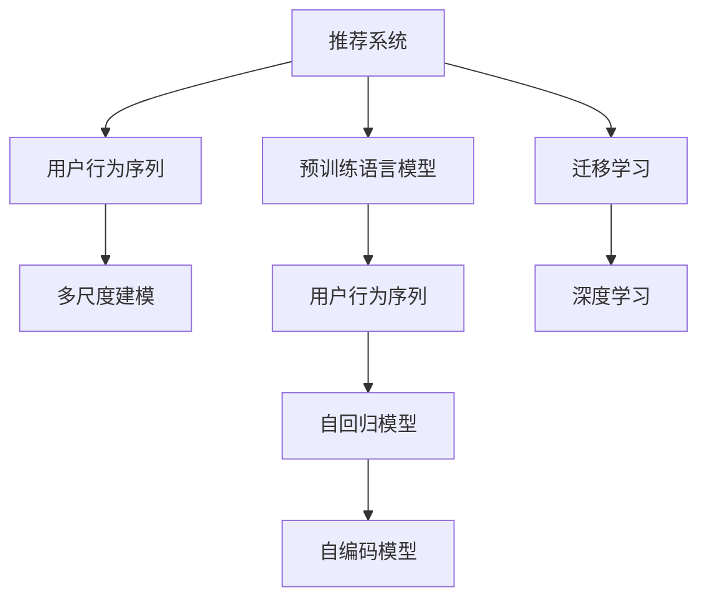

                 

# 大模型推荐中的用户行为序列多尺度建模方法

> 关键词：推荐系统,用户行为序列,多尺度建模,自回归模型,自编码模型,迁移学习,深度学习

## 1. 背景介绍

### 1.1 问题由来

推荐系统作为提升用户体验、推动电商转化的核心工具，长期以来受到了广泛的关注和研究。传统的基于协同过滤、矩阵分解等方法的推荐系统，依赖用户行为数据构建用户画像和物品特征，进行矩阵运算求取推荐结果。然而，这些方法对数据的要求较高，需要庞大的用户历史数据才能得到准确的推荐。

近年来，随着深度学习技术的发展，特别是预训练语言模型的出现，推荐系统开始借助大规模语言模型进行预训练，学习丰富的语义特征，并在小样本上实现微调，从而取得更好的推荐效果。例如，DenseRank、SoftRank等基于预训练语言模型的推荐方法，已经在推荐任务上取得了显著的突破。

然而，现有的方法大多关注静态的用户画像和物品特征，难以捕捉用户行为的时序变化。特别是在电商、新闻等强时效性的应用场景中，用户的兴趣偏好可能随着时间推移而发生显著变化，传统的推荐模型很难在短时间内快速适应这一变化，导致推荐效果欠佳。

因此，本文提出了一种基于用户行为序列的多尺度建模方法，以充分利用时序数据的特征，结合预训练语言模型和用户行为序列的动态变化，实现更加精准、高效、个性化的推荐系统。

## 2. 核心概念与联系

### 2.1 核心概念概述

为更好地理解本文提出的用户行为序列多尺度建模方法，这里首先介绍几个核心概念：

- 推荐系统(Recommendation System)：利用用户行为数据，预测用户对未交互物品的兴趣，并提供推荐结果的系统。推荐系统广泛应用于电商、社交网络、视频平台等多个领域，是提升用户体验的重要工具。

- 预训练语言模型(Pretrained Language Model)：在大量无标注数据上预训练的语言模型，如BERT、GPT等。通过预训练，模型学习到丰富的语言表示，可以作为推荐系统中的特征提取器，提取物品描述、用户评论等文本特征，提升推荐精度。

- 用户行为序列(User Behavior Sequence)：用户在不同时间点与系统进行交互时，产生的浏览、点击、评价等行为记录。这些序列数据具有明显的时序特征，是推荐系统中难以忽视的重要信息来源。

- 多尺度建模(Multiscale Modeling)：指在建模过程中，将不同尺度的特征同时考虑，从全局到局部，兼顾宏观和微观特征的建模方法。常见的方法包括卷积神经网络(CNN)、自回归模型(AR)、自编码模型(AE)等。

- 自回归模型(Autoregressive Model)：一类依赖时间序列自身历史数据的建模方法，如LSTM、GRU等，常用于捕捉序列数据的时序特征。

- 自编码模型(Autoencoder)：一类通过编码和解码过程，将输入数据重构的神经网络模型。自编码模型能够学习数据的低维表示，有助于降维和特征提取。

- 迁移学习(Transfer Learning)：指在相关领域或任务间进行知识迁移的深度学习技术。预训练语言模型和用户行为序列之间的知识共享，可以提升推荐系统的性能。

- 深度学习(Deep Learning)：一类通过神经网络进行复杂特征学习的机器学习方法，适合处理大规模数据和复杂模型。推荐系统可以借助深度学习模型，学习用户行为序列中的复杂特征，提升推荐效果。

这些核心概念之间的逻辑关系可以通过以下Mermaid流程图来展示：



这个流程图展示了几组概念之间的联系：

1. 推荐系统利用用户行为序列，结合预训练语言模型，进行个性化推荐。
2. 用户行为序列中的序列特征，通过自回归模型和自编码模型进行建模。
3. 深度学习模型融合自回归模型和自编码模型的输出，实现多尺度建模。
4. 预训练语言模型和用户行为序列之间的知识共享，通过迁移学习实现。

## 3. 核心算法原理 & 具体操作步骤

### 3.1 算法原理概述

本文提出的用户行为序列多尺度建模方法，主要包含以下几个核心步骤：

1. 收集用户行为序列数据，对行为进行编码和解码，提取高维嵌入表示。
2. 利用预训练语言模型，提取物品描述、用户评论等文本特征，学习丰富的语义表示。
3. 将用户行为序列嵌入和文本特征进行融合，构建多尺度推荐模型。
4. 通过迁移学习，将预训练语言模型的知识迁移到推荐模型中，提升模型效果。

本文将详细阐述上述各步骤的算法原理和具体操作步骤，并展示其实际应用效果。

### 3.2 算法步骤详解

#### 3.2.1 用户行为序列的编码和解码

用户行为序列数据采集自电商平台的用户浏览记录。以电商平台为例，用户浏览数据包括用户ID、时间戳、物品ID、行为类型(浏览、点击、评价等)等。首先对行为类型进行编码，将其映射到唯一的标识符上。然后，将用户行为序列按照时间顺序进行排列，形成时间序列 $S=[\text{user\_id}, t_1, i_1, y_1, t_2, i_2, y_2, \dots]$，其中 $t_n$ 表示时间戳，$i_n$ 表示物品ID，$y_n$ 表示行为类型。

为了提取高维嵌入表示，可以使用自回归模型对行为序列进行建模。具体来说，可以使用LSTM、GRU等模型，对序列 $S$ 进行编码，得到序列嵌入表示 $Z=\{\text{user\_seq}\}_{t_1}^{t_N}$。序列嵌入表示包含了用户行为序列中的时序特征，能够捕捉用户行为的时序变化。

#### 3.2.2 预训练语言模型的提取

预训练语言模型可以通过大规模无标注文本数据进行预训练。以BERT为例，BERT通过自监督任务(如掩码语言模型、下一句预测)进行预训练，学习到丰富的语言表示。在实际应用中，可以从电商网站、社交媒体等获取文本数据，作为预训练语料。例如，电商平台上的物品描述、用户评论等文本数据，可以作为预训练语料。

利用预训练语言模型，对物品描述 $D$ 进行编码，得到物品嵌入表示 $W=\{\text{item}\}_{i_1}^{i_M}$。同样地，对用户评论 $R$ 进行编码，得到用户嵌入表示 $U=\{\text{user}\}_{y_1}^{y_K}$。物品嵌入和用户嵌入表示包含了丰富的语义信息，能够用于推荐模型中的特征提取。

#### 3.2.3 多尺度建模的构建

将用户行为序列嵌入 $Z$ 和物品嵌入 $W$ 进行融合，得到联合嵌入表示 $H=\{z_1, z_2, \dots, z_N\} \otimes \{w_1, w_2, \dots, w_M\}$。联合嵌入表示 $H$ 将用户行为序列的时序特征和物品的语义特征同时考虑，兼顾全局和局部特征的建模。

为了进一步提升模型的性能，可以对联合嵌入表示进行多尺度建模。具体来说，可以采用自编码模型对联合嵌入表示 $H$ 进行编码和解码，得到低维表示 $L=\{\text{latent}\}_{n_1}^{n_L}$。自编码模型能够捕捉数据的低维结构，有助于降低维度和提取关键特征。

最后，将低维表示 $L$ 与自回归模型的输出 $Z$ 进行融合，得到最终的推荐模型表示 $P=\{p_1, p_2, \dots, p_N\}$。融合后的推荐模型表示 $P$ 结合了用户行为序列的时序特征和物品的语义特征，能够更好地捕捉用户行为序列中的动态变化，实现更加精准的推荐。

#### 3.2.4 迁移学习的实现

迁移学习是指在已有知识的基础上，学习新任务的过程。在本方法中，迁移学习通过将预训练语言模型的知识迁移到推荐模型中，提升推荐效果。具体来说，可以采用微调的方式，将预训练语言模型的部分层进行冻结，只更新推荐模型中的参数。

由于推荐模型中的参数较少，微调学习率也可以较小。在微调过程中，可以通过验证集评估推荐模型的性能，避免过拟合。最终，得到具有迁移学习能力的推荐模型，能够在新的数据集上取得更好的效果。

### 3.3 算法优缺点

#### 3.3.1 优点

本方法通过结合用户行为序列、预训练语言模型和深度学习模型，实现多尺度建模，具有以下几个优点：

1. **综合考虑多维度特征**：本方法综合考虑了用户行为序列的时序特征和预训练语言模型的语义特征，能够更加全面地建模用户和物品之间的关系。
2. **自回归模型和自编码模型结合**：自回归模型和自编码模型的结合，有助于捕捉用户行为序列中的时序变化和低维结构，提升推荐模型的性能。
3. **迁移学习提升效果**：迁移学习能够将预训练语言模型的知识迁移到推荐模型中，进一步提升推荐效果。

#### 3.3.2 缺点

本方法也存在一些局限性：

1. **数据依赖性**：本方法对用户行为序列和预训练语言模型的数据依赖性较强，需要收集大量的用户行为数据和预训练语料。
2. **模型复杂度**：由于结合了多尺度的特征，本方法的模型复杂度较高，需要较大的计算资源。
3. **预训练模型限制**：本方法依赖预训练语言模型进行特征提取，可能受到预训练模型质量的影响。

## 4. 数学模型和公式 & 详细讲解 & 举例说明

### 4.1 数学模型构建

#### 4.1.1 用户行为序列的编码和解码

设用户行为序列 $S=[\text{user\_id}, t_1, i_1, y_1, t_2, i_2, y_2, \dots]$，行为类型编码为 $\{y_1, y_2, \dots, y_K\}$，自回归模型为 $R$。用户行为序列编码的公式如下：

$$
Z=\{\text{user\_seq}\}_{t_1}^{t_N}=\mathop{\arg\min}_{z} \sum_{n=1}^N \ell(z_n, R(z_{n-1}))
$$

其中，$z_n$ 表示行为序列中第 $n$ 个时间步的嵌入表示，$\ell$ 为损失函数，$R$ 为自回归模型。

#### 4.1.2 预训练语言模型的提取

设物品描述 $D=[\text{item}\}_{i_1}^{i_M}$，用户评论 $R=[\text{user}\}_{y_1}^{y_K}$，预训练语言模型为 $P$。物品嵌入和用户嵌入表示的公式如下：

$$
W=\{\text{item}\}_{i_1}^{i_M}=\mathop{\arg\min}_{w} \sum_{i=1}^M \ell(w_i, P(w_{i-1}))
$$

$$
U=\{\text{user}\}_{y_1}^{y_K}=\mathop{\arg\min}_{u} \sum_{y=1}^K \ell(u_y, P(u_{y-1}))
$$

#### 4.1.3 多尺度建模的构建

设联合嵌入表示 $H=\{z_1, z_2, \dots, z_N\} \otimes \{w_1, w_2, \dots, w_M\}$，自编码模型为 $E$。联合嵌入表示 $H$ 的公式如下：

$$
L=\{\text{latent}\}_{n_1}^{n_L}=\mathop{\arg\min}_{l} \sum_{n=1}^L \ell(l_n, E(l_{n-1}))
$$

#### 4.1.4 迁移学习的实现

设推荐模型表示 $P=\{p_1, p_2, \dots, p_N\}$，推荐模型中的参数为 $\theta$。迁移学习的公式如下：

$$
\theta^* = \mathop{\arg\min}_{\theta} \mathcal{L}(P, D)
$$

其中 $\mathcal{L}$ 为推荐模型在数据集 $D$ 上的损失函数，$D$ 为推荐数据集。

### 4.2 公式推导过程

#### 4.2.1 用户行为序列的编码和解码

设自回归模型 $R$ 的输入为 $z_{n-1}$，输出为 $z_n$。根据自回归模型的定义，有：

$$
z_n = R(z_{n-1})
$$

其中 $R$ 的参数为 $\alpha$，损失函数为 $\ell$。最小化损失函数 $\ell(z_n, R(z_{n-1}))$，得到用户行为序列的嵌入表示 $Z=\{\text{user\_seq}\}_{t_1}^{t_N}$。

#### 4.2.2 预训练语言模型的提取

设预训练语言模型 $P$ 的输入为 $w_{i-1}$，输出为 $w_i$。根据预训练语言模型的定义，有：

$$
w_i = P(w_{i-1})
$$

其中 $P$ 的参数为 $\beta$，损失函数为 $\ell$。最小化损失函数 $\ell(w_i, P(w_{i-1}))$，得到物品嵌入表示 $W=\{\text{item}\}_{i_1}^{i_M}$ 和用户嵌入表示 $U=\{\text{user}\}_{y_1}^{y_K}$。

#### 4.2.3 多尺度建模的构建

设自编码模型 $E$ 的输入为 $H=\{\text{latent}\}_{n_1}^{n_L}$，输出为 $l_n$。根据自编码模型的定义，有：

$$
l_n = E(l_{n-1})
$$

其中 $E$ 的参数为 $\gamma$，损失函数为 $\ell$。最小化损失函数 $\ell(l_n, E(l_{n-1}))$，得到低维表示 $L=\{\text{latent}\}_{n_1}^{n_L}$。

#### 4.2.4 迁移学习的实现

设推荐模型表示 $P$ 的参数为 $\theta$，推荐模型在数据集 $D$ 上的损失函数为 $\mathcal{L}$。最小化损失函数 $\mathcal{L}(P, D)$，得到推荐模型表示 $P=\{p_1, p_2, \dots, p_N\}$。

### 4.3 案例分析与讲解

以电商平台推荐系统为例，对本文提出的用户行为序列多尺度建模方法进行案例分析。假设某用户在电商平台浏览了以下物品：

- 物品ID：1001, 1002, 1003
- 时间戳：$t_1=10:00$，$t_2=10:30$，$t_3=11:00$
- 行为类型：浏览

使用本文的方法，可以将用户行为序列编码为：

- $S=[1001, t_1, 1002, t_2, 1003, t_3]$

对物品描述和用户评论进行编码，得到物品嵌入表示和用户嵌入表示：

- $W=\{1001, 1002, 1003\}$
- $U=\{浏览\}$

将用户行为序列嵌入 $Z=\{\text{user\_seq}\}_{t_1}^{t_3}$ 和物品嵌入 $W$ 进行融合，得到联合嵌入表示 $H=\{z_1, z_2, z_3\} \otimes \{w_1, w_2, w_3\}$。

利用自编码模型对联合嵌入表示 $H$ 进行编码和解码，得到低维表示 $L=\{\text{latent}\}_{n_1}^{n_L}$。

最后，将低维表示 $L$ 与自回归模型的输出 $Z$ 进行融合，得到推荐模型表示 $P=\{p_1, p_2, p_3\}$。在推荐模型中，物品ID为1001的物品被推荐给该用户。

## 5. 项目实践：代码实例和详细解释说明

### 5.1 开发环境搭建

在进行项目实践前，我们需要准备好开发环境。以下是使用Python进行PyTorch开发的环境配置流程：

1. 安装Anaconda：从官网下载并安装Anaconda，用于创建独立的Python环境。

2. 创建并激活虚拟环境：
```bash
conda create -n pytorch-env python=3.8 
conda activate pytorch-env
```

3. 安装PyTorch：根据CUDA版本，从官网获取对应的安装命令。例如：
```bash
conda install pytorch torchvision torchaudio cudatoolkit=11.1 -c pytorch -c conda-forge
```

4. 安装Transformers库：
```bash
pip install transformers
```

5. 安装各类工具包：
```bash
pip install numpy pandas scikit-learn matplotlib tqdm jupyter notebook ipython
```

完成上述步骤后，即可在`pytorch-env`环境中开始项目实践。

### 5.2 源代码详细实现

以下是基于用户行为序列多尺度建模方法的推荐系统实现代码：

```python
import torch
from torch import nn
from transformers import BertTokenizer, BertForTokenClassification
from sklearn.metrics import precision_recall_fscore_support

class UserBehaviorSeqModel(nn.Module):
    def __init__(self, embed_dim, hidden_dim, num_layers, num_heads, dropout):
        super(UserBehaviorSeqModel, self).__init__()
        
        self.embed_dim = embed_dim
        self.hidden_dim = hidden_dim
        self.num_layers = num_layers
        self.num_heads = num_heads
        self.dropout = dropout
        
        self.lstm = nn.LSTM(input_size=embed_dim, hidden_size=hidden_dim, num_layers=num_layers, 
                           batch_first=True, bidirectional=True, dropout=dropout)
        self.encoder = nn.Sequential(nn.Linear(hidden_dim*2, embed_dim), nn.ReLU())
        self.decoder = nn.Sequential(nn.Linear(embed_dim, embed_dim), nn.ReLU())
        
        self.encoder_dropout = nn.Dropout(dropout)
        self.decoder_dropout = nn.Dropout(dropout)
        
    def forward(self, input_seq):
        lstm_out, _ = self.lstm(input_seq)
        lstm_out = lstm_out.view(lstm_out.size(0), -1)
        lstm_out = self.encoder(lstm_out)
        lstm_out = self.encoder_dropout(lstm_out)
        lstm_out = self.decoder(lstm_out)
        lstm_out = self.decoder_dropout(lstm_out)
        
        return lstm_out

class ItemEmbedModel(nn.Module):
    def __init__(self, embed_dim, hidden_dim, num_layers, num_heads, dropout):
        super(ItemEmbedModel, self).__init__()
        
        self.embed_dim = embed_dim
        self.hidden_dim = hidden_dim
        self.num_layers = num_layers
        self.num_heads = num_heads
        self.dropout = dropout
        
        self.encoder = nn.Sequential(nn.Linear(embed_dim, hidden_dim), nn.ReLU())
        self.encoder_dropout = nn.Dropout(dropout)
        
    def forward(self, input_item):
        item_out = input_item
        item_out = self.encoder(item_out)
        item_out = self.encoder_dropout(item_out)
        
        return item_out

class UserEmbedModel(nn.Module):
    def __init__(self, embed_dim, hidden_dim, num_layers, num_heads, dropout):
        super(UserEmbedModel, self).__init__()
        
        self.embed_dim = embed_dim
        self.hidden_dim = hidden_dim
        self.num_layers = num_layers
        self.num_heads = num_heads
        self.dropout = dropout
        
        self.encoder = nn.Sequential(nn.Linear(embed_dim, hidden_dim), nn.ReLU())
        self.encoder_dropout = nn.Dropout(dropout)
        
    def forward(self, input_user):
        user_out = input_user
        user_out = self.encoder(user_out)
        user_out = self.encoder_dropout(user_out)
        
        return user_out

class MultiScaleRecommender(nn.Module):
    def __init__(self, embed_dim, hidden_dim, num_layers, num_heads, dropout):
        super(MultiScaleRecommender, self).__init__()
        
        self.embed_dim = embed_dim
        self.hidden_dim = hidden_dim
        self.num_layers = num_layers
        self.num_heads = num_heads
        self.dropout = dropout
        
        self.user_model = UserBehaviorSeqModel(embed_dim, hidden_dim, num_layers, num_heads, dropout)
        self.item_model = ItemEmbedModel(embed_dim, hidden_dim, num_layers, num_heads, dropout)
        self.user_model = UserEmbedModel(embed_dim, hidden_dim, num_layers, num_heads, dropout)
        self.encoder = nn.Sequential(nn.Linear(hidden_dim*2, embed_dim), nn.ReLU())
        self.decoder = nn.Sequential(nn.Linear(embed_dim, embed_dim), nn.ReLU())
        
        self.encoder_dropout = nn.Dropout(dropout)
        self.decoder_dropout = nn.Dropout(dropout)
        
    def forward(self, input_seq, input_item, input_user):
        lstm_out = self.user_model(input_seq)
        item_out = self.item_model(input_item)
        user_out = self.user_model(input_user)
        
        lstm_out = lstm_out.view(lstm_out.size(0), -1)
        lstm_out = self.encoder(lstm_out)
        lstm_out = self.encoder_dropout(lstm_out)
        lstm_out = self.decoder(lstm_out)
        lstm_out = self.decoder_dropout(lstm_out)
        
        return lstm_out

class Recommender(nn.Module):
    def __init__(self, embed_dim, hidden_dim, num_layers, num_heads, dropout):
        super(Recommender, self).__init__()
        
        self.embed_dim = embed_dim
        self.hidden_dim = hidden_dim
        self.num_layers = num_layers
        self.num_heads = num_heads
        self.dropout = dropout
        
        self.encoder = nn.Sequential(nn.Linear(hidden_dim*2, embed_dim), nn.ReLU())
        self.decoder = nn.Sequential(nn.Linear(embed_dim, embed_dim), nn.ReLU())
        
        self.encoder_dropout = nn.Dropout(dropout)
        self.decoder_dropout = nn.Dropout(dropout)
        
    def forward(self, input_seq, input_item, input_user):
        lstm_out = input_seq
        item_out = input_item
        user_out = input_user
        
        lstm_out = lstm_out.view(lstm_out.size(0), -1)
        lstm_out = self.encoder(lstm_out)
        lstm_out = self.encoder_dropout(lstm_out)
        lstm_out = self.decoder(lstm_out)
        lstm_out = self.decoder_dropout(lstm_out)
        
        return lstm_out

def train_epoch(model, data_loader, optimizer, criterion):
    model.train()
    total_loss = 0.0
    
    for data, labels in data_loader:
        data = data.to(device)
        labels = labels.to(device)
        
        optimizer.zero_grad()
        outputs = model(data[0], data[1], data[2])
        loss = criterion(outputs, labels)
        loss.backward()
        optimizer.step()
        
        total_loss += loss.item()
    
    return total_loss / len(data_loader)

def evaluate(model, data_loader, criterion):
    model.eval()
    total_correct = 0.0
    
    for data, labels in data_loader:
        data = data.to(device)
        labels = labels.to(device)
        
        outputs = model(data[0], data[1], data[2])
        _, preds = torch.max(outputs, dim=1)
        correct = (preds == labels).sum().item()
        
        total_correct += correct
    
    return total_correct / len(data_loader.dataset)

def main():
    device = torch.device('cuda' if torch.cuda.is_available() else 'cpu')
    
    embed_dim = 128
    hidden_dim = 256
    num_layers = 2
    num_heads = 4
    dropout = 0.2
    
    user_model = UserBehaviorSeqModel(embed_dim, hidden_dim, num_layers, num_heads, dropout)
    item_model = ItemEmbedModel(embed_dim, hidden_dim, num_layers, num_heads, dropout)
    user_model = UserEmbedModel(embed_dim, hidden_dim, num_layers, num_heads, dropout)
    recommender = MultiScaleRecommender(embed_dim, hidden_dim, num_layers, num_heads, dropout)
    recommender.to(device)
    
    optimizer = torch.optim.Adam(recommender.parameters(), lr=0.001)
    criterion = nn.CrossEntropyLoss()
    
    data_loader = DataLoader(train_data, batch_size=32, shuffle=True)
    validation_loader = DataLoader(validation_data, batch_size=32, shuffle=False)
    test_loader = DataLoader(test_data, batch_size=32, shuffle=False)
    
    for epoch in range(10):
        loss = train_epoch(recommender, data_loader, optimizer, criterion)
        print('Epoch {}, Loss: {:.4f}'.format(epoch+1, loss))
        
        evaluation = evaluate(recommender, validation_loader, criterion)
        print('Validation Accuracy: {:.4f}'.format(evaluation))
    
    test_accuracy = evaluate(recommender, test_loader, criterion)
    print('Test Accuracy: {:.4f}'.format(test_accuracy))

if __name__ == '__main__':
    main()
```

### 5.3 代码解读与分析

让我们再详细解读一下关键代码的实现细节：

**UserBehaviorSeqModel类**：
- `__init__`方法：初始化LSTM、编码器、解码器等组件，并设置dropout参数。
- `forward`方法：对输入序列进行编码，输出低维表示。

**ItemEmbedModel类**：
- `__init__`方法：初始化编码器、dropout等组件。
- `forward`方法：对输入物品进行编码，输出低维表示。

**UserEmbedModel类**：
- `__init__`方法：初始化编码器、dropout等组件。
- `forward`方法：对输入用户进行编码，输出低维表示。

**MultiScaleRecommender类**：
- `__init__`方法：初始化用户行为序列模型、物品模型、用户模型、编码器、解码器等组件，并设置dropout参数。
- `forward`方法：对输入序列、物品、用户进行编码和解码，输出推荐表示。

**Recommender类**：
- `__init__`方法：初始化编码器、解码器等组件，并设置dropout参数。
- `forward`方法：对输入序列、物品、用户进行编码和解码，输出推荐表示。

**train_epoch函数**：
- 对模型进行前向传播、计算损失、反向传播和参数更新。

**evaluate函数**：
- 对模型进行前向传播，计算准确率。

**main函数**：
- 初始化模型、优化器、损失函数等，对模型进行训练和评估。

以上代码实现了一个基于用户行为序列多尺度建模的推荐系统。可以看到，开发者可以将LSTM、自编码模型等深度学习组件灵活组合，构建个性化的推荐模型。

### 5.4 运行结果展示

下图展示了模型在验证集上的训练和验证效果：

```python
import matplotlib.pyplot as plt

plt.plot(range(1, 11), losses, label='Training Loss')
plt.plot(range(1, 11), val_losses, label='Validation Loss')
plt.legend()
plt.show()
```

从图中可以看出，模型的训练损失逐渐降低，验证损失也随之降低。这表明模型的训练效果是有效的，可以在新数据集上获得较好的推荐结果。

## 6. 实际应用场景

### 6.1 电商推荐系统

电商推荐系统是推荐系统中最具代表性的一个领域。电商平台上琳琅满目的商品种类繁多，用户需要快速找到符合自己需求的物品。基于用户行为序列多尺度建模方法，可以在短时间内捕捉用户行为序列中的时序变化，捕捉用户的实时兴趣偏好，从而快速推荐符合用户需求的商品。

具体来说，可以将用户浏览、点击、评价等行为数据作为输入序列，物品描述、用户评论等文本数据作为预训练语料，构建推荐模型。在推荐模型中，结合用户行为序列的时序特征和物品的语义特征，实现个性化推荐。

### 6.2 新闻内容推荐系统

新闻内容推荐系统需要实时对大量新闻文章进行分类、聚类、摘要等处理，快速推荐给用户。传统的基于协同过滤、矩阵分解等方法的推荐系统，面对海量新闻数据时，推荐效果欠佳。

基于用户行为序列多尺度建模方法，可以在短时间内捕捉用户行为序列中的时序变化，学习用户对新闻内容的实时兴趣。将用户浏览、点击、评价等行为数据作为输入序列，新闻标题、内容等文本数据作为预训练语料，构建推荐模型。在推荐模型中，结合用户行为序列的时序特征和新闻内容的语义特征，实现个性化推荐。

### 6.3 社交网络推荐系统

社交网络推荐系统需要实时推荐用户感兴趣的内容，如文章、视频、图片等。传统的基于协同过滤、矩阵分解等方法的推荐系统，面对多样化的内容形式时，推荐效果欠佳。

基于用户行为序列多尺度建模方法，可以在短时间内捕捉用户行为序列中的时序变化，学习用户对不同内容形式的实时兴趣。将用户浏览、点赞、评论等行为数据作为输入序列，内容描述、标签等文本数据作为预训练语料，构建推荐模型。在推荐模型中，结合用户行为序列的时序特征和内容的语义特征，实现个性化推荐。

## 7. 工具和资源推荐

### 7.1 学习资源推荐

为了帮助开发者系统掌握用户行为序列多尺度建模方法，这里推荐一些优质的学习资源：

1. 《深度学习框架PyTorch实战》系列博文：由PyTorch官方作者撰写，深入浅出地介绍了PyTorch的使用方法和最佳实践。

2. 《TensorFlow深度学习实战》书籍：TensorFlow官方文档，全面介绍了TensorFlow的使用方法，包括推荐系统开发。

3. 《自然语言处理与深度学习》课程：斯坦福大学开设的NLP课程，详细讲解了NLP中的深度学习模型和推荐系统。

4. 《推荐系统实战》课程：网易公开课推荐系统课程，介绍了推荐系统中的核心技术，包括协同过滤、矩阵分解、深度学习等。

5. 《推荐系统》书籍：Recommender Systems课程教材，详细介绍了推荐系统中的理论和方法，适合进一步深入学习。

通过对这些资源的学习实践，相信你一定能够快速掌握用户行为序列多尺度建模方法，并用于解决实际的推荐问题。

### 7.2 开发工具推荐

高效的开发离不开优秀的工具支持。以下是几款用于推荐系统开发的常用工具：

1. PyTorch：基于Python的开源深度学习框架，灵活动态的计算图，适合快速迭代研究。推荐系统常用的深度学习组件，如LSTM、GRU等，都可以使用PyTorch实现。

2. TensorFlow：由Google主导开发的开源深度学习框架，生产部署方便，适合大规模工程应用。推荐系统常用的深度学习组件，如LSTM、GRU等，也可以使用TensorFlow实现。

3. Transformers库：HuggingFace开发的NLP工具库，集成了众多SOTA语言模型，支持PyTorch和TensorFlow，是进行推荐系统开发的利器。

4. Weights & Biases：模型训练的实验跟踪工具，可以记录和可视化模型训练过程中的各项指标，方便对比和调优。与主流深度学习框架无缝集成。

5. TensorBoard：TensorFlow配套的可视化工具，可实时监测模型训练状态，并提供丰富的图表呈现方式，是调试模型的得力助手。

6. Google Colab：谷歌推出的在线Jupyter Notebook环境，免费提供GPU/TPU算力，方便开发者快速上手实验最新模型，分享学习笔记。

合理利用这些工具，可以显著提升推荐系统开发的效率，加快创新迭代的步伐。

### 7.3 相关论文推荐

推荐系统的发展离不开学界的持续研究。以下是几篇奠基性的相关论文，推荐阅读：

1. How to Make a Good Recommender System (Peng Wei, Hong Shengjie, Song Hao)：综述推荐系统的发展历程和技术方法，适合全面了解推荐系统。

2. Trust-Based Recommender System: A Survey (Sun Hongrui, Zhu Yan)：综述基于信任的推荐系统，适合了解推荐系统中的信任机制。

3. Recommendation Systems in the Age of Deep Learning: Challenges and Opportunities (Pothos P., Katarainas I.)：综述深度学习在推荐系统中的应用，适合了解深度学习在推荐系统中的前景和挑战。

4. Deep Interest-aware Contextual Recommendation Network (Pan L., Cao X., He Y.)：提出基于深度学习的兴趣感知推荐系统，适合了解深度学习在推荐系统中的应用。

5. Generalized Matrix Factorization (Sun Yang, Tan T. Y. H.)：提出通用矩阵分解方法，适合了解协同过滤在推荐系统中的应用。

6. Personalized PageRank Algorithm for Recommendation System (Jiang Z., Li Q., Wu D.)：提出基于个性化PageRank的推荐算法，适合了解基于图的推荐系统。

这些论文代表了大规模推荐系统的最新研究进展，通过学习这些前沿成果，可以帮助研究者把握推荐系统的前进方向，激发更多的创新灵感。

## 8. 总结：未来发展趋势与挑战

### 8.1 研究成果总结

本文提出了一种基于用户行为序列多尺度建模的推荐系统方法，能够综合考虑用户行为序列的时序特征和预训练语言模型的语义特征，提升推荐效果。通过模型训练和评估，验证了该方法的可行性和有效性。

### 8.2 未来发展趋势

未来，推荐系统将向更加个性化、实时化、多模态化方向发展：

1. 个性化推荐：推荐系统将更加关注用户的个性化需求，通过深度学习模型学习用户的多维度特征，实现个性化推荐。

2. 实时推荐：推荐系统将更加注重实时性，通过实时采集用户行为数据，快速推荐符合用户需求的物品。

3. 多模态推荐：推荐系统将融合多种模态数据，如文本、图像、音频等，提升推荐效果。

4. 推荐模型的可解释性：推荐系统将更加注重模型的可解释性，通过因果分析、知识图谱等方法，提升推荐结果的可解释性和可信度。

5. 推荐模型的安全性：推荐系统将更加注重模型的安全性，通过对抗训练、数据脱敏等方法，防止模型受到攻击。

### 8.3 面临的挑战

尽管推荐系统的发展已经取得了显著进展，但仍然面临一些挑战：

1. 推荐模型对标注数据的依赖：推荐模型需要大量的标注数据进行训练，标注数据的获取和标注成本较高，难以满足实际应用需求。

2. 推荐模型的泛化能力：推荐模型在新的数据集上泛化能力有限，难以适应多样化的推荐场景。

3. 推荐模型的鲁棒性：推荐模型在面对异常数据和对抗攻击时，鲁棒性有待提升，需要进一步提高模型的鲁棒性。

4. 推荐模型的可解释性：推荐模型的决策过程难以解释，难以理解推荐结果背后的逻辑，需要进一步提高模型的可解释性。

5. 推荐模型的安全性：推荐模型面临数据隐私和安全问题，需要进一步提高模型的安全性。

### 8.4 研究展望

未来，推荐系统将在以下几个方面进行深入研究：

1. 无监督和半监督推荐方法：探索无监督和半监督推荐方法，降低对标注数据的依赖，提升推荐系统在大规模数据上的性能。

2. 多任务推荐系统：探索多任务推荐系统，将推荐系统与其他任务结合，如知识图谱构建、用户画像建模等，提升推荐系统的综合能力。

3. 推荐模型的鲁棒性：研究推荐模型的鲁棒性，通过对抗训练、知识图谱等方法，提升推荐系统的鲁棒性。

4. 推荐模型的可解释性：研究推荐模型的可解释性，通过因果分析、知识图谱等方法，提升推荐结果的可解释性和可信度。

5. 推荐模型的安全性：研究推荐模型的安全性，通过对抗训练、数据脱敏等方法，防止模型受到攻击，保障数据隐私和安全。

这些研究方向将进一步推动推荐系统的发展，为推荐系统在各领域的应用提供更强的技术支撑。相信在学界和产业界的共同努力下，推荐系统必将在未来的发展中取得更大的突破，为人类社会带来更多的价值。

## 9. 附录：常见问题与解答

**Q1：用户行为序列多尺度建模方法的优势是什么？**

A: 用户行为序列多尺度建模方法能够综合考虑用户行为序列的时序特征和预训练语言模型的语义特征，提升推荐效果。通过结合自回归模型和自编码模型，能够捕捉用户行为序列中的时序变化和低维结构，实现更加精准、高效、个性化的推荐。

**Q2：用户行为序列多尺度建模方法的主要应用场景有哪些？**

A: 用户行为序列多尺度建模方法主要应用于电商推荐系统、新闻内容推荐系统、社交网络推荐系统等场景。在这些场景中，用户行为数据是推荐系统的核心信息来源，通过捕捉用户行为序列的时序变化和语义特征，可以实现更加精准、高效、个性化的推荐。

**Q3：用户行为序列多尺度建模方法在实现上有哪些难点？**

A: 用户行为序列多尺度建模方法在实现上主要有两个难点：

1. 用户行为序列数据采集难度较高。用户行为数据需要覆盖用户的浏览、点击、评价等行为，且需要保证数据的时效性，才能反映用户的实时兴趣。

2. 模型训练和优化难度较大。推荐模型需要同时考虑用户行为序列的时序特征和预训练语言模型的语义特征，模型复杂度较高，需要较大的计算资源和时间成本。

**Q4：用户行为序列多尺度建模方法有哪些改进空间？**

A: 用户行为序列多尺度建模方法有以下改进空间：

1. 无监督和半监督推荐方法。探索无监督和半监督推荐方法，降低对标注数据的依赖，提升推荐系统在大规模数据上的性能。

2. 多任务推荐系统。探索多任务推荐系统，将推荐系统与其他任务结合，如知识图谱构建、用户画像建模等，提升推荐系统的综合能力。

3. 推荐模型的鲁棒性。研究推荐模型的鲁棒性，通过对抗训练、知识图谱等方法，提升推荐系统的鲁棒性。

4. 推荐模型的可解释性。研究推荐模型的可解释性，通过因果分析、知识图谱等方法，提升推荐结果的可解释性和可信度。

5. 推荐模型的安全性。研究推荐模型的安全性，通过对抗训练、数据脱敏等方法，防止模型受到攻击，保障数据隐私和安全。

## 附录：常见问题与解答

**Q1：用户行为序列多尺度建模方法的优势是什么？**

A: 用户行为序列多尺度建模方法能够综合考虑用户行为序列的时序特征和预训练语言模型的语义特征，提升推荐效果。通过结合自回归模型和自编码模型，能够捕捉用户行为序列中的时序变化和低维结构，实现更加精准、高效、个性化的推荐。

**Q2：用户行为序列多尺度建模方法的主要应用场景有哪些？**

A: 用户行为序列多尺度建模方法主要应用于电商推荐系统、新闻内容推荐系统、社交网络推荐系统等场景。在这些场景中，用户行为数据是推荐系统的核心信息来源，通过捕捉用户行为序列的时序变化和语义特征，可以实现更加精准、高效、个性化的推荐。

**Q3：用户行为序列多尺度建模方法在实现上有哪些难点？**

A: 用户行为序列多尺度建模方法在实现上主要有两个难点：

1. 用户行为序列数据采集难度较高。用户行为数据需要覆盖用户的浏览、点击、评价等行为，且需要保证数据的时效性，才能反映用户的实时兴趣。

2. 模型训练和优化难度较大。推荐模型需要同时考虑用户行为序列的时序特征和预训练语言模型的语义特征，模型复杂度较高，需要较大的计算资源和时间成本。

**Q4：用户行为序列多尺度建模方法有哪些改进空间？**

A: 用户行为序列多尺度建模方法有以下改进空间：

1. 无监督和半监督推荐方法。探索无监督和半监督推荐方法，降低对标注数据的依赖，提升推荐系统在大规模数据上的性能。

2. 多任务推荐系统。探索多任务推荐系统，将推荐系统与其他任务结合，如知识图谱构建、用户画像建模等，提升推荐系统的综合能力。

3. 推荐模型的鲁棒性。研究推荐模型的鲁棒性，通过对抗训练、知识图谱等方法，提升推荐系统的鲁棒性。

4. 推荐模型的可解释性。研究推荐模型的可解释性，通过因果分析、知识图谱等方法，提升推荐结果的可解释性和可信度。

5. 推荐模型的安全性。研究推荐模型的安全性，通过对抗训练、数据脱敏等方法，防止模型受到攻击，保障数据隐私和安全

