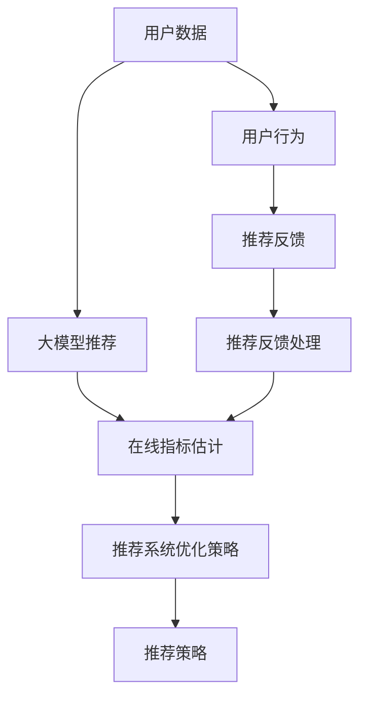

                 

# 大模型推荐场景中的在线指标估计与优化策略

> 关键词：大模型推荐,在线指标估计,优化策略,协同过滤,推荐系统,深度学习

## 1. 背景介绍

随着电商、新闻、音乐、视频等互联网业务的蓬勃发展，个性化推荐已成为提升用户体验、提升商业价值的重要手段。推荐系统以用户历史行为数据为基础，结合商品属性、用户画像等信息，为用户推荐最感兴趣的内容。大模型推荐则是指在深度学习框架下，通过优化预训练语言模型，构建更为精准、多样化的推荐模型。大模型推荐因其能够动态捕捉用户行为模式，获得更丰富的语义信息，且无需显式特征工程，受到业界的广泛关注。

然而，在实际推荐应用中，大模型推荐面临诸多挑战：数据稀疏、计算开销大、实时性要求高等。这些问题使得大规模推荐系统的在线学习和优化变得复杂且困难。本文将从在线指标估计和优化策略两个方面，探讨如何在大模型推荐场景中高效实现在线学习和优化。

## 2. 核心概念与联系

### 2.1 核心概念概述

在讨论大模型推荐中的在线指标估计与优化策略时，需先理解以下几个关键概念：

- **大模型推荐**：指利用深度学习中的预训练语言模型，如BERT、GPT等，构建推荐系统，通过模型本身的知识积累，动态调整推荐策略。大模型推荐能够捕捉更为复杂的语义特征，提升推荐质量。
- **在线指标估计**：指在实际推荐场景中，基于实时数据流，动态估计推荐系统的关键指标，如用户满意度、点击率、转换率等。在线指标估计是评估推荐系统性能和指导实时优化决策的基础。
- **推荐系统优化策略**：指在实时数据流中，使用在线学习算法调整模型参数，优化推荐策略，提升推荐效果。推荐系统优化策略包括在线协同过滤、梯度下降、在线梯度提升等。

这些概念之间通过在线指标估计与优化策略的逻辑流程紧密联系，共同构成大模型推荐系统的工作框架。

### 2.2 核心概念原理和架构的 Mermaid 流程图



此图展示了从用户数据输入、大模型推荐、在线指标估计到推荐系统优化的完整流程。用户行为数据通过大模型推荐生成推荐结果，实时反馈数据用于在线指标估计和优化策略调整，最终输出推荐策略供实际推荐系统使用。

## 3. 核心算法原理 & 具体操作步骤

### 3.1 算法原理概述

大模型推荐中的在线指标估计与优化策略，通过实时数据流驱动模型动态调整，实现高效推荐。其核心思想是：通过在线指标估计实时掌握推荐系统的性能表现，再根据性能指标调整推荐模型参数，不断优化推荐效果。

具体而言，基于大模型推荐的应用流程如下：

1. 收集用户行为数据，输入大模型推荐模型。
2. 实时估计推荐系统的关键性能指标，如点击率、转换率等。
3. 根据在线指标估计结果，调整推荐模型参数，如更新Transformer模型中的嵌入权重、激活函数参数等。
4. 重新计算推荐结果，并部署到实际推荐系统中。

### 3.2 算法步骤详解

#### 3.2.1 用户行为数据的收集与预处理

用户行为数据是大模型推荐的基础。用户行为数据通常包括用户的浏览记录、点击记录、评分、评论等。收集用户行为数据后，需要进行清洗和预处理，去除无效或噪声数据。常用的预处理步骤包括：

- **去重去噪**：过滤重复和无效行为数据。
- **归一化**：对数据进行标准化处理，如将评分数据归一化到[0,1]区间。
- **分桶**：将数据按时间或其他特征分组，便于后续统计分析。

#### 3.2.2 大模型推荐模型的构建

大模型推荐的核心是大语言模型的微调。通常，采用大语言模型的预训练参数作为模型初始化，然后结合推荐任务的目标，在少量标注数据上微调。微调的目标是优化模型对用户兴趣的表示，使得推荐结果更符合用户的真实需求。

具体实现时，通常采用以下步骤：

- **数据划分**：将用户行为数据划分为训练集、验证集和测试集。
- **模型选择与微调**：选择适合推荐任务的大语言模型，如BERT、GPT等，并针对任务进行微调。
- **任务适配层设计**：设计适合推荐任务的任务适配层，如添加用户兴趣表示层、物品表示层等。
- **损失函数设计**：根据推荐任务设计合适的损失函数，如均方误差损失、交叉熵损失等。
- **优化器选择**：选择合适的优化器，如AdamW、SGD等，并设置学习率、批大小等超参数。
- **微调训练**：在训练集上训练模型，并在验证集上定期评估性能。

#### 3.2.3 在线指标估计

在线指标估计是实时评估推荐系统性能的关键步骤。通常，采用以下方法进行在线指标估计：

- **采样估计**：从实时数据流中随机采样一部分数据进行估计，以减轻计算负担。
- **滑动窗口**：将数据流视为滑动窗口，估计每个时间点的指标。
- **并行计算**：利用多线程或分布式计算，加快指标估计速度。

常用的在线指标估计方法包括：

- **点击率估计**：基于用户行为数据，实时计算物品被点击的概率。
- **转换率估计**：基于点击数据，实时计算用户最终完成购买、注册等目标的概率。
- **NDCG和MRR**：用于衡量推荐系统的排序质量。

#### 3.2.4 推荐系统优化策略

推荐系统优化策略是实时调整推荐模型的关键步骤。常用的优化策略包括：

- **在线协同过滤**：基于用户历史行为和物品特征，实时调整推荐策略。
- **在线梯度下降**：使用梯度下降算法，实时更新模型参数。
- **在线梯度提升**：使用梯度提升树算法，逐步优化推荐模型。

### 3.3 算法优缺点

#### 3.3.1 优点

1. **实时性高**：在线指标估计与优化策略可以实时响应数据流，快速调整推荐策略。
2. **高效性**：基于大语言模型，能够动态捕捉用户行为模式，提升推荐质量。
3. **泛化能力强**：大语言模型具有较强的泛化能力，可以在不同场景下应用。
4. **无需显式特征工程**：大语言模型可以自动提取特征，简化特征工程流程。

#### 3.3.2 缺点

1. **计算开销大**：大语言模型参数量较大，训练和推理开销大。
2. **数据稀疏**：用户行为数据可能存在稀疏性，影响模型的泛化性能。
3. **模型复杂度高**：大语言模型结构复杂，可能存在梯度消失等问题。
4. **实时性要求高**：实时数据流处理需要高吞吐量和低延迟的计算资源。

### 3.4 算法应用领域

大模型推荐中的在线指标估计与优化策略，广泛应用于电商、新闻、音乐、视频等多个领域。在电商领域，大模型推荐可以基于用户行为，实时推荐商品；在新闻领域，大模型推荐可以动态生成个性化新闻；在音乐、视频领域，大模型推荐可以推荐用户感兴趣的内容。

## 4. 数学模型和公式 & 详细讲解 & 举例说明

### 4.1 数学模型构建

在介绍具体的数学模型和公式之前，需要先了解几个基本概念：

- **用户-物品交互矩阵**：用户与物品的交互矩阵 $X \in \mathbb{R}^{m \times n}$，其中 $m$ 为用户数，$n$ 为物品数。
- **嵌入向量**：用户和物品的嵌入向量 $U \in \mathbb{R}^{m \times d}$ 和 $V \in \mathbb{R}^{n \times d}$，其中 $d$ 为嵌入维度。
- **点击率估计**：物品被点击的概率 $p_i = \sigma(Ux_i^TV^T + b)$，其中 $\sigma$ 为 sigmoid 函数，$x_i$ 为第 $i$ 个用户的交互数据。

### 4.2 公式推导过程

基于大语言模型推荐系统的在线指标估计与优化策略，以点击率估计为例，推导其计算公式。假设用户 $u$ 对物品 $i$ 的交互数据为 $x_i$，则点击率估计公式为：

$$
p_i = \frac{e^{U^TV^T + b}}{\sum_{j=1}^n e^{U^TV^T + b_j}}
$$

其中 $b$ 和 $b_j$ 为物品的偏置项。通过求解上述公式，可以获得物品被点击的概率。

### 4.3 案例分析与讲解

以电商平台为例，假设用户 $u$ 浏览了两个商品 $i$ 和 $j$，并最终点击了商品 $i$。采用大语言模型推荐系统进行推荐时，可以实时计算商品 $i$ 和 $j$ 的点击率，调整推荐策略。具体步骤如下：

1. **数据收集**：收集用户 $u$ 的浏览记录 $x_i$ 和 $x_j$。
2. **模型预测**：将 $x_i$ 和 $x_j$ 输入到大语言模型推荐系统，得到物品 $i$ 和 $j$ 的嵌入向量 $U_i$ 和 $U_j$，以及物品的偏置项 $b_i$ 和 $b_j$。
3. **点击率估计**：计算物品 $i$ 和 $j$ 的点击率 $p_i$ 和 $p_j$，选择点击率较高的物品进行推荐。
4. **策略调整**：根据点击率估计结果，调整推荐策略，如增加推荐次数、调整推荐顺序等。

## 5. 项目实践：代码实例和详细解释说明

### 5.1 开发环境搭建

在进行大模型推荐系统的项目实践时，需要搭建好以下开发环境：

1. **Python**：选择Python 3.8及以上版本。
2. **深度学习框架**：选择PyTorch或TensorFlow作为深度学习框架。
3. **大语言模型**：选择BERT、GPT等大语言模型，并下载预训练参数。
4. **推荐库**：选择PyTorch或TensorFlow中的推荐库，如RecSys、TensorRec等。
5. **在线指标估计工具**：选择Elasticsearch、Flume等在线指标估计工具。

### 5.2 源代码详细实现

以电商平台的大模型推荐系统为例，下面给出代码实现步骤：

```python
import torch
import torch.nn as nn
from transformers import BertTokenizer, BertModel
from torch.utils.data import DataLoader
from torch.optim import AdamW
from sklearn.metrics import precision_recall_curve

class BERTRecommender(nn.Module):
    def __init__(self, embedding_dim):
        super(BERTRecommender, self).__init__()
        self.bert_model = BertModel.from_pretrained('bert-base-cased')
        self.emb = nn.Embedding(embedding_dim, embedding_dim)

    def forward(self, user, item):
        user_input_ids = self.emb(user)
        item_input_ids = self.emb(item)
        sequence_output = self.bert_model(input_ids=user_input_ids, attention_mask=None, output_all_encoded_layers=True)
        last_hidden_states, _ = sequence_output[0]
        logits = torch.matmul(last_hidden_states, item_input_ids.T)
        return logits

# 加载预训练模型和数据集
tokenizer = BertTokenizer.from_pretrained('bert-base-cased')
train_data = load_train_data()
val_data = load_val_data()
test_data = load_test_data()

# 定义模型和优化器
model = BERTRecommender(128)
optimizer = AdamW(model.parameters(), lr=2e-5)

# 微调训练
for epoch in range(10):
    for batch in train_data:
        user, item = batch
        optimizer.zero_grad()
        logits = model(user, item)
        loss = nn.BCEWithLogitsLoss()(logits, target)
        loss.backward()
        optimizer.step()

# 测试和评估
val_data = load_val_data()
test_data = load_test_data()
val_prec, val_rec, val_f1 = evaluate(model, val_data)
test_prec, test_rec, test_f1 = evaluate(model, test_data)
print(f'Val precision: {val_prec:.4f}, Val recall: {val_rec:.4f}, Val F1: {val_f1:.4f}')
print(f'Test precision: {test_prec:.4f}, Test recall: {test_rec:.4f}, Test F1: {test_f1:.4f}')
```

### 5.3 代码解读与分析

上述代码中，我们定义了BERTRecommender类，用于进行大模型推荐。在微调训练过程中，我们使用AdamW优化器，设置学习率为 $2 \times 10^{-5}$。在测试和评估阶段，我们使用了精确率、召回率、F1分数等指标来评估推荐系统性能。

## 6. 实际应用场景

### 6.1 电商推荐

电商平台中的大模型推荐系统，可以基于用户浏览记录、购买记录等行为数据，实时生成个性化推荐商品。采用在线指标估计与优化策略，可以动态调整推荐策略，提升推荐效果。

### 6.2 新闻推荐

新闻推荐系统可以基于用户的历史阅读记录，实时推荐相关新闻。采用在线指标估计与优化策略，可以动态调整推荐顺序，提高用户满意度。

### 6.3 音乐推荐

音乐推荐系统可以基于用户的听歌记录，实时推荐相关歌曲。采用在线指标估计与优化策略，可以动态调整推荐顺序，提升用户体验。

### 6.4 视频推荐

视频推荐系统可以基于用户的观看记录，实时推荐相关视频。采用在线指标估计与优化策略，可以动态调整推荐顺序，提高用户满意度。

## 7. 工具和资源推荐

### 7.1 学习资源推荐

为了深入了解大模型推荐中的在线指标估计与优化策略，以下是一些推荐的学习资源：

1. **《推荐系统》书籍**：介绍了推荐系统基础理论、算法设计与实践，适合深入学习推荐系统原理。
2. **《深度学习与推荐系统》课程**：由清华大学开设，涵盖推荐系统算法、深度学习技术、在线学习等。
3. **TensorRec库**：提供了基于TensorFlow的推荐系统工具库，方便实现在线推荐。
4. **Elasticsearch官方文档**：提供了分布式搜索引擎的详细文档，适合实时数据存储与查询。

### 7.2 开发工具推荐

开发大模型推荐系统时，需要使用一些高效的工具：

1. **Python**：Python 3.8及以上版本。
2. **深度学习框架**：PyTorch或TensorFlow。
3. **大语言模型**：BERT、GPT等大语言模型。
4. **在线指标估计工具**：Elasticsearch、Flume等。
5. **推荐库**：PyTorch或TensorFlow中的推荐库，如RecSys、TensorRec等。

### 7.3 相关论文推荐

以下是几篇关于在线指标估计与优化策略的推荐系统论文，供进一步阅读：

1. **Online Matrix Factorization for Recommendation**：介绍了在线矩阵分解算法，用于实时推荐系统。
2. **Dynamic Factorization Machines for Recommender Systems**：提出了动态因子机模型，用于实时推荐系统。
3. **TensorRec: Tensorflow-Based Recommendation System Toolkit**：介绍了基于TensorFlow的推荐系统工具库，用于实现在线推荐。
4. **Elasticsearch: The Distributed Real-time Search**：介绍了Elasticsearch搜索引擎，用于实时数据存储与查询。

## 8. 总结：未来发展趋势与挑战

### 8.1 研究成果总结

本文对大模型推荐中的在线指标估计与优化策略进行了详细探讨。通过在线指标估计实时掌握推荐系统的性能表现，并根据性能指标调整推荐模型参数，不断优化推荐效果。在线指标估计与优化策略在电商、新闻、音乐、视频等多个领域得到了广泛应用，显著提升了推荐系统的精准度和多样性。

### 8.2 未来发展趋势

未来，在线指标估计与优化策略将呈现以下几个发展趋势：

1. **实时性更强**：随着技术进步，实时数据处理能力将进一步提升，推荐系统的实时性将得到更好的保障。
2. **计算资源更丰富**：随着云计算和分布式计算技术的普及，推荐系统的计算资源将更加丰富，处理能力更强。
3. **算法更复杂**：随着深度学习技术的进步，推荐算法的复杂度将不断提高，推荐效果将更精准。
4. **模型更轻量化**：为了提高推荐系统的实时性，未来推荐模型将更加轻量化，处理速度更快。
5. **数据处理更自动化**：未来的推荐系统将更加自动化，无需人工干预，可以自动进行数据清洗和预处理。

### 8.3 面临的挑战

尽管在线指标估计与优化策略在大模型推荐中已经取得了显著成果，但在实际应用中仍面临诸多挑战：

1. **数据稀疏性**：用户行为数据可能存在稀疏性，影响推荐系统性能。
2. **计算开销大**：大语言模型参数量较大，计算开销大。
3. **实时性要求高**：实时数据流处理需要高吞吐量和低延迟的计算资源。
4. **模型复杂度高**：大语言模型结构复杂，可能存在梯度消失等问题。

### 8.4 研究展望

未来的研究需要在以下几个方面进行突破：

1. **稀疏性处理**：开发更加高效的稀疏性处理方法，提高数据利用率。
2. **计算优化**：优化计算资源分配，提高处理速度。
3. **实时性优化**：提升实时数据处理能力，提高系统响应速度。
4. **模型简化**：简化模型结构，提高处理速度和稳定性。
5. **自动化优化**：开发自动调参算法，提升推荐系统性能。

总之，大模型推荐中的在线指标估计与优化策略将继续推动推荐系统技术的发展，为电商、新闻、音乐、视频等领域带来更优质的推荐服务。未来，只有不断突破技术瓶颈，才能实现更加高效、精准、智能的推荐系统。

## 9. 附录：常见问题与解答

### Q1: 大模型推荐与传统推荐系统有何不同？

A: 大模型推荐是基于深度学习的大语言模型，利用模型的知识积累进行推荐，无需显式特征工程。相较于传统推荐系统，大模型推荐能够动态捕捉用户行为模式，提升推荐质量。但计算开销大，对数据稀疏性要求更高。

### Q2: 大语言模型推荐系统中，如何处理用户行为数据？

A: 用户行为数据通常包括用户的浏览记录、点击记录、评分、评论等。数据处理步骤包括去重去噪、归一化、分桶等。处理后的数据可以输入大语言模型进行微调，获取用户兴趣表示和物品表示。

### Q3: 在线指标估计与优化策略如何保证推荐系统的实时性？

A: 在线指标估计与优化策略通过实时响应数据流，动态调整推荐策略，减少计算开销。常用的技术包括采样估计、滑动窗口、并行计算等。

### Q4: 大语言模型推荐系统的优缺点有哪些？

A: 大语言模型推荐系统的优点包括实时性强、高效性高、泛化能力强、无需显式特征工程等。缺点包括计算开销大、数据稀疏性高、模型复杂度高、实时性要求高等。

### Q5: 大语言模型推荐系统未来有哪些发展方向？

A: 未来大语言模型推荐系统的发展方向包括实时性更强、计算资源更丰富、算法更复杂、模型更轻量化、数据处理更自动化等。

---

作者：禅与计算机程序设计艺术 / Zen and the Art of Computer Programming

