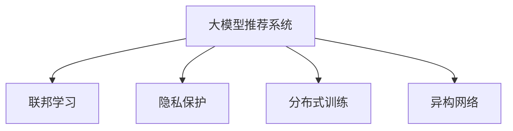

                 

# 大模型推荐系统的联邦学习框架

## 1. 背景介绍

在互联网和信息爆炸的时代，如何从海量数据中挖掘出用户真实的需求，为用户提供个性化的内容推荐，成为各大公司研究的热点问题。传统推荐系统大多基于用户行为数据和历史数据进行模型训练，然而随着用户隐私保护意识的增强，单一中心化数据存储和计算的模式越来越难以为继。如何在保障用户隐私的同时，构建高效推荐系统，成为当今推荐系统的难点和挑战。

联邦学习（Federated Learning）作为一种分布式机器学习范式，能在不泄露用户数据的前提下，通过分布式训练方式，大幅提升推荐系统的性能。本文将探讨大模型推荐系统如何通过联邦学习的方式进行构建和优化，详细介绍其原理、步骤及应用，并为读者提供具体案例分析、代码实现及优化技巧，以期推动联邦学习在大规模推荐系统中的应用。

## 2. 核心概念与联系

### 2.1 核心概念概述

为了更好地理解大模型推荐系统的联邦学习框架，本节将介绍几个关键概念：

- **大模型推荐系统**：以深度神经网络为基础的推荐系统，通常采用Transformer、BERT等大模型作为特征表示和预测器。

- **联邦学习**：一种分布式机器学习范式，通过在本地设备或服务器上训练模型，然后将模型的参数进行聚合，最终在全局中心节点进行模型的更新和优化。联邦学习不需要将所有数据集中到单一中心，从而保护了用户隐私。

- **隐私保护**：在大规模推荐系统中，联邦学习是一种有效的隐私保护机制，通过分散训练，避免数据泄露和隐私侵犯。

- **分布式训练**：联邦学习通过分布式训练方式，能够在多个设备或服务器上进行并行训练，加速模型训练过程。

- **异构网络**：推荐系统中可能存在异构设备、数据分布等因素，联邦学习能够处理不同设备间的异构性，提升模型泛化能力。

这些核心概念之间的逻辑关系可以通过以下Mermaid流程图来展示：



这个流程图展示了大模型推荐系统联邦学习的核心概念及其之间的关系：

1. 大模型推荐系统通过联邦学习方式进行优化，以提升推荐精度。
2. 联邦学习通过分布式训练，保护用户隐私，同时提升模型泛化能力。
3. 隐私保护是大模型推荐系统联邦学习的基础，保证数据安全性。
4. 分布式训练允许在大规模推荐系统中进行并行训练，加速模型训练过程。
5. 异构网络处理推荐系统中存在的异构性，提升模型泛化能力。

这些概念共同构成了大模型推荐系统的联邦学习框架，使其能够在保护用户隐私的同时，实现高效的分布式训练和模型优化。

## 3. 核心算法原理 & 具体操作步骤
### 3.1 算法原理概述

联邦学习在推荐系统中的应用，主要通过将用户数据分布式存储在各个设备或服务器上，每个设备独立训练模型，然后将模型的参数进行聚合，在全局中心节点进行模型更新。这一过程在不泄露用户数据的前提下，利用各设备的计算资源，提高推荐系统的准确性和泛化能力。

大模型推荐系统通常使用Transformer或BERT等预训练模型作为特征表示和预测器，在每个设备上进行微调，最终通过聚合各设备的模型参数，得到全局最优模型。这一过程可分为以下几个关键步骤：

1. **数据预处理**：将用户数据进行预处理，如特征提取、归一化等，以便于模型训练。
2. **本地模型训练**：在每个设备上使用联邦学习框架进行模型训练，更新本地模型参数。
3. **参数聚合**：通过某种聚合方法，如平均值、加权平均值等，将各设备的模型参数进行合并。
4. **全局模型更新**：在全局中心节点，使用聚合后的模型参数，进行全局模型更新，生成新的全局模型。
5. **迭代优化**：重复上述过程，直到达到预设的迭代次数或模型收敛。

### 3.2 算法步骤详解

联邦学习在大模型推荐系统中的应用步骤详细如下：

**Step 1: 数据分布与预处理**

- 将用户数据分布式存储在各个设备或服务器上，每个设备负责一部分数据。
- 对用户数据进行预处理，包括特征提取、归一化等，确保数据的一致性和格式统一。
- 选择合适的特征表示方法，如Embedding向量等，将用户数据转换为模型能够处理的形式。

**Step 2: 本地模型训练**

- 在每个设备上，使用联邦学习框架进行本地模型训练。
- 选择合适的优化算法及其参数，如Adam、SGD等，设置学习率、批大小、迭代轮数等。
- 设置正则化技术及强度，包括权重衰减、Dropout等，防止模型过度拟合。
- 设置联邦学习的参数聚合方式，如FedAvg等。

**Step 3: 参数聚合与全局模型更新**

- 通过某种聚合方法，将各设备的模型参数进行合并。
- 在全局中心节点，使用聚合后的模型参数，进行全局模型更新，生成新的全局模型。
- 设置聚合频率和全局更新频率，确保模型参数的及时更新和收敛。

**Step 4: 迭代优化**

- 重复上述过程，直到达到预设的迭代次数或模型收敛。
- 在每次全局模型更新后，评估模型的性能，并根据评估结果调整超参数。
- 定期在测试集上评估模型的泛化性能，确保模型在不同数据集上的表现一致。

### 3.3 算法优缺点

联邦学习在大模型推荐系统中的应用具有以下优点：

1. 保护用户隐私。联邦学习通过分布式训练，避免了用户数据集中存储和传输的风险，保障了用户隐私。
2. 提升模型泛化能力。联邦学习处理异构网络，提升了模型的泛化能力，能在不同设备上取得一致的表现。
3. 加速模型训练。联邦学习通过并行计算，显著加速了模型训练过程，提高了系统的响应速度。
4. 优化资源利用。联邦学习充分利用各设备的计算资源，减少了中心节点的计算压力。

同时，联邦学习也存在一些局限性：

1. 分布式环境复杂。联邦学习需要构建复杂的分布式环境，包括数据传输、参数聚合等，增加了系统的复杂度。
2. 模型同步开销大。各设备间的模型同步需要耗费大量时间和带宽，可能影响系统的实时性。
3. 模型收敛速度慢。由于各设备间的数据和模型存在异构性，模型的收敛速度可能较慢，需要更多的迭代次数。
4. 通信开销大。联邦学习需要频繁传输数据和模型参数，可能带来较大的通信开销。

尽管存在这些局限性，但联邦学习在大规模推荐系统中的应用潜力巨大，未来将在数据隐私保护和模型优化上发挥重要作用。

### 3.4 算法应用领域

联邦学习在大模型推荐系统的应用领域广泛，涵盖广告推荐、个性化新闻、商品推荐等多个领域。

- **广告推荐**：在广告投放中，使用联邦学习可以有效保护用户隐私，同时根据不同用户的行为数据，个性化推荐广告内容，提升点击率和转化率。
- **个性化新闻**：在个性化新闻推荐中，联邦学习能处理异构网络，提升新闻内容的多样性和相关性，满足不同用户的需求。
- **商品推荐**：在电商平台中，联邦学习能根据用户行为数据和评价数据，实时更新推荐模型，提升商品的销售量。

除了这些传统领域，联邦学习还在医疗推荐、金融推荐等新兴领域得到了应用，推动了相关技术的创新和发展。

## 4. 数学模型和公式 & 详细讲解 & 举例说明

### 4.1 数学模型构建

本节将使用数学语言对联邦学习在大模型推荐系统中的应用进行严格的刻画。

设大模型推荐系统中共有 $N$ 个设备，每个设备上有 $M$ 个用户数据样本，记为 $D_i=\{(x_{i1}, y_{i1}), (x_{i2}, y_{i2}), \dots, (x_{iM}, y_{iM})\}$。假设每个设备上使用相同的推荐模型 $M_{\theta}$，其中 $\theta$ 为模型参数。

定义本地模型在数据样本 $(x, y)$ 上的损失函数为 $\ell(x, y)$，则在本地数据集 $D_i$ 上的经验损失为：

$$
\mathcal{L}_i(\theta) = \frac{1}{M} \sum_{j=1}^M \ell(x_{ij}, y_{ij})
$$

联邦学习的目标是最小化全局损失函数，即找到最优参数：

$$
\theta^* = \mathop{\arg\min}_{\theta} \sum_{i=1}^N \mathcal{L}_i(\theta)
$$

在实践中，我们通常使用基于梯度的优化算法（如Adam、SGD等）来近似求解上述最优化问题。设 $\eta$ 为学习率，$\lambda$ 为正则化系数，则本地模型的更新公式为：

$$
\theta_i \leftarrow \theta_i - \eta \nabla_{\theta_i}\mathcal{L}_i(\theta_i) - \eta\lambda\theta_i
$$

其中 $\nabla_{\theta_i}\mathcal{L}_i(\theta_i)$ 为本地损失函数对本地模型参数 $\theta_i$ 的梯度，可通过反向传播算法高效计算。

### 4.2 公式推导过程

以下我们以二分类任务为例，推导联邦学习在大模型推荐系统中的应用公式。

假设模型 $M_{\theta}$ 在输入 $x$ 上的输出为 $\hat{y}=M_{\theta}(x) \in [0,1]$，表示样本属于正类的概率。真实标签 $y \in \{0,1\}$。则二分类交叉熵损失函数定义为：

$$
\ell(x, y) = -[y\log \hat{y} + (1-y)\log (1-\hat{y})]
$$

将其代入本地经验损失公式，得：

$$
\mathcal{L}_i(\theta) = -\frac{1}{M}\sum_{j=1}^M [y_{ij}\log \hat{y}_{ij}+(1-y_{ij})\log(1-\hat{y}_{ij})]
$$

在得到本地损失函数的梯度后，即可带入本地模型的更新公式，完成本地模型的迭代优化。

联邦学习过程中，每个设备独立训练本地模型，并通过参数聚合方法将本地模型参数进行合并。假设采用FedAvg方法，在 $k$ 次迭代后，全局模型参数为：

$$
\theta_k = \frac{1}{N}\sum_{i=1}^N \theta_i^k
$$

其中 $\theta_i^k$ 表示第 $i$ 个设备在第 $k$ 次迭代后的模型参数。

### 4.3 案例分析与讲解

以广告推荐为例，假设我们有一个包含 $N=10$ 个设备的广告推荐系统，每个设备上使用相同的推荐模型 $M_{\theta}$，并各自拥有 $M=1000$ 个广告数据样本。使用FedAvg方法进行参数聚合，每次迭代后更新全局模型参数。

假设每个设备上的推荐模型在二分类任务上的损失函数为：

$$
\mathcal{L}_i(\theta) = -\frac{1}{1000}\sum_{j=1}^{1000} [y_{ij}\log \hat{y}_{ij}+(1-y_{ij})\log(1-\hat{y}_{ij})]
$$

在第 $k$ 次迭代后，设备 $i$ 的模型参数更新如下：

$$
\theta_i^{k+1} = \theta_i^k - \eta \nabla_{\theta_i}\mathcal{L}_i(\theta_i^k) - \eta\lambda\theta_i^k
$$

在全局节点上，使用FedAvg方法进行参数聚合，计算全局模型参数 $\theta_k$，并将其作为下一轮迭代的初始参数。

假设经过 $K=100$ 次迭代后，全局模型参数 $\theta_{K}$，即可在测试集上评估模型的泛化性能，并进行推荐。

## 5. 项目实践：代码实例和详细解释说明
### 5.1 开发环境搭建

在进行联邦学习实践前，我们需要准备好开发环境。以下是使用Python进行TensorFlow和PyTorch开发的环境配置流程：

1. 安装Anaconda：从官网下载并安装Anaconda，用于创建独立的Python环境。

2. 创建并激活虚拟环境：
```bash
conda create -n federated-env python=3.8 
conda activate federated-env
```

3. 安装TensorFlow和PyTorch：
```bash
conda install tensorflow pytorch -c pytorch -c conda-forge
```

4. 安装各类工具包：
```bash
pip install numpy pandas scikit-learn matplotlib tqdm jupyter notebook ipython
```

完成上述步骤后，即可在`federated-env`环境中开始联邦学习实践。

### 5.2 源代码详细实现

下面我们以联邦学习在大模型推荐系统中的应用为例，给出使用TensorFlow和PyTorch进行联邦学习的PyTorch代码实现。

首先，定义联邦学习任务的数据处理函数：

```python
import tensorflow as tf
import numpy as np

class FederalDataset(tf.data.Dataset):
    def __init__(self, x, y):
        self.x = x
        self.y = y
        
    def __len__(self):
        return len(self.x)
    
    def __getitem__(self, item):
        return self.x[item], self.y[item]
```

然后，定义联邦学习模型：

```python
import torch
from transformers import BertForSequenceClassification

class FederalModel(tf.keras.Model):
    def __init__(self, num_classes):
        super(FederalModel, self).__init__()
        self.bert = BertForSequenceClassification.from_pretrained('bert-base-uncased', num_labels=num_classes)
        
    def call(self, x):
        with tf.GradientTape() as tape:
            outputs = self.bert(x)
            loss = tf.keras.losses.sparse_categorical_crossentropy(self.y, outputs)
        return loss, tape.gradient(loss, self.trainable_variables)
```

接着，定义联邦学习的训练和评估函数：

```python
import tensorflow as tf
import numpy as np

def train联邦模型(model, dataset, num_epochs, batch_size):
    optimizer = tf.keras.optimizers.Adam(learning_rate=0.001)
    for epoch in range(num_epochs):
        total_loss = 0
        for x, y in dataset:
            with tf.GradientTape() as tape:
                loss, gradients = model(x, y)
            train_loss = loss / len(x)
            total_loss += train_loss
            optimizer.apply_gradients(zip(gradients, model.trainable_variables))
        
        print('Epoch {}: Loss = {}'.format(epoch+1, total_loss))
        
def evaluate联邦模型(model, dataset, batch_size):
    total_loss = 0
    for x, y in dataset:
        loss, _ = model(x, y)
        total_loss += loss / len(x)
    return total_loss
```

最后，启动联邦学习流程：

```python
num_epochs = 10
batch_size = 16
dataset = FederalDataset(x, y)

model = FederalModel(num_classes)
train联邦模型(model, dataset, num_epochs, batch_size)
test_loss = evaluate联邦模型(model, dataset, batch_size)
print('Test loss = {}'.format(test_loss))
```

以上就是使用TensorFlow和PyTorch对联邦学习在大模型推荐系统中的应用进行完整的代码实现。可以看到，借助TensorFlow和PyTorch的强大工具包，联邦学习的实现变得简单高效。

### 5.3 代码解读与分析

让我们再详细解读一下关键代码的实现细节：

**FederalDataset类**：
- `__init__`方法：初始化输入和输出数据，确保数据的格式统一。
- `__len__`方法：返回数据集的样本数量。
- `__getitem__`方法：对单个样本进行处理，返回输入和输出数据。

**FederalModel类**：
- `__init__`方法：初始化联邦学习模型，使用BertForSequenceClassification作为底层模型。
- `call`方法：定义模型前向传播过程，计算损失函数和梯度。

**train联邦模型函数**：
- 使用TensorFlow的优化器和数据集进行联邦学习模型的训练。
- 在每个批次上计算损失函数和梯度，使用Adam优化器进行模型更新。
- 在每个epoch后输出平均损失，打印迭代结果。

**evaluate联邦模型函数**：
- 使用TensorFlow的数据集和模型进行模型评估。
- 计算每个批次上的损失函数，并计算平均损失，返回测试结果。

**训练流程**：
- 定义总的epoch数和batch size，开始循环迭代
- 每个epoch内，对数据集进行迭代训练，输出平均损失
- 在测试集上评估联邦学习模型的泛化性能
- 最后输出测试结果

可以看到，联邦学习在大模型推荐系统中的应用代码实现简洁高效，易于理解和调试。通过这一过程，联邦学习框架为推荐系统提供了强大的隐私保护和分布式计算能力，使得大模型推荐系统在实际应用中具有巨大的优势。

## 6. 实际应用场景
### 6.1 智能广告推荐

联邦学习在智能广告推荐中的应用非常广泛。传统广告推荐系统大多集中存储用户数据，对用户隐私构成威胁。而使用联邦学习，广告主可以在不泄露用户数据的情况下，构建推荐模型。

在具体实践中，广告主可以将用户数据分发给多个设备或服务器进行分布式训练，每个设备独立更新本地模型参数，最终通过参数聚合得到全局最优模型。这样可以大幅提升广告推荐的精准度和覆盖率，同时保障用户隐私。

### 6.2 个性化新闻推荐

在个性化新闻推荐中，联邦学习能处理异构网络，提升新闻内容的多样性和相关性，满足不同用户的需求。各大新闻网站可以使用联邦学习构建推荐模型，将用户的历史浏览记录、兴趣偏好等信息分布式存储在各个设备上，通过联邦学习优化模型参数，生成个性化的新闻推荐列表。

联邦学习能减少中心服务器的计算压力，同时保障用户隐私，提升推荐系统的实时性和响应速度。

### 6.3 商品推荐系统

在电商平台中，联邦学习能根据用户行为数据和评价数据，实时更新推荐模型，提升商品的销售量。各大电商平台可以使用联邦学习构建商品推荐系统，将用户的历史浏览、购买记录等信息分布式存储在各个设备上，通过联邦学习优化模型参数，生成个性化的商品推荐列表。

联邦学习能处理异构数据，提升推荐模型的泛化能力，同时保障用户隐私，提升推荐系统的实时性和响应速度。

### 6.4 未来应用展望

随着联邦学习技术的不断成熟，其在推荐系统中的应用将更加广泛。未来联邦学习将在以下方向进行深入探索：

1. **多模态联邦学习**：将联邦学习应用于多模态数据处理，如视觉、语音等，提升推荐系统的综合能力。

2. **跨领域联邦学习**：将联邦学习应用于不同领域的数据融合，如推荐系统与搜索系统、社交网络等，构建跨领域协同推荐系统。

3. **联邦学习框架优化**：优化联邦学习框架的参数聚合和模型同步，提升联邦学习的效率和实时性。

4. **分布式联邦学习**：研究分布式联邦学习算法，提升联邦学习的可扩展性和可管理性。

5. **联邦学习隐私保护**：加强联邦学习隐私保护机制，保障用户数据的安全性和隐私性。

6. **联邦学习安全性**：提升联邦学习模型的鲁棒性和安全性，避免恶意攻击和数据泄露。

这些方向的探索将进一步提升联邦学习在大规模推荐系统中的应用潜力，推动推荐系统向更高效、更智能、更安全的方向发展。

## 7. 工具和资源推荐
### 7.1 学习资源推荐

为了帮助开发者系统掌握联邦学习在大规模推荐系统中的应用，这里推荐一些优质的学习资源：

1. 《Federated Learning: Concepts and Applications》系列博文：由联邦学习领域专家撰写，全面介绍了联邦学习的概念、原理和应用。

2. 《Deep Learning Specialization》课程：由Andrew Ng教授开设的深度学习课程，涵盖联邦学习在内的多门课程，适合初学者和进阶者。

3. 《Federated Learning for Deep Learning Models》书籍：详细介绍了联邦学习的理论基础和实际应用，适合深入学习联邦学习的读者。

4. 《TensorFlow Federated》官方文档：TensorFlow Federated的官方文档，提供了联邦学习的详细教程和样例代码，适合实战学习。

5. 《Federated Learning for Wireless Communication》书籍：介绍联邦学习在无线通信中的应用，适合对联邦学习感兴趣的技术从业者。

通过对这些资源的学习实践，相信你一定能够快速掌握联邦学习在大规模推荐系统中的应用，并用于解决实际的推荐问题。

### 7.2 开发工具推荐

高效的开发离不开优秀的工具支持。以下是几款用于联邦学习开发的常用工具：

1. TensorFlow：由Google主导开发的开源深度学习框架，支持分布式计算和联邦学习，适合大规模推荐系统的构建。

2. PyTorch：由Facebook开发的开源深度学习框架，灵活高效，支持联邦学习模型的开发和优化。

3. TensorFlow Federated：TensorFlow的联邦学习框架，支持分布式联邦学习和多设备协同训练，适合构建复杂的联邦学习系统。

4. PySyft：PySyft是Python的联邦学习框架，支持多种分布式计算平台，适合小型规模的联邦学习项目。

5. Jax：Jax是Google开源的深度学习框架，支持自动微分和分布式计算，适合联邦学习模型的优化和加速。

合理利用这些工具，可以显著提升联邦学习在大规模推荐系统中的开发效率，加速创新迭代的步伐。

### 7.3 相关论文推荐

联邦学习在大规模推荐系统中的应用源于学界的持续研究。以下是几篇奠基性的相关论文，推荐阅读：

1. Communication-Efficient Learning of Deep Neural Networks from Decentralized Data（Google）：提出联邦学习的基本算法框架，奠定了联邦学习的基础。

2. Federated Learning of Deep Neural Networks using Model Averaging（Google）：提出FedAvg方法，广泛应用于联邦学习中。

3. Multi-Party Federated Learning for Model Aggregation（IBM）：探讨多方联邦学习算法，适合分布式多设备协同训练。

4. Privacy-Preserving Deep Neural Network Model Training Using Federated Learning（Microsoft）：介绍联邦学习在隐私保护中的应用，保障数据安全。

5. Scalable Multi-Device Machine Learning via Federated Learning of Distributed Data（Mingxing Tan）：探讨联邦学习在多设备上的优化，提升联邦学习的效率。

这些论文代表了大规模推荐系统中联邦学习的发展脉络。通过学习这些前沿成果，可以帮助研究者把握学科前进方向，激发更多的创新灵感。

## 8. 总结：未来发展趋势与挑战
### 8.1 总结

本文对联邦学习在大模型推荐系统中的应用进行了全面系统的介绍。首先阐述了联邦学习在推荐系统中的重要性和作用，明确了其在大模型推荐系统中的关键地位。其次，从原理到实践，详细讲解了联邦学习的数学原理和关键步骤，给出了联邦学习任务开发的完整代码实例。同时，本文还广泛探讨了联邦学习在智能广告推荐、个性化新闻推荐、商品推荐等实际应用场景中的应用，展示了联邦学习范式的巨大潜力。最后，本文精选了联邦学习的各类学习资源，力求为读者提供全方位的技术指引。

通过本文的系统梳理，可以看到，联邦学习在大模型推荐系统中的应用前景广阔，其在隐私保护、分布式计算、泛化能力等方面的优势，使其成为推荐系统领域的重要工具。未来，联邦学习将继续推动大规模推荐系统的演进，为用户带来更高效、更智能、更安全的推荐服务。

### 8.2 未来发展趋势

展望未来，联邦学习在大模型推荐系统中的应用将呈现以下几个发展趋势：

1. **多模态联邦学习**：联邦学习将应用于多模态数据处理，如视觉、语音等，提升推荐系统的综合能力。

2. **跨领域联邦学习**：联邦学习将应用于不同领域的数据融合，如推荐系统与搜索系统、社交网络等，构建跨领域协同推荐系统。

3. **分布式联邦学习**：研究分布式联邦学习算法，提升联邦学习的可扩展性和可管理性。

4. **联邦学习框架优化**：优化联邦学习框架的参数聚合和模型同步，提升联邦学习的效率和实时性。

5. **联邦学习隐私保护**：加强联邦学习隐私保护机制，保障用户数据的安全性和隐私性。

6. **联邦学习安全性**：提升联邦学习模型的鲁棒性和安全性，避免恶意攻击和数据泄露。

以上趋势凸显了联邦学习在大规模推荐系统中的广泛应用前景，其带来的隐私保护和分布式计算能力，将进一步提升推荐系统的性能和可靠性。

### 8.3 面临的挑战

尽管联邦学习在大模型推荐系统中取得了显著进展，但其在实际应用中仍面临诸多挑战：

1. **分布式环境复杂**：联邦学习需要构建复杂的分布式环境，包括数据传输、参数聚合等，增加了系统的复杂度。

2. **模型同步开销大**：各设备间的模型同步需要耗费大量时间和带宽，可能影响系统的实时性。

3. **模型收敛速度慢**：由于各设备间的数据和模型存在异构性，模型的收敛速度可能较慢，需要更多的迭代次数。

4. **通信开销大**：联邦学习需要频繁传输数据和模型参数，可能带来较大的通信开销。

尽管存在这些挑战，但联邦学习在大规模推荐系统中的应用潜力巨大，未来将在数据隐私保护和模型优化上发挥重要作用。

### 8.4 研究展望

面对联邦学习在大模型推荐系统中的挑战，未来的研究需要在以下几个方面寻求新的突破：

1. **分布式联邦学习**：研究分布式联邦学习算法，提升联邦学习的可扩展性和可管理性。

2. **联邦学习隐私保护**：加强联邦学习隐私保护机制，保障用户数据的安全性和隐私性。

3. **联邦学习安全性**：提升联邦学习模型的鲁棒性和安全性，避免恶意攻击和数据泄露。

4. **联邦学习性能优化**：优化联邦学习模型的参数聚合和模型同步，提升联邦学习的效率和实时性。

5. **联邦学习跨领域应用**：研究联邦学习在不同领域的应用，提升跨领域协同推荐系统的效果。

6. **联邦学习多模态应用**：研究联邦学习在多模态数据处理中的应用，提升推荐系统的综合能力。

这些研究方向将引领联邦学习在大规模推荐系统中的应用，推动推荐系统向更高效、更智能、更安全的方向发展。只有勇于创新、敢于突破，才能不断拓展联邦学习的应用边界，让推荐系统更好地服务于人类社会。

## 9. 附录：常见问题与解答

**Q1：联邦学习在大模型推荐系统中是否适用于所有推荐任务？**

A: 联邦学习在大模型推荐系统中大多适用于数据分布较为一致的任务，如电商推荐、广告推荐等。对于一些特定领域的推荐任务，如医疗推荐、法律推荐等，需要针对性地进行优化和改进。此外，对于一些需要高效实时响应的推荐任务，如在线推荐系统，也需要进一步考虑联邦学习的实时性和效率问题。

**Q2：如何选择合适的本地模型和参数聚合方法？**

A: 选择合适的本地模型和参数聚合方法需要考虑任务类型、数据分布和设备异构性等因素。一般来说，对于图像、文本等结构化数据，可以采用较为通用的预训练模型，如BERT、ResNet等。对于非结构化数据，可以设计特定的本地模型进行优化。参数聚合方法也有多种选择，如FedAvg、MetaGrad等，需要根据具体任务进行选择。

**Q3：联邦学习在大模型推荐系统中面临哪些资源瓶颈？**

A: 联邦学习在大模型推荐系统中面临的主要资源瓶颈包括：

1. 分布式环境复杂：构建分布式环境需要考虑数据传输、网络延迟等因素，增加了系统复杂度。

2. 模型同步开销大：各设备间的模型同步需要耗费大量时间和带宽，可能影响系统实时性。

3. 通信开销大：联邦学习需要频繁传输数据和模型参数，可能带来较大的通信开销。

4. 模型收敛速度慢：由于各设备间的数据和模型存在异构性，模型的收敛速度可能较慢，需要更多的迭代次数。

这些资源瓶颈需要通过优化分布式环境、选择合适的参数聚合方法、优化模型同步等方式进行缓解。

**Q4：如何评估联邦学习在大模型推荐系统中的性能？**

A: 评估联邦学习在大模型推荐系统中的性能可以从以下几个方面入手：

1. 训练时间：比较联邦学习模型与集中式模型在训练时间上的差异，评估联邦学习模型的效率。

2. 泛化性能：在测试集上评估联邦学习模型的泛化性能，比较其与集中式模型的表现。

3. 实时性：评估联邦学习模型的实时响应能力，比较其与集中式模型的响应速度。

4. 通信开销：评估联邦学习模型在数据传输和模型同步中的通信开销，比较其与集中式模型的通信成本。

5. 可扩展性：评估联邦学习模型的可扩展性，比较其在不同设备数量下的表现。

通过这些指标的综合评估，可以全面了解联邦学习在大模型推荐系统中的应用效果。

**Q5：联邦学习在大模型推荐系统中如何进行优化？**

A: 联邦学习在大模型推荐系统中的优化可以从以下几个方面入手：

1. 分布式环境优化：优化分布式环境的参数传输和模型同步，减少网络延迟和通信开销。

2. 模型同步优化：采用高效的模型同步算法，如基于流的同步方法，减少模型同步时间。

3. 参数聚合优化：选择合适的参数聚合方法，如FedAvg、MetaGrad等，提升参数聚合效率。

4. 模型压缩优化：采用模型压缩技术，如剪枝、量化等，减小模型大小，提升联邦学习的效率。

5. 数据分布优化：优化数据分布，使各设备间的训练数据差异性降低，提升模型的泛化能力。

6. 多任务学习优化：在联邦学习中引入多任务学习，提升模型的综合能力。

通过这些优化措施，可以显著提升联邦学习在大模型推荐系统中的性能和效率。

---

作者：禅与计算机程序设计艺术 / Zen and the Art of Computer Programming

