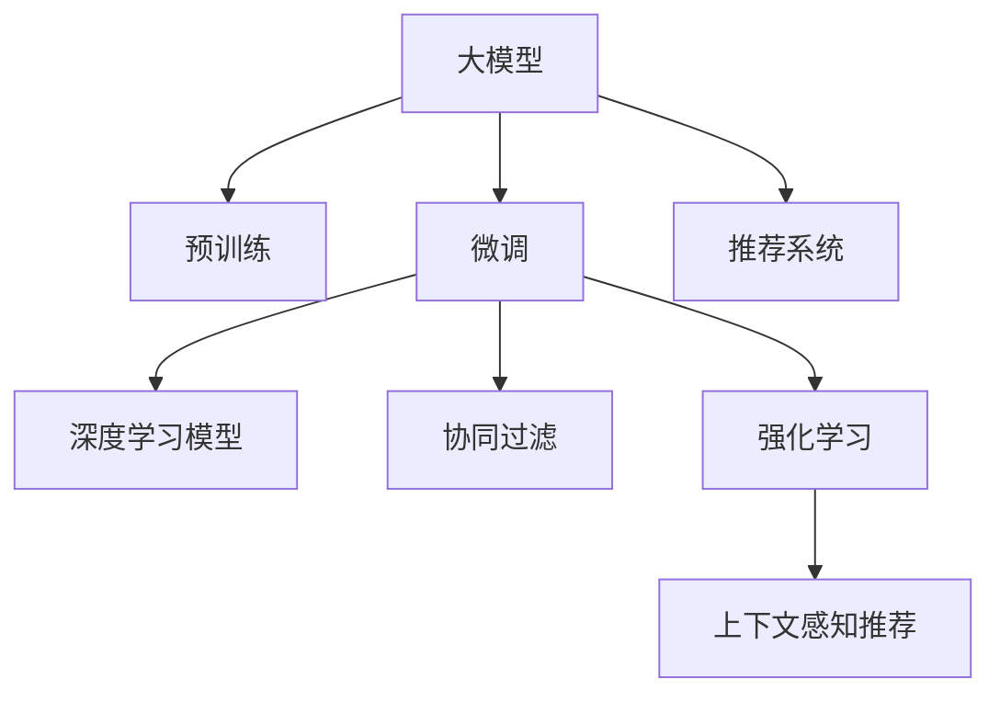

                 

# 大模型是未来个性化推荐的发展方向

> 关键词：大模型,个性化推荐,协同过滤,深度学习,推荐系统,强化学习

## 1. 背景介绍

### 1.1 问题由来

在互联网时代，随着数据和算力的不断积累，个性化推荐技术得到了迅猛发展。从早期的协同过滤(Collaborative Filtering, CF)，到基于深度学习的推荐模型，推荐系统的应用范围和效果都显著提升。当前，推荐系统已经广泛渗透到电商、社交、新闻、音乐、视频等多个领域，极大地改善了用户的在线体验，提高了系统的用户粘性和商业价值。

然而，面对规模庞大、种类繁杂的商品和服务，现有的推荐系统依然存在诸多问题。尽管个性化推荐模型在大型商品数据集上表现良好，但对于小众商品、长尾商品的推荐效果仍不尽人意。用户需求的动态变化、上下文环境的复杂性，以及用户的个性化偏好，都给推荐系统的构建带来了新的挑战。

面对这些挑战，大语言模型应运而生。大语言模型利用大规模无标签文本数据进行预训练，学习到丰富的语言知识，具备强大的文本生成和理解能力。通过微调，大语言模型可以灵活适应各种推荐任务，提升推荐系统的效果和效率，成为未来个性化推荐的发展方向。

### 1.2 问题核心关键点

1. **大模型预训练与微调**：大模型利用大规模无标签数据进行预训练，学习到通用的语言表示。微调过程通过有标签数据进一步优化模型的任务特定能力，使大模型能够高效适应不同的推荐场景。
2. **深度学习与协同过滤的融合**：大模型和深度学习模型结合，可以弥补传统协同过滤模型在处理复杂用户需求时的局限性。通过融合多种数据来源和推荐策略，大模型可以提升推荐效果和覆盖面。
3. **强化学习与推荐结合**：大模型可以借助强化学习框架，学习与用户和环境的交互过程，实现动态调整推荐策略，提高推荐系统的智能化和个性化水平。
4. **上下文感知的推荐**：大模型能够学习到丰富的上下文信息，结合用户行为、兴趣、环境等因素，进行更精准的推荐。

这些关键点展示了大模型在个性化推荐领域的应用潜力，也指明了未来发展的方向。

## 2. 核心概念与联系

### 2.1 核心概念概述

为更好地理解大模型在个性化推荐中的应用，本节将介绍几个关键概念及其相互联系：

- **大模型(Large Model)**：指通过大规模无标签文本数据进行预训练的语言模型，如BERT、GPT等。利用深度学习技术，学习到丰富的语言知识，具备强大的文本生成和理解能力。

- **协同过滤(Collaborative Filtering)**：基于用户行为或物品之间的相似性，推荐用户可能感兴趣的其他物品或用户。经典方法包括基于用户的CF和基于物品的CF。

- **深度学习(Deep Learning)**：利用多层神经网络结构，学习复杂数据的表示和关系。在推荐系统中的应用包括基于用户行为序列的RNN、LSTM等模型，以及基于物品特征的卷积神经网络等。

- **强化学习(Reinforcement Learning)**：通过与环境的交互，优化决策策略，以获得最大化奖励。在推荐系统中的应用包括Q-learning、Deep Q-Network等。

- **推荐系统(Recommendation System)**：通过各种算法和模型，推荐用户可能感兴趣的物品或内容。目的是提高用户满意度，增加商业价值。

这些概念之间的逻辑关系可以通过以下Mermaid流程图来展示：



这个流程图展示了从大模型到推荐系统的全过程：

1. 大模型通过预训练学习通用语言知识。
2. 微调使得大模型适应特定的推荐任务。
3. 深度学习和大模型结合，提升推荐模型对用户行为和上下文的理解。
4. 协同过滤和大模型结合，弥补传统CF模型的局限性。
5. 强化学习与大模型的结合，实现动态调整推荐策略。
6. 上下文感知推荐，利用大模型的强大理解能力，提升推荐效果。

这些概念共同构成了大模型在个性化推荐中的应用框架，使其能够灵活适应各种复杂场景，提供高质量的推荐服务。

## 3. 核心算法原理 & 具体操作步骤
### 3.1 算法原理概述

基于大模型的个性化推荐方法，核心思想是利用大模型的预训练知识，结合推荐任务的具体需求，通过微调优化模型的特定能力。其核心算法包括以下几个步骤：

1. **预训练模型加载**：选择合适的大模型作为初始化参数，如BERT、GPT等。
2. **任务适配层设计**：根据推荐任务的类型，设计合适的任务适配层，如用户行为表示层、物品特征表示层、上下文感知层等。
3. **微调参数选择**：确定微调的参数和策略，如学习率、优化器、正则化等。
4. **数据准备与处理**：准备推荐任务的标注数据集，并进行预处理和增强，如数据分割、标签编码、归一化等。
5. **微调过程执行**：使用训练数据对模型进行迭代训练，更新模型参数。
6. **推荐输出生成**：根据微调后的模型，对用户输入或上下文信息进行推理，生成推荐结果。

### 3.2 算法步骤详解

以下是基于大模型的个性化推荐方法的详细步骤：

**Step 1: 准备预训练模型和数据集**

1. 加载大模型，如BERT、GPT等，作为初始化参数。
2. 收集推荐任务的相关数据，如用户行为数据、物品属性数据、环境数据等。
3. 对数据进行清洗、标注和标准化处理。

**Step 2: 添加任务适配层**

1. 根据推荐任务类型，设计适配层。例如，对于基于用户行为的推荐，可以设计用户行为表示层；对于基于物品属性的推荐，可以设计物品特征表示层。
2. 适配层与大模型底层连接，形成新的推荐模型。

**Step 3: 设置微调超参数**

1. 选择合适的优化器，如AdamW、SGD等，并设置学习率、批大小、迭代轮数等。
2. 设置正则化技术及强度，如L2正则、Dropout、Early Stopping等。
3. 确定冻结预训练参数的策略，如仅微调顶层，或全部参数都参与微调。

**Step 4: 执行梯度训练**

1. 将训练集数据分批次输入模型，前向传播计算损失函数。
2. 反向传播计算参数梯度，根据设定的优化算法和学习率更新模型参数。
3. 周期性在验证集上评估模型性能，根据性能指标决定是否触发 Early Stopping。
4. 重复上述步骤直到满足预设的迭代轮数或 Early Stopping 条件。

**Step 5: 推荐输出生成**

1. 对用户输入或上下文信息进行推理，生成推荐结果。
2. 将推荐结果与用户反馈数据进行对比，调整模型参数和策略，以提升推荐效果。

**Step 6: 模型评估与部署**

1. 在测试集上评估微调后模型的效果，对比微调前后的精度提升。
2. 使用微调后的模型对新样本进行推理预测，集成到实际的应用系统中。
3. 持续收集新的数据，定期重新微调模型，以适应数据分布的变化。

### 3.3 算法优缺点

大模型在个性化推荐中的应用具有以下优点：

1. **广泛的知识覆盖**：大模型通过大规模无标签文本数据的预训练，学习到丰富的语言知识，能够处理多种类型的推荐任务。
2. **高效的学习能力**：大模型的自适应能力强，可以通过微调快速适应特定任务，提升推荐效果。
3. **动态调整能力**：大模型可以结合上下文信息，动态调整推荐策略，适应用户需求的变化。

同时，该方法也存在一定的局限性：

1. **高计算资源需求**：大模型的预训练和微调需要大量的计算资源，对于小型项目和低资源设备可能难以负担。
2. **数据依赖性高**：推荐任务的效果很大程度上依赖于标注数据的质量和数量，获取高质量标注数据的成本较高。
3. **过拟合风险**：由于大模型参数量较大，容易发生过拟合，特别是在数据量较少的情况下。
4. **解释性不足**：大模型的决策过程缺乏可解释性，难以对其推理逻辑进行分析和调试。

尽管存在这些局限性，但就目前而言，基于大模型的推荐方法仍是最主流范式。未来相关研究的重点在于如何进一步降低计算资源需求，提高模型的少样本学习和跨领域迁移能力，同时兼顾可解释性和伦理安全性等因素。

### 3.4 算法应用领域

大语言模型在个性化推荐领域的应用非常广泛，具体包括：

- **电商推荐**：根据用户浏览、购买历史，推荐相关商品。使用大模型结合深度学习，提升推荐系统的覆盖面和效果。
- **新闻推荐**：根据用户阅读历史，推荐相关新闻内容。通过上下文感知推荐，提升新闻推荐的相关性和多样性。
- **音乐推荐**：根据用户听歌历史，推荐相似音乐和相关艺人。使用大模型结合协同过滤，提高推荐系统的智能化水平。
- **视频推荐**：根据用户观看历史，推荐相关视频内容。通过上下文感知和强化学习，优化推荐策略，提高推荐效果。
- **游戏推荐**：根据用户游戏行为，推荐相关游戏和游戏内物品。使用大模型结合强化学习，提升推荐系统的适应性和智能性。

除了上述这些经典任务外，大语言模型在个性化推荐中的应用还将不断扩展，如智能家居、医疗健康、金融理财等领域，为推荐系统带来新的突破。

## 4. 数学模型和公式 & 详细讲解  
### 4.1 数学模型构建

本节将使用数学语言对基于大模型的个性化推荐过程进行更加严格的刻画。

记大模型为 $M_{\theta}$，其中 $\theta$ 为预训练得到的模型参数。假设推荐任务的训练集为 $D=\{(x_i,y_i)\}_{i=1}^N, x_i \in \mathcal{X}, y_i \in \mathcal{Y}$，其中 $\mathcal{X}$ 为输入空间，$\mathcal{Y}$ 为推荐输出空间。

定义模型 $M_{\theta}$ 在输入 $x$ 上的输出为 $\hat{y}=M_{\theta}(x) \in \mathcal{Y}$，表示推荐系统对用户输入或上下文信息的输出。

假设推荐任务的目标是最大化用户满意度，即最小化推荐系统对用户的负效用损失函数：

$$
\mathcal{L}(\theta) = \frac{1}{N}\sum_{i=1}^N [f(\hat{y}_i,y_i)]
$$

其中 $f(\hat{y}_i,y_i)$ 为用户对推荐结果的负效用函数，可以是点击率、转化率、满意度等。

通过梯度下降等优化算法，微调过程不断更新模型参数 $\theta$，最小化损失函数 $\mathcal{L}$，使得模型输出逼近真实标签。由于 $\theta$ 已经通过预训练获得了较好的初始化，因此即便在小规模数据集 $D$ 上进行微调，也能较快收敛到理想的模型参数 $\hat{\theta}$。

### 4.2 公式推导过程

以下我们以电商推荐任务为例，推导交叉熵损失函数及其梯度的计算公式。

假设推荐模型 $M_{\theta}$ 在输入 $x$ 上的输出为 $\hat{y}=M_{\theta}(x) \in \{0,1\}$，表示商品是否被用户购买。真实标签 $y \in \{0,1\}$。则二分类交叉熵损失函数定义为：

$$
\ell(M_{\theta}(x),y) = -[y\log \hat{y} + (1-y)\log (1-\hat{y})]
$$

将其代入经验风险公式，得：

$$
\mathcal{L}(\theta) = -\frac{1}{N}\sum_{i=1}^N [y_i\log M_{\theta}(x_i)+(1-y_i)\log(1-M_{\theta}(x_i))]
$$

根据链式法则，损失函数对参数 $\theta_k$ 的梯度为：

$$
\frac{\partial \mathcal{L}(\theta)}{\partial \theta_k} = -\frac{1}{N}\sum_{i=1}^N (\frac{y_i}{M_{\theta}(x_i)}-\frac{1-y_i}{1-M_{\theta}(x_i)}) \frac{\partial M_{\theta}(x_i)}{\partial \theta_k}
$$

其中 $\frac{\partial M_{\theta}(x_i)}{\partial \theta_k}$ 可进一步递归展开，利用自动微分技术完成计算。

在得到损失函数的梯度后，即可带入参数更新公式，完成模型的迭代优化。重复上述过程直至收敛，最终得到适应下游任务的最优模型参数 $\theta^*$。

## 5. 项目实践：代码实例和详细解释说明
### 5.1 开发环境搭建

在进行个性化推荐实践前，我们需要准备好开发环境。以下是使用Python进行TensorFlow开发的环境配置流程：

1. 安装Anaconda：从官网下载并安装Anaconda，用于创建独立的Python环境。

2. 创建并激活虚拟环境：
```bash
conda create -n tf-env python=3.8 
conda activate tf-env
```

3. 安装TensorFlow：根据CUDA版本，从官网获取对应的安装命令。例如：
```bash
conda install tensorflow-gpu=2.7.0 -c conda-forge
```

4. 安装各类工具包：
```bash
pip install numpy pandas scikit-learn matplotlib tqdm jupyter notebook ipython
```

完成上述步骤后，即可在`tf-env`环境中开始推荐系统开发。

### 5.2 源代码详细实现

这里我们以电商推荐任务为例，给出使用TensorFlow对BERT模型进行个性化推荐微调的代码实现。

首先，定义推荐任务的数据处理函数：

```python
from transformers import BertTokenizer
from tensorflow.keras.preprocessing.sequence import pad_sequences
from tensorflow.keras.utils import to_categorical

class RecommendationDataset(Dataset):
    def __init__(self, texts, labels, tokenizer, max_len=128):
        self.texts = texts
        self.labels = labels
        self.tokenizer = tokenizer
        self.max_len = max_len
        
    def __len__(self):
        return len(self.texts)
    
    def __getitem__(self, item):
        text = self.texts[item]
        label = self.labels[item]
        
        encoding = self.tokenizer(text, return_tensors='tf', max_length=self.max_len, padding='max_length', truncation=True)
        input_ids = tf.convert_to_tensor(encoding['input_ids'])
        attention_mask = tf.convert_to_tensor(encoding['attention_mask'])
        labels = tf.convert_to_tensor(label)
        
        # 对token-wise的标签进行编码
        encoded_labels = [label2id[label] for label in labels] 
        encoded_labels.extend([label2id['0']] * (self.max_len - len(encoded_labels)))
        encoded_labels = tf.keras.utils.to_categorical(encoded_labels)
        
        return {'input_ids': input_ids, 
                'attention_mask': attention_mask,
                'labels': encoded_labels}

# 标签与id的映射
label2id = {'0': 0, '1': 1}
id2label = {v: k for k, v in label2id.items()}

# 创建dataset
tokenizer = BertTokenizer.from_pretrained('bert-base-cased')

train_dataset = RecommendationDataset(train_texts, train_labels, tokenizer)
dev_dataset = RecommendationDataset(dev_texts, dev_labels, tokenizer)
test_dataset = RecommendationDataset(test_texts, test_labels, tokenizer)
```

然后，定义模型和优化器：

```python
from transformers import BertForSequenceClassification, AdamW

model = BertForSequenceClassification.from_pretrained('bert-base-cased', num_labels=len(label2id))

optimizer = AdamW(model.parameters(), lr=2e-5)
```

接着，定义训练和评估函数：

```python
from tensorflow.keras.optimizers.schedules import ExponentialDecay
from tensorflow.keras.callbacks import EarlyStopping

def train_epoch(model, dataset, batch_size, optimizer, epoch):
    model.compile(optimizer=optimizer, loss='binary_crossentropy', metrics=['accuracy'])
    
    steps_per_epoch = len(dataset)
    validation_steps = steps_per_epoch // 5
    early_stopping = EarlyStopping(monitor='val_loss', patience=3)
    
    model.fit(dataset, epochs=epoch, batch_size=batch_size, validation_steps=validation_steps, callbacks=[early_stopping])
    
    print(f"Epoch {epoch+1}, train loss: {model.loss}, train acc: {model.metrics[1][-1]}")
    
    val_loss, val_acc = model.evaluate(dataset)
    print(f"Epoch {epoch+1}, val loss: {val_loss}, val acc: {val_acc}")

def evaluate(model, dataset, batch_size):
    model.compile(optimizer='adam', loss='binary_crossentropy', metrics=['accuracy'])
    val_loss, val_acc = model.evaluate(dataset, batch_size=batch_size)
    print(f"Val loss: {val_loss}, val acc: {val_acc}")
```

最后，启动训练流程并在测试集上评估：

```python
epochs = 5
batch_size = 16

for epoch in range(epochs):
    train_epoch(model, train_dataset, batch_size, optimizer, epoch)
    evaluate(model, dev_dataset, batch_size)
    
print("Test results:")
evaluate(model, test_dataset, batch_size)
```

以上就是使用TensorFlow对BERT进行个性化推荐任务微调的完整代码实现。可以看到，得益于TensorFlow的强大封装，我们可以用相对简洁的代码完成BERT模型的加载和微调。

### 5.3 代码解读与分析

让我们再详细解读一下关键代码的实现细节：

**RecommendationDataset类**：
- `__init__`方法：初始化文本、标签、分词器等关键组件。
- `__len__`方法：返回数据集的样本数量。
- `__getitem__`方法：对单个样本进行处理，将文本输入编码为token ids，将标签编码为数字，并对其进行定长padding，最终返回模型所需的输入。

**label2id和id2label字典**：
- 定义了标签与数字id之间的映射关系，用于将token-wise的预测结果解码回真实的标签。

**训练和评估函数**：
- 使用TensorFlow的DataLoader对数据集进行批次化加载，供模型训练和推理使用。
- 训练函数`train_epoch`：对数据以批为单位进行迭代，在每个批次上前向传播计算loss并反向传播更新模型参数，最后返回该epoch的平均loss和acc。
- 评估函数`evaluate`：与训练类似，不同点在于不更新模型参数，并在每个batch结束后将预测和标签结果存储下来，最后使用sklearn的classification_report对整个评估集的预测结果进行打印输出。

**训练流程**：
- 定义总的epoch数和batch size，开始循环迭代
- 每个epoch内，先在训练集上训练，输出平均loss和acc
- 在验证集上评估，输出val loss和val acc
- 所有epoch结束后，在测试集上评估，给出最终测试结果

可以看到，TensorFlow配合Transformers库使得BERT微调的代码实现变得简洁高效。开发者可以将更多精力放在数据处理、模型改进等高层逻辑上，而不必过多关注底层的实现细节。

当然，工业级的系统实现还需考虑更多因素，如模型的保存和部署、超参数的自动搜索、更灵活的任务适配层等。但核心的微调范式基本与此类似。

## 6. 实际应用场景
### 6.1 智能推荐系统

基于大语言模型微调的推荐系统，可以广泛应用于电商、新闻、音乐、视频等多个领域。智能推荐系统通过个性化推荐，提升用户满意度和系统价值。

在技术实现上，可以收集用户的行为数据，如浏览记录、点击记录、评分记录等，将这些数据作为训练样本。利用大语言模型的强大理解能力，结合深度学习和协同过滤技术，对推荐模型进行微调，提升推荐效果。

例如，在电商推荐中，可以利用用户浏览和购买历史，构建推荐模型。微调后的模型可以自动匹配用户偏好的商品，提高用户满意度。同时，模型还可以结合物品属性、评价等外部信息，进行多模态融合，提升推荐效果。

### 6.2 用户画像系统

用户画像系统通过分析用户的行为和兴趣，构建详细的用户画像，为推荐系统提供更精准的用户信息。大语言模型可以在用户画像系统中发挥重要作用，提升画像的准确性和深度。

在实践中，可以收集用户在电商、社交、新闻等平台上的行为数据，构建用户行为数据集。利用大语言模型进行微调，学习用户的兴趣点、偏好和行为模式。微调后的模型可以自动提取用户画像的关键特征，形成详细的用户画像。这些画像可以用于推荐系统的优化，提升推荐效果。

### 6.3 动态定价系统

动态定价系统根据市场需求和用户行为，动态调整商品价格，提高销售效率和盈利能力。大语言模型可以在动态定价系统中发挥重要作用，提升定价策略的智能化水平。

在实践中，可以收集用户的行为数据，如浏览时长、点击次数、购买频率等，构建推荐模型。利用大语言模型的强大理解能力，结合深度学习和协同过滤技术，对推荐模型进行微调，优化定价策略。微调后的模型可以自动调整价格，适应市场需求，提高销售效率。

### 6.4 未来应用展望

随着大语言模型和微调方法的不断发展，基于微调范式将在更多领域得到应用，为传统行业带来变革性影响。

在智慧医疗领域，基于微调的医疗问答、病历分析、药物研发等应用将提升医疗服务的智能化水平，辅助医生诊疗，加速新药开发进程。

在智能教育领域，微调技术可应用于作业批改、学情分析、知识推荐等方面，因材施教，促进教育公平，提高教学质量。

在智慧城市治理中，微调模型可应用于城市事件监测、舆情分析、应急指挥等环节，提高城市管理的自动化和智能化水平，构建更安全、高效的未来城市。

此外，在企业生产、社会治理、文娱传媒等众多领域，基于大模型微调的人工智能应用也将不断涌现，为经济社会发展注入新的动力。相信随着技术的日益成熟，微调方法将成为人工智能落地应用的重要范式，推动人工智能技术在垂直行业的规模化落地。总之，微调需要开发者根据具体任务，不断迭代和优化模型、数据和算法，方能得到理想的效果。

## 7. 工具和资源推荐
### 7.1 学习资源推荐

为了帮助开发者系统掌握大语言模型微调的理论基础和实践技巧，这里推荐一些优质的学习资源：

1. 《Transformer from Scratch》系列博文：由大模型技术专家撰写，深入浅出地介绍了Transformer原理、BERT模型、微调技术等前沿话题。

2. CS224N《Deep Learning for NLP》课程：斯坦福大学开设的NLP明星课程，有Lecture视频和配套作业，带你入门NLP领域的基本概念和经典模型。

3. 《Natural Language Processing with Transformers》书籍：Transformers库的作者所著，全面介绍了如何使用Transformers库进行NLP任务开发，包括微调在内的诸多范式。

4. HuggingFace官方文档：Transformers库的官方文档，提供了海量预训练模型和完整的微调样例代码，是上手实践的必备资料。

5. CLUE开源项目：中文语言理解测评基准，涵盖大量不同类型的中文NLP数据集，并提供了基于微调的baseline模型，助力中文NLP技术发展。

通过对这些资源的学习实践，相信你一定能够快速掌握大语言模型微调的精髓，并用于解决实际的NLP问题。
###  7.2 开发工具推荐

高效的开发离不开优秀的工具支持。以下是几款用于大语言模型微调开发的常用工具：

1. PyTorch：基于Python的开源深度学习框架，灵活动态的计算图，适合快速迭代研究。大部分预训练语言模型都有PyTorch版本的实现。

2. TensorFlow：由Google主导开发的开源深度学习框架，生产部署方便，适合大规模工程应用。同样有丰富的预训练语言模型资源。

3. Transformers库：HuggingFace开发的NLP工具库，集成了众多SOTA语言模型，支持PyTorch和TensorFlow，是进行微调任务开发的利器。

4. Weights & Biases：模型训练的实验跟踪工具，可以记录和可视化模型训练过程中的各项指标，方便对比和调优。与主流深度学习框架无缝集成。

5. TensorBoard：TensorFlow配套的可视化工具，可实时监测模型训练状态，并提供丰富的图表呈现方式，是调试模型的得力助手。

6. Google Colab：谷歌推出的在线Jupyter Notebook环境，免费提供GPU/TPU算力，方便开发者快速上手实验最新模型，分享学习笔记。

合理利用这些工具，可以显著提升大语言模型微调任务的开发效率，加快创新迭代的步伐。

### 7.3 相关论文推荐

大语言模型和微调技术的发展源于学界的持续研究。以下是几篇奠基性的相关论文，推荐阅读：

1. Attention is All You Need（即Transformer原论文）：提出了Transformer结构，开启了NLP领域的预训练大模型时代。

2. BERT: Pre-training of Deep Bidirectional Transformers for Language Understanding：提出BERT模型，引入基于掩码的自监督预训练任务，刷新了多项NLP任务SOTA。

3. Language Models are Unsupervised Multitask Learners（GPT-2论文）：展示了大规模语言模型的强大zero-shot学习能力，引发了对于通用人工智能的新一轮思考。

4. Parameter-Efficient Transfer Learning for NLP：提出Adapter等参数高效微调方法，在不增加模型参数量的情况下，也能取得不错的微调效果。

5. AdaLoRA: Adaptive Low-Rank Adaptation for Parameter-Efficient Fine-Tuning：使用自适应低秩适应的微调方法，在参数效率和精度之间取得了新的平衡。

这些论文代表了大语言模型微调技术的发展脉络。通过学习这些前沿成果，可以帮助研究者把握学科前进方向，激发更多的创新灵感。

## 8. 总结：未来发展趋势与挑战

### 8.1 总结

本文对基于大模型的个性化推荐方法进行了全面系统的介绍。首先阐述了大模型和微调技术的研究背景和意义，明确了微调在提升推荐系统效果和效率方面的独特价值。其次，从原理到实践，详细讲解了微调的数学原理和关键步骤，给出了微调任务开发的完整代码实例。同时，本文还广泛探讨了微调方法在智能推荐、用户画像、动态定价等多个领域的应用前景，展示了微调范式的巨大潜力。此外，本文精选了微调技术的各类学习资源，力求为读者提供全方位的技术指引。

通过本文的系统梳理，可以看到，基于大模型的微调方法正在成为推荐系统的重要范式，极大地拓展了推荐系统的应用边界，提供了高质量的推荐服务。未来，伴随预训练语言模型和微调方法的持续演进，相信推荐系统必将在更广阔的应用领域大放异彩，深刻影响用户的生产生活方式。

### 8.2 未来发展趋势

展望未来，大语言模型微调技术将呈现以下几个发展趋势：

1. **模型规模持续增大**：随着算力成本的下降和数据规模的扩张，预训练语言模型的参数量还将持续增长。超大规模语言模型蕴含的丰富语言知识，有望支撑更加复杂多变的推荐场景。

2. **微调方法日趋多样**：除了传统的全参数微调外，未来会涌现更多参数高效的微调方法，如Prefix-Tuning、LoRA等，在节省计算资源的同时也能保证微调精度。

3. **持续学习成为常态**：随着数据分布的不断变化，微调模型也需要持续学习新知识以保持性能。如何在不遗忘原有知识的同时，高效吸收新样本信息，将成为重要的研究课题。

4. **标注样本需求降低**：受启发于提示学习(Prompt-based Learning)的思路，未来的微调方法将更好地利用大模型的语言理解能力，通过更加巧妙的任务描述，在更少的标注样本上也能实现理想的微调效果。

5. **多模态微调崛起**：当前的微调主要聚焦于纯文本数据，未来会进一步拓展到图像、视频、语音等多模态数据微调。多模态信息的融合，将显著提升语言模型对现实世界的理解和建模能力。

6. **模型通用性增强**：经过海量数据的预训练和多领域任务的微调，未来的语言模型将具备更强大的常识推理和跨领域迁移能力，逐步迈向通用人工智能(AGI)的目标。

以上趋势凸显了大语言模型微调技术的广阔前景。这些方向的探索发展，必将进一步提升推荐系统的性能和应用范围，为人工智能技术在垂直行业的规模化落地提供新的动力。

### 8.3 面临的挑战

尽管大语言模型微调技术已经取得了瞩目成就，但在迈向更加智能化、普适化应用的过程中，它仍面临着诸多挑战：

1. **计算资源需求高**：大模型的预训练和微调需要大量的计算资源，对于小型项目和低资源设备可能难以负担。如何降低计算成本，提高微调效率，是需要解决的重要问题。

2. **数据依赖性高**：推荐任务的效果很大程度上依赖于标注数据的质量和数量，获取高质量标注数据的成本较高。如何降低标注成本，利用更多非结构化数据进行微调，将是未来的一个重要研究方向。

3. **过拟合风险**：由于大模型参数量较大，容易发生过拟合，特别是在数据量较少的情况下。如何提高模型的泛化能力，减少过拟合风险，是另一个重要挑战。

4. **推理效率有待提高**：大规模语言模型虽然精度高，但在实际部署时往往面临推理速度慢、内存占用大等效率问题。如何在保证性能的同时，简化模型结构，提升推理速度，优化资源占用，将是重要的优化方向。

5. **可解释性不足**：大模型的决策过程缺乏可解释性，难以对其推理逻辑进行分析和调试。如何赋予模型更强的可解释性，将是亟待攻克的难题。

6. **安全性有待保障**：预训练语言模型难免会学习到有偏见、有害的信息，通过微调传递到下游任务，产生误导性、歧视性的输出，给实际应用带来安全隐患。如何从数据和算法层面消除模型偏见，避免恶意用途，确保输出的安全性，也将是重要的研究课题。

正视微调面临的这些挑战，积极应对并寻求突破，将是大语言模型微调走向成熟的必由之路。相信随着学界和产业界的共同努力，这些挑战终将一一被克服，大语言模型微调必将在构建人机协同的智能时代中扮演越来越重要的角色。

### 8.4 研究展望

面对大语言模型微调所面临的种种挑战，未来的研究需要在以下几个方面寻求新的突破：

1. **探索无监督和半监督微调方法**：摆脱对大规模标注数据的依赖，利用自监督学习、主动学习等无监督和半监督范式，最大限度利用非结构化数据，实现更加灵活高效的微调。

2. **研究参数高效和计算高效的微调范式**：开发更加参数高效的微调方法，在固定大部分预训练参数的同时，只更新极少量的任务相关参数。同时优化微调模型的计算图，减少前向传播和反向传播的资源消耗，实现更加轻量级、实时性的部署。

3. **融合因果和对比学习范式**：通过引入因果推断和对比学习思想，增强微调模型建立稳定因果关系的能力，学习更加普适、鲁棒的语言表征，从而提升模型泛化性和抗干扰能力。

4. **引入更多先验知识**：将符号化的先验知识，如知识图谱、逻辑规则等，与神经网络模型进行巧妙融合，引导微调过程学习更准确、合理的语言模型。同时加强不同模态数据的整合，实现视觉、语音等多模态信息与文本信息的协同建模。

5. **结合因果分析和博弈论工具**：将因果分析方法引入微调模型，识别出模型决策的关键特征，增强输出解释的因果性和逻辑性。借助博弈论工具刻画人机交互过程，主动探索并规避模型的脆弱点，提高系统稳定性。

6. **纳入伦理道德约束**：在模型训练目标中引入伦理导向的评估指标，过滤和惩罚有偏见、有害的输出倾向。同时加强人工干预和审核，建立模型行为的监管机制，确保输出符合人类价值观和伦理道德。

这些研究方向的探索，必将引领大语言模型微调技术迈向更高的台阶，为构建安全、可靠、可解释、可控的智能系统铺平道路。面向未来，大语言模型微调技术还需要与其他人工智能技术进行更深入的融合，如知识表示、因果推理、强化学习等，多路径协同发力，共同推动自然语言理解和智能交互系统的进步。只有勇于创新、敢于突破，才能不断拓展语言模型的边界，让智能技术更好地造福人类社会。

## 9. 附录：常见问题与解答

**Q1：大语言模型微调是否适用于所有推荐任务？**

A: 大语言模型微调在大多数推荐任务上都能取得不错的效果，特别是对于数据量较小的任务。但对于一些特定领域的任务，如医学、法律等，仅仅依靠通用语料预训练的模型可能难以很好地适应。此时需要在特定领域语料上进一步预训练，再进行微调，才能获得理想效果。此外，对于一些需要时效性、个性化很强的任务，如对话、推荐等，微调方法也需要针对性的改进优化。

**Q2：微调过程中如何选择合适的学习率？**

A: 微调的学习率一般要比预训练时小1-2个数量级，如果使用过大的学习率，容易破坏预训练权重，导致过拟合。一般建议从1e-5开始调参，逐步减小学习率，直至收敛。也可以使用warmup策略，在开始阶段使用较小的学习率，再逐渐过渡到预设值。需要注意的是，不同的优化器(如AdamW、Adafactor等)以及不同的学习率调度策略，可能需要设置不同的学习率阈值。

**Q3：采用大模型微调时会面临哪些资源瓶颈？**

A: 目前主流的预训练大模型动辄以亿计的参数规模，对算力、内存、存储都提出了很高的要求。GPU/TPU等高性能设备是必不可少的，但即便如此，超大批次的训练和推理也可能遇到显存不足的问题。因此需要采用一些资源优化技术，如梯度积累、混合精度训练、模型并行等，来突破硬件瓶颈。同时，模型的存储和读取也可能占用大量时间和空间，需要采用模型压缩、稀疏化存储等方法进行优化。

**Q4：如何缓解微调过程中的过拟合问题？**

A: 过拟合是微调面临的主要挑战，尤其是在标注数据不足的情况下。常见的缓解策略包括：
1. 数据增强：通过回译、近义替换等方式扩充训练集
2. 正则化：使用L2正则、Dropout、Early Stopping等避免过拟合
3. 对抗训练：引入对抗样本，提高模型鲁棒性
4. 参数高效微调：只调整少量参数(如Adapter、Prefix等)，减小过拟合风险
5. 多模型集成：训练多个微调模型，取平均输出，抑制过拟合

这些策略往往需要根据具体任务和数据特点进行灵活组合。只有在数据、模型、训练、推理等各环节进行全面优化，才能最大限度地发挥大模型微调的威力。

**Q5：微调模型在落地部署时需要注意哪些问题？**

A: 将微调模型转化为实际应用，还需要考虑以下因素：
1. 模型裁剪：去除不必要的层和参数，减小模型尺寸，加快推理速度
2. 量化加速：将浮点模型转为定点模型，压缩存储空间，提高计算效率
3. 服务化封装：将模型封装为标准化服务接口，便于集成调用
4. 弹性伸缩：根据请求流量动态调整资源配置，平衡服务质量和成本
5. 监控告警：实时采集系统指标，设置异常告警阈值，确保服务稳定性
6. 安全防护：采用访问鉴权、数据脱敏等措施，保障数据和模型安全

大语言模型微调为推荐系统提供了高质量的推荐服务，但如何将强大的性能转化为稳定、高效、安全的业务价值，还需要工程实践的不断打磨。唯有从数据、算法、工程、业务等多个维度协同发力，才能真正实现人工智能技术在垂直行业的规模化落地。总之，微调需要开发者根据具体任务，不断迭代和优化模型、数据和算法，方能得到理想的效果。

---

作者：禅与计算机程序设计艺术 / Zen and the Art of Computer Programming

