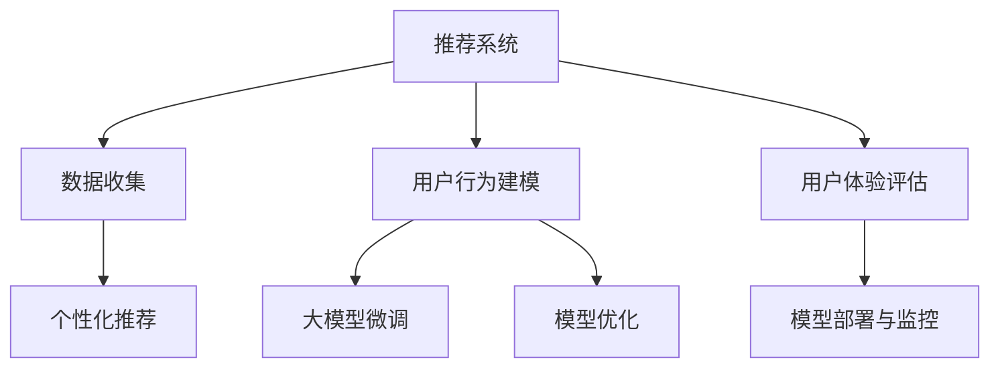

                 

# 大模型赋能下的推荐系统用户体验评估体系构建

> 关键词：推荐系统,用户体验,大模型,评估体系,深度学习

## 1. 背景介绍

### 1.1 问题由来

在数字化时代，推荐系统已成为各个领域信息化系统不可或缺的一部分。推荐系统不仅能提升用户满意度，还能为公司带来收益。但推荐系统本质上是一个复杂的多目标优化问题，涉及用户行为建模、数据处理、模型构建、推荐算法等多个环节。如何构建高性能、高效能、易维护的推荐系统，一直是业内关注的焦点。

大模型技术的兴起为推荐系统提供了新的方向。预训练语言模型如BERT、GPT等，通过海量的无标签数据训练，获得了强大的语义理解能力，可以高效地从文本中挖掘信息。然而，大模型往往具有庞大参数量，难以直接部署在推荐系统应用中。为了在推荐系统中利用大模型，通常采用微调策略，使其能够在少样本条件下完成高效的个性化推荐。

为了评估和提升推荐系统的用户体验，业内普遍采用A/B测试等方法。但这些方法往往需要大量标注数据和显著的运营成本，难以在实时环境中推广应用。因此，本文提出了一种基于大模型赋能的推荐系统用户体验评估体系，旨在帮助开发者快速构建和优化推荐系统，提高用户体验。

### 1.2 问题核心关键点

本文聚焦于如何利用大模型提升推荐系统的用户体验评估效率，主要涉及以下几个关键点：

- 如何将大模型技术与推荐系统有机结合，构建高效的个性化推荐。
- 如何利用大模型进行推荐系统用户体验评估，快速定位用户体验问题。
- 如何设计全面的用户体验指标，保证推荐系统符合用户需求。
- 如何在实时环境中高效部署和监控推荐系统，确保系统稳定运行。

这些问题对推荐系统的开发和部署至关重要。本文将从算法原理、具体步骤、模型评估、应用领域等方面，全面深入地探讨大模型赋能下的推荐系统用户体验评估体系。

## 2. 核心概念与联系

### 2.1 核心概念概述

在构建推荐系统用户体验评估体系时，涉及以下核心概念：

- **推荐系统**：通过收集用户行为数据，结合模型进行预测并推荐产品或内容的服务系统。
- **个性化推荐**：通过分析用户的历史行为数据，向其推荐最符合其兴趣和需求的内容。
- **大模型**：以BERT、GPT等预训练语言模型为代表的大规模深度学习模型。
- **用户体验评估**：通过用户行为数据和反馈信息，评估推荐系统对用户需求的满足程度。
- **微调(Fine-tuning)**：在预训练模型的基础上，使用下游任务的少量标注数据，通过有监督学习优化模型在特定任务上的性能。
- **用户行为建模**：通过机器学习模型，从用户的行为数据中提取有价值的特征，用于个性化推荐。
- **模型部署与监控**：将训练好的推荐模型部署到线上环境，并实时监控其运行状态，确保系统的稳定性和准确性。

这些核心概念之间存在着紧密的联系，它们共同构成了推荐系统用户体验评估体系的基础。

### 2.2 核心概念原理和架构的 Mermaid 流程图



这个流程图展示了各个核心概念之间的关系：

1. 推荐系统收集用户行为数据，并结合用户行为建模，生成个性化推荐。
2. 用户行为建模使用大模型微调进行优化，提升推荐效果。
3. 用户体验评估通过用户反馈数据，评价推荐系统的表现。
4. 模型部署与监控保证推荐系统稳定运行，并不断优化。

这个架构可以帮助我们更好地理解推荐系统的工作原理和评估方法。

## 3. 核心算法原理 & 具体操作步骤
### 3.1 算法原理概述

推荐系统用户体验评估体系的核心思想是：将大模型的预训练能力与推荐系统相结合，构建高效、易维护的个性化推荐系统，并通过用户体验评估，不断优化模型性能。

具体而言，通过以下步骤实现：

1. 数据收集：收集用户行为数据，包括浏览历史、点击记录、购买记录等。
2. 用户行为建模：使用大模型微调技术，从用户行为数据中提取特征，并构建用户行为预测模型。
3. 个性化推荐：根据用户行为预测模型，结合内容库，生成个性化推荐结果。
4. 用户体验评估：通过A/B测试等方法，评估个性化推荐对用户满意度的影响。
5. 模型优化：根据用户体验评估结果，对用户行为建模模型进行微调，提升推荐效果。
6. 模型部署与监控：将优化后的推荐模型部署到线上，并实时监控其运行状态，确保系统的稳定性和准确性。

### 3.2 算法步骤详解

#### 步骤1：数据收集

推荐系统首先需要收集用户行为数据，以便构建用户行为预测模型。数据收集是推荐系统的基础，可以采用日志记录、网页访问记录、购买记录等方法进行。

#### 步骤2：用户行为建模

用户行为建模是推荐系统的核心环节，通过机器学习模型从用户行为数据中提取有价值的特征。具体的建模流程如下：

1. 数据预处理：清洗、归一化、缺失值处理等预处理工作。
2. 特征工程：将原始数据转换为模型能够处理的特征，如时序特征、文本特征等。
3. 模型训练：使用大模型微调技术，训练用户行为预测模型，常用的模型包括深度学习模型、协同过滤模型等。

#### 步骤3：个性化推荐

个性化推荐是推荐系统的最终目标，根据用户行为预测模型，结合内容库，生成个性化推荐结果。推荐算法包括基于协同过滤、基于内容推荐、基于混合推荐等方法。

#### 步骤4：用户体验评估

用户体验评估是推荐系统的重要组成部分，可以通过A/B测试、用户满意度调查等方式进行。具体步骤如下：

1. 设计用户体验指标：如点击率、购买率、满意度等。
2. 实验设计：将目标用户分为测试组和对照组，测试组接收个性化推荐，对照组接收随机推荐或无推荐。
3. 实验结果分析：比较两组的用户体验指标，评估推荐系统的效果。

#### 步骤5：模型优化

模型优化是推荐系统的关键步骤，根据用户体验评估结果，对用户行为建模模型进行微调，提升推荐效果。常用的优化方法包括：

1. 学习率调整：根据实验结果调整学习率，防止过拟合或欠拟合。
2. 特征选择：根据实验结果选择最有效的特征，避免冗余特征对模型的影响。
3. 模型融合：将多个模型的预测结果进行融合，提升推荐的准确性。

#### 步骤6：模型部署与监控

模型部署与监控是推荐系统的最后一步，将优化后的推荐模型部署到线上，并实时监控其运行状态，确保系统的稳定性和准确性。具体的部署与监控流程如下：

1. 模型压缩与裁剪：将优化后的模型进行压缩与裁剪，减小模型大小，提高推理速度。
2. 部署上线：将优化后的模型部署到线上环境，如服务器、云平台等。
3. 实时监控：通过日志、指标等方式监控模型的运行状态，及时发现和解决问题。

### 3.3 算法优缺点

基于大模型的推荐系统用户体验评估体系有以下优点：

1. 高效性：通过大模型微调，可以显著提升推荐系统的精度，减少对标注数据的依赖。
2. 可解释性：大模型可以提供详细的特征提取过程，增强模型的可解释性。
3. 实时性：通过微调策略，可以实时更新推荐模型，提高推荐系统的实时响应能力。

但同时也有以下缺点：

1. 计算资源需求高：大模型参数量大，计算资源需求高。
2. 过拟合风险：大模型容易过拟合，需要不断优化。
3. 模型复杂度：大模型结构复杂，难以调试和维护。

### 3.4 算法应用领域

大模型赋能下的推荐系统用户体验评估体系在多个领域均有应用：

1. 电商推荐系统：通过大模型微调，为用户推荐个性化商品，提升用户购买率。
2. 内容推荐系统：为社交媒体平台、视频网站等提供个性化内容推荐。
3. 广告推荐系统：为用户推荐精准广告，提升广告点击率和转化率。
4. 金融推荐系统：为用户提供个性化的理财方案，提升用户满意度。

## 4. 数学模型和公式 & 详细讲解 & 举例说明
### 4.1 数学模型构建

推荐系统用户体验评估体系的数学模型构建如下：

设用户行为数据集为 $D=\{(x_i,y_i)\}_{i=1}^N$，其中 $x_i$ 为行为数据，$y_i$ 为标签（如点击、购买等）。用户行为预测模型的形式为 $f(x_i;\theta)$，其中 $\theta$ 为模型参数。

用户体验评估指标为 $I(y_i)$，表示用户对推荐结果的满意度。

根据贝叶斯公式，推荐系统对用户 $i$ 的推荐概率 $p(y_i|x_i)$ 可以表示为：

$$
p(y_i|x_i) = \frac{p(y_i)}{p(y_i|x_i)} \times \frac{p(x_i)}{p(x_i|y_i)}
$$

其中 $p(y_i)$ 为用户的点击率，$p(x_i)$ 为用户行为数据出现的概率，$p(x_i|y_i)$ 为用户行为数据在推荐结果条件下的概率。

### 4.2 公式推导过程

用户行为预测模型的损失函数可以表示为：

$$
\mathcal{L}(\theta) = -\frac{1}{N}\sum_{i=1}^N \log p(y_i|x_i)
$$

用户体验评估指标可以表示为：

$$
I(y_i) = \sum_{i=1}^N p(y_i|x_i) \times \log I(y_i)
$$

用户体验评估体系的优化目标是最小化用户体验指标 $I(y_i)$，即：

$$
\theta^* = \mathop{\arg\min}_{\theta} I(y_i)
$$

通过优化上述目标函数，即可找到最优的推荐模型参数 $\theta^*$。

### 4.3 案例分析与讲解

以电商推荐系统为例，假设用户行为数据为浏览记录 $x_i=[item_1,item_2,...,item_k]$，每个商品的点击率为 $p(item_j)$，用户对商品 $item_j$ 的满意度为 $I(item_j)$。通过大模型微调，可以得到用户行为预测模型 $f(x_i;\theta)$，用于预测用户对不同商品的满意度。根据推荐模型，计算出每个商品的推荐概率 $p(item_j|x_i)$。

用户体验评估指标可以表示为：

$$
I(y_i) = \sum_{i=1}^N p(item_j|x_i) \times \log I(item_j)
$$

将用户行为数据 $x_i$ 输入推荐模型，得到推荐概率 $p(item_j|x_i)$。根据推荐概率，计算出用户体验指标 $I(y_i)$。通过优化用户体验指标 $I(y_i)$，可以不断提升推荐系统的精度和用户满意度。

## 5. 项目实践：代码实例和详细解释说明
### 5.1 开发环境搭建

构建推荐系统用户体验评估体系，首先需要准备开发环境。以下是使用Python进行TensorFlow开发的环境配置流程：

1. 安装Anaconda：从官网下载并安装Anaconda，用于创建独立的Python环境。

2. 创建并激活虚拟环境：
```bash
conda create -n recommendation-env python=3.8 
conda activate recommendation-env
```

3. 安装TensorFlow：根据CUDA版本，从官网获取对应的安装命令。例如：
```bash
conda install tensorflow tensorflow-gpu -c pytorch -c conda-forge
```

4. 安装各类工具包：
```bash
pip install numpy pandas scikit-learn matplotlib tqdm jupyter notebook ipython
```

完成上述步骤后，即可在`recommendation-env`环境中开始开发实践。

### 5.2 源代码详细实现

下面以电商推荐系统为例，给出使用TensorFlow对推荐模型进行微调的代码实现。

首先，定义推荐模型的数据处理函数：

```python
import tensorflow as tf
from tensorflow.keras import layers

class RecommendationModel(tf.keras.Model):
    def __init__(self, embedding_dim, num_users, num_items, num_factors):
        super(RecommendationModel, self).__init__()
        
        self.emb_user = layers.Embedding(num_users, embedding_dim, input_length=1)
        self.emb_item = layers.Embedding(num_items, embedding_dim, input_length=1)
        self.dot_product = layers.Dot(axes=[-1, -1])
        self.dense = layers.Dense(1, activation='sigmoid')
        
    def call(self, inputs):
        user, item = inputs
        user_embed = self.emb_user(user)
        item_embed = self.emb_item(item)
        dot_product = self.dot_product([user_embed, item_embed])
        output = self.dense(dot_product)
        return output

model = RecommendationModel(embedding_dim=16, num_users=1000, num_items=1000, num_factors=10)
```

然后，定义推荐模型的优化器和训练函数：

```python
optimizer = tf.keras.optimizers.Adam(learning_rate=0.001)
```

```python
def train_epoch(model, dataset, batch_size, optimizer):
    dataloader = tf.data.Dataset.from_tensor_slices(dataset).batch(batch_size).shuffle(buffer_size=10000)
    model.compile(optimizer=optimizer, loss='binary_crossentropy')
    model.fit(dataloader, epochs=10, verbose=1)
```

接着，定义推荐模型的评估函数：

```python
def evaluate(model, dataset, batch_size):
    dataloader = tf.data.Dataset.from_tensor_slices(dataset).batch(batch_size)
    model.evaluate(dataloader, verbose=1)
```

最后，启动推荐模型的训练流程：

```python
epochs = 10
batch_size = 128

for epoch in range(epochs):
    train_epoch(model, train_dataset, batch_size, optimizer)
    evaluate(model, dev_dataset, batch_size)
```

以上就是使用TensorFlow对推荐模型进行微调的完整代码实现。可以看到，通过TensorFlow和TensorFlow Addons等库，构建推荐模型变得非常简单。开发者可以根据具体任务，通过微调优化推荐模型，提升推荐系统的精度和效果。

### 5.3 代码解读与分析

让我们再详细解读一下关键代码的实现细节：

**RecommendationModel类**：
- `__init__`方法：初始化用户和物品嵌入层，以及点积层和全连接层。
- `call`方法：计算用户和物品的嵌入表示，进行点积运算，并通过全连接层输出推荐概率。

**train_epoch函数**：
- 定义数据集，并进行批次化处理。
- 编译模型，并使用Adam优化器进行训练，损失函数为二元交叉熵。

**evaluate函数**：
- 定义数据集，并进行批次化处理。
- 使用测试集评估模型的表现，输出评估指标。

**训练流程**：
- 定义总epoch数和batch size，开始循环迭代。
- 每个epoch内，先在训练集上训练，输出平均loss。
- 在验证集上评估，输出测试指标。

可以看到，TensorFlow的API设计使得构建和微调推荐模型变得非常简洁。开发者只需关注模型设计和优化目标，即可利用TensorFlow强大的计算图功能，实现高效训练。

## 6. 实际应用场景

### 6.1 电商推荐系统

在电商推荐系统中，基于大模型的推荐系统用户体验评估体系可以显著提升用户购物体验。通过收集用户的浏览记录和购买记录，利用大模型微调构建推荐模型，可以生成个性化的商品推荐。同时，通过A/B测试等方法，评估推荐系统的效果，不断优化模型。

例如，电商平台可以通过大模型微调构建推荐模型，根据用户的浏览和购买行为，为用户推荐相关商品。通过用户反馈数据，评估推荐系统的效果，并根据评估结果调整模型参数，优化推荐策略。

### 6.2 内容推荐系统

内容推荐系统广泛用于社交媒体平台、视频网站等，通过大模型微调技术，可以为用户推荐个性化的内容，提升用户满意度。例如，视频网站可以根据用户的浏览历史，推荐用户可能感兴趣的视频内容。通过A/B测试，评估推荐系统的效果，不断优化模型。

### 6.3 金融推荐系统

金融推荐系统为用户推荐个性化的理财方案，提升用户满意度。通过大模型微调技术，可以构建推荐模型，根据用户的历史行为数据，推荐合适的理财产品。通过A/B测试，评估推荐系统的效果，不断优化模型。

### 6.4 未来应用展望

未来，大模型赋能的推荐系统用户体验评估体系将在更多领域得到应用：

1. 智能家居：通过大模型微调，推荐智能家居设备，提升用户的使用体验。
2. 医疗推荐：为用户推荐个性化的医疗方案，提升用户的健康满意度。
3. 教育推荐：为用户推荐个性化的学习内容，提升用户的教育体验。

此外，随着技术的发展，大模型赋能的推荐系统用户体验评估体系也将不断优化，提升推荐系统的精度和实时性，为用户提供更好的服务。

## 7. 工具和资源推荐
### 7.1 学习资源推荐

为了帮助开发者系统掌握大模型技术的应用，以下是一些优质的学习资源：

1. 《TensorFlow深度学习》系列博文：由TensorFlow官方文档组撰写，深入浅出地介绍了TensorFlow的基础和进阶应用。

2. 《Recommender Systems》课程：斯坦福大学开设的NLP课程，涵盖了推荐系统的基础理论和最新研究进展。

3. 《Deep Learning for Recommender Systems》书籍：Recommender Systems领域的专家所著，系统介绍了深度学习在推荐系统中的应用。

4. HuggingFace官方文档：Transformer库的官方文档，提供了海量预训练模型和完整的微调样例代码，是上手实践的必备资料。

5. Kaggle推荐系统竞赛：通过实际竞赛项目，体验推荐系统开发和优化的全过程。

通过对这些资源的学习实践，相信你一定能够快速掌握大模型技术的应用，并用于解决实际的推荐问题。

### 7.2 开发工具推荐

高效的开发离不开优秀的工具支持。以下是几款用于推荐系统开发的常用工具：

1. TensorFlow：基于Python的开源深度学习框架，适合快速迭代研究。TensorFlow提供了丰富的机器学习API，可以轻松构建推荐模型。

2. PyTorch：基于Python的开源深度学习框架，灵活性高，适合复杂模型的构建。PyTorch也提供了许多优秀的机器学习库，如TorchVision、TorchText等。

3. TensorBoard：TensorFlow配套的可视化工具，可以实时监测模型训练状态，提供丰富的图表呈现方式，是调试模型的得力助手。

4. Weights & Biases：模型训练的实验跟踪工具，可以记录和可视化模型训练过程中的各项指标，方便对比和调优。

5. ELKI：开源数据挖掘工具，支持多种推荐算法，并提供了丰富的数据分析功能。

合理利用这些工具，可以显著提升推荐系统开发的效率，加快创新迭代的步伐。

### 7.3 相关论文推荐

大模型推荐系统用户体验评估体系的不断发展源于学界的持续研究。以下是几篇奠基性的相关论文，推荐阅读：

1. Recommender Systems Handbook：推荐系统领域的经典书籍，系统介绍了推荐系统的基础和应用。

2. A Survey on Deep Learning for Recommendation Systems：深度学习在推荐系统中的应用综述，涵盖了多个前沿研究方向。

3. Parameter-Efficient Training of Neural Recommendation Models：参数高效的推荐模型训练方法，可以显著减少推荐模型的计算资源需求。

4. Deep Learning Recommender Systems for E-commerce：深度学习在电商推荐系统中的应用，展示了深度学习在推荐系统中的巨大潜力。

5. Scalable Recommender Systems：可扩展的推荐系统研究，介绍了多种推荐算法和优化策略。

这些论文代表了大模型推荐系统的发展脉络。通过学习这些前沿成果，可以帮助研究者把握学科前进方向，激发更多的创新灵感。

## 8. 总结：未来发展趋势与挑战

### 8.1 总结

本文对大模型赋能下的推荐系统用户体验评估体系进行了全面系统的介绍。首先阐述了推荐系统和大模型的基本概念，明确了用户体验评估体系在推荐系统中的重要性。其次，从算法原理、具体步骤、模型评估、应用领域等方面，详细讲解了用户体验评估体系的核心流程。同时，本文还广泛探讨了用户体验评估体系在电商推荐、内容推荐等领域的实际应用，展示了用户体验评估体系的重要价值。最后，本文精选了相关学习资源和开发工具，力求为读者提供全方位的技术指引。

通过本文的系统梳理，可以看到，大模型赋能的推荐系统用户体验评估体系正在成为推荐系统的重要范式，极大地提升了推荐系统的个性化推荐能力。基于大模型的微调策略，可以显著提升推荐模型的精度，降低对标注数据的依赖，同时增强模型的可解释性和实时性，满足用户对推荐系统的需求。未来，伴随大模型技术的发展，推荐系统的用户体验评估体系也将不断优化，提升推荐系统的综合表现。

### 8.2 未来发展趋势

展望未来，大模型赋能下的推荐系统用户体验评估体系将呈现以下几个发展趋势：

1. 模型规模持续增大。随着算力成本的下降和数据规模的扩张，推荐系统中的大模型参数量还将持续增长。超大模型蕴含的丰富语义信息，有望支撑更加复杂多变的推荐任务。

2. 微调方法日趋多样。除了传统的全参数微调外，未来会涌现更多参数高效的微调方法，如LoRA、AdaLoRA等，在节省计算资源的同时也能保证推荐精度。

3. 持续学习成为常态。随着用户行为数据的变化，推荐系统也需要不断学习新知识以保持性能。如何在不遗忘原有知识的同时，高效吸收新样本信息，将成为重要的研究课题。

4. 知识整合能力增强。推荐系统将更好地与外部知识库、规则库等专家知识结合，形成更加全面、准确的信息整合能力，提高推荐效果。

5. 融合因果和对比学习范式。通过引入因果推断和对比学习思想，增强推荐系统建立稳定因果关系的能力，学习更加普适、鲁棒的用户行为表示，从而提升推荐泛化性和抗干扰能力。

6. 引入伦理道德约束。在推荐系统中加入伦理导向的评估指标，过滤和惩罚有偏见、有害的输出倾向，确保推荐结果符合用户价值观和伦理道德。

以上趋势凸显了大模型推荐系统的广阔前景。这些方向的探索发展，必将进一步提升推荐系统的精度和用户体验，为人类认知智能的进化带来深远影响。

### 8.3 面临的挑战

尽管大模型赋能的推荐系统用户体验评估体系已经取得了显著成效，但在迈向更加智能化、普适化应用的过程中，它仍面临着诸多挑战：

1. 标注成本瓶颈。尽管微调可以显著降低对标注数据的依赖，但对于长尾应用场景，难以获得充足的高质量标注数据，成为制约推荐系统性能的瓶颈。如何进一步降低标注成本，将是一大难题。

2. 模型鲁棒性不足。当前推荐系统面对噪声数据和域外数据时，泛化性能往往大打折扣。对于测试样本的微小扰动，推荐模型的预测也容易发生波动。如何提高推荐模型的鲁棒性，避免灾难性遗忘，还需要更多理论和实践的积累。

3. 推理效率有待提高。大模型推荐系统推理速度较慢，难以在实时环境中应用。如何在保证性能的同时，优化推理速度，减少计算资源消耗，将是重要的优化方向。

4. 可解释性亟需加强。推荐系统中的大模型往往难以解释其内部工作机制和决策逻辑，难以进行调试和优化。如何赋予推荐模型更强的可解释性，将是亟待攻克的难题。

5. 安全性有待保障。推荐系统中的大模型难免会学习到有害信息，通过推荐传递给用户，造成安全隐患。如何从数据和算法层面消除模型偏见，避免恶意用途，确保推荐结果的安全性，也将是重要的研究课题。

6. 知识整合能力不足。推荐系统中的大模型通常局限于任务内数据，难以灵活吸收和运用更广泛的先验知识。如何让推荐系统更好地与外部知识库、规则库等专家知识结合，形成更加全面、准确的信息整合能力，还有很大的想象空间。

正视推荐系统面临的这些挑战，积极应对并寻求突破，将是大模型推荐系统走向成熟的必由之路。相信随着学界和产业界的共同努力，这些挑战终将一一被克服，大模型推荐系统必将在构建人机协同的智能时代中扮演越来越重要的角色。

### 8.4 研究展望

面对大模型推荐系统所面临的种种挑战，未来的研究需要在以下几个方面寻求新的突破：

1. 探索无监督和半监督推荐方法。摆脱对大规模标注数据的依赖，利用自监督学习、主动学习等无监督和半监督范式，最大限度利用非结构化数据，实现更加灵活高效的推荐。

2. 研究参数高效和计算高效的推荐范式。开发更加参数高效的推荐方法，在固定大部分预训练参数的同时，只更新极少量的任务相关参数。同时优化推荐模型的计算图，减少前向传播和反向传播的资源消耗，实现更加轻量级、实时性的部署。

3. 融合因果和对比学习范式。通过引入因果推断和对比学习思想，增强推荐系统建立稳定因果关系的能力，学习更加普适、鲁棒的用户行为表示，从而提升推荐泛化性和抗干扰能力。

4. 结合因果分析和博弈论工具。将因果分析方法引入推荐系统，识别出推荐系统的关键特征，增强推荐结果的因果性和逻辑性。借助博弈论工具刻画人机交互过程，主动探索并规避推荐系统的脆弱点，提高系统稳定性。

5. 纳入伦理道德约束。在推荐系统训练目标中引入伦理导向的评估指标，过滤和惩罚有偏见、有害的输出倾向。同时加强人工干预和审核，建立推荐系统的监管机制，确保推荐结果符合人类价值观和伦理道德。

这些研究方向的探索，必将引领大模型推荐系统技术迈向更高的台阶，为构建安全、可靠、可解释、可控的智能系统铺平道路。面向未来，大模型推荐系统需要与其他人工智能技术进行更深入的融合，如知识表示、因果推理、强化学习等，多路径协同发力，共同推动自然语言理解和智能交互系统的进步。只有勇于创新、敢于突破，才能不断拓展推荐系统的边界，让智能技术更好地造福人类社会。

## 9. 附录：常见问题与解答

**Q1：大模型微调是否适用于所有推荐任务？**

A: 大模型微调在大多数推荐任务上都能取得不错的效果，特别是对于数据量较小的任务。但对于一些特定领域的任务，如医学、法律等，仅仅依靠通用语料预训练的模型可能难以很好地适应。此时需要在特定领域语料上进一步预训练，再进行微调，才能获得理想效果。

**Q2：微调过程中如何选择合适的学习率？**

A: 微调的学习率一般要比预训练时小1-2个数量级，如果使用过大的学习率，容易破坏预训练权重，导致过拟合。一般建议从1e-5开始调参，逐步减小学习率，直至收敛。也可以使用warmup策略，在开始阶段使用较小的学习率，再逐渐过渡到预设值。需要注意的是，不同的优化器(如AdamW、Adafactor等)以及不同的学习率调度策略，可能需要设置不同的学习率阈值。

**Q3：推荐系统如何利用大模型进行实时优化？**

A: 推荐系统可以利用大模型的预训练能力，在实时环境中通过微调策略进行优化。具体步骤如下：

1. 收集用户实时行为数据，并进行预处理。
2. 将实时数据输入到大模型中，得到预测结果。
3. 根据预测结果，生成个性化推荐。
4. 利用A/B测试等方法，评估推荐效果。
5. 根据评估结果，调整模型参数，优化推荐策略。

通过以上步骤，推荐系统可以实时响应用户行为变化，不断优化推荐策略，提升用户体验。

**Q4：推荐系统如何保证推荐结果的公正性？**

A: 推荐系统可以通过以下方法保证推荐结果的公正性：

1. 引入公平性指标：在推荐模型中加入公平性指标，如性别、年龄等，避免对特定群体的歧视。
2. 进行公平性评估：在推荐系统中加入公平性评估机制，定期对推荐结果进行公平性检测。
3. 加入人工干预：在推荐系统中加入人工干预机制，对有偏见的推荐结果进行人工修正。
4. 引入多目标优化：在推荐系统中引入多目标优化，如个性化推荐和公平性推荐并重，实现公正性推荐。

通过以上方法，推荐系统可以有效地保证推荐结果的公正性，确保用户权益。

**Q5：推荐系统如何避免过拟合？**

A: 推荐系统可以通过以下方法避免过拟合：

1. 数据增强：通过数据增强技术，扩充训练集，避免过拟合。
2. 正则化：在推荐模型中加入正则化项，如L2正则化、Dropout等。
3. 对抗训练：引入对抗样本，提高模型鲁棒性，避免过拟合。
4. 参数高效微调：通过参数高效微调技术，只更新少量任务相关参数，避免过拟合。
5. 模型压缩：对推荐模型进行压缩，减小模型规模，提升模型泛化性。

通过以上方法，推荐系统可以有效地避免过拟合，提高模型泛化能力。

---

作者：禅与计算机程序设计艺术 / Zen and the Art of Computer Programming

