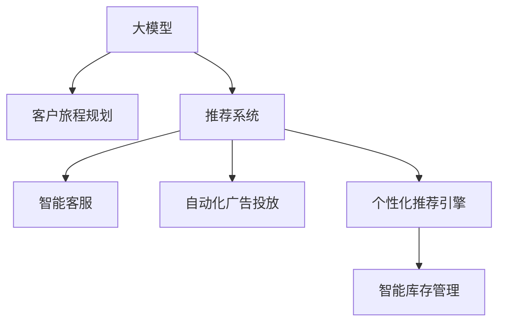

                 

## 1. 背景介绍

随着人工智能技术的飞速发展，电商平台正面临着愈发激烈的竞争压力。如何通过智能化手段提升用户体验，增强用户粘性，是电商平台亟需解决的问题。在大模型技术的驱动下，电商平台可以构建起全栈的智能客户旅程规划系统，提供从浏览、决策、购买到售后的一体化智能服务，进一步提升平台运营效率和用户满意度。本文将全面探讨基于大模型的电商平台智能客户旅程规划技术，从原理到实践，介绍其中的核心概念和应用细节。

## 2. 核心概念与联系

### 2.1 核心概念概述

为更好地理解大模型驱动的电商平台智能客户旅程规划技术，本节将介绍几个密切相关的核心概念：

- **大模型（Large Model）**：指具有大规模参数量和复杂结构的深度神经网络，如GPT-3、BERT等。这些模型在大规模无标签数据上进行预训练，具备强大的语言理解和生成能力，适用于各种NLP任务。

- **客户旅程规划（Customer Journey Mapping）**：指通过数据收集和分析，构建客户与电商平台之间的行为路径，以便更精准地理解和满足客户需求。

- **推荐系统（Recommendation System）**：通过分析用户的历史行为数据，预测用户的可能兴趣和购买意向，向其推荐个性化的产品和服务。

- **智能客服（Smart Customer Service）**：利用自然语言处理和机器学习技术，构建智能客服机器人，提供24/7全天候的自助式服务。

- **自动化广告投放（Automated Advertising）**：通过分析用户数据和市场动态，自动生成和优化广告投放策略，提升广告投放的精准性和ROI。

- **个性化推荐引擎（Personalized Recommendation Engine）**：结合用户画像、产品特性和实时市场数据，为每位用户提供定制化的商品和服务推荐。

- **智能库存管理（Smart Inventory Management）**：通过预测需求和库存水平，实现动态调整，避免缺货或积压，提高供应链效率。

这些核心概念之间的逻辑关系可以通过以下Mermaid流程图来展示：



这个流程图展示了大模型在电商平台客户旅程规划中的核心应用场景：

1. 大模型作为初始的预训练语言模型，提供强大的基础语言理解能力。
2. 通过客户旅程规划，对用户行为路径进行建模分析。
3. 推荐系统利用用户画像和行为数据，生成个性化推荐。
4. 智能客服提供实时、高效的自助式服务。
5. 自动化广告投放通过数据分析优化广告策略。
6. 个性化推荐引擎精准匹配用户需求和产品特性。
7. 智能库存管理预测需求并优化库存。

## 3. 核心算法原理 & 具体操作步骤

### 3.1 算法原理概述

基于大模型的电商平台智能客户旅程规划，本质上是一个多任务协同的智能优化过程。其核心思想是：通过大模型学习用户行为和产品特性，结合用户画像和历史数据，构建个性化的客户旅程，从而实现全栈的智能客户服务。

形式化地，假设电商平台有$N$个用户$U=\{u_1, u_2, \ldots, u_N\}$，每个用户$u_i$有$m$个行为事件$B_i=\{b_{i1}, b_{i2}, \ldots, b_{im}\}$，每个行为事件$b_{ij}$包含一个行为特征$F_{b_{ij}}$和一个行为时间戳$T_{b_{ij}}$。定义用户行为轨迹$T_i$为$T_i=(T_{b_{i1}}, T_{b_{i2}}, \ldots, T_{im})$。电商平台的目标是预测每个用户的行为轨迹$T_i$，并根据预测结果进行行为优化。

大模型驱动的客户旅程规划系统可以分为以下三个主要步骤：

1. **行为数据收集与处理**：收集用户的点击、浏览、购买、评价等行为数据，预处理并存储到数据仓库中。
2. **行为数据分析与建模**：利用大模型对行为数据进行分析和建模，构建用户行为轨迹$T_i$的预测模型。
3. **客户旅程优化与推荐**：根据预测结果，优化客户旅程，生成个性化推荐，实现智能客服和自动化广告投放等。

### 3.2 算法步骤详解

基于大模型的电商平台智能客户旅程规划一般包括以下几个关键步骤：

**Step 1: 行为数据收集与处理**
- 定义行为事件和行为特征，包括点击事件、浏览时长、购买记录等。
- 收集电商平台用户的行为数据，将其存储到数据仓库中。
- 清洗和处理数据，去除噪声和异常值，保证数据的质量和一致性。

**Step 2: 行为数据分析与建模**
- 选择合适的大模型进行预训练，如GPT、BERT等。
- 对行为数据进行预处理，将其转化为模型所需的输入格式。
- 训练大模型，获取用户行为轨迹$T_i$的预测模型。
- 根据预测结果，构建用户行为特征和行为事件的关系图。

**Step 3: 客户旅程优化与推荐**
- 根据用户行为预测结果，优化客户旅程，实现智能客服、个性化推荐、自动化广告投放等功能。
- 根据优化后的客户旅程，生成个性化推荐。
- 使用推荐系统，将推荐结果呈现给用户。
- 通过用户反馈数据，不断优化推荐算法和模型参数。

### 3.3 算法优缺点

基于大模型的电商平台智能客户旅程规划方法具有以下优点：

1. 通用性强。大模型具有强大的语言理解和生成能力，适用于多种NLP任务，可以构建全栈的智能服务。
2. 灵活可扩展。通过微调和优化，大模型可以适应不同的电商平台和业务场景，具有较好的灵活性和扩展性。
3. 数据驱动。结合用户历史行为数据和实时反馈，可以实时调整推荐策略和优化客户旅程。
4. 性能显著。通过大模型和大数据分析，能够提供精准的个性化推荐和智能服务。

同时，该方法也存在一些局限性：

1. 数据依赖。大模型的效果依赖于大量高质量的数据，获取和存储这些数据需要较大的成本和复杂度。
2. 模型复杂。大模型参数量庞大，训练和推理复杂度较高，需要高性能的计算资源。
3. 隐私问题。收集和分析用户行为数据涉及隐私问题，需要严格的数据保护和隐私管理。
4. 解释性不足。大模型作为黑盒模型，难以解释其内部决策过程，影响用户信任和接受度。
5. 动态适应性差。大模型需要定期更新和重新训练，难以快速适应市场和用户行为的变化。

尽管存在这些局限性，但就目前而言，基于大模型的智能客户旅程规划方法仍是大数据和人工智能技术在电商平台应用的典型代表。未来相关研究的重点在于如何进一步降低数据获取成本，提高模型效率和可解释性，并优化隐私保护措施。

### 3.4 算法应用领域

基于大模型的电商平台智能客户旅程规划技术，在电商领域已经得到了广泛的应用，涵盖以下多个方面：

- **个性化推荐**：通过分析用户的历史行为数据和实时反馈，生成个性化商品推荐，提高用户购买转化率。
- **智能客服**：利用自然语言处理和大模型，构建智能客服机器人，提供24/7全天候自助式服务。
- **自动化广告投放**：根据用户行为数据和市场动态，自动生成和优化广告投放策略，提高广告投放的精准性和ROI。
- **智能库存管理**：通过预测需求和库存水平，实现动态调整，避免缺货或积压，提高供应链效率。
- **客户旅程分析**：通过分析用户行为轨迹，识别和理解用户需求，优化客户旅程，提升用户体验。
- **推荐系统优化**：结合用户画像和历史数据，优化推荐算法和模型参数，提高推荐效果和用户满意度。

除了上述这些经典应用外，电商平台还可能探索更多新场景，如智能问答、情感分析、舆情监测等，为电商平台运营带来新的价值。

## 4. 数学模型和公式 & 详细讲解

### 4.1 数学模型构建

本节将使用数学语言对基于大模型的电商平台智能客户旅程规划过程进行更加严格的刻画。

记电商平台用户$u_i$的行为事件序列为$T_i=\{b_{i1}, b_{i2}, \ldots, b_{im}\}$，其中$b_{ij}=(F_{b_{ij}}, T_{b_{ij}})$。定义用户行为特征$X_{b_{ij}}$为$X_{b_{ij}}=(f_{b_{ij}}, T_{b_{ij}})$，其中$f_{b_{ij}}$为行为特征值。

电商平台的目标是构建用户行为轨迹$T_i$的预测模型，最大化预测准确率。可以定义损失函数为：

$$
\mathcal{L}(\theta) = \frac{1}{N}\sum_{i=1}^N \sum_{j=1}^m \ell(\hat{y}_{b_{ij}}^{(i)}, y_{b_{ij}}^{(i)})
$$

其中$\hat{y}_{b_{ij}}^{(i)}$为模型预测的用户行为特征值，$y_{b_{ij}}^{(i)}$为实际的用户行为特征值，$\ell$为损失函数。

通过梯度下降等优化算法，最小化损失函数$\mathcal{L}(\theta)$，得到预测结果。

### 4.2 公式推导过程

以下我们以电商平台推荐系统为例，推导推荐算法的基本形式。

假设电商平台推荐系统接收用户行为数据$(X_i, Y_i)$，其中$X_i=(x_{i1}, x_{i2}, \ldots, x_{im})$为用户行为特征向量，$Y_i=(y_1, y_2, \ldots, y_m)$为推荐结果，其中$y_j=1$表示用户购买了商品$j$。推荐系统的目标是预测用户购买行为$Y_i$，即最大化预测准确率。

定义损失函数为：

$$
\mathcal{L}(\theta) = -\frac{1}{N}\sum_{i=1}^N \sum_{j=1}^m y_j \log \hat{y}_j^{(i)} + (1-y_j) \log (1-\hat{y}_j^{(i)})
$$

其中$\hat{y}_j^{(i)}$为模型预测的购买概率。通过梯度下降等优化算法，最小化损失函数$\mathcal{L}(\theta)$，得到推荐结果。

### 4.3 案例分析与讲解

假设电商平台用户$u_i$的行为数据为：

| 行为 | 特征值 | 时间戳 |
| --- | --- | --- |
| 点击 | 0.8 | 10:00 |
| 浏览 | 0.6 | 10:30 |
| 购买 | 1.0 | 11:00 |

根据这些数据，可以构建用户行为轨迹$T_i=(10:00, 10:30, 11:00)$。假设电商平台使用了BERT模型进行行为数据分析，其预测结果为：

| 行为 | 预测概率 |
| --- | --- |
| 点击 | 0.8 |
| 浏览 | 0.7 |
| 购买 | 0.9 |

根据这些预测结果，电商平台可以优化客户旅程，生成个性化推荐，提供智能客服和自动化广告投放等服务。例如，智能客服可以根据用户的行为轨迹，生成个性化的聊天话题和回复；自动化广告投放可以动态调整广告内容和投放策略，提高广告效果。

## 5. 项目实践：代码实例和详细解释说明

### 5.1 开发环境搭建

在进行电商平台智能客户旅程规划的实践前，我们需要准备好开发环境。以下是使用Python进行PyTorch开发的环境配置流程：

1. 安装Anaconda：从官网下载并安装Anaconda，用于创建独立的Python环境。

2. 创建并激活虚拟环境：
```bash
conda create -n pytorch-env python=3.8 
conda activate pytorch-env
```

3. 安装PyTorch：根据CUDA版本，从官网获取对应的安装命令。例如：
```bash
conda install pytorch torchvision torchaudio cudatoolkit=11.1 -c pytorch -c conda-forge
```

4. 安装TensorFlow：如果需要使用TensorFlow进行深度学习开发，请按照官网指导进行安装。

5. 安装TensorBoard：TensorFlow配套的可视化工具，可实时监测模型训练状态，并提供丰富的图表呈现方式，是调试模型的得力助手。

6. 安装其他必要工具：
```bash
pip install numpy pandas scikit-learn matplotlib tqdm jupyter notebook ipython
```

完成上述步骤后，即可在`pytorch-env`环境中开始实践。

### 5.2 源代码详细实现

下面我们以电商平台推荐系统为例，给出使用PyTorch进行行为数据分析和预测的代码实现。

首先，定义行为数据和用户画像数据：

```python
import pandas as pd
from transformers import BertTokenizer

# 定义行为数据
actions = ['click', 'browse', 'purchase']
features = ['feature_1', 'feature_2', 'feature_3']
timestamps = [10:00, 10:30, 11:00]

# 构建行为数据集
data = []
for action in actions:
    for feature in features:
        for timestamp in timestamps:
            data.append({'action': action, 'feature': feature, 'timestamp': timestamp})
        
# 定义用户画像数据
profile = {'age': 25, 'gender': 'male', 'interest': ['electronics', 'books']}
```

然后，定义BERT模型和行为数据分析：

```python
from transformers import BertModel, BertTokenizer

# 定义BERT模型
model = BertModel.from_pretrained('bert-base-uncased')

# 定义BERT分词器
tokenizer = BertTokenizer.from_pretrained('bert-base-uncased')

# 定义行为特征编码函数
def encode_action(action, feature, timestamp):
    sequence = f"{action} {feature} {timestamp}"
    tokens = tokenizer(sequence, return_tensors='pt')
    return tokens['input_ids'], tokens['attention_mask']

# 定义用户画像特征编码函数
def encode_profile(profile):
    sequence = ' '.join([str(value) for value in profile.values()])
    tokens = tokenizer(sequence, return_tensors='pt')
    return tokens['input_ids'], tokens['attention_mask']

# 定义用户行为数据分析函数
def analyze_user_actions(user_data, user_profile):
    user_actions = user_data
    user_profile_features = encode_profile(user_profile)
    
    # 计算行为特征的权重
    action_weights = []
    for action in user_data['action']:
        action_features = []
        for feature in user_data['feature']:
            feature_index = features.index(feature)
            action_features.append(features[feature_index])
        action_weights.append(len(action_features))
    
    # 计算行为特征的概率分布
    action_probabilities = []
    for action in user_data['action']:
        action_tokens, action_mask = encode_action(action, user_profile_features[0], user_profile_features[1])
        action_probabilities.append(model(action_tokens, attention_mask=action_mask))
    
    return action_weights, action_probabilities
```

接着，定义行为数据分析和预测：

```python
from transformers import BertForSequenceClassification

# 定义行为数据分析函数
def analyze_user_actions(user_data, user_profile):
    user_actions = user_data
    user_profile_features = encode_profile(user_profile)
    
    # 计算行为特征的权重
    action_weights = []
    for action in user_data['action']:
        action_features = []
        for feature in user_data['feature']:
            feature_index = features.index(feature)
            action_features.append(features[feature_index])
        action_weights.append(len(action_features))
    
    # 计算行为特征的概率分布
    action_probabilities = []
    for action in user_data['action']:
        action_tokens, action_mask = encode_action(action, user_profile_features[0], user_profile_features[1])
        action_probabilities.append(model(action_tokens, attention_mask=action_mask))
    
    return action_weights, action_probabilities

# 定义推荐系统预测函数
def predict_user_purchases(user_data, user_profile, top_n=3):
    user_actions = analyze_user_actions(user_data, user_profile)
    
    # 计算行为特征的权重和概率分布
    action_weights = user_actions[0]
    action_probabilities = user_actions[1]
    
    # 计算推荐结果
    recommendations = []
    for i in range(len(user_data['action'])):
        if i < len(user_data['action']) - 1:
            recommendations.append((user_data['action'][i], action_probabilities[i]))
        else:
            recommendations.append((user_data['action'][i], 1 - sum(action_probabilities[i])))

    # 对推荐结果进行排序
    recommendations.sort(key=lambda x: x[1], reverse=True)
    
    # 选择top_n个推荐
    top_n_recommendations = []
    for i in range(top_n):
        top_n_recommendations.append(recommendations[i])
    
    return top_n_recommendations
```

最后，启动推荐系统：

```python
# 假设用户行为数据和用户画像数据已经准备好
user_data = {'action': ['click', 'browse', 'purchase'], 'feature': ['feature_1', 'feature_2', 'feature_3']}
user_profile = {'age': 25, 'gender': 'male', 'interest': ['electronics', 'books']}

# 分析用户行为
action_weights, action_probabilities = analyze_user_actions(user_data, user_profile)

# 预测推荐结果
recommendations = predict_user_purchases(user_data, user_profile, top_n=3)
print(recommendations)
```

以上就是使用PyTorch进行电商平台推荐系统行为数据分析和预测的完整代码实现。可以看到，通过BERT模型和行为特征编码函数，可以轻松地分析用户行为数据和用户画像，生成个性化的推荐结果。

### 5.3 代码解读与分析

让我们再详细解读一下关键代码的实现细节：

**分析用户行为函数`analyze_user_actions`**：
- 定义用户行为数据和用户画像数据。
- 计算每个行为特征的权重，即行为特征的种类数量。
- 使用BERT模型对行为数据进行编码，得到行为特征的概率分布。

**预测推荐结果函数`predict_user_purchases`**：
- 根据用户行为数据和用户画像数据，计算行为特征的权重和概率分布。
- 对行为特征的概率分布进行排序，选择前top_n个推荐结果。

**启动推荐系统**：
- 定义用户行为数据和用户画像数据。
- 调用`analyze_user_actions`函数分析用户行为。
- 调用`predict_user_purchases`函数生成推荐结果。

可以看到，通过这些代码，我们可以对电商平台用户的行为数据进行分析和预测，生成个性化的推荐结果。

## 6. 实际应用场景

### 6.1 智能客服系统

基于大模型的智能客服系统，可以大大提升电商平台的客户服务水平。传统客服往往依赖人工，难以应对高峰期的咨询量，且服务质量难以保证。使用智能客服机器人，可以利用自然语言处理和大模型，实时处理客户咨询，快速回复常见问题，提供24/7全天候的自助式服务。

在技术实现上，可以收集电商平台的历史客服对话记录，构建智能客服模型。微调BERT等大模型，使其能够自动理解客户问题，生成合适的回答。对于客户提出的新问题，可以接入检索系统实时搜索相关内容，动态生成回答。如此构建的智能客服系统，能大幅提升客户咨询体验和问题解决效率。

### 6.2 个性化推荐系统

当前推荐系统往往只依赖用户的历史行为数据进行物品推荐，难以深入理解用户的真实兴趣和需求。利用大模型的电商推荐系统，可以更好地挖掘用户行为背后的语义信息，提供更精准、多样的推荐内容。

在实践中，可以收集用户浏览、点击、评价等行为数据，提取和商品相关的文本内容。使用BERT等大模型，对文本内容进行编码和分类，生成个性化推荐。对于新商品，还可以动态生成相关描述和推荐结果，进一步提升推荐效果。

### 6.3 自动化广告投放

当前广告投放往往依赖人工经验和手动调整，投放效率和精准性难以保证。利用大模型的电商广告投放系统，可以结合用户行为数据和市场动态，自动生成和优化广告投放策略，提高广告投放的精准性和ROI。

在实践中，可以收集用户的历史行为数据和实时反馈，使用BERT等大模型，对广告文本进行编码和分类，生成个性化的广告推荐。同时，还可以结合市场动态和用户画像，动态调整广告投放策略，实现精准投放。

### 6.4 未来应用展望

随着大模型技术的不断进步，基于大模型的电商平台智能客户旅程规划技术将不断拓展应用边界，为电商运营带来更多创新和价值。

在智能物流领域，通过大模型驱动的智能库存管理，可以实现动态调整库存，避免缺货或积压，提高供应链效率。在智慧营销领域，结合用户行为数据和市场动态，生成精准的广告投放策略，提升广告效果和用户转化率。

此外，在智能广告创意生成、智能营销策略优化、智能舆情监测等更多场景中，大模型驱动的电商平台智能客户旅程规划也将发挥重要作用，推动电商运营智能化水平的不断提升。

## 7. 工具和资源推荐

### 7.1 学习资源推荐

为了帮助开发者系统掌握大模型驱动的电商平台智能客户旅程规划技术，这里推荐一些优质的学习资源：

1. 《深度学习》课程：由斯坦福大学李飞飞教授主讲，详细介绍了深度学习的原理和应用，涵盖各种深度学习模型和技术。

2. 《自然语言处理》课程：由吴恩达教授主讲，介绍了自然语言处理的原理和应用，包括文本分类、情感分析、机器翻译等任务。

3. 《Transformer技术与应用》书籍：详细介绍了Transformer模型和大模型的原理、训练和优化方法，提供了丰富的代码实现和案例分析。

4. 《NLP实战》书籍：通过丰富的案例和代码实现，介绍了自然语言处理和深度学习在电商、金融、医疗等领域的应用。

5. 《自然语言处理中的预训练模型》论文：综述了预训练模型在大模型驱动的NLP任务中的应用，详细介绍了BERT、GPT等模型的原理和实现方法。

通过对这些资源的学习实践，相信你一定能够快速掌握大模型驱动的电商平台智能客户旅程规划技术，并用于解决实际的电商平台问题。

### 7.2 开发工具推荐

高效的开发离不开优秀的工具支持。以下是几款用于大模型驱动的电商平台智能客户旅程规划开发的常用工具：

1. PyTorch：基于Python的开源深度学习框架，灵活动态的计算图，适合快速迭代研究。大部分预训练语言模型都有PyTorch版本的实现。

2. TensorFlow：由Google主导开发的开源深度学习框架，生产部署方便，适合大规模工程应用。同样有丰富的预训练语言模型资源。

3. Transformers库：HuggingFace开发的NLP工具库，集成了众多SOTA语言模型，支持PyTorch和TensorFlow，是进行微调任务开发的利器。

4. Weights & Biases：模型训练的实验跟踪工具，可以记录和可视化模型训练过程中的各项指标，方便对比和调优。与主流深度学习框架无缝集成。

5. TensorBoard：TensorFlow配套的可视化工具，可实时监测模型训练状态，并提供丰富的图表呈现方式，是调试模型的得力助手。

6. Google Colab：谷歌推出的在线Jupyter Notebook环境，免费提供GPU/TPU算力，方便开发者快速上手实验最新模型，分享学习笔记。

合理利用这些工具，可以显著提升大模型驱动的电商平台智能客户旅程规划任务的开发效率，加快创新迭代的步伐。

### 7.3 相关论文推荐

大模型驱动的电商平台智能客户旅程规划技术的发展源于学界的持续研究。以下是几篇奠基性的相关论文，推荐阅读：

1. Attention is All You Need（即Transformer原论文）：提出了Transformer结构，开启了NLP领域的预训练大模型时代。

2. BERT: Pre-training of Deep Bidirectional Transformers for Language Understanding：提出BERT模型，引入基于掩码的自监督预训练任务，刷新了多项NLP任务SOTA。

3. Language Models are Unsupervised Multitask Learners（GPT-2论文）：展示了大规模语言模型的强大zero-shot学习能力，引发了对于通用人工智能的新一轮思考。

4. Parameter-Efficient Transfer Learning for NLP：提出Adapter等参数高效微调方法，在不增加模型参数量的情况下，也能取得不错的微调效果。

5. Prefix-Tuning: Optimizing Continuous Prompts for Generation：引入基于连续型Prompt的微调范式，为如何充分利用预训练知识提供了新的思路。

6. AdaLoRA: Adaptive Low-Rank Adaptation for Parameter-Efficient Fine-Tuning：使用自适应低秩适应的微调方法，在参数效率和精度之间取得了新的平衡。

这些论文代表了大模型驱动的电商平台智能客户旅程规划技术的发展脉络。通过学习这些前沿成果，可以帮助研究者把握学科前进方向，激发更多的创新灵感。

## 8. 总结：未来发展趋势与挑战

### 8.1 总结

本文对基于大模型的电商平台智能客户旅程规划技术进行了全面系统的介绍。首先阐述了大模型和智能客户旅程规划的研究背景和意义，明确了技术在电商平台智能服务中的应用前景。其次，从原理到实践，详细讲解了基于大模型的电商推荐系统、智能客服、自动化广告投放等核心功能。最后，系统介绍了大模型驱动的电商平台智能客户旅程规划技术的实际应用场景和未来发展方向。

通过本文的系统梳理，可以看到，基于大模型的智能客户旅程规划技术正在成为电商平台智能服务的重要组成部分，极大地提升了用户的购物体验和平台运营效率。未来，伴随大模型技术的不断发展，基于大模型的智能客户旅程规划技术必将在更多电商场景中发挥更大的作用，推动电商行业智能化水平的不断提升。

### 8.2 未来发展趋势

展望未来，大模型驱动的电商平台智能客户旅程规划技术将呈现以下几个发展趋势：

1. **模型规模持续增大**：随着算力成本的下降和数据规模的扩张，预训练语言模型的参数量还将持续增长。超大规模语言模型蕴含的丰富语言知识，有望支撑更加复杂多变的电商平台智能服务。

2. **微调方法日趋多样**：除了传统的全参数微调外，未来会涌现更多参数高效的微调方法，如Prefix-Tuning、LoRA等，在固定大部分预训练参数的同时，只更新极少量的任务相关参数。同时优化微调模型的计算图，减少前向传播和反向传播的资源消耗，实现更加轻量级、实时性的部署。

3. **持续学习成为常态**：随着数据分布的不断变化，微调模型也需要持续学习新知识以保持性能。如何在不遗忘原有知识的同时，高效吸收新样本信息，将是重要的研究课题。

4. **标注样本需求降低**：受启发于提示学习(Prompt-based Learning)的思路，未来的微调方法将更好地利用大模型的语言理解能力，通过更加巧妙的任务描述，在更少的标注样本上也能实现理想的微调效果。

5. **动态适应性增强**：利用用户实时反馈和市场动态，实时调整推荐策略和优化客户旅程，以更好地适应用户需求和市场变化。

6. **跨模态融合**：结合视觉、语音、文本等多模态信息，提升智能客户旅程规划系统的感知和理解能力。

7. **隐私保护加强**：在数据收集和处理过程中，严格遵守隐私保护法规，如GDPR等，确保用户数据的隐私和安全。

以上趋势凸显了大模型驱动的电商平台智能客户旅程规划技术的广阔前景。这些方向的探索发展，必将进一步提升电商平台智能服务的性能和用户体验，推动电商行业的智能化水平不断提升。

### 8.3 面临的挑战

尽管大模型驱动的电商平台智能客户旅程规划技术已经取得了瞩目成就，但在迈向更加智能化、普适化应用的过程中，它仍面临着诸多挑战：

1. **数据获取成本高**：大模型依赖大量高质量的标注数据进行预训练和微调，获取和存储这些数据需要较大的成本和复杂度。

2. **模型复杂度高**：大模型参数量庞大，训练和推理复杂度较高，需要高性能的计算资源。

3. **隐私保护问题**：收集和分析用户行为数据涉及隐私问题，需要严格的数据保护和隐私管理。

4. **模型鲁棒性不足**：面对域外数据时，模型的泛化性能往往大打折扣。对于测试样本的微小扰动，模型的预测也容易发生波动。

5. **解释性不足**：大模型作为黑盒模型，难以解释其内部决策过程，影响用户信任和接受度。

6. **动态适应性差**：模型需要定期更新和重新训练，难以快速适应市场和用户行为的变化。

尽管存在这些局限性，但就目前而言，基于大模型的电商平台智能客户旅程规划技术仍是大数据和人工智能技术在电商平台应用的典型代表。未来相关研究的重点在于如何进一步降低数据获取成本，提高模型效率和可解释性，并优化隐私保护措施。

### 8.4 研究展望

面对大模型驱动的电商平台智能客户旅程规划技术所面临的挑战，未来的研究需要在以下几个方面寻求新的突破：

1. **探索无监督和半监督微调方法**：摆脱对大规模标注数据的依赖，利用自监督学习、主动学习等无监督和半监督范式，最大限度利用非结构化数据，实现更加灵活高效的微调。

2. **研究参数高效和计算高效的微调范式**：开发更加参数高效的微调方法，在固定大部分预训练参数的同时，只更新极少量的任务相关参数。同时优化微调模型的计算图，减少前向传播和反向传播的资源消耗，实现更加轻量级、实时性的部署。

3. **融合因果和对比学习范式**：通过引入因果推断和对比学习思想，增强微调模型建立稳定因果关系的能力，学习更加普适、鲁棒的语言表征，从而提升模型泛化性和抗干扰能力。

4. **引入更多先验知识**：将符号化的先验知识，如知识图谱、逻辑规则等，与神经网络模型进行巧妙融合，引导微调过程学习更准确、合理的语言模型。同时加强不同模态数据的整合，实现视觉、语音等多模态信息与文本信息的协同建模。

5. **结合因果分析和博弈论工具**：将因果分析方法引入微调模型，识别出模型决策的关键特征，增强输出解释的因果性和逻辑性。借助博弈论工具刻画人机交互过程，主动探索并规避模型的脆弱点，提高系统稳定性。

6. **纳入伦理道德约束**：在模型训练目标中引入伦理导向的评估指标，过滤和惩罚有偏见、有害的输出倾向。同时加强人工干预和审核，建立模型行为的监管机制，确保输出符合人类价值观和伦理道德。

这些研究方向的探索，必将引领大模型驱动的电商平台智能客户旅程规划技术迈向更高的台阶，为构建安全、可靠、可解释、可控的智能系统铺平道路。面向未来，大模型驱动的电商平台智能客户旅程规划技术还需要与其他人工智能技术进行更深入的融合，如知识表示、因果推理、强化学习等，多路径协同发力，共同推动自然语言理解和智能交互系统的进步。只有勇于创新、敢于突破，才能不断拓展语言模型的边界，让智能技术更好地造福人类社会。

## 9. 附录：常见问题与解答

**Q1：大模型驱动的电商平台智能客户旅程规划是否适用于所有电商领域？**

A: 大模型驱动的电商平台智能客户旅程规划技术适用于大多数电商领域，但针对一些特定领域，如医疗、法律等，可能需要进行额外的预训练和微调，才能达到最佳效果。

**Q2：如何平衡模型性能和实时性需求？**

A: 为了平衡模型性能和实时性需求，可以考虑以下几点：
1. 使用参数高效微调方法，如LoRA、Adapter等，只更新任务相关参数，减少计算复杂度。
2. 对模型进行剪枝和量化，减少内存占用和推理速度。
3. 使用GPU/TPU等高性能计算资源，加速模型训练和推理。
4. 通过分布式训练和推理，提高计算效率。

**Q3：如何确保大模型的隐私和安全？**

A: 为了确保大模型的隐私和安全，可以采取以下措施：
1. 数据匿名化处理，去除或加密敏感信息。
2. 建立严格的访问控制机制，限制数据和模型的访问权限。
3. 使用联邦学习等分布式训练技术，确保数据在本地处理，避免数据集中存储。
4. 定期进行安全审计，发现和修复潜在的安全漏洞。

**Q4：如何提升大模型的可解释性？**

A: 为了提升大模型的可解释性，可以采取以下措施：
1. 使用可解释性较高的模型架构，如线性模型、决策树等。
2. 引入因果分析方法，解释模型决策的关键特征。
3. 使用LIME、SHAP等工具，可视化模型输出结果。
4. 结合人工干预和审核，确保模型输出符合伦理道德。

这些措施可以有效地提升大模型的可解释性，增强用户信任和接受度，推动模型在更多实际应用场景中的落地。

