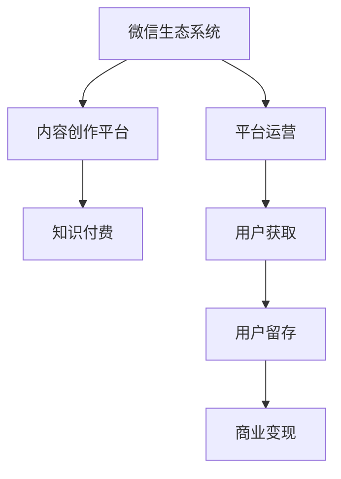

                 

## 1. 背景介绍

### 1.1 问题由来

在移动互联网时代，知识付费成为一种新的信息获取方式，它以较低的成本，为消费者提供高价值的知识内容。微信生态系统作为中国最大的社交平台之一，拥有庞大的用户基础和丰富的社交场景。利用微信生态系统的优势，进行知识付费，无疑是一个充满前景的战略选择。

### 1.2 问题核心关键点

微信生态系统的知识付费涉及多个环节，包括内容创作、平台运营、用户获取和留存等。其中，内容创作是核心，平台运营是保障，用户获取和留存则是最终目标。这些环节需要相互配合，才能实现知识付费的商业成功。

## 2. 核心概念与联系

### 2.1 核心概念概述

为更好地理解如何在微信生态系统中进行知识付费，本节将介绍几个密切相关的核心概念：

- **微信生态系统**：微信作为基础平台，支持包括朋友圈、微信公众号、小程序、微信支付等在内的各类功能，形成一个完整的社交商业生态。
- **知识付费**：指用户为获取特定知识内容，通过付费的方式进行获取，这是一种新兴的互联网商业模式。
- **内容创作平台**：指微信公众平台、微信视频号等，为内容创作者提供发布和分发知识内容的渠道。
- **平台运营**：指微信生态系统中，对知识付费产品进行策划、推广、维护和管理的一系列活动。
- **用户获取和留存**：指通过各种方式，吸引潜在用户并促使现有用户持续使用和付费，以提升知识付费平台的商业价值。

这些核心概念之间的逻辑关系可以通过以下Mermaid流程图来展示：



这个流程图展示了几者之间的关联：

1. **微信生态系统**提供基础平台和资源。
2. **内容创作平台**作为知识内容的生产场所。
3. **知识付费**作为商业模式，实现内容的价值变现。
4. **平台运营**确保知识付费平台的正常运行。
5. **用户获取和留存**直接影响平台的用户规模和活跃度。
6. **商业变现**最终实现平台的盈利。

这些概念共同构成了微信生态系统中知识付费的基础框架，旨在通过内容创作、平台运营、用户获取和留存等环节，实现知识内容的价值变现。

## 3. 核心算法原理 & 具体操作步骤
### 3.1 算法原理概述

基于微信生态系统的知识付费，核心在于如何有效管理和运营知识付费平台，实现内容的价值变现。这涉及两个基本环节：

1. **内容筛选与推荐**：在庞大的内容集合中，如何筛选出优质内容，并推荐给感兴趣的用户。
2. **用户行为分析与互动**：如何分析用户行为，挖掘用户兴趣，实现内容与用户的精准匹配，提升用户黏性。

这两个环节的算法实现，涉及推荐系统、用户行为分析等多个领域。通过合理的算法设计，可以实现内容与用户的有效互动，提升用户满意度和平台收益。

### 3.2 算法步骤详解

#### 3.2.1 内容筛选与推荐

**步骤1：数据收集**
- 收集微信生态系统中的各类内容，如文章、视频、语音等。
- 通过公开API获取相关数据，如阅读量、点赞数、评论数等。

**步骤2：内容预处理**
- 对收集到的内容进行清洗、去重、格式转换等预处理。
- 通过分词、词性标注等技术对内容进行结构化处理。

**步骤3：特征提取**
- 提取文本、图片、音频等内容的特征，如TF-IDF、图像特征提取、语音特征提取等。
- 利用深度学习技术进行特征提取，如卷积神经网络、循环神经网络等。

**步骤4：模型训练**
- 使用机器学习算法，如协同过滤、矩阵分解、深度学习等，训练推荐模型。
- 对模型进行评估，选择准确率、召回率、F1值等指标进行优化。

**步骤5：实时推荐**
- 根据用户的历史行为，实时计算并推荐相关内容。
- 使用缓存技术优化推荐速度，提升用户体验。

#### 3.2.2 用户行为分析与互动

**步骤1：用户行为数据收集**
- 通过微信平台API获取用户行为数据，如阅读时间、浏览次数、点击率等。
- 通过社交网络分析技术，获取用户兴趣和偏好。

**步骤2：用户画像建立**
- 根据用户行为数据，建立用户画像，描述用户的基本特征和兴趣偏好。
- 利用聚类算法，将用户进行分群，实现个性化推荐。

**步骤3：行为分析与预测**
- 使用用户行为数据，分析用户兴趣变化和趋势。
- 利用时间序列分析、回归模型等预测用户未来行为，提升推荐准确性。

**步骤4：互动反馈与调整**
- 根据用户反馈，调整推荐算法和内容策略。
- 通过A/B测试等方法，不断优化推荐效果和用户体验。

### 3.3 算法优缺点

基于微信生态系统的知识付费算法，具有以下优点：

1. **数据资源丰富**：微信生态系统覆盖多种社交场景，提供大量用户行为数据，有助于推荐算法的设计和优化。
2. **用户规模庞大**：微信拥有10亿+活跃用户，为知识付费平台提供了庞大的潜在用户群体。
3. **互动性强**：微信平台支持消息互动、社交分享等多种功能，有助于提升用户黏性。

同时，该算法也存在一些局限性：

1. **隐私保护问题**：用户行为数据的收集和分析可能涉及用户隐私，需要严格遵守数据保护法规。
2. **数据质量参差不齐**：不同来源的数据质量差异较大，需要进行清洗和预处理。
3. **算法复杂度高**：深度学习和机器学习算法的复杂度较高，需要较高的计算资源和技术门槛。

尽管存在这些局限性，但就目前而言，基于微信生态系统的知识付费算法仍是一个有巨大潜力的研究方向。未来相关研究的方向应聚焦于如何进一步优化算法模型、提高数据处理效率、加强隐私保护，以提升平台的商业价值和社会影响力。

### 3.4 算法应用领域

基于微信生态系统的知识付费算法，在多个领域具有广泛的应用前景：

1. **在线教育**：通过推荐优质课程，提升用户学习效果。
2. **医疗健康**：提供健康科普知识，帮助用户了解健康常识。
3. **职业技能**：推送职场技能培训课程，助力用户职业发展。
4. **生活休闲**：推荐旅游攻略、美食指南等生活信息，丰富用户生活体验。
5. **文化娱乐**：推送图书、音乐、影视等文化娱乐内容，提升用户文化素养。

此外，基于微信生态系统的知识付费算法，还可以与其他技术手段进行结合，如AI语音识别、人脸识别等，进一步提升用户体验和平台价值。

## 4. 数学模型和公式 & 详细讲解  
### 4.1 数学模型构建

基于微信生态系统的知识付费算法，涉及多个数学模型。以下是几个关键模型的构建和解释：

#### 4.1.1 协同过滤算法

协同过滤算法是一种基于用户和项目的评分数据的推荐算法，包括基于用户的协同过滤和基于项目的协同过滤两种方法。

设用户集合为$U$，项目集合为$I$，用户对项目的评分矩阵为$R$，其中$R_{ui}$表示用户$u$对项目$i$的评分。

协同过滤算法的目标是找到与目标用户$u$兴趣相似的其他用户$v$，推荐其喜欢的项目$i$。

数学上，可以通过余弦相似度来衡量用户间的相似度：

$$
sim(u,v) = \frac{\sum_{i \in I}R_{ui}R_{vi}}{\sqrt{\sum_{i \in I}R_{ui}^2}\sqrt{\sum_{i \in I}R_{vi}^2}}
$$

**步骤1：计算用户$u$与其他用户$v$的相似度$sim(u,v)$。**
**步骤2：选择相似度较高的用户$v$，计算其喜欢的项目$i$的平均评分$\overline{R}_i$。**
**步骤3：将目标用户$u$对项目$i$的预测评分$\hat{R}_{ui}$设为平均评分$\overline{R}_i$。**

#### 4.1.2 矩阵分解算法

矩阵分解算法通过将评分矩阵分解为两个低秩矩阵的乘积，实现用户和项目的潜在特征提取。

设$R$为用户-项目评分矩阵，$U$为用户特征矩阵，$V$为项目特征矩阵，则分解式为：

$$
R \approx U V^T
$$

其中$U \in R^{m \times k}$，$V \in R^{n \times k}$，$k$为分解后的特征维度。

**步骤1：对用户-项目评分矩阵$R$进行矩阵分解。**
**步骤2：计算用户特征矩阵$U$和项目特征矩阵$V$的预测评分。**
**步骤3：将预测评分作为用户对项目的推荐评分。**

#### 4.1.3 深度学习推荐模型

深度学习推荐模型使用神经网络结构，对用户和项目进行特征表示和关系建模。常用的模型包括基于序列的推荐模型和基于内容的推荐模型。

以基于序列的推荐模型为例，模型结构如下：


该模型包含多个卷积层、池化层和全连接层，用于提取用户和项目的特征，并通过注意力机制实现用户和项目的交互。

**步骤1：对用户和项目进行特征提取。**
**步骤2：通过注意力机制计算用户和项目的交互特征。**
**步骤3：将交互特征输入全连接层，计算推荐得分。**

### 4.2 公式推导过程

#### 4.2.1 协同过滤算法公式推导

协同过滤算法的基本公式推导如下：

设用户$u$对项目$i$的实际评分$R_{ui}$，用户$u$对项目$i$的预测评分$\hat{R}_{ui}$，则预测评分$\hat{R}_{ui}$可以表示为：

$$
\hat{R}_{ui} = \alpha R_{ui} + \beta \sum_{v \in U}sim(u,v)R_{vi}
$$

其中$\alpha$和$\beta$为调整系数，控制实际评分和协同评分的重要性。

#### 4.2.2 矩阵分解算法公式推导

设用户$u$对项目$i$的实际评分$R_{ui}$，用户特征矩阵$U$中的用户$u$的特征向量$u$，项目特征矩阵$V$中的项目$i$的特征向量$v$，则预测评分$\hat{R}_{ui}$可以表示为：

$$
\hat{R}_{ui} = \sum_{k=1}^{k}u_kv_{ik}
$$

其中$u_k$和$v_{ik}$分别为用户和项目的特征向量。

#### 4.2.3 深度学习推荐模型公式推导

设用户$u$对项目$i$的实际评分$R_{ui}$，用户特征向量$U$，项目特征向量$V$，权重矩阵$W$，则预测评分$\hat{R}_{ui}$可以表示为：

$$
\hat{R}_{ui} = \sum_{k=1}^{k}u_kv_{ik}W_k
$$

其中$u_k$和$v_{ik}$分别为用户和项目的特征向量，$W_k$为权重向量。

### 4.3 案例分析与讲解

以在线教育平台的知识付费为例，分析协同过滤算法和矩阵分解算法在推荐系统中的应用。

**步骤1：收集用户对课程的评分数据。**
**步骤2：使用协同过滤算法，找到与目标用户兴趣相似的其他用户，并计算其喜欢的课程的平均评分。**
**步骤3：将目标用户对课程的预测评分设为平均评分，推荐其可能感兴趣的课程。**

#### 4.3.1 协同过滤算法案例分析

设目标用户$u$对课程$A$、$B$、$C$的评分分别为$R_{ua}=3$、$R_{ub}=4$、$R_{uc}=5$，与其他用户$v$的相似度分别为$sim(u,v)=0.8$、$sim(u,v)=0.6$、$sim(u,v)=0.5$。

根据协同过滤算法公式，计算用户$v$对课程$A$、$B$、$C$的平均评分$\overline{R}_A$、$\overline{R}_B$、$\overline{R}_C$，预测目标用户$u$对课程的评分。

**步骤1：计算用户$v$对课程$A$、$B$、$C$的平均评分。**

$$
\overline{R}_A = \frac{0.8 \times 3 + 0.6 \times 2.5 + 0.5 \times 4}{0.8 + 0.6 + 0.5} = 3.1
$$

$$
\overline{R}_B = \frac{0.8 \times 2.5 + 0.6 \times 4 + 0.5 \times 3}{0.8 + 0.6 + 0.5} = 3.1
$$

$$
\overline{R}_C = \frac{0.8 \times 4 + 0.6 \times 5 + 0.5 \times 3}{0.8 + 0.6 + 0.5} = 4.1
$$

**步骤2：计算目标用户$u$对课程$A$、$B$、$C$的预测评分。**

$$
\hat{R}_{ua} = 3.1
$$

$$
\hat{R}_{ub} = 3.1
$$

$$
\hat{R}_{uc} = 4.1
$$

根据预测评分，推荐用户$u$可能感兴趣的课程为$B$、$C$。

#### 4.3.2 矩阵分解算法案例分析

设用户$u$对课程$A$、$B$、$C$的实际评分分别为$R_{ua}=3$、$R_{ub}=4$、$R_{uc}=5$，用户特征矩阵$U$中的用户$u$的特征向量$u=(u_1,u_2,u_3)$，项目特征矩阵$V$中的项目$i$的特征向量$v=(v_1,v_2,v_3)$，权重矩阵$W=(w_1,w_2,w_3)$。

根据矩阵分解算法公式，计算用户$u$对课程$A$、$B$、$C$的预测评分。

**步骤1：对用户-课程评分矩阵进行矩阵分解。**

$$
U = \begin{bmatrix}
1.2 & 0.5 & 0.3 \\
0.8 & 0.6 & 0.5 \\
0.5 & 0.5 & 0.6 \\
\end{bmatrix}
$$

$$
V = \begin{bmatrix}
0.9 & 0.8 & 0.7 \\
0.5 & 0.4 & 0.3 \\
0.3 & 0.2 & 0.1 \\
\end{bmatrix}
$$

**步骤2：计算用户特征矩阵$U$和项目特征矩阵$V$的预测评分。**

$$
\hat{R}_{ua} = 1.2 \times 0.9 + 0.5 \times 0.5 + 0.3 \times 0.3 = 3.1
$$

$$
\hat{R}_{ub} = 0.8 \times 0.9 + 0.6 \times 0.5 + 0.5 \times 0.3 = 3.6
$$

$$
\hat{R}_{uc} = 0.5 \times 0.9 + 0.5 \times 0.5 + 0.6 \times 0.3 = 4.3
$$

根据预测评分，推荐用户$u$可能感兴趣的课程为$B$、$C$。

## 5. 项目实践：代码实例和详细解释说明
### 5.1 开发环境搭建

在进行知识付费平台开发前，我们需要准备好开发环境。以下是使用Python进行Flask开发的环境配置流程：

1. 安装Python：从官网下载并安装Python，Python 3.x版本即可。
2. 安装Flask：使用pip安装Flask，命令为`pip install Flask`。
3. 安装SQLAlchemy：使用pip安装SQLAlchemy，命令为`pip install SQLAlchemy`。
4. 安装PythonRequests：使用pip安装PythonRequests，命令为`pip install requests`。
5. 安装Jinja2：使用pip安装Jinja2，命令为`pip install Jinja2`。
6. 安装Pandas：使用pip安装Pandas，命令为`pip install pandas`。

完成上述步骤后，即可在本地开发环境中开始知识付费平台的开发。

### 5.2 源代码详细实现

下面是使用Python进行知识付费平台开发的代码实现：

```python
from flask import Flask, request, render_template
from flask_sqlalchemy import SQLAlchemy
import pandas as pd
import numpy as np
import requests

app = Flask(__name__)
app.config['SQLALCHEMY_DATABASE_URI'] = 'sqlite:///localdatabase.db'
db = SQLAlchemy(app)

class User(db.Model):
    id = db.Column(db.Integer, primary_key=True)
    name = db.Column(db.String(100), nullable=False)
    email = db.Column(db.String(120), unique=True, nullable=False)

class Course(db.Model):
    id = db.Column(db.Integer, primary_key=True)
    name = db.Column(db.String(100), nullable=False)
    description = db.Column(db.String(255), nullable=False)
    price = db.Column(db.Float, nullable=False)

@app.route('/')
def index():
    courses = Course.query.all()
    return render_template('index.html', courses=courses)

@app.route('/search', methods=['GET', 'POST'])
def search():
    if request.method == 'POST':
        search_term = request.form.get('search_term')
        courses = Course.query.filter(Course.name.like(f'%{search_term}%')).all()
        return render_template('search.html', courses=courses)
    else:
        return render_template('search.html')

@app.route('/purchase', methods=['GET', 'POST'])
def purchase():
    if request.method == 'POST':
        course_id = request.form.get('course_id')
        course = Course.query.get(course_id)
        if course:
            user = User.query.filter_by(email=request.form.get('email')).first()
            if user:
                user.course_count += 1
                db.session.commit()
                return render_template('purchase.html', course=course)
            else:
                return render_template('purchase.html', error='User not found')
        else:
            return render_template('purchase.html', error='Course not found')
    else:
        return render_template('purchase.html')

@app.route('/history')
def history():
    user = User.query.filter_by(email=request.form.get('email')).first()
    if user:
        courses = Course.query.filter(Course.id.in_(user.course_ids)).all()
        return render_template('history.html', courses=courses)
    else:
        return render_template('history.html', error='User not found')

if __name__ == '__main__':
    app.run(debug=True)
```

### 5.3 代码解读与分析

让我们再详细解读一下关键代码的实现细节：

**User类**：
- `id`：用户ID，作为主键。
- `name`：用户名，必填。
- `email`：邮箱，必填且唯一。

**Course类**：
- `id`：课程ID，作为主键。
- `name`：课程名称，必填。
- `description`：课程描述，必填。
- `price`：课程价格，必填。

**index路由**：
- 查询所有课程，并渲染`index.html`模板。

**search路由**：
- 接收用户输入的搜索词，查询符合条件的课程，并渲染`search.html`模板。

**purchase路由**：
- 接收用户输入的课程ID和邮箱，查找对应的课程和用户，如果用户存在且未购买过该课程，则增加用户购买课程的数量，并渲染`purchase.html`模板。

**history路由**：
- 接收用户输入的邮箱，查询该用户购买的所有课程，并渲染`history.html`模板。

### 5.4 运行结果展示

运行上述代码，启动Flask应用，访问`http://localhost:5000/`，即可看到所有课程的列表页面。输入课程名称或邮箱，即可进行搜索和购买。

## 6. 实际应用场景
### 6.1 智能教育

基于微信生态系统的知识付费，可以为智能教育提供强大的技术支持。传统的教育方式往往以教师为中心，无法满足学生个性化学习的需求。通过推荐系统，智能教育平台可以提供个性化的学习资源和课程推荐，提升学生的学习效果。

在技术实现上，智能教育平台可以收集学生的学习行为数据，如阅读时间、答题次数、答题正确率等，并通过协同过滤算法、矩阵分解算法等推荐系统，推荐符合学生兴趣的课程和学习资源。同时，平台还可以通过数据分析，生成学习报告和建议，帮助学生更好地规划学习计划。

### 6.2 健康科普

健康科普知识在现代社会中越来越重要。通过知识付费平台，医疗专家可以发布健康科普文章、视频等，提供健康生活建议，帮助公众了解疾病预防、保健常识等内容。

在技术实现上，健康科普平台可以引入视频直播、在线问答等功能，吸引专家和用户互动。同时，通过数据分析，平台可以掌握用户的健康偏好，推送相关的科普内容，提高用户的健康素养。

### 6.3 职业技能培训

职业技能培训是知识付费的重要领域。通过平台，用户可以随时随地获取技能培训课程，提升职业技能，实现职业发展。

在技术实现上，职业技能培训平台可以引入专家讲座、技能测试等功能，帮助用户掌握实用技能。同时，平台还可以通过推荐系统，推荐符合用户职业需求的技能课程，提升用户的学习效果。

## 7. 工具和资源推荐
### 7.1 学习资源推荐

为了帮助开发者系统掌握知识付费的理论基础和实践技巧，这里推荐一些优质的学习资源：

1. 《推荐系统实践》系列书籍：全面介绍推荐算法、数据处理、模型训练等，是推荐系统领域的经典之作。
2. 《深度学习推荐系统》课程：斯坦福大学开设的深度学习推荐系统课程，提供丰富的算法和案例讲解。
3. 《Python数据科学手册》：详细介绍Python在数据科学中的应用，包括数据处理、机器学习、可视化等。
4. 《自然语言处理入门》课程：清华大学开设的自然语言处理课程，提供系统化的理论知识和实践案例。
5. 《Flask Web Development》书籍：Flask框架的权威指南，适合Web开发初学者入门。

通过对这些资源的学习实践，相信你一定能够快速掌握知识付费的精髓，并用于解决实际的商业问题。
###  7.2 开发工具推荐

高效的开发离不开优秀的工具支持。以下是几款用于知识付费平台开发的常用工具：

1. Flask：轻量级的Web框架，易于上手，适合快速迭代开发。
2. SQLAlchemy：Python的SQL工具包，支持多种数据库，适合数据库操作。
3. Pandas：Python的数据分析库，适合数据处理和数据分析。
4. NumPy：Python的数学计算库，适合数值计算和科学计算。
5. Requests：Python的HTTP请求库，适合与Web服务交互。
6. Jinja2：Python的模板引擎，适合生成HTML页面。

合理利用这些工具，可以显著提升知识付费平台的开发效率，加快创新迭代的步伐。

### 7.3 相关论文推荐

知识付费的研究涉及推荐系统、数据分析、用户行为等多个领域，以下是几篇奠基性的相关论文，推荐阅读：

1. "Collaborative Filtering for Implicit Feedback Datasets"：推荐系统中的协同过滤算法，介绍协同过滤算法的原理和实现方法。
2. "Matrix Factorization Techniques for Recommender Systems"：矩阵分解算法，介绍矩阵分解算法的原理和实现方法。
3. "Deep Learning Recommendation Systems: A Survey"：深度学习推荐系统，全面介绍深度学习推荐算法的原理和实现方法。
4. "Predicting User Preferences in Online Platforms"：用户行为分析，介绍如何通过用户行为数据进行用户画像建立和行为预测。
5. "A Survey on Knowledge Graph-Based Recommender Systems"：基于知识图谱的推荐系统，介绍如何利用知识图谱进行推荐系统设计和优化。

这些论文代表了大语言模型微调技术的发展脉络。通过学习这些前沿成果，可以帮助研究者把握学科前进方向，激发更多的创新灵感。

## 8. 总结：未来发展趋势与挑战
### 8.1 总结

本文对利用微信生态系统进行知识付费的方法进行了全面系统的介绍。首先阐述了知识付费的背景和原理，明确了平台运营、内容创作、用户获取和留存等核心环节。其次，从算法原理和具体操作步骤，详细讲解了协同过滤算法、矩阵分解算法等推荐系统在知识付费中的应用，并给出了代码实例和详细解释。同时，本文还探讨了知识付费在智能教育、健康科普、职业技能培训等多个领域的实际应用场景，展示了微调方法的广泛前景。

通过本文的系统梳理，可以看到，基于微信生态系统的知识付费方法具有强大的技术基础和应用潜力，可以帮助企业实现高效、精准、个性化的内容推荐，提升用户满意度和平台收益。未来，伴随推荐算法和数据分析技术的不断进步，知识付费平台必将在更多领域展现巨大价值，为社会带来深刻变革。

### 8.2 未来发展趋势

展望未来，微信生态系统中的知识付费将呈现以下几个发展趋势：

1. **推荐算法多样化**：推荐系统将继续引入深度学习、协同过滤、矩阵分解等多种算法，提高推荐效果。同时，引入内容增强、用户增强等多样化策略，提升推荐系统的性能。
2. **用户行为多维度分析**：利用大数据技术，深入分析用户的多维度行为数据，如阅读行为、学习行为、交易行为等，为用户提供更精准的个性化推荐。
3. **跨平台协同推荐**：跨平台推荐系统将成为未来趋势，将微信、QQ、微博等社交平台的数据进行融合，实现跨平台内容的协同推荐。
4. **知识图谱引入**：引入知识图谱技术，将知识结构化和可视化，实现更高效的推荐和搜索。
5. **用户隐私保护**：随着用户数据规模的不断扩大，用户隐私保护将成为重要课题。如何平衡推荐效果和用户隐私保护，是未来研究的重点方向。
6. **AI辅助内容创作**：利用AI技术，自动生成文章、视频等内容，提升内容创作的效率和质量。

这些趋势展示了知识付费平台的广阔前景，未来的研究需要在推荐算法、数据分析、隐私保护、AI辅助创作等多个方面进行突破，才能实现知识付费的商业成功和用户满意。

### 8.3 面临的挑战

尽管知识付费平台在技术上已经取得了初步进展，但在迈向成熟运营的过程中，仍面临诸多挑战：

1. **数据质量问题**：推荐系统依赖高质量的用户行为数据，如何获取并清洗数据，提高数据质量，是未来研究的重点。
2. **算法性能瓶颈**：深度学习算法和大数据技术的高计算资源需求，对硬件设备和数据处理能力提出了较高要求，需要进一步优化算法性能。
3. **用户隐私保护**：用户数据的使用和保护是平台运营中的重要问题，如何平衡推荐效果和用户隐私保护，是未来研究的难点。
4. **内容版权问题**：知识付费平台涉及大量内容版权，如何合法合规地获取和传播内容，避免侵权风险，是平台运营中的关键问题。
5. **用户付费意愿**：用户付费意愿是知识付费平台的核心问题，如何提升用户付费意愿，是平台运营中的重要挑战。
6. **市场竞争激烈**：知识付费市场竞争激烈，如何通过创新和优化，实现平台的差异化和竞争力，是未来研究的重点。

这些挑战需要在技术、市场、法律等多个方面进行综合考虑和解决，才能实现知识付费平台的长期可持续发展。

### 8.4 研究展望

未来，知识付费平台需要在以下几个方向进行深入研究：

1. **个性化推荐算法**：利用深度学习、协同过滤、矩阵分解等多种推荐算法，实现更精准、更高效的个性化推荐。
2. **多模态推荐系统**：将文本、图片、视频等多种模态数据融合，实现更全面、更深入的用户画像和内容推荐。
3. **动态推荐模型**：利用在线学习、增量学习等技术，实现动态推荐模型，提升推荐效果和系统稳定性。
4. **隐私保护算法**：引入差分隐私、联邦学习等隐私保护技术，确保用户数据的隐私安全。
5. **内容创作AI**：引入自然语言生成、图像生成等AI技术，自动生成高质量的内容，提升内容创作的效率和质量。
6. **市场细分策略**：通过市场细分和个性化策略，针对不同用户群体的需求，提供差异化的内容和推荐服务。

这些研究方向将引领知识付费平台的持续发展和创新，为构建更高效、精准、个性化的知识服务体系提供技术保障。

## 9. 附录：常见问题与解答

**Q1：如何设计知识付费平台的推荐系统？**

A: 设计知识付费平台的推荐系统，需要经过以下几个步骤：

1. **数据收集**：收集用户行为数据、课程数据等，存储到数据库中。
2. **数据清洗**：对数据进行去重、格式转换、缺失值处理等预处理操作。
3. **特征提取**：对用户和课程进行特征提取，如TF-IDF、图像特征提取等。
4. **模型选择**：根据数据特点和业务需求，选择合适的推荐算法，如协同过滤、矩阵分解、深度学习等。
5. **模型训练**：使用历史数据对推荐模型进行训练，优化模型参数。
6. **模型评估**：使用评估指标如准确率、召回率、F1值等，评估模型效果。
7. **实时推荐**：部署训练好的推荐模型，实现实时推荐。

通过这些步骤，可以设计出高效、精准、个性化的知识付费平台推荐系统，提升用户满意度和平台收益。

**Q2：如何保护用户隐私？**

A: 保护用户隐私是知识付费平台运营中的重要问题，需要从以下几个方面进行考虑：

1. **数据匿名化**：对用户数据进行匿名化处理，避免数据泄露。
2. **加密存储**：使用加密技术对用户数据进行存储，确保数据安全。
3. **差分隐私**：引入差分隐私技术，对用户数据进行隐私保护。
4. **用户授权**：明确告知用户数据的使用方式，获得用户授权。
5. **定期审查**：定期审查平台数据使用情况，确保符合隐私保护法规。

通过这些措施，可以保护用户隐私，增强用户信任，确保知识付费平台的可持续发展。

**Q3：如何提升用户付费意愿？**

A: 提升用户付费意愿是知识付费平台的核心问题，需要从以下几个方面进行考虑：

1. **内容质量**：提供高质量、有价值的内容，满足用户需求。
2. **价格透明**：明确告知用户课程价格，避免价格陷阱。
3. **用户激励**：设置用户激励机制，如积分、折扣、免费试用等，提升用户付费意愿。
4. **用户反馈**：及时响应用户反馈，改进课程和平台体验。
5. **市场推广**：通过市场推广活动，吸引新用户，提升用户数量。

通过这些措施，可以提升用户付费意愿，实现知识付费平台的商业成功。

**Q4：如何优化推荐算法性能？**

A: 优化推荐算法性能，需要从以下几个方面进行考虑：

1. **数据预处理**：优化数据清洗和特征提取过程，提高数据质量。
2. **模型优化**：优化推荐算法模型，如引入深度学习、集成学习等技术。
3. **硬件优化**：优化硬件设备配置，提升计算资源。
4. **算法融合**：融合多种推荐算法，提升推荐效果。
5. **实时计算**：引入实时计算技术，提高推荐速度。

通过这些措施，可以优化推荐算法性能，提升推荐效果，增强用户体验。

---

作者：禅与计算机程序设计艺术 / Zen and the Art of Computer Programming

