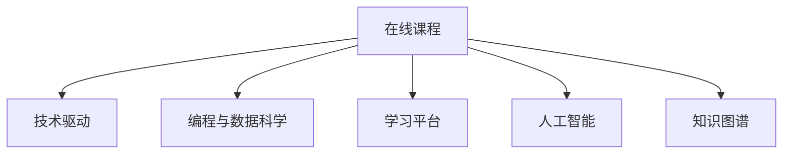

                 

# 如何利用技术能力创建在线课程

> 关键词：在线课程, 技术驱动, 编程, 数据科学, 学习平台, 人工智能, 知识图谱

## 1. 背景介绍

### 1.1 问题由来
随着互联网的普及和技术的进步，在线教育逐渐成为人们获取知识和技能的重要渠道。在线课程的发展不仅满足了人们对教育的个性化需求，也为技术教育工作者提供了广阔的舞台。如何利用技术能力，高效、系统地创建高质量的在线课程，成为众多教育工作者关注的焦点。

在线课程的成功与否，很大程度上取决于课程的内容质量和教师的教学水平。然而，优质的课程内容不仅需要深厚的专业知识，还需要掌握现代教育技术，将知识以易于理解和互动的方式传递给学员。因此，利用技术能力创建在线课程，是提升教育质量、实现教育信息化的关键步骤。

### 1.2 问题核心关键点
在线课程的创建涉及多个关键环节，包括课程内容的设计、教学方法的创新、学习平台的开发和维护等。关键问题包括：

1. **课程内容的设计**：如何确保课程内容的专业性、系统性和趣味性，使其能够吸引学员并有效传递知识。
2. **教学方法的创新**：如何利用技术手段，如视频直播、互动问答、案例分析等，增强教学互动性和趣味性，提升学习效果。
3. **学习平台的开发**：如何开发和维护一个稳定、易用的在线学习平台，支持大规模的学员学习和互动。
4. **数据驱动的个性化学习**：如何利用大数据和人工智能技术，实现个性化推荐、学习路径规划等，提升学习效率和体验。

### 1.3 问题研究意义
利用技术能力创建在线课程，对于提升教育质量、推动教育信息化具有重要意义：

1. **扩大学生覆盖面**：在线课程打破了时间和空间的限制，使得全球各地的学员都能方便地获取高质量教育资源。
2. **提高教育效率**：通过技术手段，如视频回放、自动批改等，可以提高教学效率，节省教师和学员的时间。
3. **促进知识传播**：在线课程能够快速、广泛地传播知识，有助于知识的快速更新和扩散。
4. **个性化学习体验**：利用大数据和人工智能技术，可以提供个性化的学习推荐和辅导，提升学习效果和满意度。
5. **推动教育创新**：在线课程提供了新的教学模式，如翻转课堂、MOOC等，为教育创新提供了新的可能性。

## 2. 核心概念与联系

### 2.1 核心概念概述

为更好地理解如何利用技术能力创建在线课程，本节将介绍几个密切相关的核心概念：

- **在线课程**：通过互联网技术，以在线方式提供的教育资源和课程，通常包括视频、文本、练习等。
- **技术驱动**：利用先进的信息技术，如云计算、大数据、人工智能等，提升在线课程的教学效果和用户体验。
- **编程与数据科学**：作为在线课程的重要内容，编程和数据科学是技术教育的核心。
- **学习平台**：提供课程内容的呈现和交互环境，支持学员在线学习、交流和评估。
- **人工智能**：通过机器学习、自然语言处理等技术，提升在线课程的自动化和智能化水平。
- **知识图谱**：一种表示知识结构的概念图谱，用于知识管理和信息检索，支持课程内容的智能化推荐。

这些核心概念之间的逻辑关系可以通过以下Mermaid流程图来展示：



这个流程图展示了大语言模型的核心概念及其之间的关系：

1. 在线课程是技术驱动、编程与数据科学、学习平台、人工智能和知识图谱的综合体现。
2. 技术驱动提供了课程开发和呈现的底层技术支持。
3. 编程与数据科学作为课程的重要内容，需要技术手段的支撑。
4. 学习平台提供了课程的呈现和交互环境。
5. 人工智能和知识图谱进一步提升了课程的智能化和个性化水平。

这些概念共同构成了在线课程的技术基础，为其创建和优化提供了全面的指导。

## 3. 核心算法原理 & 具体操作步骤

### 3.1 算法原理概述

在线课程的创建和优化，本质上是一个多目标优化问题。其核心思想是：通过技术手段，综合考虑课程内容的专业性、教学方法的互动性、学习平台的易用性和数据的个性化需求，最大化教学效果和学习体验。

形式化地，设课程内容为 $C$，教学方法为 $T$，学习平台为 $P$，数据驱动策略为 $D$，目标函数为 $F$，则最优解为：

$$
\max F(C, T, P, D)
$$

其中 $F$ 定义为教学效果和用户体验的加权和，权重由课程需求和学员反馈决定。

具体步骤包括：

1. **课程内容设计**：收集和整合教学内容，确保内容的科学性、完整性和趣味性。
2. **教学方法创新**：选择合适的技术手段，如视频直播、互动问答、案例分析等，提升教学互动性和趣味性。
3. **学习平台开发**：开发和维护一个稳定、易用的在线学习平台，支持大规模的学员学习和互动。
4. **数据驱动个性化学习**：利用大数据和人工智能技术，实现个性化推荐、学习路径规划等，提升学习效率和体验。

### 3.2 算法步骤详解

**Step 1: 课程内容设计**
- 收集和整合课程内容，确保内容的科学性、完整性和趣味性。
- 进行内容结构化处理，如将文字、视频、练习等元素转化为可编程格式。
- 利用文本分析、图像处理等技术，增强内容的表现力和互动性。

**Step 2: 教学方法创新**
- 选择合适的技术手段，如视频直播、互动问答、案例分析等，提升教学互动性和趣味性。
- 利用在线白板、虚拟实验室等工具，进行实时互动和演示。
- 引入游戏化元素，如积分系统、排行榜等，增强学习的激励性和趣味性。

**Step 3: 学习平台开发**
- 设计并实现一个稳定、易用的在线学习平台，支持大规模的学员学习和互动。
- 开发智能推荐系统，根据学员的学习历史和行为，推荐个性化的课程和学习资源。
- 实现学习路径规划功能，根据学员的学习进度和需求，智能推荐后续课程。

**Step 4: 数据驱动个性化学习**
- 收集和分析学员的学习数据，如观看视频的时长、练习题的成绩等。
- 利用大数据和人工智能技术，进行学习效果评估和个性化推荐。
- 引入自适应学习算法，根据学员的学习情况，动态调整学习内容和难度。

### 3.3 算法优缺点

技术驱动的在线课程创建具有以下优点：
1. **高效性**：利用技术手段，可以快速生成和更新课程内容，适应快速变化的学科知识。
2. **互动性**：通过视频直播、互动问答等技术手段，提升教学互动性和趣味性，增强学习效果。
3. **个性化**：利用大数据和人工智能技术，实现个性化推荐和自适应学习，提升学习效率和体验。
4. **可扩展性**：基于云计算和分布式计算技术，能够支持大规模的学员学习和互动。

同时，该方法也存在一定的局限性：
1. **技术依赖性**：在线课程的创建和维护需要较高的技术门槛，对技术团队的要求较高。
2. **成本问题**：初期开发和维护成本较高，需要一定的资金投入。
3. **学员依赖性**：在线课程需要学员有一定的技术基础，难以满足所有学员的需求。
4. **隐私保护**：在线课程需要收集和分析学员的学习数据，可能涉及隐私问题。

尽管存在这些局限性，但就目前而言，技术驱动的在线课程创建方法已成为教育领域的重要趋势，具有广阔的应用前景。

### 3.4 算法应用领域

技术驱动的在线课程创建方法，已经在多个领域得到了广泛应用，包括但不限于：

1. **编程与数据科学**：提供编程语言和数据科学相关的在线课程，支持自主学习和项目实践。
2. **工程与设计**：通过视频讲解、在线模拟等方式，提供工程与设计相关的课程内容。
3. **语言学习**：利用自然语言处理技术，提供语言学习课程，支持学员进行口语练习和互动。
4. **艺术与音乐**：通过视频、音频等媒体，提供艺术与音乐相关的在线课程，支持学员进行创作和鉴赏。
5. **商业与管理**：提供商业与管理相关的课程，支持学员进行商业分析和管理实践。
6. **健康与生活**：通过视频讲解和互动问答，提供健康与生活相关的课程，支持学员进行健康管理和自我提升。

除了上述这些经典应用外，在线课程的技术驱动方法还在不断拓展新的应用场景，如教育游戏、虚拟现实教学等，为在线教育带来了新的活力。

## 4. 数学模型和公式 & 详细讲解 & 举例说明

### 4.1 数学模型构建

本节将使用数学语言对技术驱动的在线课程创建过程进行更加严格的刻画。

设在线课程的目标函数为 $F$，其定义为教学效果和用户体验的加权和：

$$
F = \alpha \times \text{教学效果} + \beta \times \text{用户体验}
$$

其中 $\alpha$ 和 $\beta$ 为权重系数，可以根据课程需求和学员反馈进行调整。

**教学效果**定义为学员在课程中的知识掌握情况和学习成果，可以通过以下指标来衡量：

- **考试成绩**：学员在期末考试中的成绩。
- **作业完成率**：学员在课程中的作业完成情况。
- **项目实践**：学员在课程中的项目实践成果。

**用户体验**定义为学员在课程中的互动性和满意度，可以通过以下指标来衡量：

- **互动率**：学员在学习过程中的互动频率。
- **完成率**：学员在学习过程中的课程完成情况。
- **满意度**：学员在学习过程中的主观评价。

### 4.2 公式推导过程

以下是公式的具体推导过程：

**教学效果模型**：
设课程内容为 $C$，学员知识掌握情况为 $K$，则有：

$$
K = f(C)
$$

其中 $f$ 为知识映射函数，可以定义为课程内容与学员知识掌握情况之间的映射关系。

**用户体验模型**：
设学员在学习过程中的互动频率为 $I$，满意度为 $S$，则有：

$$
I = g(C)
$$
$$
S = h(I, C)
$$

其中 $g$ 为互动映射函数，$h$ 为满意度映射函数，可以定义互动频率和满意度之间的关系。

综合上述模型，可以得到目标函数 $F$ 的具体形式：

$$
F = \alpha \times K + \beta \times (I \times S)
$$

### 4.3 案例分析与讲解

以编程与数据科学课程为例，分析如何利用技术手段提升教学效果和学习体验。

**课程内容设计**：
- **视频讲解**：将课程内容录制为视频，支持学员随时随地学习。
- **在线练习**：通过编程平台，提供编程练习题，实时批改和反馈。
- **项目实践**：设计编程项目，学员完成项目后，由教师进行评估和指导。

**教学方法创新**：
- **互动直播**：利用视频直播工具，教师进行实时互动讲解，增强教学效果。
- **代码编辑**：在编程平台中嵌入代码编辑器，支持学员实时修改代码和运行测试。
- **案例分析**：通过实际案例讲解，帮助学员理解和应用编程知识。

**学习平台开发**：
- **智能推荐**：利用大数据和人工智能技术，根据学员的学习历史和行为，推荐个性化的课程和学习资源。
- **学习路径规划**：根据学员的学习进度和需求，智能推荐后续课程，确保学习的连贯性和系统性。

**数据驱动个性化学习**：
- **学习数据分析**：收集和分析学员的学习数据，如观看视频的时长、练习题的成绩等。
- **自适应学习算法**：根据学员的学习情况，动态调整学习内容和难度，提升学习效率。

## 5. 项目实践：代码实例和详细解释说明

### 5.1 开发环境搭建

在进行在线课程开发前，我们需要准备好开发环境。以下是使用Python进行Flask开发的环境配置流程：

1. 安装Anaconda：从官网下载并安装Anaconda，用于创建独立的Python环境。

2. 创建并激活虚拟环境：
```bash
conda create -n flask-env python=3.8 
conda activate flask-env
```

3. 安装Flask：从官网获取对应的安装命令。例如：
```bash
pip install flask
```

4. 安装各类工具包：
```bash
pip install numpy pandas scikit-learn matplotlib tqdm jupyter notebook ipython
```

完成上述步骤后，即可在`flask-env`环境中开始开发实践。

### 5.2 源代码详细实现

下面我们以编程与数据科学课程为例，给出使用Flask构建在线课程的PyTorch代码实现。

首先，定义课程的路由和视图函数：

```python
from flask import Flask, render_template, request

app = Flask(__name__)

@app.route('/')
def index():
    return render_template('index.html')

@app.route('/about', methods=['GET'])
def about():
    return render_template('about.html')

@app.route('/videos', methods=['GET'])
def videos():
    videos = get_videos()
    return render_template('videos.html', videos=videos)

@app.route('/exercises', methods=['GET'])
def exercises():
    exercises = get_exercises()
    return render_template('exercises.html', exercises=exercises)

@app.route('/projects', methods=['GET'])
def projects():
    projects = get_projects()
    return render_template('projects.html', projects=projects)
```

然后，定义相应的辅助函数：

```python
def get_videos():
    # 从数据库或文件系统中获取课程视频信息
    return videos

def get_exercises():
    # 从数据库或文件系统中获取编程练习题
    return exercises

def get_projects():
    # 从数据库或文件系统中获取项目信息
    return projects
```

接下来，定义模板文件：

```html
<!-- index.html -->
<!DOCTYPE html>
<html>
<head>
    <title>编程与数据科学课程</title>
</head>
<body>
    <h1>欢迎来到编程与数据科学课程</h1>
    <a href="/about">关于我们</a>
    <a href="/videos">视频讲解</a>
    <a href="/exercises">在线练习</a>
    <a href="/projects">项目实践</a>
</body>
</html>

<!-- about.html -->
<!DOCTYPE html>
<html>
<head>
    <title>关于我们</title>
</head>
<body>
    <h1>关于编程与数据科学课程</h1>
    <p>我们提供全面的编程与数据科学课程，涵盖Python、R、数据科学等多个领域。</p>
</body>
</html>

<!-- videos.html -->
<!DOCTYPE html>
<html>
<head>
    <title>视频讲解</title>
</head>
<body>
    <h1>视频讲解</h1>
    <ul>
        
        <li><a href="{{ video.url }}">{{ video.title }}</a></li>
        
    </ul>
</body>
</html>

<!-- exercises.html -->
<!DOCTYPE html>
<html>
<head>
    <title>在线练习</title>
</head>
<body>
    <h1>在线练习</h1>
    <ul>
        
        <li><a href="{{ exercise.url }}">{{ exercise.title }}</a></li>
        
    </ul>
</body>
</html>

<!-- projects.html -->
<!DOCTYPE html>
<html>
<head>
    <title>项目实践</title>
</head>
<body>
    <h1>项目实践</h1>
    <ul>
        
        <li><a href="{{ project.url }}">{{ project.title }}</a></li>
        
    </ul>
</body>
</html>
```

最后，启动Flask应用，测试课程页面：

```python
if __name__ == '__main__':
    app.run(debug=True)
```

以上就是一个使用Flask构建在线课程的完整代码实现。可以看到，通过Flask的路由机制和模板引擎，可以方便地实现课程内容的呈现和交互。

### 5.3 代码解读与分析

让我们再详细解读一下关键代码的实现细节：

**Flask应用**：
- `index`函数：定义课程首页，包括课程概览、关于我们、视频讲解、在线练习和项目实践等链接。
- `about`函数：定义关于我们页面，介绍课程的详细信息。
- `videos`函数：定义视频讲解页面，展示所有视频资源。
- `exercises`函数：定义在线练习页面，展示所有编程练习题。
- `projects`函数：定义项目实践页面，展示所有项目资源。

**辅助函数**：
- `get_videos`函数：从数据库或文件系统中获取视频信息，返回一个视频列表。
- `get_exercises`函数：从数据库或文件系统中获取编程练习题，返回一个练习题列表。
- `get_projects`函数：从数据库或文件系统中获取项目信息，返回一个项目列表。

**模板文件**：
- `index.html`：定义课程首页，包含课程概览、关于我们、视频讲解、在线练习和项目实践等链接。
- `about.html`：定义关于我们页面，介绍课程的详细信息。
- `videos.html`：定义视频讲解页面，展示所有视频资源。
- `exercises.html`：定义在线练习页面，展示所有编程练习题。
- `projects.html`：定义项目实践页面，展示所有项目资源。

可以看到，Flask框架提供的路由和模板机制，使得在线课程的开发变得简洁高效。开发者可以将更多精力放在课程内容的设计和呈现上，而不必过多关注底层实现细节。

当然，工业级的系统实现还需考虑更多因素，如用户认证、数据存储、性能优化等。但核心的开发流程基本与此类似。

## 6. 实际应用场景

### 6.1 智能课堂

在线课程技术在智能课堂中的应用，可以显著提升教学效果和学习体验。智能课堂通过智能化的技术手段，如视频直播、互动问答、自适应学习等，实现对传统课堂的全面升级。

具体而言，在智能课堂中，教师可以实时获取学员的学习数据，根据学员的学习情况和反馈，调整教学内容和节奏。学员也可以通过在线平台进行实时互动和反馈，增强学习效果。智能课堂不仅能够提高教学质量，还能促进教育的个性化和趣味性。

### 6.2 远程教育

在线课程在远程教育中的应用，使得学习不受时间和空间的限制，打破了传统教育的地域限制。远程教育通过在线课程的开发和部署，为全球各地的学员提供高质量的教育资源。

在远程教育中，教师和学员可以通过在线平台进行实时互动和交流，获得更好的教学效果。远程教育还能支持大规模的学员学习和互动，为偏远地区的学员提供教育机会。

### 6.3 企业培训

在线课程在企业培训中的应用，可以提升员工的技能和素质，促进企业的长期发展。通过在线课程，企业可以灵活地安排培训时间和地点，降低培训成本。

在线课程在企业培训中，通常需要与企业的业务场景结合，设计针对性的课程内容。通过在线平台的支持和互动，企业员工可以随时随地进行学习和交流，提升工作效率和专业能力。

### 6.4 未来应用展望

随着技术的不断进步，在线课程将在更多领域得到应用，为教育和学习带来新的变革。

1. **教育游戏化**：通过游戏化元素，如积分系统、排行榜等，增强学习的趣味性和激励性。
2. **虚拟现实教学**：利用虚拟现实技术，提供沉浸式学习体验，增强课程的互动性和趣味性。
3. **个性化推荐**：利用大数据和人工智能技术，实现个性化推荐和自适应学习，提升学习效率和体验。
4. **多语言学习**：通过自然语言处理技术，提供多语言在线课程，支持全球学员的学习。
5. **社区互动**：建立在线社区，支持学员之间的交流和合作，增强学习的社交性。

这些技术手段的应用，将进一步提升在线课程的趣味性和互动性，为教育和学习带来更多的可能性。

## 7. 工具和资源推荐

### 7.1 学习资源推荐

为了帮助开发者系统掌握在线课程的技术基础和实践技巧，这里推荐一些优质的学习资源：

1. **《Python Web开发实战》**：本书系统介绍了Python Web开发的常用技术和框架，如Flask、Django等，适合入门和进阶学习。
2. **《Flask Web开发实战》**：本书详细讲解了Flask框架的使用方法，通过实战项目，帮助读者掌握Flask开发技巧。
3. **《机器学习实战》**：本书介绍了机器学习的基本原理和常用算法，适合编程与数据科学课程的学习。
4. **《深度学习》**：斯坦福大学李飞飞教授的课程，全面讲解了深度学习的基本概念和前沿技术，适合深入学习。
5. **《自然语言处理》**：斯坦福大学Dan Jurafsky和James H. Martin的课程，系统介绍了自然语言处理的基本方法和应用，适合语言学习课程的学习。

通过学习这些资源，相信你一定能够快速掌握在线课程的技术基础和实践技巧，并用于解决实际的课程创建问题。

### 7.2 开发工具推荐

高效的开发离不开优秀的工具支持。以下是几款用于在线课程开发的常用工具：

1. **Flask**：轻量级的Python Web框架，易于上手，适合中小规模的在线课程开发。
2. **Django**：功能强大的Python Web框架，适合大规模的企业应用开发。
3. **Jupyter Notebook**：交互式编程环境，适合数据科学和机器学习课程的开发。
4. **MySQL**：流行的关系型数据库，适合存储和查询在线课程的数据。
5. **MongoDB**：流行的NoSQL数据库，适合存储和查询大数据和文档数据。
6. **Gunicorn**：Python Web应用的进程管理工具，支持并发处理，适合大规模在线课程的部署。

合理利用这些工具，可以显著提升在线课程的开发效率，加快创新迭代的步伐。

### 7.3 相关论文推荐

在线课程的研究源于学界的持续探索。以下是几篇奠基性的相关论文，推荐阅读：

1. **《在线教育平台的设计与实现》**：详细介绍了在线教育平台的设计和实现方法，适合理解在线课程的技术基础。
2. **《基于自适应学习模型的在线课程推荐系统》**：通过自适应学习模型，实现了个性化推荐和自适应学习，提升学习效率和体验。
3. **《多模态数据驱动的在线课程学习分析》**：利用多模态数据，实现了学习效果评估和个性化推荐，提升课程效果。
4. **《基于虚拟现实技术的在线课程互动学习》**：通过虚拟现实技术，实现了沉浸式学习体验，增强课程的互动性和趣味性。
5. **《知识图谱驱动的在线课程智能推荐系统》**：通过知识图谱技术，实现了课程内容的智能化推荐，提升学习效率和体验。

这些论文代表了大语言模型微调技术的发展脉络。通过学习这些前沿成果，可以帮助研究者把握学科前进方向，激发更多的创新灵感。

## 8. 总结：未来发展趋势与挑战

### 8.1 总结

本文对如何利用技术能力创建在线课程进行了全面系统的介绍。首先阐述了在线课程的技术基础和研究背景，明确了在线课程的开发目标和关键环节。其次，从原理到实践，详细讲解了在线课程的数学模型和算法步骤，给出了完整的课程开发代码实例。同时，本文还探讨了在线课程在多个领域的应用场景，展示了技术驱动的在线课程创建的广阔前景。

通过本文的系统梳理，可以看到，利用技术能力创建在线课程，是提升教育质量和效率、推动教育信息化的重要手段。技术手段的引入，使得课程开发变得更加高效、系统，满足了不同学员的学习需求，同时也为在线教育的可持续发展奠定了坚实基础。

### 8.2 未来发展趋势

展望未来，在线课程技术将呈现以下几个发展趋势：

1. **技术融合**：在线课程将与其他前沿技术进行更深入的融合，如人工智能、知识图谱、虚拟现实等，提升课程的智能化和个性化水平。
2. **开放共享**：在线课程将逐步走向开放共享，支持全球范围内的教育资源互通和共享，促进教育的全球化发展。
3. **数据驱动**：在线课程将利用大数据和人工智能技术，实现个性化推荐和自适应学习，提升学习效率和体验。
4. **游戏化学习**：通过游戏化元素，增强学习的趣味性和激励性，提升学习的互动性和参与度。
5. **多模态融合**：在线课程将支持多模态数据的融合，如文本、视频、音频等，提供更全面、丰富的学习体验。
6. **社区互动**：建立在线社区，支持学员之间的交流和合作，增强学习的社交性和协作性。

这些趋势将进一步拓展在线课程的应用场景，提升教育的效率和质量，为全球学员提供更优质的学习资源和体验。

### 8.3 面临的挑战

尽管在线课程技术取得了长足的进展，但在迈向更加智能化、普适化应用的过程中，它仍面临诸多挑战：

1. **技术门槛**：在线课程的开发和维护需要较高的技术门槛，对技术团队的要求较高。
2. **成本问题**：初期开发和维护成本较高，需要一定的资金投入。
3. **数据隐私**：在线课程需要收集和分析学员的学习数据，可能涉及隐私问题。
4. **技术更新**：在线课程需要不断更新和维护，以适应技术进步和课程需求的变化。
5. **课程质量**：课程内容的设计和呈现需要精心规划，保证课程的专业性和趣味性。

尽管存在这些挑战，但在线课程技术的发展潜力巨大，未来必将在教育领域发挥更大的作用。相信随着技术的不断进步和应用实践的深入，这些挑战终将逐步克服，在线课程将迎来更加广阔的发展前景。

### 8.4 研究展望

面向未来，在线课程技术需要在以下几个方面寻求新的突破：

1. **技术创新**：不断引入新的技术手段，如人工智能、知识图谱、虚拟现实等，提升课程的智能化和个性化水平。
2. **数据驱动**：利用大数据和人工智能技术，实现个性化推荐和自适应学习，提升学习效率和体验。
3. **多模态融合**：支持多模态数据的融合，如文本、视频、音频等，提供更全面、丰富的学习体验。
4. **社区互动**：建立在线社区，支持学员之间的交流和合作，增强学习的社交性和协作性。
5. **游戏化学习**：通过游戏化元素，增强学习的趣味性和激励性，提升学习的互动性和参与度。
6. **数据隐私**：制定严格的数据隐私保护政策，确保学员数据的安全性和隐私性。

这些研究方向的探索，将引领在线课程技术迈向更高的台阶，为全球学员提供更加优质的学习资源和体验。

## 9. 附录：常见问题与解答

**Q1：如何评估在线课程的效果？**

A: 在线课程的效果评估可以通过以下几个指标来衡量：
1. **考试成绩**：学员在课程中的考试和测验成绩。
2. **作业完成率**：学员在课程中的作业完成情况。
3. **项目实践**：学员在课程中的项目实践成果。
4. **互动率**：学员在学习过程中的互动频率。
5. **完成率**：学员在学习过程中的课程完成情况。
6. **满意度**：学员在学习过程中的主观评价。

通过综合这些指标，可以全面评估在线课程的效果。

**Q2：在线课程开发过程中需要注意哪些问题？**

A: 在线课程开发过程中需要注意以下几个问题：
1. **课程内容设计**：确保课程内容的科学性、完整性和趣味性，满足学员的学习需求。
2. **技术手段选择**：选择合适的技术手段，提升教学互动性和趣味性。
3. **学习平台开发**：开发和维护一个稳定、易用的在线学习平台，支持大规模的学员学习和互动。
4. **数据驱动个性化学习**：利用大数据和人工智能技术，实现个性化推荐和自适应学习，提升学习效率和体验。
5. **用户隐私保护**：制定严格的数据隐私保护政策，确保学员数据的安全性和隐私性。

这些问题的解决需要团队合作和全面规划，才能确保在线课程的开发顺利进行。

**Q3：在线课程开发中如何利用技术手段提升教学效果？**

A: 在线课程开发中，可以利用以下技术手段提升教学效果：
1. **视频直播**：利用视频直播工具，教师进行实时互动讲解，增强教学效果。
2. **互动问答**：在课程中添加互动问答环节，增强学员的参与感和互动性。
3. **自适应学习**：利用大数据和人工智能技术，根据学员的学习情况，动态调整学习内容和难度，提升学习效率。
4. **项目实践**：设计编程项目，学员完成项目后，由教师进行评估和指导，增强实践能力。
5. **在线模拟**：利用虚拟实验室等工具，进行实时互动和演示，增强学习效果。

通过这些技术手段，可以显著提升在线课程的教学效果和用户体验。

**Q4：在线课程的开发和维护需要注意哪些技术细节？**

A: 在线课程的开发和维护需要注意以下几个技术细节：
1. **前后端分离**：将课程内容的前端展示和后端逻辑分离，便于开发和维护。
2. **数据存储优化**：合理设计数据存储结构，优化查询和存储效率，确保课程数据的快速访问和更新。
3. **性能优化**：优化前端页面加载速度和后端处理效率，确保课程平台的流畅使用。
4. **安全防护**：采用访问鉴权、数据脱敏等措施，保障数据和平台的安全性。
5. **版本控制**：使用版本控制工具，如Git等，确保课程开发的可追溯性和版本管理。

通过关注这些技术细节，可以确保在线课程的稳定和高效运行。

---

作者：禅与计算机程序设计艺术 / Zen and the Art of Computer Programming

